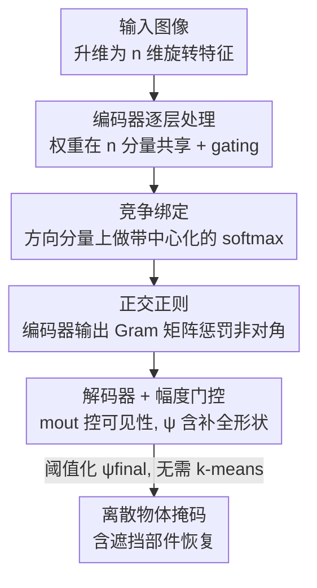

# OrthoRF: Exploring Orthogonality in Object-Centric Representations

**会议**: ICLR 2026  
**OpenReview**: [https://openreview.net/forum?id=GjQ5JXpRQF](https://openreview.net/forum?id=GjQ5JXpRQF)  
**代码**: 待确认  
**领域**: 自监督 / 表示学习 / 物体中心学习 / 无监督物体发现  
**关键词**: 物体中心学习, 同步绑定, 旋转特征, 正交约束, 遮挡补全

## 一句话总结
在 Rotating Features（旋转特征）这类"用相位同步来绑定物体"的无监督物体发现框架上，OrthoRF 通过一个 softmax 竞争绑定 + 一个内积正交损失，强制让不同物体在 n 维方向空间里彼此正交、各占一个维度，从而免去事后 k-means 聚类、在重叠/噪声/分布外场景下匹配或超过现有方法，并且额外能在中间表示里把被遮挡的物体部件补全出来。

## 研究背景与动机

**领域现状**：把场景拆成一个个物体（Object-Centric Learning, OCL）是计算机视觉的老问题，核心是"绑定问题"——如何把颜色、形状、纹理这些分散特征整合成一个统一的物体感知。当前两大流派：一是 **slot 派**（Slot Attention 等），用一组离散槽向量，一个槽对应一个物体，输出天然离散好用；二是 **同步派**（synchrony-based），受神经科学"神经同步"启发，把物体归属编码进复值/向量值激活的**相位**里，靠激活相加时的相长/相消干涉，让同物体特征相位对齐、异物体相位分离。代表工作是复值自编码器 CAE 和它的向量值升级版 **Rotating Features（RF）**。

**现有痛点**：同步派虽然灵活，但产出的是**分布式表示**——一个物体的信息散布在多个方向维度上，没法直接拿来用，必须在相位空间里做**事后 k-means 聚类**才能恢复物体。这条流水线很脆弱：一个物体可能占好几个维度（冗余、边界模糊），尤其在物体**重叠区域**，特征会漂离聚类中心、归属变得不确定，导致很多评测干脆把重叠区排除掉——而这恰恰是最需要鲁棒绑定的地方。

**核心矛盾**：分布式编码带来的灵活性，和"可直接使用、在重叠区可靠"之间存在矛盾。RF 把绑定靠 gating 机制实现，可解释性差；改进版 cosine binding 虽然透明，但要存大量相似度，内存开销大。

**切入角度**：作者注意到，已有证据表明**正交性**能提升表示效率、促进解耦。如果在 RF 的方向空间里强加正交约束，让每个物体"坍缩"到 n 维方向空间的单一维度上，是不是就能既保留 RF 的优点（相位同步、遮挡线索），又消除冗余、去掉聚类、把重叠区的不确定性反过来变成遮挡恢复的可靠信号？

**核心 idea**：在旋转特征的方向空间里施加正交归纳偏置——用 softmax 竞争把每个物体逼到单一方向分量上（近似 one-hot 编码），再用内积损失强制各物体方向轴之间相互 90° 正交。

## 方法详解

### 整体框架

OrthoRF 建立在 RF 自编码器之上。RF 的基本盘是：把每个标量特征"升维"成 n 维向量 $z_{rotating}\in\mathbb{R}^{n\times d}$，向量的**模长** $m=\|z_{rotating}\|_2$ 扮演普通神经激活（编码特征存在与否），向量的**方向**编码物体归属。每一层用一组在 n 个分量上共享的权重 $w$ 处理输入，并通过 gating 机制让方向相近的特征互相增强、方向相异的互相抑制（式 1–5）；最后用末层激活的逐像素模长重建图像，训练只用一个 MSE 重建损失 $L_{REC}$。物体发现则靠对 $z_{final}$ 做 k-means。

OrthoRF 在这套自编码器骨架上只动两处、加一项损失：**(i) 竞争绑定**——在每层方向分量上加 softmax，把"物体↔分量"的分配变成一场离散竞争，逼每个物体专属一个分量；**(ii) 正交正则**——在编码器输出处用内积损失惩罚不同方向分量之间的相似度，强制它们 90° 分离。两者合力让同物体特征集中到单一维度，产生类 one-hot 的物体编码，于是**无需事后聚类**，且中间表示 $\psi_{final}$ 能露出被遮挡的物体形状。

### 关键设计

**1. 方向空间的竞争绑定：用带中心化的 softmax 把物体逼进单一分量**

针对"一个物体散布在多个维度、必须事后聚类"这个痛点，OrthoRF 借鉴多分类里 softmax 把 logits 映射成类别分布、以及 Slot Attention 里槽之间竞争的思路，在**每一层**的方向分量上施加 softmax，制造"赢者通吃"式的分配，逼每个物体在各特征上专属一个方向分量。具体地，在式 1 得到中间输出 $\psi\in\mathbb{R}^{n\times d}$ 后（行 $i$ 是方向分量、列 $j$ 是特征），对每个特征 $j$ 沿分量做 softmax，并先减去该特征的均值 logit：

$$\psi'_{ij}=\frac{\exp(\psi_{ij}-\bar\psi_j)}{\sum_{k=1}^{n}\exp(\psi_{kj}-\bar\psi_j)},\qquad \bar\psi_j=\frac1n\sum_{k=1}^{n}\psi_{kj}.$$

这里的**中心化**（只施加在编码器输出向量上）是关键稳定器：直接 softmax 容易"分量坍缩"——所有特征都被映射到同一个分量、其他分量永远闲置。减去逐特征均值能去掉让单个分量独大的偏置（这一招借自 DINO 的 centering），从而避免坍缩、让各分量都被用上。

**2. 内积正交正则：用 Gram 矩阵非对角项把各物体轴拉到 90° 分离**

光有竞争还不够把物体"摆正"，作者在编码器输出处再加一个正交损失——之所以选编码器输出，是因为这一阶段聚合了全局特征、维度更低、算起来便宜。对编码器输出 $z\in\mathbb{R}^{bs\times n\times z_{dim}}$，先沿方向分量做中心化得到 $\tilde z$，再把一个样本的 n 个方向向量堆成 $\tilde Z_i\in\mathbb{R}^{n\times z_{dim}}$ 的行，构造 Gram 矩阵 $G_i=\tilde Z_i\tilde Z_i^\top\in\mathbb{R}^{n\times n}$。其非对角元 $(G_i)_{k\ell}$ 就是分量 $k,\ell$ 之间的（未归一化）内积；若不同分量编码不同信息，这些内积理应趋近 0。于是惩罚非对角项的平方质量：

$$L_{ortho}=\frac{1}{bs\,n(n-1)}\sum_{i=1}^{bs}\sum_{k\neq\ell}(G_i)^2_{k\ell}.$$

平方再平均会把跨分量相似度往 0 压，等于给嵌入去相关、促成正交。总目标在重建损失上加权这一项：$L_{total}=L_{REC}+\lambda L_{ortho},\ \lambda>0$。直观上，这把"每个物体 = 一个正交方向轴"从一种隐式倾向变成了显式约束。

**3. 幅度门控带来的遮挡补全：把重叠区的不确定性变成可读的遮挡线索**

这是 OrthoRF "白捡"的涌现性质。在末层绑定步（式 5）$z_{out}=m_{out}\odot\frac{\psi}{\|\psi\|_2}$ 中，模长 $m_{out}$ 实际充当一个**可见性门**：可见区域通过、被遮挡区域被抑制；而**门控之前**的内容 $\psi$ 却保留了**遮挡补全后的完整形状**。一个合理解释是：$\psi$ 是在重建目标下从学到的形状先验预测出来的，会把遮挡物背后的部分也补上，而 $m_{out}$ 只负责编码"看得见没"。这种选择性行为依赖方向通道上的 softmax（竞争绑定）才能在末层得到干净的门控。正因如此，OrthoRF 对中间图 $\psi_{final}$ 直接以 0.1 阈值二值化就能拿到掩码（阈值只用于二值化，物体在 $\psi_{final}$ 里本已解耦），无需任何 k-means——这也是 slot 派和此前同步派都没展示过的能力：恢复被遮挡的物体部件。

此外，由于权重在所有方向分量上共享、每个分量处理方式相同，OrthoRF 像 Slot Attention 一样具备对方向分量的**置换等变性** $f(\Pi x)=\Pi f(x)$。

### 损失函数 / 训练策略
总损失为重建 MSE 加正交项 $L_{total}=L_{REC}+\lambda L_{ortho}$，$\lambda$ 随数据集在约 0.08–0.8 间取值（物体/维度多时调小）。用卷积自编码器实现，Adam 优化、batch size 16、训练 100–200k 步，配 CosineAnnealingLR 学习率衰减；实验在单张 NVIDIA Tesla T4（16GB）、PyTorch 上完成。

## 实验关键数据

### 主实验

在 4Shapes 上对比可见区物体发现与形状补全（$MBO^{OV}_i$ 衡量含重叠区的整物体恢复），OrthoRF 在可见区与 RF 持平，但在形状补全上大幅领先：

| 设置 / 模型 | n | ARI-BG ↑ | MBOi ↑ | MBO$^{OV}_i$ ↑ |
|------|---|---------|--------|---------|
| RF (k-means, $z_{final}$) | 5 | 0.975 | 0.934 | 0.805 |
| OrthoRF (k-means, $z_{final}$) | 5 | 0.9995 | 0.989 | 0.820 |
| OrthoRF (阈值化 $\psi_{final}$) | 5 | 0.993 | 0.984 | **0.983** |

关键在最后一列：用阈值化 $\psi_{final}$，OrthoRF 的 $MBO^{OV}_i$ 在 n=5 时达到约 0.98，而 RF/OrthoRF 的 $z_{out}$ 都只有约 0.80。原因是 k-means 强制每像素单标签，重叠区只能算给一个物体；阈值化 $\psi_{final}$ 则允许重叠区多标签，自然提升重叠区指标。另外当 n 远大于物体数（如 n=20）时，OrthoRF 仍稳，RF 明显退化。

跨数据集结果同样占优：

| 数据集 | 模型 | ARI-BG ↑ | MBOi ↑ |
|--------|------|---------|--------|
| SEM 无噪 | RF / OrthoRF | 0.955 / **0.991** | 0.683 / **0.717** |
| SEM 含噪 | RF / OrthoRF | 0.694 / **0.761** | 0.415 / **0.564** |
| Shapes(2–4物体, n=8) | RF / OrthoRF | 0.744 / **0.833** | 0.780 / **0.865** |
| MNIST&Shape | RF / OrthoRF | 0.972 / **0.996** (ARI-BG) | — |

在 SEM（半导体堆叠材料层，重度遮挡）上 OrthoRF 还展现强分布外泛化：干净训练→噪声测试 ARI-BG 仅从 0.991 微降到 0.984；反向（噪声训练→干净测试）下降更多（0.836→0.761），可能因噪声训练学到平滑边界、欠拟合清晰锐边。MNIST&Shape 上 SA、DBM 都失败（SA 因 MNIST 数字超出感受野、且不擅长灰度输入）。

### 消融实验

4Shapes 上拆解"带中心化的 softmax(SC)"与"正交损失(λ)"两个组件：

| SC | λ | MSE ↓ | ARI ↑ | MBOi ↑ | 说明 |
|----|---|-------|-------|--------|------|
| No | 0 | 0.0005 | 0.975 | 0.934 | RF 基线 |
| No | 0.1 | 0.0002 | 0.853 | 0.868 | 只加正交损失，反而掉 |
| Yes | 0 | 0.0034 | 0.628 | 0.688 | 只加竞争 softmax，崩 |
| Yes | 0.1 | 0.0002 | **0.9995** | **0.9887** | 两者合用，近乎完美 |

### 关键发现
- **两个组件缺一不可且强协同**：单独加 softmax 竞争（ARI 0.628）或单独加正交损失（ARI 0.853）都不如 RF 基线，只有二者合用才冲到近乎完美的 0.9995——竞争负责把物体逼向单分量，正交负责把这些分量摆正，互为前提。
- **正交性确实被装进了表示**：相位空间平均成对余弦角，4Shapes 上 OrthoRF 达 86.86°±4.39（接近 90°、方差小），RF 仅 69.28°±13.91（散且不正）；类间/类内角度上 OrthoRF 类内角仅 1.09°（簇极紧），RF 高达 106° 且方差巨大。
- **遮挡恢复是免去 k-means 的直接红利**：把"重叠区不确定性"通过门控前的 $\psi$ 转成了可读的补全形状，这是 slot 派与此前同步派都没有的能力。

## 亮点与洞察
- **把"事后聚类"这步从流水线里彻底删掉**：以往同步派最别扭的就是必须 k-means 才能取出物体，OrthoRF 用正交约束让物体在训练时就各占一轴，输出阈值化即得掩码——这是工程上很实在的简化。
- **重叠区不确定性 → 遮挡线索的转化很妙**：别人把重叠区当噪声排除，作者反而从门控前的 $\psi$ 里读出被遮挡部件，"缺点变特征"。
- **中心化防坍缩这招可迁移**：在竞争式分配里减去逐特征均值 logit 来防止单分量独大（借自 DINO），凡是用 softmax 做无监督专门化分配的场景都可借鉴。
- **正交作为简单归纳偏置**：没有引入复杂模块，只是一个内积损失加一层 softmax，就把分布式编码改造成近 one-hot 离散编码，说明"正交"对同步派 OCL 是个便宜又有效的先验。

## 局限与展望
- 评测集中在合成/半合成数据（4Shapes、MNIST&Shape、Shapes、合成 SEM），都是几何形状或受控场景，未在自然图像（如真实照片、复杂纹理）上验证，泛化到真实复杂场景仍是问号。
- 方向维度 n 需大致匹配物体数：n 小于物体数时 OrthoRF 反不如 RF 的分布式表示，等于把"物体上限"作为超参，对物体数未知/变化大的场景不够友好。
- $\lambda$ 需随数据集手调（0.08–0.8），背景维度普遍角度偏小、区分度弱，说明约束在"背景 vs 物体"上不够对称。
- 噪声训练→干净测试退化明显，提示对训练分布的边界锐度较敏感。

## 相关工作与启发
- **vs RF（Rotating Features）**：同样用向量值旋转特征 + gating，但 RF 产出分布式表示、必须 k-means，重叠区表现差且 gating 难解释；OrthoRF 加竞争 softmax + 正交损失把表示离散化，免聚类、补遮挡、n 大时更稳。
- **vs CAE（复值自编码器）**：CAE 用复值激活（2D 相位平面），OrthoRF 继承 RF 的 n 维方向空间扩展了表示容量，并显式正交化；4Shapes/MNIST&Shape 上均超过 CAE。
- **vs Slot Attention（slot 派）**：SA 一槽一物天然离散，但靠注意力竞争而非相位同步，且在 MNIST&Shape 上因感受野/灰度问题失败；OrthoRF 把"离散、可置换等变"这些 slot 派优点用同步派的方式实现，还多了遮挡补全。
- **vs AKOrN / ItrSA（Miyato 2024）**：AKOrN 是基于 Kuramoto 振子的同步派，OrthoRF 在物体数与形状随机变化的 Shapes 上（ARI-BG 0.833 vs 0.713）更优。

## 评分
- 新颖性: ⭐⭐⭐⭐ 把"正交"作为同步派 OCL 的归纳偏置、并借此免去事后聚类、解锁遮挡补全，角度清晰且落地。
- 实验充分度: ⭐⭐⭐⭐ 四个数据集 + 多 n/λ 扫描 + 相位角/可分性定量分析 + 充分消融，但缺自然图像验证。
- 写作质量: ⭐⭐⭐⭐ 动机—方法—性质—实验链条顺，公式与定性图配合好。
- 价值: ⭐⭐⭐⭐ 给同步派物体发现提供了简单可复用的正交先验，遮挡恢复对工业 SEM 等场景有实际意义。

<!-- RELATED:START -->

## 相关论文

- [\[CVPR 2026\] Towards Stable Self-Supervised Object Representations in Unconstrained Egocentric Video](../../CVPR2026/self_supervised/towards_stable_self-supervised_object_representations_in_unconstrained_egocentri.md)
- [\[ICLR 2026\] Mechanistic Independence: A Principle for Identifiable Disentangled Representations](mechanistic_independence_a_principle_for_identifiable_disentangled_representatio.md)
- [\[ICLR 2026\] A Bayesian Nonparametric Framework for Learning Disentangled Representations](a_bayesian_nonparametric_framework_for_learning_disentangled_representations.md)
- [\[ICLR 2026\] Self-Predictive Representations for Combinatorial Generalization in Behavioral Cloning](self-predictive_representations_for_combinatorial_generalization_in_behavioral_c.md)
- [\[ICLR 2026\] Midway Network: Learning Representations for Recognition and Motion from Latent Dynamics](midway_network_learning_representations_for_recognition_and_motion_from_latent_d.md)

<!-- RELATED:END -->
