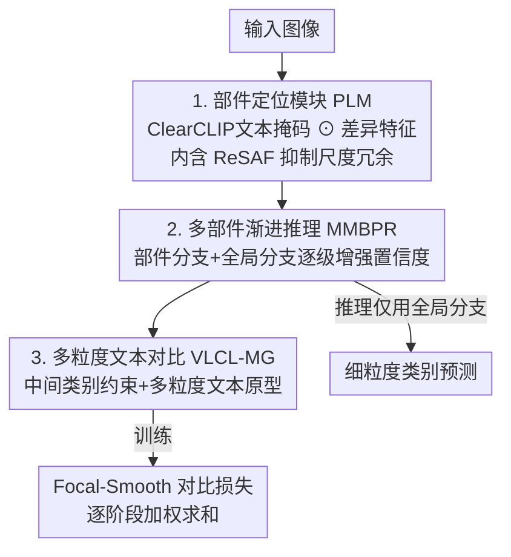

# Part-level Semantic-guided Contrastive Learning for Fine-grained Visual Classification

**会议**: ICLR 2026  
**OpenReview**: [https://openreview.net/forum?id=Bzmb5LeCKx](https://openreview.net/forum?id=Bzmb5LeCKx)  
**代码**: https://github.com/joker-lin9/PSCL  
**领域**: 细粒度视觉分类 / 视觉-语言对比学习 / 部件定位  
**关键词**: 细粒度分类, ClearCLIP, 部件定位, 多粒度文本, 对比学习

## 一句话总结
PSCL 用 ClearCLIP 把"选哪块区域"和"怎么表征区域"解耦成两条支路，再配合多尺度多部件的渐进推理和引入中间粒度类别的视觉-语言对比损失，在 5 个 FGVC 数据集上取得 SOTA 或高度竞争的精度。

## 研究背景与动机
**领域现状**：细粒度视觉分类（FGVC）要在同一大类内区分外观极其相似的子类（鸟的种、车的款、飞机的型号）。主流做法分两条线：一是多尺度特征融合 / 注意力机制（PMG、TransFG 等）做精细特征表示，二是弱监督的部件定位（裁剪显著区域再放大重处理）来抓判别性局部。

**现有痛点**：作者观察到模型在"刚性物体"（飞机、汽车）和"非刚性物体"（鸟、狗）上表现出明显的特征偏好。FGVC 实际需要两类特征——① **部件级细粒度特征**刻画局部细节差异，② **空间关系特征**刻画类间的结构差异。但既有方法把这两者搅在一起：空间关系特征依赖跨类别匹配共享区域，会和部件细节的精确表示**互相冲突**，对非刚性物体尤其严重（姿态变化让空间结构本就不稳定）。

**核心矛盾**：① 部件表征与空间关系表征争抢同一套特征，定位与分类共用一个特征提取器，导致部件"弱接地"、偏向分类目标，在遮挡 / 姿态变化下同一支路在不同图上会盯住不同部件，造成冗余和训练不稳；② 现有方法对所有类别用统一的部件分支设计，忽视了相似类别之间部件细节的同质性，分支间表示冗余。

**本文目标**：把区域选择从特征表示中解耦出来，让每个部件分支语义上锚定到一个固定部件；同时压低多分支冗余，并把"类间差异"约束到符合真实世界的语义层级上。

**切入角度**：作者发现 ClearCLIP（去掉 CLIP 残差连接、启用自注意力、去掉 FFN 的免训练开放词表分割变体）不仅能做物体级分割，对**部件级语义概念**同样有效——于是可以用文本提示（如 "engine"、"landing gear"、"head"）直接、可控地选出部件区域。

**核心 idea**：用文本可控的 ClearCLIP 部件掩码做"语义引导的区域选择"，把它与解耦后的差异特征做 Hadamard 乘积得到多尺度多部件特征，再经渐进推理与"引入中间粒度类别"的视觉-语言对比损失收敛到真实语义层级。

## 方法详解

### 整体框架
PSCL（Part-level Semantic-guided Contrastive Learning）是一条"视觉 + 文本"双通路的 FGVC 框架。视觉通路里，输入图像同时送进 backbone 和 ClearCLIP：backbone 产出多尺度差异特征，ClearCLIP 用文本提示算匹配分数、做通道选择生成部件掩码，两者 Hadamard 相乘得到多尺度多部件特征（这一整块是部件定位模块 PLM）。这些特征进入多尺度多部件渐进推理模块 MMBPR，从低层到高层逐级增强预测置信度，部件分支抓局部、全局分支按空间关系聚合。文本通路里，把每个细粒度标签对应的多粒度文本（粗 / 中 / 细三级）经 ClearCLIP 文本编码器编码、重排，作为对比学习的原型，约束视觉特征向真实语义层级对齐（VLCL-MG）。训练时三处协同优化 Focal-Smooth 对比损失；推理时只保留全局分支、丢弃 ClearCLIP 和冗余部件分支，从而显著加速。

### 关键设计

**1. 部件定位模块 PLM：用文本可控的 ClearCLIP 把"选区域"和"表征区域"解耦**

这一设计直击"部件表征与空间关系表征争抢同一套特征、定位与分类共用一个提取器导致部件弱接地"的痛点。PLM 把输入 $x \in \mathbb{R}^{C\times H\times W}$ 拆成两条独立支路：一条负责**差异特征**（backbone 产出多尺度 $f_s \in \mathbb{R}^{C_s\times H_s\times W_s}$，当低层特征对分类无益时可只取较高阶段 $s\in\{s_{min},\dots,4\}$），另一条负责**部件定位**（ClearCLIP）。定位支路里，图像经图像编码器得 patch 级特征 $F_{img}$，$N$ 个部件文本提示经文本编码器得 $F_{text}$，算相似度张量 $S = F_{img}F_{text}^\top \in \mathbb{R}^{H\times W\times N}$，对 $N$ 个通道取 argmax 得到 one-hot 掩码，再经形态学 $M = (S\oplus K)\ominus K$（先膨胀后腐蚀，$3\times3$ 核）去噪精炼连通性。最终多尺度多部件特征为 $G_{s,n'} = \text{concat}(f'_s\odot M_{s,n},\; f'_s\odot \mathbf{1})$，其中 $\mathbf{1}$ 是全 1 的全局掩码、$f'_s\odot\mathbf{1}$ 捕获全局特征。这样每个部件分支锚定一个预定义部件，遮挡部件可通过掩码直接"失活"，定位与表示解耦后优化更稳定——而像 PART 那样靠类激活图 + 显著性排序选区域，无法保证跨样本的语义一致性。

PLM 内部还嵌了 **ReSAF（Reverse-key Scale-aware Attention Fusion）** 来压尺度间冗余：它把 key 向量方向翻转，从而把相似度分数取反，引导高层 query "避开"与低层语义相似的区域、转而从不相似区域抽取互补信息。消融显示 ReSAF（95.14%）优于普通 MLP（94.71%）和标准 Cross-Attention（94.99%）。

**2. 多尺度多部件渐进推理 MMBPR：让高层分支在不受低层干扰的情况下逐级变自信**

针对"多分支共享提取器、相似类别部件同质导致分支冗余"的问题，MMBPR 在 PMG / PART 的多尺度渐进框架上扩展，既有部件分支建模局部细粒度，又有全局分支按空间关系聚合部件信息。沿 ViT 架构，每个分支用 3 个可学习的 class token 来综合表示中间类别。推理从最低层特征 $G_{s_{min},n'}$ 起步：把特征 flatten 成 token 与 class token 拼接成 $Z$，经 Encoder 层（MHSA + MLP + LayerNorm，且**层间权重不共享**）输出后分成两部分——class token $I_{s,n'}$ 送去 VLCL-MG 做对比，特征 token 则**前传到下一阶段**与更高层 flatten 特征拼接，递归直到最高层完成推理。这种"低层 class token 不污染高层、只把特征 token 往上传"的设计保证了高层分支能获得更强判别力、给出更自信的类别表示，部件分支和全局分支都走这套渐进流程。

**3. 多粒度文本对比学习 VLCL-MG：用中间粒度类别把类间差异约束到真实语义层级**

为解决"绝对模型输出会不必要地放大类间距离、相似子类易错分"的问题，VLCL-MG 引入**中间粒度类别概念**。例如在粗类 airplane 和细类 Boeing 737-200 之间，插入中间类别 narrow-body airliner 与 twinjet——这种专家知识只需每类检索一次（大多数数据集用 ChatGPT-4o 半自动获取，NABirds 直接用其自带类层级），无需逐图标注。每个细类的多粒度标签 $t_{cls}=\{a_{n_A}, b_{n_B}, f_{n_F}\}$ 经文本编码器得特征后，**减去粗类特征再归一化** $T_{n_F}=\text{norm}(t_{n_F}-f_{text}(coarse))$，避免各粒度文本在嵌入空间挤成一团、让文本嵌入分布更具判别性。预测概率由投影后的视觉特征与文本原型的相似度经带可学习温度 $\tau$ 和偏置 $\beta$ 的 softmax 给出：$P_{s,n',c}=\sigma(\tau\odot(WI_{s,n'})T_{n_F}^\top + \beta)_c$。

配套的 **Focal-Smooth 对比损失**把 label smoothing 和 focal loss 揉进对比目标：$\text{FSL}_s = -\sum_{n'}\sum_c (1-P_{s,n',c})^\gamma\, \tilde{y}_{s,n',c}\log P_{s,n',c}$，其中 focal 因子 $\gamma$ 让模型更关注难样本（缓解小样本过拟合），平滑目标 $\tilde{y}$ 的噪声 $\epsilon_s$ 随阶段 $s$ 增大而**递减**（高阶段更自信，缓解"top-1 错但真类分数只低一点"的问题）。最终损失为各阶段加权和 $L_{final}=\sum_{s=s_{min}}^{4}\tilde{\epsilon}_s\cdot\text{FSL}_s$，权重 $\tilde{\epsilon}_s$ 随阶段递增。推理时只用最后阶段全局分支 $P_{inference}=P_{s=4,\,n'=0}$。

### 损失函数 / 训练策略
训练用 AdamW、100 epoch、batch 16、weight decay 0.01；RN50 学习率 $1\times10^{-4}$、ViT-B / Swin-B 为 $1\times10^{-5}$；10 epoch warm-up + cosine 退火。focal 因子 $\gamma=4$，平滑噪声 $\epsilon_s=[0.4,0.3,0.2,0.1]$，多尺度损失权重 $\tilde{\epsilon}_s=[0.1,0.2,0.4,1.0]$。输入分辨率 RN50 为 $448$、Swin-B 为 $384$、ViT-B 默认 $518$。

## 实验关键数据

### 主实验
在 AIR / CAR / CUB / NAB / DOG 五个 FGVC 数据集、三种 backbone 上对比 SOTA（准确率 %）：

| Backbone | 方法 | AIR | CAR | CUB | NAB | DOG |
|----------|------|-----|-----|-----|-----|-----|
| RN50 | SIA-Net | 94.3 | 95.5 | **90.7** | – | – |
| RN50 | **PSCL** | **95.1** | **95.6** | 89.1 | **89.0** | **90.1** |
| ViT-B(448) | ACC-ViT | – | 94.9 | 91.8 | 91.4 | **92.9** |
| ViT-B(448) | **PSCL** | 94.3 | 95.1 | **92.2** | **92.5** | 91.0 |
| ViT-B(518) | **PSCL** | **96.5** | **96.4** | **92.3** | **93.7** | 92.3 |
| Swin-B | CSQA-Net | 94.7 | **95.6** | 92.6 | 92.3 | – |
| Swin-B | **PSCL** | **95.3** | 95.5 | **93.0** | **93.8** | **94.7** |

PSCL 在 Transformer backbone 下提升尤其明显，ViT-B(518) 在 AIR 上达 96.5%；在 CNN 的 RN50 上也保持竞争力（AIR / CAR 领先）。非刚性数据集 CUB / NAB 的强表现说明 PSCL 确实更好地建模了非刚性物体特性；NAB 因有精确的专业类层级，VLCL-MG 的中间层分组收益最大。

### 消融实验
三个 backbone × 三个数据集逐模块消融（节选 CUB / AIR / CAR，RN50）：

| PLM | MMBPR | VLCL-MG | CUB | AIR | CAR | 说明 |
|-----|-------|---------|-----|-----|-----|------|
| ✗ | ✗ | ✗ | 85.09 | 91.56 | 91.90 | baseline |
| ✓ | ✗ | ✗ | 88.82 | 94.54 | 95.46 | 仅部件定位即大涨 |
| ✗ | ✗ | ✓ | 87.90 | 94.39 | 95.32 | 仅多粒度对比也显著 |
| ✓ | ✓ | ✗ | 89.09 | 94.54 | 95.54 | 加渐进推理 |
| ✓ | ✓ | ✓ | **89.13** | **95.14** | **95.59** | 完整模型 |

### 关键发现
- **PLM 和 VLCL-MG 单独都能大幅涨点**（RN50/CUB 从 85.09 分别到 88.82 / 87.90），但二者叠加边际收益递减——因为同属一类的细类常共享相似部件结构（雁形目鸟都有蹼足长颈、越野车都有高底盘越野胎），两模块都在解同一个底层问题。
- **平滑噪声 $\epsilon_s$ 必须是"高阶段递减"的形态**：全 0（无平滑）在 AIR 上只有 89.92%，而 $[0.4,0.3,0.2,0.1]$ 达 95.14%，证明渐进式置信度增强是关键。
- **focal 因子 $\gamma=4$** 时精度最高，说明加大对难样本的关注确有帮助。
- **效率**：ClearCLIP 约 17.35 GFLOPs、MMBPR 为 $15.72\times(N{+}1)$、ReSAF 5.78 GFLOPs；推理时丢弃 ClearCLIP 与冗余部件分支，整体开销与同期 Transformer 相当。

## 亮点与洞察
- **把开放词表分割工具"降维"用到部件级**：作者实证 ClearCLIP 对部件语义概念同样有效，从而用一句文本提示就能可控选区域，把"选区域"和"表征区域"彻底解耦——这是比 CAM / 显著性排序更稳的部件接地方式。
- **"中间粒度类别"是几乎零成本的先验注入**：每类只需一次检索（甚至直接用数据集自带层级），就把类间几何约束对齐到真实分类学层级；减去粗类特征再归一化的小技巧防止各粒度文本塌缩，值得迁移到其他需要层级语义的检索 / 分类任务。
- **训练重、推理轻**：靠 ClearCLIP 和多部件分支在训练阶段做语义引导，推理只留全局分支，兼顾精度与速度。

## 局限与展望
- 作者承认：超参（除学习率外）全部只在 AIR + RN50 上搜定后直接迁移到其它数据集，若针对目标数据集单独调参，PSCL 还能更好——反过来说当前结果未必是各数据集上限。
- PLM 与 VLCL-MG 在低冗余设定下效果重叠、边际收益递减，模块间存在功能交叉，三者并非完全正交。
- 自己发现的局限：部件文本提示（mouth / head / engine / landing gear 等）需要人工预定义，对全新领域（无现成部件词表 / 无类层级）的可扩展性、以及 ChatGPT-4o 生成中间类别的噪声影响，论文未充分评估。

## 相关工作与启发
- **vs PART / 显著性排序类方法**：它们靠类激活图 + 显著性选区域，跨样本语义不一致、遮挡 / 姿态变化下分支漂移；PSCL 用文本 + ClearCLIP 做语义接地的可控部件选择，并把区域选择与表示学习解耦，优势是部件稳定、可按掩码失活遮挡部件。
- **vs MP-FGVC（CLIP 进闭集 FGVC）**：MP-FGVC 用多模态提示增强类别判别但停在物体级；PSCL 把 CLIP 系能力下沉到部件级定位，并额外引入中间粒度类别约束语义层级。
- **vs PMG / TransFG 等多尺度方法**：PSCL 复用其多尺度渐进推理思路，但补上 ReSAF（反 key 抑制尺度冗余）和部件 / 全局双分支分工，解决了"部件细节与空间关系争特征"的核心冲突。

## 评分
- 新颖性: ⭐⭐⭐⭐ 把 ClearCLIP 用于部件级定位 + 中间粒度类别约束的组合较新颖
- 实验充分度: ⭐⭐⭐⭐ 5 数据集 × 3 backbone + 逐模块 / 超参消融较完整，但超参只在单一数据集搜
- 写作质量: ⭐⭐⭐⭐ 模块动机清晰、公式完整，符号略多
- 价值: ⭐⭐⭐⭐ 在多个 FGVC 基准上 SOTA，文本可控部件接地的思路可迁移

<!-- RELATED:START -->

## 相关论文

- [\[CVPR 2026\] From Few-way to Many-way: Rethinking Few-shot Fine-grained Image Classification](../../CVPR2026/self_supervised/from_few-way_to_many-way_rethinking_few-shot_fine-grained_image_classification.md)
- [\[CVPR 2026\] Nonparametric Deep Fine-grained Clustering with Low-Rank Guided Vision-Language Model](../../CVPR2026/self_supervised/nonparametric_deep_fine-grained_clustering_with_low-rank_guided_vision-language_.md)
- [\[ICML 2026\] PartCo: Part-Level Correspondence Priors Enhance Category Discovery](../../ICML2026/self_supervised/partco_part-level_correspondence_priors_enhance_category_discovery.md)
- [\[AAAI 2026\] FineXtrol: Controllable Motion Generation via Fine-Grained Text](../../AAAI2026/self_supervised/finextrol_controllable_motion_generation_via_fine-grained_text.md)
- [\[CVPR 2026\] Learning from Semantic Dictionaries: Discriminative Codebook Contrastive Learning for Unified Visual Representation and Generation](../../CVPR2026/self_supervised/learning_from_semantic_dictionaries_discriminative_codebook_contrastive_learning.md)

<!-- RELATED:END -->
