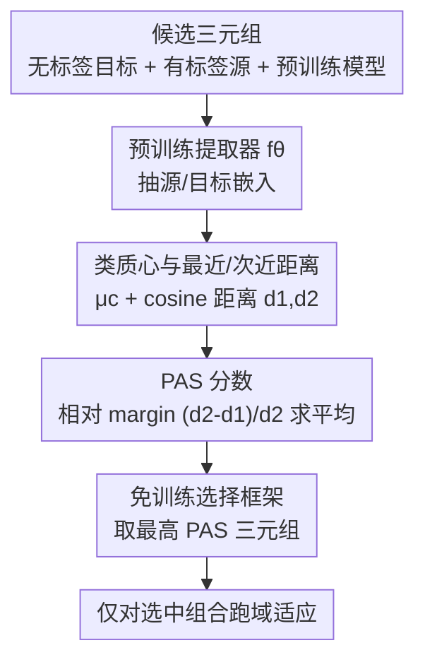

# PAS: Estimating the Target Accuracy Before Domain Adaptation

**会议**: ICLR 2026  
**OpenReview**: [https://openreview.net/forum?id=0Z2l4XtTdz](https://openreview.net/forum?id=0Z2l4XtTdz)  
**代码**: 待确认  
**领域**: 表示学习 / 迁移学习 / 域适应  
**关键词**: 可迁移性估计, 无监督域适应, 预训练特征, 源域选择, 轮廓系数

## 一句话总结
本文提出 **PAS（Potential Adaptability Score）**——一个在**真正做域适应训练之前**、仅靠预训练模型的嵌入就能算出来的非对称分数，用目标样本到各源类质心的「最近 / 次近距离相对间隔」衡量源域与预训练模型对某个无标签目标任务的可迁移性，从而在一堆候选里挑出适配后目标精度最高的「源域 + 预训练模型」组合，省去逐一训练的巨大开销。

## 研究背景与动机

**领域现状**：无监督域适应（UDA）要把有标签源域的知识迁到无标签目标域，效果高度依赖两个选择——**用哪个源域**、**用哪个预训练特征提取器**。如今公开预训练模型成百上千，架构与训练范式各异，每个都带不同的归纳偏置；可选的源域也常常不止一个。

**现有痛点**：目标域**没有标签验证集**，于是这两个选择几乎只能靠猜。三类已有思路都不好用：(1) 经典可迁移性估计分数（H-score、LEEP、LogME 等）**需要目标标签**，在 UDA 场景直接失效；(2) 把每个「源域 × 预训练模型」组合都跑一遍域适应再选最好的，**计算代价爆炸**；(3) 用 MMD、Wasserstein、CORAL 这类分布距离衡量源-目标差异，但这些度量都是**对称的**。

**核心矛盾**：可迁移性本质是**非对称**的——从简单域迁到困难域，比反过来更难；而现有分布距离对称，无法刻画这个方向性。同时，好的度量必须只用「源标签 + 无标签目标 + 预训练嵌入」就能算，不能碰目标标签。

**本文目标**：设计一个**无需目标标签、无需真正训练、且非对称**的分数，能在适配前就预测「这个三元组（目标域、源域、预训练模型）适配后能到多高精度」，并据此做选择。

**切入角度**：作者假设一个**好的预训练模型能抽取跨域不变的判别特征**——若如此，同类样本（哪怕跨域）在嵌入空间里应当聚成一簇、彼此靠近，异类样本则相互远离。于是「目标样本离它最近的源类簇有多近、且离次近的簇有多远」就成了可迁移性的信号：贴得越紧、与别的类拉得越开，说明预训练模型已经把判别结构准备好了，适配越容易成功。

**核心 idea**：借鉴聚类质量评估的 **Silhouette（轮廓）系数**，把它改造成一个能容纳「无标签目标 + 域偏移」的非对称版本，用相对距离间隔 $(d_2-d_1)/d_2$ 度量目标-源对齐程度，即 PAS。

## 方法详解

### 整体框架

PAS 的输入是「一个无标签目标域 $D_T$、一个有标签源域 $D_S$、一个预训练特征提取器 $f_\theta$」构成的三元组，输出是一个 $[0,1]$ 区间的标量分数，**分数越高、预测的适配后目标精度越高**。整条流水线完全不做任何域适应训练：先用 $f_\theta$ 把源、目标样本都映到嵌入空间；对每个源类算一个**单位长度质心** $\mu_c$；对每个无标签目标样本，量它到全部源类质心的 cosine 距离，取**最近距离 $d_1$ 与次近距离 $d_2$**；用 $(d_2-d_1)/d_2$ 在全体目标样本上求平均得到 PAS。给定一批候选源域与预训练模型，对每个三元组各算一次 PAS，**选 PAS 最高者**，再只对这一个选中组合跑域适应即可。

### 关键设计

**1. 基于预训练嵌入的类质心与「最近/次近」距离：把可迁移性变成可算的几何量**

要在没有目标标签的情况下判断目标样本「像不像」某个源类，作者先把所有样本归一化到单位长度，对每个源类 $c$ 按余弦相似度最大化的方向求一个**单位质心**（向同方向的样本会叠加增强）：

$$\mu_c = \frac{\sum_{x_i^S \in S_c^S} f_\theta(x_i^S)}{\left\|\sum_{x_i^S \in S_c^S} f_\theta(x_i^S)\right\|}.$$

再对每个目标样本 $x_i^T$ 算它到各源类质心的 cosine 距离 $\text{dist}(f_\theta(x_i^T), \mu_c) = 1 - (f_\theta(x_i^T)\cdot \mu_c)$，把这些距离从小到大排序，取**最近 $d_{1i}$** 和**次近 $d_{2i}$**。直觉是：理想情况下目标样本应该非常贴近**唯一一个**源类（它的真实类）、而离其余所有类都远——于是 $d_1$ 小、$d_2$ 大。选 cosine 而非欧氏距离是刻意的：cosine 忽略表示的模长（如图像光照强度带来的特征幅度差异）、只看角度差（真正的类间差异），且在高维下更抗「维度灾难」。

**2. PAS 分数：用相对 margin 把 Silhouette 改造成非对称、无监督版本**

有了 $d_1, d_2$，PAS 直接定义为全体目标样本上的平均相对间隔：

$$\text{PAS}(\theta, D_S, D_T) = \frac{1}{|D_T|}\sum_{i=1}^{|D_T|} \frac{d_{2i}-d_{1i}}{d_{2i}}.$$

它脱胎于 Silhouette 系数 $(b-a)/\max\{a,b\}$（$a$ 是平均簇内距离、$b$ 是最近邻簇距离），但原版 Silhouette **全监督、且为 IID 数据设计**，不能直接用于域适应。PAS 的关键改造是：把「目标样本最近的源类簇」**当作它的伪真类**，于是 $a$（这里即 $d_1$）天然小于 $b$（即 $d_2$），分数被限制在 $[0,1]$。这条公式正是把第 1 条的几何量变成单一可迁移性信号——目标样本贴某一类越紧、与次近类拉得越开，PAS 越接近 1，意味着预训练模型已经识别出跨域不变的判别特征。由于域偏移会让 $d_1$ 比 IID 情形更大，真实 PAS 值通常偏小，但它的**相对排序**才是用来选择的依据。

**3. 免训练的源域 / 预训练模型选择框架：在适配前就做决策**

PAS 的全部价值在于「**先选、后训**」。给定一个目标域和多个候选源域、多个候选预训练模型，框架对每个三元组各算一次 PAS，**直接选分数最高的那个**，然后只对这一个被选中的「源域 + 预训练提取器」组合训练一次单源域适应方法。相比「全组合都训一遍再挑」的暴力做法，这把成本从「组合数 × 一次完整训练」降到「组合数 × 一次前向 + 选一次训练」。而且 PAS 的计算复杂度对样本数是线性的，作者进一步证明只用源、目标各一个**随机子集**就能算，PAS 数值对样本量相当鲁棒、不同源域之间的相对排序保持不变，使大数据集上的快速筛选也可行。

### 损失函数 / 训练策略

PAS 本身**不涉及任何训练或优化**——它只是预训练嵌入上的一个闭式统计量。论文还给出一个 **Oracle 上界**用于验证「簇间距离 ↔ 目标精度」的关系：把 $d_1$ 换成到**真实类质心**（现实不可知）的距离、分母换成 $\max\{d_{1i}, d_{2i}\}$：

$$\text{Oracle} = \frac{1}{|D_T|}\sum_{i=1}^{|D_T|} \frac{d_{2i}-d_{1i}}{\max\{d_{1i}, d_{2i}\}}.$$

当最近类恰为真实类时 Oracle 退化为 PAS，否则更小；它给出了「用嵌入几何预测精度」这件事的天花板。

## 实验关键数据

### 主实验

在 Office-Home、Office-31、ImageCLEF、DomainNet 四个经典域适应基准上，作者收集大量已发表 SOTA 方法（DANN、MCC、CDAN 等，覆盖不同预训练 backbone）的目标精度，对每个「源-目标对 + 预训练模型」算 PAS，再统计 PAS 与平均目标精度的相关性。与对称基线 MMD、A-distance 相比，PAS 全面领先（Pearson / Spearman 相关系数）：

| 基准 | MMD | A-distance | **PAS（本文）** | Oracle* |
|------|-----|-----------|------------|---------|
| Office-Home | 0.55 / 0.51 | 0.32 / 0.17 | **0.76 / 0.81** | 0.89 / 0.90 |
| Office-31 | 0.45 / 0.53 | 0.26 / 0.35 | **0.63 / 0.78** | 0.71 / 0.86 |
| ImageCLEF | -0.14 / -0.08 | -0.13 / -0.07 | **0.44 / 0.60** | 0.78 / 0.85 |
| DomainNet | -0.09 / -0.03 | 0.07 / 0.06 | **0.53 / 0.56** | 0.21 / 0.21 |
| **总计** | 0.37 / 0.37 | 0.04 / -0.16 | **0.83 / 0.88** | 0.88 / 0.91 |

全局 Spearman 秩相关达 **0.88**，逼近用到真标签的 Oracle（0.91），而对称基线在 ImageCLEF、DomainNet 上甚至出现负相关——印证了「可迁移性需要非对称度量」的判断。在「固定域适应方法、只换 backbone」（Office-Home A→C、Office-31 W→A 上的 DANN / MCC）以及「固定 backbone、只换源域」两种设置下，PAS 都能把最高分给到最终精度最高的那个选项。

### 消融实验（设计选择，Pearson 相关）

| 配置 | Office-Home | Office-31 | ImageCLEF | DomainNet | Total |
|------|-------------|-----------|-----------|-----------|-------|
| **PAS（cosine 距离到质心）** | **0.76** | 0.63 | **0.44** | **0.58** | **0.79** |
| 换欧氏距离 | 0.70 | **0.69** | 0.27 | 0.54 | 0.68 |
| 换「到源样本平均成对距离」 | 0.66 | 0.52 | 0.12 | 0.48 | 0.66 |

把 cosine 换成欧氏距离、或把「到质心」换成「到源样本的平均成对距离」，总体相关性都掉了（0.79 → 0.68 / 0.66）。cosine 忽略模长只看角度、抗高维；质心则衡量目标样本是否对齐到簇内「主对齐方向」，二者都是 PAS 高相关的关键。

### 关键发现
- **非对称是制胜点**：对称的 MMD / A-distance 在难基准上失效（甚至负相关），PAS 通过「最近 vs 次近」的相对 margin 自然引入方向性，全局相关性翻倍以上。
- **样本子采样几乎无损**：PAS 对样本量鲁棒，少量子集即可保住源域之间的相对排序，使大数据集快速筛选可行（计算对样本数线性）。
- **失败场景诚实可辨**：ImageCLEF（尤其 P 域）含多目标图像——样本可能很贴近某个**确实出现在图中**的类质心，但真实标签是画面里的另一个物体，导致 PAS 高而精度低。这是基于「单类贴合」假设的方法的固有盲区。

## 亮点与洞察
- **把「轮廓系数」迁到无监督域适应**：用「最近源类当伪真类」这一招，让全监督 IID 的 Silhouette 自动满足 $a<b$、落到 $[0,1]$，同时引入非对称性——一个很轻却对路的改造。
- **「先选后训」的范式价值**：它把可迁移性估计真正落到 UDA 的痛点上（目标无标签 + 模型海量），一次前向即可决策，对工程选型直接有用，且声称是该设定下**第一个**可迁移性估计分数。
- **可迁移的思路**：「最近/次近相对 margin」这种无监督簇紧致度信号，可迁到任意「无标签数据 + 已知类原型」的选择问题（如开放集、伪标签质量评估、检索式分类的难度预估）。

## 局限与展望
- **只验证了图像分类**：作者承认仅在视觉单源 UDA 上测试，跨模态 / 其他任务有效性未知（缺基准与专用方法）。
- **多目标 / 标签歧义场景失效**：ImageCLEF 已暴露——当图像含多物体、最近质心非真实类时，PAS 会高估可迁移性。
- **仅限单源域适应**：尚未扩展到多源域适应（选多个源域组合），这是作者点名的未来方向。
- **依赖「好预训练模型能抽不变特征」的假设**：若所有候选预训练模型都不满足此假设（嵌入空间里类簇本就乱），PAS 的几何信号会整体失真；它度量的是相对优劣，不保证绝对可适配。

## 相关工作与启发
- **vs 经典可迁移性估计（H-score / LEEP / LogME）**：它们为迁移学习设计、**需要目标标签**做估计，UDA 场景直接不可用；PAS 只用源标签 + 无标签目标 + 预训练嵌入，填补了 UDA 下的空白。
- **vs 对称分布距离（MMD / Wasserstein / CORAL / A-distance）**：这些度量源-目标分布差异但**对称**，无法刻画「易→难比难→易更难迁」的方向性；PAS 用最近/次近相对间隔天然非对称，实验相关性全面更高。
- **vs「全组合都训一遍再选」（model selection 类）**：暴力但极慢；PAS 在适配前一次前向就给出选择，计算线性且可子采样，大幅省算力。

## 评分
- 新颖性: ⭐⭐⭐⭐ 首个面向无监督域适应的可迁移性估计分数，非对称改造轻巧对路。
- 实验充分度: ⭐⭐⭐⭐ 四基准、多 backbone、多方法 + 设计消融 + 样本量鲁棒性，并诚实给出失败场景。
- 写作质量: ⭐⭐⭐⭐ 假设、几何直觉、公式与 Silhouette 渊源讲得清楚，图示到位。
- 价值: ⭐⭐⭐⭐ 直击「无标签目标 + 海量预训练模型」的工程选型痛点，即插即用、零训练成本。

<!-- RELATED:START -->

## 相关论文

- [\[CVPR 2026\] Measure The Feature Universe: Topology-based Pseudo Labeling and Gravity Consistency for Source-Free Domain Adaptation](../../CVPR2026/self_supervised/measure_the_feature_universe_topology-based_pseudo_labeling_and_gravity_consiste.md)
- [\[ICML 2026\] Provable Accuracy Collapse in Embedding-Based Representations under Dimensionality Mismatch](../../ICML2026/self_supervised/provable_accuracy_collapse_in_embedding-based_representations_under_dimensionali.md)
- [\[ICML 2026\] Data Augmentation of Contrastive Learning is Estimating Positive-incentive Noise](../../ICML2026/self_supervised/data_augmentation_of_contrastive_learning_is_estimating_positive-incentive_noise.md)
- [\[ICLR 2026\] NEO — No-Optimization Test-Time Adaptation through Latent Re-Centering](neo_no-optimization_test-time_adaptation_through_latent_re-centering.md)
- [\[ICLR 2026\] Architecture-Agnostic Test-Time Adaptation via Backprop-Free Embedding Alignment](architecture-agnostic_test-time_adaptation_via_backprop-free_embedding_alignment.md)

<!-- RELATED:END -->
