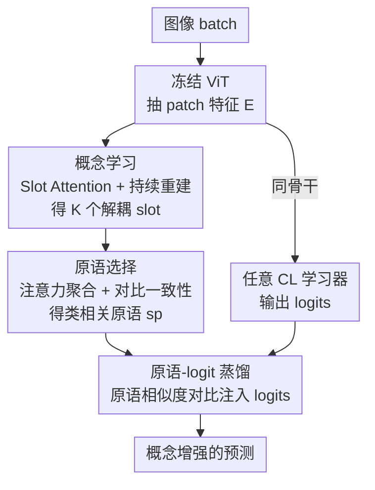

# Plug-and-Play Compositionality for Boosting Continual Learning with Foundation Models

**会议**: ICLR 2026  
**OpenReview**: [https://openreview.net/forum?id=22hBwIf7OC](https://openreview.net/forum?id=22hBwIf7OC)  
**代码**: https://github.com/liaoweiduo/CompSLOT  
**领域**: 自监督 / 持续学习 / 对象中心学习  
**关键词**: 持续学习, 组合性, Slot Attention, 概念学习, 知识蒸馏

## 一句话总结
CompSLOT 用 Slot Attention 从冻结 ViT 里无监督拆出图像的概念槽，再选出与类别相关的「原语」并把原语两两相似度对比蒸馏进任意持续学习器的 logits，从而以即插即用的方式给一大批基于基础模型的持续学习方法普遍涨点、缓解灾难性遗忘。

## 研究背景与动机
**领域现状**：基于基础模型（FM）的持续学习（CL）目前主流分三派——prompt 类（CPrompt、CODA-Prompt）、表示类（ADAM、RanPAC、EASE）、模型混合类（CoFiMA、FOSTER、DER、MEMO）。它们都依赖一个 ImageNet-21K 预训练的 ViT 骨干，靠在高维特征层面建立「类原型 / 类边界」来识别类别。

**现有痛点**：这些方法本质上是「靠比对来识别类」，而不是「把类理解成若干代表性概念的组合」。一个吉娃娃图像被当成一个整体特征去和别的类比，而不是被拆成「狗的身形 + 吉娃娃特有的小体型、头型」这种概念组合。后果是：当跨任务其实共享大量概念（如不同狗种）时，这种相关性被白白浪费；当当前任务只含少数几个类时，缺乏足够对比样本，识别更脆弱、遗忘更严重。

**核心矛盾**：持续学习的根本困境是稳定性-可塑性权衡。作者观察到一个关键事实——人脑理解世界天然带组合性，会把见过的具体物体拆解成抽象概念，从而靠「已有概念重组」快速泛化到新类。而现有 CL 方法在高维特征层做识别，既不复用跨任务共享概念，也难抵抗遗忘。

**本文目标**：回答一个研究问题——概念学习里的组合性，能不能真正提升「基础模型 + SOTA 持续学习器」的表现？要解决的子问题有三：① 在只有当前任务标签、没有分割掩码 / 文字标注这类概念级监督的前提下，怎么从图像里抽出语义概念；② 怎么从这些概念里挑出与类别真正相关的部分；③ 怎么不改动各家 CL 方法的前向框架，就把概念级理解注入进去。

**切入角度**：对象中心学习里的 Slot Attention 能无监督地把图像分解成一组解耦的 slot，每个 slot 绑定一个物体/概念。作者做了个预实验：在 COBJ 上把 Slot Attention 当持续重建任务训，发现学到的 slot 在跨任务后几乎不遗忘、同一概念的 slot 余弦相似度始终很高——这说明 slot 天生抗遗忘，是做概念级 CL 的好载体。

**核心 idea**：把「Slot Attention 抽概念 → 选类相关原语 → 原语相似度对比蒸馏进 logits」打包成一个方法无关（method-agnostic）的即插即用插件，挂在任何带 FM 骨干的 CL 方法上，让模型决策时额外参考低维概念组合而非只看高维特征。

## 方法详解

### 整体框架
CompSLOT 整体是「概念学习 + 概念知识蒸馏」两段式插件。输入是一个图像 batch，先用冻结的 ViT 骨干（同时也是 CL 学习器的骨干）抽出 patch 特征 $E$，再经 Slot Attention 解耦成 $K$ 个 slot；接着用一个可学习的注意力机制把 slot 聚合成单个「原语」表示 $s^p$（只保留类相关概念）；最后把同 batch 内原语之间的两两相似度，对比蒸馏进 CL 学习器输出的 logits 分布里。Slot Attention 和原语选择模块全局共享、跨任务只微调不扩容（架构固定，避免参数爆炸、支持长序列任务），除 ViT 骨干外都参与训练。

整个训练目标分两层：概念学习侧用持续重建损失 $L_{re}$ + 对比原语损失 $L_p$ 训 slot 与选择模块；蒸馏侧用原语-logit 对齐损失 $L_a$ + 交叉熵 $L_{ce}$ 训 CL 学习器。关键在于蒸馏只要求 CL 方法有个 FM 骨干能抽语义特征，因此对各家方法即插即用。

### 关键设计

**1. 概念学习：用 Slot Attention + 持续重建从冻结 ViT 里抠出抗遗忘的概念槽**

针对「没有概念级监督却要抽概念」这个痛点，作者直接把 ViT 输出的 patch 特征 $E=f(x|\theta_f)[1:]\in\mathbb{R}^{N\times D}$ 喂给 Slot Attention，迭代地把 $N$ 个 patch 聚合进 $K$ 个 slot $S\in\mathbb{R}^{K\times D_s}$。每轮用注意力掩码 $A=\sigma\!\left(\frac{q(S)k(E)^\top}{\sqrt{D_s}}\right)$ 沿 patch 维归一化后，用 GRU 把 patch 信息聚进 slot。监督信号只来自「重建」——把 slot 加上可学习位置嵌入后经 MLP 解码器映回 patch 空间，用掩码加权求和得重建特征 $\tilde{E}=A^\top d(S'|\theta_d)$，重建损失为 MSE：$L_{re}=\|E-\tilde{E}\|^2$。这里有意只用轻量 MLP 解码器（而非 SLATE 的自回归 transformer 或扩散解码器），把算力压到最低。作者形式化定义「概念」为图像的解耦 slot 分解（要求各 attention 区域正交、slot 之间相似度最小），并通过预实验证明：跨任务持续重建训练后，同一概念对应的 slot 表示余弦相似度始终很高、几乎不遗忘——这是整套方法成立的基石，因为很多视觉概念在不同任务里反复出现（作者称之为「概念复现 / concept rehearsal」），天然稳住了概念表示。

**2. 原语选择：注意力聚合 + 对比损失，把类相关概念压成同类一致的原语**

光有 slot 还不够——一张吉娃娃图里既有「吉娃娃头」这种类相关概念，也有「天空」这种类无关概念。作者把类相关概念叫「原语（primitive）」，并要解决两件事：怎么表示选出的原语、怎么让同类图像的原语彼此靠近。表示上用一个可学习的注意力聚合：先把 slot 经 LayerNorm + Linear + tanh 映到统一相似空间 $\bar S=\tanh(\text{Linear}(\text{LN}(S)))$，再用与可学习原语 key $K_p$ 的相似度作为权重 $w_p=\sigma(\tau_t\bar S K_p)$，加权求和得单个原语表示 $s_p=w_p^\top\bar S$；温度 $\tau_t=100/\sqrt{D_s}$ 控制选择稀疏度，越大选的 slot 越少。一致性上，作者证明「同类的最大原语集应当匹配相同」（Theorem 1），据此设计对比原语损失：把 one-hot 标签的归一化相似度 $d^y_{i,j}$ 当监督，去对齐原语 softmax 相似度 $d^s_{i,j}$，用 KL 形式的 mini-batch 聚类损失 $L_p=\sum_{x_i,x_j\in B}d^y_{i,j}\log\frac{d^y_{i,j}}{d^s_{i,j}}$ 拉近同类原语、推远异类。概念学习总损失 $L_{slot}=L_{re}+\alpha L_p$。消融显示：若把原语选择换成简单 slot 平均（avg），背景等无关概念会稀释类相关概念，AA 大幅下滑。

**3. 原语-logit 知识蒸馏：方法无关地把概念相似度对比注入任意 CL 学习器的 logits**

最后要把概念级理解灌进各家 CL 方法，且不能改它们的前向框架。作者的做法是把「原语两两相似度」当自监督，去约束学习器 logits 的相似度分布——直觉是：吉娃娃图在「其他狗类」上的 logit 应高于「猫类」，因为它们共享更多概念。具体最小化 logit 相似度 $d^l$ 与原语相似度 $d^s$ 之间的 KL：$L_a=\sum_{x_i,x_j\in B}d^s_{i,j}\log\frac{d^s_{i,j}}{d^l_{i,j}}$，其中 $l_i=h_t(H_i)$ 是当前任务 logits，$d^s$ 用带 min-max 归一化的余弦相似度 $sim^+$（而非 softmax）以锐化 slot 监督。最终训练损失 $L_{tr}=L_{ce}+\beta L_a$。由于 $L_a$ 只要求 CL 方法有 FM 骨干能抽语义特征，它对 prompt / 表示 / 模型混合三大派都通用，这正是「即插即用」的来源。

### 损失函数 / 训练策略
两组损失分工明确：概念学习侧 $L_{slot}=L_{re}+\alpha L_p$（重建 + 对比原语一致性），CL 侧 $L_{tr}=L_{ce}+\beta L_a$（任务交叉熵 + 原语-logit 对齐）。$\alpha,\beta$ 平衡各项强度，$\tau_t,\tau_p,\tau_a$ 为温度系数。Slot Attention 与原语选择模块全局共享、初始化于第一个任务，后续任务只微调参数、架构固定，从而支撑长任务序列且不参数爆炸。

## 实验关键数据

### 主实验
在 CGQA（10-10 tasks）上，CompSLOT（后缀 †）给所有 8 个 SOTA 持续学习器普遍涨点，提升最大的是 ADAM+adapter（AA 绝对增益 +7.55）：

| 方法 | AA(%)↑ | CA(%)↑ | FF(%)↓ | Hn(%)↑ | R↑ |
|------|--------|--------|--------|--------|-----|
| ADAM+adapter | 41.93 | 53.98 | 13.80 | 68.65 | 0.932 |
| ADAM+adapter † | **49.48** | 60.99 | 12.90 | 74.34 | 0.958 |
| RanPAC | 65.81 | 75.50 | 10.52 | 78.87 | 1.016 |
| RanPAC † | **66.75** | 76.58 | 10.22 | 79.82 | 1.032 |
| CoFiMA | 65.11 | 73.23 | 15.25 | 86.71 | 1.011 |
| CoFiMA † | **66.17** | 74.32 | 14.20 | 88.30 | 1.017 |
| FOSTER* | 60.86 | 68.80 | 2.44 | 89.79 | 1.087 |
| FOSTER* † | **66.29** | 71.83 | 6.47 | 89.91 | 1.154 |
| CPrompt | 46.75 | 60.18 | 15.67 | 78.06 | 0.964 |
| CPrompt † | **48.54** | 61.48 | 18.32 | 79.09 | 0.969 |

CompSLOT 不仅压低遗忘 FF，更靠更高的 Hn / R（组合泛化分）说明性能增益来自更强的组合泛化能力。

### 消融实验
在 CGQA 上对 RanPAC / CPrompt 拆解各组件（节选 RanPAC）：

| 配置 | AA(%)↑ | R↑ | 说明 |
|------|--------|-----|------|
| +param（仅扩容、无 La） | 65.08 | 1.010 | 排除「涨点只因参数变多」 |
| avg（去 Lp，slot 平均）+La | 58.22 | 0.969 | 无原语选择，无关概念稀释 |
| cos 加权 +La | 63.91 | 0.989 | 余弦加权不如 softmax |
| soft（完整模型） | **66.75** | **1.032** | softmax 凸组合最稳 |

### 关键发现
- **原语选择是命门**：去掉 $L_p$ 改用 slot 平均（avg），AA 从 66.75 跌到 58.22，因为背景等类无关概念会稀释类相关概念、制造混淆。
- **softmax 加权最优**：相比 sigmoid / sign 量化 / 余弦，softmax 给出 slot 的凸组合，把原语表示约束在合适范围，训练更稳。
- **抗遗忘来自概念复现**：同一视觉概念跨任务反复出现，稳住了原语选择权重，即便类标签变化、即便 slot 模块跨所有任务全局共享，5-5 长序列任务上仍稳定涨点。
- **+param 对照证明增益非来自容量**：单纯把 RanPAC/CPrompt 隐藏维扩到和 † 版同参数量，并不能复现 CompSLOT 的提升。

## 亮点与洞察
- **把「抗遗忘」外包给 Slot Attention**：作者用预实验先证明 slot 表示天生跨任务稳定，再把它当概念载体——这是整套方法的支点，比直接在高维特征上对抗遗忘更巧。
- **真正的即插即用**：蒸馏损失 $L_a$ 只依赖「有 FM 骨干能抽特征」这一最弱假设，因此能挂到 prompt / 表示 / 模型混合三大派 8 种方法上普遍涨点，复用价值高。
- **概念复现（concept rehearsal）视角**：把「类标签在变但视觉概念在复现」点破，解释了为何无需显式 replay 也能稳住概念——这个观察可迁移到其他增量场景。
- **min-max 归一化锐化监督**：蒸馏时原语侧用 min-max 而非 softmax 来锐化 slot 监督，是个值得借鉴的小 trick。

## 局限与展望
- **依赖重建质量与 slot 数 $K$**：概念抽取建立在重建之上，$K$ 固定，复杂场景下 slot 是否仍解耦干净存疑；轻量 MLP 解码器在更难数据上可能力不从心。
- **评测偏组合性基准**：主结果重度依赖 CGQA / COBJ 这类专为组合性设计的数据集，在 ImageNet-R 等常规基准上的增益幅度需看附录，泛化到非组合任务的收益可能更小。
- **对比损失需 batch 内同类样本**：$L_p$ / $L_a$ 都是 batch 内两两相似度，当任务类数极少或 batch 同类样本稀疏时，监督信号可能变弱。
- **超参较多**：$\alpha,\beta,\tau_t,\tau_p,\tau_a$ 多个温度/权重需调，跨方法是否都用默认值即可有待更系统验证。

## 相关工作与启发
- **vs 概念瓶颈模型（CLG-CBM、SACK）**：它们靠 ChatGPT / CLIP / 分割掩码等外部概念监督或额外瓶颈模型来引入概念；本文用 Slot Attention 无监督抽概念，不需先验概念监督也不需额外瓶颈，更易与各家方法集成。
- **vs 传统 FM 持续学习（ADAM/RanPAC/EASE/CoFiMA 等）**：它们在高维特征层建类表示、忽略跨任务共享概念；本文在低维概念组合层做决策，作为插件叠加后普遍涨点并降低遗忘。
- **vs 对象中心学习改进（SLATE、扩散解码器、条件 Slot Attention）**：它们多在编码器/解码器上做重活提升分解质量；本文反其道用最轻量 MLP 解码器，证明简单设计也能显著惠及持续学习。

## 评分
- 新颖性: ⭐⭐⭐⭐ 把对象中心 slot 学习 + 原语对比蒸馏组合成方法无关 CL 插件，角度新且落地
- 实验充分度: ⭐⭐⭐⭐ 覆盖三大派 8 种方法 + 多组消融 + 概念可视化，组合性基准外的常规基准略靠附录
- 写作质量: ⭐⭐⭐⭐ 定义/定理清晰、动机连贯，公式略密但可读
- 价值: ⭐⭐⭐⭐ 即插即用、普遍涨点、开源，对 FM 持续学习社区实用价值高

<!-- RELATED:START -->

## 相关论文

- [\[CVPR 2025\] OCRT: Boosting Foundation Models in the Open World with Object-Concept-Relation Triad](../../CVPR2025/self_supervised/ocrt_boosting_foundation_models_in_the_open_world_with_object-concept-relation_t.md)
- [\[CVPR 2026\] Exemplar-Free Continual Learning for State Space Models](../../CVPR2026/self_supervised/exemplar-free_continual_learning_for_state_space_models.md)
- [\[ICLR 2026\] Regularized Latent Dynamics Prediction is a Strong Baseline for Behavioral Foundation Models](regularized_latent_dynamics_prediction_is_a_strong_baseline_for_behavioral_found.md)
- [\[ICLR 2026\] Boosting Open Set Recognition Performance through Modulated Representation Learning](boosting_open_set_recognition_performance_through_modulated_representation_learn.md)
- [\[AAAI 2026\] Robust Tabular Foundation Models](../../AAAI2026/self_supervised/robust_tabular_foundation_models.md)

<!-- RELATED:END -->
