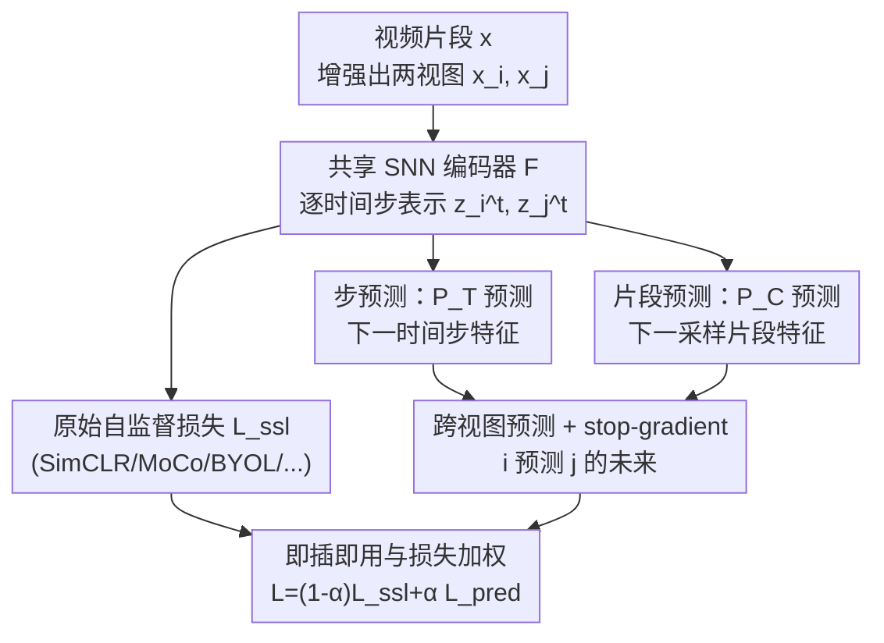

# PredNext: Explicit Cross-View Temporal Prediction for Unsupervised Learning in Spiking Neural Networks

**会议**: ICLR 2026  
**OpenReview**: [https://openreview.net/forum?id=LjugJFmItY](https://openreview.net/forum?id=LjugJFmItY)  
**代码**: 待确认  
**领域**: 自监督 / 表示学习  
**关键词**: 脉冲神经网络, 自监督学习, 时序预测, 视频表示, 特征一致性

## 一句话总结
PredNext 给脉冲神经网络（SNN）的自监督视频学习加了一个即插即用的"跨视图未来预测"模块——同时预测同一视频下一时间步和下一片段的特征，从而在不强行约束的前提下提升时序特征一致性，让深层 SNN 在 UCF101 等大规模视频上学到的无监督表示逼近 ImageNet 监督预训练的水平。

## 研究背景与动机
**领域现状**：脉冲神经网络天生带时间动力学（LIF 神经元跨时间步累积膜电位、过阈值发放脉冲），看起来是做无监督表示学习的理想载体。但目前 SNN 的无监督研究大多停留在浅层网络或局部突触可塑性规则（如 STDP），很难扩展到深层、处理复杂时序视频数据。

**现有痛点**：标准 LIF 的"积分-发放"机制太朴素，捕捉不了视频里的长程时序依赖；而且和 ANN 不同，SNN 通常不做时间下采样、保留原始时间分辨率，若缺乏合适的时序聚合，跨时间步抽出来的特征会"漂"——语义不稳定。作者在 UCF101 上观察到：模型收敛得越好，同一视频不同时间步特征的相似度（时序一致性）就越高，二者强相关（图 1）。

**核心矛盾**：既然高一致性 = 好特征，那直接在损失里加一项强制约束让各时间步特征相似不就行了？作者的实验给出反直觉答案——**强行约束一致性反而损害下游性能**。因为高质量特征的一致性应该是"语义稳定"自然涌现的结果，硬拉相似会抹掉有判别力的时序动态，得到过度简化、判别力低的表示。

**本文目标**：在深层 SNN + 大规模视频的无监督场景下，找到一种"不强制、却能提升时序一致性"的机制，同时建立 SNN 自监督学习的标准 benchmark（此前几乎空白）。

**切入角度**：借鉴预测编码（Predictive Coding）理论——语义丰富的特征应该能准确预测它"下一刻"的语义特征，而只捕捉低级动态信息的特征预测不出未来。于是把"未来预测"当作辅助目标，让一致性自然涌现而非硬约束。

**核心 idea**：用"跨视图预测未来特征"代替"强制一致性约束"来稳定 SNN 时序表示——同时预测下一时间步（Step Prediction）和下一采样片段（Clip Prediction）的特征，且让一个视图去预测另一个视图的未来。

## 方法详解

### 整体框架
PredNext 是一个**即插即用的辅助模块**，不改动原有自监督范式，只在其上叠加一路"时序预测"目标。输入是从视频里采样的一个片段 $x$，经数据增强 $H(\cdot)$ 得到两个视图 $x_i, x_j$；两个视图分别送进共享的 SNN 特征提取器 + MLP 投影头（合记为 $F$），得到逐时间步表示 $z_i^t, z_j^t$。这些表示一方面喂给原始的自监督损失 $L_{ssl}$（SimCLR / MoCo / BYOL / SimSiam / BarlowTwins 任选），另一方面接两个时序预测头：步预测头 $P_T$ 输出 $p_i^t = P_T(z_i^t)$，片段预测头 $P_C$ 输出 $c_i = P_C(\frac{1}{T}\sum_t z_i^t)$。预测目标采用**跨视图**设计：视图 $i$ 的预测去对齐视图 $j$ 的未来特征，并对目标特征施加 stop-gradient。最终损失把两路按系数 $\alpha$ 加权：$L = (1-\alpha)L_{ssl} + \alpha L_{pred}$。预测头只在训练时使用，推理时完全移除、零额外开销。

### 关键设计

**1. 步预测（Step Prediction）：让相邻时间步的特征能互相"预言"**

针对"SNN 逐时间步特征会漂、缺乏跨步约束"的痛点，步预测头 $P_T$ 把当前时间步特征映射成对未来时间步特征的预测。损失定义为预测与跨视图未来真值之间的负余弦相似度：

$$Q(p_i^t, z_j^{t+m}) = -\sum_t \frac{p_i^t}{|p_i^t|} \cdot \frac{z_j^{t+m}}{|z_j^{t+m}|}$$

其中 $m$ 是预测的时间步间隔。消融显示 $m=1$ 最优——一旦 $m>1$，相邻时间步之间就失去了相互预测的机会，模型跳过了邻近时刻，预测交互变得稀疏，性能随之下降。直觉上，这相当于强迫每个时间步的表示都"为下一刻负责"，从而把无关的瞬时抖动挤掉、留下能延续的语义。

**2. 片段预测（Clip Prediction）：跨更长时间跨度对齐语义**

步预测只看相邻时间步，覆盖的时间范围有限。片段预测头 $P_C$ 则把当前片段的时序聚合特征 $c_i = P_C(\frac{1}{T}\sum_t z_i^t)$ 拿去预测同一视频"后续采样片段"的聚合特征 $z_j^*$：

$$M(c_i, z_j^*) = -\frac{c_i}{|c_i|} \cdot \frac{z_j^*}{|z_j^*|}$$

由于它跨越的时间范围更长，能学到更丰富的时序表示。消融里片段预测单独带来的增益明显大于步预测（SimSiam 上 +3.59 vs +0.52），印证了"长跨度预测信息更密"。两路结合后还能再叠加提升，说明它们捕捉的是互补的时序结构——一个管局部连续性、一个管片段级语义延续。

**3. 跨视图预测 + stop-gradient：用"看不同增强"逼模型抽语义**

如果让 $p_i^t$ 去预测**同一视图**的未来 $z_i^{t+m}$，模型可以靠记住增强后的视图特异噪声来"作弊"，甚至直接表示坍缩。PredNext 改成**跨视图**：$i$ 的预测对齐 $j$ 的未来，并对目标特征 stop-gradient。这就要求模型忽略视图特异的噪声、只保留两个增强都共享的语义信息，从而提升判别力与泛化。消融非常说明问题：跨视图比同视图高 +1.27（UCF101）；而**去掉原始自监督目标只留同视图预测**时性能直接崩到 5.03%（−49.90），只留跨视图预测也只有 52.37%——说明跨视图预测必须和自监督目标协同，单独用会坍缩，但它是避免坍缩、逼出语义的关键。

**4. 即插即用与损失加权：一个模块挂遍五种自监督框架**

为了证明通用性，作者先把五种主流自监督方法（含对比式 SimCLR/MoCo/BarlowTwins 与无负样本的 SimSiam/BYOL）适配到 SNN（SEW ResNet 骨干），建立 benchmark；PredNext 作为辅助项以统一超参挂上去：总损失 $L = (1-\alpha)L_{ssl} + \alpha L_{pred}$，其中对称设计的 $L_{pred} = \sum_t(\frac{1}{2}Q(p_i^t, z_j^{t+m}) + \frac{1}{2}Q(p_j^t, z_i^{t+m})) + \frac{1}{2}M(c_i, z_j^*) + \frac{1}{2}M(c_j, z_i^*)$。预测头是两层带 BN 的 MLP（隐层 128，输出维度对齐 $F$），参数量相对骨干微不足道，且仅训练时启用。相比 DPC/MemDPC 需要专门的时序聚合网络、CPC-like 需要复杂辅助结构，PredNext 架构更精简，因此能当模块嵌进任意现有方法。

### 损失函数 / 训练策略
总目标见上式，$\alpha$ 平衡两路重要性。骨干用 SEW ResNet，AdamW（初始 lr 2e-3、weight decay 1e-4）+ 余弦退火，batch 256。UCF101/HMDB51 用 $128\times128$ 裁剪、采 $T=16$ 帧步长 2、训练 200 epoch；MiniKinetics 用 $112\times112$、$T=8$ 帧步长 8、120 epoch。推理时每视频取 3 个片段。

## 实验关键数据

### 主实验
微调后 Top-1 准确率（UCF101 预训练 → UCF101 微调，节选）：

| 自监督方法 | 基线 Top-1 | +PredNext Top-1 | 提升 |
|--------|------|------|------|
| SimCLR | 57.04 | 59.47 | +2.43 |
| MoCo | 49.70 | 54.98 | +5.28 |
| BYOL | 56.41 | 58.58 | +2.17 |
| BarlowTwins | 56.15 | 59.76 | +3.61 |
| SimSiam | 50.81 | 54.93 | +4.12 |
| SimSiam (ImageNet 初始) | 70.32 | 72.24 | +1.92 |

PredNext 在所有方法上一致提升。最亮眼的是：**仅在 UCF101 上无监督训练**就能逼近 ImageNet 监督预训练权重（监督 ImageNet init 64.42，PredNext-BarlowTwins 59.76 且无需任何标签/外部数据）；而 ImageNet 初始 + UCF101 预训练（SimSiam 72.24）甚至追平了在更大的 MiniKinetics 上做监督学习的效果。视频检索（表 5）同样全面提升，如 SimSiam 的 R@1 从 27.84 涨到 36.27。

### 消融实验
两个预测头的贡献（SimSiam，UCF101 Top-1）：

| step pred | clip pred | Top-1 | 说明 |
|------|------|------|------|
| × | × | 50.81 | 纯基线 |
| ✓ | × | 51.33 | 只加步预测，+0.52 |
| × | ✓ | 54.40 | 只加片段预测，+3.59 |
| ✓ | ✓ | 54.93 | 完整 PredNext |

跨视图 vs 同视图（表 7，UCF101 Top-1）：

| 配置 | Top-1 | 说明 |
|------|------|------|
| 跨视图 | 54.93 | 完整设计 |
| 同视图 | 53.66 | −1.27 |
| 仅跨视图（无 SSL） | 52.37 | −2.56 |
| 仅同视图（无 SSL） | 5.03 | −49.90，表示坍缩 |

### 关键发现
- **片段预测 > 步预测**：长时间跨度的预测覆盖更多时序信息，单独增益（+3.59）远大于步预测（+0.52），但二者互补可叠加。
- **强制一致性是反例**：直接加一致性约束（表 4）能更快降低一致性误差，但随约束强度 $\beta$ 增大性能崩塌（$\beta=0.8$ 时 −9.97）；PredNext 在不强制的情况下既降一致性误差又涨点，证明"好特征→高一致性"是单向的，反过来硬拉不成立。
- **预测步长 $m=1$ 最优**、预测头隐层维度超过 256 后饱和、序列更长 + 采样步长更大都能提升——SNN 和 ANN 一样从更大数据规模与更长时序中获益。

## 亮点与洞察
- **把"预测编码"落到 SNN 自监督里**：用"能否预测未来语义"作为表示质量的隐式正则，巧妙绕开了"强制一致性反而变差"的陷阱——这是全文最 aha 的点，约束 vs 预测的对照实验非常有说服力。
- **跨视图 + stop-gradient 是防坍缩的关键开关**：同视图预测在脱离自监督目标时直接坍缩到 5%，说明这套预测损失本身不自洽，必须靠跨视图强迫模型抽共享语义——这个 trick 可迁移到其他时序自监督设计。
- **即插即用、推理零开销**：预测头只在训练用、参数极少，作为模块能挂遍五种 SSL 框架，工程上很友好；同时论文顺手补齐了 SNN 自监督在 UCF101/HMDB51/MiniKinetics 上缺失的 benchmark。

## 局限与展望
- 作者主动排除了光流等多模态信息，明确把多模态融合留作后续工作；当前结论局限在 RGB 视频的时序一致性视角。
- 评测集中在中等规模动作识别数据集，未在更大规模（完整 Kinetics-400）或更复杂下游任务上验证 scaling 是否持续。
- MoCo/SimSiam 在 SNN 下本身偏弱（负样本队列难维持 / 无负样本训练不稳），PredNext 虽能补救但绝对性能仍落后 BarlowTwins/BYOL；预测头隐层等超参的最优值可能依赖数据集，泛化性有待更多验证。
- $\alpha$、$m$ 等超参的选择依赖经验调参，缺乏自适应机制。

## 相关工作与启发
- **vs DPC / MemDPC**：它们在视频序列上做密集预测，需要专门的时序聚合网络处理中间时序变量；PredNext 用跨视图预测 + 精简的两层 MLP 预测头，免去复杂辅助结构，且能作为模块嵌入现有方法。
- **vs CPC-like（Lorre et al.）**：同样做未来时间步特征预测，但只有步预测、无片段预测、无跨视图设计；PredNext 三者兼具（cross-view + step + clip），覆盖更长时序跨度。
- **vs 强制一致性约束**：直接在损失里拉近各时间步特征（式 9）会抑制判别性时序动态、过度简化表示；PredNext 通过"预测未来"让一致性自然涌现，下游性能显著更好。

## 评分
- 新颖性: ⭐⭐⭐⭐ 把预测编码思想引入 SNN 自监督、用跨视图未来预测替代强制一致性，角度新且对照实验扎实。
- 实验充分度: ⭐⭐⭐⭐ 五种 SSL 框架 × 三数据集 + 检索 + 一致性曲线 + 多组消融，benchmark 补得完整；规模上限和多模态尚未触及。
- 写作质量: ⭐⭐⭐⭐ 动机—假设—验证链条清晰，图表支撑到位。
- 价值: ⭐⭐⭐⭐ 为深层 SNN 无监督视频学习提供了可复用的即插即用模块和标准 benchmark。

<!-- RELATED:START -->

## 相关论文

- [\[CVPR 2026\] Robust Spiking Neural Networks by Temporal Mutual Information](../../CVPR2026/self_supervised/robust_spiking_neural_networks_by_temporal_mutual_information.md)
- [\[CVPR 2026\] On the Role of Temporal Granularity in the Robustness of Spiking Neural Networks](../../CVPR2026/self_supervised/on_the_role_of_temporal_granularity_in_the_robustness_of_spiking_neural_networks.md)
- [\[ICLR 2026\] Maximizing Asynchronicity in Event-based Neural Networks](maximizing_asynchronicity_in_event-based_neural_networks.md)
- [\[AAAI 2026\] Spikingformer: A Key Foundation Model for Spiking Neural Networks](../../AAAI2026/self_supervised/spikingformer_a_key_foundation_model_for_spiking_neural_networks.md)
- [\[ICLR 2026\] Rethinking Unsupervised Cross-Modal Flow Estimation: Learning from Decoupled Optimization and Consistency Constraint](rethinking_unsupervised_cross-modal_flow_estimation_learning_from_decoupled_opti.md)

<!-- RELATED:END -->
