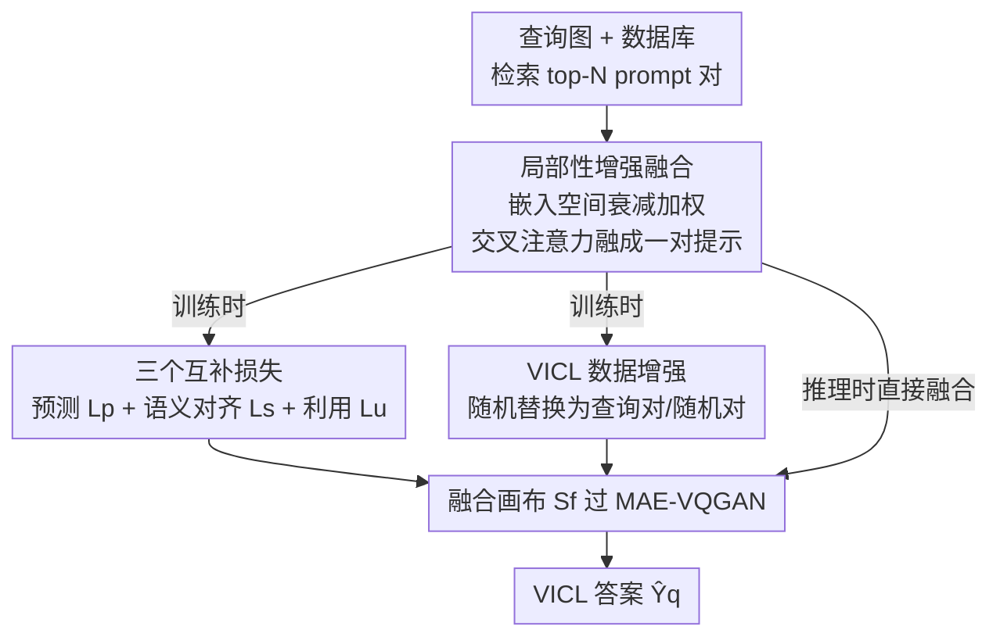

# PromptHub: Enhancing Multi-Prompt Visual In-Context Learning with Locality-Aware Fusion, Concentration and Alignment

**会议**: ICLR 2026  
**OpenReview**: [https://openreview.net/forum?id=FBbO5I40VZ](https://openreview.net/forum?id=FBbO5I40VZ)  
**代码**: https://github.com/luotc-why/ICLR26-PromptHub  
**领域**: 自监督 / 视觉上下文学习  
**关键词**: 视觉上下文学习, 多提示融合, 局部性先验, MAE-VQGAN, 交叉注意力

## 一句话总结
PromptHub 把视觉上下文学习（VICL）的多提示融合从"逐 patch 拼接"升级为"嵌入空间里的局部性增强融合"，再配上预测/对齐/利用三个互补损失和针对 VICL 的数据增强，让骨干网络真正信任并用好融合提示，在分割、检测、上色三个任务上稳定超越前作 CONDENSER。

## 研究背景与动机
**领域现状**：视觉上下文学习（Visual In-Context Learning, VICL）让模型像 NLP 里的 ICL 一样，靠几对"输入图—标签图"示例（prompt pair）+ 一张查询图，直接以像素 in-painting 的方式补全任务结果，骨干通常用 MAE-VQGAN。挑选合适的 prompt 至关重要，早期工作大多在"训练更好的检索器"上做文章。NLP 的经验表明**多个 prompt** 能减小偏差、提供更丰富上下文，于是把单提示扩到多提示成了提升 VICL 的自然方向。

**现有痛点**：MAE-VQGAN 这类骨干一次只吃一个 prompt，多提示并不好接。前作 CONDENSER 第一个引入"prompt fusion"，把多个示例融成一个统一示例再喂给骨干，但它有两处硬伤：一是**逐 patch（patch-wise）融合**，只在局部对应位置做交叉注意力，valuable cues 被大量浪费，信息利用不充分；二是**监督信号是 model-agnostic 的**（停留在输入层面），不能引导骨干真正去用融合后的提示。

**核心矛盾**：融合出来的 prompt 和真实查询对之间存在**分布差异（discrepancy）**。当骨干察觉融合提示"长得不像"标准查询对时，它会不信任这个融合表示，转而退回自己的先验能力去 in-painting——融合白做了。也就是说，问题不仅是"融得不够好"，更是"融了骨干也不肯用"。

**本文目标**：拆成三个子问题——(i) 从多样化 prompt 里抽取精准知识；(ii) 缩小融合提示与查询对的差异，让骨干愿意信任并依赖它；(iii) 最终产出更优的 VICL 预测。

**切入角度**：作者观察到 patch-wise 融合丢掉了空间上下文，而图像中相邻 patch 天然相关。于是用一个**局部性先验（locality prior）**：以当前 patch 为中心、向四周空间衰减地加权，既保留全局感受野又压住边界噪声。

**核心 idea**：把融合搬到嵌入空间，用"局部性增强交叉注意力"做融合，并用"融合—利用—预测"三损失闭环 + VICL 专用数据增强，整条链路一起强化，而不是只改融合那一步。

## 方法详解

### 整体框架
给定 prompt 数据库 $D=\{P_i\}$（每个 prompt 是一对图像-标签），像素级检索器 $R$ 为查询图 $X_q$ 取回 top-$N$ 最相似的 prompt 对 $P=\{(X_n,Y_n)\}_{n=1}^N$。PromptHub 模块把这 $N$ 对 prompt 和查询图一起在 MAE 的 patch 嵌入空间里融成**一对**融合特征 $F_{X_f},F_{Y_f}\in\mathbb{R}^{\frac{H}{16}\times\frac{W}{16}\times D}$；再把它们与查询特征 $F_{X_q}$、掩码特征 $F_{[M]}$ 拼成画布 $S_f$，过 MAE-VQGAN（跳过 patch embedding 那一层）得到 VICL 答案 $\hat{Y}_q$。

训练时这条主链外挂三个损失 $\mathcal{L}_p,\mathcal{L}_s,\mathcal{L}_u$ 共同约束融合模块，并用数据增强随机替换部分 prompt 对来强化正则项；推理时则老老实实用检索回的原始 top-$N$ prompt。整体可以看成"检索 → 局部性融合 → 三损闭环约束 → 骨干补全"四段，其中后三段是本文真正动刀的地方。

### 关键设计

**1. 局部性增强融合：用空间衰减先验替代逐 patch 拼接**

针对 CONDENSER 逐 patch 融合"信息浪费 + 感受野受限"的痛点，PromptHub 把融合放到嵌入空间，用**查询自适应的局部性增强交叉注意力**。先用嵌入层得到查询与各 prompt 的特征，再经自注意力 $\mathrm{SA}(\cdot)$ 把它们对齐到相似模式；然后对每个查询 token $F_{X_q}[h,w]$，以它为中心构造一个空间衰减的局部性矩阵 $\Psi_{h,w}$，权重随距离衰减，先验可选高斯或拉普拉斯：

$$\psi(h,w,x,y)=\exp\!\Big(-\tfrac{(x-h)^2+(y-w)^2}{2\sigma^2}\Big)\ \text{(Gaussian)}\quad\text{或}\quad \exp\!\Big(-\tfrac{\sqrt{(x-h)^2+(y-w)^2}}{\sigma}\Big)\ \text{(Laplacian)}$$

注意力分数在常规 $\frac{QK^\top}{\sqrt{D}}$ 之上**逐元素乘以** $\Psi_{h,w}$ 再 softmax，得到局部性增强权重 $A_{h,w}\in\mathbb{R}^{N\times\frac{H}{16}\times\frac{W}{16}}$，最后用它对 $F_{X_{1:N}},F_{Y_{1:N}}$ 加权（经线性层 $W_{VX},W_{VY}$）得到融合图像/标签特征。推理时没有查询标签 $Y_q$，作者用 prompt 图像特征 $F_{X_{1:N}}$ 共享作 key 来算注意力，再做局部加权——这样图像和标签两路共用同一套权重，保证融合标签也能在没有 $Y_q$ 的情况下生成。$\sigma$ 控制局部范围（分割/检测/上色分别取 0.65/0.5/2.5），既保留全局感受野又抑制边界噪声。

**2. 融合—利用—预测三损闭环：让骨干"信任并用上"融合提示**

只融得好还不够，关键是骨干肯不肯用。PromptHub 设计三个互补损失协同优化：

(i) **标签预测损失 $\mathcal{L}_p$**（沿用 CONDENSER/InMeMo）：把融合 in-context 样本 $S_f$ 过 MAE 编码器得到连续 token，与查询对作为目标画布 $S_q$ 经 VQGAN 编码得到的离散 token 对齐，对掩码区域 $T^c_{[M]}$ 用交叉熵监督。它是 VICL 的**基础监督**——消融显示去掉它后分割从 47.8 直接崩到 11.4 mIoU，参数化的 VICL 没了它根本无法工作。

(ii) **语义完整性/对齐损失 $\mathcal{L}_s$**：骨干在"prompt 与查询同源"时预测最准，因此用交叉熵把融合提示对 $(T^c_{X_f},T^c_{Y_f})$ 拉向"查询对当作 prompt"的离散 token $(T^{d(1)}_{X_q},T^{d(1)}_{Y_q})$，逼融合提示在语义上逼近查询对，提升融合质量。

(iii) **利用损失 $\mathcal{L}_u$**：直接针对"骨干不信任融合提示"这个核心矛盾，用余弦相似度把融合提示 $(T^c_{X_f},T^c_{Y_f})$ 与查询对 $(T^c_{X_q},T^c_{[M]})$ 的差异拉小，从而提升骨干对融合表示的依赖。三者合成总目标 $\min_\theta \mathcal{L}_p+\lambda\mathcal{L}_s+\gamma\mathcal{L}_u$（$\lambda=0.5,\gamma=0.2$），构成"融合质量—骨干利用—上下文预测"的闭环。

**3. VICL 专用数据增强：用替换 prompt 对强化两个正则项**

为放大 $\mathcal{L}_s$ 和 $\mathcal{L}_u$ 的作用，训练时在检索回的 top-$N$ prompt 对基础上做随机替换：以概率 $p_q$ 把某些 prompt 对换成**查询对** $P_q=(X_q,Y_q)$——查询对与自身差异最小，构造一个"纯净"学习目标，把差异压到极致来增强 $\mathcal{L}_u$；以概率 $p_r$ 换成**随机检索对** $P_r$，注入可控噪声来增强 $\mathcal{L}_s$ 和稳定性，保证推理时即便拿不到高质量 prompt，PromptHub 仍能给出鲁棒结果。推理阶段不做任何替换，始终用最相似的原始 prompt。

### 损失函数 / 训练策略
总目标 $\mathcal{L}_p+\lambda\mathcal{L}_s+\gamma\mathcal{L}_u$；SGD 优化器，初始学习率 0.04，cosine annealing warm restarts 调度；分割/检测训练 100 epoch，上色 10 epoch；默认高斯先验；输入 $224\times224$（子图 $112\times112$）；单卡 80G A100，batch size 16。

## 实验关键数据

### 主实验
三大任务（前景分割 Seg./单目标检测 Det./图像上色 Col.），$N=1$ 与 $N=16$ 分别给出。上色用 MSE（越低越好），其余用 mIoU。

| 任务 / 设置 | 指标 | CONDENSER | PromptHub | 提升 |
|--------|------|------|----------|------|
| Seg. Mean (N=1) | mIoU↑ | 44.14 | 45.17 | +2.3% |
| Seg. Mean (N=16) | mIoU↑ | 46.63 | 47.81 | +2.5% |
| Det. (N=1) | mIoU↑ | 43.22 | 44.51 | +3.0% |
| Det. (N=16) | mIoU↑ | 44.64 | 45.59 | +2.1% |
| Col. (N=1) | MSE↓ | 0.560 | 0.533 | +5.1% |
| Col. (N=16) | MSE↓ | 0.539 | 0.503 | +7.2% |

跨域迁移（COCO-5i 训练 → Pascal-5i 测试）：PromptHub$_{N=16}$ 达 42.17 mIoU，比 CONDENSER$_{N=16}$（40.52）高约 4.1%，迁移性优势更明显。

### 消融实验

| 配置 (N=16, Seg. Mean) | mIoU | 说明 |
|------|---------|------|
| Full PromptHub | 47.81 | 完整模型 |
| w/o $\mathcal{L}_u$ | 46.71 | 去掉利用损失，掉 ~1.1 |
| w/o $\mathcal{L}_s$ | 45.84 | 去掉语义对齐，掉 ~2.0 |
| w/o $\mathcal{L}_p$ | 11.44 | 去掉预测损失，**直接崩溃** |
| w/ Laplacian Prior | 47.72 | 换拉普拉斯先验，几乎持平 |
| Global Fusion | 44.64 | 去掉局部性（全局融合），掉 ~3.2 |
| Convolution-Based Fusion | 46.95 | 卷积式融合，弱于局部性注意力 |
| w/o Data Augment | 47.07 | 去掉数据增强，掉 ~0.7 |

### 关键发现
- $\mathcal{L}_p$ 是地基：去掉后分割从 47.81 崩到 11.44 mIoU，证明标签预测是参数化 VICL 不可或缺的基础监督，$\mathcal{L}_s/\mathcal{L}_u$ 都是在它之上的增益。
- 局部性是核心贡献：Global Fusion（去掉局部性先验）从 47.81 掉到 44.64（约 -3.2），跌幅大于去掉任一正则损失，说明"空间衰减加权"本身就贡献显著；高斯与拉普拉斯先验差别很小（47.81 vs 47.72），方法对先验形式不敏感。
- 三损中 $\mathcal{L}_s$ 比 $\mathcal{L}_u$ 更关键（去掉分别掉 ~2.0 / ~1.1），即"让融合提示语义逼近查询对"比"缩小骨干感知差异"贡献更大。
- 上色任务提升最大（N=16 时 +7.2%），可能因为密集回归任务更依赖空间上下文，局部性融合收益更高。

## 亮点与洞察
- **把"骨干不信任融合提示"这个隐性 bug 显式建模**：用 $\mathcal{L}_u$ 余弦相似度直接缩小融合提示与查询对的差异，是个很对症的设计——不是把融合做得更复杂，而是让骨干"敢用"，思路可迁移到任何"中间表示被下游模块不信任"的场景。
- **局部性先验作为可插拔的注意力调制项**：$\Psi_{h,w}$ 逐元素乘进 softmax 前的分数，既不破坏全局感受野又压边界噪声，且高斯/拉普拉斯近乎等价，说明真正起作用的是"空间衰减"这一归纳偏置而非具体形式。
- **用"替换 prompt 对"做数据增强**：把查询对/随机对按概率塞进 top-$N$，分别服务 $\mathcal{L}_u$ 和 $\mathcal{L}_s$，是一种和损失目标精确绑定的增强设计，比通用图像增强更贴 VICL。
- 推理时共享 prompt 图像特征作 key 解决"无查询标签"难题，是个实用且容易被忽略的工程细节。

## 局限与展望
- 方法绑定在 MAE-VQGAN + in-painting 这一特定 VICL 骨干上，是否能迁移到自回归视觉模型（如 LVM）或其他视觉 ICL 范式未验证。
- 局部性范围 $\sigma$ 需按任务手工设定（0.65/0.5/2.5 差异较大），缺乏自适应机制，换新任务可能要重新调参。
- 评测仍局限在分割/检测/上色三个经典任务，更复杂或开放域的视觉任务上的表现未知。
- 数据增强的替换概率 $p_q,p_r$ 论文未给具体数值与敏感性分析，复现时需注意。

## 相关工作与启发
- **vs CONDENSER**：CONDENSER 首创 prompt fusion 但用逐 patch 融合 + model-agnostic 监督，信息利用不足且不引导骨干使用融合提示；PromptHub 改为嵌入空间局部性融合 + 三损闭环 + 数据增强，整链路强化，三任务全面超越且迁移性更好。
- **vs InMeMo（视觉 prompt tuning）**：InMeMo 给 prompt 加可学习噪声边框来增强鲁棒性，属"调 prompt"；PromptHub 属"融合多 prompt 并对齐查询语义"，且保留了 InMeMo 风格的预测损失作基础监督。
- **vs PANICL（训练-free kNN 融合）**：PANICL 用免训练的 kNN 融合缓解单 prompt 偏差；PromptHub 是参数化、可训练的融合，靠局部性先验和三损做更精细的语义对齐。
- **启发**："融合—利用—预测"闭环把"中间表示质量"和"下游是否采信中间表示"拆成两个可独立优化的目标，这一拆解思想对蒸馏、检索增强、特征融合等"中间产物被下游消费"的任务都有借鉴价值。

## 评分
- 新颖性: ⭐⭐⭐⭐ 局部性融合 + "利用损失"对症解决骨干不信任问题，角度新颖但属在 CONDENSER 路线上的精细化。
- 实验充分度: ⭐⭐⭐⭐ 三任务 + 多 $N$ + 跨域迁移 + 细致消融，证据链完整；任务种类略集中。
- 写作质量: ⭐⭐⭐⭐ 动机—矛盾—方法的逻辑清晰，图示到位；部分公式符号偏密集。
- 价值: ⭐⭐⭐⭐ 为 prompt fusion 确立了更可靠的局部性范式，对 VICL 社区有明确推进意义。

<!-- RELATED:START -->

## 相关论文

- [\[ICLR 2026\] Relationship Alignment for View-aware Multi-view Clustering](relationship_alignment_for_view-aware_multi-view_clustering.md)
- [\[ICLR 2026\] On the Alignment Between Supervised and Self-Supervised Contrastive Learning](on_the_alignment_between_supervised_and_self-supervised_contrastive_learning.md)
- [\[ICLR 2026\] Spatially Informed Autoencoders for Interpretable Visual Representation Learning](spatially_informed_autoencoders_for_interpretable_visual_representation_learning.md)
- [\[ICLR 2026\] Incomplete Multi-View Multi-Label Classification via Shared Codebook and Fused-Teacher Self-Distillation](incomplete_multi-view_multi-label_classification_via_shared_codebook_and_fused-t.md)
- [\[ICLR 2026\] Part-level Semantic-guided Contrastive Learning for Fine-grained Visual Classification](part-level_semantic-guided_contrastive_learning_for_fine-grained_visual_classifi.md)

<!-- RELATED:END -->
