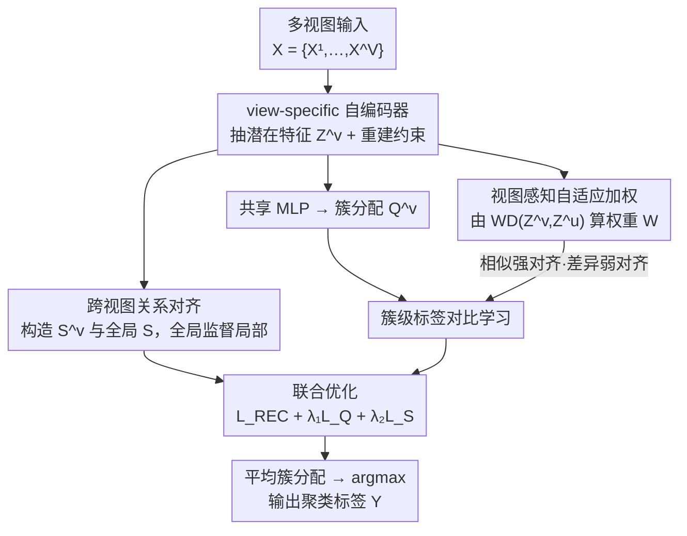

# Relationship Alignment for View-aware Multi-view Clustering

**会议**: ICLR 2026  
**OpenReview**: [https://openreview.net/forum?id=uRA9cT4MK6](https://openreview.net/forum?id=uRA9cT4MK6)  
**代码**: https://github.com/chenzhe207/RAV  
**领域**: 自监督 / 多视图聚类  
**关键词**: 多视图聚类, 对比学习, 关系对齐, 视图感知加权, Wasserstein 距离

## 一句话总结
RAV 通过「跨视图样本关系对齐」保住每个视图的邻域结构、并用基于 Wasserstein 距离的「视图感知自适应加权」动态调节簇级标签对比学习的强度，让相似视图强对齐、差异视图弱对齐，从而在十个多视图聚类基准上整体超越现有 SOTA。

## 研究背景与动机

**领域现状**：多视图聚类（MVC）的目标是把同一批样本在多个视图（不同模态/不同特征）下的互补信息融合起来，得到比单视图更准的聚类划分。深度 MVC 是当前主流——用 view-specific 自编码器抽特征，再用对比学习在「样本级」拉近相似样本、在「簇级」对齐各视图的聚类分布，以追求跨视图一致性。

**现有痛点**：作者指出两个被普遍忽视的问题。其一，多数方法只在特征或聚类分布上做对齐，**不显式保留样本的邻域结构**，导致跨视图之间「谁和谁是邻居」这层关系不一致，破坏了样本关系的稳定性。其二，绝大多数对比学习方法**对所有视图一视同仁地强制对齐**——当两个视图本身差异很大时，硬把它们的簇分布拉到一起反而会扭曲真实语义、引发表征冲突（representation conflict）和语义退化。

**核心矛盾**：近期工作（如 SEM、SCMVC）虽然意识到了视图差异问题，引入了「特征级」的自适应加权，但它们只在特征融合层面调权，**既没有保证跨视图样本关系结构的一致性，也没有照顾簇级语义一致性**。结果是仍可能把低相似度视图强行拉去做一致性学习，造成语义冲突。也就是说，「保结构」和「按视图差异自适应对齐」这两件事此前没有被同时、且在正确的粒度上解决。

**本文目标**：分解成两个子问题——(1) 如何在融合时保住每个视图的局部邻域结构、并让跨视图关系一致；(2) 如何在簇级对比学习时，按视图间的真实相似度自适应地决定对齐强度，避免强行对齐差异视图。

**切入角度**：作者的观察是，样本两两关系（relationship matrix）本身就是一种比单点特征更鲁棒的结构信号，可以用一个「全局关系矩阵」去监督每个「视图局部关系矩阵」；同时，视图间差异应该用分布层面的距离（Wasserstein 距离）来度量，再据此给对比损失加权。

**核心 idea**：用「全局监督局部」的关系对齐保结构 + 用 WD 驱动的视图感知加权让对比学习「相似强对齐、差异弱对齐」，把保结构与自适应对齐统一进一个框架。

## 方法详解

### 整体框架

RAV 的输入是含 $V$ 个视图的多视图数据集 $X = \{X^1, \dots, X^V\}$，其中第 $v$ 个视图 $X^v \in \mathbb{R}^{N \times d_v}$（$N$ 个样本、维度 $d_v$），输出是统一的聚类标签 $Y = [y_1, \dots, y_N]$。整条管线由三个核心模块串起来：先用 **view-specific 自编码器** 给每个视图抽出去噪后的潜在特征 $Z^v$（并以重建损失约束）；再从 $Z^v$ 分出两条协同的支路——一条是 **跨视图关系对齐**，给每个视图构造样本关系矩阵 $S^v$ 并与全局关系矩阵 $S$ 对齐，保住邻域结构；另一条是经一个共享 MLP 把 $Z^v$ 投影成簇分配矩阵 $Q^v$，做 **簇级标签对比学习**，而这条支路的对比强度由 **视图感知自适应加权** 模块（基于 $Z^v$ 间的 Wasserstein 距离算出权重矩阵 $W$）来动态调节。三个损失 $\mathcal{L}_{REC} + \lambda_1 \mathcal{L}_Q + \lambda_2 \mathcal{L}_S$ 联合优化，收敛后对各视图的簇分配求平均、取 argmax 得到最终标签。

### 关键设计

**1. 跨视图关系对齐：用全局关系矩阵监督每个视图的局部邻域结构**

这一设计针对「融合时丢失样本邻域结构、跨视图关系不一致」的痛点。具体做法是：先用 view-specific 编码器得到每个视图的深度特征 $Z^v$，再用高斯核计算视图内样本两两相似度 $s^v_{ik} = \exp\!\left(-\frac{\lVert z^v_{i,:} - z^v_{k,:}\rVert^2}{\sigma}\right)$，由此得到视图专属关系矩阵 $S^v \in \mathbb{R}^{N \times N}$。同时把所有视图的深度特征拼接成 $Z = \mathrm{Concat}(Z^1, \dots, Z^V)$，用同样的核函数算出**全局关系矩阵** $S$——它综合了所有视图的信息，代表「样本之间应有的关系」。然后用一个 global-supervise-local 的对比目标，把每个 $S^v$ 的每一行（某个样本对全体样本的关系向量）向全局 $S$ 的对应行对齐：

$$\mathcal{L}_S = -\frac{1}{N} \sum_{v=1}^{V} \sum_{i=1}^{N} \log \frac{e^{\,d(s^v_{i,:},\, s_{i,:})/\tau_F}}{\sum_{k=1}^{N} e^{\,d(s^v_{i,:},\, s_{k,:})/\tau_F} - e^{1/\tau_F}}$$

其中 $d(\cdot,\cdot)$ 是余弦相似度、$\tau_F$ 是温度，分母里减去 $e^{1/\tau_F}$ 是为了排除自身项。它把「同一样本在某视图的关系向量」和「该样本的全局关系向量」当正对、把它与其它样本的全局关系向量当负对。这样做的效果是：邻居在各视图里都保持是邻居、远点保持是远点，既增强了视图内特征的判别性，又让全局结构成为后续度量视图相似度、做语义对齐的**稳定参照系**，而不是各视图各算各的、彼此打架。

**2. 簇级标签对比学习：在簇分配列向量上对齐各视图的聚类语义**

要让各视图聚出来的「簇」语义一致，作者把对比学习放在**簇分配**层面而非样本层面。共享 MLP 把 $Z^v$ 投影、沿簇维做 Softmax 得到簇分配矩阵 $Q^v \in \mathbb{R}^{N \times K}$，$q^v_{ij}$ 表示视图 $v$ 下样本 $i$ 属于簇 $j$ 的概率。关键在于取 $Q^v$ 的**列向量** $q^v_{:,j}$（第 $j$ 个簇在全体样本上的分配分布）作为对比单元：来自不同视图、同一簇索引 $j$ 的 $(V-1)$ 个列向量互为正对，其余 $V(K-1)$ 个为负对。视图对 $(v,u)$ 的对比损失为：

$$\ell^{(v,u)}_c = -\frac{1}{K} \sum_{j=1}^{K} \log \frac{e^{\,d(q^v_{:,j},\, q^u_{:,j})/\tau_L}}{\sum_{k=1}^{K} \sum_{m=v,u} e^{\,d(q^v_{:,j},\, q^m_{:,k})/\tau_L} - e^{1/\tau_L}}$$

汇总所有视图对后，损失里再加一个正则项 $\sum_v \sum_j r^v_j \log r^v_j$（$r^v_j = \frac{1}{N}\sum_i q^v_{ij}$ 是簇 $j$ 的平均分配概率），它防止所有样本被分到同一个簇这种平凡解。把对比放在簇列向量上，本质是在对齐「聚类分布」而非逐点特征，更直接地服务于聚类语义一致性。

**3. 视图感知自适应加权：用 Wasserstein 距离让相似视图强对齐、差异视图弱对齐**

设计 2 默认对所有视图对一视同仁，差异大的视图被硬拉对齐会语义退化——这正是本设计要修的。作者先用 **Wasserstein 距离（WD）** 度量两视图深度特征分布的差异：$\mathrm{WD}(Z^v, Z^u) = \frac{1}{N^2} \sum_{i=1}^{N} \sum_{k=1}^{N} \lvert z^v_{i,:} - z^u_{k,:} \rvert$。再把 WD 经 softmax 取负指数转成权重：

$$w^{(v,u)} = \frac{e^{-\mathrm{WD}(Z^v, Z^u)}}{\sum_{u=1}^{V} e^{-\mathrm{WD}(Z^v, Z^u)}}$$

WD 越小（视图越相似）权重越大、WD 越大（差异越大）权重越小，所有视图对构成 $V \times V$ 权重矩阵 $W$。把它对称化后乘进簇级对比损失，得到最终的视图感知对比损失：

$$\mathcal{L}_Q = \frac{1}{2} \sum_{v=1}^{V} \sum_{u \neq v} \frac{1}{2}\big(w^{(v,u)} + w^{(u,v)}\big)\, \ell^{(v,u)}_c + \sum_{v=1}^{V} \sum_{j=1}^{K} r^v_j \log r^v_j$$

这样相似视图贡献被放大、增强语义一致性，差异视图贡献被压低、避免强制对齐带来的表征冲突。与 SEM/SCMVC 等「特征级」加权相比，RAV 在**深度特征分布**上用 WD 度量相似度，能更准地捕捉视图间的内在相似性，因此在复杂数据集上泛化更好、也更好地保留了视图间的自然关系。

### 损失函数 / 训练策略

总损失为 $\mathcal{L}_{total} = \mathcal{L}_{REC} + \lambda_1 \mathcal{L}_Q + \lambda_2 \mathcal{L}_S$，其中 $\mathcal{L}_{REC} = \sum_v \sum_i \lVert x^v_{i,:} - \hat{x}^v_{i,:} \rVert_2^2$ 是各视图自编码器的重建损失。训练分两步：先单独最小化 $\mathcal{L}_{REC}$ 预训练自编码器，再每个 epoch 依次更新关系矩阵 $S^v/S$、权重矩阵 $W$，并最小化 $\mathcal{L}_{total}$ 联合优化全部参数。实现细节：PyTorch + RTX 4090，Adam，学习率 0.0003，batch 256，预训练与微调各 200 epoch；高斯核带宽 $\sigma=1.0$，$\tau_F=\tau_L=0.5$，$\lambda_1$ 搜索范围 $[10^{-5}, 10^3]$、$\lambda_2$ 搜索范围 $[10^{-5}, 1]$。收敛后用 $y_j = \arg\max_j \left(\frac{1}{V}\sum_v q^v_{ij}\right)$ 得到最终标签。

## 实验关键数据

在 NGs、Digit-Product、ALOI、Cora、NUSWIDE、Caltech-5V、NoisyMNIST、YoutubeVideo、3Sources、Fashion 共 **10 个基准** 上，与 MFLVC、GCFAgg、SEM、MVCAN、SCMVC、DDMVC、SSLNMVC、AICN-MLM、DFL-NET 等 9 个代表性方法对比，指标为 ACC / NMI / PUR。

### 主实验

| 数据集 | 指标 | RAV (本文) | 次优 baseline | 提升 |
|--------|------|-----------|--------------|------|
| NGs | ACC | **0.980** | 0.936 (SSLNMVC) | +4.4% |
| YoutubeVideo | ACC | **0.356** | 0.318 (SEM) | +7.8% (NMI 0.332、PUR 0.445 亦最优) |
| Cora | ACC | **0.592** | 0.567 (MVCAN) | +2.5% |
| NUSWIDE | ACC | **0.647** | 0.637 (SSLNMVC) | +1.0% |
| 3Sources | NMI | **0.599** | 0.584 (SEM) | PUR 0.775 亦最优 |
| ALOI | ACC | 0.826 | 0.849 (MVCAN) | 略低于 MVCAN |
| Caltech-5V | ACC | 0.901 | 0.919 (MVCAN) | 略低于 MVCAN |

RAV 在多数数据集上整体最优，尤其在 NGs、YoutubeVideo、Cora 这类视图差异较大的数据集上提升明显；在 ALOI、Caltech-5V 上略逊于 MVCAN（作者归因于 MVCAN 不用标准对比学习、对视图差异更不敏感），在 Fashion、Digit-Product 这类结构简单、视图差异小的数据集上与 MFLVC/DFL-NET 等持平（此时自适应加权的必要性下降）。

### 消融实验

| 配置 (LREC / LQ / LS) | Caltech-5V ACC | NUSWIDE ACC | ALOI ACC | 3Sources NMI | 说明 |
|------|------|------|------|------|------|
| ✓ / ✓ / ✗ | 0.899 | 0.644 | 0.780 | 0.464 | 去掉关系对齐 $\mathcal{L}_S$ |
| ✓ / ✗ / ✓ | 0.424 | 0.298 | 0.264 | 0.135 | 去掉标签对比 $\mathcal{L}_Q$，性能崩塌 |
| ✓ / ✓ / ✓ | **0.901** | **0.647** | **0.826** | **0.599** | 完整模型 |

| 配置 | NGs ACC | ALOI ACC | Cora ACC | 说明 |
|------|------|------|------|------|
| ours w/o W | 0.966 | 0.801 | 0.585 | 去掉视图感知加权 |
| ours (full) | **0.980** | **0.826** | **0.592** | +1.4% / +3.6% / +0.7% |

### 关键发现
- **簇级标签对比 $\mathcal{L}_Q$ 是地基**：去掉它后所有数据集性能断崖式下跌（如 ALOI ACC 从 0.826 跌到 0.264），说明聚类语义对齐是聚类能力的来源；关系对齐 $\mathcal{L}_S$ 则在其上稳定提升结构一致性。
- **视图感知加权 W 的收益与视图差异正相关**：在差异大的 ALOI 上加 W 涨 3.6%，而在视图差异本就很小的 Digit-Product 上加不加 W 性能不变（ACC 都是 0.998），印证了「差异越大、加权越有用」的设计动机。
- **鲁棒性与收敛性好**：$\lambda_1$、$\lambda_2$ 在大范围内波动时性能只有小幅变化；损失快速下降后趋稳、ACC/NMI 随训练持续上升，t-SNE 可视化显示全局特征 $Z$ 的簇随迭代越来越紧凑可分。

## 亮点与洞察
- **「全局监督局部」的关系对齐**很巧妙：用拼接全部视图算出的全局关系矩阵当 anchor，去约束每个视图的局部关系矩阵，比逐对视图互相对齐更省、也更稳，等于给跨视图一致性提供了一个统一参照系。
- **用 Wasserstein 距离在分布层面度量视图相似度**：相比特征级标量加权，WD 直接刻画两视图深度特征分布的差异，更能反映「视图到底有多像」，这个加权信号可迁移到任何「需要按数据源差异决定对齐强度」的多源/多模态对齐任务。
- **对比单元放在簇分配列向量上**：把对比从样本级提到簇级，直接对齐聚类分布而非逐点特征，对最终聚类目标更对口，也天然带来 $V(K-1)$ 个负对的丰富监督。

## 局限与展望
- 作者承认未来需从**理论上**探索更鲁棒的关系结构和更通用的相似度度量；当前 WD 加权与高斯核关系矩阵更多是经验设计。
- 关系矩阵 $S^v / S$ 是 $N \times N$ 量级，WD 计算是 $O(N^2)$，在超大规模样本上可能有内存与计算开销（论文用 mini-batch 缓解，但全局关系的近似质量未深入讨论）。
- 方法假设视图完整、数据干净；作者将不完整视图、含噪数据等复杂场景列为后续工作。
- 在视图差异极小的简单数据集（Fashion、Digit-Product）上，自适应加权几乎不带来增益，说明该机制的适用边界是「视图差异显著」的场景。

## 相关工作与启发
- **vs SEM / SCMVC（特征级自适应加权）**：它们在特征融合层面调权，RAV 指出其忽略了跨视图样本关系一致性与簇级语义一致性；RAV 改在**深度特征分布**上用 WD 度量相似度、并把加权用于**簇级对比**，在复杂数据集上显著更优。
- **vs GCFAgg（用样本相似结构引导对比）**：GCFAgg 也利用样本间结构关系，但 RAV 进一步引入「全局监督局部」的关系对齐损失显式保邻域结构，并叠加视图感知加权，对差异视图更鲁棒。
- **vs MVCAN**：MVCAN 不用标准对比学习、对视图差异不敏感，在 ALOI/Caltech-5V 上略胜；但在多数更具挑战性的数据集上 RAV 凭借自适应对齐更优。

## 评分
- 新颖性: ⭐⭐⭐⭐ 「全局监督局部关系对齐 + WD 驱动的簇级对比加权」组合清晰、动机具体，但两个组件各自延续已有思路。
- 实验充分度: ⭐⭐⭐⭐⭐ 10 个基准、9 个 baseline、三指标，外加损失消融、加权消融、参数敏感性、收敛与 t-SNE 可视化。
- 写作质量: ⭐⭐⭐⭐ 结构清楚、公式完整，部分模块（如全局关系矩阵的 mini-batch 近似）可再展开。
- 价值: ⭐⭐⭐⭐ 在视图差异显著的多视图聚类场景下实用且稳定，WD 加权思路可迁移到更广的多源对齐任务。

<!-- RELATED:START -->

## 相关论文

- [\[ICLR 2026\] Incomplete Multi-View Multi-Label Classification via Shared Codebook and Fused-Teacher Self-Distillation](incomplete_multi-view_multi-label_classification_via_shared_codebook_and_fused-t.md)
- [\[ICLR 2026\] PredNext: Explicit Cross-View Temporal Prediction for Unsupervised Learning in Spiking Neural Networks](prednext_explicit_cross-view_temporal_prediction_for_unsupervised_learning_in_sp.md)
- [\[ICLR 2026\] PromptHub: Enhancing Multi-Prompt Visual In-Context Learning with Locality-Aware Fusion, Concentration and Alignment](prompthub_enhancing_multi-prompt_visual_in-context_learning_with_locality-aware_.md)
- [\[CVPR 2026\] GaussianMatch: Semi-Supervised Regression with Pseudo-Label Filtering via Multi-View Gaussian Consistency](../../CVPR2026/self_supervised/gaussianmatch_semi-supervised_regression_with_pseudo-label_filtering_via_multi-v.md)
- [\[ICLR 2026\] On the Alignment Between Supervised and Self-Supervised Contrastive Learning](on_the_alignment_between_supervised_and_self-supervised_contrastive_learning.md)

<!-- RELATED:END -->
