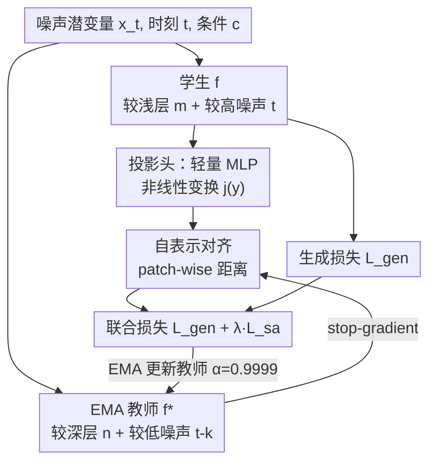

# Representation Alignment for Diffusion Transformers without External Components

**会议**: ICLR 2026  
**OpenReview**: [https://openreview.net/forum?id=ds5w2xth93](https://openreview.net/forum?id=ds5w2xth93)  
**代码**: https://github.com/vvvvvjdy/SRA  
**领域**: 自监督 / 表示学习 / 扩散模型  
**关键词**: 表示对齐, 扩散 Transformer, 自表示对齐, EMA 教师, 生成加速

## 一句话总结
本文发现扩散 Transformer 内部本身就存在「从坏到好」的判别表示演化，于是提出 SRA（Self-Representation Alignment）：把学生模型在「较浅层 + 较高噪声」处的表示对齐到 EMA 教师在「较深层 + 较低噪声」处的表示，从而在不引入任何外部表示任务或预训练编码器的前提下加速 DiT/SiT 的生成训练，效果显著优于依赖外部表示任务的方法、并能逼近依赖 DINOv2 等外部编码器的 REPA。

## 研究背景与动机
**领域现状**：近期一系列工作发现，给扩散 Transformer 注入「高质量的内部表示」既能加速生成训练的收敛，又能提升最终生成质量。实现方式主要有两类：一类（如 MaskDiT、SD-DiT、TREAD）在原本的生成训练里额外挂一个外部判别任务（MAE / iBOT 式的掩码重建损失）来引导表示；另一类（如 REPA）直接借用一个大规模预训练的表示基础模型（DINOv2、CLIP）当老师，把扩散模型的中间特征对齐到它的输出。

**现有痛点**：前者需要额外设计并维护一个外部表示任务，增加训练复杂度；后者强依赖一个强大的外部预训练编码器，一旦目标域没有现成的好编码器（例如开放域视频），这条路就走不通。更微妙的是，REPA 这种外部对齐在训练后期会饱和——大约 200 epoch 后教师能给的信号到顶，甚至开始拖后腿。

**核心矛盾**：表示引导确实有用，但「引导信号从哪来」被默认绑死在外部组件上。问题是——扩散 Transformer 自己难道不会在训练中逐渐学出有意义的表示吗？如果会，何必外求？

**本文目标**：在**不引入任何外部表示组件、不改动扩散 Transformer 架构**的前提下，给中间层提供表示引导，加速收敛并提升生成质量。

**切入角度**：作者对 SiT-XL/2 做了实证分析（PCA 可视化 + ImageNet 线性探测）。关键观察是：扩散 Transformer 的潜在特征随着**层数加深、噪声降低**会逐步从「坏」精炼到「好」——浅层高噪声处表示糙，深层低噪声处表示好（线性探测准确率在约第 20 层达峰，之后因为模型要转去生成高频细节才回落）。也就是说，模型内部天然存在一条「坏→好」的判别表示梯度。

**核心 idea**：既然「更好的表示」就藏在模型自己更深的层、更低的噪声里，那就用模型自己当老师——把弱表示对齐到强表示，实现「自表示对齐」，无需任何外部组件。

## 方法详解

### 整体框架
SRA 把一次普通的扩散训练前向，扩成「学生 + EMA 教师」两条共享架构的分支。学生分支吃噪声潜变量 $x_t$、时刻 $t$、条件 $c$，正常预测噪声/速度算生成损失；同时取它**较浅层** $m$ 的输出特征 $y=f^m(x_t,t,c)$，过一个轻量投影头 $j_\psi$ 做非线性变换。教师分支是学生权重的 EMA 拷贝，吃的是**噪声更低**的输入（时刻 $t-k$，$k\ge0$），取它**较深层** $n$（$m\le n$）的输出 $y^*=f^n_*(x_{t-k},t-k,c)$ 作为对齐目标。两者按 patch 算距离构成自对齐损失，与生成损失联合优化；教师只走 EMA、不回传梯度（stop-gradient）。投影头在训练后可丢弃，因此 SRA 对原架构零侵入。

### 关键设计

**1. 自表示对齐：把浅层高噪声的弱表示拉向深层低噪声的强表示**

这一步直击「引导信号从哪来」的矛盾。作者不再外求老师，而是利用模型内部那条「坏→好」的表示梯度：让学生在第 $m$ 层、噪声水平 $t$ 下的输出，去对齐教师在更深的第 $n$ 层（$m\le n$）、更低噪声 $t-k$（$k\ge0$）下的输出。形式上最小化两者的逐 patch 距离：
$$L_{sa}(\zeta_s,\psi)=\mathbb{E}_{x_t,t,c}\Big[\tfrac{1}{N}\sum_{i=1}^N \mathrm{dist}\big(y^{[i]}_*,\,j_\psi(y^{[i]})\big)\Big]$$
其中 $[i]$ 是 patch 索引，$\mathrm{dist}$ 是预定义距离。为什么这样有效：浅层是后续生成的「地基」，最需要语义引导，而深层低噪声的特征质量明显更高（线性探测可证），用它当目标相当于给中间层加了一个「自我蒸馏」式的深监督，既加速收敛又抬高整体表示质量。消融里 $3\to8$（学生第 3 层对齐教师第 8 层）最优，FID 从基线 33.02 降到 29.10；而 $3\to3$（同层对齐）反而退化到 37.08，印证了「必须跨层、对齐到更好的表示」才是关键。

**2. EMA 教师：用自身历史权重当老师，彻底甩掉外部组件**

直接拿同一个模型当前输出当目标会塌缩（自监督里 SimSiam/BYOL 早有结论，作者实验也复现了这一点）。SRA 的解法是从学生的历史迭代构造教师——教师权重按指数滑动平均更新 $\zeta_t=\alpha\zeta_t+(1-\alpha)\zeta_s$，并对教师施加 stop-gradient，梯度只流经学生。这是 SRA「无外部组件」的支点：教师不是外挂的 DINOv2，而是学生自己的「过去」，随训练不断变强，因而能持续提供越来越好的引导（实验测得教师线性探测从 200K 步的 38.1 涨到 800K 步的 54.2，且每个阶段都强于学生）——这也解释了 SRA 相比 REPA「不会在后期饱和」。值得注意的是动量系数取了反常的 $\alpha=0.9999$ 且全程不变，远高于常规 SSL 设置；作者还发现聚类约束、BatchNorm、centering 这些 SSL 防塌缩技巧在这里都不需要，训练本身就足够稳。

**3. 投影头：先非线性变换再对齐，保护原生成场不被破坏**

如果直接拿学生原始特征去对齐教师，效果反而差（消融：去掉投影头 FID 从 29.10 退到 34.23）。SRA 在学生输出后接一个轻量可训练 MLP 头 $j_\psi$ 做一次轻微非线性变换，再与教师对齐。作者的解释是：每一层、每个时刻在扩散模型里都各司其职地负责生成场的一部分，若强行把整条潜在特征显式对齐，会扰乱原本的生成职责；加一个投影头相当于留出一块「专门用于对齐」的隐表示空间，让模型既能学到对齐所需的表示、又不破坏生成本身。这个头训练后可选择丢弃，保证零架构改动。

**4. 联合目标与对齐位置选择：层/噪声间隔决定引导强度**

最终目标是生成损失与自对齐损失的加权和 $L=L_{gen}+\lambda L_{sa}$，$\lambda$ 控制两者权衡，默认 $0.2$（消融显示 $\lambda\in[0.1,0.4]$ 都优于基线，方差很小，鲁棒）。两个关键超参是对齐的「层对」和「时间间隔」：层对按模型规模设默认值（SiT 的 B/L/XL 用 $3\to8$、$6\to16$、$8\to20$；DiT 因逐层判别行为略不同改用 $3\to7$、$6\to14$、$8\to16$）；时间间隔 $k$ 让教师看到比学生更低的噪声，固定或动态采样均可，作者用动态区间 $[0,0.2)$（DiT 对应 $[0,200)$），原因是更低噪声给的表示更好，但间隔太大又会让模型只顾对齐、荒废生成。

### 损失函数 / 训练策略
训练完全沿用 DiT/SiT 原配置：AdamW、恒定学习率 1e-4、无权重衰减、batch size 256、SD-VAE 提取潜变量、patch size 2，架构用 B/2、L/2、XL/2。总损失为 $L=L_{gen}+\lambda L_{sa}$，$\lambda=0.2$，EMA 动量 $\alpha=0.9999$。相比基线唯一的额外开销是教师的一次前向，作者在「相同训练时间」下汇报 FID 以保证公平比较。

## 实验关键数据

### 主实验
ImageNet 256×256，带 CFG 的系统级对比（FID 越低越好）：

| 方法 | Epochs | Tokenizer | FID↓ | IS↑ | 依赖外部组件 |
|------|--------|-----------|------|-----|------|
| SiT-XL/2 (基线) | 1400 | SD-VAE | 2.06 | 270.3 | 无 |
| MaskDiT | 1600 | SD-VAE | 2.28 | 276.6 | 外部表示任务 |
| SiT + REPA | 800 | SD-VAE | 1.42 | 305.7 | 外部编码器 DINOv2 |
| **SiT + SRA (本文)** | 400 | SD-VAE | 1.85 | 297.2 | **无** |
| **SiT + SRA (本文)** | 800 | SD-VAE | 1.58 | 311.4 | **无** |

SRA 仅用 400 epoch 就超过训练 1400 epoch 的原始 SiT-XL；800 epoch 时 FID=1.58、IS=311.4，远好于依赖外部任务的 MaskDiT，并逼近依赖 DINOv2 的 REPA。512×512 上，SRA 用 1/3 的训练迭代就超过基线，与 REPA 同迭代时在 sFID/IS/Rec 三项上更优。文生图（MMDiT + COCO2014）零调参迁移也有效：FID 5.86→4.85、PickScore 20.05→21.14。

### 消融实验
SiT-B/2、400K 迭代、无 CFG（基线 FID 33.02 / IS 43.71）：

| 配置 | FID↓ | IS↑ | 说明 |
|------|------|-----|------|
| 默认 $3\to8$, 间隔$[0,0.2)$, $\lambda=0.2$, 带投影头 | **29.10** | **50.20** | 完整 SRA |
| $3\to3$（同层对齐） | 37.08 | 41.54 | 不跨层则退化，比基线还差 |
| 时间间隔 $0.0$（教师同噪声） | 31.07 | 47.32 | 教师需更低噪声 |
| $\lambda=0.1$ | 30.65 | 48.31 | 权重偏小掉点 |
| 去掉投影头 | 34.23 | 41.07 | 投影头不可或缺 |

### 关键发现
- **跨层 + 低噪声教师是命门**：同层对齐（$3\to3$）直接退化到比基线更差，证明对齐目标必须是「更深层、更低噪声」的更好表示，而非任意自身特征。
- **投影头贡献巨大**：去掉后 FID 退 5 个点（29.10→34.23），说明「先非线性变换再对齐」对保护生成场至关重要。
- **越大模型增益越大、且不饱和**：SRA 在 XL 上提升比 B/L 更明显（大模型给的引导更丰富），且即便 FID 已经很低仍能继续受益，因为教师随训练持续变强（线性探测 38.1→54.2）。
- **生成质量与表示引导强相关**：改变教师对齐层会让线性探测准确率与 FID 同步变化（Figure 7c），直接坐实「生成能力确实绑在自表示引导上」这一中心假设。

## 亮点与洞察
- **「内部就有老师」的视角转换**：最让人「啊哈」的是作者没有去设计更强的外部引导，而是先做实证发现扩散 Transformer 内部天然存在「坏→好」的表示梯度，再顺势把模型自己更深更净的表示当老师——把别人当外挂的东西变成内生信号。
- **可迁移 trick：跨层自蒸馏 + EMA 教师**。这套「浅层学生对齐深层 EMA 教师」的范式不绑定生成任务，理论上可迁移到任何「不同深度/不同输入扰动下表示质量有梯度」的模型，作为一种零外部依赖的深监督。
- **零架构侵入**：投影头训练后可丢，SRA 不改 DiT/SiT 任何结构，只在训练期多一次教师前向，工程落地成本极低。
- **后期不饱和**：相比 REPA 因外部编码器能力封顶而在约 200 epoch 后饱和，SRA 的教师随训练持续增强，带来更持久的加速曲线。

## 局限与展望
- **未做大规模视频验证**：受算力限制，作者没在文生视频（t2v）上做大规模预训练，只从「开放域视频缺强编码器、SRA 又不依赖外部编码器」的角度论证其潜力，属于推断而非实证。
- **自定义超参偏经验**：层对、时间间隔、$\alpha=0.9999$ 这些关键设置主要靠在 SiT-B/2 上的消融选出，跨架构（DiT vs SiT）已需分别调整，迁移到差异更大的骨干时可能仍需重调。
- **绝对性能略逊 REPA**：在 ImageNet 256 同设置下 SRA（1.58）仍略高于 REPA 的最佳 FID（1.42），优势更多体现在「无需外部组件 + 后期不饱和 + 可扩展性」上，而非单点 SOTA。
- **改进方向**：作者推测在超出 ImageNet/COCO 的更大更杂数据分布上，不依赖外部编码器的 SRA 可能比受限于预训练分布的 REPA 更具扩展性，这一假设值得在大规模数据上验证。

## 相关工作与启发
- **vs REPA**：REPA 借外部预训练 DINOv2 当老师，收敛初期快但约 200 epoch 后饱和；SRA 用自身 EMA 教师，无外部依赖、教师持续变强因而后期不饱和。REPA 绝对 FID 略低，但 SRA 在「无外部组件 + 可扩展性」上更优。
- **vs MaskDiT / SD-DiT / TREAD**：它们往生成训练里挂 MAE/iBOT 式外部判别任务做引导；SRA 不引入任何额外任务，直接对齐模型内部的跨层表示，且性能明显更好（FID 1.58 vs MaskDiT 2.28）。
- **vs VA-VAE / MAETok**：这两者是把 tokenizer 的潜分布对齐到外部表示基础模型；SRA 完全不碰外部编码器，把引导内生化到扩散模型自身训练范式里。
- **vs SSL 中的 EMA 自蒸馏（BYOL/DINO/iBOT）**：SRA 借用了 EMA 教师 + stop-gradient 的防塌缩骨架，但去掉了聚类/BN/centering 等 SSL 技巧，并把「对齐」从「同输入跨视图」改成「跨层 + 跨噪声水平」，是为扩散 Transformer 量身定制的变体。

## 评分
- 新颖性: ⭐⭐⭐⭐⭐ 把「表示引导」从外部组件彻底内生化，视角新颖且有清晰实证支撑
- 实验充分度: ⭐⭐⭐⭐ DiT/SiT 多尺寸 + 256/512 + 文生图 + 详尽消融，唯缺视频验证
- 写作质量: ⭐⭐⭐⭐⭐ 观察→假设→方法→验证链条清晰，图表到位
- 价值: ⭐⭐⭐⭐⭐ 零外部依赖、零架构改动、后期不饱和，工程与思想价值兼具

<!-- RELATED:START -->

## 相关论文

- [\[CVPR 2026\] DiverseDiT: Towards Diverse Representation Learning in Diffusion Transformers](../../CVPR2026/self_supervised/diversedit_towards_diverse_representation_learning_in_diffusion_transformers.md)
- [\[CVPR 2025\] Transformers without Normalization](../../CVPR2025/self_supervised/transformers_without_normalization.md)
- [\[ICLR 2026\] On the Alignment Between Supervised and Self-Supervised Contrastive Learning](on_the_alignment_between_supervised_and_self-supervised_contrastive_learning.md)
- [\[ICML 2026\] FLAG: Foundation Model Representation with Latent Diffusion Alignment via Graph for Spatial Gene Expression Prediction](../../ICML2026/self_supervised/flag_foundation_model_representation_with_latent_diffusion_alignment_via_graph_f.md)
- [\[ICLR 2026\] ZeroSiam: An Efficient Asymmetry for Test-Time Entropy Optimization without Collapse](zerosiam_an_efficient_asymmetry_for_test-time_entropy_optimization_without_colla.md)

<!-- RELATED:END -->
