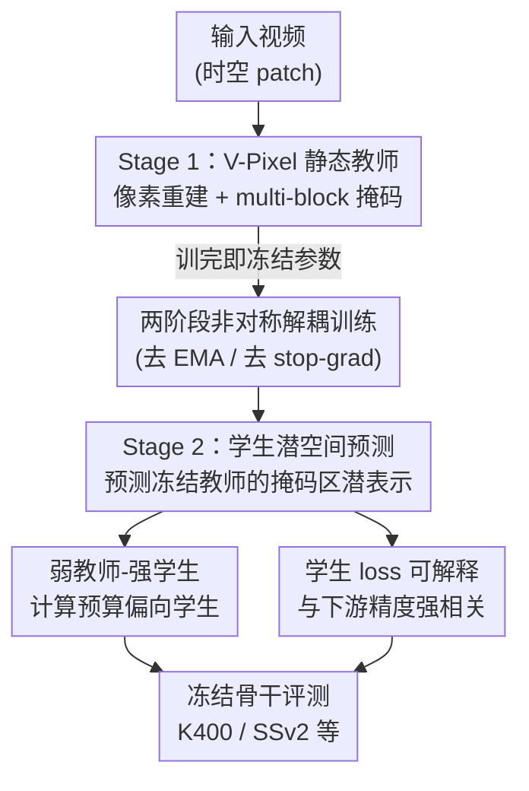

# Rethinking JEPA: Compute-Efficient Video Self-Supervised Learning with Frozen Teachers

**会议**: ICLR 2026  
**OpenReview**: [https://openreview.net/forum?id=3cB9243E9i](https://openreview.net/forum?id=3cB9243E9i)  
**代码**: 待确认  
**领域**: 视频自监督表示学习  
**关键词**: 视频自监督, JEPA, 掩码潜空间预测, 冻结教师, 计算效率

## 一句话总结
这篇论文把 V-JEPA 里"在线 EMA 教师"换成"先用像素重建训好、然后冻住的静态教师"，得到一个两阶段、无需防坍缩正则的简化方案 SALT；在冻结骨干评测下不仅超过 V-JEPA 2，而且更省算力，还意外发现一个又小又弱的教师就能教出很强的学生。

## 研究背景与动机
**领域现状**：视频自监督表示学习里，JEPA 系（I-JEPA / V-JEPA / V-JEPA 2）是当前的主流路线之一。它的做法是：一个 context（学生）编码器加一个 predictor，去预测 target（教师）编码器给出的、被掩码区域的潜空间表示。为了防止师生表示同时坍缩到平凡解（loss 接近 0 但表示无意义），这类方法照搬了 BYOL 的自蒸馏技巧——对教师做 stop-gradient，并用学生权重的指数滑动平均（EMA）来更新教师。

**现有痛点**：这套"在线动态教师 + EMA"机制带来三个具体麻烦。其一，师生表示是**共同演化**的，存在 loss 趋零的坍缩解，必须靠 EMA 调度、stop-gradient 等一堆超参小心地绕开，模型对超参很脆。其二，训练 loss 本身**没有信息量**——因为目标是动态变化的，loss 低不代表表示好，实践者只能依赖 RankMe 之类的代理指标来挑 checkpoint。其三，教师和学生架构被 EMA 绑死，必须**同构同尺寸**，无法用小教师去教大学生。

**核心矛盾**：根子在于"动态教师"这个设计——既要靠它提供监督，又要防止它和学生一起坍缩，于是不得不引入大量隐式正则与代理指标。问题是：高质量的预测目标，真的非得来自一个在线协同演化的教师吗？

**本文目标**：验证"动态教师其实是多余的"，把它替换成一个**预先训好、随后冻结**的静态教师，从而同时拿掉 EMA 和 stop-gradient，让训练流程变透明、可扩展、且省算力。

**切入角度**：作者观察到，稳定且高质量的预测目标完全可以由一个固定编码器提供——只要这个编码器是用一个**本身就不会坍缩**的目标（像素重建）单独训出来的。一旦教师被冻住，学生侧的潜空间预测就退化成一个**普通监督回归**，天然免疫坍缩。

**核心 idea**：把自蒸馏拆成两段独立的、各自都是"正经 loss"的优化——先用像素重建训教师，再冻住它、用 JEPA 目标训学生，史称 SALT（Static-teacher Asymmetric Latent Training）。

## 方法详解

### 整体框架
SALT 要解决的是"如何在不引入 EMA / 防坍缩机制的前提下，得到训练学生所需的稳定高质量目标"。它的答案是把 V-JEPA 那个纠缠在一起的师生协同训练，**拆成前后两个独立阶段**：第一阶段用像素重建单独把教师训好，第二阶段把教师参数冻死、只训学生和 predictor 去预测教师在掩码区域的潜表示。整条流水线只有两个各自独立收敛的 loss，没有 stop-gradient、没有 EMA 调度。

整体上，输入是切成时空 patch 的视频；Stage 1 产出一个固定的教师编码器；Stage 2 在它监督下训练学生编码器加 predictor；最终学生骨干被冻结，外接一个 attentive 分类头在各类视频/图像基准上评测。SALT 的几个核心贡献——两阶段解耦、V-Pixel 教师、学生潜空间预测、以及"弱教师也够用"的计算分配观察——都对应上图的节点。

### 关键设计

**1. 两阶段非对称解耦训练：把自蒸馏拆成两个互不坍缩的正经 loss**

V-JEPA 把"训教师"和"训学生"耦合在一个在线循环里，因此必须用 EMA + stop-gradient 来防止师生一起坍缩。SALT 直接把这个循环切成前后两段：Stage 1 只优化教师的像素重建目标，Stage 2 冻住教师、只优化学生。关键在于，这两段各自的损失都是**结构上不可能坍缩**的——像素重建的目标是真实像素（外部固定信号），潜空间预测的目标是冻结教师的输出（也是外部固定信号），都不存在"目标随被训模型一起退化"的问题。于是 EMA 调度、stop-gradient、动量超参全都不再需要，实现复杂度大幅下降。这种"非对称"还体现在师生**彻底解耦**：教师和学生的架构、尺寸、训练数据都可以独立选择，为后面"小教师教大学生"打开了空间。

**2. V-Pixel 静态教师：像素重建配 multi-block 掩码**

教师在 Stage 1 用的方法作者命名为 V-Pixel——目标函数和 VideoMAE 一样是像素重建，但掩码策略换成了 V-JEPA 2 的 **multi-block 掩码**（短程+长程多块遮挡），而不是 VideoMAE 惯用的 random-tube 掩码。这一步针对的是"教师质量直接决定学生上限"的隐忧：既然教师要冻住当目标，就得保证它给出的潜表示有足够语义。消融显示，在四种掩码里 multi-block 给教师带来 72.5% 的平均精度，明显高于 random-tube 的 70.7%/69.0% 和 causal mask 的 49.5%；更重要的是，用 multi-block 教师监督出来的学生也最强（77.4%）。论文特别指出"VideoMAE 风格的像素重建配 multi-block 掩码效果最好"本身就是一个新的经验发现，因为 VideoMAE 默认用的是 random-tube。

**3. 学生潜空间预测与可解释的训练 loss**

Stage 2 学生沿用 JEPA 的潜空间预测目标，但教师 $\bar f$ 已冻结，于是优化目标退化为

$$\min_{\theta,\phi}\ \mathbb{E}_{x,y}\ \big\lVert\, g_\phi(f_\theta(x),\delta_y) - \bar f(y)\,\big\rVert_1$$

其中 $x,y$ 是输入的两块不相交区域，$f_\theta$ 是学生编码器、$g_\phi$ 是 predictor、$\delta_y$ 标记被掩码区域的时空位置；注意这里不再有 stop-gradient 算子（教师本就不参与梯度）。这个改动的副产品极其有用：因为目标固定，**学生的训练 loss 直接反映表示质量**。论文发现学生 loss 与下游 SSv2 精度近乎线性相关，$R^2$ 高达 0.951（教师训 40k/20k 步时分别为 0.972/0.984）。这意味着选模型时只要看 loss 谁低就行，彻底摆脱了 V-JEPA 那种"loss 没意义、只能靠 RankMe 等代理指标"的窘境。

**4. 弱教师-强学生效应与计算预算分配**

既然师生解耦，就出现一个新问题：固定总算力下，该把步数分给教师还是学生？论文系统消融后给出一个反直觉结论——**应该把算力压倒性地投给学生**。证据有三：其一，教师尺寸消融里，最好的 ViT-L 学生（77.4%）竟来自同样 ViT-L 的教师，比用更大的 ViT-H/ViT-G 教师还高，ViT-G 学生的最佳成绩（78.0%）也来自一个 ViT-L 教师；学生几乎总能反超与之同尺寸或更小的教师。其二，在固定总步数的算力分配实验里，240k 总步的最佳学生只需要一个**仅训 40k 步**的教师来监督。其三，教师自身的 loss 和 RankMe 都**不能**预测学生的下游表现，说明"先把教师练到很强"是一种浪费。这条发现把"该花钱的地方"从教师彻底挪到了学生身上。

### 损失函数 / 训练策略
Stage 1 教师用 VideoMAE 式的像素重建 $\ell_1$ 损失，配 multi-block 掩码；Stage 2 学生用上式潜空间 $\ell_1$ 预测损失。骨干为带 RoPE 的标准 ViT（L/H/g/G），AdamW、batch size 3072。为公平对比，SALT 的 Stage 1 + Stage 2 总步数与 V-JEPA 2 基线的总步数严格相等。训练数据为自建的 V-3.6M（K710 + SSv2 + Panda70M 的 2.8M 子集，约 360 万视频）。

## 实验关键数据

### 主实验
冻结骨干评测下，SALT 在运动理解基准 SSv2 上超过所有基线，外观理解基准 K400 上同样领先 V-JEPA 2：

| 方法 | 参数量 | 数据 | SSv2 | K400 | 总算力(相对) |
|------|--------|------|------|------|------|
| V-JEPA 2 ViT-L | 300M | V-3.6M | 68.2 | 83.8 | 1.4 |
| V-JEPA 2 ViT-H | 600M | V-3.6M | 73.4 | 84.6 | 2.6 |
| **SALT ViT-L** | 300M | V-3.6M | **74.9** | **85.4** | 1.2 |
| **SALT ViT-H** | 600M | V-3.6M | **75.4** | **86.0** | 1.5 |
| **SALT ViT-g** | 1B | V-3.6M | **76.2** | **86.8** | 1.9 |
| **SALT ViT-G** | 2B | V-3.6M | **76.1** | **87.2** | 2.6 |

同样 V-3.6M 数据、224×224 分辨率、240k 总步下，SALT 的 ViT-L 在六个基准上平均精度比 V-JEPA 2 高 **2.3%**；且 accuracy-FLOPs 缩放曲线在各算力预算下都压制 V-JEPA 2 的 Pareto 前沿。

### 消融实验

| 配置 | 关键指标 | 说明 |
|------|---------|------|
| 教师掩码：multi-block | 学生 77.4% | 最佳；V-Pixel 即此设定 |
| 教师掩码：2× random tube | 学生 76.9% | 略逊 |
| 教师掩码：causal mask | 教师仅 49.5% | 明显坍塌 |
| 教师尺寸：ViT-L | ViT-L 学生 77.4% | 同尺寸教师反而最好 |
| 教师尺寸：ViT-H/G | ViT-L 学生 77.3/77.6% | 更大教师无额外收益 |
| 算力分配：40k 教师+200k 学生 | 240k 总步最佳 | 弱教师 + 强学生 |
| 教师数据：仅 K710 / 仅 SSv2 / V-3.6M | 学生均 ≥ V-JEPA 2 | 学生对教师数据混合鲁棒 |

### 关键发现
- **学生 loss 可作为模型选择信号**：与下游精度 $R^2=0.951$ 近乎线性，而教师 loss 和 RankMe 都预测不了学生表现。
- **弱教师够用**：又小又"次优"的教师就能教出 SOTA 级学生，用最强预训练编码器最多只带来边际增益。
- **算力该给学生**：固定总步数下，把绝大多数步数留给学生、教师只训很少步，反而最优。
- 学生几乎总能反超同尺寸或更小的教师，呈现明显的"自举"现象。

## 亮点与洞察
- **把"防坍缩"从机制问题变成结构问题**：不是靠 EMA 小心翼翼绕开坍缩，而是把训练拆成两个目标固定、天然不坍缩的子问题——这是比调超参更彻底的解法。
- **冻结目标让 loss 重新变得可读**：JEPA 长期的痛点是 loss 没意义，SALT 仅靠"冻住教师"就让 loss 与下游精度强相关，附带省掉了一整套代理指标。
- **弱教师-强学生效应反直觉且有实操价值**：它把"该花算力的地方"从教师挪到学生，直接给出"教师只需少量步/小模型"的预算建议，可迁移到任何蒸馏式 SSL 流程。
- 师生解耦使"小教师教大学生"成为可能，这是 EMA 同构约束下做不到的。

## 局限与展望
- 论文以经验研究为主，"为什么弱教师足以教出强学生"缺乏理论解释，更多是现象观察。
- 教师必须先单独训一遍（虽便宜），相比纯端到端方法多了一道流程；两阶段总算力的优势依赖"教师可以训得很短"这一经验结论，换数据域是否仍成立未充分验证。
- 评测集中在冻结骨干 + attentive probing，全微调下静态教师是否仍占优、以及在视频之外模态的泛化性还需更多验证。

## 相关工作与启发
- **vs V-JEPA / V-JEPA 2**：它们用在线/动量 EMA 教师协同训练，需 stop-gradient 防坍缩、loss 不可读；SALT 用冻结教师，去掉 EMA、loss 可读、师生可异构，且在冻结评测下反超。
- **vs VideoMAE**：两者教师阶段都做像素重建，但 VideoMAE 用 random-tube 掩码，SALT 的 V-Pixel 改用 multi-block 掩码并发现其效果更好。
- **vs MVD / UnMasked Teacher / VideoPrism 等冻结教师蒸馏**：这些方法通常预设"必须有一个很强的预训练教师"且常需微调学生才见效；SALT 在公平对比下揭示了相反的"弱教师、强学生"效应。

## 评分
- 新颖性: ⭐⭐⭐⭐ 不是全新组件，但"冻结教师 + 弱教师强学生"的系统性论证扭转了 JEPA 的常识假设。
- 实验充分度: ⭐⭐⭐⭐⭐ 多基准、多尺度、教师数据/掩码/尺寸/算力分配全套消融，对比基线扎实。
- 写作质量: ⭐⭐⭐⭐ 动机清晰、结论可操作；部分关键图表细节散落在附录。
- 价值: ⭐⭐⭐⭐⭐ 给视频 SSL 提供了更简单、更省算力且可解释的实用配方，预算分配建议直接可用。

<!-- RELATED:START -->

## 相关论文

- [\[CVPR 2026\] VideoSSR: Video Self-Supervised Reinforcement Learning](../../CVPR2026/self_supervised/videossr_video_self-supervised_reinforcement_learning.md)
- [\[ICLR 2026\] On the Alignment Between Supervised and Self-Supervised Contrastive Learning](on_the_alignment_between_supervised_and_self-supervised_contrastive_learning.md)
- [\[ICLR 2026\] Understanding the Learning Phases in Self-Supervised Learning via Critical Periods](understanding_the_learning_phases_in_self-supervised_learning_via_critical_perio.md)
- [\[ICLR 2026\] Soft Equivariance Regularization for Invariant Self-Supervised Learning](soft_equivariance_regularization_for_invariant_self-supervised_learning.md)
- [\[ICLR 2026\] Equivariant Splitting: Self-supervised learning from incomplete data](equivariant_splitting_self-supervised_learning_from_incomplete_data.md)

<!-- RELATED:END -->
