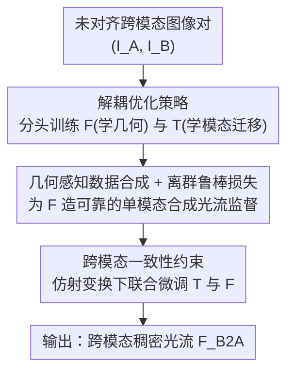

# Rethinking Unsupervised Cross-Modal Flow Estimation: Learning from Decoupled Optimization and Consistency Constraint

**会议**: ICLR 2026  
**OpenReview**: [https://openreview.net/forum?id=7kZQsiy36f](https://openreview.net/forum?id=7kZQsiy36f)  
**代码**: https://github.com/RM-Zhang/DCFlow  
**领域**: 自监督学习 / 跨模态光流估计  
**关键词**: 跨模态光流, 自监督, 解耦优化, 数据合成, 一致性约束

## 一句话总结
DCFlow 把无监督跨模态光流估计从"只靠外观相似度隐式学"改成"解耦优化 + 显式运动监督"：用几何感知的单图数据合成给光流网络造出可靠的合成光流标签，让模态迁移网络和光流网络各练各的子任务，再用跨模态一致性约束把两者联合微调，在五个真实跨模态数据集上把 EPE 大幅压低并刷到无监督方法 SOTA。

## 研究背景与动机
**领域现状**：跨模态光流估计要在不同成像模态（RGB / 近红外 NIR / 热成像 T）的图像对之间建立逐像素对应，是多模态融合、图像恢复、深度估计的底层能力。由于真实场景里几乎拿不到跨模态的 ground-truth 光流，主流走无监督路线，典型结构是"模态迁移网络 $\mathcal{T}$ + 光流网络 $\mathcal{F}$"：先把模态 A 的图翻译成模态 B 的外观，再在同模态下估光流。

**现有痛点**：无论是 NeMAR 这种联合优化、还是 UMF-CMGR 这类两阶段，本质都只用一个光度损失 $L_{ph}$ 去最小化 warp 后图像与目标图的外观差异。这种"只靠外观对齐隐式学光流"的范式在弱纹理、重复结构区域会严重歧义，遇到大视角变化时因为没有直接的运动监督而崩盘——论文里纯外观 baseline 在 MS2(RGB-T) 上 EPE 高达 21.23、F1 几乎 100%，基本等于没学会。

**核心矛盾**：跨模态对齐其实纠缠了两个本不该混在一起的难题——**模态差异**（外观不一样）和**几何错位**（像素要怎么动）。把它们塞进同一个外观损失里同时优化，光流网络永远拿不到关于"运动"本身的直接信号，只能靠外观这个间接代理去猜。

**本文目标**：能不能只用未对齐的跨模态图像对，就给光流网络引入可靠的运动监督？

**切入角度**：作者注意到单模态领域早有"从单张图几何感知地合成运动标签"的成熟做法（深度+虚拟视角重投影）。如果把跨模态任务**解耦**成"模态迁移"和"单模态光流估计"两个子任务，光流网络就可以只吃单模态的合成光流监督来训练，却依然服务于最终的跨模态对齐。

**核心 idea**：用"解耦优化 + 显式合成光流监督 + 跨模态一致性约束"替代"单一外观损失"，让模态差异和几何错位分而治之、再协同。

## 方法详解

### 整体框架
DCFlow 是一个**与具体光流网络无关**的自监督训练框架，目标是训练 $\mathcal{N}(I_A, I_B) = \mathcal{F}_\theta(\mathcal{T}_\phi(I_A), I_B)$ 来预测从 $I_B$ 到 $I_A$ 的稠密光流 $F_{B2A}$，其中 $\mathcal{T}_\phi$ 负责把 $I_A$ 翻译到模态 B 的外观，$\mathcal{F}_\theta$ 在同模态下估光流。整条管线只需要未对齐的跨模态图像对，全程不用任何真实光流标签。

训练时它做三件事：先用**几何感知数据合成**从单张图造出"新视角图 + 稠密合成光流"，给光流网络提供直接的运动监督；再用**解耦优化策略**让 $\mathcal{F}_\theta$（吃合成光流、学几何）和 $\mathcal{T}_\phi$（吃感知损失、学模态迁移）各自用任务专属的监督交替训练，互为对方提供更好的输入；最后用**跨模态一致性约束**把两个网络拉到一起联合微调，教它们真正学会跨模态光流。三个损失在同一步梯度下降里联合优化，但每个损失只作用在它对应的参数上。

### 关键设计

**1. 解耦优化策略：把模态差异和几何错位拆成两个子任务分头训练**

针对"外观损失里模态差异和几何错位纠缠在一起、光流网络拿不到直接运动信号"这个痛点，DCFlow 把整个任务拆成模态迁移和单模态光流估计两路，交替优化、互不干扰梯度。训练光流网络 $\mathcal{F}_\theta$ 时冻住 $\mathcal{T}_\phi$，用**双分支单模态合成数据**直接监督：构造两组训练三元组 $(I_A, I'_A, F_{A,S})$ 和 $(I_B, I'_B, F_{B,S})$（$I'$ 是合成的新视角图，$F_S$ 是对应的合成光流），让网络同时见到两个域的输入，损失为两分支预测光流与合成光流的 L1 距离：

$$\arg\min_\theta \big(L_F(F_A, F_{A,S}) + L_F(F_B, F_{B,S})\big)$$

其中 $F_A = \mathcal{F}_\theta(\mathcal{T}_\phi(I'_A), \mathcal{T}_\phi(I_A))$、$F_B = \mathcal{F}_\theta(I'_B, I_B)$。在多任务学习视角下，同时吃两个模态域能逐步提升网络对跨模态输入的泛化。训练模态迁移网络 $\mathcal{T}_\phi$ 时则反过来冻住 $\mathcal{F}_\theta$：用当前估计的 $F_{B2A}$ 把迁移后图像 warp 成 $I^w_{A,T}=W(I_{A,T}, F_{B2A})$，再以**感知损失**（VGG 各层特征的加权 L2）对齐 $I^w_{A,T}$ 与 $I_B$。选感知损失而非逐像素 L1，是因为它捕捉的是高层结构/语义相似度，对空间错位更宽容——即便此刻光流还不准，监督信号也不会被错位带偏。这套解耦让两网络各自有稳定监督、又互相促进，关键是**光流网络只用单模态监督就能训练，却贡献于跨模态对齐**，从根上绕开了纯外观方法的死结。仅这一步就把 MS2(RGB-T) 的 EPE 从纯外观的 21.23 降到 5.80。

**2. 几何感知数据合成与离群鲁棒损失：从单张图造出可靠的稠密光流监督**

解耦优化能成立的前提，是光流网络得有真正的运动标签可学，而跨模态真值又拿不到——这一步就是把"可靠监督"造出来。给定单张图 $I$，先用预训练单目深度模型（默认 UniDepth）估出深度 $D$，把每个 2D 像素 $x$ 经采样的内参 $K$ 反投影到 3D 点 $X \sim D(x)\cdot K^{-1}\cdot x$；再采样一个虚拟相机位姿 $T\in SE(3)$，把 3D 点重投影到新视角 $x' \sim K\cdot T\cdot X$；新视角图 $I'$ 由原图采样得到，合成光流 $F_S$ 就是 $x$ 与 $x'$ 的 2D 位移。这样得到的图像对几何一致、运动模式真实，比 2D 单应变换（忽略场景几何、运动失真）和前馈 3D 高斯泼溅（有伪影、不稳定）都更可靠。

但合成数据难免有噪声，论文用两层过滤兜底：一是**光度一致性检查**——把 $I'$ 用 $F_S$ warp 回原视角、与 $I$ 比光度误差，超阈值的遮挡/不可见像素标为无效掩码 $M$，不参与损失；二是**离群鲁棒损失**——对有效区域内的逐像素 L1 误差排序，丢掉残差最大的前 $\tau\%$ 像素（这些往往是细结构、扭曲边界等"运动对但外观差"的点），只在剩余集合 $\Omega_\tau$ 上算损失：

$$L_F = \frac{1}{|\Omega_\tau|}\sum_{x\in\Omega_\tau}\|F(x)-F_S(x)\|_1$$

这让监督聚焦在运动和外观都靠谱的像素上。离群鲁棒损失单独贡献了 EPE 0.99、F1 5.79 的提升。值得一提的是整套合成对深度质量并不敏感：深度只作为中间变量，warp 图和合成光流用的是同一份深度，所以即便深度有偏，二者仍自洽；实验里给深度加高斯/尺度噪声和模糊，性能也只轻微下降。

**3. 跨模态一致性约束：在已知空间变换下把两个网络联合拉到跨模态任务上**

解耦优化只保证了收敛稳定，却没有任何一步**显式**教网络做"跨模态"光流——模型实际上是在赌两个独立优化网络的泛化能力凑得上。一致性约束就是来补这一刀的。给定跨模态对 $(I_A, I_B)$ 和当前预测 $F_{B2A}$，对两张图施加**已知的随机仿射变换**（缩放、旋转、平移）得到 $(\tilde I_A, \tilde I_B)$；因为变换已知，可由 $F_{B2A}$ 推出理论上应得到的变换后光流 $\tilde F^*_{B2A}$；再把增广对过一遍完整管线得到新预测 $\tilde F_{B2A}=\mathcal{F}_\theta(\mathcal{T}_\phi(\tilde I_A), \tilde I_B)$。基于"光流在已知变换下应保持几何一致"的假设，联合优化两个网络：

$$\arg\min_{\phi,\theta} L_F(\tilde F_{B2A}, \tilde F^*_{B2A})$$

这里 $L_F$ 仍用离群鲁棒损失。这个自监督约束直接把损失打在真实跨模态对上，逼着模态迁移和光流两个网络互相适应、联合学习跨模态对应，而不再只靠各自泛化。它把 MS2(RGB-T) 的 EPE 从 4.81 进一步压到 3.46、F1 从 51.39 压到 35.89，是三件套里收益最大的一环。为避免早期光流不准时一致性约束反而帮倒忙，它在训练 10,000 步之后才引入。

### 损失函数 / 训练策略
总训练目标把三路损失合在一步梯度下降里：

$$\arg\min_{\phi,\theta} L_F(F_A, F_{A,S}) + L_F(F_B, F_{B,S}) + \lambda_T L_T(I^w_{A,T}, I_B) + \lambda_C L_F(\tilde F_{B2A}, \tilde F^*_{B2A})$$

实现上 $\lambda_T=2.0$、$\lambda_C=0.05$，从头训练 30,000 步、batch size 4，一致性约束在 10,000 步后开启。$\mathcal{F}_\theta$ 默认用 RAFT（损失加在所有迭代中间预测上），$\mathcal{T}_\phi$ 用 U-Net 以兼顾细节与全局上下文。模态迁移方向选"信息更丰富 → 更稀疏"（如 RGB/NIR → 热成像），因为前者纹理结构更全、迁移更稳。

## 实验关键数据

### 主实验
在 MS2、VTD、RNS 三个公开数据集上，通过把 LiDAR 点投影到另一视角得到稀疏真值光流，构建出覆盖 RGB / NIR / 热成像的五个跨模态子集；指标为 EPE（端点误差）与 F1（光流离群率），越低越好。DCFlow 在所有无监督和大规模预训练方法中全面最优：

| 数据集 | 指标 | DCFlow | MINIMA(预训练) | NeMAR(无监督) | 相对 MINIMA 降幅 |
|--------|------|--------|----------------|---------------|------------------|
| MS2 (RGB-T) | EPE | 3.46 | 5.97 | 19.25 | 42.0% |
| MS2 (NIR-T) | EPE | 4.53 | 7.10 | 28.41 | 36.2% |
| MS2 (RGB-NIR) | EPE | 0.96 | 5.44 | 11.39 | 82.4% |
| VTD (RGB-T) | EPE | 3.65 | 6.34 | 23.43 | 42.4% |
| RNS (RGB-NIR) | EPE | 1.90 | 2.34 | 25.11 | 18.8% |

无监督老方法（NeMAR、UMF-CMGR）EPE 普遍在 20~30、F1 逼近 100%，印证了纯外观优化在大模态差异下根本收敛不了；DCFlow 甚至逼近用稀疏真值训练的有监督方法（如 RAFT 在 MS2(RGB-T) 上 EPE 1.70），而它完全不用跨模态真值。

### 消融实验
均在 MS2(RGB-T) 上进行：

| 配置 | EPE | F1 | 说明 |
|------|-----|----|------|
| 纯外观优化 baseline | 21.23 | 98.45 | 只用光度损失，基本失败 |
| + 解耦优化 | 5.80 | 57.18 | 引入合成光流直接监督，质变 |
| + 离群鲁棒损失 | 4.81 | 51.39 | 过滤噪声监督 |
| + 跨模态一致性约束 | 3.46 | 35.89 | 完整模型，收益最大 |

数据合成策略对比：2D 变换 EPE 13.12、3D 高斯泼溅 5.11、几何感知合成 3.46，验证几何一致性对监督质量的决定性作用。

### 关键发现
- **解耦优化是从 0 到 1 的质变**：纯外观 21.23 → 解耦 5.80，说明给光流网络"直接运动监督"远比"间接外观对齐"有效；这也是全文最核心的论点。
- **一致性约束是收益最大的单环**：4.81 → 3.46，因为它是唯一把损失直接打在真实跨模态对上、显式教网络做跨模态对应的环节。
- **对深度质量与深度网络都鲁棒**：深度图加大幅退化 EPE 仅从 3.46 升到 4.00；换 Depth Anything v2 / Metric3D v2 结果基本不变——深度只是自洽的中间量。
- **框架与光流网络无关**：换成 GMA / FlowFormer / SEA-RAFT，相对纯外观 baseline 都从 EPE 20+ 降到 3.5~4.1，证明这是通用训练框架而非某个网络的技巧。

## 亮点与洞察
- **"解耦"把一个纠缠问题拆成两个可监督的子问题**：模态差异交给感知损失、几何错位交给合成光流，各自有干净的监督信号，这种"分而治之再协同"的思路可迁移到任何把外观与几何混在一个损失里的跨域对应任务。
- **用单图深度+重投影造光流监督，绕过了跨模态真值的根本难题**：而且巧妙之处在于 warp 图和合成光流共用同一份深度，使得标签对深度误差天然自洽——这解释了为什么深度再差也不太掉点。
- **一致性约束是唯一"显式跨模态"的信号**：解耦优化本质是在赌泛化，作者敏锐地补上"已知仿射变换下光流应一致"这个自监督约束，把训练真正拉回跨模态目标上。
- **延迟引入一致性约束的工程细节**：前 10k 步先让模型把光流学到能用，再开启联合优化，避免早期噪声预测污染一致性损失，是个值得复用的训练 trick。

## 局限与展望
- **真值光流本身是稀疏的**：评测真值靠 LiDAR 投影得到，稀疏标注下的 EPE/F1 能多大程度反映稠密对齐质量存疑，弱纹理大位移的极端区域可能未被充分评测。
- **依赖预训练单目深度模型**：虽然论文论证了对 NIR/热成像的零样本泛化（深度主要靠几何线索、模态不变），但在深度基础模型彻底失效的极端模态或场景下，几何感知合成的可靠性会受限。
- **模态迁移方向需要人工先验**：选"信息丰富 → 稀疏"方向是基于经验观察，缺少自动判定机制，换到不清楚哪个模态更"丰富"的新模态对时需要试验。
- **改进方向**：把一致性约束从仿射推广到更复杂的非刚性变换、或让模态迁移方向可学，可能进一步提升大形变与未知模态对的鲁棒性。

## 相关工作与启发
- **vs NeMAR / UMF-CMGR（无监督外观对齐）**：他们只用光度/外观损失隐式学光流，在弱纹理和大视角下崩盘；DCFlow 引入显式合成光流监督 + 解耦优化，从范式上解决了"没有直接运动信号"的问题，EPE 从 20+ 降到 3.x。
- **vs CrossRAFT / MINIMA（大规模合成预训练）**：他们用带真值位移的多视角 RGB 合成跨模态数据做直接监督，但有合成到真实的域差；DCFlow 直接从未标注真实数据学，五个数据集上 EPE 比 MINIMA 低 18.8%~82.4%。
- **vs SSHNet（跨模态单应解耦）**：SSHNet 同样用分离优化但只建模全局单应变换；DCFlow 处理的是更难、应用面更广的逐像素稠密对应。
- **vs 单模态数据合成方法（Watson/Aleotti/Liang 等）**：他们证明了单图造运动标签在单模态下有效，DCFlow 首次系统性地把这一思路引入并验证于跨模态场景。

## 评分
- 新颖性: ⭐⭐⭐⭐⭐ 把"显式合成光流监督 + 解耦 + 一致性约束"系统引入跨模态光流，范式层面的创新而非增量。
- 实验充分度: ⭐⭐⭐⭐⭐ 五数据集三模态对比 + 训练策略/合成策略/深度鲁棒性/光流网络无关性多维消融，覆盖完整。
- 写作质量: ⭐⭐⭐⭐ 动机推导清晰、图表自洽；术语与符号稍多但组织得当。
- 价值: ⭐⭐⭐⭐⭐ 通用且网络无关的自监督训练框架，逼近有监督性能且无需跨模态真值，落地价值高。

<!-- RELATED:START -->

## 相关论文

- [\[ECCV 2024\] SCPNet: Unsupervised Cross-modal Homography Estimation via Intra-modal Self-supervised Learning](../../ECCV2024/self_supervised/scpnet_unsupervised_cross-modal_homography_estimation_via_intra-modal_self-super.md)
- [\[ICLR 2026\] PredNext: Explicit Cross-View Temporal Prediction for Unsupervised Learning in Spiking Neural Networks](prednext_explicit_cross-view_temporal_prediction_for_unsupervised_learning_in_sp.md)
- [\[ICLR 2026\] XIL: Cross-Expanding Incremental Learning](xil_cross-expanding_incremental_learning.md)
- [\[ICLR 2026\] Unsupervised Representation Learning - An Invariant Risk Minimization Perspective](unsupervised_representation_learning_-_an_invariant_risk_minimization_perspectiv.md)
- [\[ICLR 2026\] Rethinking JEPA: Compute-Efficient Video Self-Supervised Learning with Frozen Teachers](rethinking_jepa_computeefficient_video_self-supervised_learning_with_frozen_teac.md)

<!-- RELATED:END -->
