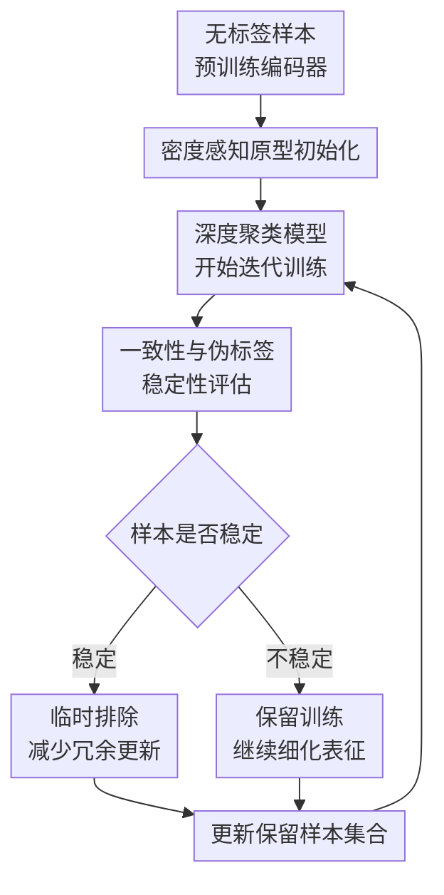

# Samples Are Not Equal: A Sample Selection Approach for Deep Clustering

**会议**: ICLR2026  
**OpenReview**: [https://openreview.net/forum?id=SpsmpVo349](https://openreview.net/forum?id=SpsmpVo349)  
**论文**: [OpenReview](https://openreview.net/forum?id=SpsmpVo349)  
**代码**: https://github.com/notoaudrey/Samples-Are-Not-Equal  
**领域**: 自监督学习 / 深度聚类  
**关键词**: 深度聚类、样本选择、密度感知初始化、伪标签稳定性、训练效率

## 一句话总结

这篇论文指出深度聚类会过度学习高密度区域里简单且重复的样本，并提出一个可插拔样本选择组件：初始化时用局部密度重估聚类原型，训练中用预测一致性和伪标签稳定性动态移除已学会样本，从而在多种深度聚类基线中同时提升聚类精度和训练效率。

## 研究背景与动机

**领域现状**：深度聚类通常先用自监督预训练编码器得到较好的视觉表征，再通过聚类头、自训练、自标注或对比学习把无标签样本分到语义簇里。近年的 SCAN、CC、TCL、CDC 等方法已经能在 CIFAR、STL、ImageNet 子集上取得很高的聚类准确率，其中一个共识是：预训练特征空间里的近邻样本往往共享语义，因此可以用伪标签、近邻一致性或原型来构造无监督监督信号。

**现有痛点**：这些方法虽然会设计更稳的伪标签或更好的聚类头，却大多默认每个样本的训练价值相同。论文的观察是，特征空间并不是均匀分布的：大量样本挤在高密度区域，它们通常是类别中最典型、最容易、最重复的模式；中低密度区域样本更少，却包含更多视角、外观、局部细节和长尾变化。若所有样本被同等使用，模型很容易被高密度区域的冗余模式牵着走。

**核心矛盾**：深度聚类既需要稳定的伪监督信号，又不能只相信最容易被聚起来的样本。高密度样本能让训练快速收敛，但它们数量太多，会主导聚类头初始化和后续梯度更新；低密度样本更能扩展类别边界和表征多样性，却在训练资源分配中天然弱势。论文把这个问题概括为对简单冗余特征模式的过拟合。

**本文目标**：作者要解决两个子问题。第一，聚类头初始化时，如何避免初始原型被高密度样本的平均特征拉偏。第二，迭代训练时，如何判断哪些样本已经被模型可靠学会，并把训练注意力重新分配给仍不稳定、仍欠学习的样本。

**切入角度**：论文从“样本不等价”这个观察出发，不把样本选择理解为监督学习里的按 loss 选 hard example，而是结合深度聚类的无标签条件设计指标。初始化阶段使用特征空间的局部密度，因为密度能揭示样本是否处于冗余高密度区域；训练阶段则使用弱增强和强增强下的预测一致性，以及跨 epoch 的伪标签稳定性，因为这些信号不依赖真值标签，却能反映模型对某个样本是否已经形成稳定判断。

**核心 idea**：用“密度感知原型初始化 + 学习状态驱动的动态样本选择”替代一视同仁的样本使用方式，让深度聚类少花资源重复拟合已掌握的简单样本，多关注复杂而多样的欠学习样本。

## 方法详解

### 整体框架

这篇论文不是提出一个全新的聚类主干，而是提出一个可以插到多种深度聚类方法上的增强组件。整体流程分成两段：训练开始前，先用预训练编码器抽取所有样本特征，通过 K-Means 得到初始簇分配，再按簇内局部密度给样本加权，重估更不偏向高密度区域的聚类原型；训练过程中，每个 epoch 追踪样本在弱增强和强增强下的预测一致性，以及最近若干轮伪标签是否变化，把已经稳定的样本临时排除出梯度更新集合。

这个设计的关键是把“样本价值”拆成两个时间尺度。静态的局部密度负责修正一开始的聚类头原型，动态的学习状态负责决定后续训练资源继续给谁。这样一来，模型不会一开始就被最密集的典型样本定住原型，也不会在后期继续反复训练那些预测已经稳定的样本。

### 关键设计

**1. 密度感知原型初始化：让低密度复杂样本在聚类头起点里有发言权**

许多聚类头方法会随机初始化分类头，或者像 CDC 那样先在预训练特征上做原型初始化。后者比随机初始化更稳定，但如果直接对簇内所有特征做平均，高密度区域里的典型样本会因为数量多而主导原型位置。结果是，原型更像“最常见样本”的中心，而不是能覆盖簇内多样模式的中心；对于卡车不同视角、细粒度外观、非典型姿态这类中低密度样本，初始聚类头就已经带有偏置。

作者的做法是在初始 K-Means 得到伪簇后，只在每个簇内部估计样本局部密度。对样本 $x_i$ 的特征 $z_i$，找到同簇内的 $k$ 个最近邻 $z_i^{(j)}$，用平均近邻距离构造权重：$w_i=\exp(\alpha \cdot \frac{1}{k}\sum_{j=1}^{k}\|z_i-z_i^{(j)}\|_2)$。这个公式的方向很直观：高密度样本到近邻距离小，权重较低；低密度样本离近邻更远，权重更高。随后每个簇 $C_j$ 的原型不再是普通平均，而是密度加权平均：$c_j=\frac{\sum_{z_i\in C_j}w_i z_i}{\sum_{z_i\in C_j}w_i}$。

这样做并不是为了偏爱离群点，而是为了抵消数量优势。高密度区域的重复样本已经天然很多，即使每个样本权重小，总体仍会影响原型；中低密度样本数量少，适度提高权重可以让原型更接近簇的完整形状。论文还说明，$\alpha$ 控制密度权重对距离的敏感度，实验中 $\alpha=1\sim3$ 通常稳健，$k$ 从 10 到 50 变化时性能波动很小，说明这个初始化不是靠精细调参才成立。

**2. 预测一致性二阶差分：用学习状态而不是静态难度决定样本去留**

只用密度做样本删除看似自然，但论文认为这会带来两个问题：反复做近邻搜索代价高，而且高维空间里的密度估计可能误删真正有信息量的样本。于是作者把训练阶段的样本选择从“这个样本在哪里”改成“模型现在是否已经稳定掌握这个样本”。对每个样本 $x_i$，方法生成弱增强视图 $x_i^w$ 和强增强视图 $x_i^s$，通过当前模型得到预测分布 $P_i^w$ 和 $P_i^s$，并用余弦相似度定义预测一致性 $S_i=\cos(P_i^w,P_i^s)$。

单次一致性高并不一定代表样本真的学会了，因为偶然的增强组合或噪声伪标签也可能产生短暂一致。因此论文进一步追踪最近三个 epoch 的一致性变化，用二阶差分 $\Delta^2S_i^{(t)}=S_i^{(t)}-2S_i^{(t-1)}+S_i^{(t-2)}$ 衡量一致性的“加速度”。当 $|\Delta^2S_i^{(t)}|<\epsilon$ 时，说明这个样本的一致性曲线不再剧烈波动，模型对它的判断进入相对平稳状态。相比直接看 loss，这个指标更适合无监督聚类，因为它不需要真值标签，也不会简单把伪标签早期噪声当成样本难度。

这个设计的妙处在于，样本选择是随模型变化的。一个早期不稳定的低密度样本会被保留训练；如果后期它的预测在增强扰动下已经稳定，就可以被临时排除。相反，一个看似简单但预测一致性仍波动的样本不会被贸然丢掉。训练资源由样本的当前学习状态调度，而不是由一次性静态统计决定。

**3. 伪标签稳定性约束：避免把偶然一致的错误样本当成已学会**

深度聚类的另一个风险是伪标签本身会变。某个样本在弱增强和强增强下可能给出很接近的预测分布，但如果它最近几轮被分到的簇一直改变，这种一致性就不可靠，甚至可能只是模型在错误簇之间来回摇摆。为此，作者把伪标签稳定性作为排除样本的第二个必要条件：只有当样本最近三个 epoch 的伪标签保持一致，同时预测一致性的二阶差分低于阈值，才把它判定为稳定样本。

最终的动态样本选择有两个动作。若样本满足一致性稳定和伪标签稳定，就加入稳定集合 $D_s$，并从当前训练集合 $D_t=D_u-D_s$ 中临时排除，减少冗余梯度更新；若样本的一致性波动超过阈值，或伪标签发生变化，就继续保留在训练队列里。这个规则解释了为什么论文能同时提升精度和效率：它不是随机少看一部分数据，而是有条件地少看那些模型已经大概率正确掌握的样本。

**4. 插件式接入：把样本选择放在聚类算法外层而不是重写主干**

论文把方法做成 plug-in，主要接到现有深度聚类方法的两个接口上：初始化聚类头参数，以及决定每轮实际参与更新的样本集合。底层编码器、聚类损失、增强协议和各基线原本的训练目标可以保留，因此它能和 CC、TCL、SCAN、CDC 等不同范式组合。这个定位很重要，因为论文要证明的不是某个新主干强，而是“样本不等价”这个问题普遍存在。

从实现角度看，这种外层插件也让方法的收益更可解释。DACHI 改的是训练起点，减少原型偏置；DSS 改的是训练过程，减少重复学习并提升对不稳定样本的关注。消融实验里两个模块单独加入都有效，合起来最好，说明二者并非同一个机制的重复包装，而是在不同阶段缓解同一个高密度冗余偏置问题。

### 一个完整示例

可以把 STL-10 中的“truck”类想成一个具体例子。预训练特征空间里，大量样本是侧面或斜前方拍摄的典型卡车，背景干净、车身完整，因此它们在特征空间里挤成高密度区域；少量样本可能是不同车型、特殊视角、局部遮挡或细节更复杂的卡车，它们分布在中低密度区域。

如果用普通原型初始化，初始 truck 原型会主要由典型卡车平均出来，后续训练也会频繁看到这些容易且重复的样本。本文方法先给低密度卡车样本更高的原型权重，让初始聚类头不要只代表典型外观。训练若干轮后，典型卡车在弱增强和强增强下预测都稳定，且伪标签连续三轮不变，就会被临时移出更新集合；那些视角罕见或预测仍在波动的样本继续参与训练。最后模型不是只把最像 truck 的图聚好，而是更能覆盖 truck 类内部的复杂变化。

### 损失函数 / 训练策略

本文没有替换各基线原有的聚类损失，而是把样本选择作为外层训练策略接入。训练开始时加载预训练编码器 $f_\theta(\cdot)$，抽取全部特征并做 K-Means；之后用密度加权原型初始化聚类头 $g_\phi(\cdot)$。每个 epoch 内，对所有样本计算弱增强和强增强预测，更新 $S_i$、$\Delta^2S_i$ 和伪标签历史，再用稳定性规则更新保留训练集合 $D_t$。

实验设置中，图像任务采用 ResNet-34 作为 backbone，预训练使用 MoCo-v2，增强协议跟随 CDC / SCAN 的设置。主要超参数包括密度权重敏感度 $\alpha$、近邻数 $k$ 和稳定阈值 $\epsilon$。论文在多数实验中设置 $\alpha=2.0$、$k=10$；$\epsilon$ 多数情况取 $0.1$，在部分 CC 组合上对 STL-10 和 ImageNet-10 取 $0.01$。

## 实验关键数据

### 主实验

论文在 CIFAR-10、CIFAR-20、STL-10、ImageNet-10、ImageNet-Dogs、Tiny-ImageNet 六个标准深度聚类 benchmark 上评估，并把插件接入 CC、TCL、SCAN、CDC 四个代表性基线。下面表格摘录论文 Table 1 的平均结果，重点看同一基线加插件前后的变化。

| 方法 | 平均表现 | 代表性提升 | 说明 |
|------|----------|------------|------|
| CC | 60.8 | - | 较早的对比聚类基线 |
| CC + Ours | 66.9 | +6.1 | 提升最大，说明样本选择对较弱基线很有帮助 |
| TCL | 62.7 | - | Twin contrastive learning 基线 |
| TCL + Ours | 68.0 | +5.3 | 多数据集稳定提升 |
| SCAN | 68.7 | - | 自标注 / 近邻一致性代表方法 |
| SCAN + Ours | 71.0 | +2.3 | 在 ImageNet-10 上达到最好结果 |
| CDC | 72.7 | - | ICLR 2025 强基线，已有更好的聚类头校准 |
| CDC + Ours | 73.8 | +1.1 | 强基线仍有增益，并在五个数据集上取得最好结果 |

训练效率方面，动态剪枝会逐步减少参与梯度更新的样本数。论文报告平均能带来约 $1.3\times$ 的训练加速，不同基线的样本减少比例不同。

| 方法 | CIFAR-10 平均剪枝比例 | CIFAR-20 平均剪枝比例 | STL-10 平均剪枝比例 | 平均剪枝比例 / 加速 |
|------|----------------------|----------------------|-------------------|----------------------|
| CDC + Ours | 17.4% | 12.1% | 14.3% | 14.6% |
| SCAN + Ours | 37.7% | 52.9% | 29.9% | 40.2% |
| CC + Ours | 44.5% | 30.9% | 28.1% | 34.5% |
| Overall | - | - | - | 约 $1.3\times$ speed up |

### 消融实验

论文把两个核心模块拆开验证：DACHI 表示密度感知聚类头初始化，DSS 表示动态样本选择。下面表格摘录 CDC 和 SCAN 在 CIFAR-10、CIFAR-20、STL-10 上的平均结果。

| 配置 | 平均指标 | 相对原基线 | 说明 |
|------|----------|------------|------|
| CDC | 78.2 | - | 强基线原始结果 |
| CDC + DACHI | 78.7 | +0.5 | 只改初始化已有收益 |
| CDC + DSS | 78.6 | +0.4 | 只做动态样本选择也有效 |
| CDC + DACHI + DSS | 78.9 | +0.7 | 两个模块互补，完整方法最好 |
| SCAN | 73.0 | - | SCAN 原始结果 |
| SCAN + DACHI | 74.9 | +1.9 | 初始化修正对 SCAN 帮助明显 |
| SCAN + DSS | 73.9 | +0.9 | 动态筛样提升训练稳定性 |
| SCAN + DACHI + DSS | 75.3 | +2.3 | 完整方法提升最大 |

论文还从密度区域角度验证了核心假设：高密度区域大家都能做得不错，差距主要出现在中低密度复杂样本上。

| 方法 | CIFAR-10 High | CIFAR-10 Medium | CIFAR-10 Low | STL-10 High | STL-10 Medium | STL-10 Low |
|------|---------------|-----------------|--------------|-------------|---------------|------------|
| Random | 96.3 | 88.4 | 85.6 | 90.1 | 84.1 | 70.1 |
| CDC | 97.5 | 90.3 | 87.1 | 95.4 | 89.2 | 79.1 |
| Ours | 97.7 | 90.9 | 88.4 | 95.6 | 90.2 | 81.5 |

### 关键发现

- DACHI 和 DSS 都不是“锦上添花”的小 trick。DACHI 改善训练起点，DSS 改善训练过程；在 CDC 和 SCAN 上分别单独有效，组合后表现最好。
- 提升集中在中低密度样本。以 STL-10 为例，相比 CDC，本文方法在 low-density 区域从 79.1% 提到 81.5%，比 high-density 区域 95.4% 到 95.6% 的变化更明显，支持“缓解简单冗余模式过拟合”的解释。
- 剪枝阈值 $\epsilon$ 需要适中。CIFAR-10 上从不剪枝到 $\epsilon=0.1/0.2$，ACC 从 94.2% 提到 94.5%；但当 $\epsilon=0.5$、剪枝比例接近 49.9% 时，ACC 降到 93.9%，说明过度移除会丢掉仍有价值的训练样本。
- DSS 优于随机剪枝和 loss-based 剪枝。论文的对比显示，按一致性稳定性选择样本比固定比例随机删除更稳，也比直接替换成标准训练 loss 的二阶变化更适合无监督聚类。
- 方法对 $k$ 不敏感，对 $\alpha$ 只需中等范围。$k$ 从 10 到 50 时 ACC / NMI / ARI 波动很小；$\alpha=1\sim3$ 通常稳定有效，过大没有额外收益。

## 亮点与洞察

- 论文最有价值的地方不是“少训练一些样本”本身，而是把深度聚类里的样本不均衡问题讲清楚了：高密度区域的样本并不只是更多，它们还更简单、更重复，因此会在原型和梯度两端形成双重偏置。
- 密度感知初始化是一个很轻量但很贴题的修正。它没有改变 K-Means 这类标准初始化流程，只是在簇内平均时让低密度样本适度增加影响力，因此可以很自然地嵌入现有聚类头方法。
- DSS 的指标选择比较克制。作者没有强行用监督学习常见的 loss / gradient norm，而是用增强一致性和伪标签稳定性这两个无监督聚类内部可得的信号，避免了“拿不到标签却套监督样本选择”的错位。
- 二阶差分比单点一致性更能反映训练动态。一个样本当前预测一致不代表它一直稳定，而 $\Delta^2S$ 至少能观察最近三轮变化，减少偶然一致造成的误判。
- 插件式定位让这项工作具有迁移价值。类似思想可以迁移到无监督域适应、开放集聚类、多模态聚类或伪标签训练任务：先识别冗余高置信样本，再把学习资源让给仍不稳定的边界样本。

## 局限与展望

- 论文主要实验仍集中在图像深度聚类，虽然附录补充了 CNAE-9、Semeion、News20 等非图像结果，但方法在文本大模型表示、多模态 embedding 或更大规模检索聚类上的表现仍需要进一步验证。
- 样本被“临时排除”后如何 reinclusion，论文描述为当一致性波动或伪标签变化时保留 / 重新关注，但实际实现中的历史状态维护、采样队列细节和不同基线损失的交互还可以写得更透明。
- 密度权重提高低密度样本影响力时，仍存在离群点风险。论文通过同簇近邻距离和实验调参缓解了这个问题，但在噪声很强或类别结构非凸的数据上，低密度不一定等于有价值。
- 稳定性阈值 $\epsilon$ 会影响性能和效率之间的平衡。虽然论文给出了敏感性实验，但真实使用时不同数据集、不同聚类头和不同训练轮数可能仍需要小范围调节。
- 未来可以把稳定样本从“移除 / 保留”的二值决策扩展成软权重，把训练资源连续分配给不同学习状态的样本；也可以结合类别级均衡约束，防止某些簇被过度剪枝。

## 相关工作与启发

- **vs SCAN**: SCAN 依赖近邻一致性和自标注训练，把预训练特征空间的邻域关系转成聚类监督信号；本文不替代 SCAN 的目标，而是在初始化和训练样本集合上减少高密度冗余样本的主导作用，因此 SCAN + Ours 能在多个数据集上提升。
- **vs CC / TCL**: CC 和 TCL 主要从对比聚类目标出发学习更好的簇分配与表示；本文关注的是哪些样本应该继续参与训练。它与对比目标正交，所以在 CC、TCL 上提升幅度反而很大。
- **vs CDC**: CDC 已经用更可靠的原型初始化缓解随机聚类头带来的不稳定，但普通原型仍会受簇内密度不均影响。本文的 DACHI 可以看成对 CDC 初始化思想的密度校正，DSS 则补上训练过程中样本学习状态的动态调度。
- **vs 监督样本选择 / core-set / active learning**: 监督样本选择常用 forgetting events、influence、gradient norm、uncertainty 等指标，主动学习关注“该标哪个样本”。本文没有标签预算，也不能用真值 loss，因此目标变成“该暂时少训练哪个已学会样本”，指标也改成预测一致性和伪标签稳定性。
- **对后续研究的启发**: 在伪标签学习任务中，高置信样本并不总是越多越好。它们提供稳定信号的同时，也可能让模型困在最容易的模式里；更好的策略可能是动态维护一个“仍值得学习”的样本池，而不是机械扩大高置信训练集。

## 评分

- 新颖性: ⭐⭐⭐⭐☆ 从样本不等价角度重新审视深度聚类训练，密度初始化和动态样本选择组合得比较自然，但核心工具仍建立在近邻、增强一致性和伪标签稳定性这些已有概念上。
- 实验充分度: ⭐⭐⭐⭐⭐ 覆盖六个主流 benchmark、四个强弱不同基线，并有消融、密度区域分析、阈值敏感性、剪枝策略对比、多随机种子和非图像附录实验。
- 写作质量: ⭐⭐⭐⭐☆ 主线清楚，动机图和实验分析支撑较好；不过动态排除 / 重新纳入的实现细节还可以更细，部分效率表述也需要读者结合附录理解。
- 价值: ⭐⭐⭐⭐☆ 对深度聚类和伪标签训练都有实用启发，尤其适合作为 plug-in 改善现有方法；若在更大规模和跨模态聚类上继续验证，价值会更高。

<!-- RELATED:START -->

## 相关论文

- [\[ICLR 2026\] Mini-cluster Guided Long-tailed Deep Clustering](mini-cluster_guided_long-tailed_deep_clustering.md)
- [\[ICML 2025\] Deep Learning is Not So Mysterious or Different](../../ICML2025/self_supervised/deep_learning_is_not_so_mysterious_or_different.md)
- [\[ICCV 2025\] To Label or Not to Label: PALM – A Predictive Model for Evaluating Sample Efficiency in Active Learning Models](../../ICCV2025/self_supervised/to_label_or_not_to_label_palm_-_a_predictive_model_for_evaluating_sample_efficie.md)
- [\[ICLR 2026\] Unified and Efficient Multi-view Clustering from Probabilistic Perspective](unified_and_efficient_multi-view_clustering_from_probabilistic_perspective.md)
- [\[ICLR 2026\] Chart Deep Research in LVLMs via Parallel Relative Policy Optimization](chart_deep_research_in_lvlms_via_parallel_relative_policy_optimization.md)

<!-- RELATED:END -->
