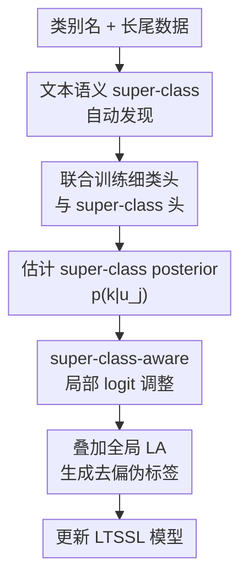

# SCAD: Super-Class-Aware Debiasing for Long-Tailed Semi-Supervised Learning

**会议**: ICLR 2026  
**OpenReview**: [https://openreview.net/forum?id=aSCtAZEcRa](https://openreview.net/forum?id=aSCtAZEcRa)  
**代码**: https://github.com/aitrics-tom/SCAD  
**领域**: 长尾半监督学习 / 自监督与半监督表示学习  
**关键词**: 长尾半监督学习, 伪标签去偏, logit adjustment, super-class, 局部类别不均衡  

## 一句话总结
SCAD 发现长尾半监督学习里“语义相近类别内部也长尾”的局部偏置问题，并用自动发现的 super-class 上下文对 logit adjustment 做样本级动态修正，在 CIFAR、STL、ImageNet-127 和 Food101-LT 等基准上稳定提升现有 LTSSL 方法。

## 研究背景与动机
**领域现状**：半监督学习通常用少量标注样本和大量未标注样本训练模型，FixMatch 这类方法会先在弱增强视图上产生高置信伪标签，再要求强增强视图预测一致。这个范式在类别分布相对均衡时很有效，但真实数据经常是 long-tailed：少数头部类样本极多，大量尾部类样本极少。

**现有痛点**：在长尾半监督学习（LTSSL）中，伪标签本身会带偏。模型早期更容易把尾部类样本预测成相近的头部类，错误伪标签再反过来训练模型，使尾部类别的表示越来越被头部邻居压制。近年的主流补救方式是 logit adjustment（LA）：根据全局类别先验给每个类别一个固定修正，或者像 ACR、CDMAD 那样估计更好的先验/偏置强度后再套用 LA。

**核心矛盾**：作者指出，问题不只是“全局上头部类多、尾部类少”。更危险的是同一个语义大类内部也会局部不均衡，比如 CIFAR10-LT 里 automobile 和 truck 都属于 vehicle，二者视觉上容易混淆，但 automobile 样本远多于 truck。标准 LA 只看全局类别频率，不知道当前样本到底处在 vehicle 这个局部竞争环境里，所以它给 truck 的补偿并不一定能压过 automobile 的局部优势。

**本文目标**：论文要解决三个子问题：第一，如何在没有人工层级标注的情况下得到可用的 super-class；第二，如何让模型在训练中学会判断一个未标注样本属于哪个 super-class；第三，如何把这个粗粒度上下文转成对细粒度类别 logit 的动态修正，从而专门处理语义邻居之间的局部偏置。

**切入角度**：作者的观察是，粗粒度 super-class 分类通常比细粒度分类更稳健，因为类别数更少，而且把若干细类合并后分布往往没那么长尾。即使模型还分不准“truck 还是 automobile”，它较早学会“这是 vehicle”是有希望的。于是可以用这个较可靠的粗类信号来告诉 LA：当前该重点处理 vehicle 内部的局部竞争，而不是对所有类一视同仁。

**核心 idea**：SCAD 用文本语义自动构造 super-class，并训练一个辅助 super-class 分类器；对每个未标注样本，它根据 super-class posterior 生成样本专属的局部 logit 调整项，叠加到标准 LA 上，专门压制同一 super-class 内的头部竞争类。

## 方法详解
SCAD 不是替换 FixMatch、DASO、ACR 等 LTSSL 框架，而是给它们加一个“语义局部去偏”模块。它先从类别名得到 super-class 映射，再在训练时同时学习细类分类器和 super-class 分类器，最后在伪标签生成阶段把全局 LA 与 super-class-aware adjustment 合起来使用。

### 整体框架
输入包括长尾标注集 $D_l$、未标注集 $D_u$、类别名列表，以及一个可插拔的 LTSSL 基线。SCAD 先用文本编码器和聚类把 $C$ 个细类划成 $K$ 个 super-class，得到映射 $M(c)$；随后模型共享特征提取器 $f_\theta$，接两个头：细类分类器 $g_c$ 和 super-class 分类器 $g_s$；对未标注样本 $u_j$，$g_s$ 输出 $p(k|u_j)$，这个粗类概率会加权各个 super-class 的局部调整向量 $\Delta_k$，并与标准 LA 的 $-\log \pi$ 一起修正细类 logits。

这张图里真正的贡献节点是三块：自动得到 super-class 先验、联合训练可靠的粗类分类器、用粗类 posterior 做局部 logit 调整。FixMatch 式弱/强增强、一致性正则和阈值过滤是底座，SCAD 主要改变的是伪标签 logits 在进入阈值判断和训练目标前如何被校正。

### 关键设计
**1. 文本语义 super-class 自动发现：用廉价层级先验定位局部竞争范围**

标准 LA 的修正项只来自类别频率，所以它并不知道哪些类别是真的会互相抢样本。SCAD 先把类别名送入预训练文本编码器，例如 CLIP text encoder、SBERT、GloVe 或 text-embedding-ada-002，再对这些类别向量做 agglomerative clustering。聚类结果给出一个确定映射 $M: \{1,\ldots,C\}\rightarrow\{1,\ldots,K\}$，也就是每个细类属于哪个 super-class。

这个步骤本身并不是复杂的新聚类算法，作者也明确说 novelty 不在这里。它的价值在于提供一个足够便宜、无需人工 taxonomy、也不依赖额外视觉预训练的结构先验。对 CIFAR10-LT，airplane、automobile、ship、truck 会被聚到一个交通/载具相关 super-class；对 CIFAR100-LT，camel、cattle、elephant 或 kangaroo、porcupine、raccoon、possum 这类语义邻近组也能被组织起来。只要这个分组大体捕捉“容易互相混淆的一簇类别”，后面的动态去偏就有了作用范围。

**2. 辅助 super-class 学习：先学稳粗粒度上下文，再用它指导细粒度去偏**

SCAD 在主分类头 $g_c$ 之外增加一个 super-class 分类头 $g_s$，二者共享特征提取器 $f_\theta$。对标注样本，细类标签 $y_i$ 通过映射 $M(y_i)$ 转成 super-class 标签；对未标注样本，super-class 头也采用类似 FixMatch 的一致性训练，让弱增强预测出的粗类伪标签约束强增强视图。

这样设计的关键是“粗分类更容易先可靠起来”。在长尾细类上，尾部类的样本少且容易被相似头部类吞掉；但合并成 super-class 后，类别数 $K\ll C$，组内样本合计更多，分布也更平滑。论文附录的分析显示，super-class-level 的不均衡比 class-level 明显缓和，super-class 分类准确率在训练早期也更稳定。因此 $p(k|u_j)=\mathrm{softmax}(\ell^s_j)_k$ 可以作为一个相对可信的“当前样本处于哪个语义局部环境”的信号。

**3. super-class-aware logit adjustment：把全局先验修正改成样本级局部修正**

标准 LA 对样本 $u_j$ 的细类 logits 做 $\ell^{LA}_j=\ell^c_j-\log\pi$，其中 $\pi$ 是全局类别先验。SCAD 保留这个全局项，但额外为每个 super-class $k$ 预计算一个局部调整向量 $\Delta_k\in\mathbb{R}^C$。设 $C_k=\{c\mid M(c)=k\}$，并用标注样本和高置信伪标签估计该 super-class 内各细类计数 $n_{k,c}$，论文定义相对 dominance score：$\beta_{k,c}=n_{k,c}/\max_{c'\in C_k}n_{k,c'}$。

对属于当前 super-class 的类别，$\Delta_k$ 使用对应 $\beta_{k,c}$；对不属于该 super-class 的类别，使用组内最大惩罚值。直观上，如果 vehicle 里 automobile 是局部头部而 truck 是局部尾部，那么 $\Delta_{vehicle}$ 会给 automobile 更大惩罚、给 truck 更小惩罚，从而缓解 truck 图像被 automobile 抢走的问题。最终修正为 $\ell^{SCAD}_j=\ell^c_j-(\log\pi+\sum_{k=1}^{K}p(k|u_j)\Delta_k)$。由于 $p(k|u_j)$ 是样本自己的 super-class posterior，调整项会随样本上下文变化，而不是像 LA 那样对所有样本使用同一把尺子。

**4. 插件式组合：只改伪标签去偏位置，不重写 LTSSL 主干**

SCAD 的工程位置很克制。若底座方法已经使用 LA 类伪标签去偏，SCAD 就把原来的静态 correction 扩展成全局项加局部项；若底座方法不使用 LA，它仍可以加入 super-class learning，或者作为额外模块辅助现有去偏策略。论文把 SCAD 接到 FixMatch、DASO、ACR、SAW、ABC、CoSSL、CDMAD 等多个方法上，说明它不是只为某个特定训练 pipeline 调参。

这种插件式设计也解释了为什么 SCAD 的训练开销很小。新增的是一个 coarse classifier 和周期性统计 $n_{k,c}$，而不是额外训练大模型或引入复杂的 teacher-student 系统。附录中每个 epoch 的训练时间只从 FixMatch 的 28 秒增到 29 秒，从 ACR 的 35 秒增到 36 秒，代价基本可以忽略。

### 一个完整示例
考虑 CIFAR10-LT 中一张未标注 truck 图片。早期模型的细类分类头可能因为 automobile 样本多、视觉相近，把它的最高 logit 给 automobile。标准 LA 会根据全局先验提升尾部类或压低头部类，但这个修正不知道“truck 当前最强的竞争者正是同一 vehicle super-class 里的 automobile”，所以有时不足以翻转预测。

SCAD 的流程会先让 super-class 头判断这张图属于 vehicle，得到 $p(vehicle|u_j)\approx1$。于是最终局部调整几乎由 $\Delta_{vehicle}$ 决定：automobile 作为 vehicle 内的局部 dominant class 被施加较大惩罚，truck 的惩罚较小，vehicle 外的类别则被统一压住。这样 logits 的竞争焦点被放回 vehicle 内部，模型更容易把伪标签从 automobile 改回 truck，后续一致性训练也不会继续放大错误。

### 损失函数 / 训练策略
主半监督损失沿用 FixMatch 形式。对标注批 $B_l$，模型在弱增强样本上计算监督交叉熵 $L_s$；对未标注批 $B_u$，先在弱增强视图上得到伪标签 $\hat{y}_j$，若最大置信度超过阈值 $\tau$，再用强增强视图计算一致性损失 $L_u$。主任务损失为 $L=L_s+L_u$。

super-class 任务也构造同样的监督与无监督两部分：标注样本用 $M(y_i)$ 作为粗类标签，未标注样本用粗类伪标签做一致性约束，得到 $L_{super}=L^s_{super}+L^u_{super}$。最终训练目标是 $L_{total}=L+\lambda L_{super}$。实验中 class-level 置信阈值沿用 FixMatch 的 $\tau=0.95$，super-class 阈值也设为 $\tau_s=0.95$；super-class 数量取 $K=\lceil C/4\rceil$，并在附录中分析了不同 $K$ 的影响。

## 实验关键数据

### 主实验
论文覆盖 CIFAR10-LT、CIFAR100-LT、STL10-LT、ImageNet-127、Food101-LT，并区分 labeled/unlabeled 分布一致、unlabeled uniform、unlabeled reverse 三种 LTSSL 场景。下面摘出最能说明问题的几组结果：SCAD 接到 ACR 后，在 CIFAR100-LT 的一致和分布错配设置中都有提升；在 ImageNet-127 这种更大规模长尾数据上，SCAD 相比 ACR 也有明显优势。

| 数据集 / 设置 | 基线 | 加 SCAD 后 | 提升 | 说明 |
|--------|------|------|------|------|
| CIFAR100-LT, $\gamma_l=\gamma_u=10$, $N_1=50$, $M_1=400$ | FixMatch + ACR 51.3 | 52.7 | +1.4 | 一致长尾，低标注量 |
| CIFAR100-LT, $\gamma_l=\gamma_u=10$, $N_1=150$, $M_1=300$ | FixMatch + ACR 61.1 | 61.8 | +0.7 | 一致长尾，较多标注 |
| CIFAR100-LT, $\gamma_u=1$ uniform, $N_1=50$, $M_1=400$ | FixMatch + ACR 57.2 | 59.1 | +1.9 | 标注长尾、未标注均匀 |
| CIFAR100-LT, $\gamma_u=1/10$ reverse, $N_1=50$, $M_1=400$ | FixMatch + ACR 51.6 | 53.4 | +1.8 | 未标注分布反向 |
| ImageNet-127 32×32 | ACR 57.2 | SCAD 60.1 / ACR+SCAD 60.5 | +2.9 / +3.3 | 大规模 127 类长尾 |
| ImageNet-127 64×64 | ACR 63.6 | SCAD 66.7 / ACR+SCAD 67.0 | +3.1 / +3.4 | 分辨率更高仍有效 |

### 消融实验
消融实验把 FixMatch、super-class learning、LA 和完整 SCAD 逐步叠加，能看出收益不是只来自“多一个辅助头”，而是来自粗类学习与局部 logit 调整的组合。

| 配置 | CIFAR10-LT | STL10-LT | 说明 |
|------|---------|---------|------|
| FixMatch | 67.8 | 56.1 | 无长尾专门处理 |
| + Super-class learning | 69.2 | 69.0 | 粗类辅助任务本身带来更稳表示 |
| + Logit Adjustment (LA) | 76.9 | 70.4 | 全局先验修正显著缓解长尾偏置 |
| + Super-class-Aware Debiasing (SCAD) | 78.7 | 71.3 | 在 LA 之外加入样本级局部修正 |

论文还比较了不同 super-class 来源。在 CIFAR100-LT 上，FixMatch+LA 为 47.3；使用真实 super-class 标签为 50.3；用 GloVe、SBERT、CLIP text encoder、text-embedding-ada-002 分别达到 49.7、50.1、50.4、50.5。这个结果说明 SCAD 不强依赖某个昂贵文本编码器，只要分组大体合理就能工作。

### 关键发现
- SCAD 对 minority class 的收益更明显。Figure 3 显示，在 vehicle super-class 内，SCAD 降低了对混淆头部类的平均置信度，同时提高了尾部类 8、9 的置信度。
- 分布错配下仍有帮助。CIFAR10-LT、CIFAR100-LT 的 uniform/reverse 设置说明，SCAD 不只是拟合 labeled prior，它能补上 ACR/CDMAD 这类全局分布估计方法缺少的局部语义校正。
- super-class 粗类信号确实更稳。附录中 super-class-level imbalance ratio 明显低于 class-level，训练过程中的 super-class accuracy 也更高，这支撑了“先用粗类上下文再修细类”的假设。
- 额外计算很轻。每 epoch 训练时间大约只增加 1 秒，说明这个方法适合挂到现有 LTSSL 代码库里做增强。

## 亮点与洞察
- 这篇论文最好的地方是把 LTSSL 的偏置从“全局类别先验不准”推进到“局部语义邻居之间的竞争不公平”。这让问题表述更细，也解释了为什么只估计更好的全局 prior 仍会漏掉 truck/automobile 这类错误。
- SCAD 对 super-class 的使用很务实：它不追求完美 taxonomy，而是把粗粒度结构当成去偏的作用域。这个思路可以迁移到其他分类任务，例如医学影像里“同一器官/病灶族群内的少见亚型”，或者细粒度物种识别里的“同属类别局部长尾”。
- 动态 correction 的形式比较干净。$\sum_k p(k|u_j)\Delta_k$ 让样本可以软地属于多个 super-class，而不是硬切到一个簇；这对早期训练或边界样本更稳，不会因为粗类头一次判断失误就完全走错修正方向。
- 论文的实验覆盖面扎实：不仅有 CIFAR 小数据集，还包含 ImageNet-127、Food101-LT，以及 SAW、ABC、CoSSL、CDMAD 等不同 LTSSL 设置，比较能证明插件属性。

## 局限与展望
- 论文主要验证分类式 LTSSL，作者也承认检测、分割等更复杂任务还没有验证。长尾目标检测里既有类别长尾又有框/区域级噪声，SCAD 的 super-class posterior 和局部计数该如何定义并不直接。
- super-class 质量仍可能成为瓶颈。虽然实验显示不同文本编码器都有效，但在高度专业的类别名中，类名本身可能不包含足够语义，比如医学缩写、工业缺陷编号或内部商品类目，这时需要 ontology 或专家层级补充。
- 局部计数 $n_{k,c}$ 依赖高置信伪标签周期性估计。如果早期伪标签在某些 super-class 内严重偏斜，局部 dominance score 也可能被污染。论文通过粗类头稳健性缓解这个问题，但没有深入讨论极端噪声下的失败边界。
- 方法默认“语义相似类别更容易混淆”，这在视觉分类里通常成立，但在某些任务中混淆结构可能来自背景、采集设备或标注习惯，而不是类别名语义。未来可以把混淆矩阵、特征邻接图和文本层级结合起来，构造更贴近模型错误模式的 super-class。

## 相关工作与启发
- **vs Logit Adjustment (LA)**: LA 用全局类别 prior 修正 logits，优点是简单且有理论支撑；SCAD 保留 LA，但额外引入样本级 super-class 上下文，解决 LA 对语义邻居局部不均衡无感的问题。
- **vs ACR / CDMAD**: ACR 估计 labeled 与 unlabeled 分布 mismatch，CDMAD 衡量分类器内在偏置，它们主要改进“该用什么全局修正强度/先验”。SCAD 的区别是调整对象从全局 prior 扩展到 super-class 内的局部竞争，因此可以和 ACR、CDMAD 叠加。
- **vs DASO / CReST / DARP**: 这些方法从伪标签分布重平衡、自训练或语义导向伪标签角度缓解 imbalanced SSL。SCAD 更像一个局部 logit 校准模块，不替代它们的训练流程，而是补上“相似类别之间谁压过谁”的信息。
- **vs SuperDisco / 层级识别方法**: SuperDisco 等工作也利用 super-class 改善长尾识别，但通常依赖视觉特征发现或更复杂训练。SCAD 用类别文本构造层级，目标不是提升层级分类本身，而是把层级当作 LTSSL 伪标签去偏的条件变量。

## 评分
- 新颖性: ⭐⭐⭐⭐☆ 把长尾半监督里的偏置细化为 intra-super-class imbalance 很有洞察，方法形式也自然，不过 super-class 构造本身较直接。
- 实验充分度: ⭐⭐⭐⭐⭐ 数据集、分布设置、底座方法和消融都比较全，尤其 ImageNet-127 与 Food101-LT 增强了说服力。
- 写作质量: ⭐⭐⭐⭐☆ 主线清楚，Figure 1/2 对问题和机制解释有效；少数表格很密，读者需要来回对照设置。
- 价值: ⭐⭐⭐⭐⭐ 这是一个低开销、易插拔的 LTSSL 去偏模块，对已有 LA/ACR/CDMAD 系方法有直接增益，后续扩展到检测和分割也有潜力。

<!-- RELATED:START -->

## 相关论文

- [\[ICLR 2026\] Learning Dynamics of Logits Debiasing for Long-Tailed Semi-Supervised Learning](learning_dynamics_of_logits_debiasing_for_long-tailed_semi-supervised_learning.md)
- [\[ICLR 2026\] CoLA: Co-Calibrated Logit Adjustment for Long-Tailed Semi-Supervised Learning](cola_co-calibrated_logit_adjustment_for_long-tailed_semi-supervised_learning.md)
- [\[ICLR 2026\] FedOpenMatch: Towards Semi-Supervised Federated Learning in Open-Set Environments](fedopenmatch_towards_semi-supervised_federated_learning_in_open-set_environments.md)
- [\[ICLR 2026\] Mini-cluster Guided Long-tailed Deep Clustering](mini-cluster_guided_long-tailed_deep_clustering.md)
- [\[ICLR 2026\] GUIDE: Gated Uncertainty-Informed Disentangled Experts for Long-tailed Recognition](guide_gated_uncertainty-informed_disentangled_experts_for_long-tailed_recognitio.md)

<!-- RELATED:END -->
