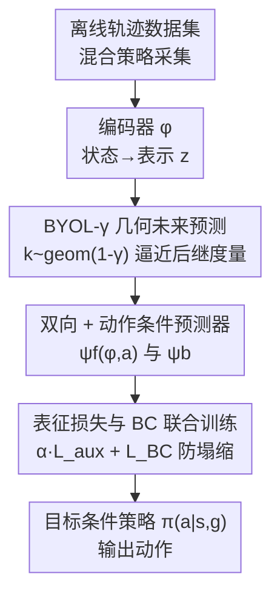

# Self-Predictive Representations for Combinatorial Generalization in Behavioral Cloning

**会议**: ICLR 2026  
**OpenReview**: [https://openreview.net/forum?id=FkeURAdA0h](https://openreview.net/forum?id=FkeURAdA0h)  
**论文**: [Project Page](https://self-pred-bc.github.io/)  
**领域**: 自监督表示学习 / 行为克隆 / 强化学习  
**关键词**: 后继表示, 自预测表示, BYOL, 组合泛化, 目标条件行为克隆

## 一句话总结
针对目标条件行为克隆（GCBC）无法"拼接"novel 状态-目标对的组合泛化缺陷，本文提出 BYOL-γ：一个用几何分布采样未来状态、从而逼近后继度量（successor measure）的自预测表示学习目标，作为 BC 的辅助损失既不需要 TD 学习也不需要负样本，在 OGBench 拼接任务上平均成功率超过所有对比方法。

## 研究背景与动机

**领域现状**：在机器人和决策领域，大规模行为克隆（BC）已成为训练通用策略的主流路线——把海量离线演示数据喂给监督模型，让策略模仿数据中的行为。目标条件行为克隆（GCBC）进一步把"当前状态 + 未来目标"作为输入，用最大似然学习 $\pi_\Theta(a\,|\,s, g)$。

**现有痛点**：BC 类方法在训练分布内任务上表现不错，但对**组合泛化**几乎无能为力。组合泛化被形式化为"拼接（stitching）"能力——数据集里有 $s_0 \to s_h$ 和 $s_b \to s_f$ 两条在中间点 $w$ 相交的轨迹，但没有任何一条完整覆盖 $s_0 \to s_f$；一个会拼接的策略应当能把两段子轨迹接起来到达 $s_f$，而 GCBC 做不到。机器人数据采集昂贵，靠简单堆数据补全所有组合并不现实，因此必须从算法层面解决。

**核心矛盾**：BC 在构造上**没有编码"数据来自马尔可夫决策过程（MDP）"这个归纳偏置**。相比之下，用时序差分（TD）训练的 RL 策略通过动态规划在时间上传播信息，天然具备拼接能力；但离线 TD 学习的 bootstrap 不稳定、难以规模化。于是问题落在：能不能在保留 BC 监督式可扩展性的同时，把 MDP 的时序结构"灌"进策略？

**切入角度**：作者观察到，组合泛化的关键在于状态表示的**长程时序一致性**——如果在时间上相关的状态被编码到相近的隐空间表示，那么对 novel 状态-目标对的分布外间隙就会缩小。形式化地，对于从 $s_w$ 可达的目标 $s_f \sim M^\beta(s_w, s_f)$，我们希望表示满足不变性 $\phi(s_f) \approx \phi(s_w)$：这样策略在 $\phi(s_f)$ 条件下会先走到 $s_w$（分布内），再完成剩余路段。这正好是**后继表示 / 后继度量（SR/SM）**所刻画的"状态间时序距离"。

**核心 idea**：用一个逼近后继度量的自预测表示作为 BC 的辅助损失。具体地，把 BYOL（Bootstrap Your Own Latent）的未来预测目标从"下一步状态"改成"按几何分布 $k \sim \text{geom}(1-\gamma)$ 采样的未来状态"，得到 BYOL-γ——它在理论上逼近 SR，却不依赖 TD、也不需要负样本。

## 方法详解

### 整体框架

本文要解决的是：让 GCBC 策略获得拼接 / 组合泛化能力。整体做法是在标准 BC 训练之外，挂一个**自预测表示学习辅助损失**，引导编码器 $\phi$ 学到反映环境时序结构（后继度量）的状态表示，再把这个表示喂给策略头去预测动作。

整条 pipeline：从离线轨迹数据集（由一组未知策略 $\{\beta_j\}$ 混合采集）中采样状态 $s_t$，经编码器 $\phi$ 得到表示 $z_t = \phi(s_t)$；预测器 $\psi$ 不去预测下一步，而是预测一个**按几何分布采样的未来状态** $s_{t+k}$ 的表示（BYOL-γ 目标），并辅以双向预测和动作条件；这个辅助损失与 BC 损失联合优化，BC 损失同时约束 $\phi$ 防止表示塌缩。最终策略 $\pi_\Theta(a\,|\,s,g) = \text{MLP}_\theta(\text{concat}(\phi(s), \phi(g)))$ 输出动作。

### 关键设计

**1. BYOL-γ：用几何采样的未来预测逼近后继度量**

痛点直接来自标准 BYOL：在 RL 里，BYOL 通过预测下一步隐表示来学表示，它只捕捉**一步转移** $P^\pi$ 的谱信息，刻画不了被多条轨迹隔开的远距离状态关系，所以拼接能力有限。本文的修改极简却关键：把预测目标的偏移量 $k$ 从固定的 1 改成从几何分布采样 $k \sim \text{geom}(1-\gamma)$，于是预测目标变成归一化后继度量 $\tilde M^\pi$ 的经验样本：

$$L_{\text{BYOL-}\gamma}(\phi,\psi) = \mathbb{E}_{s_t \sim p(s),\, k \sim \text{geom}(1-\gamma),\, s_{t+k} \sim p^\pi}\big[f(\psi(\phi(s_t)),\, \bar\phi(s_{t+k}))\big]$$

其中 $\bar\phi$ 是停梯度 / EMA 目标，$f$ 是衡量两个表示差异的能量函数。当 $\gamma=0$ 时 $s_{t+k}=s_{t+1}$，退化回一步 BYOL。后继表示定义为 $M^\pi(s,s') = \mathbb{E}[\sum_{t\ge0}\gamma^t \mathbb{1}(s_{t+1}=s')\,|\,s_0=s,\pi]$，归一化版 $\tilde M^\pi = (1-\gamma)M^\pi$。论文用 Theorem 4.1 证明：在有限 MDP、线性表示、正交初始化等假设下，最小化 $L_{\text{BYOL-}\gamma}$ 对应于后继表示的谱分解 $\tilde M^\pi \approx \Phi\Psi\Phi^T$，即学到了后继特征。

为什么这样有效：与对比学习（CL）相比，BYOL-γ 最显著的区别是**去掉了负样本的分母项**。作者在统一框架（见下）里指出，在实际的混合策略数据上，CL（如 TRA）会对不同轨迹采样的状态产生"悲观"——不同轨迹的状态只会被当作负样本相互推开，这种悲观体现在其逼近量的分母 $p^\beta(s_+)$ 上；而 BYOL-γ 不用负样本，给出 $\sum_j p(\beta_j|s)\tilde M^{\beta_j}(s, s_+)$ 的乐观逼近，对远距离状态相似度估计更忠实，且每个 batch 只算 $O(B)$ 个损失项（CL 需 $O(B^2)$ 负样本，TD-SR 需 $O(B^2)$ bootstrap 项）。

**2. 双向预测与动作条件预测器**

仅有前向预测会丢失部分时序结构。本文在基础目标上加了两个变体：一是**双向预测**，额外引入后向预测器 $\psi_b$ 从未来表示反推过去表示；二是**动作条件前向预测器** $\psi_f(\phi(s_t), a_t)$，可解释为一个时序延展的隐空间动力学模型，捕捉 $\tilde M^\pi(s, a, s_+)$ 的信息。完整目标为：

$$L_{\text{BYOL-}\gamma} = \mathbb{E}_{s_t,\, s_+ \sim \tilde M^\pi}\big[f(\psi_f(\phi(s_t), a_t),\, \bar\phi(s_+)) + f(\bar\phi(s_t),\, \psi_b(\phi(s_+)))\big]$$

能量函数 $f$ 默认取 DINO 式的归一化表示交叉熵 $f_{CE}(a,b) = \text{softmax}(b)\cdot\log\text{softmax}(a)$；归一化 $\ell_2$ 损失 $f_{\ell_2} = \|a/\|a\| - b/\|b\|\|_2^2$ 也能用（消融里略差）。动作条件让表示编码"在某动作下能到哪"，对组合泛化尤其重要——消融显示去掉动作条件平均影响不大但逐环境波动较大。

**3. 表征损失与 BC 联合训练防止塌缩**

自预测目标（尤其 BYOL 类）有一个老问题：表示容易塌缩到平凡解。本文的处理是把表示学习与策略学习**绑在一起联合优化**，参数记为 $\Theta = (\theta, \phi, \psi)$：

$$\mathbb{E}_{\beta_j \sim p(\beta_j),\, \tau \sim \beta_j}\big[L_{BC}(\Theta) + \alpha L_{\text{aux}}(\phi, \psi)\big]$$

关键在于梯度的"分工"：$L_{BC}$ 更新策略头 $\theta$ 及其输入编码器 $\phi$；$L_{\text{aux}}$ 更新 $\psi, \phi$ 但**不更新 $\theta$**。由于 $\phi$ 同时受两个损失影响，BC 损失保证表示对动作预测是"充分的"，从而防止塌缩；而辅助损失则防止过拟合、提升泛化。这种共享编码器 + 双损失的设计，让"表示要能预测未来"与"表示要能预测动作"两个约束彼此牵制，是该方法稳定工作的前提。权重 $\alpha$ 对具身形态和环境大小（medium vs large）敏感，论文对每个方法在 4 个 $\alpha$ 值上扫参并报告各环境最优。

### 损失函数 / 训练策略

总损失即上式 $L_{BC} + \alpha L_{\text{aux}}$。统一框架（Table 1）把四种辅助表示目标放在一起对比：在单策略数据 $\tau\sim\beta$ 下，TRA(CL)、TD-SR、BYOL-γ 都逼近 $\tilde M^\beta$ 相关量，BYOL 只逼近一步转移 $p^\beta(s_{t+1}|s_t)$；在更现实的混合策略数据 $\tau\sim\{\beta_j\}$ 下，TD-SR 仍逼近混合策略的 SM，而蒙特卡洛方法（TRA、BYOL-γ）逼近的是"SR 的混合" $\sum_j p(\beta_j|s)\tilde M^{\beta_j}$——BYOL-γ 的优势是无负样本带来的悲观。训练沿用 OGBench 的设置，BYOL-γ 与 TD-SR 用动作条件，TRA 用其原始无动作条件参数化。

## 实验关键数据

### 主实验

在 OGBench 导航 stitch 数据集上（训练轨迹最多跨 4 个迷宫格，评测需拼接更长路径），各方法 5 个评测任务 × 50 episode 的成功率（非视觉 10 seeds，视觉 4 seeds）：

| 数据集 | BYOL-γ (ours) | TD-SR | TRA | BYOL | GCBC | 最强离线RL |
|--------|------|------|------|------|------|------|
| antmaze-medium-stitch | 58 | 64 | 54 | 59 | 45 | 59 (QRL) |
| antmaze-large-stitch | 19 | 23 | 11 | 17 | 3 | 18 |
| humanoidmaze-medium-stitch | 51 | 42 | 45 | 23 | 29 | 36 (CRL) |
| humanoidmaze-large-stitch | 13 | 11 | 5 | 3 | 6 | 4 |
| visual-antmaze-medium-stitch | 68 | 49 | 52 | 57 | 67 | 69 (CRL) |
| visual-scene-play | 17 | 14 | 16 | 13 | 12 | 25 (GCIVL) |
| **average-all** | **35** | 32 | 27 | 26 | 26 | 25 (CRL) |

BYOL-γ 平均成功率 35 居首，超过 TD-SR(32)、TRA(27)、GCBC(26) 与所有离线 RL。一个值得注意的现象是：在视觉环境（average-visual 37）上，TRA 和 TD-SR 反而会损害性能（低于 GCBC），而 BYOL-γ 不出现退化——这是相对其他方法的显著优势，作者归因于其更简单的训练流程在大状态空间上更鲁棒。

### 消融实验

| 配置 | average-all | 说明 |
|------|------|------|
| BYOL-γ (full) | 33 | 完整模型（取 Table 2 前 4 seed） |
| −a（去动作条件） | 33 | 平均持平，逐环境波动 |
| $f_{\ell_2}$（换损失） | 31 | 略降 |
| −ψ_b（去后向预测） | 33 | 平均持平 |
| γ=0（一步预测） | 24 | **掉点最多**，humanoidmaze 尤其严重 |

### 关键发现

- **几何未来预测（γ>0）是核心**：$\gamma=0$ 退化为一步 BYOL 后平均从 33 跌到 24，humanoidmaze 上从 54/14 跌到 18/3，证明"预测远期未来 / 逼近后继度量"才是组合泛化的关键，而非 BYOL 框架本身。
- **动作条件与后向预测是锦上添花**：去掉二者平均成功率几乎不变，但逐环境有波动，说明它们提供稳定性而非主要增益。
- **表示质量与策略成功率排序一致**：表示空间与最短路距离的相关性排序，与各方法的平均成功率排序吻合，验证了"学好后继度量结构 → 泛化更强"这条因果链。
- **长程泛化最稳**：在 antmaze-giant 等需拼接约 8 条轨迹的极难任务上，所有方法在阈值（>4 格）后都会掉，但 BYOL-γ 掉得最慢。

## 亮点与洞察
- **极简改动撬动大效果**：仅把 BYOL 的预测偏移从固定 1 步改成几何采样 $k\sim\text{geom}(1-\gamma)$，就把"一步转移谱信息"升级为"后继度量"，既不引入 TD 的不稳定，也不引入对比学习的负样本开销（$O(B)$ vs $O(B^2)$）。
- **统一视角有教学价值**：Table 1 把 CL / TD-SR / BYOL / BYOL-γ 统一到"逼近后继度量的不同方式"框架下，并精确指出 CL 在混合策略数据上的"悲观"来源（负样本把不同轨迹状态推开），这个分析本身就是可复用的认知。
- **可迁移性**："用自预测表示给监督式策略灌入 MDP 时序结构"这一思路，可迁移到任何缺乏时序归纳偏置的监督式决策模型；几何采样目标也能直接套到其他 JEPA / 世界模型的辅助损失上。
- 论文还把方法扩展到分层设置（HBYOL-γ，附录 C），在视觉迷宫上取得进一步提升。

## 局限与展望
- 作者承认在最难的导航环境（如 giant）上仍存在明显泛化间隙，没有任何方法能到达最远目标。
- 视觉环境上相对 BC 的提升不如状态环境显著，作者推测需在更大规模视觉数据上才能充分发挥表示学习的价值。
- 权重 $\alpha$ 对具身和环境大小敏感，需逐环境扫参（4 个值取最优），实际部署时调参成本不可忽略——这也意味着表中"最优"是 oracle 选择，存疑应以原文设置为准。
- 理论保证（Theorem 4.1）建立在有限 MDP、线性表示、正交初始化、对称转移等较强假设上，与实际连续高维视觉任务有距离。

## 相关工作与启发
- **vs TRA (Myers et al., 2025b)**：TRA 用对比学习作为 BC 辅助目标逼近后继度量的 MC 近似；本文同样走 MC 路线但用自预测代替对比，去掉负样本，因而避免了 TRA 在混合策略数据上对远距离状态的悲观，视觉环境上不退化。
- **vs TD-SR（Forward-Backward 风格）**：TD-SR 用 TD 学习显式逼近混合策略的后继度量、能跨策略"拼接"，但 bootstrap 带来不稳定和 $O(B^2)$ 开销；BYOL-γ 不用 TD 却能达到相当甚至更好的效果，在大状态空间（humanoidmaze、视觉环境）上更优。
- **vs 标准 BYOL**：标准 BYOL 只预测一步、捕捉一步转移谱信息；BYOL-γ 通过几何采样捕捉时序延展信息，是其在后继度量意义下的推广（γ=0 时二者等价）。
- **vs 离线 RL（IQL/IVL/QRL/CRL）**：离线 RL 靠 TD/Q 学习获得拼接但难规模化；本文证明带表示学习的 GCBC 普遍优于这些离线 RL 基线，给出一条更可扩展的监督式路线。

## 评分
- 新颖性: ⭐⭐⭐⭐ 几何采样把 BYOL 与后继度量打通，统一框架视角清晰，改动虽小但洞察扎实。
- 实验充分度: ⭐⭐⭐⭐ OGBench 多环境 + 视觉/状态 + 增长 horizon + 充分消融，唯 α 取每环境最优略乐观。
- 写作质量: ⭐⭐⭐⭐ 理论与直觉交织、Table 1 统一框架讲得透，部分推导需翻附录。
- 价值: ⭐⭐⭐⭐ 为大规模 BC 注入时序归纳偏置提供了简单可扩展的配方，对机器人通用策略有实际意义。

<!-- RELATED:START -->

## 相关论文

- [\[ICLR 2026\] Bidirectional Predictive Coding](bidirectional_predictive_coding.md)
- [\[ICLR 2026\] Regularized Latent Dynamics Prediction is a Strong Baseline for Behavioral Foundation Models](regularized_latent_dynamics_prediction_is_a_strong_baseline_for_behavioral_found.md)
- [\[ICLR 2026\] MaskCO: Masked Generation Drives Effective Representation Learning and Exploiting for Combinatorial Optimization](maskco_masked_generation_drives_effective_representation_learning_and_exploiting.md)
- [\[CVPR 2026\] Towards Stable Self-Supervised Object Representations in Unconstrained Egocentric Video](../../CVPR2026/self_supervised/towards_stable_self-supervised_object_representations_in_unconstrained_egocentri.md)
- [\[ICLR 2026\] OrthoRF: Exploring Orthogonality in Object-Centric Representations](orthorf_exploring_orthogonality_in_object-centric_representations.md)

<!-- RELATED:END -->
