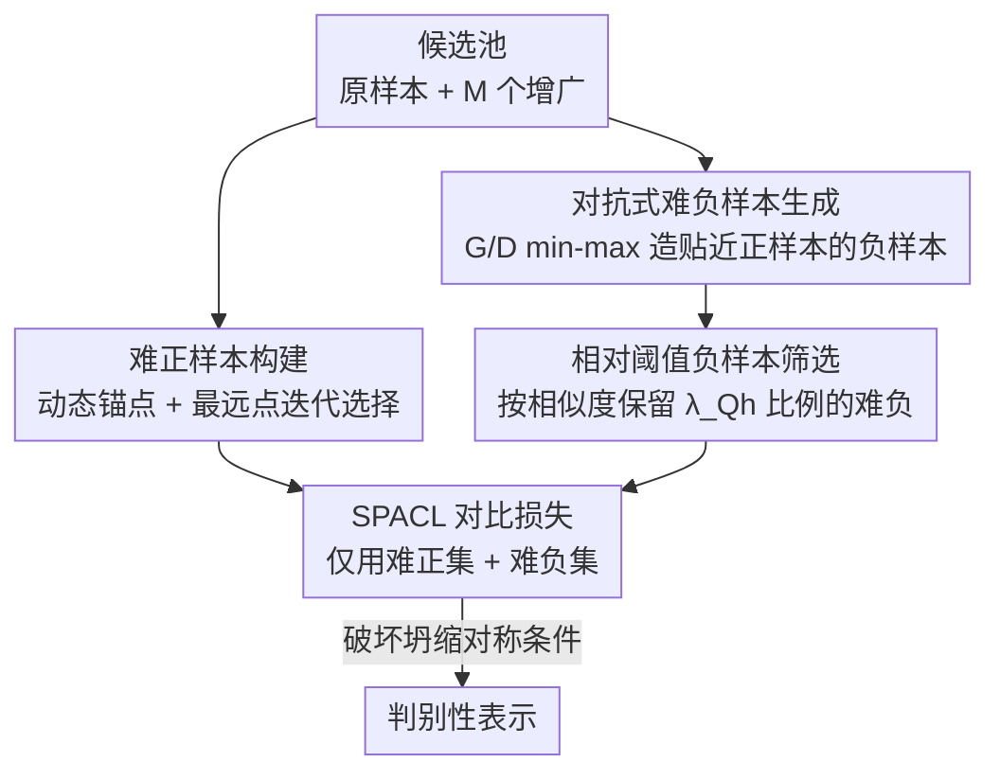

# SnaPhArd Contrast Learning

**会议**: ICLR 2026  
**OpenReview**: [https://openreview.net/forum?id=4cZvjp8Iwk](https://openreview.net/forum?id=4cZvjp8Iwk)  
**领域**: 自监督 / 表示学习  
**关键词**: 对比学习, 难样本, 最优性分析, 解坍缩, 对抗负样本

## 一句话总结
本文从最优性条件出发，理论证明了对比学习中"简单样本"会把最优解钉死、诱发解坍缩，进而提出 SPACL：用动态锚点+最远点迭代挑难正样本、用对抗生成器造难负样本、再用相对阈值筛掉平凡负样本，在图像分类、知识图谱链接预测和域外意图检测三类任务上一致超过或持平 SOTA。

## 研究背景与动机

**领域现状**：对比学习（CL）的核心是把锚点（anchor）的表示拉近正样本、推远负样本，主流工作围绕"怎么造对比对"（MoCo/SimCLR 的 minibatch 队列、数据增广、知识先验）和"怎么采样对比对"（越来越强调挑选难样本）两条线展开。难样本指那些模型难以与对立类区分的、有歧义的实例，被认为能逼模型捕捉数据中的细微差异。

**现有痛点**：尽管难样本采样在经验上很成功，但理论解释几乎是空白——为什么要挑难样本？难样本到底如何贡献性能？在引入难样本的情况下，什么时候解会坍缩、什么时候有最优保证？这些问题都没有答案。更糟的是，绝大多数方法只挑难正样本**或**只挑难负样本，很少有人同时考虑两者。

**核心矛盾**：作者发现问题根源在于"简单样本"扮演了**固定点（fixation point）**的角色。简单负样本大量聚集在锚点的对侧，会吸走大量权重、把潜在解牢牢"钉住"，让解难以挣脱；简单正样本则会撑大正样本凸包、压缩编码器的变化空间，甚至诱发多个歧义解。这正是解坍缩（$x=p$，最优解退化到单个正样本）的温床。

**本文目标**：① 给出对比学习的最优性/坍缩条件的理论刻画；② 据此设计一个同时筛选难正、难负样本的算法；③ 在多模态多任务上验证。

**核心 idea**：既然简单样本是钉住解的祸首、难样本才真正塑造优化地形，那就**显式地生成并筛选难正、难负对比对**——用几何上的凸包扩张破坏坍缩对称条件，从而学到更具判别性的表示。

## 方法详解

### 整体框架

SPACL 的出发点是一个干净的理论观察：在双编码器 InfoNCE 框架下，把负正样本指数和之比 $s^-/s^+$ 对单位球上的锚点 $x$ 求驻点，可以解析地预测最优 $x$ 的几何性质。理论告诉我们，当"负样本凸组合恰好是单个正样本的缩放"时解会坍缩（Theorem 2.1），而只要正样本投影线不落进负样本凸包就不会坍缩（Corollary 2.2）。简单样本恰恰让这个对称坍缩条件更容易成立，所以工程上要做的就是"把简单的去掉、把难的留下/造出来"。

整体流程是：对每个原始样本，先构造一个由它本身和多个增广视图组成的候选池，从中**动态选锚点**并用**最远点迭代**挑出难正集 $P^h_i$；与此同时用**对抗生成器**造出贴近 $P^h_i$ 的难负样本、并入 in-batch 负样本，再用**相对阈值**筛出难负集 $Q^h_i$；最后只用这两个精炼后的集合计算 SPACL 对比损失。

> 注：理论分析（最优性/坍缩条件）是贯穿全文的动机，落到流程上对应的就是上图中"难正构建"和"难负筛选"两簇操作背后的设计依据，故在下面"关键设计 1"单独讲清。

### 关键设计

**1. 最优性与坍缩条件分析：把"挑难样本"从经验变成可证的几何动机**

这一设计针对的痛点是"为什么要挑难样本"长期缺乏理论支撑。作者把 InfoNCE 重写为 $L=\sum_i \log\left(s^-_i/s^+_i+1\right)$，其中 $s^+_i=\sum_j \exp\langle x_i,p_j\rangle$、$s^-_i=\sum_j \exp\langle x_i,n_j\rangle$。由于派生编码器 $g$ 产出的 $n_j,p_j$ 在优化 $f$ 时是常量，最优 $x_i$ 的几何性质可解析预测，驻点条件等价于单位球上的约束极小化：

$$\min_{\|x\|_2^2=1}\ \frac{\sum_j \exp\langle x,n_j\rangle}{\sum_j \exp\langle x,p_j\rangle}.$$

在单正样本下，Theorem 2.1 给出坍缩（$x=p$）的充要条件：存在 $C\in\mathbb{R}$ 使 $\sum_j w_j n_j / C = p$，其中 $w_j=\exp\langle n_j,p\rangle/\sum_k\exp\langle n_k,p\rangle$。直观地说，当负样本的凸重构恰是正样本的缩放版本时，对称性导致解退化到正样本自身。Corollary 2.2 则给出非坍缩条件：只要 $\forall c\neq0,\ cp\notin \mathrm{conv}\{n_j\}$，就有 $x\neq p$。配合 Lemma 2.4（$\|x\|=1$ 时梯度范数渐近上界为 2，单正单负时约 1.76）说明负样本数量超过临界阈值后贡献几乎可忽略。这些结论合起来给出一个清晰的工程指令：**简单样本是钉住解的固定点，应被剔除；难样本才决定优化地形**，后续三个设计都是这条结论的直接落地。

**2. 难正样本构建：动态锚点 + 最远点迭代撑大正样本凸包**

针对"简单正样本压缩凸包、诱发歧义解"的痛点，SPACL 不再像旧方法那样固定用原样本当锚、随机配增广视图。它先对候选池 $C_i=\{\tilde z_i\}\cup\{\tilde z_i^{(1)},\dots,\tilde z_i^{(M)}\}$ 定义每个候选的难度为它到池内其余样本的平均不相似度 $h(u)=\frac{1}{|C_i|-1}\sum_{v\in C_i\setminus\{u\}} d(u,v)$（$d$ 用内积实现，与理论分析对齐）。然后动态选最难的实例作锚点 $z_i=\arg\max_u h(u)$，再用**最远点迭代**逐个加入：每步选 $u^*=\arg\max_{u}\min_{v\in P^h_i} d(u,v)$，直到 $|P^h_i|=\lambda_{P^h}$。

这个最远点策略最大化 $P^h_i$ 在单位球上的散布，等价于尽量撑大 $\mathrm{conv}(P^h_i)$。结合 Theorem 2.1/Corollary 2.2，凸包的几何扩张能阻止锚点退化到单个正样本，从源头缓解坍缩——这正是设计 1 中"非坍缩条件"的可操作版本。

**3. 对抗式难负样本生成：主动造出贴着正样本边界的负样本**

仅靠 in-batch 或动量队列里现成的负样本，往往覆盖不到正样本凸包附近那块最关键的边界区域。为此 SPACL 引入对抗生成器 $G$，鼓励它产出"形似难正集 $P^h_i$"的对抗负样本，同时判别器 $D$ 学着区分真正样本与生成负样本，min-max 目标为：

$$\min_G \max_D\ \mathbb{E}_{z^+\in P^h_i}[\log D(z^+)] + \mathbb{E}_{\tilde z^-\sim G(\tilde z_i)}[\log(1-D(\tilde z^-))].$$

生成的对抗负样本与 in-batch 负样本合并为候选 $Q_i=\{\tilde z_j\}_{j\neq i}\cup\{\tilde z^-_i\}$。这样做的好处是"合成的边界感知负样本"补足了原始负样本覆盖不到的近边界区域，能收紧决策边界、增强判别性——消融中它对应的贡献也确实是中等偏上（见下文 w/o AN）。

**4. 相对阈值负样本筛选：用比例而非固定数量挑难负**

有了候选 $Q_i$ 还要筛。SPACL 从中选出与锚点相似度最高的难负子集 $Q^h_i$，约束是子集内每个难负的相似度都大于子集外任意负样本，且满足相对配额：

$$\sum_{z^{h,-}_i\in Q^h_i}\mathrm{sim}(f(z_i),g(z^{h,-}_i)) = \lambda_{Q^h}\sum_{z^-_i\in Q_i}\mathrm{sim}(f(z_i),g(z^-_i)),\quad \lambda_{Q^h}\in(0,1].$$

关键巧思在于：正样本用**绝对数量** $\lambda_{P^h}$ 来选，负样本却用**相对阈值** $\lambda_{Q^h}$。原因是负样本天然远比正样本丰富多样，强行规定固定个数要么塞进一堆平凡负样本、要么漏掉有信息量的负样本；相对阈值能跨数据集自适应地保留"贴近 $\mathrm{conv}(P^h_i)$"的那批负样本，使 $\mathrm{conv}(Q^h_i)$ 紧贴 $\mathrm{conv}(P^h_i)$，从而更容易破坏 Theorem 2.1 的对称坍缩条件。消融显示这是贡献**最大**的组件。

### 损失函数 / 训练策略

最终 SPACL 只在精炼后的难正集 $P^h_i$ 与难负集 $Q^h_i$ 上计算对比损失：

$$L_{\text{SPACL}} = -\sum_i \log\frac{\sum_{j}^{|P^h_i|}\exp(\langle f(z_i),g(z^{h,+}_i)\rangle/\tau)}{\sum_{j}^{|P^h_i|}\exp(\langle f(z_i),g(z^{h,+}_i)\rangle/\tau)+\sum_{j}^{|Q^h_i|}\exp(\langle f(z_i),g(z^{h,-}_i)\rangle/\tau)}.$$

主要超参为 $\lambda_{P^h}=2$、$\lambda_{Q^h}=0.95$；相似度用内积；理论分析中已说明温度 $\tau$ 只改变加权方案、不影响最优性结论，故推导中略去。图像分类用 ResNet-50、200 epoch、batch 256；OOD 检测用 Adam（lr 1e-5）、batch 8、20 epoch。

## 实验关键数据

### 主实验

图像分类（ResNet-50，Top-1 %），SPACL 在监督/自监督/弱监督三种范式下全面领先：

| 数据集 | 范式 | SPACL | 最强基线 | 提升 |
|--------|------|-------|----------|------|
| CIFAR-10 | 监督 | 97.04 | VarCon 95.94 | +1.10 |
| CIFAR-100 | 监督 | 80.84 | SupCon 76.57 | +4.27 |
| ImageNet-100 | 监督 | 87.62 | VarCon 86.34 | +1.28 |
| ImageNet-1K | 监督 | 80.98 | VarCon 79.36 | +1.62 |
| CIFAR-100 | 自监督 | 72.28 | Barlow Twins 71.02 | +1.26 |
| ImageNet-100 | 弱监督 | 50.18 | MaskCon 47.74 | +2.44 |

知识图谱链接预测（MRR / Hit@10）与文本 OOD 检测也一致领先：在去掉逆关系、更难的 FB15K-237 上 MRR 达 41.3%、Hit@10 达 61.2%，超过最强基线 LMKGE$_{l2}$（MRR 40.0%）+1.30；在 StackOverflow OOD 检测上，25%/75% 训练类比例下 F1-OOD 分别为 96.72/76.39，比 MOGB 高 2.3/5.1 个绝对点。作者据此强调 SPACL 是**模态无关**的，能跨视觉、文本、多模态场景泛化。

### 消融实验

CIFAR-100 上拆掉四大组件（Top-1 %）：

| 配置 | 全监督 | 自监督 | 弱监督 | FB15K-237(MRR) | 说明 |
|------|--------|--------|--------|----------------|------|
| Full | 80.8 | 72.3 | 69.2 | 41.3 | 完整模型 |
| w/o Anc | 79.7 | 70.9 | 67.2 | 40.6 | 不做动态锚点选择 |
| w/o HP | 80.1 | 71.4 | 68.3 | 40.9 | 去掉最远点正样本选择 |
| w/o AN | 79.5 | 70.5 | 67.0 | 40.5 | 去掉对抗负样本 |
| w/o NS | 77.9 | 68.1 | 64.8 | 39.2 | 去掉相对阈值负样本筛选 |

### 关键发现
- **负样本筛选（NS）贡献最大**：去掉后掉点最猛（自监督 CIFAR-100 从 72.3 → 68.1，掉 4.2 点）。没有筛选会保留大量平凡负样本，撑大负样本凸体、弱化判别边界，与 Theorem 2.1 的坍缩分析一致。
- **对抗负样本（AN）与动态锚点（Anc）贡献中等**：Anc 印证锚点选择在最大化角度散布、规避对称坍缩上的作用；AN 说明对抗生成的负样本能锐化负样本区域边界。进一步的 IB / IB+H 对照显示，仅对 in-batch 负样本按相似度排序选难负（IB+H）就已优于平等对待（IB），而对抗生成在此之上还有额外增益。
- **难正选择（HP）贡献最小**：最远点选择虽利于扩张正样本凸包、增加多样性，但相比"维持正负之间良好分隔"重要性更低。正样本构建对照中，OAA（固定锚点）在自/弱监督下掉得尤其多（自监督 72.28 → 66.53），印证固定锚会压缩角度散布、压扁正样本凸包。

## 亮点与洞察
- **把"挑难样本"从玄学变成几何定理**：用单位球上的坍缩对称条件（Theorem 2.1）解释了"简单样本=固定点、难样本=塑形力"，让难样本采样第一次有了可证的动机，而非纯经验调参。
- **正负样本用不同的选择逻辑**：正样本绝对数量、负样本相对阈值，这一非对称设计抓住了"负样本远比正样本丰富"的本质，是个能迁移到其它检索/采样任务的实用 trick。
- **对抗生成补边界**：与其被动等队列里出现难负，不如主动造贴近正样本凸包的对抗负样本，直击决策边界最模糊处——这把 GAN 思路干净地嵌进了对比学习的负样本侧。
- **模态无关**：同一套机制在图像、知识图谱、文本三类任务都涨点，说明它优化的是对比损失的几何结构本身，而非某种模态特异的先验。

## 局限与展望
- 理论分析主要建立在双编码器 + 单/对称负样本等理想化设定上（如 Theorem 2.1 的单正样本假设），多正样本、非对称负样本分布下的最优性条件只在附录粗略展开，与真实训练存在差距。
- 引入对抗生成器 $G$/判别器 $D$ 带来额外训练开销与不稳定性，论文把复杂度分析留在附录，正文未给出与基线的实测训练成本对比。
- 难度度量 $h(u)$、相似度都用内积实现，是否在所有任务上都最优、对超参 $\lambda_{P^h}/\lambda_{Q^h}$ 的敏感性仅在附录讨论，正文证据有限。
- 改进方向：把坍缩分析推广到多正样本与课程式难度调度，或用更轻量的难负挖掘替代对抗生成以降本。

## 相关工作与启发
- **vs MoCo / SimCLR（minibatch 自适应）**: 他们靠 in-batch 数据和全局队列检索对比样本、平等对待所有负样本；SPACL 在其上加了一层"难样本筛选+对抗生成"，并给出为什么该这么做的最优性理论。
- **vs 只挑难正或只挑难负的采样方法**: 多数现有工作只动正样本**或**负样本一侧；SPACL 同时优化正负两侧，且用统一的凸包/坍缩几何把两者的设计动机串起来。
- **vs SupCon / VarCon 等监督对比**: 在 CIFAR-100 等基准上以 +4 点级别超过它们，说明难样本几何塑形在有标签场景同样有效，而非自监督专属。

## 评分
- 新颖性: ⭐⭐⭐⭐⭐ 用最优性/坍缩条件给难样本采样提供可证动机，并同时优化正负两侧，角度新颖。
- 实验充分度: ⭐⭐⭐⭐ 跨视觉/KG/文本三任务多基准，消融拆到四组件，但训练成本与超参敏感性证据多在附录。
- 写作质量: ⭐⭐⭐⭐ 理论到方法的推导链条清晰，但公式密集、部分坍缩条件需对照附录才好理解。
- 价值: ⭐⭐⭐⭐ 提供可迁移的难样本几何分析框架与模态无关的对比学习算法，对表示学习有实践参考价值。

<!-- RELATED:START -->

## 相关论文

- [\[CVPR 2026\] Beyond Binary Contrast: Modeling Continuous Skeleton Action Spaces with Transitional Anchors](../../CVPR2026/self_supervised/beyond_binary_contrast_modeling_continuous_skeleton_action_spaces_with_transitio.md)
- [\[ICLR 2026\] On the Alignment Between Supervised and Self-Supervised Contrastive Learning](on_the_alignment_between_supervised_and_self-supervised_contrastive_learning.md)
- [\[ICLR 2026\] Part-level Semantic-guided Contrastive Learning for Fine-grained Visual Classification](part-level_semantic-guided_contrastive_learning_for_fine-grained_visual_classifi.md)
- [\[ICLR 2026\] Understanding the Robustness of Distributed Self-Supervised Learning Frameworks Against Non-IID Data](understanding_the_robustness_of_distributed_self-supervised_learning_frameworks_.md)
- [\[ICLR 2026\] Understanding the Learning Phases in Self-Supervised Learning via Critical Periods](understanding_the_learning_phases_in_self-supervised_learning_via_critical_perio.md)

<!-- RELATED:END -->
