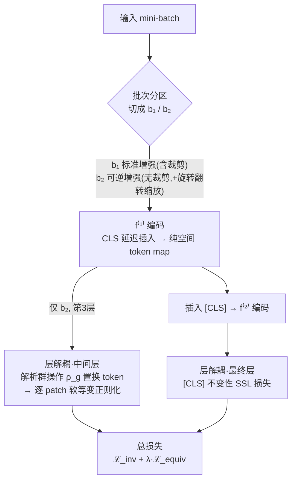

# Soft Equivariance Regularization for Invariant Self-Supervised Learning

**会议**: ICLR 2026  
**arXiv**: [2603.06693](https://arxiv.org/abs/2603.06693)  
**代码**: [https://github.com/aitrics-chris/SER](https://github.com/aitrics-chris/SER)  
**领域**: 自监督学习  
**关键词**: 自监督学习, 等变性, invariance, ViT, 正则化

## 一句话总结
提出 SER（Soft Equivariance Regularization），通过在 ViT 中间层施加软等变正则化、在最终层保持不变性目标的层解耦设计，在不引入额外模块的情况下，为不变性 SSL 方法（MoCo-v3, DINO, Barlow Twins）带来一致的分类精度和鲁棒性提升。

## 研究背景与动机

**领域现状**：自监督学习（SSL）主流范式是通过对比学习或冗余消减学习对语义保持增强（如随机裁剪、颜色抖动）不变的表征。代表方法包括 MoCo-v3、DINO、Barlow Twins 等。

**现有痛点**：强不变性学习会抑制与变换相关的结构信息（如旋转、翻转、尺度线索），这些信息对几何鲁棒性和空间敏感的下游任务（如目标检测）有用。已有工作尝试在不变性 SSL 基础上加入等变性目标，但通常将两个目标施加在**同一个最终表征**上。

**核心矛盾**：最终表征通常是空间坍缩的（如 ViT 的 [CLS] token 或全局平均池化），不适合定义空间群操作；在此层强制等变性会导致与不变性目标的冲突——作者实验发现：将等变正则化推向更深层，等变性分数提高，但 ImageNet-1k 线性评估精度反而下降。

**本文目标** 如何在不改变基线 SSL 架构和目标的前提下，优雅地将等变性引入不变性 SSL，避免不变性-等变性的权衡冲突？

**切入角度**：作者观察到不变性和等变性应该在不同层施加——层解耦（layer decoupling）设计。中间层的空间 token map 保留了网格结构，天然适合定义解析的群操作。

**核心 idea**：在 ViT 中间层的空间 token map 上用解析群操作施加软等变正则化，在最终层保持原始不变性 SSL 目标不变。

## 方法详解

### 整体框架
SER 要解决的问题是：怎样把"等变性"塞进 MoCo-v3/DINO 这类"不变性"自监督方法，既不和原来的不变性目标打架、又不新增任何模块。它的核心思路是**层解耦（layer decoupling）**——不变性和等变性别挤在同一层，而是各管一层：不变性 SSL 损失留在最终层（[CLS] token），等变正则化挪到中间层（第 3 层）那张仍保留 $H_f \times W_f$ 网格结构的空间 token map 上。

具体怎么转：一个 mini-batch 先被切成两半（批次分区），一半走标准增强（含裁剪）、一半走可逆增强（无裁剪、带旋转翻转缩放）；两半都进入分解后的 ViT 编码器 $f = f^{(2)} \circ f^{(1)}$，其中 $f^{(1)}$ 先产出不含 [CLS] 的纯空间 token map（[CLS] 延迟到 $f^{(2)}$ 输入端才插入）；在 $f^{(1)}$ 这张干净的 token map 上，只对走可逆增强的那半用解析群操作 $\rho_g$ 施加软等变正则化；随后插入 [CLS]、过 $f^{(2)}$，两半都照常计算不变性 SSL 损失。最终目标是不变性损失加上一个加权的等变正则项。

### 关键设计

**1. 层解耦：让不变性和等变性各管一层，互不打架**

以往把等变性目标硬加到 SSL 的最终表征上，但最终层要么是 [CLS] token、要么是全局平均池化，空间结构早已坍缩，根本没法定义"旋转后 token 怎么排"这类群操作。SER 的做法是把两个目标分到不同深度：中间层（如第 3 层）的空间 token map 仍保留 $H_f \times W_f$ 的网格结构，可以直接用解析群操作 $\rho_g$ 置换 token 来施加软等变正则化；最终层则原封不动地保留不变性 SSL 损失。这个分层不是随便选的——作者把等变正则化逐层往深推，发现等变性分数确实越推越高，但 ImageNet 分类精度反而掉（见消融 Table），说明深层强制等变会直接和不变性目标冲突。第 3 层是兼顾两者的 sweet spot。

**2. 解析特征空间群操作 $\rho_g$：用 token 置换代替学一个变换网络**

群 $\mathcal{G}$ 只取那些可逆、且能在特征空间精确复现的几何变换：90° 旋转、水平翻转、各向异性缩放（注意不含裁剪）。这些变换在 token grid 上有解析对应——离散的旋转和翻转就是 token 排列的置换，缩放则用确定性网格重采样实现，且重采样的插值方式与输入空间保持一致。因为变换是解析给定的，SER 不需要像 EquiMod 那样额外学一个变换网络，也不需要预测逐样本的变换编码或标签，整套等变正则化只让训练 FLOPs 增加到 $1.008\times$，几乎免费。

**3. 批次分区：绕开"裁剪不构成群"这个根本障碍**

标准 SSL 的 RandomResizedCrop 里有裁剪，而裁剪不可逆、也不构成群，于是两次增强之间的相对变换 $g = g_2 g_1^{-1}$ 根本无法良定义，等变损失也就无从谈起。SER 把 mini-batch 切成两半：$b_1$ 走标准增强（含裁剪），$b_2$ 走可逆增强 $\mathcal{T}_{eq} = \mathcal{T} \setminus \{\text{Random Crop}\} \cup \{\text{Rotation } 90°\}$，即保留光度增强、但用可逆几何变换替掉裁剪。两个子批次都照常进不变性损失，只有 $b_2$ 额外进等变正则化——这样既保住了原始 SSL 的裁剪增强，又让等变损失里的 $g$ 始终是良定义的群元素。

**4. [CLS] token 延迟插入：别让它过早污染 token map 的空间规则性**

如果 [CLS] token 从第一层就参与注意力，它会和空间 token 互相串扰，破坏中间层 token map 的网格规则性，群操作就不再精确。SER 因此把编码器拆成 $f = f^{(2)} \circ f^{(1)}$，让 $f^{(1)}$ 输出纯空间的 token map（不带 [CLS]），把 [CLS] token 的插入推迟到 $f^{(2)}$ 的输入端、也就是等变正则化层之后。这样 $f^{(1)}$ 的输出始终是干净的空间 grid，群操作 $\rho_g$ 才能精确落到每个 token 上。

### 损失函数 / 训练策略

等变正则化使用逐 patch 的 NT-Xent 对比损失：

$$\mathcal{L}_{\text{equiv}}^{i,j} = -\log \frac{\exp(s(z_{ij}, z'_{ij}))}{\exp(s(z_{ij}, z'_{ij})) + \sum_{m \neq i} \sum_n \exp(s(z_{ij}, z_{mn})) + \sum_{m \neq i} \sum_n \exp(s(z_{ij}, z'_{mn}))}$$

其中 $s(x,y) = \frac{1}{\tau} \frac{x^\top y}{\|x\| \|y\|}$，$\tau$ 为温度系数（MoCo-v3/BT 用 0.3，DINO 用 0.5）。

总损失为：$\mathcal{L} = \mathcal{L}_{\text{inv1}} + \mathcal{L}_{\text{inv2}} + \lambda \mathcal{L}_{\text{equiv}}$

训练使用 AdamW，batch size 2048，100 epochs，10-epoch warmup + cosine decay。

## 实验关键数据

### 主实验

| 方法 | Views | ImageNet Top-1 | ImageNet-Sketch Top-1 | ImageNet-V2 Top-1 | ImageNet-R Top-1 |
|------|-------|---------------|----------------------|-------------------|-----------------|
| MoCo-v3 | 2 | 68.44 | 17.65 | 56.54 | 18.59 |
| +AugSelf | 2 | 67.55 | 13.30 | 53.74 | 17.62 |
| +STL | 2 | 65.49 | 15.40 | 55.43 | 17.22 |
| **+SER** | **2** | **69.28** | **17.68** | **56.95** | **18.95** |
| +EquiMod | 3 | 68.95 | 14.81 | 56.31 | 16.54 |
| +E-SSL | 2+4 | 70.60 | 19.23 | 58.33 | 19.86 |
| **+SER** | **2+4** | **71.56** | **19.76** | **59.50** | **20.27** |

在严格匹配的 2-view 设置下，SER 是唯一提升 MoCo-v3 精度的等变 add-on（+0.84），其他方法反而降低精度。

### 消融实验

| 配置 | Equiv Loss Layer | ImageNet Top-1 | Rotation Equiv ↑ |
|------|-----------------|----------------|------------------|
| MoCo-v3 (baseline) | - | 68.44 | 0.804 |
| MoCo + SER | Layer 3 | **69.28** | 0.840 |
| MoCo + SER | Layer 9 | 68.72 | 0.888 |
| MoCo + SER | Layer 12 | 68.18 | 0.924 |
| +SER, λ=0 (control) | Layer 3 | 68.82 | - |
| +SER, λ>0 (full) | Layer 3 | **69.28** | - |

### 关键发现
- **层解耦是核心**：等变正则化在第3层（共12层 ViT）效果最好，推向更深层会损害分类精度，即使等变性分数更高
- **层解耦是通用设计原则**：将 EquiMod 的等变目标从 Layer 12 移到 Layer 3，Top-1 从 68.95→69.51；AugSelf 从 67.55→68.23
- **等变损失本身有效**：控制实验 λ=0 时仅有 +0.38 提升（来自批次分区/增强变化），启用 ℒ_equiv 后额外提升至 +0.84
- 跨 SSL 方法一致有效：DINO +0.26, Barlow Twins +0.68
- 空间敏感任务提升更大：COCO 检测 +1.7 mAP，ImageNet-C/P +1.11/+1.22

## 亮点与洞察
- **层解耦设计原则**：不变性和等变性不应在同一层施加。这个发现超越了 SER 本身——将其应用到 EquiMod、AugSelf 也能提升精度。这是一个可以广泛迁移到多目标正则化场景的设计思想。
- **解析群操作替代学习模块**：利用 ViT patch grid 的规则结构，旋转/翻转直接作为 token 置换，避免引入任何额外参数——极简但有效。
- **批次分区处理不可逆增强**：巧妙地将 batch 分为两部分，一部分遵循标准增强流程（含裁剪），一部分用可逆增强；两者都参与不变性损失，只有后者参与等变正则化。这解决了"裁剪不构成群"的根本问题。

## 局限与展望
- 仅在 ViT-S/16 上验证，未验证更大模型（ViT-B/L）和更长训练（300/800 epochs）
- 群 $\mathcal{G}$ 仅包含离散变换（90° 旋转、翻转、缩放），未探索连续旋转等更丰富的变换群
- 批次分区策略中 $b_2$ 不使用裁剪，可能影响多样性；理想方案是设计"可逆裁剪"
- 等变正则化的最优层位置（第 3 层）可能随模型规模变化，需要重新调参
- 增加的计算开销虽然极小（1.008×），但 patch-wise 对比损失的负样本数量随 batch size 和空间分辨率二次增长

## 相关工作与启发
- **vs EquiMod**: EquiMod 引入辅助变换网络在最终层施加等变性，多用一个 view（3-view）；SER 用解析操作在中间层施加，无额外参数，且 2-view 精度更高
- **vs E-SSL**: E-SSL 使用 2+4 multi-crop 隐式鼓励等变性；在匹配的 2+4 view 设置下 SER 仍优于 E-SSL（71.56 vs 70.60）
- **vs AugSelf**: AugSelf 通过预测变换参数隐式学习等变性，在 2-view 下反而降低精度（67.55 < 68.44）；SER 在相同设置下提升精度

## 评分
- 新颖性: ⭐⭐⭐⭐ 层解耦设计原则有洞察力，但核心组件（等变对比损失）并非全新
- 实验充分度: ⭐⭐⭐⭐⭐ 严格的匹配 view 对比、多 SSL 基线、多数据集、详尽消融
- 写作质量: ⭐⭐⭐⭐ 逻辑清晰，实验设计缜密，符号使用规范
- 价值: ⭐⭐⭐⭐ 层解耦作为通用设计原则有推广价值，但绝对提升幅度有限

<!-- RELATED:START -->

## 相关论文

- [\[CVPR 2026\] Tunable Soft Equivariance with Guarantees](../../CVPR2026/self_supervised/tunable_soft_equivariance_with_guarantees.md)
- [\[NeurIPS 2025\] T-REGS: Minimum Spanning Tree Regularization for Self-Supervised Learning](../../NeurIPS2025/self_supervised/t-regs_minimum_spanning_tree_regularization_for_self-supervised_learning.md)
- [\[ICLR 2026\] On the Alignment Between Supervised and Self-Supervised Contrastive Learning](on_the_alignment_between_supervised_and_self-supervised_contrastive_learning.md)
- [\[ICLR 2026\] Unsupervised Representation Learning - An Invariant Risk Minimization Perspective](unsupervised_representation_learning_-_an_invariant_risk_minimization_perspectiv.md)
- [\[ICLR 2026\] Understanding the Learning Phases in Self-Supervised Learning via Critical Periods](understanding_the_learning_phases_in_self-supervised_learning_via_critical_perio.md)

<!-- RELATED:END -->
