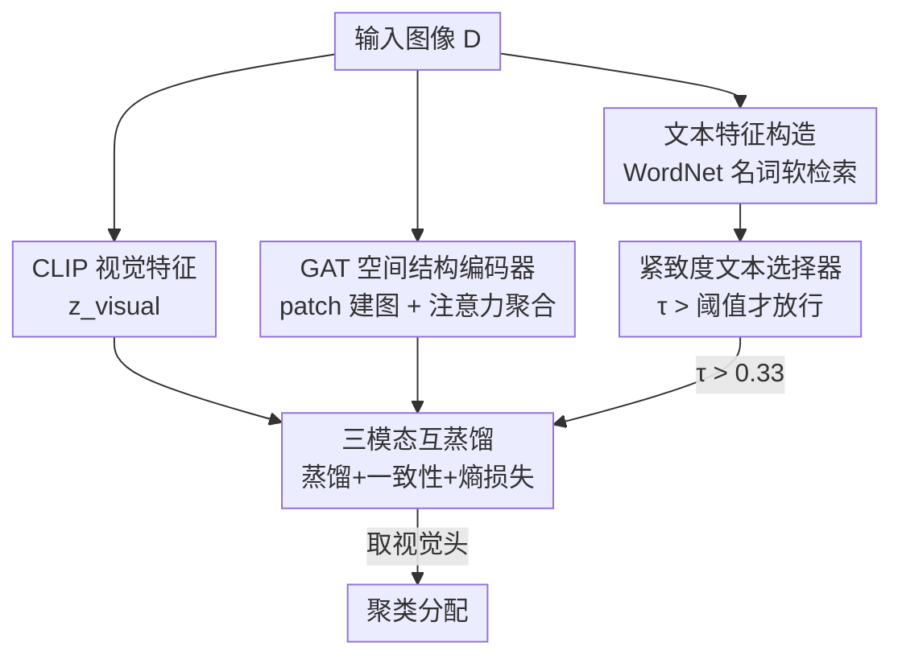

# Spatial Structure and Selective Text Jointly Facilitate Image Clustering

**会议**: ICLR 2026  
**OpenReview**: [https://openreview.net/forum?id=3DOgmfZ2k6](https://openreview.net/forum?id=3DOgmfZ2k6)  
**代码**: https://zizhjiu.github.io/SATC/ (项目页)  
**领域**: 自监督 / 图像聚类 / 表示学习  
**关键词**: 图像聚类, CLIP, 图注意力网络, 文本特征选择, 互蒸馏

## 一句话总结
SATC 用 GAT 给每张图建图、提取 patch 之间的空间结构特征来补 CLIP 缺失的局部结构，再用一个基于"文本紧致度 $\tau$"的选择器自动判断该数据集要不要引入文本特征，最后通过视觉/空间/文本三模态互蒸馏出聚类，在 18 个基准上全面超越 TAC 等 SOTA。

## 研究背景与动机

**领域现状**：图像聚类的核心是怎么往无标签数据里注入"先验知识"。先验从早期的"内部紧致性约束"（同类样本在特征空间应聚在一起，如 K-Means、DEC）逐渐演化到"外部文本引导"——以 TAC 为代表，借 CLIP 的图文对齐能力，把 WordNet 名词等外部文本知识当作辅助监督引入聚类，显著提升了效果。

**现有痛点**：作者指出两个被忽视的问题。其一，CLIP 是为图文对齐训练的，它把图像压进一个共享语义空间时会损失**空间结构**信息（物体形状、位置、部件布局），而这些恰恰对区分类别很关键。论文用 OxfordPets 里两张柴犬和一张荷兰毛狮犬举例：在视觉和文本模态下，相似度都错误地把一只柴犬和毛狮犬拉得更近，反而是空间模态能正确把两只柴犬归到一起。其二，现有方法默认"文本特征对所有数据集都有益"，但作者在 18 个数据集上实测发现，盲目引入文本特征在不少数据集上反而**掉点**——文本并非万能。

**核心矛盾**：CLIP 的图文对齐天然牺牲了局部空间关系；而文本先验的有效性高度依赖数据集，统一"开文本"会引入噪声。

**本文目标**：(1) 补回 CLIP 缺失的空间结构；(2) 让模型自己判断每个数据集该不该用文本。

**切入角度**：把一张图的 patch 当作图节点、用图注意力建模 patch 间关系，从而显式编码空间结构；同时用"文本特征自身的聚类紧致度"作为客观信号来决定文本是否可用。

**核心 idea**：用 **空间结构特征 + 选择性文本** 联合驱动聚类——GAT 提空间结构、紧致度选择器筛文本、三模态互蒸馏出最终分配。

## 方法详解

### 整体框架
SATC 要解决的是"CLIP 视觉特征不够 + 文本特征不一定有用"这两个缺口。整体上它把一张图变成三路特征——视觉（CLIP 直接出）、空间（ResNet-50 切 patch → GAT 建图聚合）、文本（按 TAC 流程从 WordNet 名词软检索得到），其中文本这一路要先过紧致度选择器，只有 $\tau$ 超过阈值才放行。三路特征各接一个 MLP 聚类头，通过三模态互蒸馏互相对齐，最终**取视觉头**蒸馏后的聚类分配作为输出（空间、文本只作辅助）。

### 关键设计

**1. GAT 空间结构编码器：把 CLIP 丢掉的局部结构补回来**

针对 CLIP 损失空间结构的痛点，作者不再只用一个全局向量描述图像，而是把单张图拆成 patch、显式建模 patch 之间的关系。具体做法：用去掉最后池化层和全连接层的预训练 ResNet-50 抽 patch 级特征 $X=[x_1,\dots,x_M]^\top\in\mathbb{R}^{M\times d}$，每个 patch 当作一个图节点，按特征相似度在**同一张图内部**连边构成边集 $E$，然后送进 GAT。GAT 用可学习的注意力对邻居加权聚合更新每个节点：

$$x'_i = \sigma\!\left(\sum_{j\in N(i)} \frac{\exp(f(x_i,x_j))}{\sum_{k\in N(i)}\exp(f(x_i,x_k))}\, x_j\right)$$

其中 $f(x_i,x_j)$ 是可学习的注意力打分函数。更新后的节点特征再做全局平均池化得到空间嵌入 $z_{\text{spatial}}\in\mathbb{R}^d$。之所以选 GAT 而不是 GCN 或 Transformer，是因为它的注意力能**自适应地给不同邻居 patch 加权**，而不是 GCN 的均匀聚合或 Transformer 的固定感受野——消融里 GAT 平均 ACC 73.7% 高于 GCN 71.9%、Transformer 70.4%，印证了这点。

**2. 紧致度文本选择器：让模型自己决定该不该用文本**

针对"文本不一定有益"的痛点，作者设计了一个数据集级的开关，用文本特征自身的**聚类紧致度 $\tau$** 作为判据。文本特征先按 TAC 流程构造：把视觉特征 K-Means 成 $K_1=\lfloor N/300\rfloor$ 个簇，对每个簇中心取后验概率最高的 top-5 名词，再让每个样本对这 5 个名词做软检索（温度 $\beta_1=0.005$）合成文本特征 $z_{\text{textual}}$。然后把全体文本特征 K-Means 成 $K_t=10$ 个簇，紧致度定义为平均簇内距离：

$$\tau = \frac{1}{K_t}\sum_{j=1}^{K_t}\frac{1}{|D_j|}\sum_{z\in D_j}\|z - C_j\|^2$$

直觉是：$\tau$ 越低说明文本特征挤成一团、语义冗余，对区分类别没帮助；$\tau$ 越高说明文本语义更多样、更有判别力。训练前在整个数据集上算一次 $\tau$，若 $\tau$ 高于阈值（实验定为 0.33）就把文本接入互蒸馏，否则直接剔除。这是一条从 18 个数据集聚合趋势里**经验发现的规则**（作者强调不是在测试集上调出来的超参）：Table 2 显示 $\tau<0.33$ 的数据集用文本几乎都掉点、$\tau>0.33$ 的几乎都涨点，选择器的判断与每个数据集的最优选项完全吻合。

**3. 三模态互蒸馏：让视觉、空间、文本互相对齐并产出聚类**

三路特征各接一个 MLP 聚类头（512-512-K），把特征投成软聚类分配分布，然后让它们两两互相蒸馏对齐。总损失整合三类：

$$L = \sum_{k=1}^{3} L^k_{\text{distill}} + \lambda_1 \sum_{k=1}^{3} L^k_{\text{consist}} - \lambda_2 \sum_{m\in M} L^m_{\text{entropy}}$$

其中 $M=\{\text{visual, textual, spatial}\}$。互蒸馏损失 $L_{\text{distill}}$ 以对比形式（温度 $T$）拉近两模态同一样本的聚类分配、推远与其它样本的分配；一致性损失 $L_{\text{consist}}=-\frac{1}{N}\sum_i \log(c^{\text{visual}\top}_i c^{\text{spatial}}_i)$ 进一步逼同一锚点在两模态下的分配；熵损失 $L_{\text{entropy}}$ 取每样本分配分布的平均熵，用来防止退化解、鼓励自信分配。三类损失协同，使空间与文本作为辅助信息强化视觉模态的判别力，最终取蒸馏后的**视觉头**输出作为聚类结果。

### 损失函数 / 训练策略
用 CLIP ViT-B/32 抽视觉与文本特征；三个模态各一个 MLP 聚类头（512-512-K）。训练 200 epoch、batch 512，总损失连续 10 次不下降即早停。按 TAC 设互蒸馏温度 $T=0.5$；一致性与熵损失权重 $\lambda_1=1.0$、$\lambda_2=5.0$；文本紧致度阈值 0.33。每个数据集报 10 次不同种子的均值。

## 实验关键数据

### 主实验
18 个基准上评估，主对比在 ImageNet-10 / ImageNet-Dogs / STL-10 / CIFAR-10 / CIFAR-100 五个常用数据集，指标为 ACC / NMI / ARI（%），与 K-Means、DEC、CC、SPICE、DPAC、DINOv2/v3+K-Means、Turtle、TAC 等对比。

| 数据集 | 指标 | SATC | TAC (次优) | 提升 |
|--------|------|------|------------|------|
| ImageNet-10 | ACC | 99.8 | 99.5 | +0.3 |
| ImageNet-Dogs | ACC | 91.4 | 84.4 | +7.0 |
| STL-10 | ACC | 99.0 | 98.3 | +0.7 |
| CIFAR-10 | ACC | 94.5 | 92.2 | +2.3 |
| CIFAR-100 | ACC | 63.4 | 59.0 | +4.4 |

SATC 在五个数据集的 ACC/NMI/ARI 上几乎全部第一，最难的 ImageNet-Dogs 上 ACC 比 TAC 高 7.0%，CIFAR-100 高 4.4%。

### 消融实验
空间建模架构消融（18 数据集平均 ACC%，Table 3）：

| 配置 | 平均 ACC | 说明 |
|------|----------|------|
| CLIP only | 60.8 | 原始 CLIP 特征 + K-Means |
| + ResNet-50 node | 69.1 | 加 patch 节点特征（含文本互蒸馏） |
| + GCN | 71.9 | 空间建模换 GCN |
| + Transformer | 70.4 | 空间建模换 Transformer |
| + GAT (Full) | 73.7 | 完整模型 |

文本选择器消融（Table 2，18 数据集）：选择器对每个数据集判出的 Use/No-Text，与该数据集实际最优选项**完全一致**，验证了 $\tau$ 作为判据的有效性。

### 关键发现
- **空间结构是主要增益来源**：仅把原始 CLIP（60.8）换成 patch+GAT（73.7）就涨了近 13 个百分点；GAT 优于 GCN/Transformer，归功于自适应注意力加权而非均匀聚合或固定感受野。
- **文本不是万能**：Table 2 中 $\tau<0.33$ 的数据集（如索引 1：No-Text 89.8% vs Use-Text 60.7%）用文本严重掉点，选择器把这些数据集正确判为"不用文本"。
- **视觉与空间互补**：仅视觉（+V）和仅空间（+S）经 K-Means 性能相当，但互蒸馏组合（+V+S）超过任一单模态，说明空间提供结构线索、视觉提供语义，二者互补。
- **超参鲁棒**：$\lambda_1,\lambda_2$ 在很大范围内稳定，ImageNet-10 上始终 >99.6% ACC。

## 亮点与洞察
- **把"要不要用文本"变成可计算的客观量**：用文本特征自身的簇内紧致度 $\tau$ 当开关，绕过了"文本默认有益"的盲目假设，而且这个判据不依赖标签、训练前一次性算完，工程上很轻。
- **patch 图 + GAT 补结构**：把单张图内部的 patch 关系建成图、用注意力聚合，是给 CLIP 这类全局对齐模型"打补丁"的通用思路，可迁移到其它依赖局部结构的下游任务。
- **三模态互蒸馏只取视觉头**：空间和文本全程当"老师"辅助视觉，最终落到视觉头，既吸收了多模态信息又保持了推理时的简洁。

## 局限与展望
- 文本选择器是**数据集级**的硬开关（整套数据集要么全用要么全不用文本），无法对单个样本或子簇做更细粒度的选择。
- 阈值 0.33 是从 18 个数据集聚合趋势里经验得出的，换到分布差异很大的新数据集上是否仍最优、是否需要重新标定，文中未充分讨论。
- 空间特征依赖额外的 ResNet-50 抽 patch，相比纯 CLIP 流程增加了计算与组件复杂度。
- 改进方向：把 $\tau$ 选择器从硬阈值改为软加权、或下放到样本/子簇级别，可能进一步榨取文本中"局部有用"的部分。

## 相关工作与启发
- **vs TAC**: TAC 把 CLIP 文本特征当作恒定可靠的辅助监督一律引入；SATC 认为文本并非普遍有益，用紧致度选择器自适应取舍，并额外补了 GAT 空间结构，两点都直接针对 TAC 的盲区。
- **vs GATCluster**: 同样用图注意力，但 GATCluster 是在样本/邻居关系上建图聚类；SATC 把 GAT 用在**单张图内部 patch** 上提空间结构特征，再喂给多模态互蒸馏，定位不同。
- **vs 纯 CLIP/DINOv2/v3 + K-Means**: 这些直接拿基础模型全局特征聚类，缺局部结构；SATC 显式补结构 + 选文本，在 ImageNet-Dogs 等结构敏感数据集上优势明显。

## 评分
- 新颖性: ⭐⭐⭐⭐ 紧致度文本选择器 + patch 级 GAT 空间特征的组合切中 CLIP 聚类的两个真实盲区
- 实验充分度: ⭐⭐⭐⭐⭐ 18 个基准、10 次种子均值，空间/文本/损失多角度消融都到位
- 写作质量: ⭐⭐⭐⭐ 图 1 的反例和 Table 2 的紧致度-收益相关性把动机讲得很清楚
- 价值: ⭐⭐⭐⭐ 给"基础模型补局部结构 + 自适应取舍外部先验"提供了可复用范式

<!-- RELATED:START -->

## 相关论文

- [\[ICLR 2026\] Mini-cluster Guided Long-tailed Deep Clustering](mini-cluster_guided_long-tailed_deep_clustering.md)
- [\[ICLR 2026\] Relationship Alignment for View-aware Multi-view Clustering](relationship_alignment_for_view-aware_multi-view_clustering.md)
- [\[CVPR 2026\] Text-Phase Synergy Network with Dual Priors for Unsupervised Cross-Domain Image Retrieval](../../CVPR2026/self_supervised/text-phase_synergy_network_with_dual_priors_for_unsupervised_cross-domain_image_.md)
- [\[ICLR 2026\] HiMAE: Hierarchical Masked Autoencoders Discover Resolution-Specific Structure in Wearable Time Series](himae_hierarchical_masked_autoencoders_discover_resolution-specific_structure_in.md)
- [\[ICCV 2025\] A Token-level Text Image Foundation Model for Document Understanding (TokenFD/TokenVL)](../../ICCV2025/self_supervised/a_tokenlevel_text_image_foundation_model_for_document_unders.md)

<!-- RELATED:END -->
