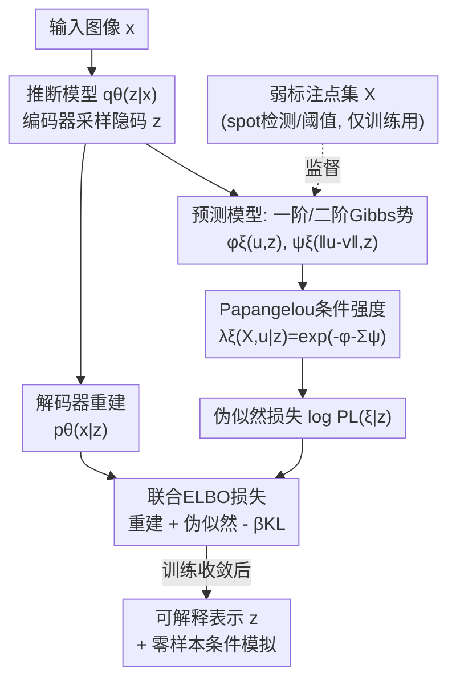

# Spatially Informed Autoencoders for Interpretable Visual Representation Learning

**会议**: ICLR 2026  
**OpenReview**: [https://openreview.net/forum?id=09YSBymX6O](https://openreview.net/forum?id=09YSBymX6O)  
**代码**: https://git.mpi-cbg.de/mosaic/software/machine-learning/si-vae  
**领域**: 自监督表示学习 / 可解释性 / 空间统计 / 生物显微成像  
**关键词**: 变分自编码器, 空间点过程, Papangelou 条件强度, 伪似然, 可解释表示

## 一句话总结
本文提出 **SI-VAE（空间信息变分自编码器）**，用空间点过程的伪似然作为自监督目标去监督 VAE 的隐空间，让模型不再只学像素强度、而是学到"物体之间空间排布关系"的统计可解释表示，在合成数据上把点模式分类准确率从 48%（普通 VAE）拉到 80%–90%，并能从单张图像零样本条件模拟点过程、应用到人类细胞蛋白定位分析。

## 研究背景与动机

**领域现状**：在很多科学成像场景里（卫星图中的林火/物种分布、荧光显微镜下细胞里的蛋白/病毒分布），图像的语义不在于物体的外观或纹理，而在于这些"离散点状物体"在空间里**怎么排布**——是聚集、是排斥、还是完全随机。要从这类图像中学到有用的表示，主流做法是自监督深度学习：对比学习、掩码自编码器（MAE）、以及各类 VAE。

**现有痛点**：这些方法的自监督信号几乎都建立在**像素强度/像素相似性**上。对比学习比较同一图像的增广视图，本质是鼓励像素层面的相似；MAE 被指出主要靠未被遮挡的 patch 重建、解码时忽略被遮挡 token 的空间排布；常用的图像损失指标也被证明更关注图像外观而非空间内容。结果就是：模型能区分"整体强度高低/是否均匀"，却抓不住物体**两两之间的二阶相关结构**（到底是吸引还是排斥）。即便是用高斯过程先验的 GP-VAE，编码的也是"图像之间"的相关，而非"图像内物体之间"的相关。

**核心矛盾**：科学应用真正想要的是对空间组织的**机制性、可统计推断**的解释（比如"这些蛋白为什么聚在核内"），但纯自监督/判别式表示既不提供这种机制洞察，也缺乏严格下游统计分析所需的概率框架；而且还容易踩"Clever Hans"坑——学到伪相关线索而非真实特征。一句话：缺一个能把"空间相关结构"显式写进自监督目标的先验。

**本文目标**：(1) 设计一个自监督信号，让 VAE 隐空间显式编码点状物体的空间相互作用；(2) 让学到的表示在空间统计框架下可解释；(3) 顺带获得从图像直接条件模拟点过程的生成能力。

**切入角度**：空间统计里早有成熟工具——**空间点过程（spatial point process）**，尤其是 Gibbs 点过程，用能量函数显式建模点之间的一阶倾向与二阶相互作用，本身就是可解释、可生成的模型。把它的预测似然当作 VAE 的自监督目标，就能把"空间组织"这件事直接写进损失。

**核心 idea**：用**点过程的 Papangelou 条件强度 + 伪似然**作为自监督目标，让 VAE 隐变量 $z$ 充当"预测点过程概率密度"的预测器——即在普通 VAE 上挂一个轻量预测头，把"像素重建"换成/补成"解释观测到的点排布"。

## 方法详解

### 整体框架

SI-VAE 的骨架仍是一个标准 VAE：推断模型 $q_\theta(z|x)$（编码器）从输入图像 $x$ 采样隐码 $z$，解码器负责重建图像 $p_\theta(x|z)$。关键改动是在隐码上接一个**预测模型** $\lambda_\xi(X,u|z)$，它把 $z$ 映射成一个 Gibbs 点过程的 **Papangelou 条件强度**，用来解释这张图里点状物体的空间排布 $X$。训练时，点集 $X$ 通过弱标注（如 spot detection / 阈值分割）从图像中提取，作为自监督信号；推断时只需图像 $x$，点过程组件完全不参与，所以 SI-VAE 对外就是个普通 VAE，可直接替换。

整体损失把三项揉在一起（公式 5）：图像重建项 $\mathbb{E}_q[\log p_\theta(x|z)]$ + 点过程伪似然项 $\mathbb{E}_q[\log p_\xi(X|z)]$ + KL 正则 $\beta\,\mathrm{KL}(q_\theta(z|x)\|p(z))$。作者证明在两条温和假设（$x\perp X\,|\,z$，且后验只依赖图像）下，这个损失正好是"图像 + 点过程"联合生成模型 $p(X,x,z)=p(X|x,z)p(x|z)p(z)$ 的 ELBO。

### 关键设计

**1. 点过程伪似然自监督目标：把"空间相关"直接写进 loss**

这是全文的核心，针对的痛点是"自监督信号只盯像素强度、抓不住物体间二阶相关"。作者不再让模型去重建像素，而是让它去**解释观测到的点排布**。Gibbs 点过程用能量密度建模点集 $X$：
$$p_\xi(X)\propto\exp\Big(-\sum_{u\in X}\phi_\xi(u)-\sum_{\{u,v\}\subseteq X}\psi_\xi(u,v)\Big)$$
其中 $\phi_\xi$ 是一阶势（控制单点出现倾向）、$\psi_\xi$ 是二阶势（控制点对相互作用，决定吸引/中性/排斥）。但 Gibbs 密度的归一化配分函数不可解，极大似然估计行不通。作者转而建模 **Papangelou 条件强度**：$\lambda_\xi(X,u)$ 表示"在已知其余所有点的条件下、在 $u$ 处再观测到一个点的概率密度"，对上式恰好化简为 $\lambda_\xi(X,u)=\exp\!\big(-\phi_\xi(u)-\sum_{v\in X}\psi_\xi(u,v)\big)$，**绕开了归一化常数**。基于它的对数伪似然
$$\log \mathrm{PL}(\xi)=\sum_{u\in X\cap D}\log\lambda_\xi(X,u)-\int_D \lambda_\xi(X,u)\,\mathrm{d}u$$
被直接当作可微损失（$D=W\ominus R$ 是把域按相互作用距离 $R$ 腐蚀以避免边界效应）。它还可被解释为"逐像素是否有点"的二分类伯努利极限（公式 6），所以预测头本质是个像素级的点存在性分类器。这样隐码 $z$ 被迫去编码能解释点排布的信息，而不是全局亮度。

**2. 双浅层 Gibbs 势网络 + 各向同性与距离衰减约束：换来可识别性和可解释性**

一阶势 $\phi_\xi$ 和二阶势 $\psi_\xi$ 各用一个**以 $z$ 为输入的两层浅网络**表示。直接放开 $\psi_\xi$ 的自由度会让模型收敛到不考虑局部相互作用的平凡解（附录 B），因此作者加了两层约束：(a) 令 $\psi_\xi(u,v)=\psi_\xi(\|u-v\|_2)$ 为**对称、各向同性**函数，使相互作用对整个点模式的平移、旋转不变；(b) 用**距离衰减权重** $w_{uv}$ 把作用限制在范围 $L$ 内：$\psi_\xi(u,v)=w_{uv}\psi_\xi(\|u-v\|_2)$。后者很关键——长程相互作用与密度不均匀（inhomogeneity）在数学上无法区分，不加这个正则，非均匀点过程就不可识别。$L$ 是超参（合成数据取 0.25，细胞数据取核半径的一半）。约束之外，这个设计的红利是：训练完的 $\phi_\xi,\psi_\xi$ 可被直接读作"过程的一阶/二阶相互作用结构"——比如蛋白定位实验里读出"短程排斥 + 长程吸引"，给出机制性解释。

**3. 混合联合模型视角：一套 loss 同时给出可解释表示 + 零样本条件模拟**

SI-VAE 同时建模 $p(X,x)=p(X|x)p(x)$，是一个**混合（hybrid）模型**而非纯判别模型；已有工作表明混合模型学到的表示更丰富、对离群更鲁棒。这带来两个超出"分类更准"的能力。其一，因为 VAE 可对 $q_\theta(z|x)$ 重采样，模型自带**不确定性量化**：多采样几个 $z$ 就能给出条件强度估计的波动。其二，由于 $\lambda_\xi(X,u|z)$ 参数化了 $X$ 的分布，它可以塞进 MCMC 采样器，从而**仅凭一张查询图像就零样本地条件模拟出点过程**——作者称这是首个"基于图像的点过程条件模拟"。判别式表示和纯生成模型都给不了这种"既可解释、又能条件生成"的组合：和 DIGLM 等混合模型相比，SI-VAE 用摊还变分推断估计 $z$，而不是流模型。

### 损失函数 / 训练策略

总目标即公式 5 的联合 ELBO：重建项 + 伪似然项 $-\,\beta$·KL。其中伪似然项用 $\lambda_\xi(X,u|z)$ 代入公式 4 计算。训练用 Adam 优化器在各自 ELBO 上跑到验证集收敛；合成实验中 $\beta=0.1$（在 $0.001\sim1.0$ 三个数量级网格搜索得到），距离权重的相互作用范围 $L=0.25$ 由先验知识确定。评估时把表示取为后验均值 $q_\theta(z|x)$ 的 mean。注意点集 $X$ 仅训练阶段需要，推断阶段不需要。

## 实验关键数据

### 主实验

合成数据：从吸引（Thomas）、排斥（Strauss）、无关（Poisson）三类点过程、各配均匀/非均匀强度，共六类、每类 5000 张噪声图像生成；所有图像期望点数都 $\approx 52$，防止模型靠总像素强度作弊。用线性评估协议（linear probe）测隐空间能否分开这六类。

| 模型 / 弱标注 | SNR | Acc (↑) | F1 (↑) |
|---|---|---|---|
| VAE（整图） | 12.8 | 0.48 | 0.47 |
| VAE（整图） | 9.6 | 0.48 | 0.47 |
| mask VAE（完美点位掩码） | ∞ | 0.63 | 0.62 |
| **SI-VAE**（GT 点位） | 12.8 | **0.90** | **0.90** |
| **SI-VAE**（GT 点位） | 9.6 | **0.88** | **0.88** |
| SI-VAE（Spotiflow 弱标注） | 12.8 | 0.90 | 0.90 |
| SI-VAE（Spotiflow 弱标注） | 9.6 | 0.83 | 0.83 |
| SI-VAE（Otsu 阈值弱标注） | 12.8 | 0.80 | 0.80 |
| SI-VAE（Otsu 阈值弱标注） | 9.6 | 0.81 | 0.81 |

普通 VAE 准确率几乎钉在 0.48，UMAP 显示它只学到全局像素强度（只分得开均匀 vs 非均匀，分不开过程类型）；SI-VAE 全面碾压，即便只用简单 Otsu 阈值做弱标注、在低 SNR 下也有 0.80+。用 SOTA 检测器 Spotiflow 时几乎追平 GT 基线。作者还定义误差敏感度 $S_{F1}=(F^{class}_{1,GT}-F^{class}_{1,method})/(1-F^{spot}_{1,method})$ 量化对检测误差的鲁棒性，所有情况 $S_{F1}\le 1$，说明 SI-VAE 训练时能**抑制** spot 检测误差。

### 泛化与零样本模拟

- **泛化到未见过程**：用训练中没出现过的对数高斯 Cox 过程（LGCP，应接近均匀 Thomas）生成 150 张图，复用前面训好的线性分类器。VAE 完全无法泛化；SI-VAE 正确把 LGCP 归到最接近的 Thomas 类（HT），GT 训练版本甚至分类完美。
- **零样本条件模拟**（Table 2，每类 100 张测试图）：用相对强度误差 RIE（一阶）和 K 函数拒绝率 RR（二阶）评估。

| 过程 | RIE (↓) | RR (↓) |
|---|---|---|
| Strauss（均匀/非均匀） | 0.23 / 0.14 | 0.13 / 0.14 |
| Poisson（均匀/非均匀） | 0.34 / 0.27 | 0.08 / 0.03 |
| Thomas（均匀/非均匀） | 0.62 / 0.49 | 0.20 / 0.15 |

Strauss（排斥）模拟最准；Thomas（始终聚集）RIE 最高、需靠模型饱和稳定模拟，提示饱和参数 $s$ 偏大有待改进。RR 整体偏低，说明二阶相互作用结构被很好地捕捉。

### 真实应用：人类细胞蛋白定位

在 OpenCell 数据集（>1000 种人类蛋白的荧光显微图）上，取六种蛋白（四种定位到囊泡：SNX1/SNX12/STAM/STAM2；两种形成核内点状：POLR3E/POLR3F），用 Spotiflow 弱标注训练，687 张测试图上用 GMM（AIC 选 $K=2$）聚类。对比 VAE 与专门的 SOTA 模型 Cytoself（两个 VQ-VAE + 分类头，架构深得多）：

| 模型 | Silhouette (↑) | 备注 |
|---|---|---|
| VAE | 0.04 | 簇松散，仍只分全局强度 |
| **SI-VAE** | **0.29** | 复杂度远低于 Cytoself，且无需分类标签 |
| Cytoself | 0.33 | 深架构 + 离散隐空间 + 分类监督 |

SI-VAE 用低得多的模型复杂度逼近 Cytoself，且不需要 ground-truth 分类标签（可无偏发现）。更重要的是它能**机制性解释**：一阶势显示囊泡蛋白分布更均匀、核蛋白集中在核内；二阶势揭示"短程排斥 + 长程吸引"，且核蛋白排斥范围更小（解释核内更紧的分子堆积）、长程吸引更强（利于在扩散受限条件下高效覆盖核区加速生化反应）。这种"核内约束"并未被人工施加，而是模型从数据里读出来的。

### 关键发现
- 贡献最大的是点过程自监督目标本身：去掉它（=普通 VAE）准确率从 0.90 直接掉到 0.48。
- 弱标注质量影响有限：连最朴素的 Otsu 阈值都能撑到 0.80+，且 SI-VAE 还能抑制检测误差（$S_{F1}\le1$）。
- 各向同性 + 距离衰减约束对可识别性是必需的：放开自由度会收敛到忽略局部相互作用的平凡解。

## 亮点与洞察
- **把空间统计的严谨性"焊"进自监督**：用 Papangelou 条件强度绕开不可解的配分函数，让能量型点过程能以伪似然形式当损失——这是把经典空间统计与深度学习真正缝合的关键一招，可迁移到任何"离散点排布"建模任务。
- **可解释性不是事后解释而是内生属性**：学到的 $\phi_\xi,\psi_\xi$ 直接就是过程的一阶/二阶相互作用结构，能读出"短程排斥+长程吸引"这种机制结论，远比 UMAP 上看簇紧不紧更有科学价值。
- **drop-in 替换**：推断时点过程组件不参与，SI-VAE 对外就是普通 VAE，只在训练加一个小预测头，落地成本极低。
- **一个 loss 三种能力**：可解释表示 + 不确定性量化 + 零样本条件模拟，混合模型的联合密度视角把它们统一在一套 ELBO 下。

## 局限与展望
- **一/二阶特征解耦不彻底**：对 Poisson 过程（理论上 $\psi=0$ 无相互作用），SI-VAE 仍会因隐码 $z$ 对具体点配置敏感而预测出吸引/排斥，说明它难以彻底分离一阶强度与二阶相互作用——这是普遍难题，但会让机制解读被特定点配置带偏。
- **聚集过程模拟偏多点**：Thomas 过程 RIE 最高，模型倾向预测过多点，依赖模型饱和稳定，且饱和参数 $s$ 似乎偏大，需进一步研究。
- **检测误差的偏置**：弱标注主要在稠密区漏点，会系统性地偏置学到的相关结构。
- **建模假设受限**：只建模成对、各向同性、均匀类相互作用；作者展望用 score matching / Deep Sets 估计完整密度以支持非成对相互作用，扩展到各向异性、标记点过程（跨类型点相互作用），以及更表达力的隐变量先验（GP-VAE / VampPrior）。

## 相关工作与启发
- **vs 对比学习 / MAE**：它们的自监督信号基于像素相似或未遮挡 patch，抓的是外观；SI-VAE 用点过程似然，抓的是物体间二阶空间相关，从根上换了监督目标。
- **vs Cytoself**：Cytoself 用 ground-truth 蛋白分类标签做半监督、深架构 + 离散隐空间，聚类略好（0.33 vs 0.29）但不可机制解释、且需标签；SI-VAE 无标签、低复杂度、可解释。
- **vs GP-VAE / GP 先验方法**：GP 先验编码的是"图像之间"的相关，建模不了"图像内物体之间"的相互作用；SI-VAE 正是补这个缺口。
- **vs DIGLM 等混合模型**：同属混合模型，但 SI-VAE 用摊还变分推断估 $z$，而非流模型，并且把点过程作为可解释的预测目标。

## 评分
- 新颖性: ⭐⭐⭐⭐⭐ 首次把 Papangelou 条件强度 + 伪似然当作 VAE 自监督目标，并实现图像驱动的零样本点过程条件模拟。
- 实验充分度: ⭐⭐⭐⭐ 合成数据消融充分、有泛化与模拟评估、有真实显微数据落地；但真实数据只测了六种蛋白、规模偏小。
- 写作质量: ⭐⭐⭐⭐⭐ 概率框架推导严谨，从点过程到 ELBO 的解释清晰，图示到位。
- 价值: ⭐⭐⭐⭐⭐ 对需要空间统计可解释性的科学成像（生物/遥感）是即插即用、低成本的强工具。

<!-- RELATED:START -->

## 相关论文

- [\[CVPR 2026\] Franca: Nested Matryoshka Clustering for Scalable Visual Representation Learning](../../CVPR2026/self_supervised/franca_nested_matryoshka_clustering_for_scalable_visual_representation_learning.md)
- [\[ICLR 2026\] Unsupervised Representation Learning - An Invariant Risk Minimization Perspective](unsupervised_representation_learning_-_an_invariant_risk_minimization_perspectiv.md)
- [\[ICLR 2026\] Beyond Hearing: Learning Task-Agnostic ExG Representations from Earphones via Physiology-Informed Tokenization](beyond_hearing_learning_task-agnostic_exg_representations_from_earphones_via_phy.md)
- [\[ICLR 2026\] GUIDE: Gated Uncertainty-Informed Disentangled Experts for Long-tailed Recognition](guide_gated_uncertainty-informed_disentangled_experts_for_long-tailed_recognitio.md)
- [\[ICCV 2025\] Scaling Language-Free Visual Representation Learning](../../ICCV2025/self_supervised/scaling_languagefree_visual_representation_learning.md)

<!-- RELATED:END -->
