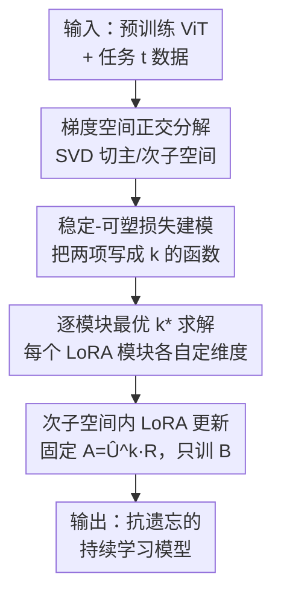

# SplitLoRA: Balancing Stability and Plasticity in Continual Learning Through Gradient Space Splitting

**会议**: ICLR 2026  
**OpenReview**: [https://openreview.net/forum?id=Zm1hjXxRQV](https://openreview.net/forum?id=Zm1hjXxRQV)  
**代码**: https://github.com/qhmiao/SplitLoRA  
**领域**: 持续学习 / 参数高效微调 / 表示学习  
**关键词**: 持续学习, 梯度投影, LoRA, 稳定性-可塑性, 次子空间

## 一句话总结
SplitLoRA 把"次梯度子空间该取多大"这个持续学习里的老大难问题，从拍脑袋的阈值变成一个可解的优化问题：它先理论推出"稳定性损失 + 可塑性损失"随子空间维度 $k$ 变化的上界，再对每个 LoRA 模块单独求最优 $k^*$，最后把 LoRA 的降维矩阵 $A$ 固定到这个次子空间里、只训练 $B$，在 ImageNet-R / CIFAR-100 / DomainNet 上比现有方法高 2%–5%。

## 研究背景与动机

**领域现状**：持续学习（Continual Learning, CL）要求模型按顺序学一串任务，既要"稳定"（不忘旧任务）又要"可塑"（学得会新任务）。近年的主流之一是**梯度投影**：把旧任务梯度张成的空间用 SVD 切成"主子空间"（大奇异值，承载旧知识）和"次子空间"（小奇异值），把新任务的更新约束到次子空间里，从而尽量不踩旧知识。配上预训练 ViT + LoRA 这类参数高效微调（PEFT），效率与效果都很好，是当下的强 baseline（InfLoRA、VPT-NSP2 等）。

**现有痛点**：次子空间该切多大，直接决定稳定与可塑的平衡——切大了新任务学习空间大、可塑性好，但旧任务梯度在次子空间里的残留也变多、稳定性变差。现有方法（InfLoRA、VPT-NSP2 等）统一用一个**预设阈值** $\tau$：对每个模块都按"累计平方奇异值低于 $\tau$"这条规则选 $k$。

**核心矛盾**：这个阈值有两个根本问题。一是 $\tau$ 只是个超参，它和"全任务总损失"之间没有直接的理论关系，调它本质是盲调；二是它对所有模块一刀切，可不同层、不同位置的权重承载的知识量天差地别，用同一个阈值切显然不是各模块各自的最优。

**本文目标**：（1）把次子空间维度 $k$ 与"全部任务损失增量上界"之间的关系写成显式可分析的形式；（2）据此对每个 LoRA 模块**各自**求出平衡稳定与可塑的最优 $k^*$。

**切入角度**：作者从损失函数的 $L$-smooth 性质出发，推一个"更新一步后全任务损失变化"的上界——这个上界恰好能拆成一个稳定性项和一个可塑性项，两项都随 $k$ 单调但方向相反，于是"选 $k$"自然变成"最小化两项之和"的优化问题。

**核心 idea**：用"最小化稳定损失 + 可塑损失上界"这个有理论依据的优化目标，逐模块地求最优次子空间维度 $k^*$，替代全局拍脑袋的阈值 $\tau$。

## 方法详解

### 整体框架
SplitLoRA 沿用"梯度投影 + LoRA"的持续学习骨架，但把其中"次子空间怎么切"这一步换成有理论支撑的逐模块优化。学第 $t$ 个任务时，整条流水线是：先正常训练当前任务的 LoRA，并把任务 $1{\sim}t{-}1$ 的平均梯度累积成 $G^{old}_t$（式 3）；对 $G^{old}_t$ 做 SVD，取最后 $k$ 个左奇异向量当次子空间 $\hat U^k_t$；关键在于这个 $k$ 不再靠阈值，而是用理论推出的稳定/可塑损失模型，对**每个 LoRA 模块**单独解优化问题求 $k^*$；最后把 LoRA 的降维矩阵 $A_t = \hat U^k_t R$ 固定到次子空间里、只训练 $B_t$，从而保证更新始终被锁在低干扰方向上。三大贡献（损失建模 → 逐模块 $k^*$ 求解 → 次子空间内更新）正好对应下图自上而下的流向。

### 关键设计

**1. 稳定-可塑损失上界建模：把"该切多大"从超参变成可分析的函数**

针对"阈值 $\tau$ 和全任务损失没有理论关系、只能盲调"这个痛点，作者先推一个**损失增量上界**（命题 4.1）：假设损失 $L$-smooth、且前 $t{-}1$ 个任务的更新都正交于旧梯度，则从 $W_{t-1}$ 走到 $W_t = W_{t-1} + \Delta W_t$ 后，前 $t$ 个任务的总损失变化被界为

$$\sum_{i=1}^{t}\big(L_i(W_t)-L_i(W_{t-1})\big) \le \underbrace{(t-1)\langle \Delta W_t, G^{old}_t\rangle}_{\text{稳定性损失}} + \underbrace{\langle \Delta W_t, G_t\rangle}_{\text{可塑性损失}} + \frac{(t-1)L}{2}\lVert\Delta W_t\rVert_F^2 .$$

第一项（更新与旧任务平均梯度 $G^{old}_t$ 的对齐度）刻画对旧任务的干扰即稳定性损失，第二项（更新与新任务梯度 $G_t$ 的对齐度）刻画新任务的学习进展即可塑性损失。把 $\Delta W_t$ 换成投影到次子空间后的 $\Delta\hat W_t = \hat U^k_t \hat U^{k\top}_t \Delta W_t$，并定义衡量次方向占比的误差函数 $\epsilon(k)=\frac{\sum_{i=d-k+1}^{d}\sigma_i}{\sum_{i=1}^{d}\sigma_i}$，再对"新任务更新方向在 $G_t$ 各特征方向上期望投影相等"这一无分布假设取期望，就得到两项的期望闭式（定理 4.2）：

$$\mathbb{E}[L^S_t(W_t)] = (t-1)\,\epsilon_t(k_t)\,\langle \Delta W_t, G^{old}_t\rangle,\qquad \mathbb{E}[L^P_t(W_t)] = \frac{k_t}{d}\langle \Delta W_t, G_t\rangle .$$

这一步的价值在于：它把"次子空间大小"和"全任务损失"用 $\epsilon(k)$ 与 $k/d$ 两个随 $k$ 反向变化的量显式连起来了——$k$ 越大可塑越好、稳定越差，且这个 trade-off 第一次有了可优化的表达式，而不是一个孤立的阈值。（⚠️ 上界推导细节以原文命题 4.1 / 定理 4.2 及附录为准。）

**2. 逐模块最优子空间求解：每个 LoRA 模块各定各的 $k^*$**

有了上面两项期望，"选 $k$"就变成最小化它们之和：$k^*_t = \arg\min_k\big(\mathbb{E}[L^S_t] + \mathbb{E}[L^P_t]\big)$（式 13）。但 $\Delta W_t$ 与 $G_t$ 在训练中不断变、而子空间必须在任务开训前就定好，作者引入比值参数 $\alpha = -\frac{\langle \Delta W_t, G_t\rangle}{\langle \Delta W_t, G^{old}_t\rangle}$（注意典型情形下 $\langle\Delta W_t,G_t\rangle<0$、$\langle\Delta W_t,G^{old}_t\rangle>0$，故 $\alpha>0$），把目标重写成只依赖 $k$ 的简洁形式：

$$k^*_t = \arg\min_k\Big((t-1)\,\epsilon_t(k_t) - \alpha\,\frac{k_t}{d}\Big).$$

由于 $k$ 只能取 $[1,d]$ 内整数（ViT-B/16 里 $d=768$），直接遍历所有取值挑最小即可，开销可忽略。$\alpha$ 被显式当作**固定超参**，充当稳定-可塑权衡的"控制旋钮"：$\alpha$ 越大越偏可塑。关键是这个最优化对**每个 LoRA 模块单独做**——因为不同层/位置的权重承载知识量不同，逐模块定维度正是对 InfLoRA 那种"全局阈值一刀切"的针对性修正。实验也显示方法对 $\alpha$ 很鲁棒：$\alpha$ 在 1–30 大范围内变化，性能始终稳压 baseline。

**3. 次子空间内的 LoRA 更新：固定 $A$、只训 $B$，把更新锁进低干扰方向**

求出 $k^*$ 后还要确保 LoRA 的实际更新真的落在次子空间里。LoRA 把更新写成 $\Delta W_t = A_t B_t$；当 $A_t$ 固定时，更新被限制在 $A_t$ 的列空间内。于是作者把降维矩阵构造成

$$A_t = \hat U^k_t R,$$

其中 $\hat U^k_t\in\mathbb{R}^{d\times k}$ 是次子空间的正交基、$R\in\mathbb{R}^{k\times r}$ 是随机高斯矩阵（把 $k$ 维次子空间随机投到 LoRA 的 $r$ 维上）。训练时**固定 $A_t$、只优化 $B_t$**——这样更新方向被钉死在次子空间 $\hat U^k_t$ 内，天然实现了"梯度投影"的效果，却不需要每步真的做投影变换。相比 InfLoRA 每任务要 2 次额外前向，SplitLoRA 只需 1 次，且内存不随任务数增长。作者指出此设计依赖"$A_t$ 训练中保持固定"这一前提，否则更新方向会漂出子空间；已有工作也验证固定 $A$ 仍能保住足够的模型容量。

### 损失函数 / 训练策略
backbone 用 ImageNet-21K 预训练的 ViT-Base，LoRA rank $r=10$、嵌入维 $D=768$，SplitLoRA 模块插在多头注意力的 key/value 投影上。默认 $\alpha=20$，AdamW 优化，LoRA 学习率 $1\mathrm{e}{-3}$、分类头 $1\mathrm{e}{-2}$，batch size 256，每任务训 10 epoch，单张 L40S 即可。每学完一个任务把数据重新喂一遍算平均梯度并按式 3 更新 $G^{old}_t$。

## 实验关键数据

### 主实验
ImageNet-R 三种增量划分（5/10/20 任务），报告最终平均准确率 FAA 和累计平均准确率 CAA（均为 ImageNet-21K 预训练 backbone）：

| 设置 | 指标 | InfLoRA(CVPR24) | VPT-NSP2(NeurIPS24) | SplitLoRA | 提升 |
|------|------|------|------|------|------|
| 5-task | FAA | 79.82 | 79.71 | **81.92** | +2.1 |
| 10-task | FAA | 78.10 | 79.35 | **81.00** | +1.7 |
| 20-task | FAA | 73.81 | 76.72 | **78.82** | +2.1 |
| 20-task | CAA | 81.02 | 82.91 | **84.57** | +1.7 |

CIFAR-100（10 任务）与 DomainNet（5 任务）上同样领先：

| 数据集 | 指标 | 之前最好 | SplitLoRA |
|--------|------|----------|-----------|
| CIFAR-100 | FAA | 88.76 (CoSO) | **90.33** |
| CIFAR-100 | CAA | 92.99 (CoSO) | **93.70** |
| DomainNet | FAA | 83.83 (VPT-NSP2) | **84.31** |
| DomainNet | CAA | 88.63 (VPT-NSP2) | **88.99** |

### 消融实验

| 配置 | 关键指标（IN-R 5/10/20 FAA） | 说明 |
|------|------|------|
| $A_t$=随机初始化 | 76.57 / 76.13 / 72.30 | 不投影，可塑虽在但干扰大、掉点明显 |
| $A_t$=InfLoRA 阈值 | 78.92 / 78.10 / 73.81 | 全局阈值切子空间 |
| $A_t=\hat U^k R$（本文） | **81.92 / 81.00 / 78.82** | 逐模块最优次子空间投影 |

效率对比（ImageNet-R 10 任务）：SplitLoRA 每任务仅 1 次额外前向（InfLoRA 是 2 次），显存 23.03 GB、用时 1h43m，与 InfLoRA（23.06 GB / 1h48m）相当，且显存不随任务数增长。

### 关键发现
- **$A_t$ 的初始化策略是决定性的**：把"随机"换成"逐模块最优次子空间投影"，20-task FAA 从 72.30 提到 78.82，涨 6.5 个点，直接验证了"逐模块定 $k$"比全局阈值更优。
- **对 $\alpha$ 高度鲁棒**：$\alpha$ 取 1、5、10、20、30 时 FAA 都稳定在 78–82 区间、全面超过 InfLoRA，说明这个"控制旋钮"不挑值、不需精调。
- **任务越多优势越大**：20-task（最易遗忘）的提升幅度不输甚至超过 5-task，说明逐模块平衡在长序列、强遗忘场景下更有价值。

## 亮点与洞察
- **把超参变成可优化目标**：最巧的是先推损失上界、再把"选 $k$"写成最小化稳定+可塑两项之和——这让一个一直靠经验阈值的设计第一次有了理论落点，且求解只是 $[1,d]$ 上的整数遍历，几乎零成本。
- **逐模块而非全局**：抓住"不同模块承载知识量不同"这一点，对每个 LoRA 模块各求各的 $k^*$，是对 InfLoRA"一刀切阈值"最直接的改进，消融里 6.5 个点的提升说明这步很值。
- **固定 $A$、只训 $B$ 的工程优雅**：用 $A=\hat U^k R$ 把投影"焊进"LoRA 结构，省掉每步显式投影，额外前向从 2 次降到 1 次——这个"把约束编码进参数化"的思路可迁移到其他需要子空间约束的 PEFT 场景。

## 局限与展望
- 全部实验集中在 ViT-Base + 图像分类的类增量设定，没验证 NLP / 多模态 / 更大 backbone，方法在这些场景的可塑-稳定平衡是否同样成立未知。
- $\alpha$ 虽鲁棒但仍是手动固定的超参，理想情况应能随训练自适应；作者把它当固定旋钮是工程妥协。
- 损失上界依赖 $L$-smooth 和"更新方向各特征方向期望投影相等"的中性假设，真实梯度未必满足，理论最优 $k^*$ 与实际最优之间可能有 gap（作者也强调这是无分布 baseline 而非真实分布）。
- 每任务要把数据重喂一遍算平均梯度并存 $G^{old}$，序列极长时这部分成本与存储仍需关注。

## 相关工作与启发
- **vs InfLoRA / VPT-NSP2**：两者都用预设阈值 $\tau$ 按累计平方奇异值全局地切次子空间；SplitLoRA 改成逐模块、用稳定+可塑损失上界优化求 $k^*$，区别在于"切多大"从盲调超参变成有理论依据的优化，优势是平衡更优、额外前向更少（1 次 vs 2 次）。
- **vs GPM（梯度投影记忆）**：GPM 奠定了"主/次子空间正交分解 + 把新更新约束到次子空间"的范式，但它面向全量更新且子空间维度靠经验；SplitLoRA 继承其正交分解骨架，叠加 LoRA 的参数高效性与逐模块最优维度，把范式搬进 PEFT 并补上"维度怎么定"的理论。
- **vs SD-LoRA / C-LoRA 等 LoRA-CL 方法**：同属"LoRA + 持续学习"，但它们多在 LoRA 的组合/缩放上做文章；SplitLoRA 的独特点是把 LoRA 的降维矩阵 $A$ 显式构造到旧任务次梯度子空间里来抗遗忘。

## 评分
- 新颖性: ⭐⭐⭐⭐ 把"次子空间维度"从阈值变成有理论支撑的逐模块优化，切入点扎实
- 实验充分度: ⭐⭐⭐⭐ 三数据集多划分 + 初始化/效率/α 鲁棒性消融齐全，但局限在视觉分类
- 写作质量: ⭐⭐⭐⭐ 理论—方法—实验链条清晰，命题/定理与算法对应明确
- 价值: ⭐⭐⭐⭐ 在主流 LoRA-CL baseline 上稳定提升 2%–5% 且更省，易复现、实用

<!-- RELATED:START -->

## 相关论文

- [\[CVPR 2026\] Exemplar-Free Continual Learning for State Space Models](../../CVPR2026/self_supervised/exemplar-free_continual_learning_for_state_space_models.md)
- [\[ICLR 2026\] Equivariant Splitting: Self-supervised learning from incomplete data](equivariant_splitting_self-supervised_learning_from_incomplete_data.md)
- [\[CVPR 2026\] DGS: Dual Gradient and Semantic-Shift Guided Low-Rank Adaptation for Class Incremental Learning](../../CVPR2026/self_supervised/dgs_dual_gradient_and_semantic-shift_guided_low-rank_adaptation_for_class_increm.md)
- [\[CVPR 2026\] Parameter-efficient Continual Learning for Enhancing Plasticity without Forgetting under Limited Model Capacity](../../CVPR2026/self_supervised/parameter-efficient_continual_learning_for_enhancing_plasticity_without_forgetti.md)
- [\[ICLR 2026\] Symmetric Space Learning for Combinatorial Generalization](symmetric_space_learning_for_combinatorial_generalization.md)

<!-- RELATED:END -->
