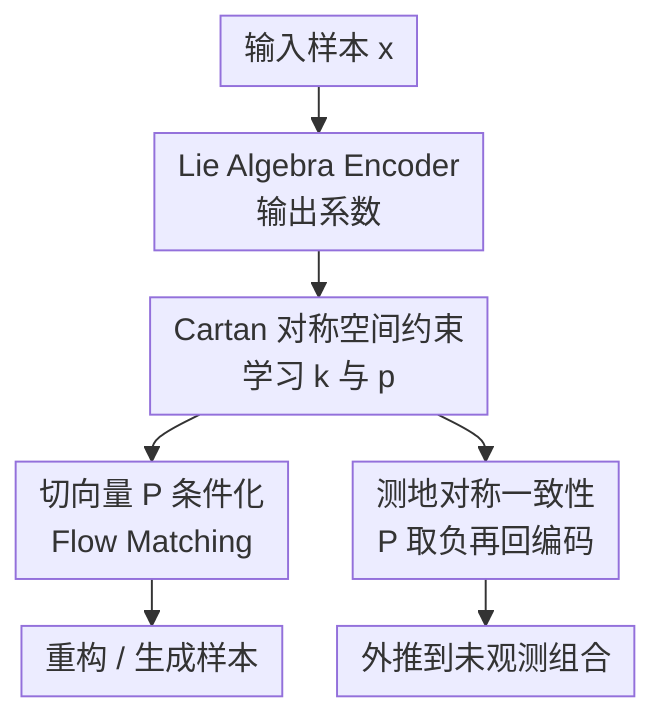

# Symmetric Space Learning for Combinatorial Generalization

**会议**: ICLR 2026  
**OpenReview**: [https://openreview.net/forum?id=e8t9F4vX9N](https://openreview.net/forum?id=e8t9F4vX9N)  
**代码**: 未提供  
**领域**: 自监督学习 / 表示学习 / 组合泛化  
**关键词**: [组合泛化, 对称空间, Lie 代数, 测地对称, Flow Matching]  

## 一句话总结

这篇论文提出 CartanFM，把潜表示空间约束成对称空间，并用 Cartan 分解与测地对称一致性把已观测组合上的对称性外推到未观测组合，在 dSprites、3D Shapes、MPI3D 等组合泛化基准上显著优于 VAE 与已有对称学习方法。

## 研究背景与动机

**领域现状**：组合泛化（Combinatorial Generalization, CG）关心模型能否从见过的语义因子组合推广到没有见过的新组合。例如训练集中可能出现过某种形状、颜色、位置，但没有出现过它们的某个特定组合；理想的表示学习模型应该理解这些因子本身，而不是只记住训练集里的联合分布。

**现有痛点**：过去一条重要路线是用对称性或群作用来建模语义变化。直觉上，位置平移、旋转、尺度变化等都可以看成在保持对象身份的同时改变某个因素，因此学习这些变换有助于组合泛化。但论文指出，现有对称学习方法通常只从观测样本中学习群作用；当训练数据只覆盖语义流形的一部分时，学到的变换也容易被限制在观测区域内，不能自然到达未观测区域。

**核心矛盾**：问题不在于群论无法表达全局对称，而在于模型只看到了局部数据。若把训练集上的变换直接当成完整空间的变换，模型缺少一个原则性机制来说明“同样的对称性应该如何延伸到未见过的组合”。作者把这个缺口命名为 symmetry generalization：从 $X_{obs}$ 中学到的对称群 $G_{obs}$，未必存在某个 $g \in G_{obs}$ 和 $x_{obs} \in X_{obs}$ 能够生成 $x_{new} \in X \setminus X_{obs}$。

**本文目标**：论文希望构造一种表示空间，使模型不仅能在观测区域内学到局部变换，还能借助几何结构把这些变换外推到未观测区域。更具体地说，作者需要同时解决两个子问题：第一，真实数据背后的对称群和稳定子群未知，不能预先指定；第二，只靠观测数据学到的结构需要有额外约束，才能对未观测组合保持一致。

**切入角度**：作者选择对称空间（symmetric space）作为潜空间的几何先验。对称空间是一类特殊的齐性空间，既有足够强的全局几何结构，又有一个可操作的局部性质：任意点附近的测地线都可以通过该点做“反射”。在以原点为基准的切空间里，这种测地对称可以简化为 $P \mapsto -P$，这让“生成未见样本并要求编码一致”变成一个可训练的自监督信号。

**核心 idea**：用可学习 Lie 代数的 Cartan 分解给潜空间施加对称空间结构，再用测地对称一致性把观测样本的表示取负并回编码，从而强迫模型学到能跨出训练区域的对称性。

## 方法详解

### 整体框架

本文的方法名为 CartanFM，它把表示学习、对称空间几何和 Flow Matching 生成模型接在一起。输入样本先经过 Lie Algebra Encoder，得到 Lie 代数子空间 $\mathfrak{p}$ 中的切向量 $P$；这个 $P$ 一方面作为条件控制 Conditional Flow Matching 的生成过程，另一方面参与 Cartan Loss 和 Geodesic Symmetry Consistency Loss，分别约束局部代数结构与未见区域的一致性。

从训练角度看，CartanFM 有两条互补路径。主路径用 $P$ 条件化向量场，让模型能重构或生成数据；几何结构路径则把可学习基矩阵组织成符合 Cartan 分解的 $\mathfrak{k} \oplus \mathfrak{p}$，并利用 $-P$ 近似对称空间中的测地反射，制造一个自监督循环来检查编码器是否把“反射后的样本”映射回相反的切向量。

### 关键设计

**1. 对称泛化：把组合泛化的失败定位到“学到的对称性不能出训练区域”**

论文最重要的概念性贡献，是把已有对称学习方法的短板从“表示不够解耦”进一步拆成“对称性本身没有泛化”。如果训练数据只覆盖完整语义空间 $X$ 的子集 $X_{obs}$，模型从这个子集里学到的 $G_{obs}$ 只保证能解释观测样本之间的变换；对一个未见组合 $x_{new}$，并没有理由相信存在 $g \cdot x_{obs} = x_{new}$。这个表述让问题从经验性的 benchmark 失败，变成了一个清晰的结构缺口：模型需要一种在观测区域之外仍然有定义的几何操作。

对称空间正好给这个缺口提供了可训练的抓手。齐性空间的直觉是“任意点之间可以由群作用连接”，但真实任务里全局群作用未知，直接学习完整 $G$ 太难。作者退一步使用对称空间的测地反射性质：只要潜空间被塑造成某个 $G/K$，以原点为中心的测地对称在切空间中就是简单的取负。这样，模型不用显式知道完整群作用，也能通过 $P$ 与 $-P$ 的关系训练一种跨区域的外推约束。

**2. Cartan Loss：用可学习 Lie 代数基底把潜空间塑造成对称空间**

为了让潜表示真的具有对称空间的代数结构，作者不预设具体的 Lie 群，而是学习两组基矩阵：$\{K_i\}$ 表示子代数 $\mathfrak{k}$ 的基，$\{P_j\}$ 表示切空间方向 $\mathfrak{p}$ 的基。编码器输出系数 $c_k$ 与 $c_p$，再线性组合成 $K = \sum_i c_{k,i}K_i$ 和 $P = \sum_j c_{p,j}P_j$。其中 $P \in \mathfrak{p}$ 直接作为 Flow Matching 的条件，$\mathfrak{k}$ 和 $\mathfrak{p}$ 的基底则由 Cartan Loss 约束。

对称空间对应的 Cartan 分解要求 $\mathfrak{g}=\mathfrak{k}\oplus\mathfrak{p}$，并满足三类 Lie bracket 关系：$[\mathfrak{k},\mathfrak{k}]\subseteq\mathfrak{k}$、$[\mathfrak{k},\mathfrak{p}]\subseteq\mathfrak{p}$、$[\mathfrak{p},\mathfrak{p}]\subseteq\mathfrak{k}$。论文把这些关系转成基底级别的投影误差或正交约束：若 $[K_i,K_j]$ 本应落在 $\mathfrak{k}$，它就不该投到 $\mathfrak{p}$；若 $[K_i,P_j]$ 本应落在 $\mathfrak{p}$，它就不该投到 $\mathfrak{k}$；若 $[P_i,P_j]$ 本应落在 $\mathfrak{k}$，它就不该投到 $\mathfrak{p}$。这相当于让网络自己发现一套局部代数坐标，而不是要求研究者提前告诉它数据的群结构。

**3. 测地对称一致性：用 $P \mapsto -P$ 构造面向未见组合的自监督循环**

仅有 Cartan Loss 还不够，因为它主要根据观测样本学习局部结构，仍可能只在训练区域内成立。GSC Loss 的作用是把对称空间的测地反射变成训练信号：先把观测样本 $x_{obs}$ 编码成 $P$，再用 $-P$ 生成一个候选样本，最后把候选样本重新编码，并要求得到的表示接近 $-P$。理想情况下，这个候选样本落在原样本关于原点的“对称位置”，它很可能对应训练集中没有出现过的因子组合。

完整地用 Flow Matching 解 ODE 生成候选样本会很贵，所以实现中作者使用一步近似：从原始数据 $x_0$ 出发，沿着以 $-P$ 为条件的向量场走一步，得到 $x_0 + (1-\sigma_{min})\cdot v(x_0,t=0,-P;\theta)$，再用编码器检查它是否回到 $-P$。对应损失可以写成 $L_{GSC}=\mathbb{E}\|Encoder(x_0+(1-\sigma_{min})v(x_0,0,-P;\theta))+P\|^2$。这个设计的妙处在于，它不是简单做数据增强，而是把“反射后应该编码为相反切向量”写进目标函数，从而把几何对称性外推到训练集之外。

**4. Flow Matching 条件生成：让 Lie 代数表示真正能解码成样本**

论文没有把 Cartan 结构放在普通 VAE 上就结束，而是把 $P$ 接入 Conditional Flow Matching。Flow Matching 学的是从噪声分布到数据分布的概率流，向量场 $v(x,t,P)$ 被 $P$ 条件化；采样时通过 ODE 解出数据，训练时用标准 $L_{CFM}$ 学习向量场。这个选择和论文目标是匹配的：Cartan 结构给出切空间中的几何方向，Flow Matching 则提供一个可微、连续、条件化的生成动力系统，使这些方向能对应到数据空间的变化。

球面实验里的消融也说明了这个选择不是装饰。只把 Cartan module 接在 VAE 上，Chamfer distance 反而很差；而 Cartan + Flow Matching 已经能显著改善未见区域重构，再加 GSC 后进一步达到最好。这说明论文的结构不是“任意生成模型 + 一个几何正则项”，而是需要一个能把切向量条件稳定转成样本流的生成骨架。

### 一个完整示例

可以用 dSprites 的 R2R 设置来理解 CartanFM 的训练过程。假设训练集中见过心形、方形、椭圆，也见过不同位置，但刻意排除了“心形出现在右半区域”这一组合。普通 VAE 可能只学到训练分布的平均外观，生成右半区域样本时变成模糊块；已有对称方法如果只从观测区域学习变换，也可能不知道如何把心形移动到缺失区域。

CartanFM 会先把一个观测样本编码成切向量 $P$，例如“心形在左侧”的某个表示。Cartan Loss 让这一类表示所在的 $\mathfrak{p}$ 与隐藏的稳定方向 $\mathfrak{k}$ 满足对称空间的 bracket 关系；GSC 再取 $-P$，让 Flow Matching 产生一个反射候选，并要求候选被重新编码回 $-P$。如果这个反射方向正好跨过训练区域边界，模型就会在没有直接监督的情况下学到“心形可以出现在右侧”这类未观测组合的表示约束。

这个例子也解释了为什么论文强调 symmetry generalization，而不只是 reconstruction。模型并不是只要重构训练样本好看就行；它需要在训练时不断面对由 $-P$ 诱导出来的候选区域，并让编码器与生成器在这些区域上自洽。最终评价时，未见组合的 MSE 和可视化质量才会同步改善。

### 损失函数 / 训练策略

完整目标由生成损失、VAE 风格正则和两个几何损失组成：$L=L_{CFM}+\beta L_{KL}+\lambda_{Cartan}L_{Cartan}+\lambda_{GSC}L_{GSC}+\epsilon L_{basis}$。其中 $L_{basis}=\sum_i 1/\|K_i\|_1 + \sum_j 1/\|P_j\|_1$ 用来防止可学习基底塌缩到零，否则 Cartan Loss 可能通过退化解被虚假满足。

实验中，基准组合泛化任务的模型训练 100 个 epoch，优化器为 Adam，学习率 $5\times 10^{-4}$；附录给出的 CartanFM 超参包括 $\lambda_{Cartan}=1.0$、$\lambda_{GSC}=1.0$、$\epsilon=0.001$、$\beta=0.01$。在图像任务中，Flow Matching 的生成模块采用简化 UNet，并用 AdaGN 将 Lie 代数条件注入各个块；解码时使用 Euler ODE solver。球面点云分析则使用 PointNet 风格模块，学习率为 $10^{-4}$，并设置 $\lambda_{Cartan}=0.1$。

## 实验关键数据

### 主实验

论文先在一个 3D 球面点云任务上验证几何主张：训练数据只覆盖 270 度弧，测试数据来自完全未观测的 90 度弧。结果显示，普通 VAE 和 Cartan VAE 都无法可靠重构未见球面区域，而带 Cartan 的 Flow Matching 已经明显有效；加入 GSC 后 Chamfer distance 最低。

| 任务 / 数据集 | 指标 | 本文 | 之前最好或关键基线 | 提升 |
|--------|------|------|----------|------|
| 球面未见 90 度弧重构 | Chamfer distance ↓ | Cartan + FM + GSC: 0.0061 | Cartan + FM: 0.0068 | 约 10.3% 相对降低 |
| 球面未见 90 度弧重构 | Chamfer distance ↓ | Cartan + FM + GSC: 0.0061 | Vanilla VAE: 0.0601 | 约 89.9% 相对降低 |
| 球面未见 90 度弧重构 | Chamfer distance ↓ | Cartan + FM + GSC: 0.0061 | Cartan + VAE: 0.5763 | 大幅降低，说明仅加 Cartan 到 VAE 不够 |

在标准组合泛化基准上，论文使用 dSprites、3D Shapes 和 MPI3D，分别考察 R2E 与 R2R 两类 split，每类三个 case。下表摘出最能说明问题的结果：CartanFM 在 MPI3D 上几乎所有 case 都有数量级优势，在 dSprites 的 R2R 上也明显优于 MAGANet 和 CLGVAE。

| 数据集 / 设置 | 指标 | CartanFM | 强基线 | 备注 |
|--------|------|------|----------|------|
| dSprites R2E Case2 | MSE ↓ | 1.10 | MAGANet 10.63 | 对称基线中本文最低 |
| dSprites R2R Case1 | MSE ↓ | 7.02 | MAGANet 115.46 | R2R 难例上差距很大 |
| 3D Shapes R2E Case1 | MSE ↓ | 5.20 | CLGVAE 15.54 / MAGANet 16.79 | 更复杂因子组合仍有效 |
| 3D Shapes R2R Case3 | MSE ↓ | 6.68 | VAE 13.65 / MAGANet 18.87 | 未见范围组合上最优 |
| MPI3D R2E Case3 | MSE ↓ | 0.51 | MAGANet 6.56 / VAE 6.51 | 复杂真实感数据上优势突出 |
| MPI3D R2R Case2 | MSE ↓ | 0.76 | MAGANet 7.71 / VAE 6.91 | 大幅优于显式对称基线 |

### 消融实验

消融集中分析 $L_{Cartan}$ 与 $L_{GSC}$ 的贡献。总体趋势是，两者单独加入通常能改善表现，但最稳定的是二者联合；尤其在 R2R 这类需要跨范围外推的设置中，GSC 的作用更明显。

| 数据集 / Case | 配置 | 关键指标 | 说明 |
|------|---------|------|------|
| dSprites R2R Case1 | 无 $L_{Cartan}$、无 $L_{GSC}$ | 29.06 | Flow Matching backbone 自身难以稳定外推 |
| dSprites R2R Case1 | 仅 $L_{GSC}$ | 13.11 | 测地对称一致性显著改善未见区域 |
| dSprites R2R Case1 | $L_{Cartan}$ + $L_{GSC}$ | 7.02 | 完整结构最好 |
| 3D Shapes R2E Case1 | 无两项损失 | 9.70 | 基础模型能学部分重构，但泛化有限 |
| 3D Shapes R2E Case1 | 仅 $L_{Cartan}$ | 6.00 | 代数结构本身有帮助 |
| 3D Shapes R2E Case1 | $L_{Cartan}$ + $L_{GSC}$ | 5.20 | 两个几何约束叠加后最低 |
| 3D Shapes R2R Case3 | 无两项损失 | 8.97 | 未见范围仍有错误 |
| 3D Shapes R2R Case3 | 完整模型 | 6.68 | 完整模型改善最明显 |

### 关键发现

- 球面实验是全文最干净的机制验证：Cartan + VAE 的失败说明“学代数结构”本身不是充分条件，必须配合能使用切向量条件的生成过程；Cartan + FM 的成功说明 Flow Matching 与 Lie algebra 条件更契合。
- GSC 对 R2R 更关键，因为 R2R 的测试组合通常跨出训练范围，而不是只重组已见元素。通过 $P \mapsto -P$ 训练反射一致性，正好针对这种越界外推。
- CLGVAE 与 MAGANet 虽然显式利用对称或群结构，但在多个 case 上不稳定，尤其 dSprites R2R 与 MPI3D 上误差很高，支持了论文对“只从观测样本学习群作用不等于能泛化对称性”的批评。
- 定性图像也与数值一致：VAE 系列常生成模糊或错形状的结果，MAGANet 在部分条件下能保持局部因素，但 CartanFM 更能同时保持形状、颜色、背景等多因素组合。

## 亮点与洞察

- 把“对称学习失败”拆成 symmetry generalization 是一个很好的问题重述。它解释了为什么一些方法即使能学到训练集内的变换，也仍然在未观测组合上失败，因为它们没有说明变换如何延伸到完整数据流形。
- Cartan 分解选得很巧。对称空间有深厚理论，但论文没有停留在抽象定义，而是把 $[\mathfrak{k},\mathfrak{k}]$、$[\mathfrak{k},\mathfrak{p}]$、$[\mathfrak{p},\mathfrak{p}]$ 的闭包关系变成可学习基矩阵之间的正则项，给神经网络一个具体的可优化入口。
- GSC 的设计很有迁移价值。很多表示学习方法也有“局部结构学到了，但出分布不会用”的问题；用某种几何 involution 或可逆操作生成候选，再要求回编码一致，可能能迁移到姿态、属性编辑、物理状态预测等任务。
- 论文没有把几何先验当成纯装饰，而是用球面重构实验做了可视化验证。这个实验虽然简单，但能直观看出模型是否真的能生成未观测流形区域，比只报 benchmark MSE 更有说服力。

## 局限与展望

- 方法依赖较强的几何假设：潜在语义流形需要近似符合对称空间结构，且以原点为中心的取负操作要能对应有意义的语义反射。对高度离散、非对称或多模态拓扑复杂的数据，这个假设未必成立。
- GSC 使用一步 Flow Matching 近似来降低计算成本，但这也可能带来偏差。若一步向量场不能很好近似完整解码轨迹，候选样本可能不是真正的测地对称点，训练信号会变得噪声更大。
- 实验主要集中在视觉因子组合与合成/半合成 benchmark。论文题目中的组合泛化概念更广，未来还需要在语言组合、程序合成、机器人状态组合等任务上验证这套对称空间学习是否同样有效。
- 计算成本不低。附录报告每次运行大约需要 6000MiB 显存和约 30 小时，且不同数据集与 split 可能变化；如果要扩展到高分辨率图像或更大模型，需要更高效的训练与采样策略。
- 当前论文更多展示经验有效性，理论上还可以进一步说明：在什么条件下 Cartan Loss 与 GSC 足以保证对称泛化，何时会出现退化基底或错误反射。

## 相关工作与启发

- **vs CLGVAE**: CLGVAE 用可交换 Lie 群结构促进解耦表示，重点在让 latent factors 呈现群结构；本文不要求可交换，因为许多对称空间本身不是交换结构，并进一步强调未观测区域上的对称性外推。
- **vs MAGANet**: MAGANet 通过建模 group action 来提升组合泛化，属于显式对称学习路线；本文认为这类方法仍容易被观测样本限制，因此引入对称空间与测地对称一致性，让模型训练时就面对由几何反射诱导的候选未见区域。
- **vs disentangled representation 方法**: VAE、$\beta$-VAE 等方法试图把语义因子分开，但过去研究已经显示解耦不必然带来组合泛化。CartanFM 的启发是，除了因子分离，还需要约束这些因子变化在潜空间里的几何关系。
- **vs symmetry discovery 方法**: LieGAN、infinitesimal generator 等工作更关注从数据中发现变换生成元；本文关注发现之后如何把学到的对称结构推广到未观测区域，因此问题设定更偏向“对称结构的外推能力”。
- **启发**: 如果一个任务的泛化失败来自“训练区域内的局部规律无法自然延伸”，可以考虑给表示空间加入更强的几何结构，而不是只增加数据增强或正则项。关键是几何结构必须能转成可训练的闭环信号，GSC 就是一个很好的范式。

## 评分

- 新颖性: ⭐⭐⭐⭐⭐ 把组合泛化中的对称学习瓶颈形式化为 symmetry generalization，并用对称空间与 Cartan 分解给出较少见的几何解法。
- 实验充分度: ⭐⭐⭐⭐☆ 有机制验证、标准基准、消融和可视化，但任务仍以视觉组合泛化为主，跨模态或更真实场景验证不足。
- 写作质量: ⭐⭐⭐⭐☆ 方法线索清楚，几何定义与实现对应较完整；不过理论背景较密，读者需要一定 Lie 群和微分几何基础。
- 价值: ⭐⭐⭐⭐⭐ 对表示学习、组合泛化和几何深度学习都有启发，尤其适合推动“学到的变换如何出训练区域”这一问题继续细化。

<!-- RELATED:START -->

## 相关论文

- [\[ICLR 2026\] Self-Predictive Representations for Combinatorial Generalization in Behavioral Cloning](self-predictive_representations_for_combinatorial_generalization_in_behavioral_c.md)
- [\[ICLR 2026\] MaskCO: Masked Generation Drives Effective Representation Learning and Exploiting for Combinatorial Optimization](maskco_masked_generation_drives_effective_representation_learning_and_exploiting.md)
- [\[ICLR 2026\] SplitLoRA: Balancing Stability and Plasticity in Continual Learning Through Gradient Space Splitting](splitlora_balancing_stability_and_plasticity_in_continual_learning_through_gradi.md)
- [\[CVPR 2026\] Learning by Analogy: A Causal Framework for Compositional Generalization](../../CVPR2026/self_supervised/learning_by_analogy_a_causal_framework_for_compositional_generalization.md)
- [\[ICLR 2026\] PonderLM: Pretraining Language Models to Ponder in Continuous Space](ponderlm_pretraining_language_models_to_ponder_in_continuous_space.md)

<!-- RELATED:END -->
