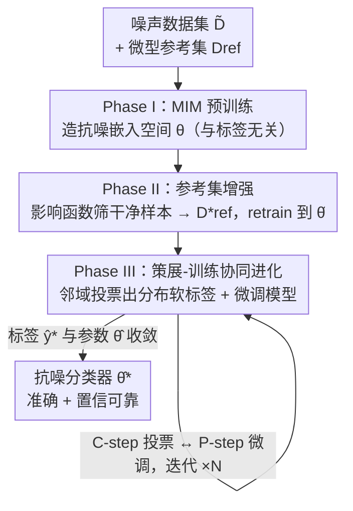

# TrainRef：用标签分布与极少参考样本策展数据，兼顾准确预测与可靠置信

**会议**: ICLR 2026  
**OpenReview**: [https://openreview.net/forum?id=jSs8CDsF0A](https://openreview.net/forum?id=jSs8CDsF0A)  
**领域**: 自监督表示学习 / 噪声标签学习  
**关键词**: 噪声标签学习、置信度校准、数据策展、分布式标签、参考集

## 一句话总结
TrainRef 用一个极小（每类一张就够）的可信参考集 $D_\text{ref}$ 作为"外部正常性"来挑干净样本，并把标签从"非此即彼的类别"改写成"类别分布"，通过 MIM 预训练 → 影响函数筛样本 → 策展-训练协同进化三阶段，在 CIFAR-100/Animal-10N/WebVision 上同时把准确率和置信度校准（ECE）做到新 SOTA。

## 研究背景与动机
**领域现状**：现实分类任务（医疗诊断、自动驾驶、欺诈检测）既要高准确率，也要可靠的置信度——用户需要靠置信度决定"要不要采纳模型决策"。但高质量标注数据昂贵甚至不可得，于是噪声标签学习（LNL）成为刚需。当前主流是伪标签/半监督式的"类别策展"：把一个噪声样本的标签从某个类别改写成另一个类别（DivideMix、DISC、L2B 等）。

**现有痛点**：类别策展有两个结构性缺陷。其一是**正常性污染（normality pollution）**——这些方法的"什么是干净/正常"是从**内部噪声数据集自身**学出来的；当噪声率很高时，噪声样本反而会聚成"假的正常性"，导致挑错、改错。其二是**类别歧义（class ambiguity）**——类别数越多（极端情况如把临床笔记映射到上万个 ICD 码），就越多样本本质上是"介于几类之间"的（一张图可能 70% 像蛇、30% 像虫），强行打成 one-hot 标签会逼模型过度自信，置信度变得不可靠。

**核心矛盾**：准确率和置信度通常被当成两件事分头治：去噪方法（DISC/L2B）靠过滤或硬重标提准确率，却丢掉了"不确定但有信息"的样本，削弱了校准；后处理校准方法（温度缩放、label smoothing、mixup）只调输出概率，修不了在噪声下学歪的置信度排序。二者很难统一。

**本文目标**：用一套机制同时解决"高噪声下挑得准"和"多类别下置信度可靠"两件事。

**切入角度**：作者的关键观察是——**只要有一点点带真值的外部信息（extrinsic reference），哪怕每类只有一张样本，就能挑出更精确的干净样本**，从而绕开"从噪声集自学正常性"的污染；同时把策展目标从"换一个类别"换成"投票出一个类别分布"，天然容纳样本的内在歧义。

**核心 idea**：用"外部极小参考集 + 分布式标签"代替"内部统计 + 类别标签"——靠近完美的嵌入空间里做邻域投票，把每个噪声样本策展成一个软标签分布。

## 方法详解

### 整体框架
给定一个噪声训练集 $\tilde{D}=\{(x,\tilde{y})\}$ 和一个极小的可信参考集 $D_\text{ref}$（每个类别哪怕只有一张真值样本），TrainRef 的目标是：构造一个抗噪的嵌入空间，并把参考集"扩容"成一个有代表性的原型池 $D^*_\text{ref}$，让池中样本能通过**邻域投票**为其余所有样本提供准确监督。整篇方法围绕"模型嵌入空间"与"被策展的数据集"**互相喂养、共同收敛**展开，分三个串行阶段，且第三阶段内部反复迭代。

理论依据来自 Representer Point 定理：若有最优嵌入 $f_{\theta^*}$，任意查询样本的预测都能写成参考样本按相似度加权的线性组合。TrainRef 据此把标签策展定义为按相似度的投票：
$$\hat{y}^*(x_t)=\frac{1}{|D_\text{ref}|}\sum_{(x_\text{ref},y_\text{ref})\in D_\text{ref}} y_\text{ref}\cdot k\big(\hat{f}(x_\text{ref}),\hat{f}(x_t)\big)$$
落地这个式子要克服两个难题：嵌入空间本身会被噪声/过自信标签带歪；以及人工验证的参考样本太少、原型不够多样。三个阶段正是为此设计。

### 关键设计

**1. Phase I：用 MIM 预训练造一个"与标签无关"的抗噪嵌入空间**

类别策展的污染源头在于：嵌入空间是在最小化经验风险（公式 1）时学出来的，而经验风险里塞满了噪声标签，于是噪声会把嵌入空间带歪。TrainRef 的第一招干脆**把标签从这一步剔除**——在噪声集 $\tilde{D}$ 上做掩码图像建模（Masked Image Modelling, MIM）预训练，任务是从相邻图像块重建被遮挡的块。因为这个目标完全不看标签，学到的初始嵌入 $\theta$ 天然对标签噪声免疫，只编码"语义上相似/不相似"。这一步给后续的"按相似度投票"提供了一个干净的几何底座：没有它，相似度本身就被污染了，投票无从谈起。

**2. Phase II：用影响函数把"极小参考集"扩容成多样原型池**

每类只有一张参考样本不足以支撑可靠投票，需要把 $\tilde{D}$ 里真正干净的样本吸纳进来。判断"干净"的标准是：一个样本如果干净，它对预测同类参考样本应当是**对齐或无害**的训练信号；如果是噪声样本，则会和参考样本产生**强烈冲突**的信号。作者用 TraceIn 这一实用影响函数来度量这种一致性——在 MIM 嵌入上接一个在 $D_\text{ref}$ 上微调的分类头 $g_\phi$，计算训练样本梯度与参考样本梯度的余弦对齐：
$$\text{IF}(s_i,s_\text{ref})=\frac{\nabla_\phi L_i^\top \nabla_\phi L_\text{ref}}{\|\nabla_\phi L_i\|\cdot\|\nabla_\phi L_\text{ref}\|}$$
对每个样本 $i$，只和"标签相同的参考样本"求平均影响，并在 $T$ 个训练 checkpoint 上平均以求稳。影响分超过阈值 $\delta_\text{IF}=0.8$ 的样本被收进增强参考集 $D^*_\text{ref}$，再用它把 $\theta,\phi$ 一起更新为更"贴分类任务"的 $\hat{\theta}$。这一招的妙处在于：判定干净与否的"正常性"来自**外部真值参考**，而非内部噪声统计，所以高噪声率下也不会被假正常性带偏——这正是它能压住正常性污染的关键，实验里即便 $|D_\text{ref}|=1$，增强集噪声率仍 <2.3%。

**3. Phase III：策展-训练协同进化，用邻域投票产出分布式软标签**

最后一阶段把"标签策展"和"模型训练"做成一个类 EM 的交替优化，让嵌入与标签互相打磨。**C-step（策展，类 E-step）**：固定当前嵌入 $\hat{f}$，对每个噪声样本在增强参考池里做邻域投票，得到一个**类别分布**而非单一类别：
$$\hat{y}(x)=\frac{1}{Z(x)}\sum_{(x_\text{ref},y_\text{ref})\in D^*_\text{ref}} y_\text{ref}\cdot \mathbb{1}\big(x_\text{ref}\in D^*_\text{vote}(x)\big)\cdot \text{Cosine}\big(f(x),f(x_\text{ref})\big)$$
为了抑制投票噪声，投票池 $D^*_\text{vote}$ 用两个准则筛选：**语义相关**（余弦相似度高于全体分布的 75 分位 $\tau$）和**原型多样**（在相关子集中选出两两嵌入距离平方和最大的 $k$ 个，$k$ 取池子一半，避免一堆近乎重复的参考刷票）。再用 DivideMix 式温度（$t=0.5$）锐化分布、强调高置信预测。**P-step（参数更新，类 M-step）**：拿这些软标签当目标，用交叉熵 + $\ell_2$ 正则微调模型，更好的嵌入又让下一轮相似度更准。两步交替直到标签 $\hat{y}^*$ 与参数 $\hat{\theta}$ 同时收敛。正是"分布式软标签"让模型保留了样本的内在歧义（一张图可以是 50% 海、40% 云），从根上修好了置信度，而不是事后靠温度缩放硬掰。

### 一个例子：一张被标错的"海"
CIFAR-100 在 40% 实例相关噪声下，一张本属"sea"的图被错标成"plain"。TrainRef 在 Phase III 投票时，从增强参考池里召回若干语义相近、彼此又多样的参考样本（既有海也有云、平原），按相似度投出一个分布：主要落在"sea"，但也分给"cloud"一定权重，反映这张图本身海天难分的歧义。最终它不是被简单改成"sea"的 one-hot，而是得到一个软标签——既纠正了"plain"的错误，又如实表达了不确定性，从而预测置信度与人的直觉对齐。

### 损失函数 / 训练策略
P-step 优化目标为带 $\ell_2$ 正则的交叉熵（软标签为目标）：
$$\hat{\theta}=\arg\min_{\theta,\phi}\frac{1}{|\hat{D}|}\sum_{i=1}^{|\hat{D}|}\Big[L_\text{CE}\big(g_\phi\circ f_\theta(x_i),\hat{y}^*_i\big)+\lambda\|\theta\|_2^2\Big]$$
关键超参：影响分阈值 $\delta_\text{IF}=0.8$、投票相似度阈值 $\tau$ 取 75 分位、锐化温度 $t=0.5$、实际用 $|D_\text{ref}|=5$ 平衡可得性与性能。作者称在项目网站提供了协同进化的收敛性理论证明。

## 实验关键数据

### 主实验
CIFAR-100 合成噪声下，TrainRef 全面超越去噪 SOTA，噪声越重优势越大（Sym80 比 L2B-C2D 高 8 个多点）：

| 噪声类型 | CE | DISC | L2B-C2D | TrainRef |
|----------|------|------|---------|----------|
| Sym 20% | 55.17 | 78.75 | 79.67 | **85.44** |
| Sym 50% | 32.40 | 75.21 | 78.23 | **82.07** |
| Sym 80% | 7.70 | 57.61 | 69.66 | **77.85** |
| Asym 40% | 40.63 | 76.50 | 78.22 | **79.67** |
| Inst 40% | 43.17 | 78.44 | 79.43 | **82.33** |

真实世界噪声数据同样领先：WebVision Top-1 从 LSL 的 81.40 提到 **82.28**（IN1k 预训练 84.10）；Animal-10N 从 LSL 的 89.1 提到 **90.90**（IN1k 预训练 93.72）。

校准方面（CIFAR-100，ECE 越低越好），TrainRef 在准确率-校准的 trade-off 上最优，且叠加温度缩放后 ECE 远低于去噪基线：

| 方法 | Sym80 Test Acc | Sym80 ECE |
|------|----------------|-----------|
| DISC+TS | 57.61 | 0.061 |
| L2B+TS | 69.66 | 0.057 |
| TrainRef | 77.85 | 0.082 |
| **TrainRef+TS** | **77.85** | **0.011** |

### 消融实验

| 配置 | 关键指标 | 说明 |
|------|---------|------|
| 完整模型 | Sym80 Acc 77.85 / ECE+TS 0.011 | 三阶段全开 |
| $|D_\text{ref}|=1$（每类1张） | 增强集噪声率 2.30% / Acc 77.85 | 极少监督也几乎不掉点 |
| $|D_\text{ref}|=100$ | 增强集噪声率 1.57% / Acc 77.91 | 加大参考集收益甚微 |
| 硬标签（hard relabel） | ECE 0.065 / Acc 81.77 | 准确率相近但校准变差 |
| 软标签 + 重标 | ECE 0.046 / Acc 82.33 | 软标签是校准提升主因 |

用户研究（5 名专家盲选更可信的置信度）：噪声越高越偏好 TrainRef——20% 噪声 62% 选 TrainRef，80% 噪声达 **78%**。

### 关键发现
- **外部参考集是抗污染的根**：即便每类只给 1 张参考样本，影响函数筛出的增强集噪声率仍 <2.3%，且测试准确率几乎不变——验证了"外部正常性"比"内部统计"在高噪声下更可靠。
- **分布式软标签主要贡献在校准而非准确率**：把软标签换成 one-hot，准确率几乎不动（81.77 vs 82.33），但 ECE 明显变差，说明软标签的价值在于保留歧义、修正置信度。
- **去噪与校准被统一**：后处理校准（TS）只调概率改不了排序，去噪方法丢掉不确定样本伤校准；TrainRef 用软标签 + 极小参考集把两者一次性做好。

## 亮点与洞察
- **"外部极小参考"这个支点很巧**：传统 LNL 在噪声集内部自学正常性，高噪声时自我污染；TrainRef 只用每类一张真值样本 + 影响函数，就把"什么是干净"的判定移到了外部，从机制上躲开污染——这是可迁移到任何弱监督/伪标签管线的思路。
- **标签从"类别"升维到"分布"**：直面"很多样本本就介于几类之间"这一被长期忽略的现实，用邻域投票天然产出软标签，把校准从"事后补救"变成"训练内生"。
- **协同进化 = EM 的优雅复用**：C-step 投票（E-step 责任分配）↔ P-step 微调（M-step 参数重估），嵌入与标签互相提纯，给了一个清晰的收敛叙事。
- **MIM 当抗噪底座**：用与标签无关的自监督任务先把嵌入空间洗干净，再谈相似度投票——这个"先解耦标签、再做策展"的顺序值得借鉴。

## 局限与展望
- 方法目前完全围绕图像分类（CIFAR/Animal/WebVision）与 MIM 视觉预训练展开，标题虽提"accurate prediction & reliable confidence"，但未在 LLM/文本等模态上验证；作者展望未来推广到生成模型。
- 三阶段 + Phase III 多轮 EM 迭代带来明显额外训练开销（计算成本分析在附录 B），相比单纯过滤/温度缩放更重。
- 极小参考集仍需"带真值"的人工验证样本——在完全无可信标签的场景下不适用；参考集若本身有偏，影响函数筛选可能继承该偏差。
- 收敛性证明、骨干公平性、Phase III 迭代轮数等关键细节放在网站/附录，正文未充分展开，复现需依赖外部材料。

## 相关工作与启发
- **vs DISC / L2B（类别去噪 SOTA）**：它们从内部噪声集学正常性并做硬重标，高噪声下易被假正常性带偏、丢弃不确定样本伤校准；TrainRef 用外部参考集 + 分布软标签同时修准确率和校准，Sym80 上准确率高 8~20 点、ECE 低数倍。
- **vs 后处理校准（TS / PTS / MnM）**：这些只重缩放 logits，改不了在噪声下学歪的置信度排序，准确率不变；TrainRef 在训练时就用软标签内生地校准。
- **vs Meta-learning LNL（用干净参考做引导）**：同样借助干净参考，但元学习靠双层优化、开销大；TrainRef 用影响函数 + 邻域投票避开双层优化，参考集小到每类一张仍有效。

## 评分
- 新颖性: ⭐⭐⭐⭐⭐ "外部极小参考 + 分布式软标签"统一去噪与校准，切入点新颖且有理论依据
- 实验充分度: ⭐⭐⭐⭐ 合成/真实噪声、校准、用户研究、消融齐全，但局限于视觉分类，部分证明放附录
- 写作质量: ⭐⭐⭐⭐ 动机与三阶段逻辑清晰，EM 类比到位；部分关键细节外置网站
- 价值: ⭐⭐⭐⭐ 高噪声场景下准确率与可靠置信度兼得，对需人机协作的实用分类很有价值

<!-- RELATED:START -->

## 相关论文

- [\[ICLR 2026\] Equivariant Splitting: Self-supervised learning from incomplete data](equivariant_splitting_self-supervised_learning_from_incomplete_data.md)
- [\[ICLR 2026\] PredNext: Explicit Cross-View Temporal Prediction for Unsupervised Learning in Spiking Neural Networks](prednext_explicit_cross-view_temporal_prediction_for_unsupervised_learning_in_sp.md)
- [\[ICLR 2026\] Multimodality as Supervision: Self-Supervised Specialization to the Test Environment via Multimodality](multimodality_as_supervision_self-supervised_specialization_to_the_test_environm.md)
- [\[ICLR 2026\] Soft Equivariance Regularization for Invariant Self-Supervised Learning](soft_equivariance_regularization_for_invariant_self-supervised_learning.md)
- [\[ICLR 2026\] One-Shot Exemplars for Class Grounding in Self-Supervised Learning](one-shot_exemplars_for_class_grounding_in_self-supervised_learning.md)

<!-- RELATED:END -->
