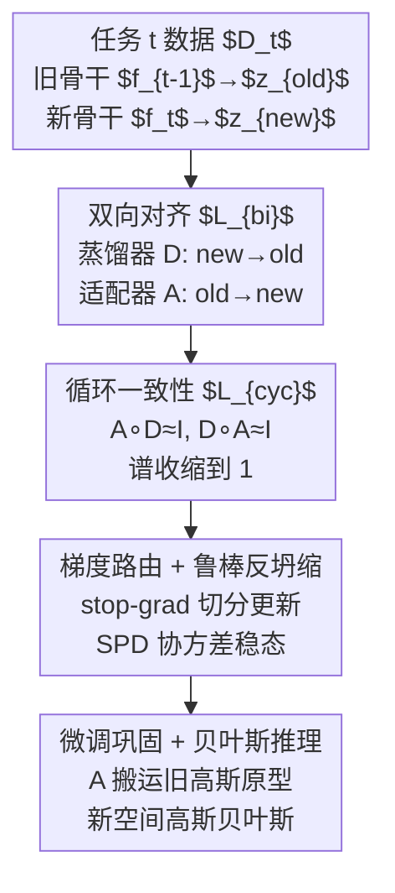

# Two-Way is Better Than One: Bidirectional Alignment with Cycle Consistency for Exemplar-Free Class-Incremental Learning

**会议**: ICLR 2026  
**OpenReview**: [https://openreview.net/forum?id=7UfZAxKo5K](https://openreview.net/forum?id=7UfZAxKo5K)  
**代码**: https://github.com/HXuSz11/BiCyc_ICLR2026  
**领域**: 持续学习 / 表示学习  
**关键词**: 免样本类增量学习, 原型漂移补偿, 双向对齐, 循环一致性, 高斯贝叶斯分类

## 一句话总结
针对免样本类增量学习中"骨干网络更新导致旧类原型漂移"的难题，本文提出 BiCyc：在训练阶段同时学习「旧→新」适配器 $A$ 和「新→旧」蒸馏器 $D$，用停梯度门控和循环一致性损失把二者逼成互逆映射，从而把旧类高斯原型精确搬运到新特征空间；在 CIFAR-100 / TinyImageNet 等 from-scratch 基准上把遗忘率压到最低、准确率超过 AdaGauss 与 DPCR 等 SOTA。

## 研究背景与动机

**领域现状**：持续学习（CL）希望模型从任务流中不断学新类而不忘旧类。在**免样本类增量学习（EFCIL）**这一更苛刻的设定里，出于隐私/内存约束**禁止保存任何旧任务原始样本**，于是主流做法是只缓存每个旧类的紧凑统计量——**原型**（类均值，乃至协方差），推理时用最近原型或高斯贝叶斯打分，做到严格零样本回放又只需很小算力。

**现有痛点**：原型方案的命门是**表示漂移（representation drift）**——当骨干 $f_{t-1}\to f_t$ 为拟合新类而更新时，整个嵌入空间的几何会平移旋转，先前用 $f_{t-1}$ 算出的旧原型 $\mu_c^{t-1}$ 在新空间里"过期"了，决策因此偏向最近学的类。补救主流是"**漂移补偿**"：训练完新任务后，事后再学一个适配器 $A$ 把旧原型搬到新空间。

**核心矛盾**：作者指出现有的**单向、两阶段**范式有系统性偏差。两阶段流程是：阶段 I 先在新任务上训练（常配蒸馏正则把 $f_t$ 往老师 $f_{t-1}$ 拉），阶段 II 再冻结骨干、事后学一个 old→new 适配器。问题在于——蒸馏正则（把新特征往旧空间拉）与适配器搬运（把旧原型往新空间推）**方向相反却各干各的**；适配器是"事后"拟合的，跨空间残留不一致；更糟的是这种不一致会**逐任务累积成循环误差**（一个特征经 old→new→old 绕一圈回不到原点）。

**本文目标**：把"蒸馏方向"与"适配方向"这对天然的对偶关系**在训练时就显式建模**，让搬运（transport）和表示（representation）**协同演化**，而不是表示先定死、搬运再补。

**切入角度**：作者观察到——既然 $D:z_{new}\to z_{old}$ 和 $A:z_{old}\to z_{new}$ 功能上互为反方向，那它们理应互为逆映射。于是在阶段 I 就同时学这两张图，并用**循环一致性**约束 $A\circ D\approx I$、$D\circ A\approx I$，把搬运变成近似双射。

**核心 idea**：用"双向对齐 + 循环一致性 + 停梯度门控"把单向事后适配器，升级成与主任务一起训练的近单阶段、几何保持的双向搬运。

## 方法详解

### 整体框架
BiCyc 在任务 $t$ 的一次训练里同时优化三样东西：当前骨干 $f_t$、适配器 $A$（old→new）、蒸馏器 $D$（new→old）。对每个输入 $x$，冻结的旧骨干给出 $z_{old}=f_{t-1}(x)$，当前骨干给出 $z_{new}=f_t(x)$。在标准交叉熵分类之外，叠加一个双向对齐损失 $L_{bi}$ 和一个循环一致性损失 $L_{cyc}$，并辅以一个鲁棒反坍缩损失稳住协方差。训练的精妙之处全在**梯度路由**：哪些项更新 $f_t$、哪些项只更新 $A$、哪些项只稳住 $(A,D)$，靠 `stop-gradient` 算子精确切分，防止 $A$ 把骨干往回拽、防止 $A/D$ 互相对抗。阶段 I 结束后冻结所有骨干和 $D$，只对 $A$ 做一段低学习率微调"巩固"。推理时把旧类高斯原型 $(\mu_c^{t-1},\Sigma_c^{t-1})$ 用 $A$ 前向搬到新空间，连同新类当场估计的统计量，一起在新空间里用高斯贝叶斯打分。

### 关键设计

**1. 双向对齐：让蒸馏与适配在训练中互为逆向，而非事后拼接**

这一设计直击"蒸馏把新特征往旧空间拉、适配器把旧原型往新空间推、两者方向相反却各自为政"的痛点。BiCyc 把这两条路在阶段 I 就一起训：

$$L_{bi} = \|D(z_{new}) - z_{old}\|_2^2 + \|A(z_{old}) - \text{stopgrad}(z_{new})\|_2^2$$

第一项是**特征级蒸馏（new→old）**，它**同时更新 $f_t$ 和 $D$**——逼着新骨干保留可被 $D$ 投回旧空间的"向后兼容性"。第二项学**前向适配 $A$（old→new）**，但目标 $z_{new}$ 被 `stopgrad` 截断，所以**只更新 $A$**，让 $A$ 去追逐不断演化的新空间，而**不会把 $f_t$ 往回拖、不损伤可塑性**。从线性-高斯视角看，最小化 $L_{bi}$ 直接压低两个搬运误差 $\varepsilon_{old\to new}=\mathbb{E}\|A(z_{old})-z_{new}\|^2$ 与 $\varepsilon_{new\to old}=\mathbb{E}\|D(z_{new})-z_{old}\|^2$，而这两者恰好界定了搬运后原型均值/协方差的失配上界——误差小，原型就搬得准。这与旧的两阶段做法本质区别在于：搬运不再是"训练定死后事后补"，而是和表示同步成形。

**2. 循环一致性：把搬运算子逼成近双射，防止秩坍缩**

光有 $L_{bi}$ 还不够——它能让两个方向各自对齐，却阻止不了退化（比如在弱相关方向上掉秩，把信息压没）。于是加一条循环损失，把 $A,D$ 的复合往恒等映射上推：

$$L_{cyc} = \|A(D(z_{new})) - \text{stopgrad}(z_{new})\|_2^2 + \|D(A(z_{old})) - \text{stopgrad}(z_{old})\|_2^2$$

目标同样 `stopgrad`，所以 $L_{cyc}$ 只稳住 $(A,D)$、不拽骨干。它的理论作用很漂亮：在白化空间里（$\tilde z_{old}=\Sigma_{old}^{-1/2}z_{old}$，$\tilde z_{new}=\Sigma_{new}^{-1/2}z_{new}$），令 $M=\tilde A\tilde D-I$，论文证明期望循环误差恰等于 $\|M\|_F^2$（定理 1），由 Mirsky/Hoffman–Wielandt 不等式得 $\max_k|\sigma_k(\tilde A\tilde D)-1|\le\|M\|_F$。也就是说，**最小化 $L_{cyc}$ 会把复合搬运 $\tilde A\tilde D$ 的奇异谱收缩到 1 附近**，从而压制秩/能量损失、促成近等距（near-isometric）的几何保持。推论 2 进一步把均值/协方差搬运误差与分类对数几率（log-odds）的扰动联系起来：只要 $C_\mu(\delta_i+\delta_j)+C_\Sigma\|\hat\Sigma^t-\Sigma^t\|_2 < m_{ij}(x)$（贝叶斯间隔），搬运后 $i,j$ 两类的决策就不变——这正是"为什么搬得准就少遗忘"的理论解释。$L_{bi}$ 管对齐（降误差），$L_{cyc}$ 管算子（保几何），合在一起得到忠实的原型搬运。两者加权为 $\text{Bicyc}(z_{old},z_{new})=\lambda_{bi}L_{bi}+\lambda_{cyc}L_{cyc}$。

**3. 梯度路由与鲁棒反坍缩：用停梯度切断对抗，用 SPD 修复保住协方差**

这一设计解决两个工程级却致命的隐患。其一是**梯度对抗**：作者明确指出，如果允许适配器 $A$ 的梯度回流进 $f_t$，那么 $A$ 与 $D$ 会变成对抗关系，严重削弱 $D$ 的正则作用、造成性能骤降——所以 $L_{bi}$ 第二项和整个 $L_{cyc}$ 的目标都必须 `stopgrad`。最终阶段 I 总损失为

$$L_{total} = L_{CE}(\ell_{new},y) + \text{Bicyc}(z_{old},z_{new}) + \alpha\,L_{ac}^{rob}$$

梯度被精确路由：$L_{CE}$ 和 $L_{bi}$ 第一项更新 $f_t$（和 $D$）；$L_{bi}$ 第二项只更新 $A$；$L_{cyc}$ 只稳 $(A,D)$。其二是**协方差坍缩**：BiCyc 沿用 AdaGauss 的反坍缩思路，但原始 anti-collapse 损失要对 mini-batch 协方差做 Cholesky 分解，而小批量下 $\Sigma$ 常非 SPD 或秩亏，导致分解失败甚至数值爆炸。作者用对称化 + 收缩正则修复：$\hat\Sigma=\tfrac12(\Sigma+\Sigma^\top)+\tfrac{\lambda\,\text{tr}(\tilde\Sigma)}{S}I+\varepsilon I$（极小批量时退化为对角近似），再在其上算鲁棒损失 $L_{ac}^{rob}=-\tfrac1S\sum_i\min(\text{chol}(\hat\Sigma)_{ii},\beta)$，保证 SPD 与数值稳定。

**4. 近单阶段流程：适配器微调巩固 + 新空间高斯贝叶斯推理**

把适配器学习"塌"进主训练阶段后，并非完全抛弃两阶段——作者保留一段轻量的"巩固"收尾：阶段 I 结束后冻结 $f_{t-1},f_t,D$，只对 $A$ 用低学习率（30 epoch）微调，把旧原型进一步贴合新特征几何。消融显示，循环一致训练出的 $A$ 已是很强的"零样本"投影，直接用就能搬原型；而这段微调能再涨一点（CIFAR-100 T=20 下 $A_{last}$ +2.6、$F_{last}$ −1.0），且任务序列越长收益越明显。推理统一在 $f_t$ 的新空间进行：旧类用 $\hat\mu_c^t=A\mu_c^{t-1}$、$\hat\Sigma_c^t=A\Sigma_c^{t-1}A^\top$ 搬运的高斯，新类用当场估计的高斯，一起喂给高斯贝叶斯分类器。

### 损失函数 / 训练策略
- **从头训练设定**：ResNet-18，batch 256，SGD 200 epoch，初始 lr=0.1、weight decay $5\times10^{-4}$，在 {60,120,180} epoch 衰减 ×10（CIFAR-100 / TinyImageNet / ImageNet-100）。
- **预训练设定（CUB-200）**：从 ImageNet 预训练初始化，骨干 lr=0.01、头部 lr=0.1。
- **适配器/蒸馏器**：lr=0.05、weight decay $1\times10^{-4}$；主实验取 $\lambda_{bi}=5$、$\lambda_{cyc}=1$。
- **巩固微调**：仅 $A$，30 epoch，SGD lr=0.01、weight decay $5\times10^{-4}$。
- 其余超参（原型存储/采样）完全沿用 AdaGauss。

## 实验关键数据

### 主实验
四个标准 EFCIL 基准，5 次运行均值±标准差。$A_{last}$ 为末任务平均准确率，$A_{inc}$ 为增量平均准确率。

| 数据集 / 设定 | 指标 | BiCyc | 次优 | 提升 |
|--------------|------|-------|------|------|
| CIFAR-100 T=10 | $A_{last}$ | **50.6** | DPCR 50.2 | +0.4 |
| CIFAR-100 T=20 | $A_{last}$ | **41.5** | AdaGauss 37.9 | +3.6（vs AdaGauss） |
| TinyImageNet T=10 | $A_{inc}$ | **49.1** | EFC 47.9 | +1.2 |
| TinyImageNet T=20 | $A_{last}$ | **30.2** | EFC 28.4 | +1.8 |
| ImageNet-100 T=20 | $A_{last}$ | **43.8** | AdaGauss 42.6 | +1.2 |
| CUB-200 T=10（预训练） | $A_{last}$ | **53.7** | AdaGauss 52.9 | +0.8 |

遗忘率 $F_{last}$（越低越好）是 BiCyc 最大亮点：

| 数据集 | 设定 | BiCyc | AdaGauss | 降幅 |
|--------|------|-------|----------|------|
| CIFAR-100 | T=10 | **13.5** | 16.7 | −3.2 |
| CIFAR-100 | T=20 | **16.6** | 21.0 | −4.4 |
| TinyImageNet | T=10 | **12.0** | 18.7 | −6.7 |
| ImageNet-100 | T=10 | **18.2** | 20.6 | −2.4 |

在三个 from-scratch 数据集上 BiCyc 遗忘率全部最低；CUB-200（预训练）因骨干 lr 很低、跨任务漂移本就小，各法差距被压缩，BiCyc 不再领先。

### 消融实验

$L_{bi}$ 与 $L_{cyc}$ 的贡献（CIFAR-100，起点为 AdaGauss 基线）：

| $L_{bi}$ | $L_{cyc}$ | T=10 $A_{last}$ | T=20 $A_{last}$ | 说明 |
|:---:|:---:|:---:|:---:|------|
| ✗ | ✗ | 46.8 | 37.9 | AdaGauss 基线 |
| ✓ | ✗ | 49.4 | 40.2 | 只对齐，已大涨 |
| ✗ | ✓ | 47.8 | 39.0 | 只循环约束 |
| ✓ | ✓ | **50.6** | **41.5** | 两者叠加最好 |

适配器/蒸馏器架构（CIFAR-100，MLP 为绝对值，其余为相对 MLP 的 $\Delta$）：

| 架构 | T=10 $A_{last}$ | T=10 $F_{last}$ | 说明 |
|------|:---:|:---:|------|
| MLP | 50.6 | 13.5 | 最佳综合 |
| Linear | −3.5 | +1.2 | 线性表达力不足 |
| CrossAttention | −2.7 | −0.7 | 偏稳定、掉准确率 |
| MoE | −3.7 | −3.6 | 遗忘最低、准确率折损大 |

### 关键发现
- **两个损失互补且都有用**：单独开 $L_{bi}$ 或 $L_{cyc}$ 都比基线涨，叠加才最好——印证了"$L_{bi}$ 降搬运误差、$L_{cyc}$ 保几何"的分工。诊断图进一步显示 BiCyc 的 $A\circ D$ 奇异谱更集中于 1、搬运高斯与真值的对称 KL 更小。
- **增益集中在早期任务**：CIFAR-100 T=10 的逐任务增益热图显示，相对 EFC 在中后期常超 +15~20 pp、相对 AdaGauss 持续 +5~10 pp，且**正增益密集落在老任务上**——直接证据表明 BiCyc 是靠"少遗忘"而非"硬学新类"取胜。
- **多层适配器优于线性**：线性映射不足以追踪漂移；MLP 综合最佳；CrossAttention/MoE 能换取更低遗忘但牺牲准确率，说明架构是稳定-可塑权衡的一个旋钮。
- **微调巩固随序列变长更值**：任务越多、累积漂移越大，那段轻量 $A$ 微调的收益越显著。

## 亮点与洞察
- **"对偶关系显式化"的视角很巧**：现有两阶段法里，蒸馏和适配器本就是方向相反的一对，作者把这层隐含对偶提到训练前台、用循环一致性强制成互逆，是一种"把已有结构讲透并用足"的洞察，而非堆模块。
- **理论与现象对得上**：定理 1 把循环损失等价成 $\|\tilde A\tilde D-I\|_F^2$ 并证明谱收缩到 1，推论 2 把搬运误差接到贝叶斯决策稳定性——这条"循环损失↓ → 谱→1 → log-odds 扰动↓ → 少遗忘"的链条，被奇异谱分布图和遗忘率实测同时验证。
- **停梯度路由是隐形的胜负手**：作者直言放开 $A$ 的梯度回流会让 $A,D$ 对抗、性能骤降。这个"谁更新谁、谁被 detach"的精细路由，是很多协同训练方案最容易踩坑也最值得复用的工程经验。
- **可迁移性**：双向 + 循环一致性这套搬运正则，原理上可移植到任何"需要把旧空间统计量搬到演化中新空间"的场景（如增量检索、域增量、特征库随模型更新而老化的检索系统）。

## 局限与展望
- **预训练 fine-grained 设定收益有限**：CUB-200 从预训练初始化、骨干 lr 极低、跨任务漂移本就小，BiCyc 在 T=20 上甚至略逊 AdaGauss/EFC——方法的优势高度依赖"有可观漂移可补"的 from-scratch 场景。
- **额外两张映射 + 巩固微调**带来训练开销（虽然作者称适配器开销很小、在 4.7 节量化），且引入 $\lambda_{bi},\lambda_{cyc},\alpha,\beta$ 等多个权重需调。
- **理论假设较强**：定理 1/推论 2 建立在中心化特征、协方差在数据支撑上满秩、线性 $A$ 等假设之上，非线性 MLP 适配器与实际 mini-batch 估计下的紧致度仍是经验性的。
- **改进方向**：可探索把 $L_{cyc}$ 的谱约束直接做成显式正则、或让 $\lambda$ 随漂移幅度自适应，以在预训练小漂移场景也保住增益。

## 相关工作与启发
- **vs AdaGauss（NeurIPS24）**：AdaGauss 同走可学投影器路线、搬运完整高斯统计量做贝叶斯推理，但其蒸馏器与适配器是结构相同却**单向反用**、且仍是事后两阶段。BiCyc 直接把这对图在阶段 I 共训并加循环一致性，从"事后拼"变"同步生"，遗忘率全面更低；本文还修了 AdaGauss 反坍缩损失的 Cholesky 数值坑。
- **vs SDC / ADC / LDC / EFC**：这些都是**单向、事后**的原型漂移补偿——SDC 投影更新均值、ADC 对抗式估漂移、LDC 用可学漂移模块、EFC 做亲和加权类级位移。它们的共性短板是跨空间残留不一致、循环误差逐任务累积，正是 BiCyc 用双向循环一致性要解决的。
- **vs FeTrIL / FeCAM / PASS**：这条线靠冻结骨干 + 重塑几何/度量（FeCAM 用马氏距离、FeTrIL 平移合成伪特征、PASS 原型增广+自监督）稳住表示，代价是牺牲可塑性、几乎不做跨空间搬运；BiCyc 反其道保留骨干可塑性并把搬运做准。

## 评分
- 新颖性: ⭐⭐⭐⭐ 把蒸馏-适配的隐含对偶显式化为双向循环一致性，角度新且有理论支撑，但建立在原型漂移补偿这条成熟线上。
- 实验充分度: ⭐⭐⭐⭐ 四数据集多 split、遗忘/准确率/逐任务热图/谱分布全覆盖，消融到位；预训练设定优势不明显也如实报告。
- 写作质量: ⭐⭐⭐⭐ 动机—方法—理论—现象的因果链讲得清楚，定理与实测互相印证。
- 价值: ⭐⭐⭐⭐ from-scratch EFCIL 上把遗忘率压到 SOTA，停梯度路由与近双射搬运的经验可迁移到更广的"统计量随模型演化老化"问题。

<!-- RELATED:START -->

## 相关论文

- [\[CVPR 2026\] Exemplar-Free Class Incremental Learning via Preserving Class-Discriminative Structure](../../CVPR2026/self_supervised/exemplar-free_class_incremental_learning_via_preserving_class-discriminative_str.md)
- [\[ICLR 2026\] One-Shot Exemplars for Class Grounding in Self-Supervised Learning](one-shot_exemplars_for_class_grounding_in_self-supervised_learning.md)
- [\[ACL 2025\] AnalyticKWS: Towards Exemplar-Free Analytic Class Incremental Learning for Small-footprint Keyword Spotting](../../ACL2025/self_supervised/analytickws_towards_exemplar-free_analytic_class_incremental_learning_for_small-.md)
- [\[CVPR 2026\] Beyond Myopic Alignment: Lookahead Optimization for Online Class-Incremental Learning](../../CVPR2026/self_supervised/beyond_myopic_alignment_lookahead_optimization_for_online_class-incremental_lear.md)
- [\[ICLR 2026\] Bidirectional Predictive Coding](bidirectional_predictive_coding.md)

<!-- RELATED:END -->
