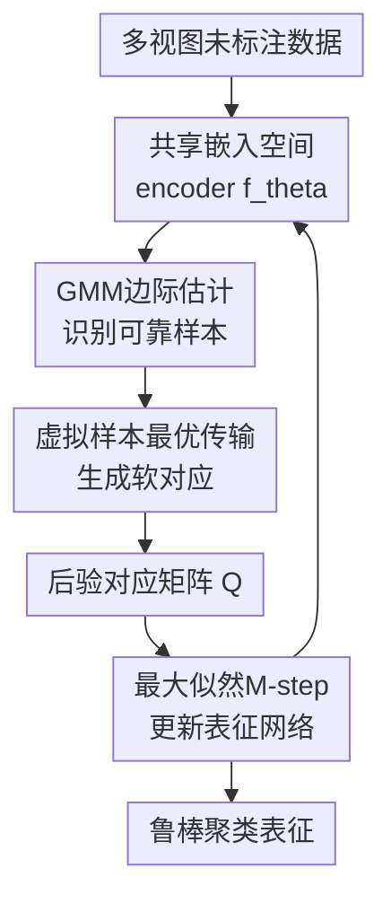

# Uncover Underlying Correspondence for Robust Multi-view Clustering

**会议**: ICLR 2026  
**OpenReview**: [https://openreview.net/forum?id=a4S1nQay3b](https://openreview.net/forum?id=a4S1nQay3b)  
**代码**: https://github.com/XLearning-SCU/2026-ICLR-CorreGen  
**领域**: 自监督 / 表示学习  
**关键词**: 多视图聚类、噪声对应、EM算法、最优传输、鲁棒表征学习  

## 一句话总结

这篇论文把带噪多视图聚类中的跨视图对应关系看作隐藏变量，提出 CorreGen 用 EM 框架在嵌入空间里生成软对应分布，并通过 GMM 边际估计与虚拟样本机制同时处理同类样本被误当负例、错配样本和无法对齐样本，从而显著提升噪声对应场景下的聚类鲁棒性。

## 研究背景与动机

**领域现状**：多视图聚类希望把同一对象的不同视角或模态，比如图像与文本、不同图像特征或多传感器观测，映射到一个共享表征空间，再用 K-means 等聚类算法得到语义簇。近年的主流路线是对比式多视图聚类：把数据集中原本配对的跨视图样本当作正样本，把不同实例的跨视图组合当作负样本，通过拉近正对、推远负对来学习共享表示。

**现有痛点**：这个假设在干净、人工整理的数据集上还能工作，但在真实网络数据里很脆弱。网页爬取来的图像-文本、菜谱-图片或多模态样本经常有错配：一张苹果派图片可能配到无关网页文本，某段文本可能包含广告、链接或其他菜名，甚至完全没有对应的有效图像。更麻烦的是，聚类关心的是类别语义，而不是实例身份；同属于同一类别的不同样本，本来应该互相支持，却会被标准对比学习当作负样本推开。

**核心矛盾**：传统 contrastive MVC 把“给定配对是否正确”当成训练入口，但噪声对应问题恰恰说明这些给定配对不可靠。pairwise reweighting 只是降低疑似噪声配对权重，pairwise realignment 只是为每个样本找一个更像的 counterpart，它们仍然围绕单一配对做修补，难以表达“同一类别里存在多对多语义对应”，也难以识别根本没有有效 counterpart 的 unalignable 样本。

**本文目标**：作者把问题拆成两个层次：第一，category-level mismatch，即同类跨视图样本被错误地当作负例；第二，sample-level mismatch，包括可重新对齐的错配样本，以及被污染、低质量、没有有效 counterpart 的样本。目标不是清洗出一个硬的一一配对表，而是在训练过程中估计一个跨视图软对应分布，让模型知道哪些样本应共享语义概率质量，哪些样本应该被降权或吸收到噪声质量里。

**切入角度**：论文的关键观察是，多视图聚类真正需要恢复的是潜在语义对应，而不是原始数据采集时的配对索引。于是作者从判别式对比目标转向生成式最大似然：把另一视图中的可能 counterpart 当作 latent variable，对所有可能跨视图组合求和，让模型通过最大化观测数据的边际似然来自动给语义一致的组合分配更高概率。

**核心 idea**：用“对应关系生成”替代“给定配对纠错”，把跨视图对应建模为 EM 中的后验软分布，在 E-step 估计语义对应与噪声边际，在 M-step 用这些软对应训练嵌入网络。

## 方法详解

### 整体框架

CorreGen 的输入是一批多视图未标注样本，每个样本在不同视图下经过同一个或同结构 encoder $f_\theta$ 得到嵌入 $z_i^{(v)}$。它不直接相信原始索引配对，而是在每个 EM 迭代中先基于当前嵌入估计跨视图联合分布 $P^*$ 和后验对应矩阵 $Q$，再用 $Q$ 作为软监督去更新 encoder，使下一轮嵌入空间更容易暴露真实类别结构。

整体流程可以理解为一个闭环：warmup 阶段先用近似 identity 的后验避免早期 embedding 太乱；之后 E-step 用 GMM 估计每个样本的边际可信度，并通过带虚拟样本的最优传输得到多对多跨视图耦合；M-step 把这个耦合归一化成后验分布，最大化加权 joint likelihood。多轮交替后，后验矩阵会从接近原始配对逐步变成更接近类别块状结构的语义对应。

从概率建模看，论文先写出单视图边际最大似然 $\sum_i \log p(x_i^{(v)};\theta)$，再把多视图之间未知 counterpart 展开成 $\sum_i \log \sum_j p(x_i^{(v_1)},x_j^{(v_2)};\theta)$。这里的 $j$ 不是已知标签，而是潜变量：同一视图样本 $x_i^{(v_1)}$ 可能和另一视图里多个同类样本有语义对应，也可能因为自身是噪声而几乎不该对应任何真实样本。

直接优化 log-sum 很难，所以作者引入辅助分布 $Q(x_j^{(v_2)})$ 并用 Jensen 不等式得到 EM 下界。E-step 令 $Q$ 贴近当前参数下的后验 $p(x_j^{(v_2)};x_i^{(v_1)},\theta^{(t)})$，M-step 固定这个后验并更新 $\theta$。这使“找对应”和“学表示”互相促进，而不是像传统方法那样在训练前就把正负样本关系固定死。

### 关键设计

**1. 生成式对应建模：把噪声配对问题改写成潜在对应的最大似然估计**

传统对比学习默认 $x_i^{(v_1)}$ 和 $x_i^{(v_2)}$ 是唯一正对，$x_i^{(v_1)}$ 和 $x_j^{(v_2)}(j\ne i)$ 都是负对；在聚类任务里，这个定义天然会制造 category-level mismatch，因为同类不同实例被迫分离。CorreGen 反过来写目标：对样本 $x_i^{(v_1)}$，另一视图中的所有 $x_j^{(v_2)}$ 都是候选 counterpart，优化目标是

$$
\theta^*=\arg\max_\theta \sum_i \log \sum_j p(x_i^{(v_1)},x_j^{(v_2)};\theta).
$$

这个式子的含义很直接：模型不再问“原始配对是不是正样本”，而是问“在当前表征下，哪些跨视图组合共同解释观测数据的概率更大”。如果两个样本来自同一语义类别，即使它们不是同一个实例，也可以在联合分布里获得概率质量；如果一个样本是乱码文本、腐蚀图像或无效观测，它不应该强行和某个真实样本组成正对。这个建模把同类多对多对应和无效样本排除都纳入同一个概率框架。

**2. GMM边际估计：用簇内可信度决定每个样本能分到多少对应质量**

仅有跨视图相似度还不够，因为最优传输需要边际约束：每个样本在对应矩阵里到底应该贡献多少概率质量。若所有样本边际都均匀，噪声样本仍然会被迫和别人分配质量；若只看原始配对，类别大小与簇结构又会被忽略。CorreGen 在每个视图的嵌入空间里拟合 GMM，把样本到所属 Gaussian 簇中心的 Mahalanobis 距离转成可信度 $d_i$，再经由曲线函数得到边际概率：

$$
p(x_i^{(v)};\theta^{(t)})=\frac{m^{d_i}-1}{m-1}\cdot \frac{N_c}{N},\quad
d_i=\exp\left(-\epsilon\sqrt{(z_i^{(v)}-\mu_c)^\top\Sigma_c^{-1}(z_i^{(v)}-\mu_c)}\right).
$$

这一步的直觉是：落在大而紧密的语义簇中心附近的样本更可能有多个有效同类 counterpart，应当拥有更高边际质量；远离簇中心的样本更像错配、离群或低质量观测，只给较少质量。这里的 $N_c/N$ 让类别规模进入约束，$\frac{m^{d_i}-1}{m-1}$ 则放大高置信和低置信样本之间的差别，但不是硬阈值删除，因此训练过程中仍有平滑可恢复的空间。

**3. 虚拟样本最优传输：让无法对齐的样本有地方“消失”**

标准 OT 会把两个视图的概率质量全部匹配起来，这对普通分布对齐合理，但对 noisy correspondence 不合理：如果某条文本是网页噪声，或者某个图像被随机高斯噪声腐蚀，它根本没有真实 counterpart，强制匹配只会把错误信号注入训练。CorreGen 为每个视图添加一个 virtual sample，并给它分配噪声质量 $\rho$，使增强后的联合矩阵 $\tilde P\in\mathbb{R}_+^{(N+1)\times(N+1)}$ 满足

$$
\tilde P\mathbf{1}_{N+1}=[p^{(v_1)};\rho],\quad
\tilde P^\top\mathbf{1}_{N+1}=[p^{(v_2)};\rho].
$$

随后在扩展相似度矩阵 $\tilde S$ 上解带熵正则的 OT：真实样本之间按 cosine similarity 等相关函数分配概率质量，真实样本到 virtual sample 的通道用于吸收低质量或 unalignable 观测。论文给出 Sinkhorn 形式的迭代解 $\tilde P^*=\mathrm{Diag}(u)\exp(\tilde S/\lambda)\mathrm{Diag}(v)$，再丢掉最后一行一列得到真实样本之间的 $P^*$。这比“每个样本必须重新找一个最近邻”更稳，因为它允许某些质量不进入真实对应矩阵。

**4. 软后验驱动的M-step：用生成出的对应关系替代固定正负样本**

E-step 得到 $P^*$ 后，CorreGen 根据边际归一化成后验 $Q_{ij}=P^*_{ij}/p_i^{(v_1)}$。M-step 不再使用 one-hot 正样本，而是用 $Q_{ij}$ 加权所有跨视图组合的 log-likelihood：

$$
\theta^*=\arg\max_\theta \sum_i\sum_j Q_{ij}\log\frac{\exp(s(z_i^{(v_1)},z_j^{(v_2)})/\tau)}{\sum_m\sum_n\exp(s(z_m^{(v_1)},z_n^{(v_2)})/\tau)}.
$$

这一步和普通 InfoNCE 的差别非常关键：InfoNCE 的正样本后验退化成 identity，只奖励原始配对；CorreGen 的 $Q$ 可以是类别块状、多对多、并且对噪声样本低质量。论文还证明，当边际均匀、后验退化为 $p(x_i^{(v_2)};x_i^{(v_1)},\theta)=1$ 时，CorreGen 的目标会退化成标准 InfoNCE。这说明它不是另起炉灶，而是把对比学习放进一个更一般的潜变量最大似然框架里。

### 一个完整示例

假设一批图像-文本食品数据里有 512 个样本，其中第 17 张图像是 apple pie，但原始配对文本来自无关网页，第 83、124、301 条文本也都描述 apple pie 或相近食物；另有第 209 条文本是广告与链接堆叠，几乎不对应任何食品图像。传统对比学习会把图像 17 与其错误文本当正样本，同时把 83、124、301 当负样本，这会同时产生 sample-level mismatch 和 category-level mismatch。

在 CorreGen 中，warmup 后 encoder 先把 apple pie 相关图像和文本大致放到相邻区域。E-step 的 GMM 会给靠近 apple pie 簇中心的 17、83、124、301 较高边际质量，而给广告文本 209 较低边际质量。带虚拟样本的 OT 不会强迫 209 去匹配某个真实图像，而会把一部分质量送到 virtual sample；同时，它会在图像 17 与多个 apple pie 文本之间分配软概率。M-step 看到的不是“17 只能对齐原文本”，而是一组带权语义对应，于是训练会拉近 apple pie 类别块，而不是被一个错误配对牵着走。

### 损失函数 / 训练策略

实现上，CorreGen 以 DIVIDE 作为 base model，保留其特征提取结构，只替换原来的对比目标为生成式目标。训练初期用 identity matrix 作为后验 warm start，避免早期随机嵌入导致 OT 和 GMM 得到很差的对应；warmup 之后切换到自适应 posterior estimation。论文在 within-view contrastive module 中把估计后验 $Q$ 与 identity matrix $I$ 按 $\beta=0.5$ 融合，而 cross-view learning module 直接使用估计的 posterior matrix。

主要训练超参包括：PyTorch 2.1.2，Adam 优化器，学习率 0.002；Scene15、LandUse21 等较小数据集 batch size 512，Caltech101、UMPC-Food101 batch size 1024；总训练 200 epochs，最大 warmup 50 epochs；OT 熵正则 $\lambda=0.03$，虚拟样本噪声质量 $\rho=0.2$；GMM 边际估计里使用 $\epsilon=0.1$、$m=10$，并用 momentum update 稳定训练。

## 实验关键数据

### 主实验

论文在 Scene15、LandUse21、Caltech101 和 UMPC-Food101 四个多视图数据集上评估，指标包括 ACC、NMI、ARI。实验分两类噪声：Mismatch Ratio (MR) 表示跨视图实例被随机置换造成的可对齐错配，Corruption Ratio (CR) 表示某些视图样本被高斯噪声腐蚀造成的不可对齐错配。下表摘取 Table 1 中 MR 变化时的 ACC 结果，展示 CorreGen 在只有错配、没有显式腐蚀时的稳定性。

| 设置 | 数据集 | CorreGen ACC | 最强/代表性基线 ACC | 提升 |
|------|--------|--------------|----------------------|------|
| MR=0% | Scene15 | 50.25 | ROLL 47.61 | +2.64 |
| MR=0% | Caltech101 | 68.52 | CANDY 67.64 | +0.88 |
| MR=0% | UMPC-Food101 | 49.77 | DIVIDE 36.20 | +13.57 |
| MR=20% | Caltech101 | 68.01 | CANDY 65.79 | +2.22 |
| MR=20% | UMPC-Food101 | 46.76 | DIVIDE 31.41 | +15.35 |
| MR=50% | Scene15 | 45.07 | ROLL 42.41 | +2.66 |
| MR=50% | UMPC-Food101 | 42.57 | CANDY 28.80 | +13.77 |
| MR=80% | Caltech101 | 64.74 | CANDY 54.17 | +10.57 |
| MR=80% | UMPC-Food101 | 43.00 | CANDY 27.59 | +15.41 |

更困难的是 MR 和 CR 同时存在时，模型既要处理可重新对齐的错配，也要处理无法对齐的噪声观测。Table 2 的结果显示，UMPC-Food101 这种真实图像-文本噪声数据上，CorreGen 的优势尤其明显。

| 设置 | 数据集 | CorreGen ACC / NMI / ARI | 最强/代表性基线 | 观察 |
|------|--------|--------------------------|------------------|------|
| MR=0.2, CR=0.2 | Scene15 | 41.23 / 41.43 / 25.05 | SURE ACC 37.93、CANDY NMI 37.00 | 三项指标均领先，说明软对应比硬 realignment 更稳 |
| MR=0.2, CR=0.2 | Caltech101 | 67.12 / 84.45 / 64.13 | CANDY 65.80 / 82.23 / 62.52 | 类别级对应恢复带来高 ARI |
| MR=0.2, CR=0.2 | UMPC-Food101 | 45.97 / 54.66 / 31.36 | CANDY 30.13 / 49.77 / 20.06 | 真实 noisy image-text 场景提升很大 |
| MR=0.5, CR=0.5 | Scene15 | 36.19 / 36.84 / 20.83 | CANDY 29.44 / 32.67 / 17.09 | 高错配高腐蚀下仍保持优势 |
| MR=0.5, CR=0.5 | Caltech101 | 57.06 / 80.34 / 45.37 | CANDY ACC 51.28、DIVIDE ARI 44.69 | 性能下降但没有崩溃 |
| MR=0.5, CR=0.5 | UMPC-Food101 | 37.26 / 49.30 / 23.25 | CANDY 24.70 / 46.58 / 17.19 | 虚拟样本对 unalignable 噪声很关键 |

### 消融实验

消融在 Scene15 和 UMPC-Food101 上进行，比较去掉 Virtual Sample、去掉 GMM-guided marginal、两者都去掉，以及退回 vanilla InfoNCE 的效果。下表摘取 Table 3 中更能体现噪声鲁棒性的 MR=0.2、CR=0.2 设置。

| 配置 | Scene15 ACC / NMI / ARI | UMPC-Food101 ACC / NMI / ARI | 说明 |
|------|--------------------------|-------------------------------|------|
| CorreGen | 41.78 / 41.67 / 25.50 | 45.97 / 54.66 / 31.36 | 完整模型，包含虚拟样本和 GMM 边际 |
| w/o Virtual | 41.10 / 41.12 / 24.77 | 44.01 / 53.92 / 30.36 | 不显式吸收 unalignable 样本，真实噪声数据下降更明显 |
| w/o Guide | 40.98 / 41.21 / 24.77 | 44.59 / 54.03 / 30.67 | 不用 GMM 边际后，样本质量差异建模变弱 |
| w/o Virtual & Guide | 40.52 / 40.95 / 24.66 | 43.68 / 53.41 / 29.78 | 两个 E-step 组件都去掉，软对应质量继续下降 |
| Vanilla InfoNCE | 38.36 / 37.60 / 21.96 | 43.84 / 52.76 / 29.15 | 固定正负样本假设最容易受 noisy correspondence 影响 |

### 关键发现

- 最核心的收益来自“软对应生成”而不是单个 trick：vanilla InfoNCE 在噪声设置下明显低于 CorreGen，说明把 posterior 从 one-hot 原始配对放宽为多对多语义分布，是鲁棒性的基础。
- GMM-guided marginal 和 Virtual Sample 解决的是两类不同问题：前者判断哪些样本更像簇内可靠点，后者给无法对齐的样本留出口；UMPC-Food101 上去掉 Virtual 后 ACC 从 45.97 降到 44.01，说明真实网页文本噪声确实包含 unalignable 成分。
- Posterior 可视化显示，Caltech101 上 MR=0.2、CR=0.0 时，训练早期后验矩阵类别结构很弱，中后期逐步接近 ground-truth category-level blocks。这支持作者关于“逐步 uncover latent correspondences”的叙述。
- 附录里的 CMR 统计显示，四个数据集的 category-level mismatch ratio 都超过 98%，例如 Scene15 为 99.65%、UMPC-Food101 为 99.53%。这说明“同类不同实例被当负例”不是边角问题，而是聚类任务中 instance-level contrastive objective 的结构性缺陷。
- 参数分析表明，$\rho$ 在较宽范围内较稳定，$m\le 10$ 时表现更好；Sinkhorn 迭代次数增加有小幅收益，但较少迭代已经能保持可比性能，说明该方法不是依赖极端精细的 OT 求解才有效。

## 亮点与洞察

- **把 noisy correspondence 从配对纠错提升为潜变量建模**：论文没有继续在“这对是不是错了”上打补丁，而是重新定义了 MVC 中应该学习的对象：类别级、多对多、可含噪声出口的跨视图对应分布。这个视角比 reweighting/realignment 更贴近聚类目标。
- **InfoNCE 特例证明很有说服力**：作者证明当边际均匀且 posterior 退化为原始配对 one-hot 时，CorreGen 会退化成标准 InfoNCE。这让方法和对比学习之间的关系很清楚，也解释了为什么现有 contrastive MVC 在干净配对上能工作、在 noisy correspondence 下会脆弱。
- **GMM 边际估计把聚类结构真正用进了训练目标**：很多 MVC 方法口头上说要利用 cluster semantics，但训练仍然围绕 instance pair。CorreGen 用簇大小、簇中心距离、Mahalanobis 度量来决定边际质量，相当于让 E-step 主动感知“这个样本像不像一个可靠类别成员”。
- **虚拟样本机制是处理真实网络数据的关键补丁**：现实中不是所有错配都能通过重新找最近邻解决，有些文本或图像就是坏数据。允许概率质量进入 virtual sample，比强制每个样本都匹配一个真实 counterpart 更符合数据生成过程。
- **可迁移到其他跨模态噪声任务**：虽然论文做的是多视图聚类，但“GMM/密度边际 + partial OT + soft posterior M-step”的套路也可以迁移到图文检索、视频-文本学习、跨模态伪标签学习等存在大规模噪声对应的任务。

## 局限与展望

- CorreGen 依赖当前嵌入空间中的 GMM 拟合质量。若 warmup 后 embedding 仍然高度混杂，或者真实类别不是近似 Gaussian 簇结构，边际估计可能会误判可靠样本与离群样本。
- 论文在实现中把 $\rho$ 默认设为 0.2，虽然参数分析显示有一定稳定性，但真实数据中的噪声率通常未知且随类别、视图和采集源变化。后续可以考虑自适应估计 $\rho$，而不是使用全局固定值。
- OT 与 GMM 都会带来额外计算开销，尤其在 batch size 1024 和多视图扩展时，计算量与存储量会随候选对规模增长。论文报告了 Sinkhorn 迭代不必特别多，但大规模图文预训练场景仍需要近似或稀疏化策略。
- 当前实验主要是双视图或常见多视图聚类 benchmark，真实大规模 web multimodal 数据往往包含长尾类别、开放集噪声和语义层级关系。CorreGen 的类别级对应是否能处理细粒度层级或开放类，还需要进一步验证。
- 方法把 unalignable 样本视为应被吸收的噪声，但在某些任务里这些样本可能是新类别、罕见模式或有用异常。未来可以把 virtual mass 进一步拆分为“纯噪声”和“潜在新语义”两类。

## 相关工作与启发

- **vs pairwise reweighting**: reweighting 方法给疑似错配的原始 pair 降低权重，但仍然以原始 pair 作为候选中心；CorreGen 直接在所有跨视图候选上生成软对应，因此能恢复同类不同实例之间的关系。
- **vs pairwise realignment**: realignment 为每个样本找一个更可信 counterpart，适合 alignable mispair，但不自然支持同类多对多关系，也难以表达无 counterpart 的样本；CorreGen 用 OT 分布和 virtual sample 同时覆盖这两种情况。
- **vs DIVIDE**: CorreGen 实现上基于 DIVIDE 的特征结构，但替换了对比目标。实验中 DIVIDE 在 UMPC-Food101 MR=0% 的 ACC 为 36.20，而 CorreGen 达到 49.77，说明主要收益来自噪声对应建模，而不是 backbone 差异。
- **vs CANDY / ROLL**: CANDY 和 ROLL 是强鲁棒 MVC 基线，但它们仍更偏向判别式或伪标签纠错。CorreGen 的优势在高 MR、CR 和真实图文噪声数据上更明显，说明生成式 posterior 对复杂噪声结构更合适。
- **对后续研究的启发**: 可以把 CorreGen 看成“聚类版 EM 对比学习”：E-step 不生成硬伪标签，而生成跨视图后验；M-step 不优化监督交叉熵，而优化带软对应的联合似然。这个范式很适合和现代多模态 foundation model 的 noisy web data 清洗、跨模态 bootstrapping 结合。

## 评分

- 新颖性: ⭐⭐⭐⭐⭐ 从判别式配对纠错转为生成式潜在对应建模，并把 InfoNCE 纳入特例，视角清晰且有理论连接。
- 实验充分度: ⭐⭐⭐⭐ 覆盖四个数据集、多种 MR/CR、posterior 可视化、参数分析和消融；若能加入更大规模真实多模态数据会更完整。
- 写作质量: ⭐⭐⭐⭐ 问题定义、EM 推导和组件解释比较顺，但公式较密，读者需要一定 OT 与 EM 背景。
- 价值: ⭐⭐⭐⭐⭐ 对 noisy multi-view clustering 很有实用价值，也为图文检索、跨模态聚类和 web-scale 噪声表征学习提供了可复用框架。

<!-- RELATED:START -->

## 相关论文

- [\[ICLR 2026\] Relationship Alignment for View-aware Multi-view Clustering](relationship_alignment_for_view-aware_multi-view_clustering.md)
- [\[ICLR 2026\] Unified and Efficient Multi-view Clustering from Probabilistic Perspective](unified_and_efficient_multi-view_clustering_from_probabilistic_perspective.md)
- [\[ICLR 2026\] Debiased and Denoised Representation Learning for Incomplete Multi-view Clustering](debiased_and_denoised_representation_learning_for_incomplete_multi-view_clusteri.md)
- [\[ICLR 2026\] Incomplete Multi-View Multi-Label Classification via Shared Codebook and Fused-Teacher Self-Distillation](incomplete_multi-view_multi-label_classification_via_shared_codebook_and_fused-t.md)
- [\[ICLR 2026\] PRISM: Progressive Robust Learning for Open-World Continual Category Discovery](prism_progressive_robust_learning_for_open-world_continual_category_discovery.md)

<!-- RELATED:END -->
