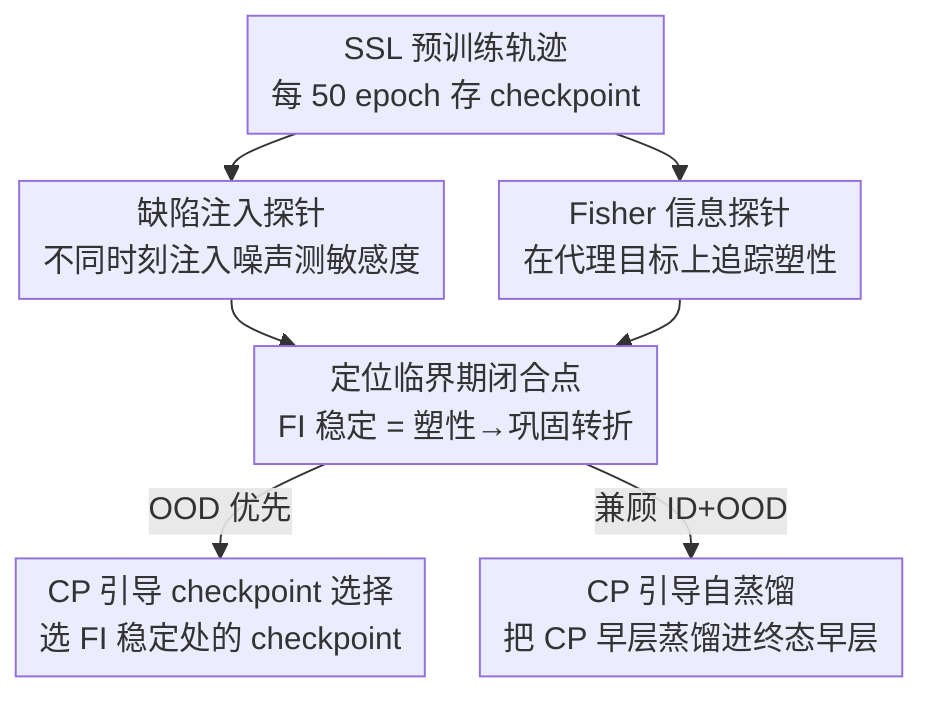

# Understanding the Learning Phases in Self-Supervised Learning via Critical Periods

**会议**: ICLR 2026  
**OpenReview**: [https://openreview.net/forum?id=UxIRc97ecL](https://openreview.net/forum?id=UxIRc97ecL)  
**领域**: 自监督学习 / 表示学习  
**关键词**: 自监督学习, 临界期, Fisher 信息, 迁移性权衡, checkpoint 选择

## 一句话总结
本文发现自监督预训练存在「迁移性权衡」——中间 checkpoint 的域外（OOD）泛化反而比最终 checkpoint 更强，并借「临界期（critical period）」这一生物/监督学习概念，用缺陷注入和 Fisher 信息两个探针刻画出 SSL 的塑性→巩固→过度专化三阶段，进而提出基于临界期闭合点的 checkpoint 选择与自蒸馏两个轻量策略来兼顾 ID 与 OOD 性能。

## 研究背景与动机
**领域现状**：自监督学习（SSL）通过对比视图、掩码重建等代理任务（pretext task）从无标注数据学到可迁移表征，已成为主流预训练范式。业界默认遵循一条朴素启发式：在算力允许范围内「训得越久越好」，因此往往把模型一路预训练到上千 epoch，并直接取最终 checkpoint 用于下游。

**现有痛点**：这条启发式缺乏「该训多久」的判据。训得太短表征发育不全；训得太久不仅烧算力，还会让模型过拟合到代理目标本身。更麻烦的是，SSL 目标和下游迁移性只是**隐式对齐**的——表征质量通常要等预训练结束后再用 linear probing / finetuning 去事后评估，这既昂贵又无法在预训练**过程中**告诉你表征是「还没学够」还是「已经过度专化」。

**核心矛盾**：作者在 fMoW 遥感数据上系统评估整条预训练轨迹后发现了一个被长期忽略的现象——**域内（ID）与域外（OOD）性能并非同步提升**：延长预训练主要抬高 ID 精度，而 OOD 迁移性却在某个**中间 checkpoint** 达到峰值，之后反而下降。「训得越久越好」在 OOD 上根本不成立。

**切入角度**：作者借用神经科学的「临界期（CP）」概念。已有工作表明神经网络（监督设定下）也存在临界期——早期高塑性窗口里的数据扰动会留下永久影响，后期同样的扰动却几乎无害；这种时间敏感性可用 Fisher 信息（FI）来解释。作者假设 SSL 也经历类似的结构化学习阶段，于是把临界期分析**重构到无标签的预训练阶段**。

**核心 idea**：用「缺陷注入 + 代理任务上的 Fisher 信息」两个探针定位 SSL 的临界期闭合点，并以该点作为兼顾迁移性的「甜区」，指导 checkpoint 选择与跨 checkpoint 自蒸馏。

## 方法详解

### 整体框架
本文不是提一个新模型，而是「先观测、再解释、后干预」的三段式分析框架。它要回答一个简单却没人深究的问题：SSL 该预训练多久？整体逻辑是——沿预训练轨迹每 50 epoch 存一个 checkpoint，先用两个探针刻画学习阶段、定位临界期闭合点，再据此设计两个轻量干预策略。

整条 pipeline 里，缺陷注入和 Fisher 信息是两个互补的**观测探针**（一个看「扰动有没有留下永久效应」，一个给出「为什么敏感度随时间变化」的解析视角），二者共同把临界期闭合点钉出来；CP-CS 和 CP-SD 则是建立在这个闭合点之上的两个**干预策略**，分别服务于「只要 OOD」和「ID/OOD 都要」两种需求。

### 关键设计

**1. 缺陷注入探针：用「何时扰动」检验临界期是否存在**

要判断 SSL 是否有临界期，核心问题是——同样的输入扰动，在预训练早期注入和晚期注入，对最终表征的伤害是否不同？作者把干净数据 $p(x)$ 在某个起始 epoch $t_0$ 起、持续 $\Delta t$ 个 epoch 替换为扰动分布 $p'(x)$（沿用前人做法，用高斯噪声模拟「感觉剥夺」），窗口结束后再切回干净数据训到 $T=1000$。代理任务本身不变，但监督信号在窗口内来自噪声而非有意义的图像，模型可能学到对下游无用的冗余特征。把干净训练得到的编码器 $f_\theta$（baseline）与带缺陷窗口的 $f_{\theta'}$ 在下游做对比，定义**敏感度分数**

$$S(t_0) = \Phi(f_\theta) - \Phi(f_{\theta'}),$$

其中 $\Phi(\cdot)$ 是下游评估指标（如分类精度）。若早期扰动的 $S(t_0)$ 显著大于晚期，就坐实了临界期的存在。实验在 5/30/50 epoch 三种窗口、early(0)/middle(450)/late(750) 三个起始点上扫，结论一致：**预训练开头是敏感窗口**，此时的数据扰动会在表征里留下持久退化，而后期同样扰动几乎无害。

**2. Fisher 信息探针：在代理目标上量化塑性的演化**

缺陷注入只能说明「扰动有没有持久效应」，却解释不了「为什么敏感度随时间变化」。作者改用 Fisher 信息（FI）给出连续的塑性标记。关键改造是：传统 FI 依赖监督下游信号，而 SSL 没有标签——于是把代理任务统一形式化为优化一个条件分布 $p_\theta(y|x)$（对比学习里 $y$ 指定正负对，掩码建模里 $y$ 指被遮区域），在此之上计算 FI。对参数做无穷小扰动 $\theta'=\theta+\delta\theta$，用 KL 散度的二阶 Taylor 展开得 $\mathbb{E}_x \mathrm{KL}(p_\theta \| p_{\theta'}) = \tfrac12 \delta\theta^\top F \delta\theta + o(\|\delta\theta\|^2)$，其中 Fisher 信息矩阵 $F = \mathbb{E}_x \mathbb{E}_{y\sim p_\theta(y|x)}[\nabla_\theta \log p_\theta(y|x)\, \nabla_\theta \log p_\theta(y|x)^\top]$。由于完整 FIM 不可解，作者用它的迹

$$\mathrm{tr}(F) = \mathbb{E}_x \mathbb{E}_{y\sim p_\theta(y|x)}\big[\|\nabla_\theta \log p_\theta(y|x)\|^2\big]$$

作为总敏感度的标量度量，实践中直接用自监督损失在代理目标上的梯度近似（每个 epoch 算一次）。实验发现 FI **先升、达峰、再降并趋于稳定**——作者把「FI 稳定之前的 epoch 序列」定义为临界期，FI 稳定即为**临界期闭合（CP closure）**：此后模型丢弃对代理任务无用的变异性，表征对改变不再敏感。这与探针 1 完全对齐——临界期内注入的缺陷留下持久影响，闭合后的缺陷只有微小效应。

**3. CP-CS：用临界期闭合点选 checkpoint，零额外成本**

既然 OOD 迁移性峰值落在临界期闭合附近，作者提出 Critical Period-guided Checkpoint Selection（CP-CS）：与其默认取最终 checkpoint，不如 (i) 跨 epoch 监控 FI 迹，(ii) 找到 FI 曲线稳定的 epoch 区间，(iii) 取最近的 checkpoint 用于下游。它**不需要任何标签、也不增加预训练之外的成本**，把「选哪个 checkpoint」从盲选缩成一个有依据的经验法则：OOD 重要时以闭合点为起点，ID 优先时继续往后训依然有益。这恰好把 §2 观测到的迁移性权衡变成了可操作的判据。

**4. CP-SD：跨 checkpoint 自蒸馏，让早层「回到」临界期状态**

CP checkpoint 的 OOD 强、post-CP checkpoint 的 ID 强，二者是互补的。作者用层级探测（layer-wise probing）发现：CP checkpoint 在全网 OOD 更好、**差距在早层最大**，而 post-CP checkpoint 的 ID 优势集中在后层。原因是早层本应编码通用特征，但随预训练延长会被逐渐压缩、向代理任务专化，连早层也被污染。于是 CP-guided Self-Distillation（CP-SD）把 CP checkpoint 当**教师**、只蒸馏 post-CP checkpoint（学生）的**中间/早层**，下游 finetuning 时联合优化任务损失与蒸馏损失：

$$L = L_{\text{task}} + \lambda \sum_{l\in L} \|f^{\text{student}}_l - f^{\text{teacher}}_l\|_2^2,$$

后层只用 $L_{\text{task}}$ 优化。这样既把终态早层「拉回」临界期状态恢复 OOD 迁移性，又保住了后层靠延长预训练换来的 ID 强度。消融显示**只蒸馏早层优于蒸馏全部层**——把整个模型都拉向 CP checkpoint 会覆盖掉后层有用的 ID 专化精修。

## 实验关键数据

### 主实验
在 fMoW-RGB 遥感数据上从零预训练 1000 epoch，覆盖判别式（SimCLR/VICReg/DINO）与生成式（MAE）四种 SSL，ID 在 fMoW 上 finetune+评估，OOD 在 fMoW-WILDS / EuroSAT / EuroSAT-Spatial 上评估。VICReg-RN50 的下游分类精度（3 次平均）：

| 模型 | fMoW-val (ID) | fMoW-WILDS (OOD) | EuroSAT (OOD) | EuroSAT-Spatial (OOD) |
|------|---------------|-------------------|----------------|------------------------|
| Final checkpoint | **0.621** | 0.341 | 0.917 | 0.894 |
| CP checkpoint | 0.610 | 0.430 | 0.931 | 0.912 |
| CP-SD (early layers) | 0.617 | **0.445** | **0.944** | **0.925** |
| CP-SD (all layers) | 0.611 | 0.421 | 0.929 | 0.908 |

最终 checkpoint 的 ID 最高但 OOD 明显退化；CP checkpoint 反过来用一点 ID 换来大幅 OOD 提升（WILDS 0.341→0.430）；CP-SD（早层）则兼顾两端，OOD 进一步抬到 0.445 且 ID 几乎不掉。

### 消融实验

| 配置 | 关键现象 | 说明 |
|------|----------|------|
| CP-SD 只蒸馏早层 | OOD 最佳、ID 接近 Final | 早层恢复通用性、后层保住 ID |
| CP-SD 蒸馏全部层 | OOD 反而回落到 0.421 | 拉整模型向 CP，覆盖后层 ID 精修 |
| 缺陷 early vs late 注入 | 早期 $S(t_0)$ 显著更大 | 坐实早期敏感窗口 |

### 关键发现
- 四种方法都呈现 OOD 中间峰 + ID 单调升的权衡，但 **SimCLR 的权衡出现得更晚**：作者归因于它是唯一依赖正负对的方法，梯度随 minibatch 中所有负样本变化，需反复重组全局表征空间，导致临界期闭合更晚、过度专化被推迟。
- FI 轨迹（升-峰-降-稳）与缺陷注入敏感度高度一致，两个独立探针互相印证临界期的存在。
- 临界期闭合是「学够了但还没过度专化」的甜区，超过它进入**过度专化阶段**：ID 继续升、OOD 开始降，二者发散点即过度专化起点。

## 亮点与洞察
- 把「训多久」这个被算力惯性掩盖的实际问题，转化成可观测、可干预的临界期分析——而且两个干预都**零或极低额外成本**，直接复用已有 checkpoint，落地性极强。
- 把监督学习里的 Fisher 信息巧妙改造到无标签的 SSL：将代理任务形式化为 $p_\theta(y|x)$ 后，FI 迹就能在没有下游标签的情况下连续追踪塑性，这是把临界期框架搬进 SSL 的关键一步。
- 「早层蒸馏 > 全层蒸馏」这一反直觉结论，揭示了 ID/OOD 能力在网络深度上的分工（早层通用、后层专化），可迁移到任何想兼顾通用性与专化性的迁移学习场景。

## 局限与展望
- 实验主要围绕 fMoW 遥感单一预训练数据 + 有限 OOD 集，临界期闭合点的具体位置是否随数据规模/领域大幅漂移、在 ImageNet 等更大数据上是否同样清晰，证据相对有限（附录有补充但正文表只给了 VICReg 完整数字）。
- 临界期闭合的判定依赖「FI 曲线何时稳定」的目测/经验判断，缺一个自动化、可复现的阈值定义，实际部署时阈值选择仍有主观性。
- CP-SD 引入了层选择与蒸馏权重 $\lambda$ 等超参，论文未充分讨论其敏感性；「只蒸早层」中「早层」的边界如何随架构（ResNet vs ViT）确定也值得展开。

## 相关工作与启发
- **vs 传统临界期分析（Achille et al. 2018）**: 他们在监督学习里用数据扰动 + FI 揭示早期塑性窗口，但依赖下游标签信号；本文把分析对象移到**无标签预训练阶段**，并用 $p_\theta(y|x)$ 重定义代理任务上的 FI，首次在 SSL 中刻画临界期。
- **vs 「越久越好」的 SSL 默认实践（SimCLR/MAE）**: 他们默认取最终 checkpoint；本文指出这只对 ID 成立，OOD 反而该取临界期闭合点，纠正了一个被广泛采用的启发式。
- **vs 知识蒸馏**: 常规蒸馏跨模型/跨容量；CP-SD 是**同一模型不同 checkpoint 之间**、且**只蒸早层**的自蒸馏，目标是恢复被过度专化侵蚀的通用特征，思路新颖且成本低。

## 评分
- 新颖性: ⭐⭐⭐⭐⭐ 首次把临界期框架系统搬进 SSL，并由观测一路推到可操作干预
- 实验充分度: ⭐⭐⭐⭐ 覆盖四类 SSL + 双探针互证，但主表数据集偏窄、完整数字主要给 VICReg
- 写作质量: ⭐⭐⭐⭐⭐ 「观测-解释-干预」三段逻辑清晰，图文对应到位
- 价值: ⭐⭐⭐⭐⭐ 给「SSL 该训多久 / 选哪个 checkpoint」提供了零成本、可复用的实践判据

<!-- RELATED:START -->

## 相关论文

- [\[ICLR 2026\] Understanding the Robustness of Distributed Self-Supervised Learning Frameworks Against Non-IID Data](understanding_the_robustness_of_distributed_self-supervised_learning_frameworks_.md)
- [\[ICML 2026\] Understanding Self-Supervised Learning via Latent Distribution Matching](../../ICML2026/self_supervised/understanding_self-supervised_learning_via_latent_distribution_matching.md)
- [\[ICLR 2026\] On the Alignment Between Supervised and Self-Supervised Contrastive Learning](on_the_alignment_between_supervised_and_self-supervised_contrastive_learning.md)
- [\[ICLR 2026\] Equivariant Splitting: Self-supervised learning from incomplete data](equivariant_splitting_self-supervised_learning_from_incomplete_data.md)
- [\[ICLR 2026\] Soft Equivariance Regularization for Invariant Self-Supervised Learning](soft_equivariance_regularization_for_invariant_self-supervised_learning.md)

<!-- RELATED:END -->
