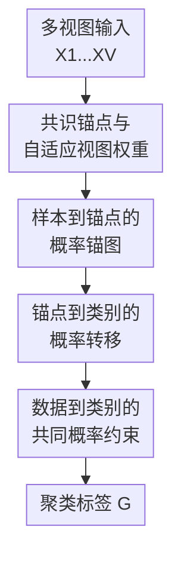

# Unified and Efficient Multi-view Clustering from Probabilistic Perspective

**会议**: ICLR2026  
**OpenReview**: [https://openreview.net/forum?id=KAGR7Mqu4h](https://openreview.net/forum?id=KAGR7Mqu4h)  
**代码**: 未提供  
**领域**: 自监督 / 表示学习 / 多视图聚类  
**关键词**: 多视图聚类, 锚图学习, 概率转移矩阵, 大规模聚类, 无监督学习  

## 一句话总结
UEMCP 把锚图多视图聚类重新解释为“数据点→锚点→类别”的概率转移学习，在统一目标中同时学习共识锚点、视图权重、锚图和类别分配，从而在多个大规模多视图数据集上取得更好的聚类效果与近似线性复杂度。

## 研究背景与动机

**领域现状**：多视图聚类的目标是把同一批样本在不同视图下的特征表示整合起来，在没有人工标签的情况下恢复潜在类别结构。经典图聚类路线通常会为每个视图构建样本间相似图，再通过图融合、拉普拉斯约束或谱聚类得到最终划分；这类方法的优势是能显式表达样本间局部关系，也比较适合捕捉非线性结构。

**现有痛点**：完整样本图的代价太高。若数据集有 $n$ 个样本，构图往往需要 $O(n^2)$ 的空间或时间，后续拉普拉斯矩阵特征分解还可能达到 $O(n^3)$，这让它们很难直接处理 Reuters、NUSWIDEOBJ、NoisyMNIST 这类更大规模的多视图数据。锚图方法用 $m$ 个锚点连接 $n$ 个样本，能把全图压缩成样本-锚点二部图，但很多方法仍把锚图当作一个优化变量或相似度矩阵来用，没有讲清“锚点、样本、类别”之间到底对应什么概率关系。

**核心矛盾**：锚图本来具备概率矩阵的外形：非负、列和为 1，每个样本到不同锚点的连接强度可以理解为从数据点转移到锚点的概率。但现有方法常把锚点选择、锚图构造、类别分配拆成多个阶段，或者只强调图结构质量，导致最终类别与输入样本之间缺少一个统一的概率解释。换句话说，它们虽然高效，却没有充分利用“样本通过锚点到达类别”这条可解释链路。

**本文目标**：作者希望同时解决两件事：一是保留锚图多视图聚类的可扩展性，让方法面对大数据时不退化为完整图；二是把锚点学习、视图融合和类别分配放到同一个概率框架里，让每一步变量都有清楚含义，尤其是让最终聚类结果可以由数据点到类别的共同转移概率来解释。

**切入角度**：论文从概率转移视角出发，把样本到锚点的锚图 $S$ 看作概率转移矩阵，把锚点到类别的矩阵 $H$ 看作第二段转移，再用 $HS$ 近似数据点到类别的概率矩阵 $G$。这样一来，多视图一致性不只是“多个图要相似”，而是不同视图都要服务于同一组共识锚点和同一条数据到类别的概率路径。

**核心 idea**：用“共识锚点 + 两段概率转移 + 自适应视图权重”替代传统锚图聚类中分散的图构造与后处理，把大规模多视图聚类写成一个端到端的统一优化问题。

## 方法详解

### 整体框架

UEMCP 的输入是 $V$ 个视图的数据矩阵 $\{X^v\}_{v=1}^V$，输出是数据点到类别的概率转移矩阵 $G$，最后可由 $G$ 得到聚类标签。方法先在多个视图之间学习一组共享锚点 $A$，并用每个视图自己的投影矩阵 $P_v$ 把不同维度的视图映射到共同锚空间；随后学习样本到锚点的概率矩阵 $S$、锚点到类别的概率矩阵 $H$，并用 $HS$ 去约束数据点到类别的共同转移概率 $G$。视图权重 $\alpha_v$ 也在同一目标中更新，使重构误差更小、贡献更大的视图获得更高权重。

这张图里的三个贡献节点对应下面的关键设计：先用共识锚点和自适应视图权重统一不同视图，再把锚图 $S$ 赋予样本到锚点的概率意义，最后通过 $H$ 与 $G$ 建立锚点到类别、数据到类别的概率一致性。它不是单纯把已有锚图方法换个符号，而是把“图连接强度”和“类别软标签”放在同一个概率链路里优化。

### 关键设计

**1. 共识锚点与自适应视图权重：让多视图先对齐到同一个锚空间**

传统锚图方法常先选取锚点，再围绕这些锚点构造图；如果锚点只是从原始数据中采样，锚点质量会直接限制后续聚类。UEMCP 选择把锚点也作为变量学习：对第 $v$ 个视图，数据矩阵 $X^v \in \mathbb{R}^{d_v \times n}$ 通过正交投影 $P_v$ 对齐到公共空间，再由共识锚矩阵 $A$ 和锚图 $S$ 重构，即最小化 $\sum_v \alpha_v^2 \|X^v-P_vAS\|_F^2$。其中 $A$ 是多个视图共享的锚点表示，$S$ 是所有视图共用的样本-锚点关系，这比为每个视图分别学一张图再融合更直接地约束了跨视图一致结构。

视图权重 $\alpha_v$ 不是手工指定，而是根据各视图当前重构误差自适应更新：误差小、与共识锚结构更契合的视图会得到更大权重。论文给出的更新式为 $\alpha_v = \frac{1/\|X^v-P_vAS\|_F}{\sum_{u=1}^{V}1/\|X^u-P_uAS\|_F}$。这个设计的意义在于，多视图聚类里不同特征视图质量差异很常见，如果简单平均会把噪声视图也同等写入图结构；UEMCP 则让视图贡献随着优化状态动态变化。

**2. 样本到锚点的概率锚图：把二部图连接解释成第一段转移概率**

UEMCP 对 $S$ 加上 $S \ge 0$ 和 $S^T\mathbf{1}=\mathbf{1}$ 的约束，因此每个样本对应的锚点连接权重之和为 1。这样 $S_{ij}$ 不只是“样本 $j$ 与锚点 $i$ 的相似度”，还可以解释为样本 $j$ 转移到锚点 $i$ 的概率。这个解释很关键，因为它把锚图从工程上的加速结构变成了概率模型中的中间状态。

在优化上，固定其他变量后，$S$ 的子问题包含两部分力量：一部分来自各视图重构误差，保证样本经由锚点仍能解释原始多视图特征；另一部分来自 $\lambda\|HS-G\|_F^2$，要求样本到锚点的分配还能支撑最终类别概率。论文把每个样本对应的 $S_{:,j}$ 写成带单纯形约束的二次规划来求解，这使 $S$ 同时服务于表示重构和聚类分配，而不是先学完图再做一次外部谱聚类。

**3. 锚点到类别的概率转移：用 $HS$ 串起样本、锚点和类别**

如果 $S$ 表示“数据点到锚点”，那么还需要一段“锚点到类别”的映射才能得到聚类标签。UEMCP 引入 $H \in \mathbb{R}^{c \times m}$，并约束 $H \ge 0$、$H^T\mathbf{1}=\mathbf{1}$，让每个锚点对应一个类别分布。于是 $HS \in \mathbb{R}^{c \times n}$ 就自然表示每个数据点经由锚点传播到各类别的概率。

论文进一步引入 $G$ 作为数据点到类别的共同概率/标签矩阵，并用 $\|HS-G\|_F^2$ 让两段转移得到的类别分布靠近最终聚类结果。直观地看，若一个样本主要连到某些锚点，而这些锚点又主要属于同一类别，那么 $HS$ 会给这个类别较高概率；$G$ 则把这种软分配推向更明确的聚类结构。这里的“可解释性”不是后验解释，而是优化目标本身就要求最终标签能由样本-锚点-类别的概率链路生成。

**4. 交替优化与近线性复杂度：把统一目标拆成可解的局部子问题**

完整目标同时含有 $P_v$、$A$、$S$、$H$、$G$ 和 $\alpha_v$，直接联合求全局最优并不现实。UEMCP 采用交替优化：固定其他变量后依次更新 $S$、各视图投影 $P_v$、共识锚点 $A$、类别矩阵 $G$、锚点类别转移 $H$ 和视图权重 $\alpha$。其中 $A$ 与 $P_v$ 的子问题都可转成正交 Procrustes 形式，通过 SVD 得到闭式更新；$G$ 的更新也通过对 $J=HS$ 做 SVD 获得；$H$ 的更新可理解为为锚点选择最接近的类别分配。

这个设计保留了端到端统一目标，同时避免了完整样本图的高昂代价。由于锚点数 $m$ 和类别数 $c$ 通常远小于样本数 $n$，论文分析得到主要复杂度随 $n$ 近似线性增长，尤其是更新 $S$ 和 $G$ 时都围绕 $n$ 个样本做低维操作。对于大规模多视图聚类，这比构造 $n \times n$ 图再分解拉普拉斯矩阵更现实。

### 一个完整示例

假设一个图像数据集有三种视图：HOG、GIST 和 LBP，每张图像都没有人工类别标签。UEMCP 不会先在每个视图上各自构建完整样本图，而是先学习一组共享锚点 $A$。一张图像在三个视图下都被投影到这个锚空间中，然后通过 $S_{:,j}$ 得到它对 $m$ 个锚点的概率分布，例如它可能以 0.55、0.30、0.10 的概率连到三个最相关锚点，剩余概率分给其他锚点。

接着，$H$ 会给这些锚点分配类别概率。如果前两个高概率锚点都更倾向于“室内场景”类别，第三个锚点偏向“街景”类别，那么 $HS$ 会把这张图像的类别概率推向“室内场景”。优化中的 $G$ 再把这种由锚点传播来的软分布压成更清晰的聚类结果。整个过程里，读者可以沿着 $X^v \rightarrow A,S \rightarrow H \rightarrow G$ 追踪一个样本如何从多视图特征变成类别分配。

### 损失函数 / 训练策略

UEMCP 的最终目标可以概括为两项：多视图重构项和概率一致性项。

$$
\min_{P_v,A,S,H,G} \sum_{v=1}^{V} \alpha_v^2\|X^v-P_vAS\|_F^2 + \lambda\|HS-G\|_F^2
$$

其中约束包括 $P_v^TP_v=I$、$A^TA=I$、$S\ge0$、$S^T\mathbf{1}=\mathbf{1}$、$H\ge0$、$H^T\mathbf{1}=\mathbf{1}$、$G\ge0$ 以及对 $G$ 的正交约束。第一项负责让共识锚点和锚图能重构所有视图，第二项负责让两段概率转移 $HS$ 与最终类别分配 $G$ 保持一致。参数 $\lambda$ 控制类别概率约束的强度；实验显示过大或过小都不理想，论文在多个数据集上观察到 $\lambda=0.5$ 通常效果较好。

训练采用交替最小化，初始化 $A$、$P_v$、$S$、$H$、$G$ 和 $\alpha$ 后重复更新各变量直到收敛。作者指出每个子问题在固定其他变量时是可处理的，目标值会单调下降；收敛实验也显示多个数据集上大约 20 次迭代即可稳定。

## 实验关键数据

### 主实验

论文在 7 个多视图数据集上评估，包括 Caltech101-20、Scene15、SUNRGBD、Reuters、NUSWIDEOBJ、AWA 和 NoisyMNIST。对比方法覆盖 ETLMSC、SFMC、BMVC、LMVSC、FMCNOF、FPMVS、MSC-BG、EDMC 等代表性多视图聚类或锚图聚类方法，指标包括 ACC、NMI、Purity 和 F1-score。下面选取最直观的 ACC 与 NMI 结果概括主实验趋势。

| 数据集 | 指标 | UEMCP | 最强对比方法 | 提升 |
|--------|------|-------|--------------|------|
| Caltech101-20 | ACC | 68.00 | FPMVS 66.20 | +1.80 |
| Scene15 | ACC | 50.27 | EDMC 48.00 | +2.27 |
| SUNRGBD | ACC | 31.50 | EDMC 27.00 | +4.50 |
| Reuters | ACC | 29.60 | EDMC 25.27 | +4.33 |
| NUSWIDEOBJ | ACC | 23.56 | EDMC 21.10 | +2.46 |
| AWA | ACC | 10.62 | EDMC 9.15 | +1.47 |
| NoisyMNIST | ACC | 10.28 | EDMC 9.00 | +1.28 |

| 数据集 | 指标 | UEMCP | 最强对比方法 | 提升 |
|--------|------|-------|--------------|------|
| Caltech101-20 | NMI | 53.60 | FPMVS 63.28 | -9.68 |
| Scene15 | NMI | 42.70 | FPMVS 45.70 | -3.00 |
| SUNRGBD | NMI | 27.00 | LMVSC 25.43 | +1.57 |
| Reuters | NMI | 29.95 | EDMC 28.00 | +1.95 |
| NUSWIDEOBJ | NMI | 16.20 | EDMC 14.70 | +1.50 |
| AWA | NMI | 12.00 | BMVC 13.56 | -1.56 |
| NoisyMNIST | NMI | 3.62 | LMVSC 12.68 | -9.06 |

从 ACC 看，UEMCP 在七个数据集上均超过表中对比方法，尤其在 SUNRGBD 和 Reuters 上优势较明显。NMI 表则更复杂：UEMCP 在多数大规模或较难数据集上有提升，但在 Caltech101-20、Scene15、AWA、NoisyMNIST 上并非所有 NMI 都第一。论文正文更强调综合四个指标和效率优势；读表时应注意不同指标对聚类结构的偏好不同，不能只用单一指标判断方法全面胜出。

### 消融实验

论文主要消融了目标函数中的第二项 $\lambda\|HS-G\|_F^2$，也就是数据点到类别概率转移的一致性约束。原文以图 3 展示所有数据集上四个指标的变化，趋势是去掉该项后性能明显下降，说明概率链路不是装饰性解释，而是直接影响聚类质量的核心项。

| 配置 | 关键指标 | 说明 |
|------|----------|------|
| Full UEMCP | ACC/NMI/Purity/F1 整体最高或较优 | 同时使用多视图重构和 $HS$ 到 $G$ 的概率一致性约束 |
| w/o probability transition term | 多个数据集四项指标下降 | 移除 $\|HS-G\|_F^2$ 后，软标签缺少数据到类别共同转移概率的约束 |
| $\lambda$ 过小 | 聚类指标下降 | 类别概率一致性太弱，模型更像普通锚点重构 |
| $\lambda$ 过大 | 聚类指标也下降 | 类别约束压过多视图重构，可能损害锚图对原始结构的表达 |

论文还做了参数敏感性与锚点数量分析。$\lambda$ 在 $\{0.1,0.5\}$ 附近通常较稳定，最佳值常出现在 $0.5$；锚点数量从 $2k$ 增加到 $5k$ 往往能提升表现，但继续增大到 $6k$ 并不总是带来收益，说明锚点数需要覆盖全局结构，但过多锚点会增加计算且收益变小。

### 关键发现

- 概率一致性项是核心贡献之一。去掉 $\|HS-G\|_F^2$ 后，模型虽然仍能学习共识锚点和锚图，但最终类别不再被“样本→锚点→类别”的链路稳定约束，聚类性能明显变差。
- 锚图路线对大规模数据更友好。ETLMSC 等两阶段或完整图相关方法在 NUSWIDEOBJ、AWA、NoisyMNIST 上出现 N/A，说明内存压力是真问题；UEMCP 通过锚点学习避免直接处理 $n \times n$ 样本图。
- 运行时间实验显示 UEMCP 在多个数据集上耗时较短，虽然 BMVC 更快，但 BMVC 的聚类效果相对较弱。UEMCP 的定位不是极限轻量，而是在可解释概率建模、聚类质量和大规模效率之间取得较实用的组合。
- 收敛曲线显示目标值约 20 次迭代后稳定，支持交替优化在实际数据上的可用性。

## 亮点与洞察

- 概率视角给锚图赋予了更清楚的语义。很多锚图方法都要求非负和归一化，但只把它当作优化约束；UEMCP 直接把这些约束解释为概率转移，使 $S$、$H$、$G$ 的关系更容易被读者理解。
- 把锚点学习和类别分配放在同一目标里，比“先构图、再谱聚类”的两阶段流程更紧凑。这样最终标签会反过来影响锚图学习，而不是等图学完后才被动接受图质量。
- 自适应视图权重是一个朴素但有用的设计。多视图数据中某些视图可能更干净、更接近聚类结构，基于重构误差更新 $\alpha_v$ 可以降低弱视图对共识锚图的干扰。
- 这篇论文的思路可迁移到其他锚点化学习问题，例如大规模多模态检索、跨模态聚类或不完整多视图聚类：只要存在“样本→原型/锚点→语义状态”的链路，就可以考虑把中间矩阵写成概率转移而不是普通相似度。

## 局限与展望

- 论文把“可解释性”主要建立在概率变量含义上，但没有进一步给出面向用户的解释案例，例如展示某个样本为何因哪些锚点被分到某类。若能可视化 $S$、$H$ 和 $G$ 的具体传播过程，说服力会更强。
- $\lambda$ 和锚点数量仍需要调节。虽然论文给出了敏感性实验，但实际部署到新数据集时，如何自动选择 $\lambda$、$m$ 仍是开放问题。
- 方法依赖类别数 $k$ 已知，这是多数聚类 benchmark 的常见设定，但真实无监督场景中类别数往往未知。未来可以结合自动类别数估计或非参数聚类扩展这一框架。
- 实验集中在传统多视图特征数据集，尚未覆盖现代大规模多模态表示，例如 CLIP 图文特征、视频-文本-音频联合特征。概率锚图框架在这些更高维、更噪声的表示上是否仍稳定，需要进一步验证。
- NMI 结果并非所有数据集第一，说明 UEMCP 的优势更体现在 ACC、Purity、F1 和效率的综合表现上。后续可以分析不同指标分歧来自类别不均衡、锚点分配还是正交约束。

## 相关工作与启发

- **vs 完整图多视图聚类**: 这类方法直接在样本之间建图，能细致描述局部结构，但计算和内存随样本数快速增长。UEMCP 用样本-锚点二部图替代完整样本图，把主要变量规模从 $n \times n$ 压到 $m \times n$，更适合大规模数据。
- **vs LMVSC / SFMC 等锚图方法**: 这些方法同样利用锚点降低复杂度，并通过图融合或拉普拉斯秩约束获得聚类结构。UEMCP 的区别是把锚图和软标签都纳入概率转移解释，用 $HS$ 对齐 $G$，使输入样本与最终类别之间的关系更统一。
- **vs FPMVS / EDMC**: FPMVS 和 EDMC 也关注锚点学习与高效多视图聚类，尤其 EDMC 从实例空间和聚类空间学习锚点。UEMCP 的重点不在设计更复杂的锚点层级，而是在一个概率目标里串起样本、锚点、类别三层变量，因此解释路径更简洁。
- **启发**: 对很多“相似度矩阵 + 后处理”的无监督方法，可以反问这些矩阵是否具备概率语义。如果约束本身已经接近概率单纯形，那么把它们显式写成转移链路，可能比单纯增加正则项更容易形成可解释且可优化的模型。

## 评分

- 新颖性: ⭐⭐⭐⭐ 从概率转移视角统一锚图和类别软标签，想法清楚，但仍建立在成熟锚图多视图聚类框架上。
- 实验充分度: ⭐⭐⭐⭐ 覆盖 7 个数据集、8 个对比方法和多种指标，也有参数、锚点数、消融、运行时间与收敛分析；不足是缺少更现代多模态表示实验。
- 写作质量: ⭐⭐⭐ 公式链路完整，但部分符号叙述不够严谨，正文对 NMI 等非最优结果的讨论偏弱。
- 价值: ⭐⭐⭐⭐ 对大规模多视图聚类有实用意义，尤其适合需要兼顾效率和可解释概率结构的无监督表示学习场景。

<!-- RELATED:START -->

## 相关论文

- [\[ICLR 2026\] Relationship Alignment for View-aware Multi-view Clustering](relationship_alignment_for_view-aware_multi-view_clustering.md)
- [\[ICLR 2026\] Uncover Underlying Correspondence for Robust Multi-view Clustering](uncover_underlying_correspondence_for_robust_multi-view_clustering.md)
- [\[ICLR 2026\] Debiased and Denoised Representation Learning for Incomplete Multi-view Clustering](debiased_and_denoised_representation_learning_for_incomplete_multi-view_clusteri.md)
- [\[ICLR 2026\] Incomplete Multi-View Multi-Label Classification via Shared Codebook and Fused-Teacher Self-Distillation](incomplete_multi-view_multi-label_classification_via_shared_codebook_and_fused-t.md)
- [\[ICLR 2026\] Samples Are Not Equal: A Sample Selection Approach for Deep Clustering](samples_are_not_equal_a_sample_selection_approach_for_deep_clustering.md)

<!-- RELATED:END -->
