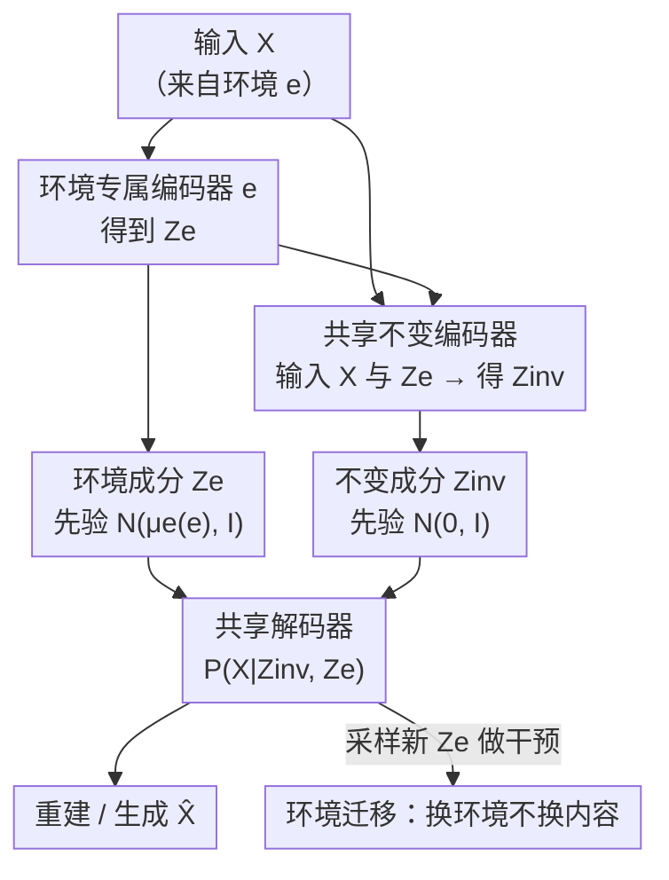

# Unsupervised Representation Learning - An Invariant Risk Minimization Perspective

**会议**: ICLR 2026  
**OpenReview**: [https://openreview.net/forum?id=MTWFfKw3sd](https://openreview.net/forum?id=MTWFfKw3sd)  
**代码**: https://github.com/Yotamnor/UIRM  
**领域**: 自监督/表示学习 / 因果推断 / 分布外泛化  
**关键词**: 不变风险最小化, 无监督表示学习, 因果生成模型, 变分自编码器, 环境迁移

## 一句话总结
本文把原本依赖标签的不变风险最小化（IRM）推广到无标签场景，把"不变性"重新定义为"特征分布跨环境对齐"，并给出线性高斯下的 PICA 和深度生成式的 VIAE 两种方法，在合成数据、改造版 MNIST 和 CelebA 上实现了不依赖标签的不变结构提取与跨环境泛化。

## 研究背景与动机

**领域现状**：IRM（Arjovsky et al., 2019）是分布外（OOD）泛化的基石之一。它假设数据来自多个环境，每个环境分布不同；其中一部分潜在特征跨环境稳定（不变特征 $Z_{inv}$），另一部分随环境变化（环境/虚假特征 $Z_e$）。IRM 的目标是学一个表示 $\phi(X)$，只保留不变特征、滤掉环境特征，使建在其上的分类器 $w \circ \phi$ 对分布漂移鲁棒，原始目标是一个 bi-level 优化：

$$\min_{\phi, w} \sum_{e \in E_{train}} R^e(w \circ \phi) \quad \text{s.t.} \quad w \in \arg\min_{\bar{w}} R^e(\bar{w} \circ \phi) \ \forall e.$$

**现有痛点**：IRM 及其大量后续工作（IRMv1、稀疏 IRM、信息瓶颈 IRM 等）全都**离不开标签 $Y$**——"不变性"是通过"最优预测器跨环境一致"来定义的，没有标签就无从谈起。但现实中很多场景标签昂贵或干脆不可得，无监督地获得抗分布漂移的表示一直是空白。

**核心矛盾**：IRM 的不变性定义天然绑定在"标签—预测器"上，而无标签时既没有 $Y$ 也没有风险 $R^e$，整套 bi-level 约束失效。要把 IRM 搬进无监督世界，必须先找到一个**不依赖标签、却仍能刻画"环境不变"的等价约束**。

**本文目标**：(1) 给出一个无监督版本的不变性定义与优化目标；(2) 在简单的线性高斯情形下给出可解的算法；(3) 在深度生成模型里实现不变/环境隐变量的分离，并支持可控生成与环境迁移。

**切入角度**：作者注意到，监督 IRM 里"预测器跨环境一致"本质是在要求某种分布对齐。于是把不变性直接搬到**特征层面**：要求学到的表示 $\phi(X)$ 在所有环境下分布完全相同 $P^{e_1}(\phi(X)) = P^{e_2}(\phi(X))$。这个约束完全不碰标签，却保留了 IRM 的精神。

**核心 idea**：用"特征分布跨环境对齐"代替"预测器跨环境最优"，把 IRM 的风险项换成最大似然项，从而在一个新的"无监督结构因果模型"下实现无标签的不变表示学习。

## 方法详解

### 整体框架

本文在一个统一的无监督 IRM 框架下给出两条路线。框架的优化目标是：在跨环境最大化数据似然的同时，强制学到的特征分布跨环境相等：

$$\max_{\theta} \sum_{e \in E_{train}} \log P_\theta^e(X \mid \phi(X)) P_\theta^e(\phi(X)) \quad \text{s.t.} \quad P_\theta^i(\phi(X)) = P_\theta^j(\phi(X)) \ \forall i, j.$$

似然项扮演监督 IRM 里"经验风险"的角色，约束项扮演"不变性"的角色。这套目标依托一个新提出的**无监督结构因果模型（Unsupervised SCM）**，它把以往 IRM 文献里区分的 FIIF/PIIF、因果/反因果结构统一进同一个生成图：隐空间分解为不变成分 $Z_{inv}$ 和环境成分 $Z_e$，二者共同经一个跨环境稳定的因果机制生成 $X$。

在这个框架下，第一条路线 PICA 处理线性高斯的简化情形，用协方差的零空间求出不变投影方向，是一个解析的降维算法；第二条路线 VIAE 是主力方法，用变分自编码器把隐空间显式分解为不变/环境两块，支持采样生成、隐空间干预和跨环境迁移。VIAE 的数据通路如下：

### 关键设计

**1. 无监督 IRM 目标：把"标签不变"换成"特征分布跨环境对齐"**

监督 IRM 用"预测器对每个环境都最优"来定义不变性，离不开标签 $Y$ 与风险 $R^e$。本文的关键一步是把不变性下放到特征分布层面：要求 $P^i_\theta(\phi(X)) = P^j_\theta(\phi(X))$ 对任意环境对成立，再把目标里的风险换成跨环境对数似然之和。这样整个目标只用到无标签数据 $X^e \sim P^e_X$，却保留了"经验风险 + 不变性约束"的双结构。它与 VAE、概率 PCA 这类无监督表示学习同源，但额外加了一条显式的"特征分布跨环境相等"约束，正是这条约束让表示具备了 OOD 鲁棒的潜质。

**2. PICA：高斯线性下用零空间求不变投影方向**

为了把抽象目标落地，作者先攻最简单可解的情形——每个环境数据服从高斯 $X^e \sim \mathcal{N}(\mu^e, \Sigma^e_x)$ 且做零均值中心化。此时寻找单位方向 $u$ 使投影 $u^\top X$ 的方差跨环境最大、且分布跨环境相同。高斯下"分布相同"等价于"方差相同"，于是约束 $u^\top \Sigma^i_x u = u^\top \Sigma^j_x u$。在两环境情形，不变约束化简为 $u^\top(\Sigma^1_x - \Sigma^2_x)u = 0$，即 $u$ 必须落在 $\ker(\Sigma^1_x - \Sigma^2_x)$；目标化简为 $u^\top(\Sigma^1_x + \Sigma^2_x)u$。于是 PICA 分两步：先求协方差差的零空间 $U = \ker(\Sigma^1_x - \Sigma^2_x)$，再在 $U$ 内选最大化 $u^\top(\Sigma^1_x + \Sigma^2_x)u$ 的方向；要保留 $d_r$ 个不变主方向就在零空间内重复第二步 $d_r$ 次。这相当于一个"只在不变子空间里做 PCA"的降维器，把随环境漂移的维度直接滤掉。

**3. VIAE：因子化隐空间 + 共享不变编码器 + 环境专属编码器**

PICA 只适用线性高斯，主力方法 VIAE 把同样的思想搬进 VAE。它显式把隐空间因子化为不变成分 $Z_{inv}$ 和环境成分 $Z_e$，并据无监督 SCM 推出的因果独立性来设计编码/解码结构。先验上 $Z_{inv} \perp Z_e$、$Z_{inv} \perp e$，取 $Z_{inv} \sim \mathcal{N}(0, I)$，而每个环境配一个环境专属先验 $Z_e \sim \mathcal{N}(\mu^e(e), I)$，不同环境的均值互相区分，方便后续指定环境采样。后验因式分解为 $P^e(Z_{inv}, Z_e \mid X) = P(Z_{inv} \mid Z_e, X)\,P^e(Z_e \mid X)$：因为给定 $X$ 时 $Z_{inv}$ 与 $Z_e$ 因 collider 结构 $Z_{inv} \to X \leftarrow Z_e$ 而相关，所以**不变编码器同时吃 $X$ 和 $Z_e$**，而每个环境编码器只吃 $X$。网络含一个共享解码器、一个共享不变编码器、以及 $|E_{train}|$ 个环境专属编码器（参数各自独立）。解码器据因果机制满足 $P^e(X \mid Z_{inv}, Z_e) = P(X \mid Z)$，即给定隐变量后环境不再提供额外信息，解码器不接收任何显式环境标识——因为不变的因果机制本就跨环境稳定。

**4. 环境迁移：把"IRM 被解决"重定义为把所有样本搬到同一环境**

无监督设定下解码器既不是分类器也不是回归器，"什么算解决了 IRM"需要重新回答。作者提出：若能把分到不同环境的数据集**全部迁移到同一个目标环境**、同时保住不变内容，那么分布漂移就被消除，问题退化成普通学习问题，IRM 即视为已解决。形式上把样本从源环境 $e_s$ 迁到目标环境 $e_t$：抽 $X^{e_s}$ → 过源环境编码器得 $\hat{Z}_{e_s}$ → 把 $X^{e_s}$ 与 $\hat{Z}_{e_s}$ 喂不变编码器得 $\hat{Z}_{inv}$ → 从目标环境先验采 $\hat{Z}_{e_t} \sim \mathcal{N}(\mu^e(e_t), I)$ → 解码 $\hat{X}^{e_t} = \text{Dec}(\hat{Z}_{inv}, \hat{Z}_{e_t})$。这个视角的妙处在于不要求"剥离环境特征"（很多领域里"纯不变样本"根本无定义，如去掉亮度的 X 光片会毁掉数据），而是**对齐环境**。对于训练时见过的源环境 $e_s \in E_{train}$ 迁移效果好；对未见源环境 $e_s \in E_{test}$，因为没有对应环境编码器，作者用所有训练环境编码器输出取平均来近似 $\hat{Z}_{e_s}$，在简单数据集（SMNIST）上可行，但在更难的 SCMNIST 上失败——因为训练环境根本没覆盖测试环境所在的子空间（如蓝色通道在训练里恒为 0）。

### 损失函数 / 训练策略

VIAE 沿用标准 VAE 的 ELBO 训练（重建似然 + 隐变量 KL 正则），但隐空间被拆成不变与环境两块、并按上面的因果后验因式分解组织编码器输入；环境成分的 KL 对齐到环境专属先验 $\mathcal{N}(\mu^e(e), I)$，不变成分对齐到 $\mathcal{N}(0, I)$。窄隐空间充当信息瓶颈，与 IRM 文献中"瓶颈有助于识别不变预测器"的结论一致。（⚠️ 原文正文未给出逐项 ELBO 公式，具体目标以原文/附录与代码为准。）

## 实验关键数据

### 主实验

VIAE 的核心验证是"隐空间是否真的分离成不变/环境两块"。作者在 VIAE 编码器输出上训练四个线性分类器，并在训练环境的测试样本上评估（10 次重跑均值±标准差）：

| 分类器 | 含义 | SMNIST | SCMNIST |
|--------|------|--------|---------|
| $\hat{Y}_{I2L}$ | 用不变特征预测标签 | 0.845 ± 0.050 | 0.832 ± 0.072 |
| $\hat{Y}_{e2L}$ | 用环境特征预测标签 | 0.362 ± 0.041 | 0.345 ± 0.045 |
| $\hat{e}_{I2e}$ | 用不变特征预测环境 | 0.556 ± 0.066 | 0.583 ± 0.055 |
| $\hat{e}_{e2e}$ | 用环境特征预测环境 | 1.0 ± 0 | 1.0 ± 0 |

不变特征能高精度预测数字标签（≈0.84），环境特征预测标签则大幅下降（≈0.35）；最关键的是用不变特征预测环境只有近随机的 0.55–0.58（二分类基线 0.5），说明不变空间几乎不含环境信息；而环境特征预测环境达到完美的 1.0，说明环境信息被干净地收进了 $Z_e$。

### 消融 / 分析实验

PICA 在合成数据上的验证：生成过程为 $X^e = \mu^e(e) + A_{inv}Z_{inv} + A_e Z_e + \epsilon$，两环境的均值、环境方差（$\sigma^2_{e(1)}=10, \sigma^2_{e(2)}=2$）与协方差结构都不同；各取 1000 样本，PICA 取 $d_r=1$ 后，两环境的投影分布几乎重合，证明它确实找到了跨环境不变的方向。

| 场景 | 现象 | 说明 |
|------|------|------|
| PICA 合成数据 $d_r=1$ | 两环境投影分布重合 | 零空间法成功提取不变方向 |
| 环境迁移（$e_s \in E_{train}$） | SMNIST / SCMNIST 均可迁移 | 见过的源环境效果好 |
| 环境迁移（$e_s \in E_{test}$） | SMNIST 可行、SCMNIST 失败 | 训练环境未覆盖测试子空间 |

### 关键发现
- **分离成功是最强证据**：$\hat{e}_{I2e}\approx 0.5$（不变特征几乎预测不出环境）+ $\hat{e}_{e2e}=1.0$（环境特征完美预测环境）一上一下，最直接地说明隐空间确实被切成了正交的两块。
- **未见环境迁移受"环境覆盖"约束**：SCMNIST 失败是因为训练环境在"蓝色维度"上张不开，这与 Rosenfeld et al. (2020) 关于"需要足够多环境才能保证泛化"的理论一致——不是算法 bug，而是 OOD 的根本限制。
- **生成可控**：固定 $Z_{inv}$、改变 $Z_e$ 的先验，解码器能在不被告知环境的情况下生成对应环境的样本且保持数字内容不变，验证了因果机制的稳定性。

## 亮点与洞察
- **不变性的"换锚点"**：把不变性从"标签—预测器"挪到"特征分布对齐"，一句话就解开了 IRM 对标签的依赖，是整篇工作最干净利落的一步。
- **"对齐环境"而非"剥离环境"**：用 X 光亮度的例子说明"纯不变样本"常常无定义，把 IRM 目标重写成"把所有样本搬到同一环境"，比直觉上的"删掉虚假特征"更可落地，这个视角可迁移到风格迁移、域适配等任务。
- **因果图直接决定网络连线**：collider 结构 $Z_{inv}\to X\leftarrow Z_e$ 推出"不变编码器必须同时吃 $X$ 和 $Z_e$"，把因果假设落到具体的编码器输入设计上，是因果表示学习里"理论指导架构"的一个清爽样例。

## 局限与展望
- **未见环境迁移无理论保证**：$e_s \in E_{test}$ 时只能用环境编码器取平均近似，简单数据集勉强可行、复杂的就崩，作者自己点名这是待解问题，建议用 MAML 等元学习做少样本/单样本适配。
- **架构停留在 vanilla VAE**：实验只在 SMNIST/SCMNIST/CelebA 这类相对简单的数据上，作者承认换成 GAN/扩散模型等更强生成器才有望扩到真实复杂数据。
- **强分布假设**：PICA 依赖高斯线性，VIAE 依赖无监督 SCM 的因果独立性假设；这些假设在真实数据上是否成立、违背时退化多严重，文中未系统考察。
- **环境特征残留标签信息**：$\hat{Y}_{e2L}\approx 0.35$ 高于随机 0.1，说明环境成分里仍漏了一些标签相关信息，分离并不彻底。

## 相关工作与启发
- **vs 监督 IRM（Arjovsky et al., 2019）**：他们用"预测器跨环境最优"定义不变性、必须有标签；本文用"特征分布跨环境相等"定义、完全无标签，把 bi-level 风险约束换成最大似然 + 分布对齐。
- **vs 基于 VAE 的无监督不变表示（Lopez et al., 2018; Moyer et al., 2018）**：同样用 VAE 框架，但本文以一个新的无监督 SCM 为根、显式分出环境专属编码器并支持环境迁移与干预，而非仅做信息约束或对抗去相关。
- **vs Salaudeen & Koyejo (2024)**：都同时参数化并学习 $Z_{inv}$ 与 $Z_e$（因为重建/生成离不开环境成分），但本文进一步用它做跨环境样本迁移并尝试未见环境外推。
- **vs 域适配（Tzeng et al., 2017; Zhu et al., 2017）**：环境迁移形似域适配，但 VIAE 在部分情形能从**未见源环境**迁移，而传统域适配通常要求源、目标环境训练时都见过。

## 评分
- 新颖性: ⭐⭐⭐⭐⭐ 首次把 IRM 干净地推广到无监督，重定义不变性这一步切口锋利。
- 实验充分度: ⭐⭐⭐ 概念验证扎实（分离实验有说服力），但数据集偏简单、缺与现有无监督表示方法的定量对比。
- 写作质量: ⭐⭐⭐⭐ 因果假设到架构的推导清晰，环境迁移的动机讲得很有画面感。
- 价值: ⭐⭐⭐⭐ 为无标签 OOD 表示学习开了一条新路，框架与"对齐环境"视角有较强可延展性。

<!-- RELATED:START -->

## 相关论文

- [\[ICLR 2026\] Difficult Examples Hurt Unsupervised Contrastive Learning: A Theoretical Perspective](difficult_examples_hurt_unsupervised_contrastive_learning_a_theoretical_perspect.md)
- [\[ICLR 2026\] Soft Equivariance Regularization for Invariant Self-Supervised Learning](soft_equivariance_regularization_for_invariant_self-supervised_learning.md)
- [\[ICLR 2026\] Disentangled representation learning through unsupervised symmetry group discovery](disentangled_representation_learning_through_unsupervised_symmetry_group_discove.md)
- [\[ICLR 2026\] Spatially Informed Autoencoders for Interpretable Visual Representation Learning](spatially_informed_autoencoders_for_interpretable_visual_representation_learning.md)
- [\[ICLR 2026\] PredNext: Explicit Cross-View Temporal Prediction for Unsupervised Learning in Spiking Neural Networks](prednext_explicit_cross-view_temporal_prediction_for_unsupervised_learning_in_sp.md)

<!-- RELATED:END -->
