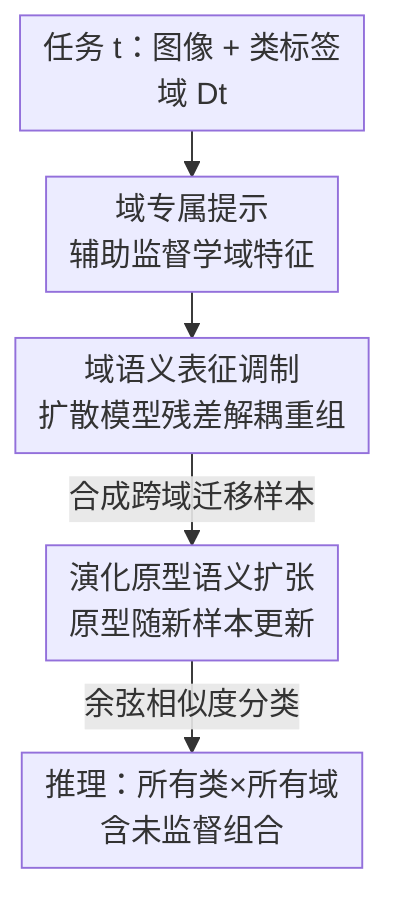

# XIL: Cross-Expanding Incremental Learning

**会议**: ICLR 2026  
**OpenReview**: [Published as a conference paper at ICLR 2026](https://openreview.net/)（⚠️ 链接以原文为准）  
**代码**: 未提及  
**领域**: 持续学习 / 类增量学习 / 域泛化  
**关键词**: 类增量学习, 跨域迁移, 域专属提示, 生成式回放, 原型分类

## 一句话总结
本文提出一个全新的持续学习设定 XIL——类增量数据来自**不断变化的域**，且要求模型把新类「补」回旧域、把旧类「扩」到新域（双向域迁移 BiDoT），并给出框架 XEED：用域专属提示 + 扩散模型生成跨域迁移样本 + 演化原型分类，在强域偏移数据集上把 BiDoT 分数最高拉高 31.41%。

## 研究背景与动机
**领域现状**：类增量学习（CIL）让模型按时间顺序不断学新类、同时不忘旧类，近年「提示微调」（prompt tuning）路线因为能复用预训练大模型、用极小代价适配新任务而成为主流，效果常常超过全量微调。

**现有痛点**：几乎所有 CIL 方法都默认一个隐含假设——所有任务、训练和测试数据都来自**同一个域分布**。一旦域发生漂移（比如训练用工厂里拍的高清零件图，部署时却收到手机随手拍、技术图纸甚至手绘草图），性能就会断崖式下跌。已有一些工作尝试结合域适应/域泛化来缓解，但它们普遍假设各域之间**共享标签空间**（同一批类在每个域里都有数据），从而能借共享属性做迁移。

**核心矛盾**：真实世界里数据可用性在域和类之间是高度不均的——某个类可能只在它最初出现的那个域里有标注，换个域就**完全没有该类的任何样本**去学跨域共享属性；而且部署环境会反复切换、回退，要求模型在**所有见过的域**上都能识别**所有见过的类**，哪怕某些「类-域」组合从未被直接监督过。这正是传统 CIL 覆盖不到的盲区。

**本文目标**：把 CIL 扩展成一个能处理「跨域类增量 + 双向类-域关联扩张」的新设定，并给出可量化评测它的指标和一个能work的基线框架。

**切入角度**：作者先用实证说话——拿 Joint-FT 全量微调和一众 SOTA 方法，去测它们在「见过的域 × 见过的类」这些**新组合**上的准确率，发现全都大幅掉点（图 2），说明现有架构和训练协议**天生不具备**双向域迁移能力。既然模型自己学不会跨域共享属性，那就用生成模型「造」出这些缺失组合的样本喂给它。

**核心 idea**：定义新设定 **XIL**（Cross-Expanding Incremental Learning）和新指标 **BiDoT Score**；用扩散模型把「某类的语义」和「某域的风格」解耦再重组，合成出从未被监督过的「类-域」迁移样本，配合域专属提示和演化原型，让类语义在所有历史域上**双向扩张**。

## 方法详解

### 整体框架
XEED（Semantic Expansion through Evolving Domains）要解决的是：在任务 $t$ 只看到「类集 $C_t$ + 域 $D_t$」的情况下，让模型在推理时能泛化到所有「类-域」组合 $\bigcup_i \bigcup_j (C_i, D_j)$——包括从没直接监督过的组合。整套流程由三个环环相扣的组件组成：先用**辅助监督学出一组域专属提示**，把「这是哪个域」的风格信息编码进冻结的预训练特征提取器；再用一个**预训练扩散模型做表征调制**，把某个域的风格「迁移」到另一个任务的类上，无需训练地合成出缺失的跨域样本；最后用这些合成样本**持续更新演化原型**，让分类器的语义空间随域演进而双向扩张。整个过程是 rehearsal-free 的——原始数据用完即弃，只保留按类质心生成的伪样本。

形式化地，XIL 的任务序列为 $T_{XIL} = \{(C_1, D_1), (C_2, D_2), \dots, (C_t, D_t)\}$，类集互斥 $C_i \cap C_j = \varnothing$，且域分布随任务变化 $P^i_{XY} \neq P^j_{XY}$；推理评测集 $E_{XIL} = \bigcup_{i}\bigcup_{j}(C_i, D_j)$ 同时覆盖「知识保持」和「双向域迁移」。

### 关键设计

**1. 域专属提示 + 辅助监督：把「域风格」从「类语义」里剥出来**

痛点是：域在不断变，但模型必须能为旧类在任意历史域上抽出有意义的特征——可这些「类-域」组合根本没监督信号。作者的做法是给每个任务的域 $D_t$ 配一段可学习的提示 $P^{D_t} \in \mathbb{R}^{L \times D}$，插在 class token 之后、图像 patch 之前，组成输入 $z_i = [x_{cls}, P^{D_t}, x_{img}]$，喂进**冻结**的特征提取器 $f_\phi$，取 class token 位置输出作为图像表征 $h_i = f_\phi(z_i)[0]$。关键在于训练目标的设计：用一个辅助线性分类器 $A_\phi$ 在交叉熵下预测「该图在域 $D_t$ 内属于哪个类」，$L_{CE} = -\sum y_i \log A_\phi(h_i)$，且训练时**只更新提示 $P^{D_t}$ 和 $A_\phi$**，特征提取器全程冻结。

这里 trick 在于辅助监督起的是「正则」作用：因为类预测这件事由提示+辅助头共同完成，提示被逼着去编码**该域共享的风格特征**、而不去抢类专属语义（类语义由冻结主干和后续原型负责）——从而实现域与类的解耦，让提示成为一个「域风格开关」，给同一个主干按输入域条件化出不同的表征空间。

**2. 域语义表征调制：用扩散模型「造」出未监督的类-域组合**

这是双向迁移真正发生的地方，也是最巧的一步。痛点是某个类 $T^{t'}$ 只在它自己的域里被监督过，要把它「搬」到域 $t$，但手里既没有该组合的真样本、又不想再训练一个生成器。作者借 IP-Adapter + SDXL 做**训练-free** 的语义调制：先把图像条件 $I_i$（用 CLIP 图像编码器）和类名文本条件 $T_i$（用 CLIP 文本编码器）编码，再算一个**残差向量**抹掉类语义、只留域特征：

$$\delta^t_I = \text{Enc}_I(I^t_i) - \text{Enc}_T(T^t_i)$$

然后把目标类的文本 $T^{t'}_i$ 当语义、$\delta^t_I$ 当域条件，生成跨域迁移样本：

$$x^{t' \leftarrow t}_{transfer} = g_\theta(z, k, \text{Enc}_T(T^{t'}_i), \delta^t_I)$$

为了让「类语义来自 $T^{t'}$、域风格来自 $\delta^t_I$」互不污染，作者只在 transformer 中**负责布局/风格的特定 block** 注入 $\delta^t_I$ 修改 cross-attention，其余 block 保持类语义。生成时用很小的去噪步数 $k$——只改低层细节、保住高层语义，既防止过拟合原图又加快生成。这一步等于用 CLIP 空间的向量算术（图像-文本 = 域残差）把「域」拆成可加减的量，再请扩散模型按需重组，从而凭空补齐了训练里缺失的「类-域」格子。

**3. 演化原型语义扩张：让分类边界随合成样本持续生长**

有了源源不断的跨域合成样本，怎么把它们沉淀进分类器？作者放弃可训练的线性头，改用**域感知原型**：每个类 $c$ 在域 $D_t$ 下由一个原型向量表示，它是该类在该域下（含合成样本）特征嵌入的均值

$$\mu^{D_t}_c = \frac{1}{|E^{D_t}_c|} \sum_{x_i \in E^{D_t}_c} f_\phi(x_i, P^{D_t})$$

其中支持集 $E^{D_t}_c$ 随着新样本被合成/遇到而**不断扩张**，原型也随之动态更新——这就是「演化」的含义。推理时对测试特征 $h$ 取与所有原型的余弦相似度做分类 $\hat{y} = \arg\max_c \frac{\langle h, \mu^{D_t}_c \rangle}{\|h\|\|\mu^{D_t}_c\|}$。

由于推理时不知道测试图属于哪个域，作者还要先**选对域提示**：把测试图嵌入 $f_\phi(x)$ 和各域原型 $\mu^{D_t}$ 比距离，取最近的域 $\hat{D} = \arg\min_{D_t} \|f_\phi(x) - \mu^{D_t}\|^2$；域原型 $\mu^{D_t}$ 则是该域下各类原型再做一次跨类平均（式 9）。用原型而非线性头的好处是：新组合只要往支持集里加合成样本、原型自动平移，无需重训分类头，天然契合「语义空间随域演进而扩张」的诉求，也在域内方差小的数据集（Office-31）上比线性分类器更稳。

### 损失函数 / 训练策略
训练目标只有一项：辅助分类器在当前任务上的交叉熵 $L_{CE}$（式 3），且只更新域提示和辅助头，主干冻结。生成端无需训练（训练-free 调制），只调去噪步数。关键超参：提示长度 $L=5$，去噪步数 $k=50$；每类抽 5–10 个质心、合成 25–30 张样本；主干为 ImageNet1K 预训练 ViT-B/16，生成器为 SDXL + IP-Adapter。

## 实验关键数据

数据集选取要求「每个类在每个域都可见」，以便构造新「类-域」组合并测未见组合：**PACS**（风格差异大）、**DomainNet**（域风格差异大且标签漂移严重）、**Office-31**（环境差异、域内方差小）。指标：标准准确率（Avg/Final）+ 本文提出的 **BiDoT Score**（A-BiDoT 平均 / F-BiDoT 最终），后者专测在「未监督域」上对历史类的识别率（式 10–11）。

### 主实验

| 数据集 | 指标 | XEED | 次优基线 | 提升 |
|--------|------|------|----------|------|
| PACS | F-BiDoT | **65.19** | 33.78 (CPrompt) | +31.41 |
| PACS | Final Acc | **61.86** | 43.48 (S-Prompts) | +18.38 |
| Office-31 | F-BiDoT | **78.08** | 69.06 (SimpleCIL) | +9.02 |
| Office-31 | Final Acc | **80.72** | 75.84 (CODA-P) | +4.88 |
| DomainNet | F-BiDoT | **33.63** | 29.71 (CPrompt) | +3.92 |
| DomainNet | Final Acc | 35.30 | 37.26 (CPrompt) | −1.96 |

全数据集平均：标准准确率 +7.1%，BiDoT 最高 +31.41%。XEED 在三数据集上 BiDoT 全面领先；PACS/DomainNet 这类高跨域方差数据集上 BiDoT 差距尤其大，说明它确实把语义适配到了演化的域。仅 DomainNet 的 Final 标准准确率略低于 CPrompt，但其 BiDoT 仍最高（⚠️ 具体数值以原文 Table 1 为准）。

### 消融实验

| 配置 | PACS F-BiDoT | DomainNet F-BiDoT | Office-31 F-BiDoT | 说明 |
|------|------|------|------|------|
| XEED（完整） | **65.19** | **33.63** | **78.08** | 三组件齐全 |
| w/o prompts | 45.22 | 26.62 | 65.41 | 去域提示，仅原型 |
| w/o generation | 20.91 | 4.47 | 33.62 | 去合成样本 |
| w/o prototype | 18.85 | 5.24 | 35.60 | 换回线性分类头 |
| w/o inference | 52.33 | — | — | 推理随机选域提示 |

### 关键发现
- **生成 + 原型是双向迁移的命脉**：去掉合成样本（w/o generation）或去掉演化原型（w/o prototype）后，BiDoT 几乎崩盘——PACS 从 65.19 跌到 ~20、DomainNet 跌到 ~5，证明「造缺失组合 + 原型沉淀」缺一不可。
- **域提示提供稳定增益**：去掉提示后三数据集 BiDoT 普遍掉 7–20 分，但不像前两者那样崩，说明它是「锦上添花的解耦器」而非唯一支柱。
- **推理选域很关键**：随机选域提示（w/o inference）在 PACS 上 F-BiDoT 从 65.19 掉到 52.33，域感知的原型匹配确有必要。
- **泛化更均衡**：逐域分析里，EWC 在 DomainNet 的 Clipart 域比自身均值低 52.6%（强域偏置），而 XEED 最差域（Infograph）只偏离 4.8%；CODA-P 在 Office-31 Amazon 偏 13.3%，XEED 在 DSLR 仅偏 2.2%——合成 + 原型带来了更无偏的跨域泛化。

## 亮点与洞察
- **把「域」做成 CLIP 空间里可加减的残差向量**（图像嵌入 − 类嵌入 = 域特征），再请扩散模型按目标类重组——这是整篇最「啊哈」的设计：它把「缺失的类-域组合」从「采不到的数据」变成了「算得出的向量运算」，绕开了无监督跨域迁移的死结。
- **提出新设定 + 新指标 + 基线一条龙**：XIL 设定（域随任务变 + 双向类-域扩张）和 BiDoT Score 填补了 CIL 评测的盲区，给后续工作立了可比的标尺。
- **训练-free 的生成调制**值得迁移：只在负责布局/风格的特定 attention block 注入域残差、用极小去噪步保高层语义，这套「定点注入 + 浅去噪」的可控生成思路可复用到任何「保内容换风格」的数据增广任务。
- **rehearsal-free 友好隐私**：原始数据用完即弃、只留按质心生成的伪样本，在隐私/合规收紧的背景下比存真实 exemplar 更可落地。

## 局限与展望
- **依赖大型预训练生成器**：整套迁移建立在 SDXL + IP-Adapter + CLIP 之上，合成质量和域覆盖受这些模型先验制约；对预训练分布外的工业/医学等冷门域，残差解耦是否仍成立存疑。
- **生成开销与超参敏感**：每类要抽质心、合成 25–30 张样本，随类数/域数增长成本上升；去噪步数 $k$、提示长度等对结果有影响，论文未给大范围敏感性分析。
- **DomainNet 标准准确率未夺冠**：在标签漂移最严重的 DomainNet 上 Final Acc 略逊 CPrompt，说明在极端域差异下「生成迁移」的收益与「合成噪声」之间仍有 trade-off。
- **推理选域可能误判**：域原型匹配在域风格相近时易选错提示，进而连带分类错误，可考虑软加权多域提示替代硬选。

## 相关工作与启发
- **vs S-Prompts / CODA-P / CPrompt（提示式 CIL）**: 它们都默认共享域分布、专注「不遗忘」，提示只编码任务而不显式建模域；XEED 用提示编码**域风格**并辅以生成+原型显式补齐未监督组合，因而在 BiDoT 上大幅领先（PACS 上 +31.41）。
- **vs Kundu 2020 / Simon 2022 / Cho 2023（CIL + 域适应/泛化）**: 这些方法假设有标注目标域数据、或假设各域覆盖所有类；XIL 设定下**每个类只在一个源域出现**，必须靠生成做无监督的双向迁移，假设更弱、更贴近现实。
- **vs 生成式回放方法**: 传统生成回放是「重画旧类防遗忘」，XEED 把它升级为「重画**旧类在新域 / 新类在旧域**」的跨域组合合成，目标从「保持」扩展到「双向扩张」。

## 评分
- 新颖性: ⭐⭐⭐⭐⭐ 同时提出新设定、新指标和新框架，CLIP 残差 + 扩散重组的迁移思路很巧。
- 实验充分度: ⭐⭐⭐⭐ 三数据集 + 完整消融 + 逐域偏置分析到位，但缺超参敏感性和更多骨干验证。
- 写作质量: ⭐⭐⭐⭐ 动机与公式清晰，但部分图表（图 4–7）需结合原文才看得全。
- 价值: ⭐⭐⭐⭐ 为「域演化下的持续学习」立了可比基准，落地于机器人/工业等环境频繁切换的场景。

<!-- RELATED:START -->

## 相关论文

- [\[CVPR 2026\] HyCal: A Training-Free Prototype Calibration Method for Cross-Discipline Few-Shot Class-Incremental Learning](../../CVPR2026/self_supervised/hycal_training_free_prototype_calibration_for_cross_discipline_fscil.md)
- [\[ICLR 2026\] PredNext: Explicit Cross-View Temporal Prediction for Unsupervised Learning in Spiking Neural Networks](prednext_explicit_cross-view_temporal_prediction_for_unsupervised_learning_in_sp.md)
- [\[ICLR 2026\] Rethinking Unsupervised Cross-Modal Flow Estimation: Learning from Decoupled Optimization and Consistency Constraint](rethinking_unsupervised_cross-modal_flow_estimation_learning_from_decoupled_opti.md)
- [\[CVPR 2026\] Representation-Steered Incremental Adapter-Tuning for Class-Incremental Learning with Pre-Trained Models](../../CVPR2026/self_supervised/representation-steered_incremental_adapter-tuning_for_class-incremental_learning.md)
- [\[ICLR 2026\] Maximizing Incremental Information Entropy for Contrastive Learning](maximizing_incremental_information_entropy_for_contrastive_learning.md)

<!-- RELATED:END -->
