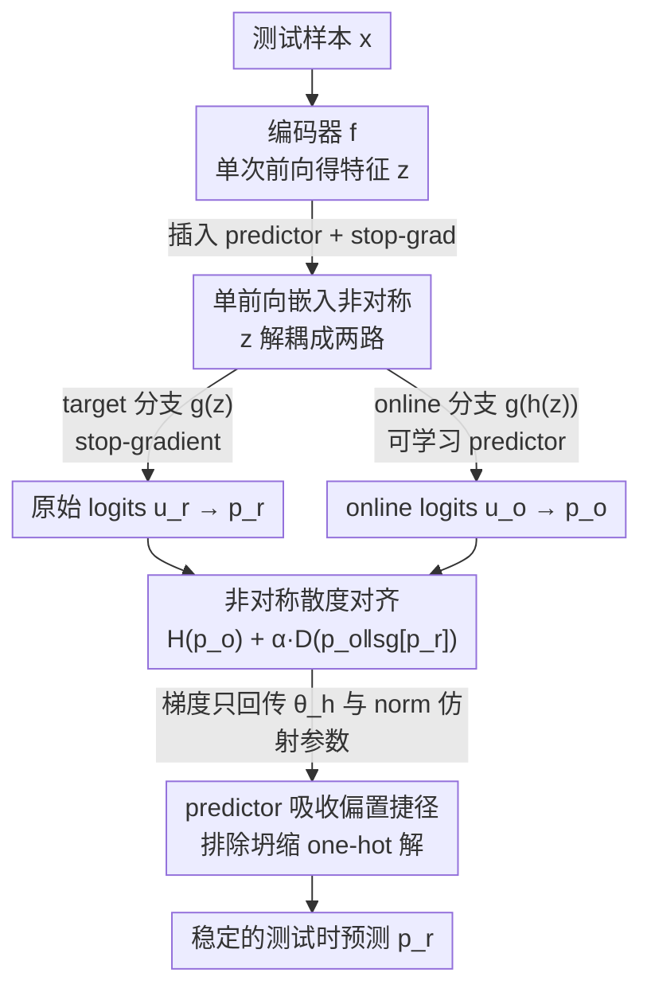

# ZeroSiam: An Efficient Asymmetry for Test-Time Entropy Optimization without Collapse

**会议**: ICLR 2026  
**OpenReview**: [https://openreview.net/forum?id=x6jHZYhnhL](https://openreview.net/forum?id=x6jHZYhnhL)  
**代码**: https://github.com/Cascol-Chen/ZeroSiam  
**领域**: 测试时自适应 / 自监督表示学习  
**关键词**: 测试时熵最小化, 模型坍缩, 非对称 Siamese, stop-gradient, 测试时自适应

## 一句话总结
针对测试时熵最小化容易坍缩成「所有样本预测同一类」的退化解，本文把负样本自由 SSL 里的「非对称结构」迁移过来，只在分类器前插一个可学习 predictor 加 stop-gradient，就在单次前向里造出 online/target 两条非对称分支，用对齐正则把恒定 one-hot 解排除在最优解之外——几乎零额外开销，却在视觉 TTA 和 LLM 推理两类任务、尤其是易坍缩的小模型上都更稳更强。

## 研究背景与动机
**领域现状**：测试时熵最小化（test-time entropy minimization）是一种很轻量的自适应范式——模型部署到新环境后，不需要任何标签，只用自己预测分布的熵作为自监督信号在线优化。在测试时自适应（TTA）里它用来对抗域偏移（Tent 是代表作），在 LLM 里它被用来在线激发推理能力、校准不确定性。核心吸引力是「无源数据、无需改训练流程」。

**现有痛点**：纯熵最小化有个致命的捷径——熵的定义只要求预测分布够「尖」，并不要求预测得「对」。于是模型可以走两条偷懒的路：(i) 无脑放大 logit 范数让分布变尖；(ii) 把所有 logit 都对齐到某个主导类。两者都会收敛到坍缩平凡解（例如对任何输入都输出同一个 one-hot），熵确实被最小化了，但模型啥也没学到，精度反而崩盘。在弱 base model（如 ConvNeXt-Tiny）或长流、类别失衡等 wild 场景下，源精度低、熵梯度不可靠，坍缩尤其严重。

**核心矛盾**：现有 TTA 方法（EATA / SAR / DeYO / COME）主要靠**启发式阈值筛掉不可靠梯度**或用 sharpness-aware loss 缓解扰动。但阈值难定、难跨域泛化，过滤只能是局部的——只要还剩一部分梯度在优化，熵依旧可以通过坍缩到恒定 one-hot 来最小化。也就是说，这些方法治标不治本，本质上的坍缩风险并没有从优化目标里被排除掉。

**切入角度**：作者注意到负样本自由 SSL（SimSiam / BYOL）面对的是几乎同款问题——两条分支会一起坍缩到同一个常量表示。SSL 的解法不是靠筛样本，而是靠**架构上的非对称**（一条分支带 predictor、另一条带 stop-gradient），让恒定常量解天然带有非零的对齐损失，从而在结构上排除坍缩。作者由此提出假设：非对称机制同样能阻止熵优化里的平凡解。

**核心 idea**：把「非对称」搬进测试时熵最小化。但 SSL 的非对称是为相似度学习设计的、还要额外过一遍 backbone，直接套不行。本文的关键是**在单次前向内嵌入非对称**：在分类器前插一个可学习 predictor 和 stop-gradient，把同一份特征解耦成 online、target 两条非对称分支，online 分支最小化熵、并向 target 分支做非对称对齐——用一个 predictor 的代价换来无坍缩的稳定自适应。

## 方法详解

### 整体框架
ZeroSiam 要解决的是「测试时只优化熵就会坍缩」这件事，整体思路是：**不去筛梯度，而是在网络结构上动一刀，让坍缩解不再是优化目标的有效极小值**。

具体地，给定测试样本 $x$，编码器 $f$ 只跑一次得到特征 $z=f(x;\theta_f)$。然后 $z$ 兵分两路：**target 分支**直接过分类器 $g$ 得到原始 logits $u_r=g(z;\theta_g)$，并对它做 stop-gradient；**online 分支**先过一个轻量线性 predictor $h$ 再过同一个分类器，得到 $u_o=g(h(z;\theta_h);\theta_g)$。两路 softmax 得到 $p_r,p_o$。损失由 online 分支的熵 $H(p_o)$ 加一个把 $p_o$ 拉向 $\mathrm{sg}[p_r]$ 的对齐正则组成。优化时只更新 predictor 参数 $\theta_h$ 和归一化层的仿射参数（视觉任务沿用 Tent 的设定；LLM 任务则更新 LoRA 参数）。predictor 初始化为恒等映射做 warm start，在线学习中迅速偏离恒等、自然造出非对称。

整条管线没有数据增强、没有额外 backbone 前向、也没有 teacher 模型，相比 Tent 只多了一个 predictor，开销可忽略（处理 5 万张图 ViT-Base 上 193s，与 Tent 持平，远低于 DeYO 的 280s）。

### 关键设计

**1. 单次前向内嵌入非对称：把单分支熵优化改造成 Siamese 结构**

熵最小化天然只有一条预测分支，而 SSL 的非对称是为「两条增强视图」设计的，还要多过一遍 backbone——直接照搬既不适用也不高效。本文的做法是**在分类器前、编码器后的位置插入 predictor $h$ 和 stop-gradient 算子**，让同一份特征 $z$ 分裂成两个非对称视图：target 分支 $u_r=g(z;\theta_g)$ 是原始 logits 并被 stop-gradient 冻结梯度，online 分支 $u_o=g(h(z;\theta_h);\theta_g)$ 经过 predictor 变换后再分类。这样只需编码器跑一次，就在单分支熵优化里造出了 Siamese 式的非对称，不需要增强、不需要额外前向、不需要 teacher。这是把 SSL 的「架构防坍缩」迁移到 TTA 的核心机关——非对称不是来自两个不同输入，而是来自同一特征上「带/不带 predictor」「回传/不回传梯度」的不对等。

**2. 非对称散度对齐：把恒定 one-hot 排除出有效极小值**

光有两条分支不够，还要有一个 loss 把它们绑起来。ZeroSiam 的目标函数是

$$L = H(p_o) + \alpha\, D\big(p_o \,\big\|\, \mathrm{sg}[p_r]\big),$$

其中 $H(p)=-\sum_c p_c\log p_c$ 是 online 分支的预测熵，$D(\cdot\|\cdot)$ 是散度（默认用对称 KL，$D(p\|q)=D_{\mathrm{KL}}(p\|q)+D_{\mathrm{KL}}(q\|p)$，同时惩罚对模式的欠覆盖与过覆盖），$\alpha$ 直接固定为 1 不调。熵项负责学判别性特征，对齐项负责让 online 输出不偏离被冻结的 target 输出。关键在于：因为 online 分支多了 predictor、target 分支被 stop-gradient，二者不对称，所以「对任何输入都输出同一个恒定 one-hot」这种坍缩解会带来非零的对齐损失——坍缩常量不再是 $L$ 的有效极小值。predictor 初始化为恒等保证 warm start，online 学习中迅速偏离恒等，制造出防坍缩所需的非对称（Table 8 显示哪怕用固定随机 predictor，仅靠打破对称就能把 Tent 的 47.3% 提到 60.7%，印证非对称本身的价值）。

**3. predictor 作为偏置捷径吸收器：不止防坍缩，还正则化偏置学习信号**

作者从理论与实证两面解释为什么这个简单结构有效。核心洞察是把「捷径」定义为：能被一个极简网络（即 predictor $h$，一个 FC 层）学到、能无脑降低 loss 却无助于泛化的模式。由于 predictor 容量极小，它会**优先吸收这些偏置捷径信号**，把熵优化里有偏的学习信号从主干转移到自己身上，再由对齐损失把这部分偏差显式惩罚掉。实证上（Figure 2），面对失衡比更高、更易坍缩的数据流，predictor 参数 $\theta_h$ 偏离恒等的速度和幅度更大，相当于**自适应地施加更强的对齐正则**；同时 Tent 的 logit L2 范数和 center dominance 一路飙升（坍缩），ZeroSiam 则把两者压住并稳定下来。理论上（Theorem 1）：$\alpha=0$ 时 online 分支比 target 分支更易沿坍缩方向变化；$\alpha>0$ 时 predictor 充当一个过滤器，抑制那些把 $p_o$ 推离 $p_r$、对应过度放大 logit 的梯度方向，系统收敛到 $p_o\to p_r$ 的稳定非坍缩平衡。这解释了一个关键现象——**即便没有发生坍缩，ZeroSiam 也能因为正则化了有偏信号而提升性能**。

### 损失函数 / 训练策略
目标函数即上文的 $L=H(p_o)+\alpha D(p_o\|\mathrm{sg}[p_r])$，$\alpha$ 固定为 1，$D$ 用对称 KL。可学习参数：视觉任务更新 predictor $\theta_h$ + 归一化层仿射参数（与 Tent 一致），LLM 任务更新 predictor + LoRA 参数。predictor 为单层线性、恒等初始化。Table 10 显示该机制对熵以外的目标（SLR / CE / $-p^2$）和多种散度（KL / rKL / JS / MSE）都通用，说明「非对称对齐」是一个可插拔的稳定化组件而非依赖特定 loss 形式。

## 实验关键数据

### 主实验
视觉任务在 ImageNet-C（level 5）上，覆盖 wild TTA 的三种场景：在线类别失衡偏移、15 种损坏混合的长流、batch size=1。模型横跨 ResNet50-GN / ViT-Base / ViT-Small / ConvNeXt-Tiny / Swin-Tiny。

| 场景（平均 Acc%） | NoAdapt | Tent | SAR | EATA | COME | DeYO | ZeroSiam |
|------|------|------|------|------|------|------|------|
| 在线标签偏移（Table 3） | 29.0 | 30.9 | 38.8 | 40.7 | 42.5 | 43.1 | **52.9** |
| 15 损坏混合长流（Table 2） | 29.9 | 14.3 | 39.5 | 42.9 | 34.4 | 38.1 | **44.2** |
| batch size=1（Table 4） | 29.0 | 33.2 | 37.2 | 36.0 | 43.0 | 44.0 | **52.5** |
| 盲点子集 bs=1（Table 6） | 29.0 | 21.7 | 33.8 | 33.5 | 33.6 | 29.8 | **52.0** |

LLM 在线推理（Llama3.1-8B-Instruct，数学推理）：

| 方法 | Math-500 | CollegeMath | AIME24 | Minerva | Average |
|------|------|------|------|------|------|
| 基线 | 49.20 | 25.00 | 3.33 | 20.96 | 24.62 |
| Tent | 50.00 | 24.17(−0.83) | 6.67 | 20.59 | 25.36 |
| COME | 49.80 | 25.42 | 6.67 | 22.74 | 26.16 |
| **ZeroSiam** | **52.60(+3.40)** | **26.25** | **13.33(+10.00)** | 22.06 | **28.56(+3.94)** |

ZeroSiam 在标签偏移下平均 52.9% vs SAR 38.8%，batch=1 比 DeYO 高 +8.5%；推理上 AIME24 直接 +10.00%，而多数 baseline 在综合性的 CollegeMath 上反而掉点（Tent −0.83%、SAR −0.75%），ZeroSiam 因正则化非泛化捷径反而 +1.25%。

### 消融实验

| 配置 | 关键指标 | 说明 |
|------|---------|------|
| Tent（无非对称） | 47.3 | ViT-Base 标签偏移基线 |
| ZeroSiam（线性 FC predictor） | 64.1 | 完整模型 |
| 固定随机 FC predictor | 60.7 | 仅靠打破对称就大幅超 Tent |
| FC+ReLU+FC（更深更非线性） | 64.0 | 加深无增益，predictor 只需吸捷径不需大容量 |
| ZeroSiam + EATA / DeYO | 49.0 / 53.9 | 作为即插即用组件，给 EATA +8.4%、DeYO +7.4% |

### 关键发现
- 防坍缩的核心来自「非对称」本身：固定随机 predictor（不训练）就能把 47.3%→60.7%，说明打破对称比 predictor 学到啥更关键。
- predictor 不需要大容量：加深成 FC+ReLU+FC 几乎无提升（64.0 vs 64.1），印证它的角色是「吸收偏置捷径」而非「学习丰富表示」。
- 盲点子集（只在被原模型误分类的样本上自适应）是最残酷的压力测试：DeYO 在 20 个场景里 12 个崩到比 NoAdapt 还差，ZeroSiam 仍稳定提升（29.0%→52.0%），即便伪标签全错也能可靠自适应。
- 抗噪声学习：先在纯高斯噪声上预自适应再做 TTA，CETA 从 67.3% 崩到 27.2%，ZeroSiam 始终维持 ≈72%，说明它能吸收并正则化非语义捷径。
- 机制通用：换不同熵替代目标（SLR/CE/$-p^2$）和不同散度（KL/rKL/JS/MSE）都有效，是可插拔的稳定化设计。

## 亮点与洞察
- **跨领域迁移做得极简**：把负样本自由 SSL 的「非对称防坍缩」思想搬到 TTA，却没有照搬两视图+双前向那套重型结构，而是用「分类器前插 predictor + stop-gradient」在单次前向里实现非对称——开销与 Tent 持平，这种「找到机制本质再做最小实现」的思路很值得借鉴。
- **从优化目标层面根治坍缩**：之前方法都在「筛掉坏梯度」打补丁，本文直接让坍缩 one-hot 不再是 loss 的有效极小值，是结构性的解法而非启发式过滤。
- **「即便不坍缩也能涨点」是反直觉的好结果**：predictor 作为低容量捷径吸收器 + 对齐正则，等于给在线自训练加了一个把偏置信号显式惩罚的旁路，这个视角可迁移到任何自训练/伪标签场景。
- **同一套机制打通视觉 TTA 与 LLM 推理两类任务**，且对小模型（最易坍缩）增益最大，泛用性强。

## 局限与展望
- 与样本筛选类方法（EATA/DeYO）结合时，并不保证超过单独 ZeroSiam——作者承认 ZeroSiam 本就对错误伪标签鲁棒，传统样本选择的收益与它部分重叠，如何更好融合留作未来工作。
- 理论分析依赖若干假设（Assumptions 1 & 2），对 predictor「吸收捷径」的刻画偏定性，predictor 究竟吸收了哪些具体模式仍是黑盒。
- 实验主要在 ImageNet-C 损坏鲁棒和数学推理上验证，更广的模态（检测/分割/多模态生成）下非对称是否同样有效尚待检验。
- predictor 仅用单层线性，可学习参数和归一化仿射一起更新——在参数高度受限、连 norm 层都没有的架构上能否照搬，文中未充分讨论。

## 相关工作与启发
- **vs Tent**: Tent 直接在单分支上最小化熵，无任何防坍缩机制，在 wild 场景下 logit 范数和 center dominance 一路飙升直接坍缩；ZeroSiam 在其上插一个 predictor+stop-grad 造非对称，把坍缩解排除，几乎不增开销却大幅提稳。
- **vs SAR / DeYO / EATA**: 这些方法靠启发式阈值/sharpness/样本重加权过滤不可靠梯度，治标不治本、对模型和场景敏感（弱模型上 DeYO 甚至 0.1% 精度）；ZeroSiam 从结构上根治坍缩，对错误伪标签也鲁棒。
- **vs SimSiam / BYOL（负样本自由 SSL）**: 同样用非对称（predictor + stop-gradient）防坍缩，但 SSL 面向预训练表示学习、需要增强和额外 backbone 前向、优化相似度；ZeroSiam 面向测试时熵最小化、单分支单前向、无增强无 teacher，并额外揭示了非对称在 TTA 中「正则化偏置捷径」这一超出 SSL 已知结论的新作用。

## 评分
- 新颖性: ⭐⭐⭐⭐⭐ 首个把 SSL 非对称结构引入 TTA 熵优化，且用单前向最小实现，机制新颖
- 实验充分度: ⭐⭐⭐⭐⭐ 5 种模型 × 多种 wild 场景 + LLM 推理 + 盲点/抗噪压力测试 + 理论分析，覆盖很全
- 写作质量: ⭐⭐⭐⭐ 动机与机制讲得清晰，理论部分稍密但有 Remark 串讲
- 价值: ⭐⭐⭐⭐⭐ 即插即用、零额外开销、对小模型增益大，部署实用性强

<!-- RELATED:START -->

## 相关论文

- [\[ICLR 2026\] Test-Time Efficient Pretrained Model Portfolios for Time Series Forecasting](test-time_efficient_pretrained_model_portfolios_for_time_series_forecasting.md)
- [\[ICLR 2026\] NEO — No-Optimization Test-Time Adaptation through Latent Re-Centering](neo_no-optimization_test-time_adaptation_through_latent_re-centering.md)
- [\[ICLR 2026\] Adaptive Test-Time Training for Predicting Need for Invasive Mechanical Ventilation in Multi-Center Cohorts](adaptive_test-time_training_for_predicting_need_for_invasive_mechanical_ventilat.md)
- [\[ICLR 2026\] Why Prototypes Collapse: Diagnosing and Preventing Partial Collapse in Prototypical Self-Supervised Learning](why_prototypes_collapse_diagnosing_and_preventing_partial_collapse_in_prototypic.md)
- [\[ICLR 2026\] Architecture-Agnostic Test-Time Adaptation via Backprop-Free Embedding Alignment](architecture-agnostic_test-time_adaptation_via_backprop-free_embedding_alignment.md)

<!-- RELATED:END -->
