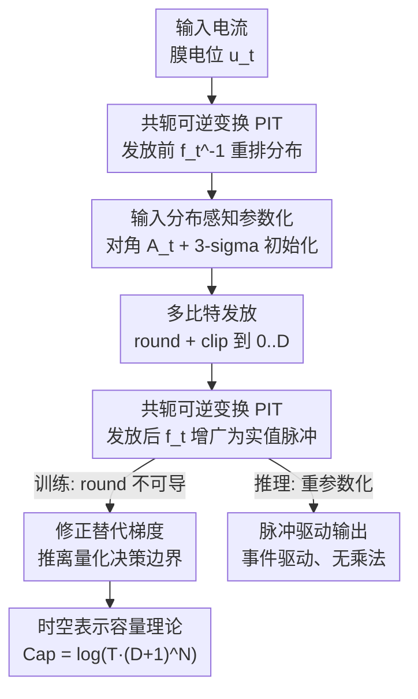

# Advancing Spatiotemporal Representations in Spiking Neural Networks via Parametric Invertible Transformation

**会议**: ICLR 2026  
**OpenReview**: [https://openreview.net/forum?id=3JwNXQzxll](https://openreview.net/forum?id=3JwNXQzxll)  
**代码**: https://github.com/YinsongYan/ICLR26  
**领域**: 脉冲神经网络 / 神经形态计算 / 表示学习  
**关键词**: 脉冲神经网络、参数化可逆变换、多比特脉冲、替代梯度、神经形态计算

## 一句话总结
针对脉冲神经网络（SNN）二值脉冲表示能力受限、替代梯度失配两大顽疾，本文提出参数化可逆变换 PIT——在神经元发放（firing）前后以共轭方式各做一次可逆线性变换，发放前把膜电位分布"重排"成易量化的形态、发放后把整数脉冲"增广"成跨时空的实值输出，同时配一个把输入推离量化决策边界的修正替代梯度，并用线性代数刻画了 SNN 时空表示容量；在 CIFAR、ImageNet、DVS 等数据集上多种架构均刷新 SOTA（如 SEW ResNet34 涨 5.62%）。

## 研究背景与动机
**领域现状**：SNN 用异步二值脉冲通信，把稠密的乘加（MAC）变成稀疏累加（AC），加上事件驱动（只在收到脉冲时才计算），天然低功耗、适合资源受限的实时场景。主流训练靠 BPTT + 替代梯度（surrogate gradient）直接训练；增强表示的路线包括复杂神经元动力学、归一化、多比特脉冲、注意力、以及 spike-driven transformer 等。

**现有痛点**：两个根子上的限制始终没解决。其一，二值脉冲的低精度表示天然损失信息——把全精度膜电位 $u$ 经发放算子 $g(\cdot)$ 压成 $\{0,1\}$ 脉冲，复杂分布的数据流上精度掉得厉害。以往工作大多在"发放之前"往神经元动力学里塞可学习参数或多隔室结构，等于在发放前加一个复杂函数，但**并没有真正扩大输出空间**，信息损失下降有限。其二，整数脉冲神经元普遍用裁剪矩形替代梯度（类似 STE，直接拿恒等函数当 round 的导数），会产生梯度失配（gradient mismatch），训练时输出在相邻量化态之间来回振荡，难以收敛到泛化好的解。

**核心矛盾**：表示能力和稳定训练这两件事必须同时解决——只在发放前做文章扩不了输出空间；只换替代梯度又压不住量化误差。而且 SNN 的时间维动力学要求"随时间变化、空间异质"的处理，传统量化文献那套"时空同质"的策略不适配。

**本文目标**：(1) 在不破坏脉冲驱动、事件驱动推理范式的前提下，真正扩大 SNN 的时空表示空间；(2) 给整数脉冲设计稳定的替代梯度；(3) 给"SNN 到底能表示多大空间"一个可度量的理论框架。

**切入角度**：作者把发放过程重新看成一次"信息传播中的变换"——既然信息损失来自 $u\to s=g(u)$ 这一步，那就在 $g$ 的**两侧**各加一个互逆的变换 $f_t$ 和 $f_t^{-1}$。发放前用 $f_t^{-1}$ 把膜电位分布重排到易量化的位置（少丢信息），发放后用 $f_t$ 把整数脉冲拉回实值并跨时空增广。因为两侧互逆，输入输出方差一致，深层网络里信息传播稳定。

**核心 idea**：用一对"共轭可逆变换"包住发放算子（$s(t)=f_t\circ g\circ f_t^{-1}(u(t))$），既在发放前减少量化误差、又在发放后增广实值脉冲表示，再靠重参数化（reparameterization）保证推理时仍是纯脉冲、无乘法。

## 方法详解

### 整体框架
方法建立在 Integer LIF（I-LIF）神经元上：普通 LIF 神经元发放二值脉冲 $s_t=H(u_t-\vartheta_{th})$，而 I-LIF 允许在训练阶段发放整数 $s_t=\mathrm{clip}(\lfloor u_t\rceil,0,D)$，$D$ 是最大整数发放值，推理时靠重参数化退回脉冲驱动。本文把参数化可逆变换 PIT 以**共轭**方式嵌进 I-LIF 的发放过程：每个时间步、每一层都有一个变换矩阵 $A_t^l$，发放前用 $(A_t^l)^{-1}$ 把膜电位变到易量化的坐标，量化（round + clip）之后再用 $A_t^l$ 变回去并增广成实值输出。整套动力学写成充电—发放—复位三步：

$$u_t^l=\lambda v_{t-1}^l+W^l s_{t-1}^l,\quad s_t^l=A_t^l\,\mathrm{clip}\!\left(\lfloor (A_t^l)^{-1}u_t^l\rceil,0,D\right),\quad v_t^l=u_t^l-s_t^l.$$

为了又省又稳，$A_t^l$ 设成对角阵 $A_t^l=\mathrm{diag}(a_t^l)$，于是发放里的"变换"退化成逐通道的乘除，几乎不增参数、也不破坏事件驱动推理；$a_t^l$ 用输入分布感知的 3-sigma 规则初始化、再随 BPTT 更新。训练时 round 不可导，用修正替代梯度把输入往远离量化边界推、压住振荡。最后作者给出一套线性代数框架，证明 SNN 的时空表示容量随发放比特 $D$、时间步 $T$ 呈对数关系，并解释 PIT 为何能扩容。整个输入→输出的转换流向如下：

### 关键设计

**1. 参数化可逆变换 PIT：用一对共轭变换包住发放算子，同时减损失、扩表示**

针对"发放前加函数扩不了输出空间"这个痛点，PIT 不在发放前单边做文章，而是在发放算子 $g$ 的两侧各放一个互逆变换：$s(t)=f_t\circ g\circ f_t^{-1}(u(t))$。直觉上，$f_t^{-1}$ 先把"难量化"的膜电位分布旋/缩到"易量化"的位置，$g$（round+clip）在那里量化时丢的信息更少；量化完 $f_t$ 再把结果变回原坐标，并把原本只能取 $\{0,\dots,D\}$ 的整数脉冲乘上实值系数，等于在时空两个维度上把脉冲"增广"成实值。这个设计的好处是双重的：一是给"减少发放误差"提供了额外自由度（前后一起调），二是共轭结构保证输入输出方差一致——这对深层网络的稳定信息传播很关键。更妙的是，因为 $f_t$ 取对角线性形式，推理时可以把变换系数吸收进权重（重参数化），所以推理阶段仍是纯整数脉冲、事件驱动、无乘法，低功耗优势没丢。

**2. 输入分布感知的对角参数化：3-sigma 初始化取代 min-max，避开离群值**

PIT 的核心就是怎么参数化 $A_t^l$。直接套量化文献常用的 min-max 会被输入里的大离群值带偏：量化范围不稳、收敛慢，而且在超低比特（$D$ 很小）时浪费大量宝贵的量化级、误差大。本文改用基于正态分布 3-sigma 规则的逐通道初始化：

$$a_t^l=\max\!\left(\,|\mu(u_t^l)-3\sigma(u_t^l)|,\;|\mu(u_t^l)+3\sigma(u_t^l)|\,\right)\big/\sqrt{D},$$

其中 $\mu,\sigma$ 用第一批训练数据的膜电位均值、标准差算。这样量化区间贴着膜电位真实分布的主体（覆盖 $\pm 3\sigma$ 即约 99.7% 的质量），而不是被极端离群点撑大，量化级用得更充分、误差更小、收敛更快。把 $A_t^l$ 设成对角阵则保证整件事在内存和计算上都几乎免费——发放里的矩阵运算退化成逐元素乘除。

**3. 修正替代梯度：给 round 加一个把输入推离决策边界的修正项**

整数发放里的 round 不可导，前人用矩形/STE 替代梯度（恒等函数当导数），会造成梯度失配，输出在相邻整数态之间振荡、收敛到泛化差的解。本文不直接用恒等近似，而是按"输入离 round 决策边界有多远"来修正梯度：

$$\frac{\partial\lfloor x\rceil}{\partial x}=1+\lambda\big(0.5-\mathrm{sign}(\mathrm{dis}(x))\,\mathrm{dis}(x)\big),\quad \mathrm{dis}(x)=x-\lfloor x\rfloor-0.5,$$

其中 $\mathrm{dis}(x)\in[-0.5,0.5]$ 是输入到决策边界的距离。这一项等价于在 $\|0.5-\mathrm{sign}(\mathrm{dis}(x))\cdot\mathrm{dis}(x)\|_2^2$ 上加 $\ell_2$ 惩罚，作用是**鼓励输入远离量化边界**——离边界越近、修正越强，把它往整数中心推。这样 round 输出的统计量更稳，训练振荡被压住，更容易收敛到泛化好的解。实验显示 $\lambda$ 在 $[0.001,0.1]$ 这个宽区间内精度波动 <1%，对超参不敏感。

**4. 时空表示容量理论框架：用线性代数证明 PIT 真扩容**

为了说明 PIT 不是经验调参而是真扩大了表示空间，作者给出可度量的定义。表示空间是脉冲张成的线性子空间 $\mathrm{Span}\{s\}=\{\sum_j k_j s_j\mid k_j\in\mathbb{R}\}$，表示容量取其势的对数 $\mathrm{Cap}=\log|\cdot|$。对多比特 SNN，时空表示容量为 $\mathrm{Cap}=\log\!\big(T\cdot(D+1)^N\big)$（$T$ 时间步、$N$ 隐维、$D$ 量化级），说明容量随 $D$ 对数（次线性）增长、随 $N$ 线性增长。引入 PIT 后输出变成 $\{A_t s_t\}$，把额外参数 $a_{ij}$ 揉进组合系数，给时空变化提供了更多自由度，从而扩大表示空间。Table 1 横向对比了 vanilla 二值脉冲（$\log(T\cdot 2^N)$）、三值脉冲、Real Spike 等，本文的 $\log(T\cdot(D+1)^N)$ 容量最高。⚠️ Corollary 1 中 PIT 的容量表达式与 Proposition 1 写成同形（均为 $\log(T\cdot(D+1)^N)$），扩容主要体现在实值系数带来的自由度上，细节以原文 Appendix C 证明为准。

## 实验关键数据

### 主实验
在 CIFAR10/100、ImageNet-1k（静态）与 CIFAR10-DVS、DVS-Gesture（神经形态）上跨多种架构评测。时间步统一记为 $T\times D$（$T$ 时间步、$D$ 整数发放上限，前人默认 $D=1$）。结果取 3 个随机种子平均。

| 数据集 | 架构 | 配置 $T\times D$ | 本文 PIT | 代表性对比 | 提升 |
|--------|------|------|------|----------|------|
| CIFAR10 | ResNet19 | 1×4 | **96.72%** | Trainable Ternary 95.80% (2×2) | — |
| CIFAR100 | ResNet19 | 1×4 | **81.59%** | Trainable Ternary 80.20% (2×2) | +1.39% |
| CIFAR100 | ResNet20 | 1×4 | 78.83% (RN18) | Real Spike 66.60% | +14.99%（vs Real Spike） |
| ImageNet-1k | SEW ResNet18 | 1×4 | **69.39%** | SEW ResNet18 baseline 63.18% | +6.21% |
| ImageNet-1k | SEW ResNet34 | 1×4 | **72.66%** | SEW ResNet34 baseline 67.04% | +5.62% |
| ImageNet-1k | E-SpikeFormer-M | 1×4 | **79.41%** | E-SpikeFormer-M 78.50% | +0.91% |

亮点：PIT 加到 SEW ResNet34 后（72.66%）反超 152 层 SEW ResNet（69.26%），且逼近其 ANN 对应物 ResNet34 的 73.31%；训练曲线显示加 PIT 后**仅训练一个 epoch 就超过同架构 baseline**，收敛更快。

### 消融实验

| 配置 | 关键指标 | 说明 |
|------|---------|------|
| $\lambda=0.1/0.01/0.001$ | CIFAR10 95.73/95.86/95.70% | 修正替代梯度对超参不敏感，宽区间波动 <1% |
| PIT vs LIF（CIFAR10 RN18） | 95.86% vs 94.22% | 同 S-ACE 预算下 +1.64%，且 NS-ACE 更低（4.31 vs 6.45G） |
| PIT vs QAT（CIFAR100 RN18） | 78.83% vs 77.91% | 同发放计数/逐通道 scale 下仍 +0.92% |
| 训练显存（ImageNet SEW RN34） | 24.66 vs 18.86 GB | 多耗显存换 +5.62% 精度 |

### 关键发现
- **PIT 同时提升精度和能效**：因为自适应调制减少了发放活动，PIT 的 NS-ACE（神经形态突触算力）甚至低于 vanilla LIF，是少见的"又准又省"。
- **膜电位可视化**：vanilla LIF 在时间维上分布几乎均匀、判别力弱；PIT 能在不同时间步（尤其 T=3、T=4）动态调整膜电位分布，更好地抓住数据流的时间结构。
- **超参鲁棒**：替代梯度的 $\lambda$ 在 $[0.001,0.1]$ 内几乎不影响结果，实际部署不用费力调参。
- **代价**：主要代价是训练显存上升（ImageNet 上 SEW ResNet34 多约 5.8GB），但换来 5%+ 的精度。

## 亮点与洞察
- **共轭可逆变换是最巧的设计**：把发放算子夹在一对互逆变换之间，发放前"重排"、发放后"增广"，一举同时解决"量化丢信息"和"输出空间小"两个问题；且互逆保证方差一致，深层稳定。这种"在难处理的算子两侧做可逆变换"的思路可迁移到任何含硬量化/不可导算子的网络。
- **重参数化保住了 SNN 的命根子**：所有花活只在训练时存在，推理靠重参数化把对角系数吸进权重，仍是纯脉冲、事件驱动、无乘法——没有牺牲 SNN 低功耗的根本卖点。
- **3-sigma 初始化避离群值**：用分布统计量而非 min-max 定量化范围，超低比特下省量化级、稳收敛，是个简单可复用的量化 trick。
- **替代梯度的"推离边界"视角**：把 STE 失配理解成输出在量化边界振荡，于是设计梯度修正项把输入往整数中心推——这个 $\ell_2$ 惩罚解释干净，可迁移到其他整数/低比特量化训练。
- **给 SNN 表示容量一个可度量定义**：$\mathrm{Cap}=\log(T\cdot(D+1)^N)$ 把"SNN 能表示多大空间"量化成 $T,D,N$ 的函数，为后续比较不同脉冲编码提供了统一标尺。

## 局限与展望
- **训练显存上升**：对角变换虽省参，但训练时多保存一套时空变换状态，ImageNet 上显存涨幅明显（SEW ResNet34 多约 5.8GB），大模型/长时间步场景需权衡。
- **理论扩容表达式存疑**：Corollary 1 中 PIT 的容量公式与基线写成同形，"扩容"更多落在实值系数自由度上而非集合势的显式增大，理论上对"容量到底扩大多少"的刻画还可更直接（以原文 Appendix C 为准）。
- **只验证了视觉分类**：实验集中在静态图像与 DVS 事件视觉分类，尚未在长序列时序建模、语音、强化学习等 SNN 也常用的场景上验证。
- **对角约束的代价未充分探讨**：把 $A_t$ 限成对角是为了效率，但牺牲了通道间耦合表达力，非对角/低秩结构是否能进一步扩容（Appendix F 有讨论）值得展开。

## 相关工作与启发
- **vs 发放前增强（PLIF / 可学习阈值 / 多隔室神经元）**：他们只在发放前往神经元动力学加可学习参数或结构，本文证明这类做法不真正扩大输出空间；PIT 在发放**前后**共轭地各加一次变换，从根上扩容。
- **vs 多比特/三值脉冲（Ternary / Trainable Ternary Spike）**：他们把二值扩到 $\{-1,0,1\}$ 提升表示，但容量仍是 $\log(T\cdot 3^N)$；本文用整数 $\{0,\dots,D\}$ + 实值增广，容量 $\log(T\cdot(D+1)^N)$ 更高，CIFAR100 上反超 1.39%。
- **vs Real Spike（实值脉冲）**：Real Spike 用逐通道实值系数 $a_j$ 增广二值脉冲，但只在空间维、且基于二值；PIT 的系数 $a_{ij}$ 跨时空异质，并配合整数发放与共轭重排，CIFAR100 上大幅领先（+14.99% on ResNet20 配置）。
- **vs I-LIF + STE 替代梯度（Luo et al. 2024）**：I-LIF 提供整数发放但用矩形 STE，易振荡失配；本文沿用 I-LIF 的整数发放与重参数化推理，但换成"推离决策边界"的修正替代梯度，稳定性与泛化更好。
- **vs 量化文献的 min-max / LSQ**：量化常用 min-max 或学习步长，时空同质；本文指出 SNN 的时间动力学需要时变、异质策略，用 3-sigma 输入分布感知初始化替代 min-max。

## 评分
- 新颖性: ⭐⭐⭐⭐⭐ 共轭可逆变换 + 整数发放 + 修正替代梯度 + 表示容量理论，组合既新又自洽。
- 实验充分度: ⭐⭐⭐⭐⭐ 静态/神经形态多数据集、多架构（ResNet/SEW/Transformer）、能效与显存全覆盖，3 种子取均值。
- 写作质量: ⭐⭐⭐⭐ 方法与理论清晰，但 Corollary 的扩容刻画与同形公式略显含糊。
- 价值: ⭐⭐⭐⭐⭐ 又准又省、保住脉冲驱动推理，为低延迟高精度神经形态系统提供了可落地路径。

<!-- RELATED:START -->

## 相关论文

- [\[CVPR 2025\] Neural Video Compression with Context Modulation](../../CVPR2025/signal_comm/neural_video_compression_with_context_modulation.md)
- [\[CVPR 2025\] Continuous Space-Time Video Resampling with Invertible Motion Steganography](../../CVPR2025/signal_comm/continuous_space-time_video_resampling_with_invertible_motion_steganography.md)
- [\[ICLR 2026\] Mamba-3: Improved Sequence Modeling using State Space Principles](mamba-3_improved_sequence_modeling_using_state_space_principles.md)
- [\[ICLR 2026\] TS-DDAE: A Novel Temporal-Spectral Denoising Diffusion AutoEncoder for Wireless Signal Recognition Model Pre-training](ts-ddae_a_novel_temporal-spectral_denoising_diffusion_autoencoder_for_wireless_s.md)
- [\[ICLR 2026\] Synchronizing Probabilities in Model-Driven Lossless Compression](synchronizing_probabilities_in_model-driven_lossless_compression.md)

<!-- RELATED:END -->
