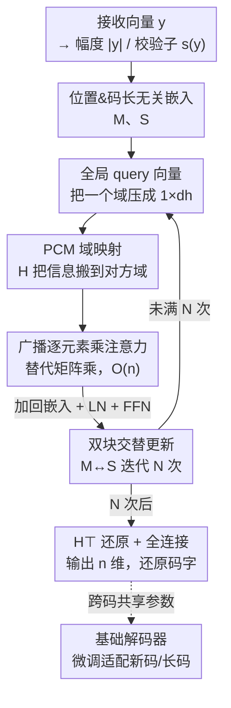

# Efficient Message-Passing Transformer for Error Correcting Codes

**会议**: ICLR2026  
**OpenReview**: [https://openreview.net/forum?id=Xk8cwnwu2e](https://openreview.net/forum?id=Xk8cwnwu2e)  
**代码**: https://github.com/iil-postech/efficientmpt  
**领域**: 信号处理 / 通信 / 纠错码解码  
**关键词**: 纠错码、Transformer 解码器、线性复杂度注意力、奇偶校验矩阵、基础模型

## 一句话总结
EfficientMPT 把 Transformer 纠错码解码器里 $O(n^2)$ 的标准注意力换成一套只靠"全局 query 向量 + 逐元素乘"的线性复杂度 EEC 注意力，在保持与 SOTA（CrossMPT）相当的纠错性能的同时，对长 LDPC 码把显存和 FLOPs 砍掉数十倍，并且参数量与码长无关、能当一个可微调的纠错"基础模型"。

## 研究背景与动机

**领域现状**：纠错码（Error Correcting Code, ECC）是噪声信道下可靠通信的根基。近年深度学习给 ECC 解码带来了新解法——用 Transformer 当解码器，在短码上已经做到了 SOTA 纠错性能。开山之作 ECCT（Error Correction Code Transformer）用带掩码的自注意力，把奇偶校验矩阵（Parity-Check Matrix, PCM）$H$ 转成掩码注入注意力；后续 CrossMPT 改用带掩码的交叉注意力，把幅度（magnitude）$|y|$ 和校验子（syndrome）$s(y)$ 分开、用两个交叉注意力交替更新，进一步提升了性能并缩小了注意力图。

**现有痛点**：这些 Transformer 解码器都被注意力模块的二次复杂度 $O(n^2)$ 卡住了（$n$ 是码长 / token 数）。ECCT 把 $|y|$ 和 $s(y)$ 拼成长度 $2n-k$ 的输入，注意力图大到 $(2n-k)^2$；CrossMPT 两个交叉注意力图加起来也有 $2n(n-k)$。这导致显存和算力随码长爆炸，实测里 ECCT 对所有长 LDPC 码、CrossMPT 对 $(1056,880)$ LDPC 码在实验环境下都因显存不足训不起来——也就是说，Transformer 解码器的优势根本伸不到长码上。

**核心矛盾**：纠错性能依赖注意力去建模比特间关系，但建模这套关系的"矩阵乘 + 大注意力图"恰恰是复杂度爆炸的根源。要长码，就得砍注意力的二次项；可砍掉之后还得保住纠错性能，这两者在已有框架里是对立的。

**本文目标**：设计一个注意力模块，让纠错 Transformer 的复杂度（参数量、显存、FLOPs）随码长近似线性增长，同时不掉纠错性能，并最好能做成跨码类共享、可微调到新码的基础模型。

**切入角度**：作者观察到标准注意力的贵处在 $QK^\top$ 和 $\text{softmax}(\cdot)V$ 这两个大矩阵乘上。但 ECC 解码本质是消息传递——把一个域（幅度）的"全局信息"传播到另一个域（校验子）。如果能把一个域的信息浓缩成一个"全局 query 向量"，再用 PCM $H$ 这个天然的域间映射把它广播到另一个域，那矩阵乘就能退化成逐元素乘。

**核心 idea**：用"全局 query 向量 + PCM 域映射 + 广播逐元素乘"替代标准注意力的矩阵乘和 value 投影，得到线性复杂度的 EEC（Efficient Error-Correcting）注意力，并据此搭出交替更新幅度/校验子的 EfficientMPT。

## 方法详解

### 整体框架

EfficientMPT 的输入是信道接收向量 $y$ 经预处理得到的两件东西：幅度向量 $|y|=(|y_1|,\dots,|y_n|)$ 和校验子向量 $s(y)=Hy_b$（$y_b=\text{bin}(\text{sign}(y))$）。它们各自经一个共享线性层嵌入成幅度嵌入 $M\in\mathbb{R}^{n\times d}$ 和校验子嵌入 $S\in\mathbb{R}^{(n-k)\times d}$。整个网络的目标是估计乘性噪声 $\tilde z_s$（满足 $y=x_s\tilde z_s$），最终输出 $n$ 维向量还原码字 $\hat x=\text{bin}(\text{sign}(y\,f(y)))$。

主体是 $N$ 次迭代的两个 **EfficientMPT block**，模仿消息传递：左块用校验子信息更新幅度嵌入 $M\to M'$，右块再用更新后的 $M'$ 去更新校验子嵌入 $S\to S'$，如此交替——这正是经典 BP 解码里"变量节点↔校验节点"来回传消息的神经版。每个 block 内核是 EEC 注意力：算注意力输出 $\Delta M$（或 $\Delta S$），直接加回原嵌入（$M\leftarrow M+\Delta M$），再过 LayerNorm 和带残差的前馈层。最后一个 block 出来的两个嵌入过归一化后，把校验子嵌入用 $H^\top$ 从 $(n-k)\times d$ 还原回 $n\times d$ 与幅度嵌入相加，过全连接层压成 $n$ 维输出。

关键是：所有可训练参数（嵌入权重 $W_M,W_S$、注意力的 $W_Q,W_K,W_O$、前馈层）都与比特位置无关、与码长无关——PCM $H$ 只是被"用来乘"而非编码进参数，所以同一个模型能跨码类共享参数，天然是基础模型。

### 关键设计

**1. 全局 query 向量：把一个域的整体信息压成一根向量**

标准注意力为了让每个 token 看到全局，要算 $n\times n$ 的注意力图，这是二次复杂度的来源。EEC 注意力反过来——既然 ECC 解码要的是"把幅度域的整体上下文传给校验子域"，那就别让每个位置各算各的 query，而是把所有位置的 query 行先加起来再过 softmax，得到一根全局 query 向量：

$$q^i_{\text{global}}=\text{softmax}\Big(\sum_{j=1}^{n} Q^i(j)\Big)\in\mathbb{R}^{1\times d_h},$$

其中 $Q^i(j)$ 是第 $i$ 个头 query 矩阵的第 $j$ 行。这根向量是幅度域所有元素的浓缩表示，相当于一个高层级的全局摘要，可以被均匀地施加到校验子域的每个位置。它的妙处在于：用一根 $1\times d_h$ 的向量取代了整张 $n\times n$ 注意力图的角色，全局上下文不再靠两两点积堆出来，而是靠"先求和再分发"实现，这是把二次降到线性的第一步。

**2. PCM 域映射：用奇偶校验矩阵把信息搬到对方域**

幅度域的全局 query 要传到校验子域，需要一座"桥"。作者直接用 PCM $H$ 当这座桥：把 key 矩阵 $K^i\in\mathbb{R}^{n\times d_h}$ 左乘 $H$ 投影到校验子域，$K^i_H=HK^i\in\mathbb{R}^{(n-k)\times d_h}$。这一步的理据很硬——$H$ 本身就定义了所有合法码字必须满足的约束 $Hx=0$，它精确刻画了幅度元素和校验子元素之间的关系，是码结构的天然编码。

这跟前人用 $H$ 的方式有本质区别：ECCT/CrossMPT 是把 $H$ 转成掩码矩阵、间接地遮挡注意力图里的无关位置；EfficientMPT 是**直接拿 $H$ 做矩阵投影**，把幅度信息真实地映射进校验子空间，码结构是被"用进"计算而不是"贴在"注意力分数上。也正因为 $H$ 不进参数、只参与前向乘法，模型才得以保持码长无关。论文还做了个验证：把 $H$ 换成随机初始化的可训练矩阵一起训，训完它会自发逼近真实 PCM 的结构，反过来印证了用 $H$ 的合理性。

**3. 广播逐元素乘注意力：把矩阵乘换成 $O(n)$ 的逐元素操作**

有了全局 query 向量和域映射后的 key，注意力输出不再走 $\text{softmax}(QK^\top)V$，而是把全局 query 向量广播后与 $K^i_H$ 逐元素相乘：

$$\Delta S=\big[q^1_{\text{global}}\circledast K^1_H,\ \cdots,\ q^h_{\text{global}}\circledast K^h_H\big]W_O\in\mathbb{R}^{(n-k)\times d},$$

$\circledast$ 是广播逐元素乘——把那根全局 query 向量沿着 $K^i_H$ 的每一行复制相乘，等于把幅度域的全局上下文直接"播撒"进校验子空间的每个位置。注意这里**彻底丢掉了 value 矩阵 $V$**：标准注意力靠 $V$ 承载被加权的内容，而 EEC 注意力里"内容"已经由 $K^i_H$ 携带、"权重"由全局 query 提供，少一次线性投影也少一次矩阵乘。

这套设计的复杂度账很清楚：唯一还带二次项的只剩与 PCM 的乘法 $HK^i$，但它不是主导计算，所以整体 FLOPs 近似线性增长（论文 Figure 5 里 EfficientMPT 的 FLOPs-码长曲线几乎是直线，ECCT/CrossMPT 则陡峭上翘）。注意力输出 $\Delta S$ 通过简单加法 $S\leftarrow S+\Delta S$ 融回嵌入，不需要任何复杂操作，这种"算出增量直接加"的更新方式也提升了训练效率。

**4. 位置/码长无关架构：让一个模型当跨码类的基础解码器**

把上面三点串起来，EfficientMPT 的全部可训练参数都不绑定具体比特位置和码长——幅度、校验子各用一份共享的 $W_M$、$W_S$，注意力权重也是码无关的，码结构信息全靠前向时乘 $H$ 注入。直接后果是参数量恒定：$N=6,d=128$ 时不管什么码都稳定在 1.09M（1,097,649）个参数，而 CrossMPT/ECCT 的参数量随码长疯涨（到 $(3328,640)$ 5G NR LDPC 码时 ECCT 要 21.98M）。

这让单个模型可以同时在多种码上训练（论文用 4 个码训出 FEfficientMPT），对训练过的码达到优异性能，对没见过的码只需少量微调就能解码——省掉了为每个新码从头训一个解码器的昂贵代价，对长码尤其有意义。

### 损失函数 / 训练策略
沿用 ECCT/CrossMPT 设定：1000 epoch、每 epoch 1000 个 minibatch、每 minibatch 128 个样本，Adam 优化器，学习率从 $10^{-4}$ 余弦衰减到 $5\times10^{-7}$。训练用全零码字、$E_b/N_0$ 从 3dB 到 7dB，测试用随机码字。短码配置 $h=8,N=6,d=128$；长 LDPC 码用 $N=10$。基础模型 FEfficientMPT 在 4 个码上训 4000 epoch。

## 实验关键数据

### 主实验

纠错性能（BER，越低越好）：在 BCH、LDPC、polar 等短码上，EfficientMPT 全面超过 ECCT，并与 SOTA 的 CrossMPT 相当；在长 LDPC 码上则超过最大迭代 20/50 的 BP 解码器，且是唯一能训起来的 Transformer 解码器（ECCT 对所有长码、CrossMPT 对 $(1056,880)$ 码均因显存不足训不动）。

| 码 | $E_b/N_0$ | EfficientMPT | CrossMPT | ECCT |
|------|------|------|------|------|
| BCH (31,16) | 6 dB | 3.58e-6 | 3.79e-6 | 2.35e-5 |
| LDPC (121,70) | 6 dB | 4.26e-8 | 2.46e-8 | 1.10e-7 |
| Polar (128,64) | 6 dB | 3.25e-7 | 3.88e-7 | 5.13e-6 |

复杂度（$N=6,d=128$，括号内为相对 ECCT 占比）：随码长增大，节省越夸张。

| 码 | 显存 EfficientMPT | 显存 CrossMPT | 显存 ECCT | FLOPs EfficientMPT | 参数量 EfficientMPT / ECCT |
|------|------|------|------|------|------|
| 802.11n LDPC (648,540) | 0.05 GB (15%) | 0.13 GB | 0.34 GB | 0.94 G (53%) | 1.09M / 1.78M |
| WiMAX LDPC (1056,880) | 0.07 GB (9%) | 0.26 GB | 0.82 GB | 1.65 G (43%) | 1.09M / 2.65M |
| 5G NR LDPC (3328,640) | 0.31 GB (2%) | 8.42 GB | 17.98 GB | 21.44 G (34%) | 1.09M / 21.98M |

对 $(3328,640)$ 5G NR LDPC 码，CrossMPT 和 ECCT 的显存分别是 EfficientMPT 的近 20× 和 50×；摘要里报的 $(648,540)$/$(1056,880)$ 码相对 ECCT 节省 85%/91% 显存、47%/57% FLOPs 即出自此表。

### 消融 / 分析实验

| 配置 | 现象 | 说明 |
|------|------|------|
| 用真实 PCM $H$ | 正常 | 默认设置，码结构靠 $H$ 注入 |
| 把 $H$ 换成可训练随机矩阵 | 训后逼近真实 PCM | 训练自发学出 PCM 结构，佐证用 $H$ 合理 |
| FEfficientMPT-0（不微调） | 在训练过的码上≈EfficientMPT | 做基础模型不掉性能 |
| FEfficientMPT-300（微调 300 epoch） | 未见码 (204,102) 上超 ECCT | 少量微调即可泛化到新码 |
| FEfficientMPT-200 | 未见长码 (1920,1600) 上超 BP | 短码预训→微调适配长码 |

### 关键发现
- **EEC 注意力是省钱主力**：复杂度优势全来自把大注意力图（ECCT 的 $(2n-k)^2$、CrossMPT 的 $2n(n-k)$）换成逐元素乘，唯一残留的二次项是与 PCM 的乘法、非主导，所以 FLOPs 近似线性。
- **节省随码长放大**：短码（如 BCH (31,16)）上显存只省到 94%，但长码上能省到 2%——这恰好打中"Transformer 解码器伸不到长码"的痛点。
- **基础模型可迁移到长码**：用短码训出的基础模型，靠微调就能在长 WiMAX LDPC 码上超过 BP，免去对长码做全量从头训练。

## 亮点与洞察
- **用"全局 query + 广播乘"重新定义注意力**：不是近似 softmax 注意力，而是认准 ECC 解码"把一个域的全局信息分发到另一个域"的本质，重新设计了一个特化注意力——把全局上下文压成一根向量再广播，巧妙地避开了 $n\times n$ 注意力图。这种"按任务本质重写注意力"的思路可迁移到其他有明确域间结构先验的任务。
- **PCM 从掩码升级为投影**：前人把 $H$ 当掩码（贴在分数上），本文直接拿 $H$ 做域映射矩阵（用进计算），既注入了码结构又顺手实现了码长无关——一个改动同时解决"嵌入结构"和"做基础模型"两个目标。
- **可训练 $H$ 自发逼近真实 PCM**：把 $H$ 换成随机可训练矩阵、训完它长成 PCM 的样子，这个分析既验证了设计、又暗示 PCM 是这类任务里近乎最优的结构先验。
- **参数量恒定 1.09M**：码无关参数化让模型规模不随码长涨，这在长码场景里既是省显存、又是可部署性的实打实优势。

## 局限与展望
- **性能上限被 CrossMPT 锚住**：论文目标是"在不掉性能前提下省复杂度"，所以 EfficientMPT 的纠错性能是"与 CrossMPT 相当"而非超越，个别码（如 LDPC (121,70)）BER 还略逊于 CrossMPT——它换来的是效率而非新的性能 SOTA。
- **仍残留与 PCM 的二次乘法**：$HK^i$ 这一步还是二次复杂度，只是被论证为非主导；对极长码或稠密 PCM，这一项是否仍可忽略需要进一步验证。
- **未见长码需要微调**：基础模型对未见长码（如 (1920,1600)）初始解不动，要靠微调才追上 BP——离"零样本通吃任意码"还有距离，微调成本和所需 epoch 也随码差异变化。
- **评测局限于 AWGN + 标准短/中长码**：实验集中在 AWGN 信道、BCH/LDPC/polar 等经典码类，更复杂信道、更长码或实际硬件部署下的表现尚未涉及。

## 相关工作与启发
- **vs ECCT**：ECCT 用带掩码自注意力、把 $|y|$ 与 $s(y)$ 拼接成 $2n-k$ 输入，注意力图 $(2n-k)^2$；本文分域处理、用线性注意力，显存/FLOPs/参数量全面更低，长码上更是 ECCT 训不动而 EfficientMPT 能训。
- **vs CrossMPT**：CrossMPT 用两个带掩码交叉注意力交替更新 $|y|$、$s(y)$，已比 ECCT 高效，但仍是矩阵乘、注意力图 $2n(n-k)$；本文继承"分域交替更新"的思想但把注意力进一步简化成逐元素乘，在性能持平的前提下把复杂度再砍一档。
- **vs FECCT（ECCT 基础模型）**：两者都想做跨码类基础解码器，但 FECCT 引入稠密加权矩阵反而让注意力图变稠密、复杂度上去了；EfficientMPT 靠码无关参数化 + PCM 投影，在更低复杂度下实现基础模型能力，对未见码微调后超过 ECCT。
- **vs 经典 BP 解码器**：在长 LDPC 码上 EfficientMPT 和 CrossMPT 都超过最大迭代 20/50 的 BP，且 EfficientMPT 是唯一能扩展到 $n>1000$ 仍可训练的 Transformer 解码器，把神经解码的优势第一次真正伸进长码区间。

## 评分
- 新颖性: ⭐⭐⭐⭐ 按 ECC 解码本质重写注意力、把 PCM 从掩码升级为投影，思路清晰且落地，但建立在 ECCT/CrossMPT 的分域消息传递框架之上。
- 实验充分度: ⭐⭐⭐⭐ 覆盖 BCH/LDPC/polar 多码类、复杂度三指标全测、含基础模型与可训练 PCM 分析；主要局限于 AWGN 信道。
- 写作质量: ⭐⭐⭐⭐ 动机—方法—复杂度账层层递进，三种注意力对比图直观；个别符号偏密。
- 价值: ⭐⭐⭐⭐⭐ 真正解决了 Transformer 纠错解码器"伸不到长码"的卡点，显存/FLOPs/参数量数十倍下降且性能不掉，工程意义大。

<!-- RELATED:START -->

## 相关论文

- [\[CVPR 2025\] ABC-Former: Auxiliary Bimodal Cross-domain Transformer with Interactive Channel Attention](../../CVPR2025/signal_comm/abc-former_auxiliary_bimodal_cross-domain_transformer_with_interactive_channel_a.md)
- [\[ECCV 2024\] PYRA: Parallel Yielding Re-Activation for Training-Inference Efficient Task Adaptation](../../ECCV2024/signal_comm/pyra_parallel_yielding_re-activation_for_training-inference_efficient_task_adapt.md)
- [\[ICLR 2026\] Synchronizing Probabilities in Model-Driven Lossless Compression](synchronizing_probabilities_in_model-driven_lossless_compression.md)
- [\[ICLR 2026\] TS-DDAE: A Novel Temporal-Spectral Denoising Diffusion AutoEncoder for Wireless Signal Recognition Model Pre-training](ts-ddae_a_novel_temporal-spectral_denoising_diffusion_autoencoder_for_wireless_s.md)
- [\[ICLR 2026\] Lossy Common Information in a Learnable Gray-Wyner Network](lossy_common_information_in_a_learnable_gray-wyner_network.md)

<!-- RELATED:END -->
