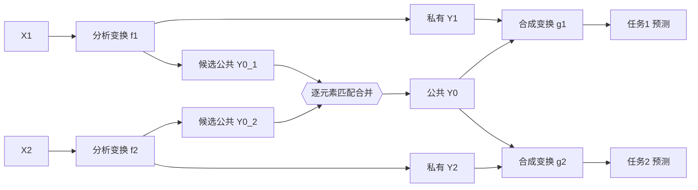

# Lossy Common Information in a Learnable Gray-Wyner Network

**会议**: ICLR 2026  
**OpenReview**: [https://openreview.net/forum?id=v05SW2X3IC](https://openreview.net/forum?id=v05SW2X3IC)  
**代码**: [github.com/adeandrade/research](https://github.com/adeandrade/research)  
**领域**: 信源编码 / 面向机器的编码 / 信息论表示学习  
**关键词**: Gray-Wyner Network, 有损公共信息, transmit-receive tradeoff, 多任务编码, 可学习熵模型  

## 一句话总结
把信息论里的经典 Gray-Wyner 网络做成可学习的三通道编解码器，用一个带 β 超参的目标函数把两个视觉任务之间的"公共信息"和"私有信息"分离开，并在"发送速率"与"接收速率"之间做可调权衡。

## 研究背景与动机
**领域现状**：多任务场景下，同一张图被用于多个机器视觉任务（检测、分割、深度估计等），这些任务彼此语义不同却往往共享大量重叠信息。"面向人和机器的编码"（coding for humans and machines）这条线的主流做法只设两个通道——一个公共通道 + 一个（重建任务专用的）私有通道，且默认机器任务用到的所有信息对重建都有用。

**现有痛点**：当一对任务既有公共信息（CI）、又各自有私有信息时，两通道结构不够用；而要把两任务之间的公共信息"完全干净地"隔离到一个通道里，在有损编码下几乎不可能做到——总会有一部分该公共的信息漏到私有通道，或一部分非公共信息混进公共通道。

**核心矛盾**：这正是 transmit-receive 权衡。**发送速率** $R_t=R_0+R_1+R_2$（单设备上同时做两个任务时传的总量）与**接收速率** $R_r=2R_0+R_1+R_2$（两个任务分别在不同设备上做时传的总量）无法同时取到最优：往公共通道多塞点东西，$R_t$ 可以最优但 $R_r$ 变差；反之亦然。这两端正好对应信息论里的两个公共信息量——Wyner 公共信息 $C$（保证 $R_t$ 最优所需的最少公共信息）与 Gács-Körner 公共信息 $K$（保持 $R_r$ 最优能放进公共通道的最多信息）。

**本文目标**：构造一个能真正分离两任务公共信息的可学习网络，并提供一个能在 $C$ 与 $K$ 之间任意取点的优化目标。

**核心 idea**：**[可学习的 Gray-Wyner 网络]** 把经典 GWN 的三通道（一个公共 + 两个私有）实现成神经编解码器，用可学习熵模型充当速率函数，并引入单一超参 $\beta$ 沿 transmit-receive 权衡曲线滑动取点。

## 方法详解

### 整体框架
两个输入源 $X_1,X_2$（实验中退化为同一张图 $X$）各自经过一个分析变换 $f_1,f_2$ 编码，输出被量化并拆成"私有 + 候选公共"两部分；两条分支给出的候选公共张量被合并成一个真正的公共表示 $Y_0$，与各自私有表示 $Y_1,Y_2$ 一起进入熵模型编码、再经合成变换 $g_1,g_2$ 还原出两个任务目标 $\hat Z_1,\hat Z_2$。

### 关键设计

**1. 有损公共信息的上下界定理：把两个公共信息量夹在交互信息之间。** 论文把 Wyner（1975）在无损情形下的结果推广到有损情形，证明 $K(X_1,X_2;D_1,D_2)$ 与 $C(X_1,X_2;D_1,D_2)$ 分别是交互信息 $I(X_1,X_2;\hat Z_1;\hat Z_2)$ 在"达到接收速率的元组集合"上取 max、与在"达到发送速率的元组集合"上取 min 的界：$K \le \max_{\hat Z^{(r)}} I \le \min_{\hat Z^{(t)}} I \le C$。只有当 max 与 min 重合、且公共部分 $W$ 能从私有信息里完全可分离时两者才相等。这给出了一个关键洞察——**$K$ 和 $C$ 之间通常有间隙**（对相关系数 $1-\rho$ 的高斯源 $K$ 甚至为零），所以"探索 transmit-receive 权衡"不是锦上添花，而是绕不开的必需。

**2. 把 Gray-Wyner 目标改写成可微分的熵优化（Theorem 2）。** 经典 GWN 目标 $T(\alpha_1,\alpha_2;D_1,D_2)=\inf\{I(X_1,X_2;Y_0)+\alpha_1 R_{X_1|Y_0}(D_1)+\alpha_2 R_{X_2|Y_0}(D_2)\}$ 因对 $P_{Y_0}$ 缺乏凹/凸性而难优化。论文假设各通道由确定性函数 $Y_0=f_0(X_1,X_2)$、$Y_{1,2}=f_{1,2}(X_{1,2})$ 给出，证明该目标可等价写成熵形式 $\inf\{H(Y_0)+\alpha_1 H(Y_1|Y_0)+\alpha_2 H(Y_2|Y_0)\}$。再用可学习熵模型给出的速率函数 $r_0(Y_0)=-\mathbb{E}[\log\tilde P(Y_0)]$、$r_{1,2}(Y_{1,2},Y_0)=-\mathbb{E}[\log\tilde P(Y_{1,2}|Y_0)]$ 替换熵项，问题就落进了标准可学习编解码器的训练框架。

**3. 用 β 单旋钮在 Wyner 与 Gács-Körner 之间滑动。** 设 $\alpha_1=\alpha_2$、$\beta=1/\alpha_{1,2}$，做拉格朗日松弛后得到训练损失
$$L=\inf\big\{\beta\,r_0(Y_0)+r_1(Y_1,Y_0)+r_2(Y_2,Y_0)+\lambda_1 d_1(\hat Z_1,Z_1)+\lambda_2 d_2(\hat Z_2,Z_2)\big\}.$$
$\beta=1$ 优化发送速率 $R_t$（对应 $R_0=C$），$\beta=2$ 优化接收速率 $R_r$（对应 $R_0=K$），$\beta=3/2$ 同等兼顾两者；$\beta\in(1,2)$ 之外则可能落到次优配置。直觉是 $\beta$ 直接给公共通道的使用"定价"——价高就少往公共通道塞、价低就多塞。

**4. 逐元素匹配合并 + 辅助损失，把两条分支的候选公共表示对齐成真正的公共通道。** 两条分支各产出候选公共张量 $Y_0^{(1)},Y_0^{(2)}$，按逐元素规则合并：相等处取 $\tfrac12(Y_0^{(1)}+Y_0^{(2)})$（自动微分让梯度流回两侧），不等处置 0。再加辅助项
$$L_{aug}=L+\mathbb{E}\Big[\tfrac{\gamma}{|Y_0|}\big\|Y_0^{(1)}-Y_0^{(2)}\big\|_2^2\Big]$$
鼓励两侧对齐。$\gamma$ 太小则元素永不匹配、太大则分布退化，两种情况都让公共通道被闲置；实践中固定 $\gamma=1$、改用降低公共通道成本 $\beta$ 来调控，从而把超参收敛到单一的 $\beta$。此外私有通道熵模型 $h_1,h_2$ 以 $Y_0$ 为上下文做条件编码，处理私有与公共通道间的冗余；合成变换则把私有表示与公共表示拼接后输入（而非只用私有），降低让表示互相兼容的学习难度。

## 实验关键数据

### 主实验（三个真实视觉双任务，rate-accuracy 曲线 BD-rate vs Joint）

| 数据集 / 任务对 | Independent | Proposed (Transmit) | Proposed (Receive) |
|---|---|---|---|
| Cityscapes：语义分割 + 深度估计 | +143.69% | **+22.32%** | +51.97% |
| COCO 2017：目标检测 + 关键点检测 | +77.56% | **+13.16%** | +42.70% |

（BD-rate 越低越好，相对 Joint 基线计算。提出方法显著优于 Independent，且接近 Joint。）三个视觉实验平均在发送速率上相对单任务编解码器取得 **−81.58% 的 BD-rate** 优势。

### 消融 / 合成数据集（线性回归双任务，对比编码器架构与 β）

| 对比项 | 结论 |
|---|---|
| Shared vs Separated vs Combined（β=1，transmit）| Shared BD-rate +10.42% 优于 Separated +71.07%、Combined +87.55% |
| 公共通道速率 vs 经验互信息 | β=1 高于互信息，β=2 低于互信息，β=3/2 居中——验证 β 确实在权衡曲线上滑动 |
| β 取值 | β=3/2 在 transmit 与 receive 上都仅略优于 β=1 / β=2，是该问题的合理折中 |

### 边界案例（Colored MNIST，三种着色 PMF）

| PMF | 互信息 | 现象 |
|---|---|---|
| Dependent（一色对一字）| $\log_2 10$ | transmit 速率最低，几乎全部信息进公共通道 |
| Independent（颜色均匀随机）| 0 | receive 速率最低，公共通道速率极低 |
| Mixture（每字一子集颜色）| 1.4 | 公共信息不可分离，性能介于两者之间 |

### 关键发现
- β 这个单旋钮能让公共通道速率分别落在经验互信息之上 / 之下 / 居中，实证地走出了 transmit-receive 权衡曲线。
- 在"零互信息"和"完全依赖"两个极端边界都能正确退化，说明方法没有写死任何关于任务相关性的假设。
- Shared 架构（双分析变换、各自看到两源）一致优于 Separated 与 Combined，呼应了附录中基于泛化误差的"表示兼容性"理论解释。

## 亮点与洞察
- **把一个 1974 年的信息论结构真正"训练"起来**：不是借个名词，而是把 Gray-Wyner 目标严格改写成可微熵优化（Theorem 2），让经典理论与可学习编解码器对接。
- **单超参 β 的优雅**：用一个有清晰信息论含义（$\beta=1\to C$、$\beta=2\to K$）的旋钮统一控制公共/私有信息分配，避免了多任务编码常见的一堆难调权重。
- **诚实地承认"完全分离不可达"**：Theorem 1 把这件事量化成 $K$ 与 $C$ 之间的交互信息间隙，从理论上论证了为什么必须做权衡而非追求完美隔离。

## 局限与展望
- **只扩展到两任务**：通道数随任务数指数增长，三任务以上需要更动态的架构，论文只给了方向性展望。
- **实验中 $X_1=X_2$**：真实视觉实验把两源退化成同一张图，未验证两个物理上不同源的设定。
- **经验速率显著高于理论值**：与多数可学习编解码器一样，实测速率比理论界高出可观的量（约一个数量级内），离信息论下界还有距离。
- **Mixture（不可分离公共信息）情形性能下降**：当公共信息本身难分离时，方法相对其他 PMF 明显变差。

## 相关工作与启发
- **信息论根基**：Gray-Wyner Network（1974）、Wyner 公共信息（1975）、Gács-Körner 公共信息（1973）、Viswanatha 等（2014）对二者权衡的刻画。
- **可学习图像编码**：Theis 等（2017）、Ballé 等（2018，scale hyperprior）、He 等（2022），本文沿用其分析/合成变换与熵模型范式。
- **面向人和机器的编码**：Choi & Bajić（2022）的两通道拆分、Foroutan 等（2023）的双分析变换、de Andrade & Bajić（2024）的公共通道辅助重建任务，本文把它推广到三通道 + 公共信息分离。
- **启发**：信息论里的"可达区域"概念可以被翻译成可学习系统的"可调超参轨迹"——这种把经典 rate region 落到神经网络训练上的思路，对其他多任务/分布式推理的表示压缩问题都有借鉴意义。

## 评分
- **新颖性**: ⭐⭐⭐⭐⭐ 把经典 Gray-Wyner 网络与有损公共信息严格做成可学习系统，并给出连接 Wyner 与 Gács-Körner 的有损上下界定理，理论与方法都新。
- **实验充分度**: ⭐⭐⭐⭐ 合成数据 + Colored MNIST 边界案例 + 两个真实视觉双任务，覆盖了从理论验证到实用场景；但真实实验中两源退化为同一图、且未扩展到 3 任务。
- **写作质量**: ⭐⭐⭐⭐ 信息论铺陈清晰、定理与目标推导环环相扣；符号密集，对不熟悉 rate-distortion 的读者门槛偏高。
- **价值**: ⭐⭐⭐⭐ 为分布式机器推理 / 选择性检索 / 面向机器的编码提供了有理论保证、可调权衡的压缩框架，平均 −81.58% 发送速率 BD-rate 的实用收益可观。

<!-- RELATED:START -->

## 相关论文

- [\[ICCV 2025\] Generalizable Non-Line-of-Sight Imaging with Learnable Physical Priors](../../ICCV2025/signal_comm/generalizable_non-line-of-sight_imaging_with_learnable_physical_priors.md)
- [\[ECCV 2024\] QueryCDR: Query-based Controllable Distortion Rectification Network for Fisheye Images](../../ECCV2024/signal_comm/querycdr_query-based_controllable_distortion_rectification_network_for_fisheye_i.md)
- [\[ICML 2025\] Large Language Model (LLM)-enabled In-context Learning for Wireless Network Optimization](../../ICML2025/signal_comm/large_language_model_llm-enabled_in-context_learning_for_wireless_network_optimi.md)
- [\[ICLR 2026\] Mamba-3: Improved Sequence Modeling using State Space Principles](mamba-3_improved_sequence_modeling_using_state_space_principles.md)
- [\[ICLR 2026\] Advancing Spatiotemporal Representations in Spiking Neural Networks via Parametric Invertible Transformation](advancing_spatiotemporal_representations_in_spiking_neural_networks_via_parametr.md)

<!-- RELATED:END -->
