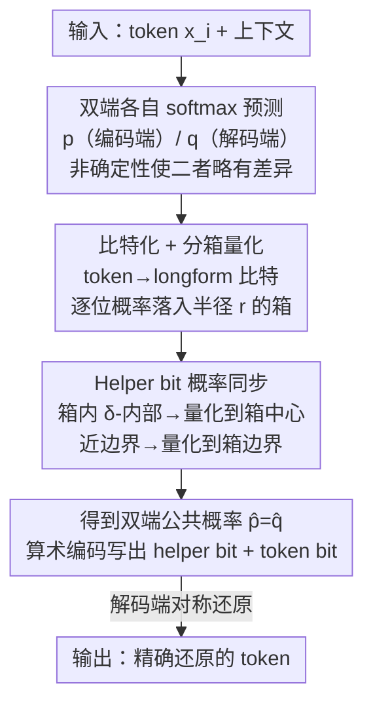

# Synchronizing Probabilities in Model-Driven Lossless Compression

**会议**: ICLR 2026  
**OpenReview**: [https://openreview.net/forum?id=nGzYkW4FSB](https://openreview.net/forum?id=nGzYkW4FSB)  
**代码**: 无  
**领域**: 信号处理与通信 / 无损压缩 / 信息论  
**关键词**: 无损压缩, 算术编码, 模型驱动压缩, 预测失配, 非确定性

## 一句话总结
针对 LLM 驱动的无损压缩中"编解码两端预测概率必须逐位完全一致、否则级联解码崩溃"的致命问题，本文提出 PMATIC——一种把比特概率量化到分箱、再用低熵 helper 比特让两端锁定同一量化概率的算术编码替代方案，能容忍有界的预测失配，理论上保证正确解码，实测在真实跨机非确定性下全部文件正确还原，同时压缩率仍大幅领先 gzip/cmix 等传统工具。

## 研究背景与动机

**领域现状**：无损压缩的经典思路是"概率预测 + 算术编码"——对每个符号用模型预测它在当前上下文下的出现概率，把整条消息编码成 $[0,1)$ 区间内的一个子区间，概率越高的符号让区间收缩越少、占用比特越少。深度模型（尤其是 LLM）能捕捉数据里丰富的依赖关系，把它当作预测器配上算术编码，近期已被证明能在文本、图像等领域显著超越 gzip、CMIX 这类传统压缩器，逼近信息论极限。

**现有痛点**：算术编码对数值极其敏感。它要求**编码端和解码端在每一步都算出分毫不差的概率分布**——只要某一位上两端概率有一点点偏差，就可能解出错误的 token，而这个错误 token 会污染后续所有 token 的上下文，导致整条消息从这一点开始全部解码失败（级联崩溃）。

**核心矛盾**：现代神经网络推理是**非确定性**的。GPU 浮点运算的执行顺序不同会带来舍入差异，不同硬件、不同库版本、不同计算图都可能让"同样的输入、同样的权重、同样的随机种子"产生不同的 logits。CUDA/cuDNN 官方文档都明确不保证可复现性。于是编码端和解码端（往往跑在不同机器上）几乎不可能拿到逐位相同的预测，算术编码在这种条件下"开箱即死"。

**本文目标**：设计一种能**容忍一定量预测失配**的编码算法，既保证正确解码，又把为此付出的压缩效率代价压到最低；并且要能直接替换现有模型驱动压缩流水线里的算术编码器（drop-in）。

**切入角度**：作者注意到，如果失配是任意大的，恢复就无望（解码端的预测对编码端毫无参考价值）；但如果失配**已知很小且有界**，两端就有机会"各退一步"，在一个**第三方的公共概率分布**上达成一致。关键是：用同一个模型、同一份输入，两端 logits 的差异在 $L_\infty$ 范数下被一个很小的 $\varepsilon$ 界住是合理假设。

**核心 idea**：与其逼两端算出完全相同的概率，不如把概率**量化到离散的"箱"上**，再用极少量旁路信息（helper 比特）让两端在每一位上都坍缩到同一个量化值——把"精确同步"这个不可能任务，换成"在容差内同步"这个可达成任务。

## 方法详解

### 整体框架
PMATIC（Probability Matching Interval Coding）是算术编码的替代品：输入是一串 token 和驱动它的预测模型，输出是压缩比特流；解码端用（可能略有偏差的）同一模型把比特流还原回原串。它不直接对 token 的多元概率做算术编码，而是先把每个 token 摊成一串二进制比特，逐位编码；编码每一位时，不用模型给出的精确比特概率，而是用它**量化后**的版本，并额外发一个 helper 比特告诉解码端"该量化到哪里"，从而保证两端用的是**字面上同一个**概率值。

整条流水线对单个 token 的处理是：用编码端模型算出 next-token 概率 → 把 token 映射成长度 $\ell=\lceil\log_2|\mathcal{A}|\rceil$ 的 longform 比特串 → 对每一位算出条件比特概率并落到某个分箱 → 由分箱位置决定 helper 比特、并把概率量化到"箱中心"或"箱边界" → 用算术编码依次写出 helper 比特和 token 比特。解码端对称地先解 helper 比特、再据此决定如何量化自己的概率、解出 token 比特。只要两端预测的差异在容差内，两端量化出的概率必然逐位相等，解码就正确。

### 关键设计

**1. 把"概率匹配"形式化为有界失配问题：$L_\infty$ logit 界 → 条件 TV 界**

这是全文的理论地基，针对"非确定性到底该如何刻画"这个含糊点。作者把编解码两端的模型抽象成两个函数 $M_{\text{Enc}}, M_{\text{Dec}}$，对同一上下文分别输出 logit 向量 $u,v$，经 softmax 得到概率 $p,q$。合理假设是两端 logits 逐元素接近：$\|u-v\|_\infty\le\varepsilon$。但算术编码真正在意的是**条件概率**会不会被解错，于是作者定义了**条件总变差距离** $d_{\text{CTV}}(p,q):=\max_{\varnothing\ne S\subseteq\mathcal{A}} d_{\text{TV}}(p(\cdot|S),q(\cdot|S))$——即在任意非空子集 $S$ 上做条件后两分布的最大 TV 距离。

关键结论是 Proposition 1：$\|u-v\|_\infty\le\varepsilon \Rightarrow d_{\text{CTV}}(p,q)\le\varepsilon/2$。证明通过把条件 TV 写成 $|p(S^*|S)-q(S^*|S)|$ 的形式，取使差值最大的极端 logit 配置（$S^*$ 内全 $+\varepsilon$、外全 $-\varepsilon$），最终归结为 $\max_{p^*}\big(\frac{e^\varepsilon p^*}{e^\varepsilon p^*+e^{-\varepsilon}(1-p^*)}-p^*\big)=\tanh(\varepsilon/2)\le\varepsilon/2$。这一步把"硬件级的 logit 抖动"翻译成了一个**算法能直接使用的概率级容差** $\delta$，为后面的正确性证明铺好路。

**2. Longform 比特化 + 逐比特分箱量化**

直接对 token 的多元分布量化很难控制，本设计把多元概率**拆成一串二元决策**来逐位处理。每个 token 先用字典映射成长度 $\ell=\lceil\log_2|\mathcal{A}|\rceil$ 的 longform 比特串 $b_i$。编码第 $j$ 位时，用 next-token 概率向量对"前 $j-1$ 位已固定"这一事件做条件归一化，得到一个标量 $p_i(j)\in[0,1]$（即第 $j$ 位为 1 的条件概率）。

接着把区间 $[0,1]$ 切成等长的**箱**：半径 $r$、宽 $2r$，共 $m=1/(2r)$ 个箱（要求 $r=1/(2m)$ 为整数倒数，且 $r>2\delta$）。每个箱 $I_k=[2r(k-1),2rk]$，中心 $c_k=2r(k-1)+r$。再定义箱的 **$\delta$-内部** $I_k^\delta$：箱内距离任何箱外点都至少 $\delta$ 的那部分（首末箱因贴着 $[0,1]$ 边界单独定义）。这样做的意义是：若编码端概率 $p_i(j)$ 落在 $\delta$-内部，且两端差异 $\le\delta$，则解码端概率必然落在**同一个箱**里——为下一步的"无歧义同步"创造了条件。

**3. Helper bit：用一个低熵旁路比特让双端锁定同一量化概率**

这是 PMATIC 的核心机关，专治"两端不知道对方落在哪个箱"。每个 token 比特前，编码端先发一个 helper 比特 $b_i'(j)$：

- 若 $p_i(j)$ 落在某箱的 $\delta$-内部 → helper $=0$，编码端把概率量化到该**箱中心** $c_k$，并告诉解码端也量化到自己所在箱的中心。因为两端落在同一箱，$\hat p=\hat q=c_k$，达成一致。
- 若 $p_i(j)$ 不在任何箱的 $\delta$-内部 → helper $=1$，说明它一定离某个**箱边界** $2rk$ 很近（$|2rk-p_i(j)|<\delta$）。此时编码端把概率量化到**最近的箱边界**，解码端也量化到最近边界。由于 $r>2\delta$，解码端概率离该边界 $\le2\delta$、离其它边界 $\ge2r-2\delta>2\delta$，于是两端必然选到同一条边界，$\hat p=\hat q=2rk$。

无论哪种情况，两端都锁定到字面上同一个量化概率。helper 比特本身也用算术编码发送，概率取 $p'=\delta/r$。妙处在于：当 $r\gg\delta$ 时，$p'$ 极小，helper 比特几乎总是 0，**熵很低、几乎不占比特**——也就是说，这套同步机制的开销被压到了很小。

**4. 正确性定理与箱宽 $r$ 的损失权衡**

设计 2、3 的有效性由 Theorem 1 收口：只要 $d_{\text{CTV}}(p^{(i)},q^{(i)})\le\delta$，就有 $\hat q_i(j)=\hat p_i(j)$ 对所有位成立，即两端逐位量化概率完全一致、解码必然正确。配合 Proposition 1，若两端 logits 在 $L_\infty$ 下差 $\le\varepsilon$，取 $\delta=\varepsilon/2$ 即可保证正确。

代价分析揭示了 $r$ 的权衡：相对普通算术编码，PMATIC 的额外开销来自两项且方向相反——(i) **helper 比特熵** $h(\delta/r)\approx\frac{\delta}{r}\log\frac{r}{\delta}$，$r$ 越大越小；(ii) **量化损失** $d_{\text{KL}}(p_i(j)\|\hat p_i(j))\le 2\log(e)\,r$，$r$ 越大越大。两项在最优 $r$ 处平衡：

$$2\log(e)\,r=\frac{\delta}{r}\log\!\frac{r}{\delta}\;\Rightarrow\; r\approx\frac{\sqrt{\delta\log(1/\delta)}}{\sqrt{2\log e}},$$

由此总损失为 $O\!\big(\sqrt{\delta\log(1/\delta)}\big)$。这条 $\sqrt{\delta}$ 量级的界说明：要容忍的失配越小，付出的压缩代价越低，且随 $\delta\to0$ 平滑趋于无损。

## 实验关键数据

实验用三种量化 LLM 作预测器（LLaMA 3.1 8B 4-bit、Mistral 7B v0.1 3-bit、Qwen 2.5 Instruct 7B 3-bit），数据集涵盖 enwik8、随机维基百科文章、英文（Hamlet/Emma）、法文（Candide）、中文（红楼梦）。三档鲁棒性设置：$\delta=10^{-5}(r=0.005)$、$\delta=10^{-3}(r=0.05)$、$\delta=10^{-2}(r=0.125)$。指标为压缩率 = 压缩后/压缩前，越低越好。

### 主实验
LLaMA 3.1 在各数据集上的压缩率（节选），与传统压缩器对比：

| 数据集 | no PMATIC | $\delta=10^{-5}$ | $\delta=10^{-3}$ | $\delta=10^{-2}$（最鲁棒） | cmix | gzip |
|--------|-----------|------------------|------------------|----------------------------|------|------|
| enwik8 | 0.0780 | 0.0847 | 0.1353 | 0.2492 | 0.3558 | 0.4601 |
| Wikipedia | 0.0700 | 0.0878 | 0.1330 | 0.2085 | 0.3644 | 0.4759 |
| Hamlet | 0.0878 | 0.0952 | 0.1514 | 0.2772 | 0.3865 | 0.5007 |
| Emma | 0.0606 | 0.0660 | 0.1099 | 0.2113 | 0.3797 | 0.4852 |

即便在最鲁棒的 $\delta=10^{-2}$ 设置下，PMATIC 的压缩率（如 enwik8 的 0.2492）仍明显优于 cmix（0.3558，已是传统 SOTA）和 gzip（0.4601）。$\delta$ 越小，"鲁棒性开销"（PMATIC 相对 no-PMATIC 的增量）越小，与 $O(\sqrt{\delta\log(1/\delta)})$ 的理论一致。

### 消融 / 分析：helper 比特行为

| 设置 | 期望 helper=1 占比 ($\delta/r$) | 实测 helper=1 占比 | helper 比特占压缩文件比例 |
|------|-------------------------------|--------------------|--------------------------|
| no PMATIC | 0 | 0 | 0 |
| $\delta=10^{-5}, r=0.005$ | 0.002 | 0.00051 | 0.04594 |
| $\delta=10^{-3}, r=0.05$ | 0.02 | 0.00368 | 0.18947 |
| $\delta=10^{-2}, r=0.125$ | 0.08 | 0.01145 | 0.34073 |

实测 helper=1 的比例远低于"均匀分布"假设下的期望值（约低 4~7 倍）。原因是 next-bit 概率常常接近 0 或 1（前面几位已基本锁定下一个 token），很少落在箱边界附近。这意味着用更准的 helper 比特概率（而非固定的 $\delta/r$）还能进一步压缩——是明确的改进空间。

### 鲁棒性验证（核心卖点）
- **合成噪声**：给每个 logit 加 $[-2\delta,2\delta]$ 的 IID 噪声（符合 Proposition 1 的理论前提），所有文件均正确解码，印证 Theorem 1。
- **真实跨机非确定性**：用 Llama 3.1 在两台不同 MacBook Pro（M2 Pro 16 核 GPU 编码、M4 Max 32 核 GPU 解码）上分别编解码 100 篇维基文章和 Emma 前 250KB（切成 50 个 5KB 文件）。结果：普通算术编码（no PMATIC）和 $\delta=0.001$ 的 PMATIC **没有一个文件能正确解码**；而 $\delta=0.01$ 设置下**全部文件正确还原**。这也旁证了两台机器间 Llama 3.1 输出的失配上界约在 0.01 量级。

### 关键发现
- helper 比特机制是"几乎免费"的同步保险：占比可控且实测远低于最坏情况，鲁棒性主要代价其实来自量化损失。
- 鲁棒性是离散的"够不够"问题：$\delta$ 必须覆盖真实失配的上界才有效（$\delta=0.001$ 在真实跨机场景下全军覆没，$\delta=0.01$ 才全过），不是越小越好。
- 模型驱动压缩的优势足够大，即便加上鲁棒性开销，仍碾压传统压缩器。

## 亮点与洞察
- **把"不可能的精确同步"换成"可达成的容差同步"**：核心洞见是放弃"两端算出完全相同概率"，转而让两端坍缩到同一个**量化**值；这把数值层面无法消除的 GPU 非确定性，转化成了算法层面可证明处理的问题。
- **helper 比特的低熵设计很巧**：用一个概率 $\delta/r$ 的旁路比特承载"该量化到中心还是边界"的信息，$r\gg\delta$ 时它几乎不费比特，却把同步的歧义彻底消除——是"用极少冗余换确定性"的典范。
- **$\sqrt{\delta\log(1/\delta)}$ 的损失界给了清晰的工程旋钮**：箱宽 $r$ 在 helper 熵和量化损失之间权衡，闭式最优解让实现者能按需选定鲁棒等级。
- **drop-in 替换**：PMATIC 只在比特概率层面工作，不碰模型，可以直接顶替任意模型驱动压缩流水线里的算术编码器，迁移成本极低。

## 局限与展望
- 作者承认目前只在**文本**模型/数据上验证，图像等其它域是自然但尚未做的扩展。
- PMATIC 假设的是**严格有界**失配；而真实非确定性可能是**随机有界**（多数情况下小、偶尔超界）。为覆盖尾部就得把 $\delta$ 抬得很高，浪费效率。针对随机失配模型的扩展是重要后续。
- helper 比特仍用固定的 $\delta/r$ 概率编码，实测分布偏离很大；引入更准的 helper 概率估计能显著提效。
- 模型驱动压缩在预测失配下的**信息论下界**（理论上至少要多花多少比特来纠正给定失配）仍未知。
- 真实跨机实验规模偏小（两台 Mac、少量文件），$\delta$ 与硬件失配的对应关系还需更系统的统计刻画。

## 相关工作与启发
- **vs 标准算术编码（Witten et al. 1987 等）**：算术编码要求两端在相同上下文产生完全相同的分布，对非确定性零容忍；PMATIC 在它之上加一层"量化 + helper 同步"，以可控的压缩开销换来对有界失配的容忍。
- **vs Delétang et al. (2024) / LLMZip / llama-zip**：这些工作证明 LLM + 算术编码能大幅超越传统压缩，但默认编解码端预测一致；本文正面攻克它们落地时绕不开的失配难题，是对该方向的"可用性补丁"。
- **vs 并行工作 Hu & Tang (2026)**：处理同一类容错编码问题，但走的是类 Huffman 编码路线；PMATIC 走的是分箱量化 + 算术编码路线（两者都借用了 longform 构造）。
- **vs 确定性后端（He & Lab 2025、Yuan et al. 2025）**：从源头消除非确定性，但有性能代价；二者与 PMATIC 互补——把失配压进容差内，再交给鲁棒编码兜底。

## 评分
- 新颖性: ⭐⭐⭐⭐⭐ 首次把模型驱动压缩的预测失配问题形式化，并给出带证明的可用算法，开辟了"鲁棒编码"这条新路。
- 实验充分度: ⭐⭐⭐⭐ 多模型多语种 + 合成与真实非确定性双重验证扎实；但跨机真实实验规模偏小、未覆盖文本以外的域。
- 写作质量: ⭐⭐⭐⭐⭐ 理论（定义—命题—定理）与直觉（helper 比特图示、损失权衡）交织清晰，叙述严谨。
- 价值: ⭐⭐⭐⭐⭐ 直击 LLM 压缩落地的核心障碍，drop-in 特性让它有很强的实用前景。

<!-- RELATED:START -->

## 相关论文

- [\[CVPR 2025\] Neural Video Compression with Context Modulation](../../CVPR2025/signal_comm/neural_video_compression_with_context_modulation.md)
- [\[ICLR 2026\] TS-DDAE: A Novel Temporal-Spectral Denoising Diffusion AutoEncoder for Wireless Signal Recognition Model Pre-training](ts-ddae_a_novel_temporal-spectral_denoising_diffusion_autoencoder_for_wireless_s.md)
- [\[ICML 2026\] Joint Model and Data Sparsification via the Marginal Likelihood](../../ICML2026/signal_comm/joint_model_and_data_sparsification_via_the_marginal_likelihood.md)
- [\[ECCV 2024\] RAW-Adapter: Adapting Pre-trained Visual Model to Camera RAW Images](../../ECCV2024/signal_comm/raw-adapter_adapting_pre-trained_visual_model_to_camera_raw_images.md)
- [\[ICML 2025\] Large Language Model (LLM)-enabled In-context Learning for Wireless Network Optimization](../../ICML2025/signal_comm/large_language_model_llm-enabled_in-context_learning_for_wireless_network_optimi.md)

<!-- RELATED:END -->
