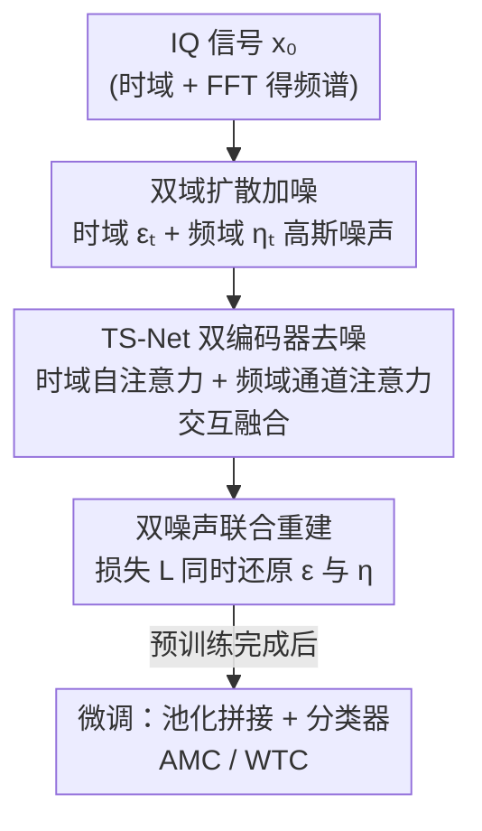

# TS-DDAE: A Novel Temporal-Spectral Denoising Diffusion AutoEncoder for Wireless Signal Recognition Model Pre-training

**会议**: ICLR 2026  
**OpenReview**: [https://openreview.net/forum?id=RKDkqkkZ5m](https://openreview.net/forum?id=RKDkqkkZ5m)  
**代码**: https://github.com/BUPT-GAMMA/FoundWSR  
**领域**: 自监督预训练 / 无线信号识别 / 扩散模型  
**关键词**: 无线信号识别, 扩散自编码器, 时-谱双域, 自监督预训练, 调制识别

## 一句话总结
针对无线信号识别（WSR）预训练，本文把扩散模型的"加噪-去噪"范式引入信号自监督，提出 TS-DDAE：在时域和频域同时给 IQ 信号注入高斯噪声，再用专门设计的双编码器 TS-Net（时域自注意力 + 频域通道注意力）联合还原，学到的表征在 4 个数据集、AMC/WTC 等多任务上平均超过最优基线 1.32%、超过 AMC SOTA 模型 IQFormer 约 8.75%。

## 研究背景与动机

**领域现状**：无线信号识别（WSR）要在没有任何先验的情况下判定收到信号的属性，比如调制类型（AMC）或所属通信制式（WTC），是民用/军用电台和智能通信系统的基础模块。深度学习模型（如 IQFormer）已经在单个 benchmark 上做到很高精度，"预训练 + 微调"范式在 CV/NLP 也证明了通用表征能低成本迁移到大量下游任务。

**现有痛点**：但信号领域还没真正享受到预训练的红利。少数已有的预训练模型（如 SpectrumFM）照搬 BERT 的"掩码-重建"策略——把信号一部分幅度置 0 再还原。问题在于信号的时序和频谱都有**很强的局部依赖**，直接把一段信号置零，等于硬生生抹掉一块内容，会破坏波形细腻的时-谱结构，让预训练任务学到的东西失真。另外这些方法大多只盯着时间序列，**忽略了频谱里蕴含的关键信息**。

**核心矛盾**：自监督要"破坏 + 还原"才能逼模型学表征，但破坏方式（掩码）和信号的内在结构（强局部依赖、时-谱双重特性）冲突——掩码破坏得太狠，重建任务反而学不到细粒度可迁移的特征。

**本文目标**：设计一个尊重信号"时域 + 频域"双重本质、且不会粗暴抹掉信息的 WSR 预训练框架。

**切入角度**：扩散模型的"加噪-重建"是一种**加性**破坏——往干净数据上叠随机高斯噪声再还原，相比掩码这种**减性**破坏，输入不会丢太多内容，能保留更细粒度的信息，同时仍逼模型学到语义丰富、可迁移的表征。DDAE 已经证明扩散去噪能当作很好的图像自监督目标，这给了作者把扩散搬到信号预训练的信心。

**核心 idea**：用"双域加噪-去噪"代替"掩码-重建"——在时域和频域同时注入高斯噪声破坏信号，再用一个时-谱双编码器网络联合还原，把扩散去噪当作 WSR 的自监督预训练目标。据作者所述，这是首次把扩散理论用于 WSR 预训练。

## 方法详解

### 整体框架
TS-DDAE 整体是"预训练（扩散自监督）→ 微调（下游分类）"两段式。预训练阶段沿用扩散范式的两个过程：**前向过程**对 IQ 数据逐步加 T 步高斯噪声、且同时污染时域和频域，得到噪声信号；**后向过程**用专门设计的 TS-Net 把噪声信号还原回原始 IQ 数据，重建误差即自监督损失。微调阶段冻结/续训 TS-Net，对两路编码器的输出做全局平均池化后拼接，接一个分类器，用标准交叉熵适配 AMC、WTC 等下游任务。

IQ 数据被表示成 $x \in \mathbb{R}^{2\times L}$ 的两行实矩阵（I、Q 两路同时建模、实数运算更高效），频谱由傅里叶变换 $z = \mathcal{F}(x) \in \mathbb{R}^{2\times L}$ 得到。整条管线是清晰的串行 pipeline：

### 关键设计

**1. 双域加噪-去噪：用加性噪声替掉破坏性掩码**

这一设计直接针对"掩码-重建会撕裂信号局部依赖"的痛点。前向过程不再把信号片段置零，而是对**时域和频域分别**叠加高斯噪声。频域加噪写作 $z_t = \tilde{\mu}_t \mathcal{F}(x_{t-1}) + (\tilde{\tau}_t/\sigma)\cdot\delta_t$，再逆变换回时域后叠时域噪声 $x_t = \tilde{\alpha}_t \mathcal{F}^{-1}(z_t) + \tilde{\beta}_t\varepsilon_t$。由于高斯函数的逆傅里叶变换仍是高斯，令 $\eta_t=\mathcal{F}^{-1}(\delta_t)\sim\mathcal{N}(0,I)$，单步加噪可合并为

$$x_t = \alpha_t x_{t-1} + \beta_t \varepsilon_t + \gamma_t \eta_t,\quad \alpha_t^2+\beta_t^2+\gamma_t^2=1$$

其中 $\varepsilon_t$ 是时域噪声、$\eta_t$ 是（来自频域的）时域等效噪声。借助重参数化递推，可直接从原始 $x_0$ 一步得到任意步的噪声数据 $x_t = \bar{\alpha}_t x_0 + \bar{\beta}_t\bar{\varepsilon}_t + \bar{\gamma}_t\bar{\eta}_t$。这种加性破坏既扰动了数据、又保留了原始时-谱结构，让去噪任务能学到比掩码更细粒度的特征。后向过程用贝叶斯定理推导 $p(x_{t-1}|x_t,x_0)$，因 $x_0$ 在推断时不可见，转而用神经网络拟合 $x_0$。

**2. TS-Net 异构双编码器 + 交互融合：时域和频域各用最合适的算子**

TS-Net 是后向去噪网络，也是本文的架构创新，它**不**对两个域用同一种算子，而是按各自特性分别设计。**时域编码器**把 IQ 时序当作类似文本的序列处理，主干用多头自注意力捕捉长程时序依赖：$X_{out}=X_{feat}+\text{MultiHead}(W^Q X_{feat}, W^K X_{feat}, W^V X_{feat})$，再借鉴 SpectrumFM 用点卷积 + GLU + 深度卷积（kernel=3）抽取局部信号结构。**频域编码器**则刻意不用自注意力——因为信号频谱往往只在少数频点幅值很高、其余很低，序列依赖不明显；改用卷积抽局部特征 + **通道注意力**挑选关键特征维度：$Z_{feat}=\text{FFN}(\text{Pool}(Z_{local}))*Z_{local}$，这一步重加权能抑制无关频段、放大有判别力的频段。两个编码器并非各干各的：在送入各自编码器前，会把时、频两路嵌入和扩散步 $t$ 的位置编码相加做**交互融合**（$X_{conv}=X_{conv}+Z_{conv}+t$，频域同理），让两路互相注入对方的信息、学到互补表征。消融显示这个交互过程去掉后性能会下降，证明双路不是简单并联。

**3. 双噪声联合优化目标 + λ 平衡：把两路噪声当两个优化目标**

既然时域和频域分别加了两种噪声，重建目标也相应拆成两路。网络用 $\bar{\mu}(x_t)=\frac{1}{\bar{\alpha}_t}(x_t-\bar{\beta}_t\varepsilon_{\theta_1}(x_t,t)-\bar{\gamma}_t\eta_{\theta_2}(x_t,t))$ 估计 $x_0$，最终损失为

$$L(x_t,t)=\frac{\bar{\beta}_t^2}{\bar{\alpha}_t^2}\big[(\varepsilon-\varepsilon_{\theta_1}(x_t,t))+\lambda(\eta-\eta_{\theta_2}(x_t,t))\big]^2$$

其中 $\theta_1,\theta_2$ 分别是时域、频域编码器的参数，$\lambda=\bar{\gamma}_t/\bar{\beta}_t$ 是超参，表示噪声数据中**频域噪声与时域噪声强度之比**。虽然 FFT 形式上是酉变换，但 $\varepsilon$、$\eta$ 是独立采样的、并不完全相同，因此构成两个可联合优化的目标。$\lambda$ 直接控制两路噪声的平衡——实验表明 $\lambda\approx0.5$（两路噪声大致均衡）时效果最好，说明细粒度地平衡双域加噪强度能提升表征质量。

### 损失函数 / 训练策略
预训练阶段：从数据集采 IQ 数据 $x_0$、采一个扩散步 $t$、再从标准高斯分布采 $\varepsilon$、$\eta$ 两个噪声，最小化上面的双噪声重建损失。微调阶段：对时域、频域两路嵌入各做全局平均池化，拼成单一表征向量送入分类器，整网用标准交叉熵微调。实现基于 PyTorch，超参用 Optuna 搜索，在 A100 上训练。

## 实验关键数据

### 主实验
在 AMC（RML2016.10A/B、RML2018）和 WTC（TechRec）任务上对比 11 个基线（含 ResNet/MCNet/VGG 等深度模型、AMC Net/IQFormer 两个 SOTA WSR 模型、SpectrumFM 基础模型）。报告各 SNR 下的平均（Average）与最优（Best）准确率（%）：

| 模型 | RML16.10A Avg | RML16.10B Avg | RML2018 Avg | TechRec Avg |
|------|------|------|------|------|
| AMC Net | 60.82 | 63.87 | 41.14 | 88.71 |
| SpectrumFM | 60.01 | 53.12 | 59.86 | 62.22 |
| IQFormer (AMC SOTA) | 64.05 | 65.00 | 40.22 | 77.74 |
| **TS-DDAE** | 63.61 | **65.50** | **64.15** | **89.62** |

TS-DDAE 平均超过最优基线 1.32%、超过 IQFormer 约 8.75%。尤其在较大的 RML2018 上比 IQFormer 高 23.07%，作者认为这说明它有在大规模数据上训练、适配多场景的潜力；而在简单的 RML2016.10A 上 Average 略低于 IQFormer（但 Best 更高），被解释为"还没学透"。WTC 上 Average 比 IQFormer 高约 11.88%、Best 接近 1.0。

### 消融实验

| 配置 | RML16.10A Overall | RML16.10B Overall | TechRec Overall | 说明 |
|------|------|------|------|------|
| TS-DDAE (Full) | 63.61 | 65.50 | 89.62 | 完整模型 |
| w/o temporal | 48.81 | 50.94 | 87.28 | 去时域编码器，AMC 掉约 15% |
| w/o spectral | 62.97 | 64.79 | 37.48 | 去频域编码器，WTC 几乎学不会 |
| w/o interactive | 62.92 | 65.09 | 87.87 | 去掉两路交互，各域单独去噪 |
| w/ single noise | 63.01 | 65.12 | 89.27 | 只用单一噪声目标 |

预训练能力评估（Q2）：线性探针（冻结主干只训分类器）在 TechRec 上甚至超过所有深度学习基线，说明特征线性可分性好；few-shot 下用不到 1% 训练数据，TS-DDAE 仍能逼近部分深度基线。

### 关键发现
- **时域、频域编码器各自在不同任务上是主导**：AMC（RML2016.10A/B）上去掉时域编码器掉约 15%，时域是关键；而 WTC（TechRec）上去掉频域编码器后模型几乎学不出来（37.48%），频域是关键。这恰好印证"必须双域兼顾"的动机。
- **交互融合和双噪声都有用但增益相对小**：去掉交互（w/o interactive）和改用单噪声（w/ single noise）都让性能小幅下降，证明两路交互、双噪声联合优化的必要性，但相比"砍掉整个编码器"，它们更像锦上添花。
- **λ≈0.5 最优**：频/时噪声强度比在 0.5 附近时三个数据集都接近峰值，说明两路加噪需要保持均衡。

## 亮点与洞察
- **用"加性噪声"替"减性掩码"做信号自监督**：这是最核心的洞察——信号有强局部依赖，掩码置零是粗暴破坏，而扩散式加噪是温和扰动，既制造了重建难度又不丢内容，特别契合波形数据。这个思路可迁移到其他对局部结构敏感的时序/物理信号（脑电、雷达、振动）。
- **按域特性选算子**：时域用自注意力抓长程依赖、频域用通道注意力挑关键频段——频谱"少数频点高幅值"的稀疏特性确实更适合通道重加权而非序列注意力，这是把领域先验写进架构的好例子。
- **把双域噪声拆成两个监督信号**：利用 FFT 是酉变换、但两路噪声独立采样这一点，自然得到两个可联合优化的去噪目标，并用单一超参 λ 控制二者平衡，设计简洁。

## 局限与展望
- **加噪方案较朴素**：作者自己指出，目前两路都用标准高斯噪声，未来可探索更贴合无线信号特性的加噪机制（如带结构的、信道相关的噪声）。
- **简单数据集上未追平 SOTA**：RML2016.10A 的 Average 仍略低于 IQFormer，"还没学透"的解释偏定性，缺少更深入的分析；扩散预训练在小数据上是否真有优势存疑。
- **关键设计的增益不均衡**：消融显示交互融合、双噪声的提升幅度较小（多在 0.x%~1% 量级），主要收益来自"双域都保留"这一框架层面，单看这两个组件的必要性论证可以更强。
- **未与统一的大规模预训练充分对比**：虽宣称有成为 WSR 基础模型的潜力，但仍在单数据集上预训练 + 微调，跨数据集的统一预训练、规模化效应尚未系统验证。

## 相关工作与启发
- **vs SpectrumFM（掩码-重建 WSR 基础模型）**: SpectrumFM 借 NLP 的掩码语言建模、随机掩码信号再重建；TS-DDAE 改用双域加噪去噪。区别在破坏方式从"减性掩码"变成"加性噪声"，更好地保留时-谱局部结构，理论上学到的特征更细粒度。
- **vs RF-Diffusion（扩散用于信号生成）**: RF-Diffusion 把扩散用于**有条件的信号生成**；本文目标不是生成而是学**无条件的判别表征**，因此从 DDAE（扩散去噪当自监督）出发而非生成式扩散，针对 WSR 设计预训练管线。
- **vs IQFormer（AMC SOTA）**: IQFormer 联合建模原始 IQ 与频谱、是强监督单任务模型；TS-DDAE 是自监督预训练 + 微调的多任务框架，多数 benchmark 上反超，尤其在大数据集和 WTC 上优势明显。

## 评分
- 新颖性: ⭐⭐⭐⭐ 首次把扩散去噪自监督引入 WSR 预训练，"加噪替掩码 + 时频双域 + 异构双编码器"组合清晰且有针对性。
- 实验充分度: ⭐⭐⭐⭐ 覆盖 AMC/WTC 多任务 4 数据集、11 基线，含线性探针/few-shot/消融/λ 分析，较完整；但缺统一大规模预训练验证。
- 写作质量: ⭐⭐⭐⭐ 扩散公式推导清楚、动机递进自然，架构图和损失定义明确。
- 价值: ⭐⭐⭐⭐ 给 WSR 基础模型提供了可复现的扩散式预训练范式 + 开源 benchmark 代码库，对智能通信有实用价值。

<!-- RELATED:START -->

## 相关论文

- [\[ECCV 2024\] RAW-Adapter: Adapting Pre-trained Visual Model to Camera RAW Images](../../ECCV2024/signal_comm/raw-adapter_adapting_pre-trained_visual_model_to_camera_raw_images.md)
- [\[ICLR 2026\] Synchronizing Probabilities in Model-Driven Lossless Compression](synchronizing_probabilities_in_model-driven_lossless_compression.md)
- [\[ICML 2025\] Large Language Model (LLM)-enabled In-context Learning for Wireless Network Optimization](../../ICML2025/signal_comm/large_language_model_llm-enabled_in-context_learning_for_wireless_network_optimi.md)
- [\[NeurIPS 2025\] Feature-aware Modulation for Learning from Temporal Tabular Data](../../NeurIPS2025/signal_comm/feature-aware_modulation_for_learning_from_temporal_tabular_data.md)
- [\[ICML 2026\] Joint Model and Data Sparsification via the Marginal Likelihood](../../ICML2026/signal_comm/joint_model_and_data_sparsification_via_the_marginal_likelihood.md)

<!-- RELATED:END -->
