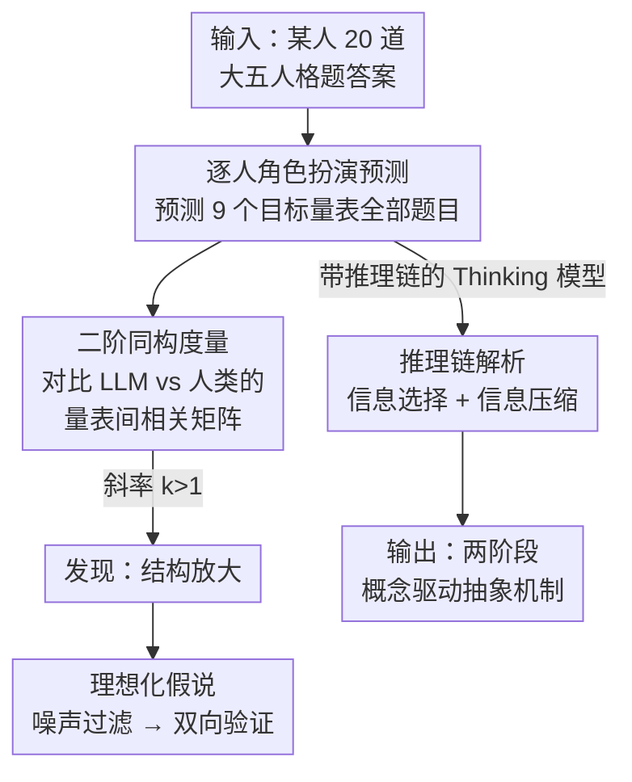

# From Five Dimensions to Many: Large Language Models as Precise and Interpretable Psychological Profilers

**会议**: ICLR2026  
**OpenReview**: [https://openreview.net/forum?id=JXFnCpXcnY](https://openreview.net/forum?id=JXFnCpXcnY)  
**代码**: 待确认  
**领域**: 社会计算 / 计算社会科学 / LLM 心理模拟  
**关键词**: 大五人格, 心理结构重建, 结构放大, 理想化假说, 推理可解释性

## 一句话总结
只给 LLM 一个人的 20 道大五人格题答案，让它角色扮演去预测这个人在另外 9 个心理量表上的作答，结果 LLM 重建出的"量表间相关结构"与真实人类数据高度对齐（$R^2>0.88$），并且通过分析推理链发现 LLM 走的是"先把原始分压缩成自然语言人格摘要、再据此推理"的两阶段抽象过程——它不是语义模式匹配，而是在做真正的心理推理。

## 研究背景与动机
**领域现状**：心理学的一个核心目标是刻画"法则网络"（nomothetic network）——即人格、焦虑、压力、情绪调节等各种心理特质之间如何相互关联。近年大量工作让 LLM 角色扮演人类被试，证明它们能在群体层面复现社会/经济行为，甚至能高保真模拟特定个体（如 Park 等"模拟 1000 个真人"的工作）。

**现有痛点**：这些工作证明了 LLM"能模仿行为"，但没回答一个更关键的问题——这种能力到底来自**真正的心理推理**，还是来自**输入语义高度重叠时的表面模式匹配**？而且主流评测都停留在"一阶预测准确率"（模型预测的某个特质分数和真值相关多高），这种指标天然受真值本身相关强度的约束，无法揭示模型是否真的内化了整张特质关系网。

**核心矛盾**：要回答"是推理还是模式匹配"，实验必须同时满足几个苛刻条件——输入要低语义重叠（堵死模式匹配的捷径）、分析要看整张相关结构而非孤立的特质对、结论要跨多个模型成立、还要能做过程级可解释（不能只看性能数字，因为模式匹配也可能给出相似分数）。已有范式没有一个能同时满足。

**本文目标**：(1) 设计一个能堵死语义捷径的零样本预测任务；(2) 用"二阶"结构分析判断 LLM 是否重建了整张心理关系网；(3) 打开黑箱，从推理链里看清 LLM 到底怎么从稀疏输入推出结论。

**切入角度**：用一个人的 20 道大五人格题（5 点量表，从"非常不同意"到"非常同意"）作为唯一输入，去预测**另外 9 个完全不同的心理量表**的逐题作答。大五题和目标量表语义重叠极低，且要求逐题、逐个体预测，模式匹配很难奏效；同时只给稀疏数值、不给任何文本画像，把模型的"推理能力"从"记忆检索"中剥离出来。

**核心 idea**：不比一阶准确率，而是比**量表间相关矩阵的结构**——用 LLM 预测数据算出的相关模式去回归人类真实数据的相关模式，回归斜率就是对齐指标；再用标注模型解析推理链，定位每道大五题的影响权重与信息加工阶段。

## 方法详解

### 整体框架
论文用两个实验把"性能"和"机制"分开打。**实验 1** 测 LLM 能否从稀疏人格输入重建整张心理结构：对 816 名真实被试，逐人让 LLM 扮演 TA、仅凭 20 道大五题答案预测 9 个目标量表的全部题目，然后在数据集层面把"LLM 预测数据的量表子因子相关矩阵"和"人类真值的相关矩阵"对比。**实验 2** 打开黑箱：把实验 1 里带推理链（Thinking 模型）的轨迹拿出来，用一组独立的"标注模型"解析，定位信息选择策略，并验证推理中途生成的自然语言摘要到底有没有预测力。

数据来源是 816 名中国被试在疫情期间纵向研究中收集的心理测评：大五人格量表作为输入，另有 9 个目标量表（知觉压力、简易应对方式、状态-特质焦虑、自我关怀、心理韧性 CD-RISC、不确定性不容忍、情绪调节、风险知觉与行为、未来时间洞察）。被测 LLM 涵盖 DeepSeek-V3.1、GPT-5、Claude 3.7 Sonnet、Gemini 2.5 Flash、GLM-4.5、Kimi K2、Qwen3-235B 的 Chat/Thinking 变体，对照组是传统 ML（KNN、SVM、线性回归）和一个基于 bge-reranker-large 的语义相似度模型。

### 关键设计

**1. 二阶同构度量：用"相关结构对齐"代替"一阶预测准确率"**

论文最关键的方法论创新在于评测口径。直接把模型预测分数和真值做相关（一阶准确率）有个根本缺陷：这种相关本身被"大五与目标量表之间真值关系的强弱"卡死，强相关的特质对天生好预测、弱相关的天生难预测，结果混淆了模型能力和数据本身的结构。论文改为算**子因子两两之间的 Pearson 相关矩阵**：对 LLM 预测数据和人类真值数据各算一张相关矩阵，再把 LLM 的相关向量回归到人类的相关向量上，回归系数 $k$（斜率）作为对齐指标。$k\approx1$ 表示完美重建结构，$k>1$ 表示放大。这样评的是"模型有没有内化整张关系网的形状"，而不是某一对特质预测得准不准——这正是堵死"靠语义重叠蒙对单点"的关键。

**2. 结构放大：LLM 不是复刻而是"提纯"了人类心理结构**

用上述度量发现一个反直觉现象：LLM 重建的相关矩阵符号与人类完全一致，但**幅度系统性偏大**（更饱和、离零更远）。以 Gemini 2.5 为例，回归 $R^2=0.92$、斜率 $k=1.42$ 显著大于 1。论文把这命名为**结构放大（structural amplification）**，并强调它不同于已知的"偏见放大"——偏见放大是一阶效应（夸大某个具体的社会偏见），而结构放大是二阶效应（整张特质关系网被整体拉强）。更关键的是，只看预测的目标量表之间（排除大五输入）这个效应依然成立（$k=1.41$, $R^2=0.91$），说明模型构建的是一张**内部自洽、整体被放大的心理网络**，不是简单的输入-输出映射；而且所有被测 LLM 的 $k$ 都 $>1$ 且都超过 KNN 检索和语义相似度基线，$k$ 越大预测性能越好（$R^2=0.95$），说明放大不是 artifact 而是核心功能机制。

**3. 理想化假说：放大来自"过滤人类自我报告里的随机噪声"**

为什么会放大？论文提出 LLM 像一个"理想化被试"，自动滤掉了人类自评里固有的随机测量误差。按经典测量理论，随机噪声会**衰减**量表间的观测相关，所以滤噪后相关自然变强。证据是双向、近因果的：理论侧——LLM 数据的内部一致性（Cronbach's $\alpha=0.87$）显著高于人类（$0.75$），且不同 LLM 之间高度收敛（模型间 MSE $0.0060$ 远小于模型-人类 MSE $0.0357$），说明各 LLM 收敛到一个共同的"理想化作答模型"；实证侧——从人类数据里筛出"作答更认真"的子群（$N=309$，剔除快速作答者），其相关结构本就更强、更接近 LLM（$k$ 从原来降到 $1.08$）；反过来给基线模型的预测**注入递增的高斯噪声**，放大效应单调减弱（$k$ 从 $1.55$ 降到 $1.12$）。"从人类去噪"和"给模型加噪"产生相反且可预测的效果，构成对噪声过滤解释的有力支持。

**4. 推理链解构：概念驱动的信息选择 + 信息压缩的两阶段机制**

实验 2 打开黑箱，用"推理模型→标注模型"的解析框架：生成推理链的叫推理模型（如 Claude3.7-Thinking、GLM4.5-Thinking），再用另一组多样的标注模型（DeepSeek-V3.1、Qwen3-235B、GLM-4.5、Claude 3.7）各自解析同一条链，给出 20 维归因分布（每道大五题对预测的重要性），多个标注结果取平均去偏，再与"在真值上训练的贝叶斯岭回归"得到的特征重要性对标。结论分两层：**信息选择**上，LLM 在**因子层级**（如神经质这个高阶因子）的归因与人类真值基线几乎完美对齐（$r=0.981$），远高于与语义相似度基线的对齐（$r=0.790$）；但在**单题层级**所有方法的对齐都很弱（LLM vs 真值仅 $r=0.207$）——即 LLM 能准确锁定"该看哪个高阶人格因子"，却分不清因子内部各题的重要性，这是典型的自上而下、概念驱动推理，而非表面词义关联。**信息压缩**上，推理链中途会生成一段自然语言人格摘要（如"一个敏感、易担忧、富想象、偏悲观、常高估负面事件概率的人"）；只用这段摘要替代 20 个原始分数作输入（SummaryOnly），结构放大效应几乎不变（$R^2=0.91$），证明摘要是对原始输入的**充分压缩**；更妙的是"摘要+分数"（Summary+Score）反而给出最高的放大系数和预测性能，说明摘要不是冗余复述，而是推理过程中**涌现的二阶信息**（一种概念格式塔）。跨 15 个条件（5 模型 × 3 信息类型）$k$ 与预测性能强正相关（$R^2=0.93$）。

## 实验关键数据

### 主实验

| 度量 / 设定 | Gemini 2.5 | 含义 |
|--------|------|------|
| 预测相关 vs 人类相关回归 $R^2$ | 0.92 | 结构高度线性对齐 |
| 放大斜率 $k$（含大五输入） | 1.42 | 系统性放大（>1） |
| 放大斜率 $k$（仅目标量表间） | 1.41（$R^2=0.91$） | 内部网络自洽放大 |
| 全体 LLM 的 $k$ | 均 $>1.0$，超 KNN/语义基线 | 放大是 LLM 通性 |
| $k$ 与预测性能 | $R^2=0.95$ | 放大越强、预测越准 |

整体零样本对齐 $R^2>0.88$，显著超过语义相似度基线，逼近"直接在数据集上训练的 ML 算法"。

### 消融/分析实验

| 分析 | 关键指标 | 说明 |
|------|---------|------|
| 1000 次置换检验 | $p<.001$ | $R^2$、Kendall's $\tau$ 是极端离群，非偶然 |
| 鲁棒性（标准/随机/单题序） | $k=1.42/1.41/1.42$ | 放大不依赖 prompt 措辞或输入顺序 |
| 注意力高子群（$N=309$） | $k\to1.08$ | 人类去噪后更接近 LLM |
| 注入高斯噪声 | $k:1.55\to1.12$ | 加噪削弱放大（剂量-反应） |
| 信息选择（因子层级） | $r=0.981$ vs 人类 | 远高于语义基线 $r=0.790$ |
| 信息选择（单题层级） | $r=0.207$ | 因子内分不清各题重要性 |
| 信息压缩 SummaryOnly | $R^2=0.91$ | 仅摘要即充分重建 |

### 关键发现
- **结构放大是功能机制而非 bug**：$k$ 越大预测越好（$R^2=0.95$），说明"提纯/理想化"恰恰是 LLM 准确的来源。
- **去噪假说被双向证据夹住**：从人类侧去噪和从模型侧加噪产生相反、可预测的效果，构成近因果证据。
- **抽象层级错位很有意思**：LLM 在高阶因子层级像人，在单题层级却失准——它抓"概念"而非"细节"，与信息瓶颈原理一致。
- **自然语言摘要是涌现的二阶信息**：摘要+分数 > 仅分数 > 仅摘要，加上一段从分数本身导出的摘要还能提升性能，说明摘要含有原始数值里没有的概念格式塔。

## 亮点与洞察
- **二阶同构度量是可迁移的方法论利器**：把"评测准确率"换成"评测结构对齐"，绕开了真值相关强度的混淆，任何"LLM 模拟人类/系统"的研究都能借这招把"真推理 vs 表面匹配"分开。
- **"结构放大 = 理想化抽象"这个解释优雅且可证伪**：它把一个看似奇怪的现象（相关被夸大）重新框定为"滤噪导致的提纯"，并用加噪/去噪的对称实验把它钉死。
- **概念驱动的两阶段机制呼应认知科学与信息瓶颈**：先压缩成低维人格摘要再推理，等于在做信息瓶颈式的有损压缩，给"LLM 是否真推理"之争提供了一个机制层面的证据点。
- **用多标注模型去偏解析推理链**的做法值得复用：单个标注器有解释偏差，多模型平均能得到更稳健的归因向量，缓解了 CoT 忠实性争议。

## 局限与展望
- **单一文化样本**：数据全来自中国被试，理想化结构可能受训练数据文化偏置影响，跨文化外推未验证。
- **没解释模型间差异**：论文证明放大是 LLM 通性，但没拆解"为什么某些模型/架构放大更强"，未与模型规模、微调方式建立联系。
- **摘要语义未深挖**：协同摘要里到底编码了什么"二阶信息"值得进一步研究。
- **依赖 CoT 推理链**：信息压缩分析只对带可见推理链的 Thinking 模型成立，对不外显推理的模型机制仍是黑箱；且推理链忠实性本身有争议，论文用多标注去偏缓解但未根除。

## 相关工作与启发
- **vs Park 等"模拟 1000 真人"**: 他们在数据丰富的开放世界做一阶个体行为模拟（含记忆检索），本文用稀疏输入把"推理能力"从"记忆检索"中剥离，并改做二阶结构重建——评的是关系网而非单点保真。
- **vs Zhu et al. (2025)**: 他们从定性访谈推断人格、发现对齐很差；本文指出那是一阶预测、受真值相关强度限制，改用二阶结构分析后反而看到高对齐——结论分歧本质是度量口径不同。
- **vs CoT 忠实性争论（Turpin/Lanham 等）**: 不直接争论推理链是否事后合理化，而是用解析+回填实验证明推理链中途的摘要**确实有预测力**（回填后性能升），为"推理链非纯事后解释"提供了功能证据。
- **vs 信息瓶颈（Tishby et al.）**: 把 LLM"丢弃单题细节、保留高阶因子"的行为解释为信息瓶颈式压缩，给认知层级假说补上了计算视角的注脚。

## 评分
- 新颖性: ⭐⭐⭐⭐⭐ 二阶同构度量 + 结构放大 + 理想化假说，三个概念环环相扣，把"LLM 是否真推理"做成了可证伪的实验。
- 实验充分度: ⭐⭐⭐⭐⭐ 7+ 模型、置换检验、加噪/去噪双向因果、多标注去偏，证据链严密。
- 写作质量: ⭐⭐⭐⭐⭐ 问题动机—度量设计—机制解构层层递进，叙事清晰。
- 价值: ⭐⭐⭐⭐⭐ 既给心理模拟提供强工具，又给 LLM 可解释性提供方法范式，跨学科价值高。

<!-- RELATED:START -->

## 相关论文

- [\[NeurIPS 2025\] Redefining Experts: Interpretable Decomposition of Language Models for Toxicity Mitigation](../../NeurIPS2025/social_computing/redefining_experts_interpretable_decomposition_of_language_models_for_toxicity_m.md)
- [\[ICLR 2026\] Propaganda AI: An Analysis of Semantic Divergence in Large Language Models](propaganda_ai_an_analysis_of_semantic_divergence_in_large_language_models.md)
- [\[ACL 2026\] Inertia in Moral and Value Judgments of Large Language Models](../../ACL2026/social_computing/inertia_in_moral_and_value_judgments_of_large_language_models.md)
- [\[ACL 2026\] Understanding the Sociocultural Dimensions of Mental Health Discourse in Arabic-Language X Communities](../../ACL2026/social_computing/understanding_the_sociocultural_dimensions_of_mental_health_discourse_in_arabic-.md)
- [\[ICLR 2026\] Measuring and Mitigating Rapport Bias of Large Language Models under Multi-Agent Social Interactions](measuring_and_mitigating_rapport_bias_of_large_language_models_under_multi-agent.md)

<!-- RELATED:END -->
