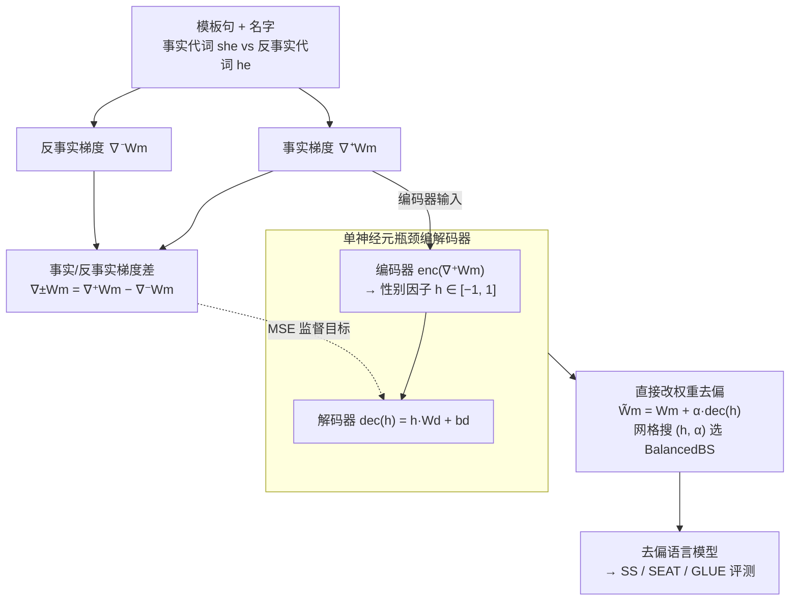

# GRADIEND: Feature Learning within Neural Networks Exemplified through Biases

**会议**: ICLR 2026  
**arXiv**: [2502.01406](https://arxiv.org/abs/2502.01406)  
**代码**: [https://github.com/aieng-lab/gradiend](https://github.com/aieng-lab/gradiend)  
**领域**: 社会计算  
**关键词**: 单语义特征学习, 性别偏见消除, 梯度编码器-解码器, Transformer去偏, 可解释性

## 一句话总结
提出GRADIEND——一个基于梯度的编码器-解码器架构，通过单个瓶颈神经元从模型梯度中学习可解释的单语义特征（以性别为例），不仅可以识别哪些权重编码了特定特征，还能通过解码器直接修改模型权重来消除偏见，与INLP结合在所有基线模型上达到SOTA去偏效果。

## 研究背景与动机
AI系统经常表现出并放大社会偏见（如性别偏见），在法律、医疗、招聘等关键领域产生有害影响。Amazon的AI招聘工具偏向男性候选人就是典型案例。

现有Transformer去偏方法包括：
- **反事实数据增强**（CDA）：交换性别相关词后重训练，代价高
- **Dropout增强**：增加预训练时的Dropout率
- **INLP**：迭代零空间投影法，反复训练线性分类器并投影到零空间
- **SentDebias/SelfDebias**：后处理方法，调整嵌入或输出分布

**核心矛盾**：现有无监督稀疏自编码器方法（如Bricken et al., 2023）虽然能提取可解释特征，但需要学习大量潜在特征后再搜索有意义的解释，无法保证期望的特征（如"性别"）会出现。而现有去偏方法大多是后处理式的，不能真正修改已训练模型的内部表示。

**本文切入点**：利用模型梯度中包含的特征信息——梯度天然指示了"哪些参数需要更新才能改变某个特征"。通过设计一个极简的编码器-解码器结构，可以从事实/反事实梯度差中学习到一个**有期望语义**的单语义特征神经元。

## 方法详解

### 整体框架
GRADIEND 想解决的问题是：怎样从一个预训练 Transformer 内部，把"性别"这一个语义抠成可读、可操控的单一神经元，进而直接改权重去偏。它的原料不是激活值而是梯度——对同一个带名字、带代词的模板句，分别用正确代词和反事实代词作 MLM 目标算两份梯度，相减得到只剩"性别方向"的梯度差。随后用一个仅 $3n+1$ 参数的编码器-解码器：编码器把事实梯度压成一个标量"性别因子"$h$，解码器再从 $h$ 重建出那份梯度差，整体以 MSE 拟合。训练好后，$h$ 读出"哪些权重编码性别"，而解码器输出就是一份能加回模型主干的权重编辑向量——同号调强、异号反转、取 0 去偏。

### 关键设计

**1. 事实/反事实梯度差：把性别方向从梯度里"减"出来**

特征学习的原料不是激活值，而是梯度——梯度天然回答了"要改变某个预测，哪些参数该往哪动"。对一个带名字与代词的模板句（如"Alice explained the vision as best [MASK] could"），分别以正确代词"she"和反事实代词"he"为 MLM 目标，计算两份梯度：事实梯度 $\nabla^+ W_m$ 与反事实梯度 $\nabla^- W_m$。两者都包含大量与性别无关的语言学共同更新，但把它们相减得到梯度差 $\nabla^{\pm}W_m := \nabla^+ W_m - \nabla^- W_m$ 后，这些共同成分相互抵消，只剩下纯粹的"性别相关方向"。这一步是整个方法干净的前提——它保证后续学到的瓶颈神经元承载的是性别而非别的语义；其中事实梯度 $\nabla^+ W_m$ 同时还是编码器的输入，而梯度差 $\nabla^{\pm}W_m$ 是解码器要拟合的监督目标。

**2. 单神经元瓶颈编解码器：用 $3n+1$ 个参数逼出期望语义**

不同于稀疏自编码器先学上千个特征再人工搜索"哪个是性别"，GRADIEND 把"性别"作为唯一瓶颈预先指定下来，强迫这一个神经元去承载它。编码器把事实梯度映射成标量 $\text{enc}(\nabla^+ W_m) = \tanh(W_e^T \cdot \nabla^+ W_m + b_e) =: h \in \mathbb{R}$，解码器再从这个标量重建梯度差 $\text{dec}(h) = h \cdot W_d + b_d \approx \nabla^{\pm} W_m$，以 MSE 为目标拟合。其中 $W_e, W_d, b_d \in \mathbb{R}^n$、$b_e \in \mathbb{R}$，对一个 $n$ 维权重的总参数量仅 $3n+1$。$\tanh$ 把 $h$ 挤进 $[-1,1]$，让"偏男/偏女"自然落到两端、性别中性输入落到 0 附近，得到一个可读、可操控的单语义因子。

**3. 直接改权重去偏：解码器输出就是一份可加回模型的编辑向量**

学好的解码器把性别因子翻译成权重更新，于是去偏不再是后处理，而是对语言模型主干的一次定向编辑：$\tilde{W}_m := W_m + \alpha \cdot \text{dec}(h)$。$h$ 与学习率 $\alpha$ 同号时模型更偏男性、异号时更偏女性，把 $h$ 取到 0 附近就得到去偏方向。具体操作是在 $(h, \alpha)$ 网格上扫一遍、用**平衡偏见分数**（Balanced Bias Score, BalancedBS）选最优配置——它同时奖励高语言建模能力 $\text{LMS}_{\text{Dec}}$、低 $|P(F)-P(M)|$（男女预测要平衡）与高 $P(F)+P(M)$（预测要合理），选出的去偏模型在文中记作 GRADIEND-BPI；若把目标换成偏向某一性别的 FemaleBS / MaleBS，同一套机制就能定向"注入"而非消除偏见。这里有个有趣之处：由于 $\text{dec}(h)=h\cdot W_d + b_d$，配置 $(h,\alpha)$ 与 $(-h,-\alpha)$ 的权重更新只相差 $2\alpha b_d$，因此即便没有任何性别信息（$h=0$），解码器偏置 $b_d$ 自身已学到一条有效的中性化方向，去偏向量主要就来自它。

### 损失函数 / 训练策略
训练以 MSE 拟合梯度差，用 Adam（学习率 1e-5、权重衰减 1e-2、批量 32）优化，共训练 23,653 步——恰好等于 Genter 训练集的模板数；每 250 步用验证相关系数$\text{Cor}_{\text{Genter}}^{\text{val}}$评估并保留最优模型。每一步随机选定一个性别、再从 NAMExact 名字库采样一个名字构造样本；解码器权重用与编码器同量级的$n$自定义初始化。值得注意的是预测层不计入 GRADIEND 的可训练参数，从而保证学到并被编辑的是语言模型主干而非任务头。

## 实验关键数据

### 编码器评估（H1：学习性别特征）

| 模型 | $\text{Acc}_{\text{Genter}}$ | $\text{Cor}_{\text{Genter}}$ | $\text{Acc}_{\text{Enc}}$ | $\text{Cor}_{\text{Enc}}$ |
|------|------|------|------|------|
| BERT-base | 1.000 | 0.957 | 0.612 | 0.669 |
| BERT-large | 1.000 | 0.908 | 0.578 | 0.616 |
| DistilBERT | 1.000 | 1.000 | 0.758 | 0.838 |
| RoBERTa | 1.000 | 1.000 | 0.909 | 0.935 |

所有模型在性别相关数据上几乎完美区分$\pm 1$；对性别中性输入也能映射到接近0的值。

### 去偏效果比较（H2：修改性别偏见）

| 方法 | SS(%) | SEAT | CrowS(%) | LMS(%) | GLUE(%) |
|------|-------|------|----------|--------|---------|
| BERT-base | 基线 | 基线 | 基线 | 基线 | 基线 |
| + GRADIEND-BPI | 改善 | - | - | 保持 | 保持 |
| + GRADIEND-BPI + INLP | **显著改善** | 改善 | - | 保持 | 保持 |
| CDA / Dropout / INLP / SentDebias | 部分改善 | 不一致 | 不一致 | 部分下降 | 部分下降 |

### 消融实验

| 配置 | 关键指标 | 说明 |
|------|---------|------|
| 不同基线模型 | 4个模型全部成功 | BERT/DistilBERT/RoBERTa均可学到性别特征 |
| 性别因子$h=0$ | BalancedBS最优近似在此 | 解码器偏置$b_d$自动学到去偏方向 |
| 过拟合分析 | 训练/验证/测试名字无显著差异 | 泛化到未见名字 |
| 泛化到woman/man | he/she泛化到woman/man | 性别概念的跨词汇泛化 |

### 关键发现
- **GRADIEND-BPI + INLP是唯一在所有基线模型的SS指标上均达到显著改善的组合方法**，展示了强鲁棒性
- 引入置信区间后，现有去偏方法的有效性远不如先前研究所暗示的那样明确
- RoBERTa出人意料地表现出女性偏向（$\mathbb{P}(F) > \mathbb{P}(M)$），与通常认为的男性偏向相反
- 偏向某一性别（FPI/MPI）比去偏（BPI）更容易实现
- 模型权重调整的影响呈近点对称分布（与$h$和$\alpha$的符号有关）

## 亮点与洞察
- **从梯度中直接学习有期望语义的特征**：与无监督稀疏自编码器（学习大量特征后人工解释）不同，GRADIEND可以学习"期望的"可解释特征（如性别），这是一个重要的范式转换
- **极简但优雅的设计**：仅一个标量瓶颈神经元，参数量为$3n+1$，但有效地编码了性别这一复杂概念。架构简洁性使得分析和理解更容易
- **引入Bootstrap置信区间**：揭示了该领域的一个被忽视的问题——先前的去偏方法比较缺乏统计严谨性
- **解码器偏置的有趣发现**：即使$h=0$（无性别信息），解码器的偏置$b_d$本身就学到了一个有效的去偏方向

## 局限与展望
- 仅验证了二元的性别特征，能否推广到连续特征（如情感）、多值特征（如德语冠词der/die/das）或其他类型偏见（种族、宗教）需要进一步探索
- 仅在encoder-only模型上测试，未验证在生成式Transformer（GPT类）上的效果
- 事实/反事实梯度的构造依赖于MLM任务，CLM任务下的适配方案有待制定
- 去偏效果的trade-off：强去偏会降低语言建模能力，需要在$h$和$\alpha$的搜索网格中谨慎选择
- 性别被简化为二元处理，未考虑非二元性别身份

## 相关工作与启发
- **单语义特征/稀疏自编码器**（Bricken et al., 2023; Templeton et al., 2024）：无监督方法，从高维特征空间中分解可解释特征，Claude 3中发现了性别偏见感知特征
- **INLP**（Ravfogel et al., 2020）：迭代零空间投影去偏，与GRADIEND互补效果最佳
- **Movement Pruning**（Joniak & Aizawa, 2022）：通过剪枝减少性别偏见
- **Grad-CAM / Integrated Gradients**：梯度解释方法的先驱工作
- 启发：梯度不仅可以用于解释（attribution），还可以编码和操控模型内部的语义特征。这种"梯度作为特征表示"的思路可能对模型编辑（model editing）和遗忘学习（unlearning）有重要价值

## 评分
- 新颖性: ⭐⭐⭐⭐⭐ （从梯度中学习期望语义特征是非常新颖的范式）
- 实验充分度: ⭐⭐⭐⭐ （4个基模型，多种指标，但只测了性别一种特征）
- 写作质量: ⭐⭐⭐⭐ （结构清晰，公式严谨，附录详尽）
- 价值: ⭐⭐⭐⭐ （proof-of-concept价值高，但实际应用范围待扩展）

<!-- RELATED:START -->

## 相关论文

- [\[ICLR 2026\] Mitigating Mismatch within Reference-based Preference Optimization](mitigating_mismatch_within_reference-based_preference_optimization.md)
- [\[ICML 2026\] Alignment Tampering: How Reinforcement Learning from Human Feedback Is Exploited to Optimize Misaligned Biases](../../ICML2026/social_computing/alignment_tampering_how_reinforcement_learning_from_human_feedback_is_exploited_.md)
- [\[ICLR 2026\] Steering the Herd: A Framework for LLM-Based Control of Social Learning](steering_the_herd_a_framework_for_llm-based_control_of_social_learning.md)
- [\[ACL 2026\] Investigating Counterfactual Unfairness in LLMs towards Identities through Humor](../../ACL2026/social_computing/investigating_counterfactual_unfairness_in_llms_towards_identities_through_humor.md)
- [\[ICCV 2025\] Learning Visual Proxy for Compositional Zero-Shot Learning](../../ICCV2025/social_computing/learning_visual_proxy_for_compositional_zero-shot_learning.md)

<!-- RELATED:END -->
