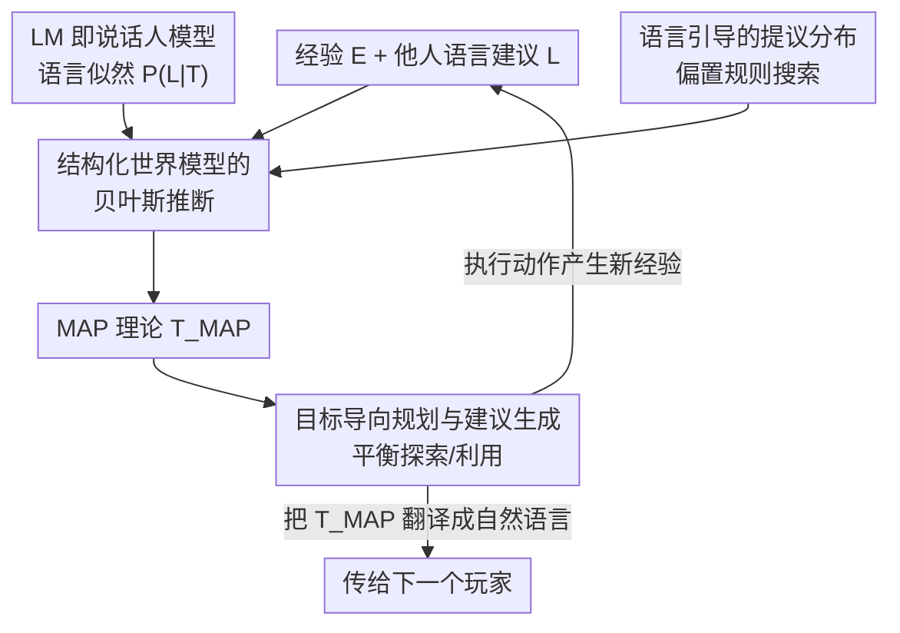

# Language and Experience: A Computational Model of Social Learning in Complex Tasks

**会议**: ICLR 2026  
**OpenReview**: [https://openreview.net/forum?id=UxDu3RFuDV](https://openreview.net/forum?id=UxDu3RFuDV)  
**代码**: https://github.com/ccolas/language_and_experience  
**领域**: 社会计算 / 认知建模 / Agent  
**关键词**: 社会学习, 贝叶斯推断, 程序化世界模型, 心智理论, 文化传递

## 一句话总结
作者把"从经验学"（theory-based RL，对可执行的程序化世界模型做贝叶斯推断）和"从别人的话学"（把预训练大模型当成"说话人模型"，用它的似然把一句自然语言建议变成贝叶斯证据）统一进同一个推断框架，在 10 个视频游戏上证明：语言指导能让人和模型都学得更快、更少送命，并支持跨代知识累积与人机互教。

## 研究背景与动机
**领域现状**：人类学习有两条腿——一条是亲身试错（去林子里采蘑菇，慢慢摸清哪片坡好），另一条是听过来人一句话（"红伞白点的千万别碰，毒死人"）。把这两者结合起来既安全又高效，还能让知识跨代累积。但目前的计算模型只能各管一段：强化学习（RL）能搞定复杂任务却要上百万步试错；theory-based RL 用贝叶斯推断结构化世界模型达到了人类级样本效率，却**完全不会社会学习**；language-conditioned RL 能吃语言，但需要海量"状态-语言"配对监督，现实中不可行；大模型（LLM）灵活处理语言，却不擅长交互式规划和具身学习。

**现有痛点**：没有一个统一的计算框架，能像人一样把"一次性听到的、自然口语的建议"和"实时积累的亲身经验"作为**两种互补证据**同时用上。language-conditioned RL 那套靠成千上万次配对学习的方式，碰到只见一次的新建议根本没法泛化——而人类社会学习恰恰是 one-shot 的：每个游戏只收到前人的一条新建议。

**核心矛盾**：语言和经验在表示上不对齐。经验是符号化的状态转移序列，语言是自由文本，二者要进同一个贝叶斯后验，就必须有一个能把"某个世界模型 $T$ 会让人说出这句话 $L$ 的可能性"量化出来的桥梁。

**本文目标**：(1) 提出一个把语言指导和直接经验都视为对"可执行、程序化世界模型"做联合推断之证据的贝叶斯框架；(2) 用它解释人类如何整合语言与经验；(3) 验证语言能否塑造探索、加速学习、支持跨代与人机知识迁移。

**切入角度**：作者借用贝叶斯心智理论（Bayesian Theory-of-Mind）——把"听懂建议"看成推断说话人的信念。关键观察是：一个**预训练大模型**恰好可以近似"一个相信 $T$ 为真的人会说出 $L$ 的概率" $P_{LM}(L\mid \text{prompt}(T))$，于是大模型就成了连接语言与结构化信念的现成桥梁。

**核心 idea**：把 LLM 改造成"说话人模型"，让自然语言建议通过 $P(L\mid T)$ 成为贝叶斯推断中的一份证据，与经验似然 $P(E\mid T)$ 并列，共同更新对程序化世界模型的后验。

## 方法详解

### 整体框架
把玩游戏建模成"不确定性下的序贯决策"：智能体不知道游戏的转移函数（规则未知），目标是边玩边推断规则、边规划动作最大化长期回报。模型在三个阶段间循环：**①推断**——给定经验 $E$ 和语言建议 $L$，对可能的世界模型（理论 $T$）做贝叶斯后验推断；**②规划**——基于当前最优理论 $T_{MAP}$ 采样高价值目标并规划动作，平衡探索与利用；**③执行**——在游戏里执行动作，产生新经验，回到①。此外智能体还能**反向生成建议**：用同一个说话人模型把自己的 $T_{MAP}$ 翻译成自然语言传给下一个玩家，从而支持跨代知识累积与人机互教。

整个推断的核心是一行贝叶斯公式：

$$P(T \mid E, L) \propto P(E \mid T)\times P(L \mid T)\times P(T)$$

其中 $P(T)$ 是偏好"规则更少"的简单性先验，$P(E\mid T)$ 衡量理论与经验的一致性，$P(L\mid T)$ 衡量理论与语言建议的一致性。下图给出整条学习回路：

### 关键设计

**1. 结构化因果世界模型上的贝叶斯推断：用 theory-based RL 换掉百万步试错**

针对"RL 要海量试错、缺乏人类样本效率"的痛点，作者不学一个黑箱策略，而是直接推断游戏的**规则程序**。每个候选理论 $T$ 是一段 VGDL（Video Game Description Language）程序，明确写出各颜色物体的类型、物体两两碰撞的效果、奖励函数、胜负条件——这些程序是**可执行的**，能编译成可在脑内模拟的游戏。先验 $P(T)$ 偏向规则更少的理论：物体类型均匀分布，任意物体对有 $p=0.25$ 概率发生交互，每个物体的"死亡"有 $p=0.1$ 概率贡献胜负条件。经验似然这样算：把状态转移序列拆成离散事件 $e_i$（物体移动、出现/消失、奖励、胜负），假设事件在给定 $T$ 下条件独立，于是 $P(E\mid T)=\prod_{i=1}^{n}P(e_i\mid T)$；由于理论可执行，就把智能体的动作在 $T$ 下重放、跑 20 次独立模拟，用每个事件的出现频率估计 $P(e_i\mid T)$。理论空间极大（5 个物体的游戏就超过 $10^{20}$ 种配置），精确推断不可行，所以用**带 Metropolis 复活步的粒子滤波**：维护 $M=20$ 个候选理论，反复 (a) 按后验概率重采样、(b) 每次只改一条规则（某物体类型/某对交互/某胜利条件/某失败条件/某奖励）并按后验比 $p_{accept}=\min(1,\,P(T'\mid E,L)/P(T\mid E,L))$ 接受。每 20 个环境步做一次推断（1 步重采样 + 5 步复活），出现新物体或角色死亡时做 20 步推断。

**2. 把语言模型变成"说话人模型"：让一句建议成为贝叶斯证据**

这是连接语言与结构化信念的桥梁，解决"自由文本怎么进后验"的核心矛盾。作者借贝叶斯心智理论，把语言似然定义为"一个相信 $T$ 为真的说话人会说出消息 $L$ 的概率"，并用一个预训练大模型（LLaMA-3.1-70B）来近似它：给大模型喂一段对 $T$ 的描述、让它为后来者生成建议，于是 $P(L\mid T)\approx P_{LM}(L\mid \text{prompt}(T))$。直觉上：若 $L$ 里有"无论如何避开黄色！"，那么含规则"黄色杀死角色"的理论 $T$ 会得到更高的 $P(L\mid T)$。值得强调的是，作者**只用相对似然**——重要的不是各理论似然的绝对数值，而是不同候选理论之间似然差异的模式，所以即便大模型不是精确的人类说话人模型也够用（这正是贝叶斯认知建模常用的近似生成模型思路）。这样语言就和经验并列，成为塑造后验的第二份证据。

**3. 语言引导的提议分布：用大模型把搜索推向对的方向，加速收敛**

光有语言似然，推断仍可能在巨大的理论空间里慢慢漂。这个设计让大模型直接**偏置粒子滤波的提议规则**：收到"黄色会杀你"后，把大模型对该消息的判断混进提议分布，

$$P(r_{new}\mid r_{old}, E, L, T)\propto \big(P_0(r_{new}\mid E, T)+P_{LM}(r_{new}\mid \text{prompt}(L,T))\big)/2$$

其中 $P_0$ 是基础提议分布，$P_{LM}$ 是大模型在给定消息下对某条 VGDL 规则的概率。实现上是给大模型喂收到的消息 $L$，让它回答关于具体规则的多选题（如"黄色物体会：1) 杀死角色，2) 把角色顶回去……"）。这把推断主动拉向"与建议最兼容"的理论区域，比只用语言似然被动加权收敛更快——消融显示去掉它会显著掉点（见下）。

**4. 目标导向规划与反向生成建议：把信念变成行动，再把行动变成话**

推断出 $T_{MAP}$ 后还要会玩、会教。规划基于 $T_{MAP}$ 模拟：把高层目标定义为智能体能引发的物体-物体交互（碰撞、推、射击），每个目标赋两个值——**利用值**（对达成游戏目标的贡献，如能触发奖励或胜利则更高）和**探索值**（减少模型不确定性的潜力，用 $M=20$ 个候选世界模型对"会发生什么"的分歧度量），按二者之和成比例采样子目标，从而把"学新东西"和"赢游戏"统一进一个采样准则。动作层面用遗传算法优化 10 步动作序列，并做十次 3 步前瞻探测可能的死亡或重大偏差、必要时重规划，避免灾难性失误。教学侧则复用设计 2 的说话人模型：直接 $L_{generated}\sim P_{LM}(L\mid \text{prompt}(T_{MAP}))$，把当前最优理论翻译成自然语言建议——这同时刻画了心智理论的两面：既能解释别人的话、也能为别人说话。

### 一个完整示例
以一段模型作为 Player 2 的学习轨迹为例（论文 Figure 1b）：开局从先验采样初始理论，场上出现 4 个新物体；收到建议"避开抖动的方块，它们会杀你""放出浅绿色以清除橙色障碍"。第 1 关第 9 步，亲身经验显示"黄色在抖、红色不动"，结合建议把消息解释为"黄色会杀我"，后验里"黄色杀死角色"的理论权重上升。第 2 关第 29 步，经验发现"我能杀绿色且这会让我获胜"，胜利条件被改写。第 3 关又出现 3 个新物体（橙、紫、浅绿），消息被解释为"浅绿能杀橙色"。整个过程中，$M=20$ 个理论（底部那些程序）随经验与语言不断被复活步局部修改、重采样，假设空间被一步步收窄——语言让某些规则"未试先信"，经验再来证实或推翻。

## 实验关键数据

实验在 10 个 VGDL 游戏上展开，对比三种学习条件：纯经验 / 经验+人类建议 / 经验+模型建议；招募 122 名 Prolific 被试（最终 N=120，每条件 N=40），每个游戏 15 条命、4 个关卡；模型每条件跑 20 次模拟。用归一化曲线下面积 nAUC$\in[0,1]$ 同时刻画熟练度与学习效率，差异记为 $\Delta(\text{nAUC})$。

### 主实验：纯经验学习与社会学习

| 设置 | 人类 | 本文模型 | Deep RL (Double DQN) | 纯 LLM (ReAct+CoT) | Oracle |
|------|------|---------|----------------------|--------------------|--------|
| 纯经验，10 条命解出的游戏数（中位数被试/模型） | 10 个里解 9 | 全部 10 个 | 0 关都解不出 | ≤1 关，7/10 游戏 0 关 | 多数游戏首条命即解 |
| 完成一关所需尝试中位数（人类，加人类建议前→后） | 4 → 2.25（少 1.75） | 2.5 → 1.25（少 1.25） | — | 加建议后仅 3/10 游戏能解出第一关 | — |

结构化推断的价值非常突出：纯 deep RL 和纯 LLM 都几乎学不会，而人和本文模型都接近 oracle 的效率。

### 语言指导的效果与消融

| 条件 | 人类 $\Delta(\text{nAUC})$ | 模型 $\Delta(\text{nAUC})$ | 说明 |
|------|------------------------|------------------------|------|
| +人类建议 vs 纯经验 | +0.12 ($p=2.2\times10^{-4}$) | +0.04 ($p=3.3\times10^{-2}$) | 二者都显著加速 |
| +模型建议 vs 纯经验 | +0.15 ($p<10^{-5}$) | +0.088 ($p<10^{-8}$) | 模型生成的建议同样有教学价值 |
| 模型建议 vs 人类建议（对模型学习者） | — | +0.052 ($p<10^{-10}$) | 模型更"听得懂"模型的话 |
| 模型建议 vs 人类建议（对人类学习者） | +0.035 ($p=0.26$, n.s.) | — | 对人类差异不显著 |
| w/o 语言引导提议（设计 3） | — | −0.058 ($p=7.2\times10^{-4}$) | 去掉提议偏置显著掉点 |
| w/o 提议但保留语言似然 | — | −0.030 ($p=5.7\times10^{-3}$) | 仍优于纯经验 |

### 关键发现
- **设计 3（语言引导提议）贡献明确**：去掉它 $\Delta(\text{nAUC})=-0.058$ 显著下降；但即便去掉提议、仅保留语言似然（设计 2），仍比纯经验好（−0.030），说明"语言当证据"与"语言引导搜索"各有独立增益。
- **语言主要塑造探索**：危险预警让人和模型在 avoidGeorge/relational/jaws/aliens 里少死 37%–67%；关于关键机制的建议把核心组合的发现速度加快 43%–83%。但**错误建议会误导**——被错误警告"绿块危险"（其实无害）的玩家头三个回合完全回避绿块。
- **人机存在沟通风格不对称**：让模型基于人类轨迹生成建议，模型从这种"模型转述"里仍学得比从人类原话更好（$\Delta=0.21$, $p<10^{-8}$），说明差距不在知识量而在表达——人类消息常含元认知策略、类比、情绪（"orange 像终结者""我当时很懵"），模型难以解读。
- **语言不是万能**：在 portals/plaqueAttack/aliens/missileCommand 这类靠快速反应和精细操作的游戏里，人类学习者几乎不受语言指导帮助——话替代不了肌肉记忆。
- **跨代累积学习**：10 代迭代（每代仅 2 条命）中，除首代即精通的游戏外，所有游戏性能随代显著上升（$\Delta(\text{nAUC})_{i>1}\in[0.44,0.57]$, $p<10^{-10}$）；但 plaqueAttack 和 relational 出现偶发"退步"——单老师传递很脆，一次误推可能不可逆地堵死、或建议只描述了两种生存策略之一而把后代带偏。

## 亮点与洞察
- **用大模型当"概率说话人"而非"决策器"**：最巧的一步是不让 LLM 直接做规划/动作（它不擅长），而是把它当成 $P_{LM}(L\mid \text{prompt}(T))$ 的近似器，只取相对似然——既绕开了 LLM 规划弱的短板，又把自由文本干净地接进贝叶斯后验。
- **同一个说话人模型双向复用**：解释别人的话（似然）和为别人说话（生成建议）共用一套机制，天然把贝叶斯心智理论的"听"与"说"两面统一，这套思路可迁移到任何需要"agent 之间用自然语言互教"的系统。
- **探索值用集成分歧度量**：把探索价值定义为 $M=20$ 个世界模型对结果的分歧度，是一种很可复用的"主动学习"信号——哪里候选理论吵得最凶，就去那里做实验。
- **"错误建议照样塑造行为"的实证**：被错误警告后玩家系统性回避无害物体，这条对理解"AI 给的错误指导如何影响人"很有现实意义。

## 局限与展望
- **依赖 VGDL 这一手工 DSL 与可执行模拟器**：世界模型必须能编译成可模拟的程序，迁移到没有干净符号化规则的真实环境并不直接。
- **说话人模型不是精确的人类模型**：作者自己承认 $P_{LM}$ 只能给出相对似然，对人类的近似有偏，尤其难以消化元认知/类比/情绪类语言——这正是"模型从人类学得差"的根源。
- **单老师传递脆弱**：plaqueAttack/relational 的代际退步说明单一来源建议会把后代带偏；作者建议引入多老师或老师选择机制来缓解，但本文未实现。
- **规模有限**：10 个游戏、$M=20$ 粒子、十步动作规划，复杂度和理论空间都受控；更大状态空间下粒子滤波是否仍高效尚待验证。

## 相关工作与启发
- **vs theory-based RL（Tsividis et al., 2021）**：他们对结构化世界模型做贝叶斯推断、达人类级样本效率，但**只会从经验学、不会社会学习**；本文在似然里加上 $P(L\mid T)$ 这一项，把语言指导接了进来。
- **vs language-conditioned RL（Luketina et al., 2019; Colas et al., 2022）**：他们要上千个 episode 的"状态-语言"配对监督才能把语言映射成策略，对只见一次的新消息无法泛化；本文每个游戏只给一条 one-shot 新建议，靠贝叶斯似然即时利用，无需配对训练。
- **vs 纯 LLM 智能体（ReAct + scratchpad + CoT）**：LLM 灵活处理语言但交互规划弱，纯 LLM 基线在 7/10 游戏一关都解不出；本文把 LLM 限定在"说话人模型"角色，由结构化推断与规划负责决策。
- **vs 贝叶斯社会认知模型（Baker et al., 2011; Shafto et al., 2014）**：他们在简单非交互任务、预设假设空间里整合行为与语言推断目标；本文把场景扩展到 10 个交互式复杂游戏，并用 LLM 替代手工说话人模型，使假设空间是程序化、可执行的。

## 评分
- 新颖性: ⭐⭐⭐⭐⭐ 把 LLM 当概率说话人接进 theory-based RL 的贝叶斯推断，统一"从经验学"与"从语言学"，思路干净且少见。
- 实验充分度: ⭐⭐⭐⭐⭐ 122 名被试 + 20 次模拟 × 10 游戏 × 3 条件，含消融、人机互教、10 代迭代学习，证据链完整。
- 写作质量: ⭐⭐⭐⭐ 框架与公式清晰，认知科学动机讲得透；细节多沉在附录，正文略密。
- 价值: ⭐⭐⭐⭐⭐ 既是人类社会学习的计算账本，也给"用自然语言互教的人机协作学习"提供了可落地的范式。

<!-- RELATED:START -->

## 相关论文

- [\[ICLR 2026\] Steering the Herd: A Framework for LLM-Based Control of Social Learning](steering_the_herd_a_framework_for_llm-based_control_of_social_learning.md)
- [\[ICLR 2026\] BiasFreeBench: a Benchmark for Mitigating Bias in Large Language Model Responses](biasfreebench_a_benchmark_for_mitigating_bias_in_large_language_model_responses.md)
- [\[ACL 2026\] Bayesian Social Deduction with Graph-Informed Language Models](../../ACL2026/social_computing/bayesian_social_deduction_with_graph-informed_language_models.md)
- [\[ICLR 2026\] Measuring and Mitigating Rapport Bias of Large Language Models under Multi-Agent Social Interactions](measuring_and_mitigating_rapport_bias_of_large_language_models_under_multi-agent.md)
- [\[ICLR 2026\] Scalable Multi-Task Low-Rank Model Adaptation](scalable_multi-task_low-rank_model_adaptation.md)

<!-- RELATED:END -->
