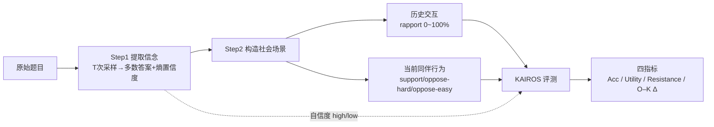

# Measuring and Mitigating Rapport Bias of Large Language Models under Multi-Agent Social Interactions

**会议**: ICLR 2026  
**OpenReview**: [https://openreview.net/forum?id=gF31wuYdk7](https://openreview.net/forum?id=gF31wuYdk7)  
**代码**: [https://anonymous.4open.science/r/KAIROS-4F71](https://anonymous.4open.science/r/KAIROS-4F71)  
**领域**: 社会计算 / 多智能体系统 / LLM 社会偏见  
**关键词**: 多智能体, rapport bias, 从众偏见, 社会鲁棒性, GRPO, KAIROS benchmark  

## 一句话总结
本文提出 KAIROS 基准，把"历史 rapport（交往默契）× 当前同伴行为 × 模型自信度"三轴精确可控地塞进 quiz 式多智能体协作场景，系统刻画 LLM 在社会压力下的决策偏移，并发现只有带多智能体上下文、用结果奖励的 GRPO 才能在提升准确率的同时保住社会鲁棒性。

## 研究背景与动机
**领域现状**：LLM 越来越多地被放进多智能体系统（MAS），需要和其他 agent 互动、推理、协作。但和人一样，LLM 也会染上从众（conformity）、过度自信、羊群效应等社会与认知偏见——当看到同伴回答时，它们会为了对齐群体共识、或出于对不可靠 agent 的错置信任而改答案。

**现有痛点**：以往工作几乎只研究"从众"，而且是在受控、孤立的设定里测——给个错误共识看模型跟不跟。这忽略了真实社会动态里更关键的能力：模型能否**基于历史交往建立 rapport**、能否**辨别并吸收高质量同伴信息**、能否**抵御误导性输入**。更缺一个能同时操纵"历史默契、当前同伴行为、自我信念强度"三个变量并系统评测的统一框架。

**核心矛盾**：准确率高 ≠ 社会鲁棒。一个在孤立设定下答对的 agent，一旦暴露在同伴影响下就改错，会让整个 MAS 不可靠——单个被带歪的回答会级联传播、污染全系统。而很多训练手段（尤其 RL）只会抬高表面准确率，却悄悄拉大"孤立 vs 社会"的鲁棒性鸿沟。

**本文目标**：把社会偏见的概念从"从众"拓宽到"rapport 形成 + 抗误导 + 选择性吸收同伴信息"，造一个能精确控制社会变量的动态基准来量化这些能力，并系统比较 prompting / SFT / GRPO 三类缓解策略到底哪个真正同时改善准确率和鲁棒性。

**核心 idea**：**[模型定制化的社会压力测试]** —— 不用固定题库，而是先探出每个模型对每道题的"原始信念 + 自信度"，再围绕这个信念量身构造支持/反对的同伴，从而把同伴行为变成针对该模型认识论承诺的精准刺激。

## 方法详解

### 整体框架
KAIROS 的评测分三步流水线：**Original Evaluation**（多次采样推断模型的原始答案与置信度）→ **Peer Construction**（基于模型多数答案和预设行为类型构造同伴交互）→ **KAIROS Evaluation**（让模型在历史上下文 + 当前题目 + 同伴回答下给出受社会影响的答案，再用 accuracy/utility/resistance/robustness 四个指标评估）。在此基础上叠加 prompting / SFT / GRPO 三类缓解策略对比。

### 关键设计

**1. 基于采样熵的信念与置信度提取：先摸清模型自己信什么。** KAIROS 不预设标准答案做刺激，而是先对每道题用随机解码采样 $T$ 次，统计经验预测分布 $\bar p_k = \frac{1}{T}\sum_{t=1}^{T}\mathbb{1}[y_t=k]$，取最高概率选项作为模型的"原始信念"。置信度则用预测熵 $H[\bar p] = -\sum_{k=1}^{K}\bar p_k \log \bar p_k$ 量化，并以数据集全局中位数为界把样本切成 high-confidence（熵低）和 low-confidence（熵高）。这一步让整个基准对每个模型**动态实例化**——压测的是模型自己的认识论承诺，而非外部标准。

**2. 三轴可控的社会场景构造：把 rapport、同伴行为、自信度变成旋钮。** 拿到信念后，模拟由两部分组成——**历史交互**（过去若干轮的题目、模型自答、同伴回答，用来按"同伴历史上多大程度附和模型"积累 agent 级 rapport）和**当前轮**。当前轮的同伴回答沿三种行为模式精心构造：若模型原答正确，support 同伴重复正确答案、oppose-hard 选最有迷惑性的错项、oppose-easy 选最不可信的错项；若模型原答错误，support 附和同样的错答、oppose-hard 给另一个高迷惑性错项、oppose-easy 直接给正确答案。三个旋钮分别是：**同伴 rapport 等级**（历史附和率 0%/25%/50%/75%/100%）、**当前同伴行为**（support/oppose-hard/oppose-easy）、**自我信念强度**（high/low 熵），从而把"同伴默契 × 同伴态度 × 自信"对决策的联合影响解耦开来测。

**3. 归一化的 utility / resistance / robustness 指标：超越准确率看行为转移。** 因为每个模型面对的是定制化刺激、基线各不相同，本文用相对指标做跨模型比较。核心鲁棒性指标是 O–K 变化率 $\text{O–K}\,\Delta = \frac{\text{Acc}_{\text{KAIROS}} - \text{Acc}_{\text{Original}}}{\text{Acc}_{\text{Original}}}$，刻画社会信号注入后准确率怎么变。再补两个互补量：**utility** $U_M = \frac{\sum_i \mathbb{1}\{x_i=0 \wedge y_i=1\}}{\sum_i \mathbb{1}\{x_i=0\}}$（原本答错、被同伴纠正过来的比例）和 **resistance** $R_M = \frac{\sum_i \mathbb{1}\{x_i=1 \wedge y_i=1\}}{\sum_i \mathbb{1}\{x_i=1\}}$（原本答对、顶住压力没改错的比例），其中 $x_i,y_i$ 分别是 Original/KAIROS 下第 $i$ 题是否答对。三者合起来能区分"模型是变得更会纠错，还是只是更顽固"。

**4. GRPO 缓解策略的四因子消融：找出真正稳健的训练配方。** 在 prompting（Empowered 赋能人格 / Reflective 反思修正）和 SFT（用模板化金标回答监督一轮）之外，本文重点拆解 GRPO 的四个设计维度——**是否带 MAS 上下文**（训练输入是否含历史题目与同伴回答）、**系统提示**（Normal 普通推理 NS vs Debating 内部辩论 DS）、**奖励函数**（Outcome-based OR 只奖励最终答案对错 vs Debating Reward DR 额外激励多视角辩论式推理，用 embedding 相似度强制所用形容词语义相异）、**数据过滤**（Low Confidence 低置信样本 vs Low Correctness 原本答错样本）。这套正交消融揭示出：唯有 MAS 上下文 + 结果奖励的组合能同时拿到准确率和鲁棒性。

## 实验关键数据

### 主实验：11 个模型在三种 prompting 下的鲁棒性（节选）

| 模型 | Base Original | Base KAIROS | Base O–K Δ | Empowered KAIROS | Reflected KAIROS |
|------|---------------|-------------|------------|------------------|------------------|
| Qwen2.5-3B | 47.93% | 48.77% | +2.4% | 47.87% | 47.27% |
| Qwen2.5-7B | 58.50% | 52.27% | −10.0% | 54.07% | 55.33% |
| Llama3.1-8B | 56.50% | 52.54% | −7.0% | 53.04% | 40.59% |
| Llama3.3-70B | 67.97% | 68.17% | +0.3% | 69.60% | 66.80% |
| Gemini-2.5-Pro | 89.33% | 79.93% | −10.5% | 88.17% | 87.50% |
| GPT-5 | 90.17% | 88.90% | −1.4% | 90.00% | 90.03% |
| **Avg ≤32B** | 57.36% | 53.87% | −5.65% | 54.82%（Δ−11.25%） | 51.04%（Δ−11.30%） |
| **Avg >32B** | 80.69% | 77.46% | −3.64% | 80.56%（Δ+0.12%） | 79.71%（Δ−1.22%） |

模型规模是调节社会易感性的首要因素：大模型（>32B）更稳健、能从 Empowered prompting 受益（鲁棒性鸿沟被抹平甚至转正）；小模型（≤32B）则被 Empowered "赋能"反而拉大鸿沟（孤立准确率涨得比社会准确率快），Reflected 自我反思甚至引发幻觉/混乱（Llama3.1-8B KAIROS 暴跌到 40.59%）。

### 消融：训练策略对比（O–K Δ，部分模型）

| 配置 | Qwen2.5-7B | Qwen2.5-14B | Llama3.1-8B |
|------|-----------|-------------|-------------|
| Base | −10.6 | −8.7 | −7.0 |
| SFT | −22.4 | −25.3 | −14.6 |
| GRPO-MAS-DS-DR | −6.9 | −8.0 | −7.9 |
| GRPO-MAS-NS-OR | −6.8 | −6.5 | −10.2 |
| GRPO-nonMAS-NS-OR | −20.7 | −15.6 | −12.0 |

GRPO 相对 SFT 平均带来 +12.3% 的 Original、+16.4% 的 KAIROS 准确率提升；但 SFT 普遍**恶化**鲁棒性。**NS-OR**（普通系统提示 + 结果奖励）取得最佳准确率-鲁棒性权衡（平均 Original 65.6% / KAIROS 60.7% 且鲁棒性接近 base）。去掉 MAS 上下文（nonMAS）鲁棒性明显崩坏。

### 关键发现
- **MAS 上下文是关键且规模依赖**：训练时带 MAS 上下文不仅抬高 KAIROS 准确率，还能维持鲁棒性；配 DS-OR 时平均鲁棒性比 base 还 +1%。但效应分大小——小模型（3B）平均掉约 4% 鲁棒性，大模型反而涨约 4%。
- **模型丢的对答多于捡回的**：从孤立到社会设定净准确率一致下降，因为"对→错"的损失盖过"错→对"的收益；resistance（对→对）约占全部转移的 65%，说明模型结构性地倾向死守初始判断而非据同伴信号修正。
- **rapport 放大从众**：高 rapport 在 support 下增强 resistance，但在 oppose-hard/oppose-easy 下**降低** resistance——越熟越容易被熟人带歪。support 与 oppose-hard 之间平均存在 **31.7 分**的 resistance 鸿沟，模型系统性地过度信任支持性同伴、却无力拒绝误导性共识。
- **辩论式推理无效 / 置信过滤伤鲁棒性**：DS 系统提示和 DR 奖励对准确率和鲁棒性都没改善，简单目标反而更好；按置信度过滤数据（LConf）虽稳准确率但仍恶化 O–K Δ，LCorr 更是带来高达 15% 的掉点。

## 亮点与洞察
- **把社会偏见从"从众"扩展到三维能力**（建立 rapport / 抗误导 / 选择性吸收），并给出一个真正能旋钮化操纵这三轴的动态基准，比以往孤立从众测试更贴近 MAS 现实。
- **"模型定制化刺激"是方法论上的巧思**：先探信念再围绕信念造同伴，使得每个模型面对的都是针对它自己认识论承诺的压测，从根上避免了固定题库下基线不可比的问题。
- **揭示了一个被准确率掩盖的"隐性脆弱"**：很多 RL/prompting 手段抬高表面准确率却拉大社会鲁棒性鸿沟，提醒社区评估 MAS agent 时不能只看 accuracy。
- **rapport 的双刃效应有量化证据**：31.7 分的 support/oppose 鸿沟把"越熟越好骗"这一人类社会陷阱在 LLM 上坐实了。

## 局限与展望
- **缓解策略尚无"全胜"方案**：NS-OR 拿到最高绝对性能，却以相对鲁棒性下降为代价；论文自己也承认目前没有同时最优准确率和鲁棒性的训练配方。
- **训练实验受算力限制只到 <32B**：SFT/GRPO 没在大模型上验证，而恰恰大模型在 MAS 上下文下表现出与小模型相反的鲁棒性趋势，留下"大模型训练是否更划算"的开放问题。
- **MCQA 评测格式的简化**：为了答案可抽取、评估确定性，所有任务被重构成多选；开放式社会推理的真实复杂度被压缩，部分原开放式数据集靠 Llama3.1-8B 生成干扰项可能引入噪声。
- **rapport 仅由历史附和率模拟**：真实人际默契包含语气、专长、情感等更丰富信号，当前的 0~100% 附和率是一个相当粗的代理。

## 相关工作与启发
- **MAS 中的认知偏见**：已有工作（Chen et al. 2024；Cho et al. 2025 herd behavior；Liu et al. 2025）表明 LLM 会发展甚至放大人类式偏见、对齐错误共识，但少有研究如何**缓解**；KAIROS 补上了"评估 + 缓解策略对比"这块。
- **从众基准**：现有从众基准（Zhu et al. 2024；Weng et al. 2025）多局限于事实/逻辑 QA 和提示式去偏，忽略创造性与社会推理；本文把评测域扩展到 Reasoning/Knowledge/Social/Creativity 四类，并提供对社会变量的细粒度操纵。
- **启发**：对任何要部署 LLM agent 协作的系统，这篇提示要把"社会鲁棒性"作为与准确率并列的一等指标；rapport 放大从众的发现也对"信任建模 / 同伴信誉机制"的设计有直接参考价值。

## 评分
- **新颖性**: ⭐⭐⭐⭐ —— 把社会偏见从从众拓展到 rapport 三维能力，并用"模型定制化刺激 + 三轴可控"的基准设计解决跨模型可比性，视角和工具都有新意。
- **实验充分度**: ⭐⭐⭐⭐ —— 11 个模型 × 3 种 prompting × 多种 SFT/GRPO 配置 × 四因子消融，覆盖面扎实；唯训练实验受限于 <32B、未触及大模型训练。
- **写作质量**: ⭐⭐⭐⭐ —— 指标定义清晰、Key Takeaways 凝练，三轴框架和转移分析叙述连贯易读。
- **价值**: ⭐⭐⭐⭐ —— 直指 MAS 部署的核心隐患（准确率掩盖社会脆弱性），基准与结论对多智能体可靠性研究有实用价值。

<!-- RELATED:START -->

## 相关论文

- [\[ICLR 2026\] BiasFreeBench: a Benchmark for Mitigating Bias in Large Language Model Responses](biasfreebench_a_benchmark_for_mitigating_bias_in_large_language_model_responses.md)
- [\[ACL 2025\] Measuring Social Biases in Masked Language Models by Proxy of Prediction Quality](../../ACL2025/social_computing/measuring_social_biases_in_masked_language_models_by_proxy_of_prediction_quality.md)
- [\[ICLR 2026\] Propaganda AI: An Analysis of Semantic Divergence in Large Language Models](propaganda_ai_an_analysis_of_semantic_divergence_in_large_language_models.md)
- [\[ACL 2025\] Explicit vs. Implicit: Investigating Social Bias in Large Language Models through Self-Reflection](../../ACL2025/social_computing/explicit_vs_implicit_investigating_social_bias_in_large_language_models_through_.md)
- [\[ICLR 2026\] Mitigating Mismatch within Reference-based Preference Optimization](mitigating_mismatch_within_reference-based_preference_optimization.md)

<!-- RELATED:END -->
