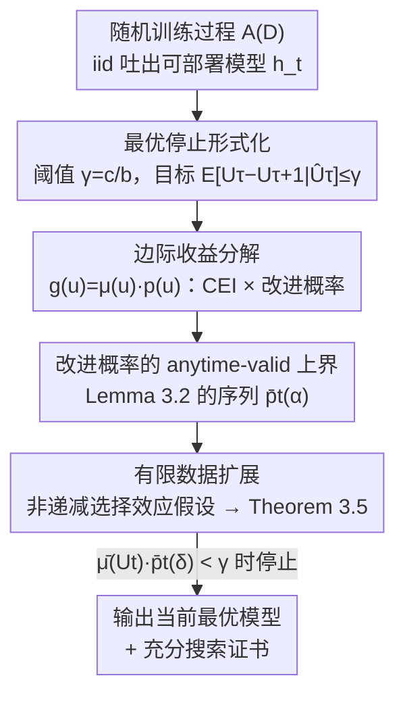

# Statistical Guarantees in the Search for Less Discriminatory Algorithms

**会议**: ICLR 2026  
**OpenReview**: [https://openreview.net/forum?id=n8FKO0DIl8](https://openreview.net/forum?id=n8FKO0DIl8)  
**代码**: https://github.com/johnchrishays/lda  
**领域**: 算法公平 / 学习理论  
**关键词**: 公平性, 歧视性更小的算法, 最优停止, anytime-valid 推断, 差别影响

## 一句话总结
本文把"企业为满足反歧视法、寻找差别影响更小的替代模型（LDA）"这件事形式化成一个**最优停止问题**，并给出一套自适应停止算法：在不知道模型性能分布、只能用有限数据评估的现实条件下，对"继续重训能再降多少差别影响"给出一个高置信度上界，使企业可以在收益不再值得成本时停手，并向法院/合规团队**出具"搜索已充分"的统计证书**。

## 研究背景与动机

**领域现状**：美国反歧视法中的"差别影响（disparate impact）"原则要求，如果存在一个能同样满足业务目标、但对受保护群体歧视更小的替代决策方案（Less Discriminatory Alternative, LDA），企业拒绝采用就可能承担法律责任。近年学界与监管者（如 CFPB）进一步主张：在招聘、信贷、住房等高风险场景里使用数据驱动模型的企业，应当**主动搜索"歧视性更小的算法"（LDA）**。

**现有痛点**：这种搜索之所以"看起来可行"，依据的是**模型多重性（model multiplicity）**——训练过程本身是随机的（随机种子、batch 顺序、特征子集、子采样等），用相同流程重训会得到**预测性能相当、但差别影响差异显著**的不同模型。于是企业理论上可以多采样几个高性能模型、挑差别影响最小的那个部署。但问题在于：**企业不可能无限重训**。一篇金融博客的吐槽点出了要害——"没人给这种搜索提出任何边界，到底要花多少资源、时间、精力才算尽到了努力，完全说不清"。

**核心矛盾**：搜索可能"永远停不下来"——再多训一个模型，总有可能挖出更好的 LDA；而现代 ML 多是非凸的丰富函数类，找全局最优往往不现实。于是核心问题变成：**何时的搜索才算"充分"到足以证明企业尽了善意（good faith）？** 这既是法律问题，也是一个缺乏量化工具的统计问题。

**本文目标**：给"对 LDA 的充分搜索"一个可操作的形式化定义，并给出一个**能让企业证明自己已完成充分搜索**的程序。

**切入角度**：作者注意到，企业不会预先知道还没训出来的模型长什么样，只能**顺序地一个个训练、看边际收益是否还值回成本**——这天然就是一个**最优停止 / 序贯搜索**结构（类似经济学里的 Pandora's Box，但本文几乎不假设分布已知）。

**核心 idea**：把 LDA 搜索建模为最优停止问题，用 **anytime-valid 推断**对"再训一个模型能带来的边际差别影响下降"维持一个**任意时刻都成立的高概率上界**；当上界跌破"成本/收益比"阈值 $\gamma$ 时即可停手，并把这个上界本身作为"继续搜索收益有限"的证书。

## 方法详解

### 整体框架

把场景抽象成：企业有一个固定数据集 $D$ 和一个随机训练过程 $\mathcal{A}(D)$，每调用一次就 iid 地吐出一个可部署模型 $h_t$。每个模型的"效用"是它在总体分布上的差别影响损失 $Q_t = Q(h_t)$（典型取为参照组与受保护组选择率之差 $Q_{DI}(h)=\mathbb{E}[h(X)\mid g(X)=0]-\mathbb{E}[h(X)\mid g(X)=1]$，已归一化到 $[0,1]$）。企业部署的是**目前为止经验差别影响最低的那个模型**，其真实/经验差别影响记为 $U_t \triangleq Q_{i_t}$、$\hat U_t \triangleq \hat Q_{i_t}$，其中 $i_t=\arg\min_{i\le t}\hat Q_i$。

整条理论的目标是构造一个停止时刻 $\tau$，使得在该时刻"再训一个模型能带来的期望边际下降"以高概率不超过阈值 $\gamma$。作者分三个由易到难的设定推进：先假设分布已知且数据无限（full-information），再放松到分布未知（infinite-data），最后处理只有有限数据、只能观测到带噪经验值 $\hat Q_t$ 的现实情形（finite-data）。最终落地为一个简单的自适应算法：每训一个模型就更新一个边际收益上界 $\bar\mu(U_t)\cdot\bar p_t(\delta)$，一旦它跌破 $\gamma$ 就停。

### 关键设计

**1. 把 LDA 搜索形式化为最优停止：用成本/收益比 $\gamma$ 定义"何时算够"**

痛点是法律和监管只说"要尽善意搜索"，却没有任何可量化的停止准则。作者引入两个由企业预先指定的量：训练单个模型的成本 $c$、以及差别影响每改进一个单位的价值 $b$，把"再训一个模型值不值"归结为一个阈值判断。具体地，在已训 $\tau$ 个模型后，若期望边际收益不再超过成本，即 $b\cdot\mathbb{E}_{P_0}[U_\tau-U_{\tau+1}\mid \hat U_\tau]\le c$，就有理由停止。令 $\gamma \triangleq c/b$，停止条件写成

$$\mathbb{E}_{P}[U_\tau-U_{\tau+1}\mid \hat U_\tau]\le \gamma.$$

这一形式化的巧妙在于：边际收益 $U_t-U_{t+1}$ 随模型增多是**单调非增**的，而成本是线性的，因此"再训一个不值"等价于"再训 $k$ 个都不值"——只要单步停止条件满足，就可一劳永逸地论证继续搜索无意义。在最理想的 full-information 设定下，记最优模型当前值为 $u$，新样本的期望边际收益是 $g(u)\triangleq\mathbb{E}_{Q\sim P_0}[(u-Q)\cdot\mathbb{I}[u>Q]]$，它弱单调递增且 $g(0)=0$，于是存在唯一阈值 $u_P^*=\sup\{u:g(u)\le\gamma\}$，停止准则就退化为"采样到一个低于 $u_P^*$ 的值就停"，停止时刻服从几何分布。难点全在于现实中 $P$ 未知、$Q_t$ 又观测不到。

**2. 把边际收益分解成"改进概率 × 条件期望改进"，分而治之**

直接对 $g(u)$ 给上界很难，作者的关键技巧是把它精确分解为两个语义清晰的因子：

$$g(u)=\underbrace{\mathbb{E}_{P_0}[u-Q\mid u>Q]}_{\mu(u)\ \text{条件期望改进 (CEI)}}\cdot\underbrace{P_0(u>Q)}_{p(u)\ \text{改进概率}}.$$

$\mu(u)$ 刻画"一旦抽到更好的模型，平均能好多少"（与随机变量的"平均剩余寿命"概念相关），$p(u)$ 刻画"抽到更好模型的概率有多大"。只要分别给这两项一个上界、再相乘，就得到 $g(u)$ 的上界。对 $\mu$，最保守的通用上界是 $\bar\mu_{\text{universal}}(u)=u$（因为 $Q\ge0$，改进量不会超过当前值本身），无需任何分布假设即成立；当企业愿意对分布 $P_0$ 施加更强假设（附录给出一系列假设 A1/A2/A3）时，可得到更紧的 $\bar\mu$。这种"通用 + 可选加强"的设计让方法既能零假设运行、又能在企业掌握领域知识时收紧界。

**3. 对"出现新最小值的概率"给出 anytime-valid 高概率上界（核心理论贡献）**

最关键也最难的是给改进概率 $p(U_t)$ 一个**对所有时刻同时成立**的上界——因为停止决策依赖于"目前为止见过的最小值"，普通的固定时刻置信界不够用。作者证明了一条对任意 iid 序列都成立的引理：设 $\{X_t\}$ iid，$Y_t=\min_{s\le t}X_s$ 为前 $t$ 个的最小值，对任意 $\alpha\in(0,1)$ 定义序列

$$\bar p_t(\alpha)=\begin{cases}1-e^{-1/\alpha}, & t=1\\[4pt] 1-\left(\frac{t-1}{\alpha}+1\right)^{-1/(t-1)}, & t>1\end{cases}$$

则"在任意时刻 $t$，下一个样本 $X_{t+1}$ 跌破当前最小值 $Y_t$ 的条件概率超过 $\bar p_t(\alpha)$"这一坏事件，整体只以不超过 $\alpha$ 的概率发生：$P(\exists t:\ P_0(X_{t+1}<Y_t\mid Y_t)>\bar p_t(\alpha))\le\alpha$。这就是 anytime-valid 的精髓——界不是为某个事先选定的 $t$ 成立，而是对**整条时间线一致**成立，因此可以"边看边停"而不破坏统计有效性。注意 $\bar p_t(\alpha)$ 与时间无关地随 $t$ 单调趋于 0，这保证了算法终会停下。作者还在附录给出一个渐近近最优（但更复杂）的版本。把它代入即得 $P(\exists t:\ p(U_t)>\bar p_t(\delta))\le\delta$。

**4. 用"非递减选择效应"假设把保证从理想观测推广到有限数据**

现实中企业看不到真实 $Q_t$，只能在有限测试集上观测带噪的 $\hat Q_t$，部署的也是经验最优 $\hat U_t$。麻烦在于"挑当前最优"会引入**选择偏差 / 均值回归**：经验上看着最好的模型，真实差别影响往往没那么好。作者提出一个温和且在统计文献中常见的假设来桥接二者——选择效应（真实值与经验值之差的期望）随 $t$ **非递减**：

$$\mathbb{E}_{P}[U_t-\hat U_t\mid\hat U_t]\ \ge\ \mathbb{E}_{P}[U_{t+1}-\hat U_{t+1}\mid\hat U_t].$$

直观上，对 sub-Gaussian/sub-exponential 的左尾，均值回归至少是常数级、不会越来越小，该假设就成立；只有当"较低的 $\hat U_t$ 反而对应更高真实差别影响"这种反常情形才会被违反。在此假设下，可以**把 Algorithm 1 原封不动地作用在经验序列 $\{\hat U_t\}$ 上**，得到主定理 Theorem 3.5：算法在某有限时刻 $\tau$ 停止，且 $P(\mathbb{E}_{P}[U_\tau-U_{\tau+1}\mid\hat U_\tau]\le\gamma)\ge 1-\delta$。也就是说，仅凭有限数据上的经验观测，就能对**真实**差别影响的边际收益给出高概率保证。

### 损失函数 / 训练策略
本文无神经网络训练目标，核心是 Algorithm 1：循环采样模型 $X_t\sim P$，维护当前最小值 $Y_t=\min_{s\le t}X_s$ 与上界序列 $\bar p_t$，当 $\bar\mu(Y_t)\cdot\bar p_t(\delta)<\gamma$ 时返回 $Y_t$。算法终止性由 $\bar\mu_t(\cdot)\le1$ 且 $\lim_{t\to\infty}\bar p_t(\delta)=0$ 保证；且**最大训练模型数可由 $\delta,\gamma$ 直接算出**（找最小的 $t$ 使 $\bar p_t(\delta)<\gamma$），与数据无关。框架还有两个实用副产品：因为是 anytime-valid，企业**无需预先指定成本** $c$，可边训边看边决定；反过来，观察企业何时停手，还能"反推"出它对降低差别影响的隐含估值，为"搜索是否合理"的辩论提供量化依据。

## 实验关键数据

实验在三个真实信贷/住房数据集上验证：Adult、Folktables、HMDA；ML 方法用逻辑回归、随机森林、梯度提升树。由于真实数据分布与真实模型差别影响分布都未知，作者把有限数据集当作"总体分布"，再子采样出训练/测试集来逼近 full-information 基准。

### 主实验

| 维度 | 观测 | 说明 |
|--------|------|------|
| 差别影响的变异性（Fig. 2） | 多个数据集/方法上，最高与最低差别影响之间约有 **20% 的跨度** | 重训有收益的前提，确认模型多重性确实存在 |
| 算法停止时刻 vs 全信息停止时刻（Fig. 1） | 算法上界（粉线）相对真实边际收益（棕线）一般"过冲" **数十个模型** | 在保证有效性的前提下偏保守，多训几十个即可 |
| 实际所需模型数 | 约 **60 个**模型后，每新增一个模型的边际收益就掉到 **百分之几的百分之一（hundredths of a percent）** | 多数场景训练少量模型就够 |
| 最快收敛场景 | 部分数据集 **不到 10 个**模型后边际收益就极小 | 全信息边际收益存在显著异质性 |

### 消融 / 分析

| 配置 | 表现 | 说明 |
|------|---------|------|
| 无任何分布假设（$\bar\mu(\hat U_t)=\hat U_t$，$\delta=0.05$） | 可直接运行，界较松 | 默认通用上界，零假设 |
| 加分布假设 A1/A2/A3 | 界更紧（粉线更贴近棕线） | 企业掌握领域知识时收紧 |
| 逻辑回归 / HMDA 数据 | 算法过冲更明显、表现相对更差 | 对某些方法/数据偏保守 |
| 配合 Fairlearn 等公平 ML 框架（附录） | 方法可与公平感知训练**组合** | 不局限于普通重训 |

### 关键发现
- **多数情况下少量模型就足够**：约 60 个模型后边际收益跌到可忽略，有些不到 10 个就够——这对"LDA 搜索会不会无止境"的质疑给出了实证回应：不会。
- **全信息边际收益高度异质**：不同数据集/方法的收敛速度差异很大，没有统一的"训 N 个就够"答案，正说明需要一个自适应停止准则而非固定预算。
- **保守但可用**：算法上界一般比理想停止点晚数十个模型，是为了换取 anytime-valid 的统计严谨性；更强的分布假设能让界更紧。

## 亮点与洞察
- **把"法律意义上的善意努力"翻译成可计算的停止保证**：用 $\gamma=c/b$ 这一个比值串起成本、收益与法律责任，是少见的把合规问题真正形式化、可出具"证书"的工作。
- **$g(u)=\mu(u)\cdot p(u)$ 的分解干净利落**：把难以直接处理的边际收益拆成"改进概率"与"条件期望改进"两个语义清晰、可独立加界的因子，是整个证明能跑通的关键支点。
- **anytime-valid 是方法论灵魂**：界对整条时间线一致成立，使"边训边停"不破坏统计有效性，还附带"无需预先指定成本"和"可反推企业隐含估值"两个意外好用的副产品。
- **可迁移性强**：框架对任意 $[0,1]$ 有界损失都成立，不止差别影响——把 $\ell$ 换成准确率或公平-准确率加权组合，就变成"何时停止搜索更优模型"的通用序贯停止工具。

## 局限与展望
- **依赖 iid 重训假设**：要求 $\mathcal{A}(D)$ 每次 iid 吐模型，但现实中的"自适应搜索"（前面模型的表现会影响下一个模型的训练分布）不满足该假设，作者也把它列为重要的未来方向。
- **成本 $c$ 与价值 $b$ 仍是外生给定**：如何确定一个模型的训练成本、以及降低差别影响值多少钱，本文不解决，留给法律/经济学辩论——而这恰恰是整个判据的输入。
- **有限数据保证依赖 Assumption 3.4**：非递减选择效应在反常分布下可能不成立，此时 Theorem 3.5 的保证失效。
- **界偏保守**：默认通用上界会过冲数十个模型，需要额外分布假设才能收紧；逻辑回归与 HMDA 上表现尤其保守。
- 作者也强调：本程序只是企业搜索 LDA 这一整套复杂步骤中的"一块拼图"，真实案件还涉及大量关于模型假设、变量选择是否合理的定性辩论。

## 相关工作与启发
- **vs LDA / 模型多重性文献（Black et al. 2024；Black et al. 2022；Rodolfa et al. 2021）**：他们论证"应该搜索 LDA"并实证模型多重性存在，但没回答"搜索到什么程度才算充分"；本文正是补上这块——给搜索的**充分性**一个可认证的统计判据。
- **vs Pandora's Box / 经典最优停止（Weitzman 1978；Beyhaghi & Cai 2024）**：经典问题里决策者对**已知分布**付费采样、目标是最大化总效用；本文反过来——几乎不假设分布已知，且目标不是最大化总效用，而是对**再采一个样本的边际收益**给出高概率保证。
- **vs 选择性推断 / 均值回归校正（Andrews et al. 2024；Zrnic & Fithian 2024）**：本文借用"非递减选择效应"这一在该文献中常见的假设，把"挑经验最优"引入的选择偏差纳入有限数据保证。

## 评分
- 新颖性: ⭐⭐⭐⭐⭐ 首次把"LDA 充分搜索"形式化为可认证的最优停止问题，并给出新的 anytime-valid 上界序列。
- 实验充分度: ⭐⭐⭐⭐ 三个真实信贷/住房数据集 + 三类模型 + 与全信息基准对比，但偏验证性、规模有限。
- 写作质量: ⭐⭐⭐⭐⭐ 法律动机—形式化—三层递进证明—实证的脉络清晰，理论叙述严谨。
- 价值: ⭐⭐⭐⭐⭐ 直接服务于反歧视合规这一高风险现实问题，给企业和法院提供了可操作工具，跨法律与 ML 的桥梁价值突出。

<!-- RELATED:START -->

## 相关论文

- [\[ACL 2026\] Decide less, communicate more: On the construct validity of end-to-end fact-checking in medicine](../../ACL2026/social_computing/decide_less_communicate_more_on_the_construct_validity_of_end-to-end_fact-checki.md)
- [\[AAAI 2026\] T2Agent: A Tool-augmented Multimodal Misinformation Detection Agent with Monte Carlo Tree Search](../../AAAI2026/social_computing/t2agent_a_tool-augmented_multimodal_misinformation_detection_agent_with_monte_ca.md)
- [\[NeurIPS 2025\] Auto-Search and Refinement: An Automated Framework for Gender Bias Mitigation in LLMs](../../NeurIPS2025/social_computing/auto-search_and_refinement_an_automated_framework_for_gender_bias_mitigation_in_.md)
- [\[NeurIPS 2025\] DeepTraverse: A Depth-First Search Inspired Network for Algorithmic Visual Understanding](../../NeurIPS2025/social_computing/deeptraverse_a_depth-first_search_inspired_network_for_algorithmic_visual_unders.md)
- [\[ICLR 2026\] Propaganda AI: An Analysis of Semantic Divergence in Large Language Models](propaganda_ai_an_analysis_of_semantic_divergence_in_large_language_models.md)

<!-- RELATED:END -->
