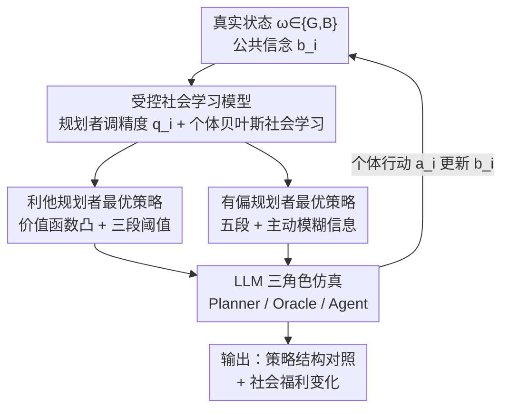

# Steering the Herd: A Framework for LLM-Based Control of Social Learning

**会议**: ICLR 2026  
**OpenReview**: [https://openreview.net/forum?id=RtS4UqSmNt](https://openreview.net/forum?id=RtS4UqSmNt)  
**领域**: LLM 社会计算 / 信息设计 / 社会学习  
**关键词**: 社会学习, 信息中介, LLM 规划者, 信息级联, 贝叶斯说服

## 一句话总结
本文把"LLM 作为信息中介"形式化为一个**受控序列社会学习**模型——规划者只能调节每个个体私有信号的精度（不能造假、不能偏选），而个体在私有信号之外还会观察前人的行动来更新公共信念；作者证明了利他规划者价值函数的凸性、刻画了利他与有偏两类规划者的最优策略（有偏者甚至会主动"模糊"信息），并用 LLM 同时扮演规划者和个体跑仿真，发现 LLM 规划者涌现出的策略与理论最优高度吻合。

## 研究背景与动机
**领域现状**：LLM 越来越多地充当"信息中介"——搜索引擎、新闻聚合、个性化推荐、医疗/政治建议助手。这类算法不是在真空里影响单个用户，而是嵌入在一个**人传人**的社会过程里：用户既接收算法推送的私有信息，又会观察身边人/前人的选择来做决策。

**现有痛点**：经典社会学习理论（Bikhchandani、Banerjee 等）刻画了序列个体如何因观察前人行动而形成信息级联（herding），但几乎不考虑有一个**中心化的算法规划者**在背后调控信息；而经典信息设计/贝叶斯说服（Kamenica-Gentzkow）则只研究"一对一"的发送者-接收者，忽略了接收者之间的社会学习。两条线各管一段，缺一个能把"算法调控"与"社会学习"耦合起来的可解模型。

**核心矛盾**：规划者每一步的选择不只影响当前个体，还会通过当前个体的行动改变**公共信念**，从而给所有未来个体制造"信息外部性"——这是一个动态规划问题与去中心化贝叶斯决策交织的耦合，远比单步说服复杂。

**本文目标**：(1) 建一个把信息中介的动态控制与序列社会学习结合的可解模型；(2) 刻画利他与有偏两类规划者在演化公共信念上的最优策略；(3) 用 LLM 实证检验这套理论在非贝叶斯个体面前是否还成立。

**切入角度**：作者刻意给规划者套上"透明性枷锁"——它和个体掌握完全相同的历史信息、不能撒谎或偏选、只能调节信号精度且调节本身可被观测。在如此苛刻的约束下，若仍能显著操纵社会福利，就更能说明信息中介的风险。

**核心 idea**：把规划者的问题写成一个状态为公共信念 $b_i$、控制为信号精度 $q_i$ 的无限期折扣 MDP，用动态规划求最优策略，再让 LLM 同时演规划者、个体和信号生成器来验证。

## 方法详解

### 整体框架
模型设定一个规划者面对**可数个序列到达的贝叶斯理性个体** $i=1,2,\dots$。世界有一个固定但未知的真实状态 $\omega\in\{G,B\}$（如餐厅好/坏），先验 $P(\omega=G)=b_1$ 对所有人公开。每一步规划者为个体 $i$ 选一个**信号精度** $q_i\in[0.5,1]$，使个体收到的二元私有信号 $s_i$ 满足 $P(s_i=\omega)=q_i$；个体结合这个私有信号和**所有前人的行动历史** $H_i$ 做出行动 $a_i\in\{G,B\}$，行动正确（$a_i=\omega$）得效用 0、错误得 $-C$。所有人共享同一个**公共信念** $b_i=P(\omega=G\mid H_i)$，它是历史的充分统计量、构成马尔可夫过程，每个个体行动后被更新。

整个系统是一个闭环：规划者根据当前公共信念选精度 → 个体据私有信号和公共信念行动 → 行动被观测、更新公共信念 → 进入下一个体。仿真时这条回路由三个 LLM 角色实现：**Planner**（选精度）、**Oracle**（按指定精度为个体定制一条私有信息）、**Agent**（扮演给定画像、读历史和私有信息后决策）。

### 关键设计

**1. 受控序列社会学习模型：把"调精度"塞进社会学习的信念更新**

针对"算法调控"与"社会学习"两条理论线各管一段的痛点，本文构造了一个统一的可解模型。关键是让规划者的唯一杠杆是**信号精度** $q_i$，而非信号内容——它不能造假、不能偏选，只能决定私有信号有多"清晰"。个体 $i$ 用历史 $H_i$（等价于公共信念 $b_i$）和私有信号 $s_i$ 算出私有信念 $\tilde b_i=P(\omega=G\mid H_i,q_i,s_i)$，再取后验更可能的状态行动。代入后得到一个干净的**阈值型行动规则**：

$$a_i=\begin{cases} s_i & 1-q_i\le b_i\le q_i\\ G & q_i<b_i\\ B & q_i<1-b_i\end{cases}$$

这条规则揭示了模型的核心张力：只有当精度 $q_i$ 落在 $[1-b_i,\,b_i]$（或对称区间）内时，个体行动才会"跟着私有信号走"、从而**泄露**私有信息并推动公共信念更新（$b_{i+1}=\tilde b_i$）；一旦精度太低、公共信念太强，个体就无视私有信号、直接随大流，公共信念卡死不动——这就是经典的**信息级联/羊群**，是一个吸收态。个体的期望效用也因此化简为 $-C\min(b_i,1-b_i,1-q_i)$。规划者正是在"花钱提精度让社会继续学习"与"省钱但放任级联"之间博弈。

**2. 利他规划者的最优策略：价值函数凸性撑起三段式阈值**

利他规划者想让个体行动匹配真实状态（$a_i=\omega$），即最大化社会福利减去精度投入成本，目标写成折扣因子 $\delta$ 下的无限期 MDP，瞬时奖励 $r_A(b_i,q_i)=-\beta(q_i)-C\,P(a_i\ne\omega\mid b_i,q_i)$。本文的核心理论贡献之一是证明 **$V_A^*(\cdot)$ 关于公共信念是凸函数**（Theorem 2）。这个证明并不平凡：因为个体行动依赖公共信念，期望效用不再是信念的线性函数，经典"线性即凸"的论证失效，作者需要绕过行动对信念的依赖来建立凸性——凸性正是刻画最优策略的关键工具。

基于凸性，最优利他策略呈现**三段相位**（Theorem 3，存在 $0<d_A\le t_A\le t_M\le 0.5$）：公共信念极端（很强）时不投资、用基线精度 $p$（因为大局已定）；公共信念接近 0.5、信息最匮乏时若成本不过高就上**满精度 1**，让个体行动以概率 1 等于真实状态、公共信念直接坍缩到 0 或 1；中间区间则选**恰好能让个体跟私有信号走的最小精度** $\max(b,1-b)$——这是"维持社会学习"的最低成本精度，再低个体就无视信号了。值得注意的是，考虑了社会学习的整体最优比短视最优（$\delta=0$）需要**更强**的公共信念才肯停止投资，因为短视者不计未来个体的收益。

**3. 有偏规划者的最优策略：五段相位，甚至主动模糊信息**

有偏规划者无视真相、只想诱导出特定行动 $G$，其奖励 $r_B(b_i,q_i)=-\beta(|q_i-p|)-C\,P(a_i=B\mid b_i,q_i)$，且偏离基线 $p$ 的任意精度（无论调高调低）都要付成本。它的最优策略更复杂，呈**五段相位**（Theorem 5）。其中最反直觉的是：当公共信念已**弱有利**于 $G$（$b\in[0.5,t_2)$）或更高（$(t_2,p]$）时，规划者会把精度**降到 $p$ 以下、甚至降到 $b-\epsilon$**，让个体彻底无视私有信号、直接随大流选 $G$——也就是**主动模糊/降低信息质量**，把社会锁进一个有利的级联，因为此时"一个私有坏信号掀翻有利信念"的风险，超过了降精度的成本。反过来当公共信念逼近不利级联时（$b\in(t_1,1-p]$），规划者会**孤注一掷拉高精度**，哪怕信号期望是 $B$，也博一个非零概率把社会拽出不利级联。这套策略说明：即便戴着"不能造假、信息对等、完全可观测"的枷锁，有偏规划者仍能通过纯粹的精度调控把社会福利推向任一方向。

**4. LLM 三角色仿真：在非贝叶斯个体上检验理论**

理论假设个体是贝叶斯理性的，但 LLM（和人）都有系统性认知偏差，所以作者用 LLM 同时扮演 Planner、Oracle、Agent，在"买不买新车"的场景上跑仿真，检验理论是否 robust。仿真先单独测 LLM 个体的信念更新，发现三条非贝叶斯偏差：(NB1) 对**契合先验**的私有信号反应不足；(NB2) 对**违背先验**的私有信号反应过度；(NB3) 因而需要更强的公共信念才肯进入级联——这些偏差在人类实验里也被观察到。关键发现是：即便面对这种非贝叶斯个体，**LLM 规划者涌现出的策略仍与理论最优高度吻合**，多数信念区间偏差小于 10%；而且 LLM 的偏离恰恰是对个体非贝叶斯行为的**策略性适应**（如避免 0.5/1.0 的极端精度、投资退坡更平滑、在极低信念下仍坚持"孤注一掷"）。这把抽象理论锚定到了真实 LLM 行为上。

## 实验关键数据

实验在"买车"场景下用 LLM 扮演三角色，成本函数取线性 $\beta(q)=k|q-p|$，固定错误成本 $C=1$，变动 $k$、基线精度 $p$、折扣 $\delta$，并与规划者 MDP 的数值最优解对比。

### 主结果：LLM 策略 vs 理论最优

| 设置 | 利他规划者 | 有偏规划者 |
|------|-----------|-----------|
| 定性趋势是否吻合 | 是：信念强则停投、信念不确定则重投 | 是：逃离不利级联时重投、中点附近降精度、有利后停投 |
| 多数信念区间策略偏差 | < 10% | < 10% |
| LLM 特有偏离 | 避免极端精度、投资退坡更平滑 | 极低信念下仍坚持"孤注一掷" |

### 社会福利影响（相对无控制基线）

| 设置 | 真实状态 | 社会福利变化 | 机制 |
|------|---------|-------------|------|
| 利他规划者（数值/LLM） | 任意 | 单调不降（精度越高福利越高） | 总是改善 |
| 有偏规划者·失配（$\omega=B$ 但诱导 $G$） | B | **下降 40–50%** | 主动降精度、模糊真相 |
| 混合（最优策略 + LLM 个体） | — | 表现变"脆"、劣于 LLM 自身策略 | 为贝叶斯个体设计的策略在非贝叶斯个体上失灵 |

### 关键发现
- **考虑社会学习是决定性的**：无论解析还是 LLM 规划者，纳入社会学习动态都能大幅提升自身效用；短视（忽略社会学习）会显著恶化规划者的结果。
- **理论 robust 到非贝叶斯个体**：LLM 规划者在面对有认知偏差的 LLM 个体时，仍选出与"非平凡的解析最优策略"结构相似的策略，说明理论刻画并不依赖于个体严格贝叶斯。
- **模型误设有代价**：把"为贝叶斯个体设计的最优策略"直接用到非贝叶斯个体上会变脆（hybrid 设置），而 LLM 自学的策略虽形似解析解、却更贴合带人类式偏差的个体——提示用错个体模型会损失性能。

## 亮点与洞察
- **"只能调精度"这个约束设计极聪明**：它把丰富的信息设计空间压成单一标量控制 $q_i\in[0.5,1]$，既保住了可解性（化出干净的阈值行动规则和 MDP），又对应现实中"算法不造假、只决定信息多清晰"的合规场景，让结论更有说服力。
- **"有偏规划者主动模糊信息"是最反直觉的发现**：在有利信念区间故意**降低**信号精度、把社会锁进级联，揭示了一个监管盲点——信息中介不需要撒谎，只靠"少给信息"就能操纵舆论。
- **价值函数凸性的证明可独立复用**：当个体行动依赖于信念状态时，期望效用非线性，凸性不再显然；本文绕开这一依赖建立凸性的技巧，对其他"行动反馈进状态"的社会学习控制问题有借鉴价值。
- **LLM 当"经济智能体"做理论验证的范式**：用 LLM 同时演规划者和个体，既能检验理论 robust 性，又能反过来用理论解释 LLM 的涌现策略（如把"投资退坡平滑"归因于个体的反级联倾向 NB3），形成理论↔仿真的双向锚定。

## 局限与展望
- **作者承认的建模假设很强**（Remark 2）：规划者与个体掌握完全相同的历史（不能有更丰富的数据）、信号仍走二元对称信道（不能偏选/审查/造假）、规划者的控制完全可观测（不能隐蔽框架化）。这些假设让模型可解，但也意味着现实中能造假/偏选的中介威胁会更大。
- **状态与行动都是二元的**：世界状态 $\{G,B\}$、行动 $\{G,B\}$、信号也二元，离连续/多维决策还有距离；现实推荐场景的状态空间远比这丰富。
- **仿真规模与场景单一**：只在"买车"一个场景上跑 LLM 仿真，个体画像、车的事实表都人为设定；非贝叶斯偏差 NB1–NB3 是否随模型/场景变化、对结论稳定性的影响，仍待更广泛验证。
- **改进思路**：放松"信息对等/不可造假"假设，刻画能偏选或隐蔽框架化的规划者；把状态/行动推广到多元或连续；以及反过来从"监管者"视角设计能检测或限制有偏精度调控的机制。

## 相关工作与启发
- **vs 经典社会学习（Bikhchandani 1992、Banerjee 1992）**：他们刻画无规划者干预下序列个体如何级联，本文在其上加了一个**调控信号精度的中心化规划者**，把社会学习变成一个可控的动态问题。
- **vs 社会学习的控制（Wei & Anastasopoulos 2022；Smith et al. 2021）**：Wei 假设规划者与个体**双向通信**（个体上报私有信号换取建议）；Smith 让规划者**直接改写个体的选择规则**。本文不依赖双向通信、也不剥夺个体对行动的控制权，更贴合"对用户不可见/黑箱"的信息中介算法。
- **vs 贝叶斯说服/信息设计（Kamenica-Gentzkow 2011）**：经典信息设计是"一对一"且常一次性选定信号结构；本文是**每个个体都重选**精度的动态问题，并首次把个体间的**社会学习**纳入信息设计。
- **vs 序列说服中的信息设计（Arieli et al. 2022；Wu et al. 2025）**：二者都是"一次性选定、对整列个体固定"的信号结构；本文允许规划者为序列中每个个体动态选新结构，策略类更复杂。
- **vs LLM 信息设计（Duetting et al. 2025）**：他们研究单轮一对一、用 LLM oracle 优化"框架"空间；本文借用其方法论做仿真，但核心是**重复交互 + 社会学习**这一他们未触及的社会动态。

## 评分
- 新颖性: ⭐⭐⭐⭐⭐ 首个把信息中介动态控制与序列社会学习耦合的可解模型，并用 LLM 实证，跨经济学理论与 LLM 行为两界。
- 实验充分度: ⭐⭐⭐⭐ 理论刻画扎实（凸性 + 多相位策略），但 LLM 仿真仅单场景、规模有限。
- 写作质量: ⭐⭐⭐⭐⭐ 从直观例子到形式模型再到仿真层层递进，理论与实证衔接清晰。
- 价值: ⭐⭐⭐⭐⭐ 给"LLM 信息中介的影响与监管"提供了可解、可对应真实行为的分析基底，监管含义直接。

<!-- RELATED:START -->

## 相关论文

- [\[NeurIPS 2025\] Concept-Level Explainability for Auditing & Steering LLM Responses](../../NeurIPS2025/social_computing/concept-level_explainability_for_auditing_steering_llm_responses.md)
- [\[AAAI 2026\] Bias Association Discovery Framework for Open-Ended LLM Generations](../../AAAI2026/social_computing/bias_association_discovery_framework_for_open-ended_llm_generations.md)
- [\[ICLR 2026\] SocialHarmBench: Revealing LLM Vulnerabilities to Socially Harmful Requests](socialharmbench_revealing_llm_vulnerabilities_to_socially_harmful_requests.md)
- [\[ICLR 2026\] GRADIEND: Feature Learning within Neural Networks Exemplified through Biases](gradiend_feature_learning_within_neural_networks_exemplified_through_biases.md)
- [\[ICLR 2026\] Measuring and Mitigating Rapport Bias of Large Language Models under Multi-Agent Social Interactions](measuring_and_mitigating_rapport_bias_of_large_language_models_under_multi-agent.md)

<!-- RELATED:END -->
