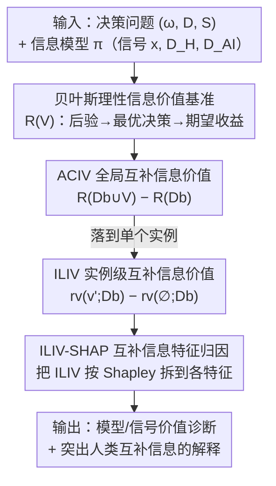

# The Value of Information in Human-AI Decision-Making

**会议**: ICLR 2026  
**OpenReview**: [https://openreview.net/forum?id=rp2RDBRA0Y](https://openreview.net/forum?id=rp2RDBRA0Y)  
**代码**: https://github.com/Guoziyang27/decision_infovalue  
**领域**: 人机协同决策 / 可解释性 / 决策理论  
**关键词**: 信息价值, 人机互补, 贝叶斯决策理论, SHAP 解释, 决策评估

## 一句话总结
本文提出一个基于贝叶斯决策理论的框架，用"信息价值"量化人机协同决策中每个信号（AI 预测、人类判断、实例特征）相对于已有决策所能带来的最大期望收益增量，并据此设计出一种突出"人类互补信息"的新解释方法 ILIV-SHAP，在房价预测实验中证明它比普通 SHAP 更能改善人机团队的决策准确率。

## 研究背景与动机

**领域现状**：把人类专家和 AI 模型配对做决策（医疗、金融、法律）的前提是期待"互补性能"——团队比任一单方都强。当人类掌握 AI 看不到的信息（如病历之外的上下文）时，理论上确实存在互补空间。

**现有痛点**：大量实证研究却发现人机团队反而不如 AI 单干。这里有两层歧义把结论搅浑：一是**度量问题**——通常用事后决策准确率打分，而没有考虑"在决策当下、给定可得信息所能达到的最优表现"；二是**归因问题**——往往说不清人和 AI 到底在用什么信息、谁没用好哪部分信息，导致无法设计针对性干预。

**核心矛盾**：要想改进协同，必须先知道"哪条信息对谁还有未被榨干的价值"。但现有方法既缺一个不依赖人类是否理性的理论基准来衡量"本可达到的最优"，也缺一个能把这种价值拆到具体特征上的可解释工具。

**本文目标**：(1) 给出一个能刻画任意信号在人机工作流中"信息价值"的决策论框架；(2) 区分全局价值与实例级价值；(3) 把实例级价值转化为一种向人类传达"AI 互补信息在哪"的解释技术。

**切入角度**：作者主张，一条信息是否"有价值"，取决于理论上能否把它纳入决策来提升收益——于是用**贝叶斯理性决策者**作为"最优使用信息"的上界。关键洞察是：任何被决策者真正使用的信息，最终都会通过其决策的变化暴露出来，因此可以拿"额外给某信号"前后的理性收益之差，来度量该信号相对于已有决策的**互补价值**。

**核心 idea**：用"贝叶斯理性 DM 在加入新信号前后期望收益的边际增益"定义信息价值，并把这个增益从全局（ACIV）细化到实例（ILIV），再用 Shapley 值把 ILIV 归因到各特征，得到 ILIV-SHAP 解释。

## 方法详解

### 整体框架

框架的输入是一个**决策问题**加一个**信息模型**：决策问题由三元组 $(\Omega, D, S)$ 给出——收益相关状态 $\omega$、决策空间 $D$、收益函数 $S(d,\omega)$；信息模型则把"决策当下可得的一切信息（包括各 agent 的决策本身）"建模成一组信号 $\Sigma_1,\dots,\Sigma_n$ 及其与状态的联合分布 $\pi$。在标准人机工作流里，基本信号就是 $\{x, D_H, D_{AI}\}$——实例特征、人类初判、AI 预测。

框架的输出是这些信号的"信息价值"。核心做法是引入一个**贝叶斯理性决策者**作为"把信息用到极致"的理想基准：它知道先验和信号的条件分布，看到信号实现后更新出后验，再选期望收益最大的决策。由此可定义三层量：先是绝对信息价值 IV（相对零信息基准），再是相对某 agent 已有决策的**全局互补价值 ACIV**，最后是落到单个实例的**实例级互补价值 ILIV**；ILIV 再经 Shapley 归因得到 **ILIV-SHAP** 解释，告诉人类"AI 预测里哪些特征带来了你尚未利用的互补信息"。

### 关键设计

**1. 贝叶斯理性信息价值基准：用"理论最优使用"给信息价值定锚**

痛点在于"互补性能"的实证结论总被度量方式搅浑——拿事后准确率打分，会把"信息本身没价值"和"人没用好信息"两件事混为一谈。本文的解法是不再问"人实际表现如何"，而问"给定这条信息，理论上最好能做到多好"。具体地，理性 DM 在信号 $V$ 下的期望收益为
$$R(V) := \mathbb{E}_{(v,\omega)\sim\pi}[S(d_r(v), \omega)], \quad d_r(v) = \arg\max_{d\in D}\mathbb{E}_{\omega\sim\pi(\omega|v)}[S(d,\omega)]$$
其中 $d_r(\cdot)$ 是基于后验 $\pi(\omega|v)$ 的最优决策规则。再以零信息（只用先验）下的最优固定动作 $R(\varnothing)=\max_d \mathbb{E}_{\omega\sim\pi}[S(d,\omega)]$ 为基线，信息价值定义为 $IV(V) := R(V) - R(\varnothing)$。这样做之所以有效，是因为 $R(V)$ 是"任何策略在同一实验里所能达到的期望收益上界"，从而无论真实人类是否理性、决策过程如何偏离最优，这个基准都成立；它把"信息能给什么"和"agent 用没用好"干净地分开了。

**2. ACIV：度量一条信号相对于已有决策还剩多少未被榨干的价值**

有了绝对价值还不够——我们真正想知道的是"在某 agent 已经做出决策的基础上，再补一条信号 $V$ 还能多赚多少"。本文据此定义**全局互补信息价值（ACIV）**：
$$ACIV(V; D_b) := R(D_b \cup V) - R(D_b)$$
这里 $D_b$ 是某 agent（人、AI 或人机团队）的决策。直觉是：凡是 agent 真正用上的信息，都会反映在其决策 $D_b$ 的变化里；若 $V$ 的 ACIV 很小，要么 $V$ 本身与状态无关，要么 agent 已经把 $V$（或等价信息）用进了决策；若 ACIV 大，说明 agent 理论上还能靠纳入 $V$ 提升收益。把 AI 预测当 $V$、人类决策当 $D_b$，大 ACIV 就意味着"AI 在人之外还添了不少价值"；反过来则衡量人能在 AI 之外贡献多少——双向都能算，正是"互补"的精髓。对高维/连续信号（图像、文本）观测不到完全相同的信号实现，作者用 Algorithm 1 学一个后验估计器 $\hat a$ 来近似计算：分别拟合 $\hat a(v, d^b)$ 与 $\hat a_b(d^b)$，对每个样本取二者最优决策的收益之差再平均。

**3. ILIV：把互补价值从分布层面细化到单个实例**

ACIV 是对整个数据分布求期望，看不出"具体这一例里某信号还有多少改进空间"。**实例级互补信息价值（ILIV）**填补这点：在信号实现为 $V=v$ 的那些实例上，理性 DM 若观察到 $v'$（允许 $v'\neq v$，以支持反事实评估）并结合已有决策 $D_b$ 的期望收益为 $r_v(v'; D_b) = \mathbb{E}_{(d^b,\omega)\sim\pi(d^b,\omega|v)}[S(d_r(v'\cup d^b), \omega)]$，于是
$$ILIV_v(v'; D_b) := r_v(v'; D_b) - r_v(\varnothing; D_b)$$
即"在这类实例上额外知道 $v$、相对只知道 agent 决策"的期望收益增量。它在 $v'=v$（信号不误导）时取最大值 $ILIV_v(v;D_b)\ge ILIV_v(v';D_b)$。引入 $v'$ 的灵活性，使框架能描述"被误导"带来的收益变化（如把真实 21°C 误判成 18°C 会损失多少），这正是下一步设计 ILIV-SHAP 解释的基础。

**4. ILIV-SHAP：把实例级互补价值按 Shapley 归因到特征，做成解释**

传统显著性解释（SHAP）传达的是"每个特征对预测值的平均贡献"，但它回答的是"AI 为什么这么预测"，并不告诉人"AI 这条预测里哪部分是我还没利用的互补信息"。ILIV-SHAP 把被归因的目标从"预测值"换成"预测所携带的互补信息价值 ILIV"。沿用 Shapley 框架，第 $i$ 个特征的重要度为
$$\phi_i^{ILIV}(f, x) = \sum_{x'\subseteq x}\frac{|x'|!(m-|x'|-1)!}{m!}\big[ILIV_{f(x)}(g_f(x'); D_b) - ILIV_{f(x)}(g_f(x'\setminus x_i); D_b)\big]$$
其中 $g_f(x')$ 是把未边缘化特征固定为 $x'$ 时的期望模型输出。它继承了 SHAP 的效率公理（特征重要度之和等于模型输出的信息价值）与对称公理，还有一个额外好处：由于 ILIV 随纳入特征数单调不减，基于采样的近似（Kernel/Partition SHAP 等）在 ILIV-SHAP 上比在普通 SHAP 上更稳定。最终把超过阈值的特征排序并高亮，就得到一份"指给人看哪里有互补信息"的解释。

### 损失函数 / 训练策略
框架本身是分析性的、无需端到端训练；唯一需要"学"的是 Algorithm 1 里的后验估计器 $\hat a$（用线性回归 / GBM / 神经网络拟合，附录 I 做了三者的敏感性分析），且必须交叉验证并检查校准误差，因为理性 DM 会把它当作真实贝叶斯后验来用。

## 实验关键数据

### 主实验：房价预测的人机协同（预注册在线实验）

421 名 Prolific 被试在 Ames 房价数据集上做决策，每人先无 AI 预测一次、再看 AI 后修订一次；2×3 设计交叉两个 AI 模型（AI1 高 ACIV / AI2 低 ACIV）与三种解释（ILIV-SHAP+SHAP / SHAP / 无）。AI1 额外用了被刻意降低可解释性的 Feature X/Y，故对人有互补信息。评估指标为相对人类单独决策的 APE 降幅。

| AI 模型 | 输入特征 | MAPE | R² | ACIV (MAPE) |
|--------|---------|------|----|----|
| AI1 | 全部 6 特征（含 X/Y） | 14.30% | 0.81 | 4.61% |
| AI2 | 仅 4 个可解释特征 | 14.51% | 0.81 | 2.00% |

两个 AI 预测精度几乎相同，但 ACIV 排序符合预期（AI1 > AI2），说明 ACIV 能在"准确率分不出高下"时识别出谁更能互补人类。

### 解释方式对 APE 降幅的影响（人机团队 vs 人类单独）

| 条件 | APE 降幅 [95% CI] | 说明 |
|------|------------------|------|
| AI1 + ILIV-SHAP & SHAP | **6.94%** [6.50, 7.38] | 高互补模型 + 互补信息解释，最佳 |
| AI1 + SHAP | 5.88% [5.47, 6.28] | 普通解释 |
| AI1 + 无解释 | 5.96% [5.50, 6.42] | 基线 |
| AI2 + ILIV-SHAP & SHAP | 5.31% [4.80, 5.83] | 低互补模型上 ILIV-SHAP 无优势 |
| AI1（汇总各解释） | 6.24% [5.99, 6.50] | 高 ACIV 模型整体更好 |
| AI2（汇总各解释） | 5.96% [5.68, 6.24] | 低 ACIV 模型 |

### 关键发现
- **ACIV 可作模型选择信号**：在两个 AI 准确率近乎相同的情况下，ACIV 高的 AI1 带来更大的团队改进，验证了用信息价值（而非准确率）来挑选互补模型。
- **ILIV-SHAP 的增益依赖模型确有互补信息**：只有当 AI 真的携带互补信息（AI1）时，ILIV-SHAP+SHAP 才显著优于纯 SHAP 与无解释；在低互补的 AI2 上 ILIV-SHAP 反而不占优——这与框架的理论预期一致，因为没有互补信息可"指"。
- **真实任务示范**：胸片诊断中，五个图像模型与放射科医生报告**双向互补**（各自都能给对方添价值），其中 ViT 的信息价值略高；深伪检测中，AI 预测提供了约 65% 的总可得信息价值、人类仅约 15%，但人机团队决策只达到约 30%——说明人远未把 AI 的信息用满；逐特征看，"闪烁人脸"对人类决策的 ACIV 更大、"深肤色个体"对 AI 预测的 ACIV 更大，揭示人和 AI 依赖的信息不同。

## 亮点与洞察
- **把"互补性"从模糊直觉变成可计算的量**：ACIV/ILIV 给出"某信号相对已有决策的边际信息价值"，并且双向可算（AI 之于人、人之于 AI），这比笼统说"团队是否互补"精确得多。
- **理性基准的巧妙之处**：用贝叶斯理性 DM 的收益作上界，意味着结论"无论人是否理性都成立"——它不是在建模人，而是在给"信息本可贡献多少"立标尺，从而把"信息价值"与"人是否用好"解耦。
- **从"解释预测"转向"解释互补信息"**：ILIV-SHAP 把归因目标从预测值换成 ILIV，是一个可迁移的设计范式——任何想"指给人看 AI 在哪补充了你"的解释场景，都能套用这套"把决策论价值量做 Shapley 归因"的思路。
- **单调性带来的稳定性副产品**：因 ILIV 随特征数单调不减，采样近似在 ILIV-SHAP 上比 SHAP 更稳，属于"换了归因目标顺带改善了数值性质"的额外红利。

## 局限与展望
- **实验互补性是人为构造的**：房价实验通过把两个特征改名为 Feature X/Y、降低其可解释性来"制造"互补，属概念验证；真实部署中人或 AI 各自掌握的私有信息更复杂，ILIV-SHAP 的实效仍需验证。
- **依赖后验估计器的质量**：ACIV/ILIV 的计算把学到的 $\hat a$ 当真实贝叶斯后验，若估计器校准差或过拟合，信息价值会失真；高维信号（图像、文本）下尤为吃紧。
- **单一/良定义收益函数假设**：主框架假设有明确的收益函数；虽然附录给出对所有 proper scoring rule 的鲁棒性（Blackwell 序）分析，但收益完全不可识别的任务仍是开放问题。
- **改进思路**：把框架用于真实工作流中人/AI 各持私有信息的场景，并联动认知负荷等因素评估 ILIV-SHAP 是否在实战中持续有效。

## 相关工作与启发
- **vs Guo et al. (2024)**：两者都用"贝叶斯最优可达表现"作上界；Guo 等建模理性 DM 在"选人还是选 AI 推荐"间的期望表现，本文则进一步把这个上界拆成相对任意 agent 决策的**互补信息价值**，并细化到实例级、做成解释。
- **vs 传统 SHAP（Lundberg & Lee, 2017）**：SHAP 解释"特征如何影响预测"，本文 ILIV-SHAP 解释"特征如何影响该预测对人的互补信息价值"，两者共享效率/对称公理但回答不同问题，且后者归因目标单调、采样更稳。
- **vs learning-to-defer / 信息不对称类方法（Mozannar 等；Straitouri 等；Alur 等）**：这些工作多在"由设计带来互补"（学会让渡、利用人类额外上下文）；本文不直接改 pipeline，而提供一个**可解释的分析框架**去量化所有信号与 agent 决策的信息价值，从而指导基于信息的干预（模型选择、数据收集、解释设计）。

## 评分
- 新颖性: ⭐⭐⭐⭐⭐ 把决策论信息价值、互补性与可解释性三者打通，并产出 ILIV-SHAP 这一新解释范式，角度新颖
- 实验充分度: ⭐⭐⭐⭐ 预注册受试者实验 + 胸片/深伪两个真实示范 + 估计器敏感性分析，较扎实；但核心实验互补性为人为构造
- 写作质量: ⭐⭐⭐⭐ 定义层层递进、动机清晰，公式较密集需细读
- 价值: ⭐⭐⭐⭐⭐ 为"如何评估与改进人机协同决策"提供了可操作的理论工具与解释方法，对 HCI 与可解释 AI 都有指导意义

<!-- RELATED:START -->

## 相关论文

- [\[ACL 2026\] Imperfectly Cooperative Human-AI Interactions: Comparing the Impacts of Human and AI Attributes in Simulated and User Studies](../../ACL2026/social_computing/imperfectly_cooperative_human-ai_interactions_comparing_the_impacts_of_human_and.md)
- [\[ICLR 2026\] Propaganda AI: An Analysis of Semantic Divergence in Large Language Models](propaganda_ai_an_analysis_of_semantic_divergence_in_large_language_models.md)
- [\[ICLR 2026\] Human or Machine? A Preliminary Turing Test for Speech-to-Speech Interaction](human_or_machine_a_preliminary_turing_test_for_speech-to-speech_interaction.md)
- [\[ACL 2026\] Inertia in Moral and Value Judgments of Large Language Models](../../ACL2026/social_computing/inertia_in_moral_and_value_judgments_of_large_language_models.md)
- [\[ACL 2026\] Content Fuzzing for Escaping Information Cocoons on Social Media](../../ACL2026/social_computing/content_fuzzing_for_escaping_information_cocoons_on_digital_social_media.md)

<!-- RELATED:END -->
