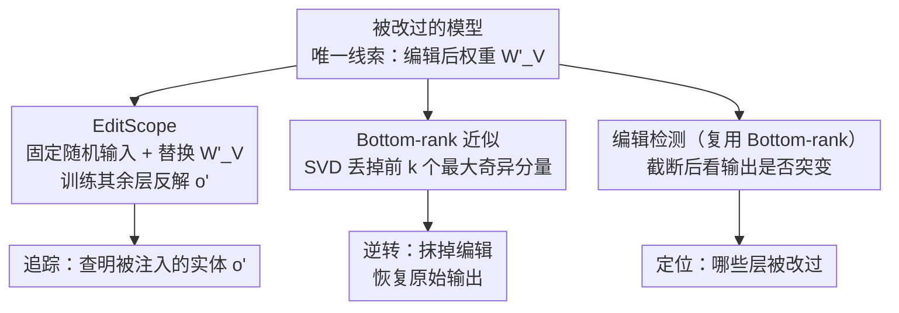

# Tracing and Reversing Edits in LLMs

**会议**: ICLR 2026  
**arXiv**: [2505.20819](https://arxiv.org/abs/2505.20819)  
**代码**: [https://github.com/paulyoussef/trace-and-reverse/](https://github.com/paulyoussef/trace-and-reverse/)  
**领域**: 机器人  
**关键词**: knowledge editing, model security, SVD, edit tracing, edit reversal

## 一句话总结
针对知识编辑（Knowledge Editing）的双重使用风险，提出 EditScope 方法从编辑后的权重中推断被编辑的目标实体（准确率高达 99%），以及基于 SVD bottom-rank 近似的无训练编辑逆转方法（逆转率高达 94%），仅依赖编辑后的权重、不需要编辑 prompt 或原始权重信息。

## 研究背景与动机

**领域现状**：知识编辑（KE）方法如 ROME、MEMIT 可以低成本地更新 LLM 中的事实知识，操作形式为 $(s, r, o \to o')$，如将"德国总理是 Scholz"改为"Merz"。

**现有痛点**：KE 存在双重使用风险——既可用于更新过时信息，也可被恶意利用注入错误信息、偏见或后门。现有防御工作假设有一组"可能被编辑的事实"来逐条检查，这在实际中不可行。

**核心矛盾**：如何在完全不知道编辑了什么（不知道编辑 prompt、原始权重、被编辑的事实）的情况下，仅从编辑后的权重中发现并逆转恶意编辑？

**本文目标** 形式化两个任务：(1) 追踪编辑——从编辑后的权重推断被编辑的目标实体 $o'$；(2) 逆转编辑——恢复模型的原始输出，不需要任何额外信息。

**切入角度**：利用知识编辑方法的结构特性——ROME 等方法产生 rank-1 更新 $W'_V = W_V + W_N$，编辑信息集中在最大奇异值对应的成分中。

**核心 idea**：编辑后的权重矩阵中，编辑信息集中在顶部奇异值分量，利用这一特性可以高精度追踪和无训练逆转恶意知识编辑。

## 方法详解

### 整体框架
防御方只拿到一个已经被改过的模型，既不知道改了哪条事实、也没有原始权重和编辑 prompt，全部线索只有编辑后的权重矩阵 $W'_V$ 本身。本文的出发点是一个结构观察：ROME 这类「定位-编辑」（locate-and-edit）方法只对权重做 rank-1 更新 $W'_V = W_V + W_N$，注入的信息高度集中在最大的那几个奇异值（singular value）分量上。围绕这个观察，论文给防御方搭了三件互补的工具，且全部只用编辑后的权重：①「追踪」——用一个叫 EditScope 的小模型从 $W'_V$ 反解出被注入的目标实体 $o'$；②「逆转」——对 $W'_V$ 做奇异值分解（SVD）后砍掉顶部奇异分量，把编辑信息减出去、让模型恢复原来的输出；③「检测」——同一套截断操作反过来还能判断某层到底有没有被动过。后两件都不需要任何训练。

### 关键设计

**1. EditScope：把编辑矩阵当输入，反解出被注入的实体**

ROME 这类编辑会让目标实体在权重里被严重过度表示（overfitting to edited objects），编辑目标的痕迹其实就刻在 $W'_V$ 里。EditScope 利用这一点直接「解码」：它准备一段固定的随机输入 $x_{fixed} = (t_1, \dots, t_m)$（$m=5$ 个新增 token），把待查的编辑矩阵 $W'_{V_i}$ 替换进模型对应位置，再训练模型其余层的参数，让整个模型在这段固定输入下输出对应的编辑目标 $o'_i$。训练用标准交叉熵：

$$\mathcal{L} = -\sum_{j=1}^{|\mathcal{V}|} \mathbb{1}_{i=j} \cdot \log(Q_j)$$

关键巧思在那段「无关的固定随机输入」：因为输入与具体编辑事实毫无关系，模型要想答对就只能从被替换进来的权重矩阵里读信息，从而把注意力逼到编辑痕迹上，也彻底绕开了「必须知道编辑 prompt」这个原本不可行的前提。

**2. Bottom-rank 近似：用 SVD 截断把编辑信息从权重里减掉**

ROME 等方法对权重做的是 rank-1 更新 $W'_V = W_V + W_N$，意味着编辑信息高度集中在编辑矩阵最大的几个奇异值分量上。逆转就顺势反着做：对编辑矩阵做奇异值分解 $W'_V = U\Sigma V^T$，丢掉前 $k$ 个最大奇异值及其对应分量，只保留剩下的低秩部分：

$$\tilde{W'}_V^{(r,k)} = \sum_{i=k+1}^{r} \Sigma_{ii} u_i v_i^T$$

砍掉顶部分量就等价于把编辑注入的成分从权重里减出去。这个假设是被实测支撑的：在 GPT2-XL 上取 $k=1$ 时，更新矩阵 $W_N$ 与它的 rank-1 近似余弦相似度高达 0.98——编辑确实几乎全压在第一个奇异方向上。整个过程不需要任何训练或原始权重，只对编辑后的矩阵做一次分解即可。

**3. 编辑后检测：复用 bottom-rank 近似定位被改的层**

实际部署时还有个前置问题——得先知道哪些层被动过，才能有的放矢地逆转。这一步直接复用上面的截断思路：对一个权重矩阵去掉前 $k$ 个分量，若输出随之剧烈变化，说明这些顶部分量承载了异常信息，该层很可能被编辑过；正常未编辑的矩阵则不会因为砍掉少数顶部分量而崩。于是同一套 SVD 工具既能检测、又能逆转。

### 训练策略
EditScope 用 600 个编辑矩阵训练（覆盖 20 个关系），100 个做验证，测试集分成 300 个 ID 样本和 330 个 OOD 样本（来自 11 个训练中未见的关系），最多训 100 epoch，配 patience=3 的 early stopping。逆转方法则完全无需训练，直接做 SVD 分解与截断即可。

## 实验关键数据

### 主实验 - EditScope 追踪准确率

| 模型 | ROME ID | ROME OOD | r-ROME ID | r-ROME OOD |
|------|---------|----------|-----------|------------|
| GPT2-XL | 99.40% | 99.70% | 99.73% | 99.70% |
| GPT-J-6B | 97.60% | 94.42% | 96.50% | 95.91% |
| LLAMA3-8B | 96.47% | 91.21% | 94.87% | 88.18% |
| QWEN2.5-7B | 91.20% | 87.45% | 88.53% | 85.45% |

### 消融实验 - 逆转方法（ROME, 最优 k 值）

| 模型 | 最优 k | 逆转准确率 | 编辑准确率↓ | KL 散度 (k=0 → k_opt) |
|------|--------|-----------|------------|----------------------|
| GPT2-XL | 11 | 94.52% | 1.29% | 6.038 → 0.010 |
| GPT-J-6B | 14 | 80.00% | 2.26% | 11.567 → 0.218 |
| LLAMA3-8B | 15 | 80.00% | 6.45% | 10.068 → 0.604 |
| QWEN2.5-7B | 13 | 62.90% | 26.13% | 8.988 → 1.615 |

### 关键发现
- **GPT 系列最容易追踪和逆转**：GPT2-XL 追踪达 99%、逆转达 94%，因为编辑信息极度集中在 $k=1$ 分量
- **模型越大/越新，逆转越难**：QWEN2.5-7B 逆转率仅 62.9%，因为编辑信息分散在更多奇异值分量中
- **OOD 泛化良好**：EditScope 在未见过的关系上仍保持 >85% 准确率
- **逆转不损害模型能力**：在 CoLA、MMLU 等基准上，逆转后的模型性能与编辑前几乎无差异
- **KL 散度大幅下降**：逆转后模型输出分布接近原始分布（GPT2-XL: 6.038 → 0.010）

## 亮点与洞察
- **最小假设的防御设计**：不需要知道编辑 prompt、原始权重、或被编辑内容的任何信息，仅从编辑后的权重就能追踪和逆转——这是真正实用的防御场景。
- **SVD 的精妙利用**：rank-1 编辑自然映射到最大奇异值分量，这个理论洞见简洁优雅。Bottom-rank 近似作为降噪技术可以迁移到其他需要去除权重中特定信息的场景。
- **EditScope 的"无关输入"设计**：用固定随机 token 作为输入，让训练过程只关注权重矩阵中的编辑信息，避免了对编辑 prompt 的依赖。这个 trick 很聪明。

## 局限与展望
- **仅聚焦 rank-1 编辑**：ROME/r-ROME 是 rank-1 更新，MEMIT 等批量编辑方法的更新矩阵不是严格 rank-1，逆转效果可能下降
- **QWEN 逆转率较低（62.9%）**：较新的模型架构可能需要更精细的 SVD 策略
- **单编辑场景为主**：虽然附录讨论了批量和顺序编辑，但主实验仅针对单次编辑
- **需要知道哪一层被编辑**：虽然附录提供了层检测方法，但实际部署中确定编辑位置仍是前置挑战
- **计算开销**：SVD 对大矩阵的计算成本可能在超大模型上成为瓶颈

## 相关工作与启发
- **vs Youssef et al. (2025c)**: 他们通过分析隐藏状态/输出概率检测编辑，需要候选编辑事实集合；本文不需要任何先验知识
- **vs Li et al. (2025)**: 确定编辑类型（错误信息/偏见），本文追踪编辑的具体内容
- **vs AlphaEdit (Fang et al. 2025)**: AlphaEdit 是一种编辑方法，本文在附录中验证对其也有效
- 这篇工作对模型水印和知识产权保护也有启发——如果编辑可被追踪，那么模型中特定知识的来源也可能被追溯

## 评分
- 新颖性: ⭐⭐⭐⭐⭐ 首次形式化编辑追踪和逆转任务，方法简洁有效
- 实验充分度: ⭐⭐⭐⭐ 4 个模型 × 2 个 KE × 2 个数据集，附录有大量泛化实验
- 写作质量: ⭐⭐⭐⭐⭐ 问题定义清晰，方法推导严谨
- 价值: ⭐⭐⭐⭐⭐ 对 LLM 安全防御有重大实用意义

<!-- RELATED:START -->

## 相关论文

- [\[ACL 2026\] SPAGBias: Uncovering and Tracing Structured Spatial Gender Bias in Large Language Models](../../ACL2026/social_computing/spagbias_uncovering_and_tracing_structured_spatial_gender_bias_in_large_language.md)
- [\[NeurIPS 2025\] Don't Let It Fade: Preserving Edits in Diffusion Language Models via Token Timestep Allocation](../../NeurIPS2025/social_computing/dont_let_it_fade_preserving_edits_in_diffusion_language_mode.md)
- [\[ICML 2026\] FLIPS: Instance-Fingerprinting for LLMs via Pseudo-Random Sequences](../../ICML2026/social_computing/flips_instance-fingerprinting_for_llms_via_pseudo-random_sequences.md)
- [\[ACL 2026\] Investigating Counterfactual Unfairness in LLMs towards Identities through Humor](../../ACL2026/social_computing/investigating_counterfactual_unfairness_in_llms_towards_identities_through_humor.md)
- [\[ACL 2026\] To Lie or Not to Lie? Investigating The Biased Spread of Global Lies by LLMs](../../ACL2026/social_computing/to_lie_or_not_to_lie_investigating_the_biased_spread_of_global_lies_by_llms.md)

<!-- RELATED:END -->
