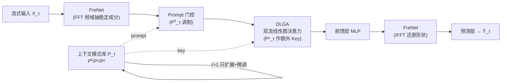

# A General Spatio-Temporal Backbone with Scalable Contextual Pattern Bank for Urban Continual Forecasting

**会议**: ICLR 2026  
**OpenReview**: [https://openreview.net/forum?id=LHSea6DI8U](https://openreview.net/forum?id=LHSea6DI8U)  
**代码**: [https://github.com/Aoyu-Liu/STBP](https://github.com/Aoyu-Liu/STBP)  
**领域**: 时空预测 / 持续学习 (Continual Spatio-Temporal Forecasting)  
**关键词**: 持续学习, 时空图神经网络, 频域分析, 线性注意力, 灾难性遗忘, 城市交通预测  

## 一句话总结
STBP 用一个"频域 + 线性图注意力"的通用时空骨干提取稳定可迁移的表征，再外挂一个可增量扩展的"上下文模式库"作为 prompt，骨干冻结、只长模式库，从而在节点持续增长、分布持续漂移的城市流数据上同时做到抗遗忘、强建模和可扩展。

## 研究背景与动机
**领域现状**：时空图神经网络（STGNN）是交通流、空气质量等城市感知预测的主力，但绝大多数仍停留在"固定拓扑 + 离线训练"范式——图结构在训练前就定死、训练完直接部署。

**现有痛点**：真实城市是持续演化的，传感器节点不断扩张、连通关系动态重构、数据分布长期漂移。一旦节点集增长，靠改结构 + 不停 fine-tune 来硬接，性能会显著退化。为此 Continual Spatio-Temporal Forecasting（CSTF，持续时空预测）应运而生，目标是在新数据上增量学习、无需回放历史数据重训。

**核心矛盾**：现有 CSTF 方法有两个没解决好的问题——其一，所采用的通用骨干太简单（往往就是图卷积 + 时序卷积的堆叠），难以建模动态变化的时空相关性和长期分布漂移；其二，基于动态结构扩展的持续优化策略与骨干耦合很弱（直接扩参数或 prompt 拼接），很难在**稳定性、适应性、可解释性**之间取得平衡。

**本文目标**：作者把理想的 CSTF 框架归纳为要同时解决四个挑战——❶处理分布漂移；❷建模动态时空相关性；❸缓解灾难性遗忘；❹设计能与骨干高效协同的增量策略。

**核心 idea**：**分工协作（骨干稳定 + 模式库适应）**——设计一个与节点数无关、不依赖预定义邻接矩阵的通用骨干，用频域模块抽取稳定成分抗漂移、用轻量线性图注意力建模动态空间相关；再配一个可增量扩展的上下文模式库（contextual pattern bank），以可训练参数形式通过参数扩展逐步吸收新场景，并以 gating/attention 作为 prompt 引导冻结的骨干适配新分布。骨干管"通用稳定模式"，模式库管"节点级异质上下文"。

## 方法详解

### 整体框架
STBP 由两大件组成：**通用时空骨干**（FreNet → DLGA → 前馈层 → FreNet → 预测层）负责在演化网络中捕捉时空相关性；**上下文模式库** $P_\tau \in \mathbb{R}^{N_\tau \times d}$ 是一组可训练参数，随数据演化被动态扩展、微调。工作流上：初始增量阶段（$\tau=1$）骨干与模式库联合训练；后续阶段（$\tau>1$）**冻结骨干**保留历史通用知识，**只对模式库做扩展 + 微调**，扩展出的参数作为 prompt 去引导冻结骨干适配新分布。

### 关键设计

**1. 上下文模式库：用可扩展参数把"历史知识"存成 prompt，抗遗忘又免回放。** 模式库 $P_\tau \in \mathbb{R}^{N_\tau \times d}$ 以可训练参数巩固历史时空模式并泛化到新模式。作者发现它能自然区分节点的**相关性**（节点间相似的趋势/周期波动）与**异质性**（功能、地理、政策、事件带来的差异）——t-SNE 可视化显示模式库自发聚成有意义的簇，簇间体现异质性、簇内体现相关性，而这一切无需显式聚类约束，纯由预测任务驱动。增量时模式库只做参数扩展：$P'_\tau = P_{\tau-1} \,\|\, \Delta P_\tau$，其中 $\Delta P_\tau \in \mathbb{R}^{(N_\tau - N_{\tau-1})\times d}$ 是新节点对应的新参数，只微调扩展后的 $P'_\tau$。因为存的是高层抽象而非原始历史数据，所以天然支持无回放的知识保留，兼顾隐私与存储效率。

**2. Prompt-Based Guidance：模式库分三组参数，分别做门控调制和注意力 Key。** 模式库拆成 $P^{(i)}_\tau, i\in\{0,1,2\}$ 三组。其中 $P^{(0)}$ 和 $P^{(1)}$ 通过门控函数与骨干隐表征 $H_\tau$ 交互：

$$H'_\tau = P^{(1)}_\tau \cdot h_\theta\big(H_\tau \cdot (1 + P^{(0)}_\tau)\big)$$

$h_\theta$ 是骨干内任意子模块。这种"先用 $(1+P^{(0)})$ 调制输入、再用 $P^{(1)}$ 缩放输出"的门控让模型自适应地建模节点异质性；而 $P^{(2)}$ 则作为注意力模块里的 key embedding（见设计 3），在任务约束下引导骨干泛化出相关性感知信息。由此模式库以 prompt 形式深度耦合进骨干，而非简单外挂。

**3. FreNet 频域网络：抽稳定低频成分抗分布漂移。** 演化环境下时空数据常有分布漂移，FreNet 专门强化周期、趋势这类对分布变化更鲁棒的稳定成分。骨干首尾各放一个 FreNet：第一个把输入 $X_\tau \in \mathbb{R}^{N_\tau \times T_h}$ 经线性层升维到 $H_\tau \in \mathbb{R}^{N_\tau \times d}$，再 FFT 到频域，用可学习频域 embedding $F_\tau \in \mathbb{C}^{(d/2+1)}$ 自适应放大稳定特征：

$$H^f_\tau = \mathrm{IFFT}\big(\mathrm{FFT}(H_\tau) \odot F_\tau\big)$$

随后 $H^f_\tau$ 再与 $P^{(0)}_\tau$ 经门控 prompt 得到 $H^s_\tau$ 送入 DLGA；第二个 FreNet 做逆操作还原形状。相比 RNN/TCN，FreNet 计算更省，且更擅长抽低频稳定成分、压制高频噪声，跨周期跨场景更鲁棒。

**4. DLGA 双流线性图注意力：把空间注意力从 $O(N^2)$ 降到 $O(N)$ 并融入模式库知识。** 拿到稳定成分后还要建模复杂、时变的节点空间相关。常规图注意力是 $O(N^2)$，难扩展到不断增长的图。DLGA 用基于随机特征映射的线性注意力，并引入**双流结构**——把模式库 $P^{(2)}_\tau$ 作为额外的 key，让模型评估"演化中的输入模式"与"已存知识"之间的关系：

$$\text{Attention} = \mathrm{Softmax}\big(QK^\top + Q(P^{(2)}_\tau)^\top\big)V \approx \phi(Q)\big(\phi(K)^\top V + \phi(P^{(2)}_\tau)^\top V\big)$$

其中 $\phi(\cdot)$ 是随机特征映射。通过重排注意力的计算顺序，DLGA 不显式构造邻接矩阵、隐式建模动态相关，把复杂度从二次降为线性，同时无缝接入模式库的 prompt 知识，对节点数无关、可随图扩张。

## 实验关键数据

### 主实验
三个真实流式数据集：PEMS-Stream、CA-Stream（交通流，5 分钟采样）、AIR-Stream（空气质量，小时采样），6:2:2 划分，用过去 12 步预测未来 12 步。指标 MAE / RMSE / MAPE（多增量周期平均）。

| Dataset | Metric | TrafficStream | PECPM | STRAP | EAC | **STBP** |
|---|---|---|---|---|---|---|
| PEMS-Stream | MAE | 16.95 | 16.86 | 16.88 | 15.67 | **12.31** |
| PEMS-Stream | RMSE | 27.52 | 27.37 | 27.35 | 25.30 | **20.52** |
| PEMS-Stream | MAPE(%) | 21.66 | 21.73 | 22.17 | 20.42 | **15.65** |
| CA-Stream | MAE | 21.09 | 21.04 | 26.25 | 20.20 | **15.77** |
| CA-Stream | RMSE | 33.01 | 32.77 | 39.05 | 31.18 | **25.70** |
| AIR-Stream | MAE | 24.58 | 24.60 | 25.16 | 24.21 | **23.64** |

相比最强基线，STBP 平均 MAE 在 PEMS-Stream / CA-Stream / AIR-Stream 上分别降低 **21.44% / 21.93% / 2.35%**。普通 STGNN（GWNet、STID）从零重训表现最差；iTransformer 靠在线训练利用历史信息略好但仍受遗忘困扰；显式抗遗忘的 CSTF 方法（PECPM、STRAP、EAC）最优，其中"冻结骨干 + 轻量 prompt"路线（EAC、STRAP、STBP）普遍优于全参数微调。

### 少样本实验
后续增量周期训练集压到 10%（首周期不变）：

| Model | PEMS-Stream 10% MAE | CA-Stream 10% MAE |
|---|---|---|
| TrafficStream | 17.23 | 21.28 |
| EAC | 16.13 | 20.94 |
| **STBP** | **13.58** | **17.11** |

STBP 在低资源下依旧全面领先，说明它能从有限数据中抽出有意义的稳定模式。

### 消融实验
五个变体：❶Retrain（去模式库、每周期重训骨干）；❷Online（去模式库、全模型在线微调）；❸w/o Backbone（保模式库、把 FreNet+DLGA 换成 CNN+GCN）；❹w/o DLGA（去掉 DLGA）；❺EAC（同类对比）。

### 关键发现
- 去掉模式库（Retrain / Online）性能明显下降，证实**参数扩展 + 模式区分 + prompt 引导**是缓解灾难性遗忘的核心。
- 即便没有模式库，作者的骨干本身也比换成 CNN+GCN 的 w/o Backbone 更强，说明 FreNet + DLGA 骨干贡献独立且显著。
- 通道数 64→256 的参数敏感性显示性能稳定，模型对宽度不敏感。

## 亮点与洞察
- **"冻骨干、长模式库"的解耦设计很优雅**：把"通用稳定知识"与"节点级异质上下文"明确分工，前者冻结防遗忘、后者增量扩展抓新分布，恰好对上 CSTF 的稳定-适应权衡难题。
- **模式库的"相关性 vs 异质性"自发涌现**：无显式聚类约束，纯由预测任务驱动就聚出有意义簇，是一个干净的可解释性证据。
- **频域 + 线性注意力的工程取舍到位**：FreNet 抓抗漂移的低频稳定成分，DLGA 把空间注意力降到线性、对节点数无关，正好匹配"图持续扩张"的部署需求。
- **无需回放历史数据**：模式库存的是高层抽象而非原始数据，兼顾隐私与存储，契合真实流式部署。

## 局限与展望
- AIR-Stream 上的增益（2.35% MAE）远小于两个交通集（>21%），说明优势在节点大规模扩张的交通场景更突出，气象等增量较缓场景收益有限。
- 模式库随节点单调扩展，长期流式下参数量会持续增长，论文未充分讨论极长序列下的压缩/淘汰机制（对比 EAC 有 prompt pool 的扩展-压缩）。
- 线性注意力是对 softmax 的近似，在相关性极复杂的图上可能损失精度，文中未给近似误差的定量分析。
- 仅在交通/气象两类城市数据验证，跨领域（如电力、人流）泛化性仍待考察。

## 相关工作与启发
- **时空预测**：从 STGCN/DCRNN 的固定邻接，到 GWNet/DGCRN/MegaCRN 的自适应邻接，再到 STID/STAEformer/HimNet 用可训练 spatial embedding / 参数池区分空间模式——STBP 的模式库正是这条"可训练节点参数"脉络的延伸。
- **持续时空预测（CSTF）**：TrafficStream（回放 + 参数平滑）、STKEC（影响力知识扩展）、PECPM（模式匹配维护模式库）、STRAP（检索增强 + 即插即用 prompt）、EAC（动态 prompt pool 扩展-压缩）。STBP 的差异化在于把强骨干（FreNet+DLGA）与 prompt 模式库深度耦合，而非弱耦合外挂。
- **启发**："冻结大模型 + 增量 prompt"的范式在 CV/NLP 已成熟，本文把它干净地搬到时空图持续学习，并用频域抗漂移、线性注意力保扩展性补齐了时空特有的两个短板——这套"骨干稳定 + 外挂适应"的拆分值得迁移到其他流式结构化预测任务。

## 评分
- **新颖性**: ⭐⭐⭐⭐ — 频域骨干 + 线性图注意力 + 三组参数 prompt 模式库的组合是新颖的工程整合，虽然单个组件（线性注意力、频域分析、prompt 持续学习）均有前作，但针对 CSTF 四大挑战的系统性拼装与"骨干-模式库分工"框架定位清晰。
- **实验充分度**: ⭐⭐⭐⭐ — 三数据集 + 8 个强基线 + 少样本 + 5 个消融 + 参数敏感性 + 案例研究，覆盖全面；扣分在仅交通/气象两域、缺线性近似误差定量分析。
- **写作质量**: ⭐⭐⭐⭐ — 四大挑战的问题归纳清晰，骨干与模式库分工叙述明确，图示完整；公式与动机对应良好。
- **价值**: ⭐⭐⭐⭐ — 面向真实城市流式部署（节点扩张、分布漂移、隐私存储约束）有很强落地价值，开源代码，框架可迁移到其他流式结构化预测。

<!-- RELATED:START -->

## 相关论文

- [\[NeurIPS 2025\] StRap: Spatio-Temporal Pattern Retrieval for Out-of-Distribution Generalization](../../NeurIPS2025/time_series/strap_spatio-temporal_pattern_retrieval_for_out-of-distribution_generalization.md)
- [\[ICLR 2026\] ST-HHOL: Spatio-Temporal Hierarchical Hypergraph Online Learning for Crime Prediction](st-hhol_spatio-temporal_hierarchical_hypergraph_online_learning_for_crime_predic.md)
- [\[ICML 2026\] Nested Spatio-Temporal Time Series Forecasting](../../ICML2026/time_series/nested_spatio-temporal_time_series_forecasting.md)
- [\[ICLR 2026\] Enabling Arbitrary Inference in Spatio-Temporal Dynamic Systems: A Physics-Inspired Perspective](enabling_arbitrary_inference_in_spatio-temporal_dynamic_systems_a_physics-inspir.md)
- [\[ICLR 2026\] TRIDENT: Cross-Domain Trajectory Spatio-Temporal Representation via Distance-Preserving Triplet Learning](trident_cross-domain_trajectory_spatio-temporal_representation_via_distance-pres.md)

<!-- RELATED:END -->
