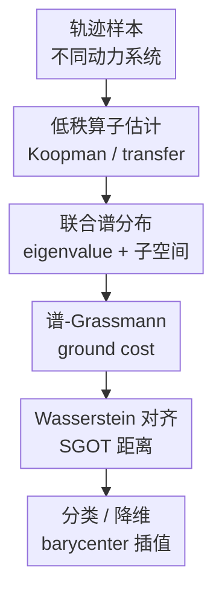

# A Spectral-Grassmann Wasserstein metric for operator representations of dynamical systems

**会议**: ICLR2026  
**OpenReview**: [https://openreview.net/forum?id=B02EqvyiF3](https://openreview.net/forum?id=B02EqvyiF3)  
**代码**: 暂未发现公开代码  
**领域**: 时间序列与动力系统  
**关键词**: Koopman算子, 动力系统度量, 最优传输, Grassmann流形, 谱分解

## 一句话总结
这篇论文把动力系统的 Koopman / transfer operator 表示成“特征值 + 谱投影子空间”的离散分布，并在谱空间与 Grassmann 几何上定义 Spectral-Grassmann Optimal Transport (SGOT) 距离，使不同采样频率下的动力系统可比较、可分类、也可做 Fréchet barycenter 插值。

## 研究背景与动机
**领域现状**：在很多科学和工程场景里，研究对象不是一张静态样本，而是一段随时间演化的轨迹：流体速度场、分子动力学、机器人状态、医学多变量时间序列都属于这一类。若直接比较原始轨迹，结果会强烈依赖初始条件、采样频率和观测噪声；因此近年来常用 Koopman operator 或 transfer operator 把非线性动力系统提升到观测函数空间中，用一个线性算子描述“当前 observable 如何演化到未来 observable”。

**现有痛点**：算子表示虽然线性化了动力学，但“两个算子之间该怎么量距离”并不简单。Hilbert-Schmidt 范数、operator norm 这类直接范数能算得很快，却容易受噪声、基选择和尺度影响，且难以解释距离究竟来自频率变化、衰减率变化还是模态子空间变化。Martin pseudo-metric 等传统 LDS 距离更适合线性状态空间模型，迁移到非线性 Koopman 表示时仍有初始条件敏感或定义不稳的问题。

**核心矛盾**：动力系统的语义主要藏在谱分解里：特征值对应振荡频率和衰减 / 发散时间尺度，特征函数和谱投影描述对应的动力学模态。但只比较特征值会忽略“同频率下不同模态形状”，只比较子空间又会忽略“同模态形状下的物理时间尺度”。已有 OT 谱距离虽然更可解释，却通常只看 eigenvalues，或只适用于 self-adjoint / normal operators，最后得到的往往是 pseudo-metric 而非真正的 metric。

**本文目标**：作者希望构造一个面向 operator representations 的距离，它需要同时满足四件事：第一，能把不同动力系统放到同一个可比较的几何空间；第二，距离本身是数学上的 metric，而不是只在若干等价类上有效的 pseudo-metric；第三，对轨迹采样频率变化不敏感，因为物理系统不应因相机帧率或传感器频率变化而变成另一个系统；第四，计算复杂度足够低，可以嵌入 t-SNE、k-NN 分类和 barycenter 这类机器学习流程。

**切入角度**：论文的关键观察是，非缺陷有限秩 operator 的谱分解本来就是一个“无序集合”：每个谱原子由一个 eigenvalue 和它对应的 spectral projector / eigensubspace 组成，且不同原子的排列没有意义。最优传输天然适合比较这种无序离散分布，只要 ground cost 同时覆盖谱值差异和子空间差异，就能把 operator comparison 变成分布之间的 Wasserstein 距离。

**核心 idea**：用“谱值 + Grassmann 子空间”的 joint spectral distribution 取代单纯矩阵范数，再用 Wasserstein optimal transport 对齐两个系统的谱原子，从而得到一个可解释、采样频率不变、可计算且有有限样本收敛保证的动力系统距离。

## 方法详解
### 整体框架
SGOT 的输入不是原始轨迹之间的点对点距离，而是每条轨迹或每个系统估计出的 Koopman / transfer operator。整体流程可以理解为四步：先从轨迹数据估计一个低秩 operator；再做谱分解，把 operator 变成一组谱原子；然后用 eigenvalue 差异和 eigensubspace 差异构造原子之间的 ground cost；最后解离散 OT 问题，得到两个 operator distributions 之间的 Wasserstein 距离。这个距离还可以反过来作为 Fréchet mean 目标，用于求多个动力系统的 barycenter。

形式上，论文考虑 $N$ 个时间齐次 Markov dynamical systems，每个系统有一批相邻状态样本 $D_k=\{(x_i^k,y_i^k)\}_{i=1}^{n_k}$，相邻状态之间间隔为 $\Delta t_k$。对第 $k$ 个系统，transfer operator $A_t$ 作用在 observable $f$ 上：$[A_t f](x)=\mathbb{E}[f(X_t)\mid X_0=x]$。如果用 generator $L$ 描述连续时间动力学，那么 $A_t=e^{Lt}$，特征值 $\lambda_j$ 的实部对应衰减 / 发散时间尺度，虚部对应振荡频率。

为了比较不同系统，作者假设每个系统只取靠近原点、有限个可学习的 leading spectral components，并把这些谱分量限制到一个共同 RKHS $H$ 里。这个假设很重要：不同系统的真实 operator 原本可能作用在不同 $L^2_{\pi_k}(X)$ 空间上，直接相减没有意义；共同 RKHS 提供了一个共享坐标系，使谱投影和子空间距离可以被定义。

### 关键设计
**1. 联合谱分布：把 operator 变成可传输的谱原子集合**

SGOT 的第一步不是把一个矩阵摊平成向量，而是保留 operator 的谱结构。对一个非缺陷、秩不超过 $r$ 的 operator $T$，设它有若干 distinct eigenvalues $\lambda_j$，每个 eigenvalue 的几何重数为 $m_j$，对应的 left / right eigenfunctions 张成一个 Hilbert-Schmidt operator 空间中的子空间 $V_j$。论文把 $T$ 映射成离散概率分布

$$
\mu(T)=\sum_{j=1}^{\ell}\frac{m_j}{m_{\mathrm{tot}}}\delta_{(\lambda_j,V_j)},\quad m_{\mathrm{tot}}=\sum_{j=1}^{\ell}m_j.
$$

这个表示解决了两个常见麻烦。其一，谱分解的原子顺序本来就是任意的，OT coupling 会自动寻找最优匹配，不需要人为排序 eigenvalues。其二，重数 $m_j$ 被放进质量 $m_j/m_{\mathrm{tot}}$，所以一个高维模态不再被当成一个和单重模态同等重量的点，而会按其谱子空间维度贡献质量。

**2. 谱-Grassmann ground cost：同时比较物理时间尺度和模态子空间**

如果只把原子写成 eigenvalue 点，两个系统的同频率但不同空间结构会被误判为接近；如果只比较 eigenfunction subspaces，又会错过频率和衰减率的变化。SGOT 的 ground cost 把二者合在一起：

$$
 d_\eta\big((\lambda,V),(\lambda',V')\big)=\eta |\lambda-\lambda'|+(1-\eta)d_G(V,V'),\quad \eta\in(0,1).
$$

这里 $d_G$ 是 Grassmann manifold 上的子空间距离，论文主实现使用投影差的 Hilbert-Schmidt 范数，即 $d_G(U,V)=\|P_U-P_V\|_{HS}$。这使得 cost 既能看到 eigenvalue 的谱位置，又能看到由 left / right eigenfunctions 诱导出的 spectral projector 子空间是否一致。参数 $\eta$ 控制谱值与子空间的权重；附录里的敏感性实验显示，分类性能随 $\eta$ 平滑变化，通常更偏向子空间项时效果更好，作者还给出一个基于 Nyquist frequency 的启发式初值。

**3. 采样频率不变：用 generator eigenvalues 而不是裸 transfer eigenvalues 比较系统**

动力系统常被不同设备、不同实验协议以不同频率采样。如果直接比较 $A_{\Delta t}$ 的特征值，采样间隔一变，transfer eigenvalue 会按 $e^{\lambda \Delta t}$ 改变，即使底层连续时间系统完全相同，距离也会被人为放大。SGOT 因此把 eigenvalues 重新归一到 generator 的物理单位里，比较的是频率与时间尺度，而不是某个采样间隔下的离散步长效果。

这个设计对应论文实验中的 sampling frequency shift：参考系统以 200Hz 采样，比较对象在 100Hz 到 300Hz 之间变化。Hilbert-Schmidt、operator norm、Martin 和只看谱值的 SOT 都会明显变化，只有 GOT 与 SGOT 保持低且近似常数；而 SGOT 还同时保留了 eigenvalue 变化的可解释性，因此不会像纯子空间距离那样丢掉时间尺度信息。

**4. 有限样本与 barycenter：让距离进入机器学习流程，而不只停留在定义**

论文没有只给一个漂亮定义，还把它接到可估计、可优化的算法里。operator 估计采用 reduced-rank regression (RRR)：用 RKHS 里的 covariance 和 cross-covariance 估计低秩 Koopman / transfer operator，再从经验 operator 中求出 eigenvalues 与 left / right eigenfunctions。给定两个估计 operator $\hat T_1,\hat T_2$，SGOT 的 cost matrix 可由 cross-kernel matrices 和 eigenfunction 系数计算；当 $p=1$ 时，单个 cost 元素形式为

$$
C_{ij}=\eta|\lambda_i-\lambda'_j|+(1-\eta)\left(m_i+m_j-2\operatorname{Tr}\big((\beta_i^*M_y\beta_j)(\alpha_i^*M_x\alpha_j)\big)\right)^{1/2}.
$$

在 rank 为 $r$、样本数为 $n$ 的近似下，SGOT 的主要复杂度为 $O(n^2r^2+r^3\log r)$，其中 OT solver 的部分在小 rank 时不是瓶颈。理论上，作者在弱于以往 well-specified RKHS 假设的条件下，证明 RRR 估计出的距离收敛到真实 SGOT 距离：

$$
|d_S(\hat T_1,\hat T_2)-d_S(T_1,T_2)|\lesssim n^{-\frac{\alpha-1}{2(\alpha+\beta)}}\ln(2\delta^{-1}).
$$

这条界限的意义不是给实践中直接调参，而是说明只要 leading spectral part 能被共同 RKHS 覆盖，SGOT 的有限样本误差可以由 operator 学习误差、谱扰动界和 Wasserstein 稳定性串起来控制。

### 一个完整示例
可以用论文的二维线性振子实验理解 SGOT 在做什么。参考系统由两个 harmonic oscillators 组成，频率分别为 0.5Hz 和 1.0Hz，轨迹以 200Hz 采样。现在构造四类“相似但被扰动”的系统：把 1.0Hz 振子的频率从 0.6Hz 逐步调到 2.5Hz；把它的 decay rate 从发散到收敛逐步改变；把正弦波模态逐步替换成更高阶 Fourier 方波模态；或者只改变采样频率。

对每个系统，RRR 先估计一个低秩 Koopman operator，谱分解后得到若干原子。若只看矩阵范数，频率变化会造成饱和甚至振荡，距离曲线出现很多局部极小；若只看 eigenvalues，子空间变成方波时的结构变化不能被充分刻画；若只看 eigensubspaces，又无法解释衰减率和频率的物理差别。SGOT 则把“1Hz 模态变成 1.5Hz 模态”看作谱值移动，把“正弦模态变成方波模态”看作 Grassmann 子空间移动，再由 OT 决定哪个源模态该匹配哪个目标模态，所以在频率、衰减率和子空间扰动下都呈现更接近单调、连续的距离变化。

### 损失函数 / 训练策略
SGOT 本身不是一个神经网络训练损失，而是一个基于 operator estimation 的距离。论文中的训练和优化主要出现在两处：第一，RRR 用 Tikhonov regularization 和 rank constraint 估计低秩 transfer operator；第二，Fréchet barycenter 通过 alternating optimization 求解。

对 barycenter，目标是给定多个系统 $T_k$ 和权重 $\gamma_k$，求

$$
\arg\min_{T\in S_r(H)}\sum_{k=1}^{N}\gamma_k d_S(T,T_k)^2.
$$

由于无限维 RKHS 中直接优化 operator 不可行，作者把候选 barycenter 参数化为

$$
T_\theta h=\sum_{i=1}^{r}\lambda_i\langle \kappa_x\alpha_i,h\rangle_H\kappa_x\beta_i,
$$

并约束 left / right eigenfunctions 满足类似双正交与归一化条件：$\alpha^*K\beta=I$、$\beta_j^*K\beta_j=1$。优化流程是 inexact coordinate descent：先固定当前 barycenter 计算所有 OT plans，再依次更新 eigenvalues、控制点、right eigenfunctions 和 left eigenfunctions；其中 right eigenfunctions 用 RKHS 单位球投影，left eigenfunctions 用闭式投影恢复 $\alpha^*K\beta=I$。

## 实验关键数据

### 主实验
论文的实验分三层：先看合成系统下距离曲线是否符合直觉，再看 UEA 多变量时间序列分类与 t-SNE embedding，最后看 barycenter 是否能生成有物理意义的动力系统插值。下面保留最能说明 SGOT 价值的主分类结果。

| 设置 | 指标 | Hilbert-Schmidt | Operator | Martin | SOT | GOT | SGOT |
|------|------|-----------------|----------|--------|-----|-----|------|
| 线性核，14个UEA数据集 | 平均rank(越低越好) | 3.29 ± 1.02 | 3.92 ± 1.10 | 5.30 ± 1.31 | 4.49 ± 1.15 | 2.66 ± 1.18 | **1.34 ± 0.79** |
| RBF核，5个小数据集 | 平均rank(越低越好) | 3.74 ± 1.27 | NA | 4.02 ± 0.98 | 3.28 ± 1.15 | 2.48 ± 1.19 | **1.48 ± 0.70** |
| 深度特征核，14个UEA数据集 | 平均rank(越低越好) | 3.33 ± 1.56 | 4.14 ± 1.27 | 5.06 ± 1.48 | 3.84 ± 1.34 | 2.94 ± 1.33 | **1.71 ± 0.77** |

RBF 核下的具体 accuracy 也很直观：SGOT 在 BasicMotions、ERing、Epilepsy、NATOPS 上都是最优，在 FingerMovements 上与 Hilbert-Schmidt / SOT 同为 0.53 左右，说明它不是只在某一个 kernel 或某一个数据集上偶然有效。

| 数据集 | Hilbert-Schmidt | Martin | SOT | GOT | SGOT |
|--------|-----------------|--------|-----|-----|------|
| BasicMotions | 0.26 ± 0.17 | 0.77 ± 0.06 | 0.87 ± 0.05 | 0.69 ± 0.14 | **0.95 ± 0.02** |
| ERing | 0.74 ± 0.07 | 0.22 ± 0.05 | 0.38 ± 0.05 | 0.96 ± 0.01 | **0.98 ± 0.02** |
| Epilepsy | 0.31 ± 0.02 | 0.80 ± 0.01 | 0.77 ± 0.02 | 0.93 ± 0.02 | **0.95 ± 0.02** |
| FingerMovements | 0.53 ± 0.06 | 0.50 ± 0.03 | 0.53 ± 0.05 | 0.50 ± 0.06 | **0.53 ± 0.01** |
| NATOPS | 0.59 ± 0.06 | 0.25 ± 0.02 | 0.35 ± 0.02 | 0.78 ± 0.03 | **0.80 ± 0.05** |

### 消融实验
论文没有传统意义上“去掉模块”的神经网络消融，但它系统比较了 SGOT 的两个组成项及参数 $\eta$。SOT 只比较 eigenvalues，GOT 只比较 eigensubspaces，SGOT 同时使用二者；这个对照本身就是核心消融。

| 配置 | 关键指标 | 说明 |
|------|----------|------|
| SOT：只看谱值 | 线性核平均rank 4.49 ± 1.15 | 能解释频率 / 衰减率，但忽略模态子空间，分类效果明显落后 |
| GOT：只看Grassmann子空间 | 线性核平均rank 2.66 ± 1.18 | 比单纯谱值更强，对采样频率也稳定，但丢掉部分物理时间尺度 |
| SGOT：谱值 + 子空间 | 线性核平均rank 1.34 ± 0.79 | 两类信息互补，在 14 个线性核数据集上整体最优 |
| SGOT $\eta$ 敏感性 | accuracy 随 $\eta$ 平滑变化 | 最优区域通常更强调子空间项，启发式 $\tilde\eta$ 接近高性能区间 |

| 插值设置 | Hilbert-Schmidt barycenter | 受约束 Hilbert-Schmidt barycenter | SGOT barycenter |
|----------|---------------------------|----------------------------------|-----------------|
| 两个一维振子系统 | 中间系统过度阻尼 | 缓解阻尼但频率 / 衰减率陷入局部最小 | 频率和衰减率自然线性插值 |
| 平均每个梯度步计算时间 | 未单独报告 | 13.11ms | **2.29ms** |
| 流体绕障碍物系统 | 未作为主对照 | 未作为主对照 | 圆柱到三角障碍物之间的 eigenfunctions 出现合理非对称过渡 |

### 关键发现
- SGOT 在合成扰动实验中更符合“物理上连续变化，距离也应连续变化”的直觉：频率 shift、decay rate shift、operator rank / subspace shift 下几乎单调增加，而多个基线会饱和、振荡或产生局部极小。
- 采样频率变化实验验证了论文最关键的 invariance：同一个系统从 100Hz 到 300Hz 重采样时，SGOT 保持低且近似稳定，不会把采样设备差异误当作动力系统差异。
- 分类实验显示 joint cost 的收益很稳定：线性核、RBF 核和深度特征核三种 operator estimator 下，SGOT 的平均 rank 都是第一，说明它并不绑定某一种 Koopman 学习方法。
- barycenter 实验展示了“metric 能反过来定义有意义的平均系统”：Hilbert-Schmidt 线性平均会把振荡系统平均成过阻尼系统，而 SGOT barycenter 能沿着频率和衰减率插值，更像在动力系统空间里移动。

## 亮点与洞察
- **把 operator comparison 变成 distribution comparison**：这一步很漂亮，因为谱分解天然无序，最优传输正好处理无序点集匹配。它避免了手工排序 eigenvalues 的脆弱性，也让多重特征值通过质量自然进入距离。
- **谱值与谱投影一起看，而不是二选一**：很多 Koopman 距离会偏向“频率像不像”或“模态空间像不像”中的一边。SGOT 的价值在于把二者放进同一个 ground metric，使一个距离既能解释物理时间尺度，也能解释空间模态结构。
- **采样频率不变性抓住了动力系统数据的真实痛点**：实际时间序列常来自不同设备或不同采样协议。如果距离对 sampling frequency 极敏感，下游分类和聚类就会学到数据采集流程而不是系统动力学；SGOT 用 generator eigenvalues 校正这一点，是很有工程意义的设计。
- **barycenter 让 metric 不只是评估工具**：很多距离论文停在“我能算两两距离”，但 SGOT 进一步给出 Fréchet barycenter 的参数化优化。这样它能支持动力系统平均、插值、字典学习和未来的条件预测模型。
- **理论假设比以往谱学习界限更现实**：作者没有要求整个 operator 都 well-specified 在 RKHS 里，而只要求 leading spectral part 可以被共同 RKHS 覆盖。这更接近实际：机器学习任务通常也只关心低频、主导、可观测的动力学部分。

## 局限与展望
- SGOT 仍依赖 Koopman / transfer operator 估计质量。如果轨迹很短、噪声很大、observable space 或 kernel 选得不合适，谱分解本身会不稳定，距离再精致也只能比较有偏的 operator 表示。
- 论文主要处理非缺陷有限秩 operator；虽然作者说明可通过 Dunford-Jordan decomposition 扩展到一般线性算子，但主实验和主定理并没有充分展示 defective operator 或连续谱占主导时的表现。
- 参数 $\eta$ 仍需要调节。附录给了启发式范围和敏感性分析，但不同任务中“频率 / 衰减更重要”还是“模态形状更重要”可能取决于领域知识，完全自动化选择还没有解决。
- 机器学习实验覆盖了多变量时间序列分类和 t-SNE，但真实科学问题中的 causal regime shift、控制任务、长期预测误差与物理约束还没有系统评估。SGOT 在这些高风险任务中的稳定性需要更多验证。
- barycenter 算法是非凸的 coordinate descent，虽然实验中收敛并给出合理插值，但理论上仍可能受初始化影响。未来如果用于大规模仿真加速或流体插值，可能需要更强的全局优化诊断和不确定性估计。

## 相关工作与启发
- **vs Hilbert-Schmidt / operator norm**: 范数距离直接比较 operator 的矩阵或核表示，计算直观但容易受坐标、噪声和采样影响；SGOT 比较的是谱原子分布，更贴近动力系统的频率、衰减与模态结构。
- **vs Martin distance**: Martin pseudo-metric 在 ARMA / LDS 比较中经典且高效，但在非线性 Koopman 表示和某些数据集上会 ill-defined 或表现不稳；SGOT 用 Koopman 谱分解加 OT，适用面更广，也能处理非线性系统估计出的 operator。
- **vs SOT / Koopman spectral OT**: SOT 关注 eigenvalues，因此对 topological conjugacy 或谱相似性有解释力，但它看不到对应 eigenfunctions 的空间结构；SGOT 在 cost 中加入 Grassmann 子空间项，避免“频率一样但模态完全不同”的误判。
- **vs GOT / Grassmann-only OT**: GOT 强调 eigensubspaces，实验中也很强，尤其对采样频率变化鲁棒；但它弱化了频率和衰减率这些物理量。SGOT 可以看作 GOT 的物理增强版，用 $\eta$ 把谱值信息重新纳入。
- **对后续工作的启发**: 如果一个任务中的样本天然是“可谱分解对象”，例如线性化动力学、状态空间模型、图扩散算子或神经网络局部 Jacobian，那么可以考虑先构造“谱值 + 子空间”的离散分布，再用 OT 定义距离或 barycenter，而不是急着把对象压成向量。

## 评分
- 新颖性: ⭐⭐⭐⭐⭐ 把 Koopman / transfer operator 的 eigenvalues 与 spectral projectors 组成联合分布，再定义真正的 Wasserstein metric，是对现有谱距离和 Grassmann OT 的有力融合。
- 实验充分度: ⭐⭐⭐⭐☆ 合成扰动、UEA 分类、t-SNE 和 barycenter 插值覆盖较全面，但真实科学仿真和连续谱场景还可以更强。
- 写作质量: ⭐⭐⭐⭐☆ 主线清楚，定义、定理和实验互相支撑；不过理论部分符号密度高，读者需要较强的 operator theory 与 OT 背景。
- 价值: ⭐⭐⭐⭐⭐ 对需要比较、聚类、分类或插值动力系统的任务很有价值，尤其适合作为 Koopman 表征学习之后的几何层。

<!-- RELATED:START -->

## 相关论文

- [\[ICLR 2026\] Learning Mixtures of Linear Dynamical Systems via Hybrid Tensor-EM Method](learning_mixtures_of_linear_dynamical_systems_via_hybrid_tensor-em_method.md)
- [\[ICML 2026\] Self-Supervised Dynamical System Representations for Physiological Time-Series](../../ICML2026/time_series/self-supervised_dynamical_system_representations_for_physiological_time-series.md)
- [\[AAAI 2026\] Sonnet: Spectral Operator Neural Network for Multivariable Time Series Forecasting](../../AAAI2026/time_series/sonnet_spectral_operator_neural_network_for_multivariable_time_series_forecastin.md)
- [\[ICLR 2026\] Detection of Unknown Unknowns in Autonomous Systems](detection_of_unknown_unknowns_in_autonomous_systems.md)
- [\[ICLR 2026\] DistDF: Time-series Forecasting Needs Joint-distribution Wasserstein Alignment](distdf_time-series_forecasting_needs_joint-distribution_wasserstein_alignment.md)

<!-- RELATED:END -->
