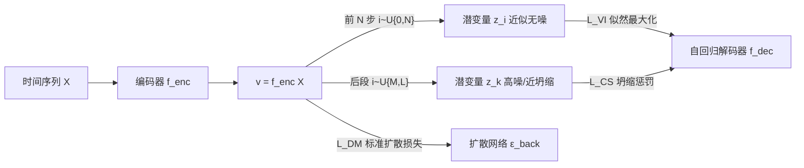

# A Study of Posterior Stability in Time-Series Latent Diffusion

**会议**: ICLR 2026  
**OpenReview**: [https://openreview.net/forum?id=UbL2Fo0IvV](https://openreview.net/forum?id=UbL2Fo0IvV)  
**代码**: 待确认  
**领域**: 时间序列生成 / 潜在扩散模型  
**关键词**: 潜在扩散, 后验坍缩, 时间序列生成, 变分推断, 依赖度量  

## 一句话总结
本文系统分析了潜在扩散（latent diffusion）在时间序列上的后验坍缩问题——证明坍缩会让模型退化成弱化版 VAE，并提出"后验稳定潜在扩散"框架：把扩散过程重解释为变分推断以去掉危险的 KL 正则、再用扩散过程模拟坍缩来惩罚解码器对潜变量的不敏感。

## 研究背景与动机
- **领域现状**：潜在扩散（Rombach et al. 2022）在图像生成上取得巨大成功，相比标准扩散模型采样效率高得多，因此自然被迁移到时间序列生成上。
- **现有痛点**：当把这套"自编码器 + 扩散模型"框架用到时间序列时，会遭遇**后验坍缩**（posterior collapse）——潜变量 $z$ 只捕获了数据中极少的信息，自回归解码器在条件生成 $p_{gen}(X\mid z)$ 时干脆忽略 $z$，转而依赖前缀观测。本文进一步用**依赖度量**实证发现：潜变量对循环解码器的影响随时间步几乎呈**指数衰减**。
- **核心矛盾**：图像潜在扩散的解码器是 U-Net 这类前馈网络，天然对输入敏感；而时间序列的解码器是自回归结构（RNN/Transformer），是"强解码器"，更容易绕过潜变量。同时 VAE 沿用下来的 KL 正则项会把后验推向先验，本身就是诱发坍缩的根源——但这个正则在扩散框架里其实**没必要**，因为扩散组件本就能从复杂（非高斯）分布采样潜变量。
- **本文目标**：先把后验坍缩的危害"算清楚"、再"量出来"，最后给出一个不靠 KL 正则、又能强制解码器敏感于潜变量的新框架。
- **核心 idea**：**【重解释 + 反向模拟】**——把扩散前向过程的**前几步**当作变分推断（替代 KL 正则），把**后几步**（高噪声、近坍缩）用来主动模拟后验坍缩并施加惩罚，从而双向稳住后验。

## 方法详解

### 整体框架
框架建立在一个观察上：扩散前向核 $q_{forw}(z_i\mid z_0)=\mathcal{N}(z_i;\sqrt{\bar\alpha_i}z_0,(1-\bar\alpha_i)I)$ 中，系数 $\bar\alpha_i$ 随步数 $i$ 从 1 单调衰减到约 0。若令 $z_0=v=f^{enc}(X)$，则 $z_i$ 保留了 $\bar\alpha_i\times100\%$ 的编码信息——$i\to0$ 时几乎等同 VAE 的变分推断（轻微加噪），$i\to L$ 时则 $q_{forw}(z_i\mid z_0)\approx\mathcal{N}(0,I)$，恰好"复刻"了后验坍缩。作者把扩散过程的两端分别复用为两件事，配合原本的扩散损失，构成三项联合训练。

### 关键设计

**1. 退化定理：把"危害"算成可证的命题。** 作者先从理论上证明后验坍缩并非"性能掉一点"那么轻——命题 3.1（Gaussian Latent Variables）指出：若标准潜在扩散的后验 $q_{VI}(z\mid X)$ 坍缩，则潜变量的边际分布 $q_{latent}(z)$ 会退化为标准高斯 $\mathcal{N}(0,I)$。这意味着负责逼近复杂潜变量分布的扩散模块变成了**冗余模块**，整个潜在扩散就塌缩成一个普通 VAE，表达力甚至弱于原始扩散模型。这个结论把"为什么必须解决坍缩"从经验直觉提升为形式化论证。

**2. 依赖度量：用积分梯度量化解码器到底听谁的。** 为在真实数据上验证坍缩是否真的发生，作者受积分梯度（integrated gradients）启发，定义**依赖度量**。把潜变量记作 $x_0=z$、前缀记作 $X_{1:t-1}$，以全零输入 $O_{0:t-1}$ 为基线、$\gamma(s)=sX_{0:t-1}+(1-s)O_{0:t-1}$ 为插值直线，定义每个输入变量 $x_j$ 对解码器表示 $h_t$ 的贡献：

$$m_{t,j}=\frac{1}{\lVert h_t-\tilde h_t\rVert^2}\Big\langle h_t-\tilde h_t,\ \sum_k x_{j,k}\int_0^1\frac{df^{dec}(\gamma(s))}{d\gamma_{j,k}(s)}ds\Big\rangle$$

其中 $m_{t,0}$ 称为**全局依赖**（解码器对潜变量 $z$ 的依赖），$m_{t,t-1}$ 是**一阶局部依赖**（对最近观测的依赖）。该度量是有符号的，且满足归一化性质 $\sum_{j=0}^{t-1}m_{t,j}=1$（命题 3.3）。实证发现：$m_{t,0}$ 随时间步指数收敛到 0，坐实了坍缩；更有意思的是"**依赖幻觉**"——把时间序列随机打乱后，相邻观测本应无关，解码器却仍对 $x_{t-1}$ 维持约 0.1–0.2 的依赖，说明它在过拟合式地编造依赖关系。

**3. 扩散即变分推断：用前几步替代 KL 正则。** 既然 KL 项是坍缩根源、而扩散组件能从复杂先验采样，作者干脆取消 KL。具体做法：固定一个小整数 $N\ll L$，从 $\mathcal{U}\{0,N\}$ 采样步数 $i$，用扩散前向把编码输出 $v$ 转成潜变量 $z=z_i\sim q_{forw}(z_i\mid z_0=v)$，并以加权负对数似然作为变分推断损失：

$$L_{VI}=\mathbb{E}_{i\sim\mathcal{U}\{0,N\},z_0}\big[-\bar\alpha^{\gamma i}\,\ln p_{gen}(X\mid z=z_i)\big]$$

权重 $\bar\alpha^{\gamma i}$（$\gamma\in\mathbb{N}^+$）随噪声增大而衰减，抑制过噪潜变量的干扰。测试时则用扩散的反向过程采样 $z_i$，因此无需 KL 项也能保证先验/解码器在测试时兼容，且先验可以是**自由形式**而非被迫高斯。

**4. 反向模拟坍缩：用后几步主动惩罚不敏感。** 仅去掉 KL 还不够强解码器问题。作者再取扩散过程的**后段**（$i\to L$，潜变量几乎不含 $v$ 的信息）主动制造一个"坍缩态"，并惩罚解码器在这种无信息潜变量下仍能高概率重建数据的行为：

$$L_{CS}=\mathbb{E}_{i,z_i}\big[(1-\bar\alpha^{\lceil i/\eta\rceil})\,\ln p_{gen}(X\mid z=z_i)\big],\quad i\sim\mathcal{U}\{M,L\}$$

其中 $M$ 接近 $L$、$\eta\ge1$ 用于削弱较有信息潜变量的影响。直觉是：若强解码器只靠历史观测 $\{x_k\mid k<j\}$ 就能预测 $x_j$，那么即便 $z$ 几乎无信息它仍会给出高似然——$L_{CS}$ 正好对这种"绕过潜变量"的捷径施加重罚，从而压制依赖幻觉、逼解码器真正用上 $z$。最终训练目标为 $L_{VI}+L_{DM}+L_{CS}$ 三项联合（其中 $L_{DM}$ 是标准扩散去噪损失），两次解码器前向可并行，训练开销仅小幅增加，推理与原潜在扩散完全一致。

## 实验关键数据

### 主实验表格
Wasserstein 距离（越低越好），跨 LSTM / Transformer 两种骨干：

| 模型 | 骨干 | MIMIC | WARDS | Earthquakes |
|---|---|---|---|---|
| Latent Diffusion | LSTM | 5.19 | 7.52 | 5.87 |
| + KL Annealing | LSTM | 4.28 | 5.74 | 3.88 |
| + Variable Masking | LSTM | 4.73 | 6.01 | 4.26 |
| + Skip Connections | LSTM | 3.91 | 4.95 | 3.74 |
| **Our Framework** | LSTM | **2.29** | **3.16** | **2.67** |
| Latent Diffusion | Transformer | 5.02 | 7.46 | 5.91 |
| + KL Annealing | Transformer | 4.31 | 5.54 | 3.51 |
| + Variable Masking | Transformer | 4.42 | 5.97 | 4.45 |
| + Skip Connections | Transformer | 3.75 | 4.67 | 3.69 |
| **Our Framework** | Transformer | **2.13** | **3.01** | **2.49** |

与更多近期基线对比（Transformer 骨干，MIMIC / Earthquakes）：

| 模型 | MIMIC | Earthquakes |
|---|---|---|
| Latent Diffusion | 5.02 | 5.91 |
| + Mutual Information Constraints | 3.59 | 3.85 |
| + Inverse Lipschitz Constraint | 3.01 | 3.42 |
| Neural STPP | 5.13 | 5.82 |
| Neural Latent Dynamic | 4.31 | 5.12 |
| Frequency Diffusion | 4.56 | 5.07 |
| **Our Framework** | **2.13** | **2.49** |

### 消融实验表格
超参 $N$（变分推断步数）、$M$（坍缩模拟起点）的消融（默认 $N=50,M=100$），无论增大或减小都会变差：

| 设置 | 结论 |
|---|---|
| $N=50, M=100$（默认） | 两数据集上最优 |
| $N$ 偏大/偏小 | 性能下降 |
| $M$ 偏大/偏小 | 性能下降 |

模型配置：$L=1000$ 扩散步，$\gamma=2,\eta=1$，每个数字在 10 个随机种子上平均（标准差 < 0.05），单卡 40G 10 小时内可训完。

### 关键发现
- **后验稳定性**：改进后全局依赖 $m_{t,0}$ 收敛到约 0.5（而非趋 0），潜变量在整个生成过程都保有对解码器的控制；打乱序列时 $m_{t,0}$ 维持在 1 附近、局部依赖多为负——彻底消除了依赖幻觉。
- **生成质量**：Transformer 骨干下在 WARDS 上比"KL Annealing"低 2.53 点，全面优于所有坍缩缓解基线与 TimeGAN/Neural ODE 等其他生成模型。
- **代价极小**：MIMIC 上训练 2h10min→2h50min，推理 5min12s→5min17s，两次解码器前向可并行。

## 亮点与洞察
- **"危害可证 + 症状可测 + 病因可治"三段闭环**：先用命题证明坍缩 = 退化成弱 VAE，再用依赖度量在真实数据上量化坍缩与"依赖幻觉"，最后对症下药，逻辑链条非常完整。
- **复用扩散过程本身的两端**：同一条前向链，近端当变分推断、远端当坍缩模拟器，几乎不引入额外模块就同时解决了"KL 正则"和"强解码器"两大病因，工程上优雅。
- **依赖幻觉是一个有普遍价值的诊断概念**：把"打乱序列后解码器仍依赖邻近观测"作为过拟合/虚假依赖的探针，可迁移到其他自回归生成模型的分析。

## 局限与展望
- 实验集中在医疗/地震等少量真实时间序列数据集（MIMIC、WARDS、Earthquakes，附录补 Retail/Energy 及文本图像），规模与多样性仍有限，超长序列与高维多变量场景的稳定性待验证。
- 引入了 $N,M,\gamma,\eta$ 等多个超参，虽给了默认值与消融，但跨数据集的自适应选择仍需人工调。
- $L_{CS}$ 的"主动制造坍缩态再惩罚"是一种间接正则，理论上能否给出对解码器敏感性的更紧界仍是开放问题。

## 相关工作与启发
- **后验坍缩缓解**：KL 退火（KL Annealing）用自适应权重控制 KL 项；变量掩码（Variable Masking）随机遮挡解码器输入逼其用潜变量但会削弱表达力；跳连（Skip Connections）每步注入潜变量但其沦为常量信号仍被忽略——本文指出这些都只能部分缓解。
- **其他时间序列生成模型**：Neural ODE（擅长不规则序列）、TimeGAN（基于 GAN）作为对照组被纳入比较。
- **启发**：把"采样器的能力"与"正则的必要性"解耦——当生成组件已能逼近复杂先验时，沿袭自上一代框架的正则（如 KL）可能反成负担，这一思路对其他"自编码器 + 强生成头"的组合同样适用。

## 评分
- **新颖性**: ⭐⭐⭐⭐⭐ —— 把扩散过程两端分别复用为变分推断与坍缩模拟器，配合可证的退化定理与依赖度量诊断，视角新颖且自洽。
- **实验充分度**: ⭐⭐⭐⭐ —— 双骨干、多基线、依赖度量可视化、消融与运行时分析齐备，但数据集偏少、规模偏小。
- **写作质量**: ⭐⭐⭐⭐⭐ —— "危害-症状-病因-药方"叙事清晰，理论与实证衔接紧密，公式与算法伪代码完整。
- **价值**: ⭐⭐⭐⭐ —— 为时间序列潜在扩散提供了即插即用、几乎零额外成本的稳定后验方案，且依赖幻觉这一诊断工具具备外溢价值。

<!-- RELATED:START -->

## 相关论文

- [\[ICLR 2026\] Latent-to-Data Cascaded Diffusion Models for Unconditional Time Series Generation](latent-to-data_cascaded_diffusion_models_for_unconditional_time_series_generatio.md)
- [\[ICML 2026\] Latent Laplace Diffusion for Irregular Multivariate Time Series](../../ICML2026/time_series/latent_laplace_diffusion_for_irregular_multivariate_time_series.md)
- [\[ICLR 2026\] Understanding Transformers in Time Series Forecasting: A Case Study on MOIRAI](understanding_transformers_for_time_series_forecasting_a_case_study_on_moirai.md)
- [\[ICLR 2026\] ICDiffAD: Implicit Conditioning Diffusion Model for Time Series Anomaly Detection](icdiffad_implicit_conditioning_diffusion_model_for_time_series_anomaly_detection.md)
- [\[ICLR 2026\] MMPD: Diverse Time Series Forecasting via Multi-Mode Patch Diffusion Loss](mmpd_diverse_time_series_forecasting_via_multi-mode_patch_diffusion_loss.md)

<!-- RELATED:END -->
