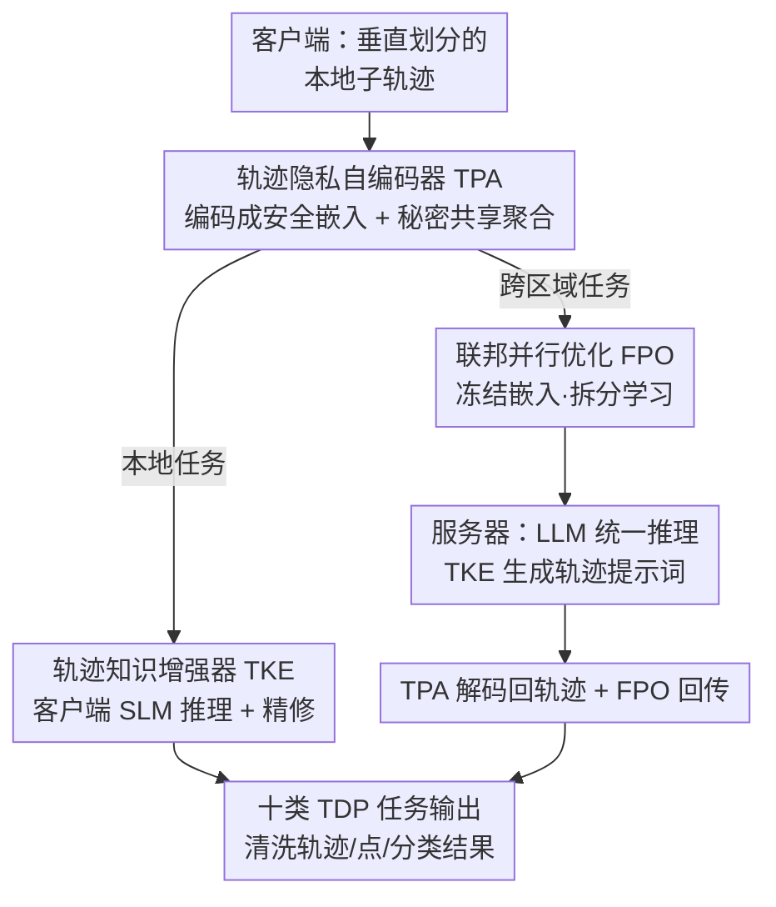

# A Unified Federated Framework for Trajectory Data Preparation via LLMs

**会议**: ICLR 2026  
**OpenReview**: [https://openreview.net/forum?id=MIelckWrEK](https://openreview.net/forum?id=MIelckWrEK)  
**代码**: https://github.com/ZJU-DAILY/FedTDP  
**领域**: 时序/时空 / 联邦学习 / LLM 应用  
**关键词**: 轨迹数据准备、联邦学习、垂直划分、隐私保护、LLM 微调

## 一句话总结
FedTDP 把"轨迹数据准备"（去噪、补全、地图匹配等十类任务）统一成一个跨区域、不共享原始数据的联邦学习问题，用一个轻量隐私自编码器保护数据、一个轨迹知识增强器把通用 LLM 改造成懂时空模式的"轨迹清洗大脑"、再用并行优化压通信成本，在 6 个数据集 10 类任务上全面超过 13 个 SOTA。

## 研究背景与动机
**领域现状**：轨迹数据（人/车的时空移动记录）在使用前必须做"数据准备"（Trajectory Data Preparation, TDP）——包括异常检测、缺失补全、噪声过滤、停留点检测、地图匹配、轨迹-用户关联、出行方式识别、轨迹简化、轨迹分段、轨迹恢复等十类任务。这些任务此前都是各自为政，每类任务一个专用模型。

**现有痛点**：作者指出两个硬伤。**第一（L1，去中心化要求）**：轨迹数据极度敏感，各国隐私法规（中国 PIPL、美国 FGDC）禁止跨区域共享原始移动数据；现实中像 Uber Movement 这类平台按行政边界切分行程。这导致轨迹被"垂直划分"（vertical partitioning）——每个区域只看到一条轨迹的一段。只在局部段上训练的模型会在行政边界处出现断裂、时空模式有偏，恰恰在边界附近的补全/异常检测上崩坏。而已有联邦学习几乎都研究"水平划分"（不同用户在不同机构），跨区域的垂直划分没人系统研究过。**第二（L2，缺乏通用框架）**：每个 TDP 任务都是窄定义的专用方法（HMM 地图匹配、RNN/GAN 补全、手工特征异常检测），换个任务就得重新设计或重训，整条流水线碎片化、算力浪费、扩展性差。

**核心矛盾**：要同时满足"数据不出区域"（隐私）和"一个模型通吃多任务"（泛化）。直接把联邦学习（FL）和 LLM 拼起来并不够，因为这个新问题（作者命名为 F-TDP，Federated Trajectory Data Preparation）暴露三个独有挑战：**C1 隐私**——很多 TDP 任务需要跨客户端的上下文（补一个缺失点要用相邻区域的前后点），但原始数据不能跨区域取；**C2 轨迹知识学习**——LLM 是为文本语料设计的，天然不懂轨迹的时间规律性和空间依赖；**C3 效率**——客户端算力小、存不下 LLM，LLM 只能放服务器，但这又带来巨大通信开销，即便用 PEFT 在联邦设定下也很慢。

**切入角度**：把每个区域当作一个客户端（存部分轨迹），服务器端放一个 LLM 作为统一的多任务"清洗大脑"；客户端配一个轻量小语言模型（SLM）处理本地任务，只有跨区域任务才把（加密后的）表示送到服务器交给 LLM。

**核心 idea**：用"隐私自编码器保数据 + 知识增强器把 LLM 教成懂时空 + 并行优化省通信"这三件套，把十类轨迹清洗任务统一进一个隐私安全的联邦 LLM 框架。

## 方法详解

### 整体框架
FedTDP 由一个中心服务器和多个区域客户端组成，三大模块各管一个挑战：**TPA（轨迹隐私自编码器）**管隐私（C1）、**TKE（轨迹知识增强器）**管让模型懂轨迹（C2）、**FPO（联邦并行优化）**管效率（C3）。系统引入一个关键设定——**SLM（小语言模型）**：它是服务器端 LLM 的轻量对应物，部署在每个客户端上。

运行时分两条路径。**本地 TDP**（一段子轨迹在单个区域内就能处理）：TKE 生成轨迹专用提示词喂给客户端 SLM，SLM 出初步结果，TKE 再精修。**跨区域 TDP**（轨迹跨多个区域，需要协同）：TPA 先把本地轨迹编码成安全的嵌入再传输，FPO 冻结传输的数据以减通信；到了服务器端，TKE 为 LLM 生成提示词，LLM 出结果后 TPA 把嵌入解码回轨迹表示，FPO 管回传，最后客户端 TKE 精修。

### 关键设计

**1. 轨迹隐私自编码器 TPA：用确定性变换替代加噪，既保隐私又留时空相关性**

针对 C1，最直接的隐私方案是差分隐私（DP），但 DP 靠往数据里加随机噪声，会破坏 TDP 任务赖以为生的时空相关性（速度、方向），降低精度。TPA 反其道而行：它是一个**确定性、可学习的**编码-解码变换，把每个时空点 $p_i$ 独立编码成嵌入 $e_i=\theta_{Enc}(p_i)$，各客户端的嵌入传到服务器按匿名用户标识对齐聚合 $E=\bigcup_{i=1}^{|C|}E_i$，既保留客户端内也保留客户端间的时空依赖；服务器把 LLM 输出 $\tilde{E}$ 切分回各客户端，解码器重建估计轨迹 $\tilde{p}_i=\mathrm{Dec}(\tilde{e}_i)$。TPA 实现得极轻——三层 MLP + GELU、256 隐藏维、32 嵌入维，几乎不增计算。它和 DP 的本质区别是：DP 在隐私预算内仍会泄漏原始位置/时间的概率信息，而只要编码器/解码器保持私有，从嵌入重建原始轨迹在计算上不可行（附录 C.2 给了形式化保证）。

但光传嵌入还不够——联邦聚合时攻击者能用嵌入反演、梯度反演攻击恢复原始数据。TPA 因此配了一套**去中心化的秘密共享聚合协议**。每对客户端 $(C_i,C_j)$ 本地生成共享密钥 $sk_{i,j}=sk_{j,i}$；聚合时把 TPA 参数切成 $|C|$ 个参数块，客户端 $C_i$ 用与其他客户端约定的密钥给自己的参数块加掩码——按 $i>j$ 加、$i<j$ 减的规则：

$$\tilde{P}^{(k)}_i = P^{(k)}_i + \sum_{j=1,j\neq i}^{|C|} a_{i,j}\cdot sk_{i,j},\quad a_{i,j}=\begin{cases}1,& i<j\\-1,& i>j\end{cases}$$

由 Theorem 1，所有掩码参数块求和等于原始参数块求和（成对密钥相互抵消），于是 $\overline{P}^{(k)}=\frac{1}{|C|}\sum_i\tilde{P}^{(k)}_i=\frac{1}{|C|}\sum_i P^{(k)}_i$，**在不暴露任何单个客户端参数的前提下拿到正确的聚合结果**，且不像同态加密/DP 那样牺牲效率或精度。

**2. 轨迹知识增强器 TKE：把文本 LLM 改造成懂时空的"轨迹大脑"，并让大小模型互相教**

针对 C2，TKE 用四件套把通用 LLM/SLM 喂出 TDP 知识。**(i) 轨迹提示工程**：设计一个四元组指令范式 (Task, Data, Information, Format)——Task 是任务名+描述，Data 是输入（本地任务给 SLM 喂原始轨迹 $T$、跨区域任务给 LLM 喂嵌入 $E$），Information 是可选的人工配置时空上下文（路网、天气，来自 OpenStreetMap/OpenWeatherMap），Format 是任务专属输出格式（AD/TUL/TMI 出分类、TI/NF/MM 等出轨迹、SPD 出时空点）。**(ii) 轨迹离站微调（offsite-tuning）**：把 LLM 拆成 $\theta_{LLM}=[A,F]$，适配器 $A$ 是最后几层（做任务特化）、基座 $F$ 是其余层（抽通用特征）；把服务器的适配器 $A$ 派发到客户端、接到本地 SLM 尾部组成 $\theta_{SLM}=[A,F']$，客户端只用本地数据微调 $A$（且用 LoRA 降参），更新后的适配器回传服务器聚合。注意 FedTDP **不是**简单把训好的 LLM 适配器搬给 SLM，而是用 $A$ 在训练期增强 SLM 的学习能力，唯一兼容性要求是隐藏维对齐。

**(iii) LoRA 稀疏微调**：依据"变化越剧烈的参数对收敛贡献越大"，只训练 LoRA 参数变化率排名前 $m$ 的层。先算每层变化率占全局的比例 $R^{(r)}(L_i)=CR^{(r)}(L_i)/\sum_{j=1}^N CR^{(r)}(L_j)$，其中 $CR^{(r)}(L_i)=|(L^{(r)}_i-L^{(r-1)}_i)/L^{(r-1)}_i|$；再按概率（Theorem 2）随机选 $M=\lfloor m\cdot N\rfloor$ 层参与下一轮，服务器按训练该层的客户端数加权聚合。这样只更新少数关键层，大幅省训练开销。**(iv) 双向知识学习**：让 SLM 用逆向 KL 对齐 LLM 的高频输出 $\min_{\theta_{SLM}}D_{KL}(P_{\theta_{SLM}}\|P_{\theta_{LLM}})$（SLM 学 LLM 的复杂输出空间）；同时因为只有 SLM 能看到原始轨迹，再让 LLM 用前向 KL 对齐 SLM 输出（LLM 学 SLM 掌握的真实轨迹知识）。一来一回让大小模型互补。消融显示 TKE 是性能的第一功臣。

**3. 联邦并行优化 FPO：拆分学习 + 交替优化 + 并行训练，把通信和时间压下来**

针对 C3，FPO 用三招提效。**拆分学习**：把联邦训练拆成客户端训练（负责 TPA 编解码器 + SLM）和服务器训练（负责 LLM），两边可同时跑。**交替优化**：为减数据传输，服务器冻结客户端上传的嵌入用于 LLM 训练，客户端冻结服务器 LLM 输出的结果用于 TPA/SLM 训练——互相把对方的数据"冻住"当常量，避免反复传。**并行训练**：客户端并行优化三个目标——TPA 重建损失 $L_1$、SLM 与 LLM 间逆向 KL 损失 $L_2$、SLM 输出与标签的损失 $L_3$；服务器并行优化两个——LLM 与 SLM 间前向 KL 损失 $L_1$、LLM 输出与标签的损失 $L_2$。消融里去掉 FPO 性能几乎不变，但训练时间和通信开销直接降到约 1/4，说明它是纯提效模块、不牺牲精度。

## 实验关键数据

### 主实验
在 6 个真实数据集（GeoLife 训练，Porto/T-Drive/Tencent/Gowalla/SHL 测试）、10 类 TDP 任务上对比 13 个 SOTA，分 few-shot/zero-shot 两种场景。FedTDP 在几乎所有任务上全面领先。

| 数据集·任务 | 指标 | 最强单任务/LLM baseline | FedTDP | 备注 |
|--------|------|------|------|------|
| GeoLife·TI（已见） | Acc | 81.29/73.78（UrbanGPT） | **94.99/92.07** | 补全任务大幅领先 |
| GeoLife·MM（已见） | Acc | 53.17/51.13（UrbanGPT） | **76.48/74.25** | 地图匹配 +23 点 |
| Porto·AD（未见） | F1 | 53.54/46.26（UniST） | **68.78/62.91** | 跨域异常检测 |
| Tencent·MM（未见） | Acc | 49.58/41.61（UrbanGPT） | **65.46/60.37** | 未见域地图匹配 |
| SHL·TMI（未见） | F1 | 59.83/51.59（UrbanGPT） | **71.54/63.67** | 出行方式识别 |

汇总结论：相比单任务 SOTA（S-TDP）至少提升 **18.38%**，相比 LLM 表格数据准备方法（FM4DP/MELD/TableGPT）至少提升 **32.26%**，相比 LLM 时空分析方法（PromptGAT/UniST/UrbanGPT）提升 **4.84%–45.22%**。作者解释：单任务模型抓不到跨任务共享的时空知识；通用表格 LLM 把轨迹当无序行，丢了时序/空间依赖；时空 LLM 没有 TDP 专属知识。

### 消融实验
逐一移除三大模块（指标取自 Fig. 5 的文字描述）：

| 配置 | 性能变化 | 开销变化 | 说明 |
|------|---------|------|------|
| Full model | 基准 | 基准 | 完整 FedTDP |
| w/o TPA | 略升一点点 | 通信省约 5GB/10 轮 | TPA 传高维嵌入有成本，但隐私必需 |
| w/o TKE | **暴跌 ≥27.52%** | 训练成本反升（要更新更多参数） | 性能第一功臣 |
| w/o FPO | 几乎不变 | 训练时间/通信降约 4 倍 | 纯提效，不牺牲精度 |

### 关键发现
- **TKE 贡献最大**：去掉后掉点至少 27.52%，证明仅靠 LLM 自带的泛化能力远不足以做 TDP 推理，必须注入轨迹先验。
- **TPA 是"花小钱买隐私"**：它略微拉低精度、增约 5GB 通信，但换来形式化隐私保证，作者判定为必需。
- **FPO 是"白嫖的效率"**：性能不变、训练提速约 4 倍；效率研究里 FedTDP 训练时间比其他 LLM 方法快 11.3–14.2 倍，测试期通信比 LLM 方法少 1.4–1.8 倍。
- **任务数越多泛化越好**：泛化研究里从后往前删训练任务，性能随之下降；当只剩 1 个任务（仅 AD）时甚至跌破单任务 SOTA，说明多任务联合训练带来的共享时空知识是关键。

## 亮点与洞察
- **把"垂直划分轨迹"立成一个新问题（F-TDP）**：以往联邦学习几乎只做水平划分，作者点出"按行政边界切分行程"这种现实场景的垂直划分被忽视了，光这个问题定义就有价值。
- **用秘密共享替代 DP/同态加密**：成对密钥加减相消的 trick 让聚合结果无损、又不泄漏单方参数，避开了 DP 的"隐私-效用 trade-off"，这套思路可迁移到任何怕加噪掉点的联邦回归/重建任务。
- **大小模型双向蒸馏 + offsite-tuning 的组合**：SLM 能看原始数据、LLM 算力强，让两者用前向/逆向 KL 互教，既绕开"客户端存不下 LLM"又让 LLM 学到只有本地才有的真实轨迹知识——这种"谁有什么资源就教对方什么"的非对称蒸馏很巧。
- **LoRA 稀疏微调按"参数变化率"选层**：把"变化剧烈=贡献大"做成概率选层，是个轻量但合理的省算力 trick，可直接搬到其他联邦 PEFT 场景。

## 局限与展望
- **Information 字段靠人工配置**：路网/天气等上下文是手动、任务专属配置的，不是模型自动决定，扩到新任务/新区域时这部分要人工介入，限制了"开箱即用"程度。
- **TPA 的隐私保证依赖编解码器私有**：一旦编码器/解码器泄漏，重建就不再"计算上不可行"，且其安全性论证主要在附录，正文未充分压力测试针对 TPA 本身的反演攻击。
- **多数任务用单一数据集训练泛化**：seen 任务只用 10% GeoLife 训练，虽然展示了 zero-shot 迁移，但训练域单一，是否在差异极大的城市/采样率下仍稳健需更多验证。
- **通信总量其实最大**：效率研究坦承 FedTDP 训练期通信量是所有方法里最大的（要传嵌入+参数），它赢在轮数和运行时间上——在带宽极受限场景这点需权衡。

## 相关工作与启发
- **vs 单任务 TDP 方法（GraphMM/Kamel/ATROM 等）**: 它们一任务一模型、换任务就重训，抓不到跨任务共享的时空知识；FedTDP 用一个 LLM 统一十类任务，至少 +18.38%，且天然支持未见任务。
- **vs LLM 表格数据准备（FM4DP/MELD/TableGPT）**: 它们把轨迹当无序表格行处理，丢了时序与空间依赖；FedTDP 用 TPA 保时空相关性 + TKE 注入轨迹先验，至少 +32.26%。
- **vs LLM 时空分析（PromptGAT/UniST/UrbanGPT）**: 它们做时空建模但没有 TDP 专属知识，适配不了 10 类异构清洗任务；FedTDP 的 TKE 专门补这块，提升 4.84%–45.22%。
- **vs 主流联邦学习**: 已有 FL 多研究水平划分（不同用户在不同机构），FedTDP 首次系统处理跨区域的垂直划分，并用秘密共享聚合替代易掉点的 DP。

## 评分
- 新颖性: ⭐⭐⭐⭐⭐ 首次定义并系统解决"垂直划分轨迹的联邦数据准备"，三模块设计针对性强
- 实验充分度: ⭐⭐⭐⭐⭐ 6 数据集 10 任务 13 baseline，主/消融/泛化/效率四类实验齐全
- 写作质量: ⭐⭐⭐⭐ 结构清晰、动机层层递进，但核心隐私证明与不少细节压在附录
- 价值: ⭐⭐⭐⭐⭐ 隐私合规下的统一轨迹清洗在城市计算/交通领域落地价值高，秘密共享聚合 trick 可复用

<!-- RELATED:START -->

## 相关论文

- [\[ICLR 2026\] pyrregular: A Unified Framework for Irregular Time Series, with Classification Benchmarks](pyrregular_a_unified_framework_for_irregular_time_series_with_classification_ben.md)
- [\[ACL 2026\] A Unified Framework for Modeling Heterogeneous Financial Data via Dual-Granularity Prompting](../../ACL2026/time_series/a_unified_framework_for_modeling_heterogeneous_financial_data_via_dual-granulari.md)
- [\[ICLR 2026\] Towards Robust Real-World Multivariate Time Series Forecasting: A Unified Framework](towards_robust_real-world_multivariate_time_series_forecasting_a_unified_framewo.md)
- [\[ICLR 2026\] FeDaL: Federated Dataset Learning for General Time Series Foundation Models](fedal_federated_dataset_learning_for_general_time_series_foundation_models.md)
- [\[ICLR 2026\] Delta-XAI: A Unified Framework for Explaining Prediction Changes in Online Time Series Monitoring](delta-xai_a_unified_framework_for_explaining_prediction_changes_in_online_time_s.md)

<!-- RELATED:END -->
