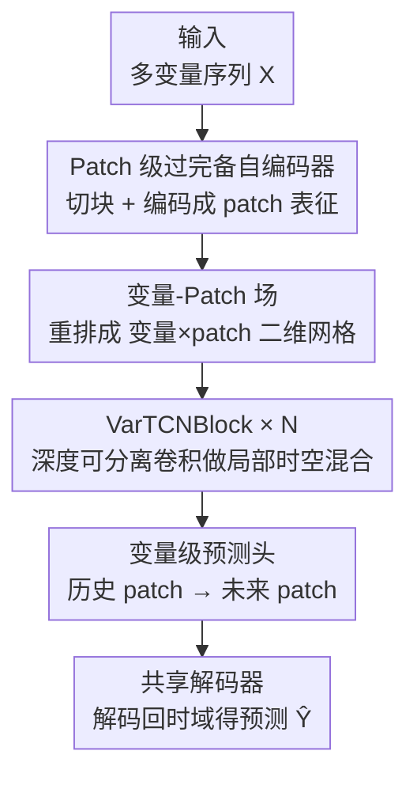

# Are Global Dependencies Necessary? Scalable Time Series Forecasting via Local Cross-Variate Modeling

**会议**: ICLR2026  
**OpenReview**: [https://openreview.net/forum?id=CNVL194fO5](https://openreview.net/forum?id=CNVL194fO5)  
**代码**: https://github.com/iuaku/VPNet/  
**领域**: 时序预测  
**关键词**: 多变量时序预测, 跨变量依赖, 局部建模, 深度可分离卷积, 线性复杂度

## 一句话总结
针对多变量时序预测里"用全局注意力建模跨变量依赖导致复杂度随变量数二次膨胀"的痛点，本文提出"局部充分性假设"——稠密系统中一个有限的局部邻域就大概率包含足够的预测信号，并据此设计 VPNet：把 patch 嵌入重排成「变量 × patch」二维场，用深度可分离 2D 卷积做局部混合，使复杂度随变量数线性增长，在 8 个基准上同时拿下 SOTA 精度与显著效率优势。

## 研究背景与动机
**领域现状**：多变量时序预测的核心难点是建模"跨变量依赖"——多条同时演化的序列之间复杂、时变的相互作用。近年主流靠两类架构推进：一类是 Transformer 系的通道融合模型（如 iTransformer），显式地在所有变量之间搜索全局依赖；另一类是通道独立模型（如 PatchTST、DLinear、TimeMixer），每条变量各自建模、彼此不交互。

**现有痛点**：这两端各有硬伤。全局注意力虽然表达力强，但通道维注意力的开销随变量数 $C$ 二次增长——当系统有几百上千条变量（如 Traffic 的 862 维、Electricity 的 321 维）时，显存和算力都吃不消，根本部署不动。通道独立模型效率很高，却从结构上放弃了跨变量信号，丢掉了序列之间本可利用的预测线索。

**核心矛盾**：精度与可扩展性之间存在一道张力——想要全局表达力就得付二次代价，想要线性效率就得牺牲跨变量建模。本文直接质疑这个二选一前提：在稠密、高维系统里，真的有必要搜索"全局"依赖吗？

**本文目标**：找到一种既能利用跨变量信号、又能让复杂度对变量数保持线性的建模方式，从根上化解精度-效率权衡。

**切入角度**：作者观察到真实高维数据集（Weather、Electricity、Traffic、Solar）的变量相关性热图普遍呈现"强、稠密"的结构（图 1 右）。既然依赖图本身足够稠密，那么对任意目标变量，一个合理选取的有限邻域里几乎必然能命中有信息量的邻居——全局穷搜不仅没必要，反而可能放大噪声。

**核心 idea**：提出"局部充分性假设"（Local Sufficiency Hypothesis），用"局部跨变量卷积"代替"全局跨变量注意力"，在保持精度的同时把复杂度压成线性。

## 方法详解

### 整体框架
VPNet（Variate–Patch Network）是一个 sequence-to-sequence 的预测架构，整条流水线分四个阶段：先用一个 **patch 级过完备自编码器**把原始序列切块并编码成鲁棒的局部 patch 表征；接着做 **通道化（channelization）**，把这些 patch 嵌入重新解读成一张「变量 × patch」的二维场（VP-Field），让跨变量结构暴露在卷积可以直接操作的平面上；然后堆叠若干 **VarTCNBlock**，用深度可分离 2D 卷积在这张场上反复做局部时空混合；最后用 **变量级预测头 + 共享解码器**把精炼后的历史 patch 表征映射成未来 patch，再解码回时域得到预测。

整个设计的灵魂是一个可证明的直觉（定理 3.1）：固定一个目标变量，设其余 $C-1$ 个变量里恰有 $r$ 个属于"信息集"，变量顺序为随机排列，宽度为 $k$ 的窗口 $W_k$ 至少包含一个信息变量的概率满足

$$\Pr(E_k) \ge 1 - \exp\!\left(-\frac{kr}{C-1}\right).$$

由此推出实用的核宽选择准则：要以至少 $1-\delta$ 的概率覆盖到信息变量，只需 $k \ge \frac{C-1}{r}\ln\frac{1}{\delta}$。这条不等式给出了"局部就够用"的定量底气，也直接指导了卷积核在变量轴上的初始宽度。

### 关键设计

**1. 局部充分性假设：用"够不够"代替"全不全"**

这是全文的出发点，也是后面所有架构选择的理论锚点。它针对的痛点是全局注意力的二次复杂度——既然真实稠密系统里变量之间普遍强相关，那"搜索每一对变量"就是浪费。作者把这个直觉形式化为定理 3.1：随机排列下，宽度 $k$ 的局部窗口命中信息变量的概率随 $kr/(C-1)$ 指数趋于 1。直觉上，窗口内信息变量的期望个数为 $\mu = kr/(C-1)$，对尾部用 Chernoff/Poisson 风格的界即得上述指数下界。意义在于：它把"该用多大的局部感受野"从拍脑袋变成了有公式可依的工程准则，也解释了为什么后面消融里 $k_v$ 从 1 涨到 3 收益巨大、再往大走却边际递减——稠密系统的有效信号本就集中在小邻域内，扩大窗口只会引入更多无关变量、稀释信噪比。

**2. 变量-Patch 场：把 patch 嵌入重新解读成可卷积的二维平面**

这一步是方法的概念核心，也是相对以往 TCN 模型（ModernTCN、TimesNet）的根本分野。痛点是：要想用卷积同时抓"跨变量"和"时序"两类依赖，得先把数据摆成一个让局部算子有意义的二维结构。先由自编码器把每条变量的每个 patch 编码成 $H$ 维隐向量，堆成初始张量 $E \in \mathbb{R}^{B\times C\times P\times H}$；再做一次置换

$$Z^{(0)} = \mathrm{Permute}(E) \in \mathbb{R}^{B\times H\times C\times P}.$$

关键巧思是把 patch 嵌入维 $H$ 当成 2D 算子的"通道维"，而把变量 $C$ 和 patch $P$ 这两轴当成空间网格——即 VP-Field。和 TimesNet 按周期把序列折叠成 2D 抓"序列内"模式不同，VPNet 把每个 patch 当作一个整体单元，在更高层、更鲁棒的语义抽象上同时铺开"变量"和"时间"两个方向。这样一来，一个普通的 2D 卷积就能在这张场上一次性捕获跨变量与时序依赖，而不必再分两路建模。

**3. VarTCNBlock：深度可分离卷积 + 逐点 FFN 的线性复杂度引擎**

这是 VPNet 的核心计算单元，把"局部充分"落到实处。痛点是：即便摆成了二维场，标准卷积在通道上仍是稠密混合，开销会再次膨胀。VarTCNBlock 用一个残差包裹两个组件来解决。其一是**深度可分离 2D 卷积**：对 VP-Field 的每个通道 $h$ 各用一个独立的小核 $W^{(h)}\in\mathbb{R}^{k_v\times k_p}$，

$$Y^{dw}_h = \mathrm{DWConv2D}\big(Z^{(l)}_{:,h,:,:},\, W^{(h)}\big),$$

它只在 $k_v\times k_p$ 的局部邻域里聚合信息，显式建模"时间局部的跨变量依赖"，且参数量与算力都随变量数 $C$ 线性增长——这正是高维场景能跑起来的关键。其二是**逐点前馈网络**：先 $\mathrm{GELU}(\mathrm{BN}(Y^{dw}))$ 做归一化与激活，再用 $1\times1$ 逐点卷积构成的倒瓶颈 FFN（先按 $r_{ff}$ 扩张通道再压回）在每个位置上混合特征通道。最后残差相加 $Z^{(l+1)} = Z^{(l)} + Y^{ffn}$。"深度卷积管空间局部混合、逐点卷积管特征通道混合"的分工，正是把跨变量交互压成线性的来源；残差则保证深层堆叠时梯度顺畅。

**4. patch 自编码器与变量级预测头：共享参数的输入/输出投影**

为了给上面的卷积场提供鲁棒输入、并把结果还原回时域，VPNet 在首尾各放一套共享投影。输入端用 patch 级**过完备**自编码器（隐维 $H>p$，留冗余容量表达复杂 patch 动态），编码器/解码器都是轻量 MLP 且跨变量、跨 patch 共享，相当于学一套"通用 patch 基"，并配一个重建损失抗分布漂移。输出端则是**变量级预测头**：对每条变量把 VarTCN 栈输出的历史 patch 序列展平成 $u_{b,c}\in\mathbb{R}^{HP}$，过一个共享的 per-variate MLP 得到未来 patch 系数，reshape 成预测 patch 嵌入 $\hat{Z}$，最后复用自编码器的解码器逐 patch 解回时域拼成预测 $\hat{Y}$。预测头通道独立（跨变量共享参数）但作用在"每条变量已经被 VarTCN 混过信息"的历史上，既省参数又让每条变量都能用到聚合后的跨变量信息；解码器权重复用则起到正则化预测嵌入、提升重建保真的作用。

### 损失函数 / 训练策略
训练目标是预测损失加重建损失。预测用对离群点更鲁棒的 MAE（L1）：$\mathcal{L}_{pred}=\frac{1}{BSC}\sum |\hat{Y}-Y|_1$；重建损失约束自编码器还原原 patch：$\mathcal{L}_{rec}=\frac{1}{BCP}\sum|\tilde{x}-x|_1$。总损失 $\mathcal{L}_{total}=\mathcal{L}_{pred}+\mathcal{L}_{rec}$。实验固定回看窗口 $L=96$，预测 $S\in\{96,192,336,720\}$，单卡 A100 40GB、PyTorch 实现。

## 实验关键数据

### 主实验
在 8 个长时序预测基准上（4 个预测长度取平均），VPNet 取得整体最优，尤其在跨变量依赖稠密的高维数据集上优势明显。

| 数据集 | 指标 | VPNet | 之前最优 | 提升 |
|--------|------|-------|----------|------|
| Electricity | MSE | **0.162** | 0.178 (iTransformer) | ↓9.0% |
| Traffic | MSE | **0.421** | 0.485 (TimeMixer) / 0.572 (TimeKAN) | ↓最高 26% |
| Solar-Energy | MSE | **0.204** | 0.216 (TimeMixer) | ↓5.6% |
| Weather | MSE | **0.238** | 0.239 (Pathformer) | 持平略优 |
| ETTm2 | MSE | **0.270** | 0.275 (TimeMixer) | ↓1.8% |
| ETTh2 | MSE | **0.356** | 0.365 (TimeMixer) | ↓2.5% |
| ETTh1 | MSE | 0.434 | **0.426** (TimeKAN) | 略逊 |

在低维 ETT 上 VPNet 也稳居前一二名，说明它不靠数据集定制就能通吃高/低维两种 regime。

### 消融实验

| 配置 | 关键现象 | 说明 |
|------|---------|------|
| $k_v=1$（通道独立基线） | Electricity MSE 0.184 | 无跨变量混合 |
| $k_v=3$ | 0.171 | 加上局部变量混合，骤降 |
| $k_v=7$ | 0.167 | 继续小幅改善 |
| $k_v=17/27$ | 0.162 / 0.160 | 高维数据集仍有微益，但整体边际递减 |
| 变量重排（Original/Random/Degree/Spectral） | 四种几乎同分（如 ECL 均约 0.171） | 对变量顺序高度鲁棒 |

### 关键发现
- **局部感受野是性能主驱动**：$k_v$ 从 1→3 的跃升最大，证实"局部变量混合"不可或缺；再扩大核反而边际递减甚至轻微掉点，直接印证局部充分性假设——稠密系统的有效信号集中在小邻域。
- **对变量顺序意外地鲁棒**：在固定 $k_v=3$、2 层（有效感受野 5）的敏感设置下，原序/随机/度排序/谱排序四种结果几乎一致，说明 VPNet 捕获的依赖比"瞬时相关"更复杂（可能涉及时滞关系），correlation-based 排序未必给出最好的依赖信号。
- **稠密 vs 稀疏依赖的分水岭**：在 Traffic/Electricity 这类稠密冗余场景，随机打乱变量顺序，局部邻域仍能覆盖多组相关变量，故鲁棒；但在稀疏依赖场景，乱序会让单个感受野塞满无关变量、稀释信噪比，此时相关性/结构感知的排序能把更多有用依赖"压"进感受野显著提升性能。
- **效率随变量数线性**：变量从 321（Electricity）增到 862（Traffic），iTransformer 峰值显存近翻倍（+99%，2174→4376MB），VPNet 仅增 67%（3308→5520MB），与其线性复杂度一致。

## 亮点与洞察
- **把"局部就够"从直觉做成定理**：定理 3.1 + 推论给出核宽 $k\ge\frac{C-1}{r}\ln\frac1\delta$ 的可操作准则，这种"先证概率、再定架构超参"的路子比纯经验调参更可迁移，值得借鉴。
- **VP-Field 是个轻巧而通用的重排技巧**：把 patch 嵌入维当卷积通道、变量×patch 当空间网格，一次 2D 卷积同时吃下跨变量与时序依赖——这种"换个维度摆放就能复用成熟算子"的思路可迁移到其他需要同时建模两类轴的结构化数据。
- **深度可分离卷积 = 跨变量建模的廉价替身**：用 depthwise 局部混合替代全局注意力，把二次复杂度降成线性，且强结构先验在稠密数据上反而充当了正则化器，优化更稳——这点对部署到上千变量的真实系统很关键。
- **"对变量顺序鲁棒"是个反直觉但有用的结论**：意味着稠密场景下无需精心排序变量即可用局部卷积，省去一道预处理。

## 局限与展望
- **稀疏依赖场景是软肋**：作者自己指出，依赖稀疏时变量顺序影响显著，乱序会让局部感受野塞满无关变量；这意味着 VPNet 的"免排序"红利仅在稠密系统成立，稀疏场景仍需相关性/结构感知排序配合。
- **局部假设的边界未充分刻画**：定理依赖"随机排列 + 存在 $r$ 个信息变量"的假设，但真实数据里 $r$、依赖是否真随机分布难以验证；对存在长程、强时滞跨变量耦合的系统，纯局部卷积可能力不从心。
- **固定核宽的适应性**：$k_v$ 虽有理论初值仍需经验微调，且对不同数据集最优值不同（ETT 与高维数据集差异明显），缺少自适应感受野机制。
- **可改进方向**：可探索数据驱动的变量重排/分组与局部卷积联合学习，或在局部卷积之上叠加稀疏的长程连接，兼顾稠密效率与稀疏覆盖。

## 相关工作与启发
- **vs iTransformer（全局跨变量注意力）**：iTransformer 在所有变量间做注意力，表达力强但显存随 $C$ 二次增长；VPNet 用局部深度卷积换线性复杂度，在 Electricity 上 MSE 反而更低（0.162 vs 0.178）且显存增长更平缓，主张"全局非必需"。
- **vs PatchTST / DLinear（通道独立）**：它们高效但放弃跨变量信号；VPNet 通过 VP-Field + 局部卷积补回跨变量建模，相当于在通道独立基线（$k_v=1$）上加一点局部混合就显著提分。
- **vs ModernTCN / TimesNet（TCN/2D 卷积）**：这些方法把单条序列折成 2D 抓序列内周期模式；VPNet 则把"变量×patch"铺成 2D 场抓跨变量结构，是对卷积建模对象的重新定义。
- **vs LANet / SANet（局部窗口/稀疏注意力变体）**：作者自建的两个注意力变体在稠密数据上整体不如 VPNet，作者归因于 TCN 的强结构先验充当正则化器、优化更稳，而 content-based 注意力在数据不够多时更难收敛。

## 评分
- 新颖性: ⭐⭐⭐⭐ 把"局部充分性"做成可证明的假设并据此设计 VP-Field + 局部卷积，视角清新；但局部卷积本身不算全新。
- 实验充分度: ⭐⭐⭐⭐ 8 基准 + 核宽/重排/注意力变体/效率多维消融扎实，唯稀疏依赖场景的系统验证较弱。
- 写作质量: ⭐⭐⭐⭐ 理论-动机-架构-实验闭环清晰，图文对照到位。
- 价值: ⭐⭐⭐⭐ 为高维多变量预测提供了精度与线性效率兼得的实用方案，工程落地价值高。

<!-- RELATED:START -->

## 相关论文

- [\[ICLR 2026\] PHAT: Modeling Period Heterogeneity for Multivariate Time Series Forecasting](phat_modeling_period_heterogeneity_for_multivariate_time_series_forecasting.md)
- [\[CVPR 2025\] L2GTX: From Local to Global Time Series Explanations](../../CVPR2025/time_series/l2gtx_from_local_to_global_time_series_explanations.md)
- [\[ICLR 2026\] Routing Channel-Patch Dependencies in Time Series Forecasting with Graph Spectral Decomposition](routing_channel-patch_dependencies_in_time_series_forecasting_with_graph_spectra.md)
- [\[ICLR 2026\] Local Geometry Attention for Time Series Forecasting under Realistic Corruptions](local_geometry_attention_for_time_series_forecasting_under_realistic_corruptions.md)
- [\[NeurIPS 2025\] Scalable Signature Kernel Computations for Long Time Series via Local Neumann Series Expansions](../../NeurIPS2025/time_series/scalable_signature_kernel_computations_for_long_time_series_via_local_neumann_se.md)

<!-- RELATED:END -->
