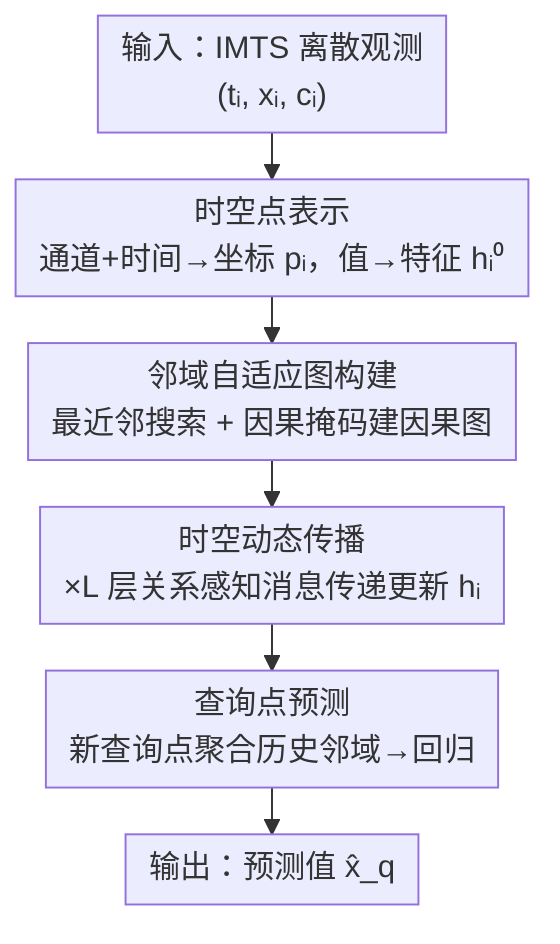

# ASTGI: Adaptive Spatio-Temporal Graph Interactions for Irregular Multivariate Time Series Forecasting

**会议**: ICLR2026  
**OpenReview**: [https://openreview.net/forum?id=Wg9Rx5rjgo](https://openreview.net/forum?id=Wg9Rx5rjgo)  
**代码**: https://github.com/decisionintelligence/ASTGI  
**领域**: 不规则多变量时间序列 / 时序预测 / 图神经网络  
**关键词**: 不规则多变量时间序列, 时空点表示, 自适应因果图, 关系感知传播, 查询点预测

## 一句话总结
ASTGI 把不规则多变量时间序列里的每个离散观测直接编码成一个可学习时空空间里的"点"，不做插值/对齐就保住原始采样结构，再为每个点用最近邻搜索动态建一张因果图、按相对时空位置做关系感知消息传播，最终把预测统一成"给一个查询点聚合邻域信息做回归"，在 4 个公开数据集上 MSE 较次优方法降约 6%。

## 研究背景与动机

**领域现状**：不规则多变量时间序列（IMTS）在 ICU 生命体征监测、气候指标追踪、金融等场景里无处不在。它有两条天生属性：序列内不规则（同一变量在不等时间间隔上被观测）和序列间异步（不同变量的观测时间戳互相错位）。这让为规则时序设计的标准模型很难直接套用。

**现有痛点**：作者把已有方法归到两条路线，每条都有硬伤。第一条是"结构化表示"路线——把不规则数据强行掰成规则格式喂给序列模型：插值法（如 mTAN）凭空生成没真正观测过的点，扭曲了原始采样分布；时间对齐法把所有变量映射到统一时间轴并填空，丢掉了原始观测之间精确的时间间隔信息；patch 对齐法（如 t-PatchGNN）把时间轴切成固定粒度的块，块内聚合会把关键的细粒度动态抹平。第二条是"原始数据"路线——直接对离散观测点建模、避免结构扭曲，但依赖**预定义、非自适应**的交互规则：ODE 类方法（Latent-ODE、NeuralFlows）受马尔可夫假设约束，信息只能在时间相邻状态间流动，抓不到非相邻事件之间的长程依赖；静态图方法用固定启发式规则（同一时间点/同一变量）连边，拓扑对具体数据上下文不敏感，系统状态变化时无法自适应。

**核心矛盾**：两个挑战是递进耦合的——准确表示是有效依赖建模的前提。如果第一步表示就把原始信息扭曲了，后面无论怎么建模动态依赖，都建立在被污染的数据上。而即便表示对了，固定的交互规则也没法**因点制宜**地识别出"对当前这个观测点真正相关"的那批邻居。

**本文目标**：(1) 在不引入数据扭曲的前提下准确表示原始不规则序列；(2) 灵活、动态地捕捉跨时间、跨变量的复杂依赖。

**切入角度**：作者的观察是——既然问题出在"被迫规整化"和"固定交互规则"，那干脆不规整、也不预设全局图结构。把每个观测当作一个时空空间里的点，让"谁和谁交互"完全由点在这个学到的空间里的邻近关系自适应决定。

**核心 idea**：用"为每个观测点动态建一张因果近邻图 + 按相对时空位置做关系感知传播"代替"先规整化再用固定图"，从而既不丢信息又能捕捉上下文相关的动态依赖。

## 方法详解

### 整体框架

一条 IMTS 样本被形式化成一组离散观测 $S=\{(t_i,x_i,c_i)\}_{i=1}^N$，其中 $t_i$ 是时间戳、$x_i$ 是观测值、$c_i\in\{1,\dots,N_C\}$ 是变量索引。给定切分时刻 $t_s$，样本被分成历史集 $S_{hist}$（$t_i\le t_s$）和查询集 $S_{query}$（$t_j> t_s$）；模型 $F$ 吃进历史集和一组查询坐标 $Q=\{(t_j,c_j)\}$，输出对应的预测值 $\hat X_q$。

整个 ASTGI 是端到端可微的，分四个阶段串行：先把每个离散观测编码成时空空间里的点（**时空点表示**）；再为每个点用最近邻搜索 + 因果掩码自适应建一张有向加权因果图（**邻域自适应图构建**）；接着在这些图上堆 $L$ 层消息传播、用相对时空位置算消息和权重来迭代更新点特征（**时空动态传播**）；最后把任意一次预测请求当成一个新的"查询点"，对它的历史邻域做加权融合再回归出值（**查询点预测**）。其中时空坐标 $p_i$ 一旦算出就固定不变，充当稳定的位置锚点，只有特征向量 $h_i$ 在传播中被反复精炼。

### 关键设计

**1. 时空点表示：不插值不对齐，把每个观测原样搬进可学习空间**

针对第一个痛点（规整化引入扭曲），ASTGI 不做任何插值或对齐，而是为每个观测 $(t_i,x_i,c_i)$ 配三个编码器：通道嵌入用可学习矩阵 $E_C\in\mathbb{R}^{N_C\times d_c}$ 把变量索引 $c_i$ 映成 $e_{c_i}$，捕捉变量之间的内在关系；时间编码用 MLP $\Phi_T:\mathbb{R}\to\mathbb{R}^{d_t}$ 把时间戳 $t_i$ 映成 $e_{t_i}$，灵活学复杂时间模式；值编码器用另一个 MLP $\Phi_X$ 把观测值 $x_i$ 映成初始特征 $h_i^{(0)}$。把通道嵌入和时间嵌入拼起来就得到时空坐标

$$p_i = e_{c_i}\oplus e_{t_i}\in\mathbb{R}^{d_c+d_t},$$

它定义了这个观测在学到的 $(d_c+d_t)$ 维空间里的位置。这样原始离散观测集就变成一组时空点 $\{(p_i,h_i^{(0)})\}$。关键在于这里的"空间"维度不是物理地理位置，而是从数据里学出来的抽象维度，专门刻画变量间内在关系；后续建图完全靠点在这个空间里的邻近度自适应定义。它直接保住了每一个原始观测点，从根上避开了插值/对齐那套"造假点、丢间隔"的扭曲。

**2. 邻域自适应图构建：因点制宜地动态建因果图，而非套固定规则**

针对第二个痛点（固定交互规则），ASTGI 不预设全局图，而是为每个点 $i$ 单独建一张有向加权因果图，分两步走。先做候选邻域识别：在学到的时空坐标空间里按欧氏距离 $\|p_i-p_j\|_2$ 选出离 $i$ 最近的 $K$ 个点构成候选集 $C(i)$，再施加**因果掩码**——把时间戳晚于 $t_i$ 的点全剔除，保证信息只能从过去流向未来，得到有效邻居集 $N(i)$。然后做关系感知打分：邻居 $j$ 对 $i$ 的影响由动态计算的交互权重 $a_{ij}$ 量化，由于传播是多层迭代，这个权重在每一层 $l$ 都重算。每层先构造关系向量

$$r_{ij}^{(l)} = (p_i-p_j)\oplus h_i^{(l)}\oplus h_j^{(l)},$$

它把两点的相对位置 $(p_i-p_j)$ 和双方当前特征揉在一起，喂进小网络 $\text{MLP}_{score}$ 得到原始分 $s_{ij}$，再在有效邻居上做 Softmax 归一化：$a_{ij}=\exp(s_{ij})/\sum_{k\in N(i)}\exp(s_{ik})$。和"同一时间点/同一变量"这种固定连边相比，这套机制能随数据上下文动态找出真正相关的邻居。

**3. 时空动态传播：用相对位移调制消息，多层精炼点特征**

在自适应图上堆 $L$ 层传播，每层按"消息—聚合—更新"三步走。消息函数不仅依赖发送方状态 $h_j^{(l)}$，还把时空位移向量 $(p_i-p_j)$ 显式当输入，从而按邻居相对目标点的相对位置去调制要传的信息：$m_{j\to i}^{(l)}=\text{MLP}_{msg}(h_j^{(l)}\oplus(p_i-p_j))$。聚合函数用上面算出的权重对因果邻域做加权求和：$m_i^{(l)}=\sum_{j\in N(i)} a_{ij}\cdot m_{j\to i}^{(l)}$，自适应聚焦到最有信息量的邻居。更新函数用残差连接 + LayerNorm 把自身历史信息和聚合到的邻域信息整合：$h_i^{(l+1)}=\text{LayerNorm}(h_i^{(l)}+\text{MLP}_{update}(m_i^{(l)}))$。值得注意的是图拓扑 $N(i)$ 跨层不变，但权重 $a_{ij}$ 随特征更新每层重算，让模型随表示演化逐步精炼对邻居的关注。$L$ 层后得到每个点的最终表示 $h_i^{(L)}$。

**4. 查询点预测：把"预测"统一成查询点的邻域聚合回归**

ASTGI 把预测任务也纳进同一框架：一个对目标时刻 $t_q$、目标变量 $c_q$ 的预测请求被当成一个查询点，用和历史点相同的编码器映到位置 $p_q=e_{c_q}\oplus\Phi_T(t_q)$，再从所有历史时空点里取 $K$ 个最近邻构成 $N(q)$（因果天然满足，历史点都在查询点之前）。但这里**刻意不复用**传播阶段的打分/消息网络，而是为预测单独设计一套网络——让模型对"多层迭代更新特征"和"最终数值回归"这两个功能不同的子任务各自独立优化。具体地，用专用打分网 $\text{MLP}_{query\_score}$ 算查询点与每个邻居的关联分 $s_{qi}=\text{MLP}_{query\_score}((p_q-p_i)\oplus h_i^{(L)})$，Softmax 归一成权重 $a_{qi}$，再加权融合（融合前先用值网络 $\text{MLP}_{value}$ 抽取对预测最有价值的信息）：

$$h_q=\sum_{i\in N(q)} a_{qi}\cdot \text{MLP}_{value}(h_i^{(L)}).$$

最后把融合向量 $h_q$ 送进回归头 $\Phi_{head}$ 输出预测 $\hat x_q=\Phi_{head}(h_q)$。

### 损失函数 / 训练策略
模型端到端可微，训练时吃历史集 $S_{hist}$、预测查询集 $S_{query}$ 里每个查询坐标的值，联合优化所有参数最小化 MSE：

$$\mathcal{L}=\frac{1}{|S_{query}|}\sum_{(t_j,x_j,c_j)\in S_{query}}(\hat x_j-x_j)^2.$$

用 AdamW 优化，最多训 300 epoch，验证集 5 个 epoch 不提升就早停；每个实验跑 5 个随机种子报均值±标准差。

## 实验关键数据

### 主实验
在 4 个公开 IMTS 数据集（MIMIC、PhysioNet 医疗，Human Activity 生物力学，USHCN 气候）上对比 12 个 SOTA 基线，按 80%/10%/10% 切分，指标为 MSE / MAE。ASTGI 在全部数据集上取得最优，较次优的 Hi-Patch MSE 平均降约 **6.04%**。

| 数据集 | 指标 | ASTGI | 次优 (Hi-Patch) | 说明 |
|--------|------|-------|----------------|------|
| Human Activity | MSE | **0.0412** | 0.0435 | 全场最优 |
| USHCN | MSE | **0.1608** | 0.1749 | 较次优降约 8% |
| PhysioNet | MSE | **0.3004** | 0.3071 | 全场最优 |
| MIMIC | MSE | **0.3909** | 0.4279 | 较次优降约 8.6% |

ASTGI 横跨医疗、生物力学、气候三类领域都稳定领先，体现强泛化性与鲁棒性。

### 消融实验
四组消融（MSE，以 MIMIC 为例）验证各组件必要性：

| 配置 | Human Activity | USHCN | PhysioNet | MIMIC | 说明 |
|------|---------------|-------|-----------|-------|------|
| w/o Learned Coordinates | 0.0421 | 0.1838 | 0.3034 | 0.4057 | 把可学习时间/通道嵌入换成固定非参编码 |
| w/o Adaptive Graph | 0.0421 | 0.1830 | 0.3164 | 0.4065 | 把近邻搜索基准从学到的坐标退回原始时间戳 |
| w/o Relation-Aware | 0.0418 | 0.1930 | 0.3072 | 0.4194 | 算权重/消息时去掉位移向量 $(p_i-p_j)$ |
| rp. Mean Pooling | 0.0870 | 0.1699 | 0.4826 | 0.8807 | 预测阶段加权融合换成简单均值池化 |
| **ASTGI (full)** | **0.0412** | **0.1607** | **0.3004** | **0.3909** | 完整模型 |

### 关键发现
- **预测阶段的加权融合最关键**：换成均值池化后 MIPIC MSE 从 0.39 飙到 0.88、PhysioNet 从 0.30 到 0.48，掉点最猛——说明按时空关系差异化加权邻居信息对预测至关重要。
- **可学习坐标空间 > 固定编码**：换固定编码后明显掉点，说明自适应学到的度量空间对捕捉非线性模式和变量间相关性很关键。
- **自适应图 > 静态时间邻近**：把建图基准从学到的坐标退回原始时间戳后下降，证明在学到的度量空间里找邻居比靠"时间上接近"的固定规则更有效。
- **关系感知（位移向量）不可省**：去掉 $(p_i-p_j)$ 后 MIMIC MSE 升到 0.4194，说明按相对时空位置调制信息对捕捉关系依赖的动态很重要。
- **超参不敏感**：$K$ 一旦超过某阈值性能就稳定，$L$ 用很少几层就够（层数过多反而在复杂数据上有过平滑风险），$d_{model}$/$d_c$ 的最优值与数据集内在复杂度相关。

## 亮点与洞察
- **把"预测"统一成查询点的邻域聚合回归**：历史点和待预测点共用同一套时空点表示与图交互范式，预测不过是"多放一个查询点进来取邻居"，框架高度统一，且天然支持任意时刻、任意变量的查询。
- **坐标固定、特征流动的解耦**：时空坐标 $p_i$ 当稳定锚点不变，只迭代精炼特征 $h_i$——既保住了"谁在哪"的位置先验，又让"它现在表达什么"能随传播演化，是这套设计能多层不塌的关键。
- **拓扑固定、权重每层重算**：图结构 $N(i)$ 一次建好不变，但交互权重随特征更新逐层重算，相当于在固定候选集上做"动态注意力"，兼顾效率与适应性。
- **传播网络与预测网络刻意分离**：让"迭代更新特征"和"最终数值回归"两个功能不同的子任务各自优化，这个解耦思路可迁移到其他"先表示后回归/分类"的图任务。

## 局限与展望
- **可学习时空空间的可解释性弱**：抽象空间维度刻画的"变量内在关系"难直观解释，邻居为何被选中缺乏可视化/诊断手段。
- **$K$ 近邻 + 因果掩码的开销**：每个点都要在全部历史点里做最近邻搜索，超大规模或超长序列下的计算/内存代价、以及全局 KNN 的可扩展性论文未深入讨论。
- **层数与过平滑的张力**：作者自己也指出复杂数据上 $L$ 过大有过平滑风险，深层依赖捕捉与过平滑之间仍需小心权衡。
- 评测集中在 4 个标准 IMTS benchmark，更长程预测、在线/流式场景下的表现有待验证。

## 相关工作与启发
- **vs 结构化表示路线（mTAN 插值 / 时间对齐 / t-PatchGNN patch）**: 他们先把不规则数据规整成规则格式再用序列模型，代价是插值造假点、对齐丢间隔、patch 抹平细粒度动态；ASTGI 直接表示每个离散观测、零结构变换，从根上避免信息扭曲。
- **vs ODE 类（Latent-ODE / NeuralFlows）**: 它们把时序当连续动力系统、受马尔可夫假设约束只能在时间相邻状态间交互，抓不到非相邻长程依赖；ASTGI 在学到的空间里直接连任意近邻，能跨时间跨变量直连。
- **vs 静态图方法（GraFITi / t-PatchGNN 等）**: 它们按"同一时间点/同一变量"等固定启发式连边，拓扑对上下文不敏感；ASTGI 为每个点动态建因果图、按相对时空位置做关系感知打分，能因点制宜地识别真正相关的邻居。

## 评分
- 新颖性: ⭐⭐⭐⭐ "把每个观测当时空点 + 逐点自适应建因果图"的范式干净且有说服力，但近邻图 + 关系感知打分在图学习里有渊源。
- 实验充分度: ⭐⭐⭐⭐ 4 数据集跨 3 领域、12 基线、5 种子、4 组消融 + 超参敏感性，较扎实；缺更长程/流式场景与效率分析。
- 写作质量: ⭐⭐⭐⭐ 两挑战—四模块的逻辑清晰，公式与图示对照到位。
- 价值: ⭐⭐⭐⭐ 为 IMTSF 提供了一条"不规整化也能建模动态依赖"的可复用范式，代码与数据开源。

<!-- RELATED:START -->

## 相关论文

- [\[AAAI 2026\] Revitalizing Canonical Pre-Alignment for Irregular Multivariate Time Series Forecasting](../../AAAI2026/time_series/revitalizing_canonical_pre-alignment_for_irregular_multivariate_time_series_fore.md)
- [\[ICLR 2026\] Learning Recursive Multi-Scale Representations for Irregular Multivariate Time Series Forecasting](learning_recursive_multi-scale_representations_for_irregular_multivariate_time_s.md)
- [\[ICML 2026\] Nested Spatio-Temporal Time Series Forecasting](../../ICML2026/time_series/nested_spatio-temporal_time_series_forecasting.md)
- [\[ICML 2026\] Latent Laplace Diffusion for Irregular Multivariate Time Series](../../ICML2026/time_series/latent_laplace_diffusion_for_irregular_multivariate_time_series.md)
- [\[ICLR 2026\] GARLIC: Graph Attention-based Relational Learning of Multivariate Time Series in Intensive Care](garlic_graph_attention-based_relational_learning_of_multivariate_time_series_in_.md)

<!-- RELATED:END -->
