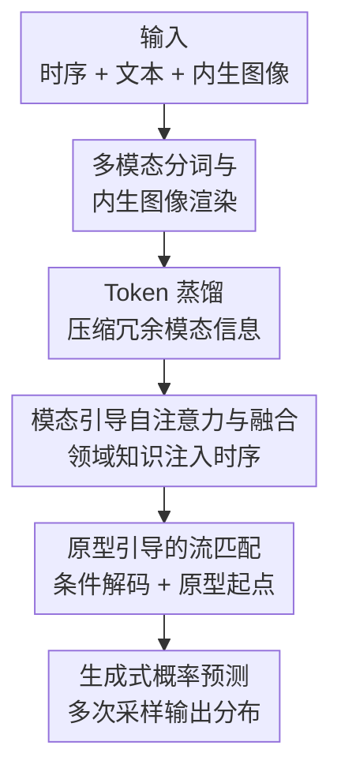

# Aurora: Towards Universal Generative Multimodal Time Series Forecasting

**会议**: ICLR2026  
**OpenReview**: [https://openreview.net/forum?id=VVJ6Ck9JBl](https://openreview.net/forum?id=VVJ6Ck9JBl)  
**代码**: https://github.com/decisionintelligence/Aurora ；权重 https://huggingface.co/DecisionIntelligence/Aurora  
**领域**: 时间序列预测 / 多模态基础模型  
**关键词**: 时间序列预测, 多模态基础模型, 流匹配, 零样本预测, 跨域泛化

## 一句话总结
Aurora 是第一个**多模态时间序列基础模型**：在「时间序列 + 文本描述 + 内生图像」三模态的跨域语料上预训练，用模态引导注意力把文本/图像里的领域知识注入时序建模，再用「原型引导的流匹配」做生成式概率预测，从而在零样本/少样本的跨域场景下同时拿下确定性和概率性预测 SOTA。

## 研究背景与动机
**领域现状**：时间序列预测最近有两条主线。一条是**单模态时序基础模型**（Sundial、Time-MoE、MOIRAI、Chronos、VisionTS 等），在十亿/万亿规模的纯时序语料上预训练，靠对历史信号细微差异的敏感度获得一定的跨域零样本能力；另一条是**端到端多模态监督模型**（Time-LLM、CALF、GPT4MTS、TATS 等），借大语言模型把文本里的领域知识喂进时序建模，提升特定领域的预测精度。

**现有痛点**：两条线各缺一块。单模态基础模型只有「时间」这一个模态，**没有显式的领域知识引导**——当两段历史曲线长得很像时，它给出的未来几乎是静态的、一样的，无法区分「洛杉矶高速的早晚高峰」和「芝加哥被北极寒潮突袭的气温骤降」这种同形不同因的情形。端到端多模态模型虽然用上了文本，但**是为端到端监督场景定制的，不支持零样本跨域推理**——换个领域就得重训。

**核心矛盾**：跨域泛化的根本难点在于「相似的历史可能因为领域差异导向完全不同的未来」。单模态模型缺的是**显式领域知识**，多模态监督模型缺的是**零样本的开箱即用能力**，两者无法兼得。

**本文目标**：造一个既能吃多模态领域知识、又能零样本跨域开箱即用的时序基础模型，并且输出概率分布而非单点。

**切入角度**：领域知识恰恰藏在「时间」之外的模态里——未来趋势往往写在**文本**描述里（如某公司宣布合作、某地遭遇寒潮），而序列固有的周期性可以从**内生图像**（把时序渲染成 2D 图）的几何结构里读出来。把这两类外部知识当作「引导」注入时序建模，就能在历史相似时仍区分出不同的未来。

**核心 idea**：预训练一个跨模态编码器从文本/图像里蒸馏领域知识、用模态引导注意力注入时序表征；解码端不再从高斯噪声起步，而是用领域知识检索出含周期/趋势雏形的「未来原型」作为流匹配起点，从而做生成式概率预测。

## 方法详解

### 整体框架
Aurora 对每个变量做通道独立（Channel-Independence）建模，整条管线分编码器和解码器两大阶段。**编码器**先把时序、文本、内生图像三模态各自分词，用 Token 蒸馏把文本/图像里冗余的信息压成少量关键 token，再用模态引导多头自注意力把这些领域知识转成一个相关性矩阵注入时序自注意力、最后融合三模态得到统一表征。**解码器**先用条件解码器把融合表征展开成 $F$ 个未来 token 的条件，再用原型引导的流匹配——从 Prototype Bank 检索出带周期/趋势雏形的未来原型作起点——做生成式概率预测。整条流程预训练时对文本做随机 mask，从而推理时即便没有文本也能退化成单模态预测（内生图像总能从原始序列算出来）。

### 关键设计

**1. 多模态分词与内生图像渲染：把时序的周期性变成一张图**

痛点是单模态模型读不到序列固有的周期几何，文本模型又只会用文字。Aurora 把三模态统一成 token：时序用 RevIN 去非平稳后做不重叠 Patching + 线性 Embedding 得到 $X_{time}\in\mathbb{R}^{n_{time}\times d_{time}}$；文本直接走 Bert 词表得到 $X_{text}$。最巧的是**内生图像**：先对序列做 FFT 取幅值最大的频率得到主周期 $P$（$A=\mathrm{Amp}(\mathrm{FFT}(X)),\ F=\arg\max(A),\ P=\lceil T/F\rceil$），按 $P$ 把一维序列折叠成 2D 矩阵 $X_{2D}\in\mathbb{R}^{m\times P}$，再沿通道维复制、resize 成 ViT 标准输入尺寸渲染成 $X_{3D}\in\mathbb{R}^{3\times w\times h}$，最后 ImagePatching + Embedding 成图像 token。这样「周期对齐」后的相邻列在图像里是同相位的，ViT 的二维归纳偏置就能把周期性当几何结构读出来——这是把时序周期信息显式喂给模型的一种零额外标注手段。

**2. Token 蒸馏：把冗余的文本/图像 token 压成几个语义中心**

文本里真正影响未来趋势的往往只有几个词，内生图像里的周期信息也很稀疏，直接拿 Bert/ViT 的全部 token 既冗余又慢。Aurora 用 VisionDistiller / TextDistiller（基于多头交叉注意力）做蒸馏：引入一组**可学习向量** $R_{image}\in\mathbb{R}^{K_{image}\times d_{image}}$、$R_{text}\in\mathbb{R}^{K_{text}\times d_{text}}$ 当 query，把编码器输出 $\tilde{X}_{image}$、$\tilde{X}_{text}$ 当 key/value，得到压缩后的 $X_{image}\in\mathbb{R}^{K_{image}\times d_{image}}$、$X_{text}\in\mathbb{R}^{K_{text}\times d_{text}}$（$K<n$）。这些可学习 query 类似**语义聚类中心**，把分散的模态信息汇聚成少量关键 token，既抓住领域知识又降了后续注意力的开销。

**3. 模态引导多头自注意力：用领域知识改写时序注意力**

有了蒸馏后的领域 token，怎么让它真正影响时序建模？Aurora 没有简单拼接，而是让外部模态去**调制时序内部的注意力分布**。先用基于交叉注意力的 VisionGuider / TextGuider 算出时序对图像、文本的（未归一化）注意力分数 $V_{Attn}\in\mathbb{R}^{n_{time}\times K_{image}}$、$T_{Attn}\in\mathbb{R}^{n_{time}\times K_{text}}$，再合成一个时序内部的相关性矩阵：

$$\mathrm{Corr}=V_{Attn}\cdot W\cdot T_{Attn}^{\top}\in\mathbb{R}^{n_{time}\times n_{time}}$$

其中 $W\in\mathbb{R}^{K_{image}\times K_{text}}$ 是可学习的度量矩阵，用来微调图像/文本语义之间的距离。这个 $\mathrm{Corr}$ 携带领域知识，被直接**加进**时序自注意力的打分里：$S=(QK^{\top}+\mathrm{Corr})/\sqrt{d_{time}},\ O=\mathrm{Softmax}(S)\cdot V$，再过残差 LayerNorm 和 FFN 得到 $X_{time}$。最后用交叉注意力的 Modality Fuser 把三模态融成 $X_{fuse}=X_{time}+\tilde{X}_{image}+\tilde{X}_{text}$。本质上是让「文本/图像里的领域知识」决定时序的哪些 token 该互相关注，从而在历史相似时给出不同的注意力结构。

**4. 原型引导的流匹配：把生成起点从高斯噪声换成「未来原型」**

解码端要做生成式概率预测。Aurora 先用受 DiT 启发的 ConditionDecoder（Causal-Transformer 把 $X_{fuse}$ 末 token 复制 $F$ 份生成因果条件，Cross-Transformer 配 RoPE 以 $X_{fuse}$ 为 key/value 精炼）得到 $F$ 个未来条件 $X_{cond}$。关键创新在流匹配的**起点**：DDPM/已有流匹配方法都从标准高斯噪声出发，浪费了流匹配本可作为「随机插值器」从任意分布起步的灵活性。Aurora 设计 **Prototype Bank** $P\in\mathbb{R}^{M\times p_{time}}$，里面是 $M$ 个可学习的周期/趋势原型，用三角、指数、对数、多项式基初始化；再用 Transformer 结构的 **PrototypeRetriever** 读入文本/图像表征和未来 token 的正弦位置编码，输出对 $M$ 个原型的 softmax 权重 $D\in\mathbb{R}^{F\times M}$，加权得到未来原型 $\tilde{P}=D\cdot P$——它已经含有未来周期与趋势的雏形。流匹配以 $y_i^{(0)}=\tilde{P}_i+\epsilon_i$ 为起点（$\epsilon_i\sim\mathcal{N}(0,I)$ 注入随机性以支持概率预测）、真值 $y_i^{(1)}=y_i$ 为终点，训练 MLP 速度场网络 $v_\theta^t$（用 AdaLN 注入条件 $h_i=X_{cond}_i$），采用能量最优的条件最优传输路径，目标为：

$$\mathcal{L}(\theta,h_i)=\mathbb{E}_{t,y_i^{(0)},y_i^{(1)}}\big\|v_\theta^t(y_i^{(t)}|h_i)-(y_i^{(1)}-y_i^{(0)})\big\|^2$$

其中 $y_i^{(t)}=t\,y_i^{(1)}+(1-t)\,y_i^{(0)}$。推理时按 Algorithm 1 离散积分 $J$ 步从原型推到预测；因起点已含周期/趋势雏形，流匹配只需「补差」而非从纯噪声重建，过程更稳更短。

### 损失函数 / 训练策略
- **预训练目标**：上式 token-wise 流匹配回归损失（速度场 L2）。
- **跨域多模态语料**：收集大量开源时序数据集，用大模型为每条样本生成领域特定的文本描述，模拟下游多模态场景；内生图像由原始序列渲染。
- **随机 mask 文本**：预训练时随机遮蔽文本模态，使模型在文本缺失时也能退化为单模态预测（图像始终可得），这是它支持单模态零样本的关键。
- **基础组件**：模态编码器用预训练 Bert（文本）、ViT（图像），时序主干为通道独立 Transformer，输入先过 Instance Normalization / RevIN。

## 实验关键数据

### 主实验
在 5 个公认基准（TimeMMD、TSFM-Bench、ProbTS、TFB、EPF）上评测，覆盖单模态/多模态、确定性/概率性四类场景，基准数据集严格排除在预训练语料外。

| 场景 | 基准 | 指标 | Aurora vs SOTA | 提升 |
|------|------|------|----------------|------|
| 多模态零样本 | TimeMMD | MSE | vs Sundial / VisionTS | ↓27.0% / ↓31.2% |
| 多模态 10% 少样本 | TimeMMD | MSE | vs GPT4MTS / CALF（全量监督） | ↓12.8% / ↓24.5% |
| 单模态零样本（确定性） | TSFM-Bench | MSE | vs Time-MoE / ROSE | ↓15.1% / ↓22.9% |
| 单模态零样本（概率性） | ProbTS | CRPS | vs CSDI / MOIRAI | ↓21.5% / ↓38.3% |

在 TimeMMD 多模态零样本表（Table 1）里，Aurora 在 10 个领域上取得 MSE 31 个、MAE 26 个第一（10 领域×多设置），远超 Sundial（4/7）、VisionTS（0/4）。尤其在 Economy 上 MSE 0.033 vs Sundial 0.291，差距悬殊；在 Climate、Environment 等领域，Aurora 的**零样本**结果甚至打过全量监督的多模态 baseline。

### 消融实验
Table 5 在 TimeMMD 9 个领域上做模块消融（MSE）：

| 配置 | Economy | Climate | Traffic | 说明 |
|------|---------|---------|---------|------|
| Aurora（完整） | 0.033 | 0.865 | 0.161 | 全模型 |
| Variant 1：w/o 模态引导自注意力 | 0.277 | 1.176 | 0.244 | 退回普通 MSA，领域知识不再注入 |
| Variant 2：w/o 原型引导流匹配 | 0.045 | 1.008 | 0.273 | 起点退回标准高斯噪声 |
| Variant 3：w/o 两者 | 0.296 | 1.447 | 0.335 | 同时去掉，性能崩塌 |

### 关键发现
- **模态引导自注意力是跨域泛化主力**：去掉它（Variant 1）后 Economy MSE 从 0.033 暴涨到 0.277，因为模型失去了用文本/图像领域知识区分「同形不同因」历史的能力。
- **原型起点对周期主导的领域增益更大**：去掉原型（Variant 2）后 Traffic、Social Good 等强周期领域掉点明显（Traffic 0.161→0.273）。
- **级联效应**：两者都去掉（Variant 3）时性能「崩塌」，掉幅大于单去其一之和，说明领域知识注入与原型起点是协同的——好的条件需要好的起点配合。
- **采样可扩展性**：增加采样次数后 CRPS 从 0.628 单调降到 0.166、NMAE 从 0.292 降到 0.187，生成式概率头能用更多采样换更准的分布估计。

## 亮点与洞察
- **内生图像渲染把"周期"变成 ViT 能读的几何**：先 FFT 找主周期再按周期折叠成 2D 图，让二维视觉骨干的归纳偏置直接服务于时序周期建模——一种零额外标注、即插即用的模态扩充思路，可迁移到任何想给时序加视觉先验的任务。
- **领域知识不是拼接而是"调温度"**：把文本/图像注意力压成一个 $\mathrm{Corr}$ 矩阵加进时序自注意力打分，而非简单 concat，让外部知识改写的是「时序 token 之间该怎么互相关注」，这比特征拼接更贴近"领域知识影响动态结构"的直觉。
- **流匹配起点的"先验注入"**：用可学习原型库 + 检索器构造含周期/趋势雏形的起点，把流匹配从"纯噪声重建"降级为"补差"，既稳又省步数。这个「换起点」的思路对任何条件生成（不限时序）都有启发——好的初始分布能显著简化生成路径。
- **随机 mask 文本换来单模态鲁棒**：一个训练 trick 就让同一个模型同时覆盖多模态和单模态、确定性和概率四类场景，工程上很实用。

## 局限与展望
- **文本质量依赖大模型生成**：跨域语料的样本级文本描述由 LLM 合成，下游真实文本的分布/噪声可能与训练时不一致，文本质量直接影响领域知识注入效果，论文未充分讨论文本噪声的鲁棒性。
- **内生图像的周期假设**：FFT 取单一主周期再折叠的渲染方式，对多周期叠加或近乎无周期（强趋势/噪声主导）的序列，图像几何能提供的信息有限。
- **生成式概率头的推理成本**：流匹配需多步积分 + 多次采样才能得到稳定分布，虽然原型起点缩短了步数，但相比单点回归模型仍更重，实时高频场景需权衡。
- **可改进方向**：把内生图像从单周期扩到多频段渲染、把原型库做成可随领域增量扩展、用检索增强的真实文本替代合成文本，都是自然的延伸。

## 相关工作与启发
- **vs 单模态时序基础模型（Sundial / Time-MoE / VisionTS）**：它们只有时间模态，历史相似时预测趋于静态；Aurora 引入文本/图像领域知识做显式引导，能在同形历史上给出不同未来。VisionTS 也用图像，但只把时序当图、缺文本领域知识，Aurora 把图像当作周期先验、再叠加文本趋势先验。
- **vs 端到端多模态监督模型（Time-LLM / CALF / GPT4MTS / TATS）**：它们靠 LLM 融文本提升特定领域精度，但为端到端定制、不支持零样本跨域；Aurora 走基础模型路线，预训练 + 零样本/少样本即可开箱用，10% 少样本就超过这些全量监督模型。
- **vs 基于 DDPM 的概率预测（CSDI / TSDiff / TimeGrad）**：它们从固定高斯噪声出发做 SDE 式去噪；Aurora 用流匹配作随机插值器、并把起点换成领域知识检索出的原型，起点更有信息、路径更短更稳，ProbTS 上 CRPS 大幅领先。

## 评分
- 新颖性: ⭐⭐⭐⭐⭐ 首个多模态时序基础模型，「内生图像周期渲染 + 模态引导注意力 + 原型引导流匹配」三处都是有针对性的原创设计。
- 实验充分度: ⭐⭐⭐⭐⭐ 5 大基准、单/多模态 × 确定/概率四类场景全覆盖，消融清晰证明各模块协同。
- 写作质量: ⭐⭐⭐⭐ 方法叙述完整、图示到位，但符号密集、部分模块（条件解码器细节）略简。
- 价值: ⭐⭐⭐⭐⭐ 开源模型+权重，零样本开箱即用且覆盖概率预测，对决策智能场景实用性强。

<!-- RELATED:START -->

## 相关论文

- [\[AAAI 2026\] GAICo: A Deployed and Extensible Framework for Evaluating Diverse and Multimodal Generative AI Outputs](../../AAAI2026/time_series/gaico_a_deployed_and_extensible_framework_for_evaluating_diverse_and_multimodal_.md)
- [\[ICLR 2026\] Characteristic Root Analysis and Regularization for Linear Time Series Forecasting](characteristic_root_analysis_and_regularization_for_linear_time_series_forecasti.md)
- [\[ICLR 2026\] Towards Multimodal Time Series Anomaly Detection with Semantic Alignment and Condensed Interaction](towards_multimodal_time_series_anomaly_detection_with_semantic_alignment_and_con.md)
- [\[ICLR 2026\] Bridging Past and Future: Distribution-Aware Alignment for Time Series Forecasting](bridging_past_and_future_distribution-aware_alignment_for_time_series_forecastin.md)
- [\[ICLR 2026\] Long-range Modeling and Processing of Multimodal Event Sequences](long-range_modeling_and_processing_of_multimodal_event_sequences.md)

<!-- RELATED:END -->
