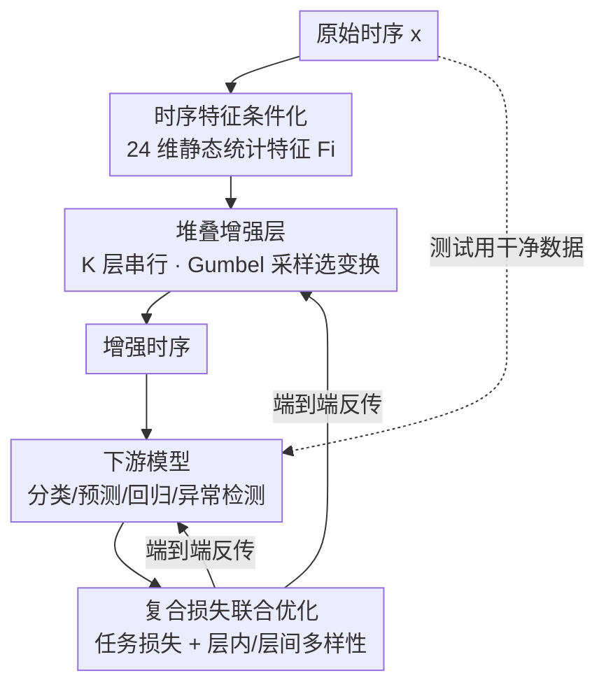

# AutoDA-Timeseries: Automated Data Augmentation for Time Series

**会议**: ICLR2026  
**OpenReview**: [https://openreview.net/forum?id=vTLmHAkoIW](https://openreview.net/forum?id=vTLmHAkoIW)  
**代码**: https://github.com/NetManAIOps/AutoDA-Timeseries  
**领域**: 时序分析 / 自动数据增强  
**关键词**: 自动数据增强, 时间序列, 可微策略搜索, Gumbel-Softmax, 端到端联合优化

## 一句话总结
AutoDA-Timeseries 是首个面向时间序列的通用自动数据增强（AutoDA）框架：它把每条时序的统计特征喂给一个可学习的策略生成器，由堆叠的增强层逐层用 Gumbel-Softmax 可微地挑选变换类型并自适应调节其概率与强度，与下游模型一起单阶段端到端联合优化，在分类、长/短期预测、回归、异常检测五大任务上稳定超越现有强基线。

## 研究背景与动机

**领域现状**：时间序列因为样本稀缺、同质性强，几乎所有深度模型都依赖数据增强。目前用增强的方式分两大范式——一是**表征学习**（如 TS2Vec、InfoTS），用增强构造对比视图、预训练一个与任务无关的编码器，再迁移到下游；二是**自动数据增强（AutoDA）**，直接以下游任务性能为目标去搜索/生成增强策略。

**现有痛点**：表征学习是**两阶段、解耦**的——第一阶段的增强和编码器只为对比目标服务，感知不到第二阶段下游模型的反馈。当下游模型本身不是为吸收对比表征而设计时（比如 RNN 天生擅长序列到序列预测、而非捕捉对比学习强调的不变表征），学到的表征往往和下游架构对不上，实际收益受限。而 AutoDA 这条路虽然是单阶段、能直接对齐下游目标，却**几乎都是为图像设计的**，搬到时序上有三个硬伤：(1) 大多只在单一任务上验证、跨任务泛化性存疑；(2) 完全忽略时序特有属性（自相关、分布、高阶特征），把"变换保持语义有效"这种图像假设直接套到时序上，盲目做频率扭曲等变换会破坏时间依赖、反而掉点；(3) 像 RandAugment/TrivialAugment 这些 SOTA 用**均匀采样**决定变换类型和强度，把所有变换一视同仁，没考虑不同变换/强度对时序数据的贡献差异巨大。

**核心矛盾**：要么有了单阶段、对齐下游的好框架（AutoDA）却不懂时序，要么懂时序却被困在解耦的两阶段（表征学习）。两者都缺少一个"既感知时序特征、又自适应地为每条序列定制增强强度与概率"的统一机制。

**本文目标**：造一个通用、单阶段、端到端的时序 AutoDA 框架，要能 (a) 把时序特征纳入策略设计，(b) 同时自适应优化变换的**选择概率**和**强度**，(c) 在五类主流任务上都通用。

**切入角度**：作者观察到——增强策略的好坏由时序特征（自相关等）支配，所以策略生成应当**以时序特征为条件**；而图像 AutoDA 的均匀采样恰恰丢掉了这个条件信息。

**核心 idea**：用一个"以时序统计特征为条件、逐层可微地选变换并调强度"的增强生成器，替换掉图像 AutoDA 里的均匀采样，并和下游模型用一套复合损失联合训练。

## 方法详解

### 整体框架

把数据集记为 $D=\{D_1,\dots,D_m\}$，下游模型 $M$（参数 $\theta_M$），可用变换集合 $\mathcal{T}=\{T_1,\dots,T_n\}$（如 Jittering、Scaling、TimeWarp、FreqWarp、MagWarp、Slice、Resample、Raw 等）。目标是学一个增强框架 $A_\theta$，为每条序列 $D_i$ 输出策略 $P_i=A_\theta(D_i)$，它含两个向量：选择概率 $p_i$（$p_{i,j}\in[0,1]$ 是选中 $T_j$ 的概率）和强度 $t_i$（$t_{i,j}\ge 0$ 是 $T_j$ 的强度）。整个流程是一个**双层联合优化**：内层在增强后的数据上训下游模型 $\theta_M^*=\arg\min_{\theta_M}\mathcal{L}(\theta_M, A_\theta(D))$，外层让增强框架的参数 $\theta$ 使得训出来的模型在**原始数据**上表现最好 $\theta^*=\arg\min_\theta \mathcal{L}(\theta_M^*, D)$——注意评测在干净的真实数据上，增强只在训练时介入。

具体地，原始时序先经特征提取器得到一个 24 维静态统计特征向量 $F_i$，再送入自适应策略生成器；生成器由 $K$ 个串行的增强层堆叠而成，每层基于特征和上一层概率生成本层的概率与强度，用 Gumbel-Softmax 采样出一个变换并施加；最后一层输出的增强序列喂给下游模型，由一个复合损失把"增强生成器 + 下游模型"一起反向传播更新。

### 关键设计

**1. 时序特征条件化的策略生成：让"选哪个变换、用多强"由时序属性决定**

这针对的是图像 AutoDA"无视时序特征、均匀采样"的硬伤。作者沿用 Qiu et al. (2024) 的做法，为每条序列抽取 24 个描述性统计量（捕捉自相关、分布、高阶特征等，与 catch22 一脉相承）构成特征向量 $F_i=f_e(D_i)$。关键在于 $F_i$ 在所有增强层里**保持静态不变**：因为后续是逐层做串行变换、序列会不断被改写，如果特征也跟着变就会丢掉原始序列的全局上下文、放大失真并让训练不稳；保持静态则相当于始终用"这条序列本来长什么样"去指导每一层的决策。每个增强层的概率与强度都由这个特征向量条件化地生成（见设计 2 的 MLP），这就把"频率扭曲会不会破坏这条序列的自相关"这类判断显式地交给了数据特征，而不是一刀切。

**2. 堆叠增强层与 Gumbel-Softmax 可微采样：把离散的"选变换"做成可端到端训练的**

整个生成器是 $K$ 个增强层的复合 $A_\theta=A^{(1)}_{\theta_1}\circ A^{(2)}_{\theta_2}\circ\cdots\circ A^{(K)}_{\theta_K}$。第 $k$ 层接收上一层输出的序列 $D^{(k-1)}_i$、上一层概率向量 $p^{(k-1)}_i$（首层初始化为 0）和全局特征 $F_i$，用两个 MLP 分别生成本层概率和强度：$p^{(k)}_i=f^{(k)}_p(p^{(k-1)}_i, F_i)$，$t^{(k)}_i=f^{(k)}_t(p^{(k-1)}_i, F_i)$。难点在于"挑一个变换"本质是离散选择、不可导。作者用 Gumbel-Softmax $\sigma_{gs}$ 近似采样：$T_{r_k}=\sigma_{gs}(\mathcal{T}, p^{(k)}_i)$，再以强度 $t^{(k)}_{i,r_k}$ 施加得到 $D^{(k)}_i=T_{r_k}(D^{(k-1)}_i, t^{(k)}_{i,r_k})$。这样选择过程保持可微，整条增强链路的所有层参数都能和下游模型一起被梯度更新。堆叠多层的意义是探索更丰富的"变换序列"组合（先 jitter 再 timewarp 等），产生比单变换更多样、更有用的增强数据。

**3. 复合损失下的端到端联合优化：用可学习权重平衡"任务性能"和"增强多样性"**

只优化任务损失会让生成器塌缩到少数变换、丧失多样性。作者在任务损失之外加了两项多样性正则，并借鉴 Liebel & Körner (2018) 用**可学习权重**自动配平多任务，得到复合损失：

$$\mathcal{L}_{composite}=\sum_{z=1,2,3}\left(\frac{1}{2w_z^2}\mathcal{L}_z+\ln(1+w_z^2)\right)$$

其中 $\mathcal{L}_1$ 是任务损失（预测用 MSE、分类用交叉熵等）；$\mathcal{L}_2$ 是**层内多样性损失**，用每层概率向量的香农熵 $H(p^{(k)}_i)=-\sum_{j=1}^n p^{(k)}_{i,j}\log(p^{(k)}_{i,j}+\epsilon)$（$\epsilon=10^{-10}$ 防数值溢出）在样本上取期望、对 $K$ 层求和，鼓励单层内变换概率不要塌缩到一个；$\mathcal{L}_3$ 是**层间多样性损失**，用相邻层概率分布的 KL 散度 $\sum_{k=2}^K \mathbb{E}_i[\mathrm{KL}(p^{(k-1)}_i\Vert p^{(k)}_i)]$ 度量层与层之间的差异，避免各层学成同一套策略。$w_z^2$ 是可学习权重，训练中自动在"多样性"和"任务性能"之间找平衡——这比手工调三个损失权重省心，也是它能跨五类任务通用的关键之一。

**4. 探索-利用平衡：可学习温度 + Raw 偏置**

光有多样性正则还不够，作者再加两个机制控制采样的"探索-利用"节奏。其一是**可学习的 Gumbel-Softmax 温度**：每个增强层各自维护一个温度参数、纯靠反向传播优化；温度高时选择概率更均匀（鼓励探索不同变换），温度逐渐降低则更确定（收敛到最有希望的变换）。实验可视化（Figure 5）显示底层会快速收敛到少数算子（如 Raw，体现确定性利用），高层则保持高熵、维持多样（体现探索），形成稳定与多样互补的层级分工。其二是 **Raw 偏置**：以概率 $p_{rb}$ 直接选用原始数据不做任何变换——

$$T_{r_k}=\begin{cases}\sigma_{gs}(\mathcal{T}, p^{(k)}_i) & \text{以概率 }(1-p_{rb})\\ T_1\,(\text{Raw}) & \text{以概率 }p_{rb}\end{cases}$$

这相当于给训练注入一定比例的真实样本，防止下游模型过拟合到被增强过度改写的合成分布上。

### 损失函数 / 训练策略
训练用上面的复合损失 $\mathcal{L}_{composite}$ 同时更新增强生成器和下游模型，整体单阶段、端到端；多样性权重 $w_z$、各层 Gumbel-Softmax 温度均为可学习参数；测试阶段关闭增强、在原始真实数据上评测。

## 实验关键数据

五大任务：分类（UEA 26 子集）、长期预测（ETT/Exchange/Weather）、短期预测（M4 六子集）、回归（UEA & UCR 六子集）、异常检测（MSL/SMAP/SMD）。每个任务都换两类下游模型验证泛化性（如分类用 TCN 与 ROCKET，预测用 RNN 与 Autoformer）。

### 主实验

| 任务 | 下游模型 | 指标 | NoAug | 之前最优基线 | 本文 |
|------|----------|------|-------|--------------|------|
| 分类 | TCN | Accuracy↑ | 0.685 | A2Aug 0.709 | **0.730** (+6.7%) |
| 分类 | ROCKET | Accuracy↑ | 0.686 | A2Aug 0.704 | **0.721** (+5.2%) |
| 长期预测 | RNN | MSE↓ | 0.5408 | Uniform. 0.4416 | **0.3968** |
| 长期预测 | Autoformer | MSE↓ | 2.4274 | A2Aug 2.0155 | **1.9098** |
| 短期预测 | RNN | SMAPE↓ | 11.384 | Trivial. 11.482 | **11.068** |
| 回归 | MLP | MSE↓ | 1.2937 | A2Aug 1.2157 | **1.0350** |
| 异常检测 | UNet | F1↑ | 0.6991 | Uniform. 0.7171 | **0.7478** |
| 异常检测 | VAE | F1↑ | 0.5592 | Rand. 0.5610 | **0.5761** |

雷达图（Figure 3）显示 AutoDA-Timeseries 在五个任务上覆盖面积最大，是唯一在所有任务上都拿到最优的方法。

### 对比基线的关键发现

| 现象 | 数据 | 说明 |
|------|------|------|
| 图像 AutoDA 直接搬到时序失效 | RandAugment/Uniform/Trivial 在分类上多为负增益 | 印证"忽略时序特征"的代价 |
| 表征学习不稳定 | TS2Vec 分类 TCN 0.584 (−14.8%)、ROCKET 0.590 (−14.0%) | 两阶段解耦、与下游架构不匹配时严重掉点 |
| RNN 比 Autoformer 更吃亏 | 表征学习在 RNN 上相对退化更大 | Autoformer 更能吸收学到的表征 |

### 关键发现
- **特征条件化是有效性的根源**：catch22 特征空间一致性分析（Figure 6）显示增强后数据的 catch22 特征与原始数据高度一致，说明框架在增强时保住了时序本质属性——这直接支撑了"以时序特征为条件"的动机。
- **层级分工自然涌现**：底层快速收敛（确定性利用）、高层保持高熵（探索），可学习温度让这种稳定-多样的互补无需手工设定。
- **越敏感的任务越能体现优势**：回归和异常检测对增强质量极敏感（不当变换会抹掉或伪造异常），而本文在这两类任务上仍稳定领先，说明自适应策略确实提升了鲁棒性。

## 亮点与洞察
- **把"时序特征"显式提升为增强策略的条件变量**：这是和图像 AutoDA 最本质的区别——用 24 维统计特征驱动 MLP 决定概率与强度，且特征静态不变以锚住全局上下文，思路干净且可迁移到其他需要"按数据属性定制操作"的场景。
- **离散增强选择的可微化**：Gumbel-Softmax + 堆叠层把"选变换序列"这件离散的事变成端到端可训练，避免了 AutoAugment 式代理模型的高成本与代理-下游不匹配问题。
- **可学习权重的复合损失**：用 $\frac{1}{2w^2}\mathcal{L}+\ln(1+w^2)$ 自动配平任务损失与层内/层间多样性，省去手工调权重，是它能"一套框架打五类任务"的工程关键。
- **Raw 偏置这个小设计很务实**：以一定概率回退原始数据，简单却有效地缓解了对合成分布的过拟合。

## 局限与展望
- **作者承认**：未来要扩展到真实世界时序应用，这些场景往往跨域、动态更复杂——暗示当前主要在标准 benchmark 上验证。
- **自己发现**：(1) 变换集合 $\mathcal{T}$ 仍是预定义的固定算子库，框架学的是"怎么组合"，而非发明新变换；(2) 堆叠层数 $K$、Raw 偏置概率 $p_{rb}$ 等是超参，论文正文未给跨任务的敏感性分析；(3) 多层串行 + Gumbel 采样 + 复合损失带来额外训练开销，论文未量化与简单随机增强的效率差距；(4) $\mathcal{L}_2$ 用熵作"多样性损失"在最小化框架下的符号方向需以原文实现为准（⚠️ 以原文/代码为准）。

## 相关工作与启发
- **vs 表征学习（TS2Vec / InfoTS / AutoTCL）**：它们两阶段、增强只服务对比目标、感知不到下游反馈；本文单阶段端到端，增强直接对齐下游任务损失，避开了"表征与下游架构不匹配"的失配问题。
- **vs 图像 AutoDA（RandAugment / TrivialAugment / UniformAugment / A2Aug）**：它们均匀采样、无视模态特征；本文以时序统计特征为条件、自适应调概率与强度，专门捕捉时序特性。
- **vs 代理式 AutoDA（AutoAugment / TANDA）**：它们训小代理模型评估策略、成本高且代理-下游易失配；本文非代理、可微、与下游联合优化。
- **vs ReAugment**：ReAugment 用变分掩码自编码器重建 + 强化学习调隐变量；本文用更轻量的可微策略层 + Gumbel-Softmax，无需 RL。

## 评分
- 新颖性: ⭐⭐⭐⭐ 首个面向时序的通用 AutoDA 框架，特征条件化 + 可微堆叠层的组合是实打实的新东西。
- 实验充分度: ⭐⭐⭐⭐⭐ 覆盖五大任务、每任务双下游模型、与三组基线全面对比，并有特征一致性与策略演化可视化。
- 写作质量: ⭐⭐⭐⭐ 动机层层递进、方法公式完整，唯多样性损失符号等细节需对照代码。
- 价值: ⭐⭐⭐⭐ 即插即用、跨任务通用，对缺数据的时序任务有直接实用价值。

<!-- RELATED:START -->

## 相关论文

- [\[ICLR 2026\] Can we generate portable representations for clinical time series data using LLMs?](can_we_generate_portable_representations_for_clinical_time_series_data_using_llm.md)
- [\[ICLR 2026\] CauKer: Classification Time Series Foundation Models Can Be Pretrained on Synthetic Data](cauker_classification_time_series_foundation_models_can_be_pretrained_on_synthet.md)
- [\[ICLR 2026\] Rating Quality of Diverse Time Series Data by Meta-learning from LLM Judgment](rating_quality_of_diverse_time_series_data_by_meta-learning_from_llm_judgment.md)
- [\[AAAI 2026\] Task-Aware Retrieval Augmentation for Dynamic Recommendation](../../AAAI2026/time_series/task-aware_retrieval_augmentation_for_dynamic_recommendation.md)
- [\[ICLR 2026\] Latent-to-Data Cascaded Diffusion Models for Unconditional Time Series Generation](latent-to-data_cascaded_diffusion_models_for_unconditional_time_series_generatio.md)

<!-- RELATED:END -->
