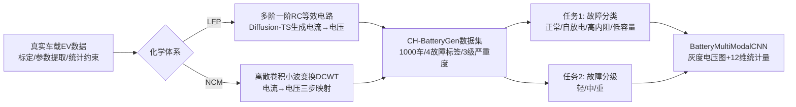

# Battery Fault: A Comprehensive Dataset and Benchmark for Battery Fault Diagnosis

**会议**: ICLR 2026  
**OpenReview**: [https://openreview.net/forum?id=jSM71b1JsV](https://openreview.net/forum?id=jSM71b1JsV)  
**代码**: [https://github.com/CH-BatteryGen/dataset-warehouse](https://github.com/CH-BatteryGen/dataset-warehouse)  
**领域**: 时间序列 / 数据集与基准 / 电池故障诊断  
**关键词**: 电池故障诊断, 时间序列, 生成式数据增强, 电动汽车, LFP/NCM, 基准数据集  

## 一句话总结
本文构建了首个面向真实运行工况的电动汽车电池系统故障诊断数据集 CH-BatteryGen，用"真实车载数据 + 机理约束生成模型"兼顾真实性与规模，覆盖 1000 辆车、两种主流化学体系、四类故障标签与三级严重度，并配套故障分类与故障分级两个基准任务。

## 研究背景与动机
**领域现状**：随着电动汽车（EV）大规模普及，电池安全成为研究焦点。内短路、热失控可能引发起火甚至爆炸，而容量衰减到 80% 以下时续航通常下降 20% 以上。数据驱动的电池故障诊断算法被认为是降低安全风险的关键手段，但它高度依赖大规模、细粒度标注的真实运行数据。

**现有痛点**：现有公开数据集存在三大短板——(1) **规模不足且标签粗糙**：EVBattery 虽有 120 万段充电片段，但只给"正常/异常"二分类标签，无法刻画析锂、内短路等细粒度模式；BatteryML、BatteryLife 等只标注容量退化等级或"容量低于 80%"，不覆盖具体故障类型；(2) **工况覆盖窄**：NASA、HNEI 等实验室数据集与真实车载场景差异大，缺温度分布、单体一致性等关键信息；(3) **缺统一基准**：多数工作沿用 SOH 估计的 RMSE 指标、用自采私有数据，且常忽视类别不平衡（故障样本仅占 5% 时漏检率可达 30%），算法之间无法公平比较。

**核心矛盾**：真实车载故障数据因商业机密与数据安全无法直接公开，而实验室数据又脱离真实工况——**真实性与可共享/可扩展性之间的矛盾**，是制约整个领域的瓶颈。

**本文目标**：构建一个既贴近真实运行工况、又能合规公开并规模化的电池故障诊断基准平台，并配套统一的多任务评测框架。

**核心 idea**：**用大规模真实车载数据标定机理与统计约束，再用机理约束的生成模型合成可公开发布的故障数据**，从而绕开数据安全限制、保留真实工况特征；在此之上设计"故障分类 + 故障分级"双任务基准，系统比较传统机器学习与深度学习方法。

## 方法详解

### 整体框架
CH-BatteryGen 的核心是一条"真实数据标定 → 机理约束生成 → 多任务基准评测"的流水线：先用大规模真实 EV 运行数据做参数提取与统计约束建模，再针对 LFP / NCM 两种化学体系分别用等效电路与小波变换模型把生成的电流序列映射为电压时间序列，最终输出 1000 辆车、四类故障标签、三级严重度的标准化数据集；配套故障分类与故障分级两个任务，并提出一个图像-数值多模态 CNN 基准模型作为强基线。

### 关键设计

**1. 机理约束的故障数据生成：让合成数据保留真实电化学特征。** 由于真实带标签的车载遥测数据受商业机密与数据安全限制无法直接发布，本文不做端到端黑盒生成，而是把真实数据用于**标定、参数提取、统计约束建模与内部验证**，再在物理-数据双约束下生成可公开的数据。两种化学体系采用不同策略：LFP 电池用多个一阶 RC 等效电路串联，以 Diffusion-TS 生成的充放电电流为输入，通过模拟欧姆压降、极化效应与滞回特性，实现"电流→电压时间序列"的映射；NCM 电池则用离散卷积小波变换（DCWT）构建映射模型，经"基线标定、特征矩阵求解、电压映射"三步生成电压序列。与真实测试数据相比，生成单体电压的平均偏差在 10 mV 以内、最大不超过 30 mV，有效复现了真实故障的电压特征。

**2. 四类故障 × 三级严重度的细粒度标签体系。** 数据集为每辆车赋一个故障标签，覆盖正常、自放电、高内阻、低容量四类；对故障车再依据电池包内单体级参数统计给出轻/中/重三级严重度。严重度用包内 95 分位参数（如 96 个单体的容量/电阻，剔除离群值）定义故障指数 $\text{fault\_index}$ 以保证一致性：自放电按漏电容量（An/Day）分级，高内阻按 $R/R_{95}$（如 $1.5 \le \text{fault\_index} < 2.5$ 为轻度），低容量按 $Q/Q_{95}$（如 $\text{fault\_index} < 0.84$ 为重度）。不同故障在充放电曲线上有清晰物理表征：自放电使充电初期电压上升变慢、放电时骤降并高频振荡；高内阻因欧姆压降抬高充电平台、放电初始跌落更陡；低容量则提前到达截止电压、平台更低更短。这种"故障类型 + 严重度"双层标注，弥补了既有数据集只有 SOH 或二分类标签的不足。

**3. 多模态基准模型 BatteryMultiModalCNN：融合图像与统计两路特征。** 为应对不同电池包尺寸、单体数量带来的多尺度故障特征，本文提出图像+数值双路融合模型。图像路把每条电压曲线时间轴归一化到 $[0,1]$ 后绘成 $512 \times 512$ 无坐标轴灰度图，经中值滤波与超分增强后送入改造过的预训练 ResNet50（输入层改为单通道灰度），并在高层嵌入 CBAM 注意力模块以聚焦与故障最相关的通道与空间特征；数值路则从电压序列提取均值、标准差、极值、极差及一致性度量等 12 维全局统计量，经两层全连接映射到 64 维。两路特征拼接后送入多层全连接分类器，分别输出四类（分类）或三类（分级）。其中灰度图捕捉曲线形态、统计量捕捉单体间差异与严重度，二者互补。

**4. 防泄漏的双粒度划分与面向工程的评测协议。** 为保证评测可靠且无信息泄漏，数据划分提供两种策略：**片段级划分**按 8:2 分层抽样切分单个充放电片段；**严格车辆级划分**把同一辆车的所有片段强制分到同一侧，确保测试车的任何片段都不出现在训练集，从而消除车辆特有模式泄漏、给出更保守的跨实例评估。评测采用准确率、召回率、F1 三指标——准确率反映预测可靠性，召回率刻画漏检风险，F1 平衡精度与覆盖，契合"既要可靠又要不漏报"的工程需求。所有指标均在独立测试集上计算以保证可复现性。

## 实验关键数据

### 主实验：故障分类（4 类）F1-score
对比传统方法（RF、SVM）与深度模型（LSTM、CNN），分别在 LFP/NCM × 充/放电 × 片段级/车辆级下评测：

| Task | Model | LFP charge | LFP discharge | NCM charge | NCM discharge |
|------|-------|-----------|---------------|-----------|---------------|
| 片段级 | RF | 0.6908 | 0.6860 | 0.7582 | 0.6808 |
| 片段级 | SVM | 0.7077 | 0.6222 | 0.8033 | 0.7272 |
| 片段级 | LSTM | 0.8558 | 0.8273 | 0.8676 | 0.8374 |
| 片段级 | **CNN** | 0.8647 | **0.9206** | 0.8823 | 0.8732 |
| 车辆级 | RF | 0.7511 | 0.7051 | 0.7782 | 0.7380 |
| 车辆级 | SVM | 0.6025 | 0.6391 | 0.8129 | 0.7935 |
| 车辆级 | LSTM | 0.7685 | 0.8664 | 0.8313 | 0.7460 |
| 车辆级 | **CNN** | 0.8899 | **0.9280** | 0.8897 | 0.8580 |

CNN 在所有化学体系与工况下均最优，LFP 放电车辆级 F1 达 0.9280；传统方法在放电条件下 F1 普遍跌破 0.71。

### 故障分级（3 级）F1-score（仅 LFP）

| Task | Model | LFP charge | LFP discharge |
|------|-------|-----------|---------------|
| 片段级 | RF | 0.5976 | 0.5288 |
| 片段级 | SVM | 0.6419 | 0.5323 |
| 片段级 | LSTM | 0.7289 | 0.7053 |
| 片段级 | **CNN** | 0.8031 | 0.7442 |
| 车辆级 | LSTM | 0.7273 | 0.7205 |
| 车辆级 | **CNN** | **0.8813** | 0.7823 |

### 关键发现
- **CNN 全面领先且更鲁棒**：在分类与分级两任务、两种化学体系、充放电两种工况下，CNN 一致取得最佳 F1，分级任务最高达 0.8813。
- **跨场景敏感性显著**：传统方法在放电工况下 F1 骤降 20% 以上，而深度模型退化更小——放电数据虽更复杂（更贴近真实驾驶），但对模型鲁棒性是关键考验。
- **分级比分类更难**：故障分级整体更具挑战，放电条件下噪声使"轻度/中度"故障易混淆，暴露当前模型在细粒度特征提取上的不足。
- **化学体系差异**：NCM 场景中部分"自放电""高内阻"样本被误判为正常，故障边界不如 LFP 清晰。

## 亮点与洞察
- **"机理约束生成"破解数据共享困局**：用真实数据标定、生成数据发布，在合规前提下保留真实工况特征（电压偏差 ≤30 mV），是工业界敏感数据开放的一条务实路径。
- **首个面向真实工况的 EV 系统级故障诊断数据集**：填补了既有数据集只覆盖 SOH/RUL、缺细粒度故障标签的空白，且同时提供充电与放电数据。
- **双粒度防泄漏划分有诚意**：严格车辆级划分避免了"同车片段跨训练/测试"这一常见但被忽视的泄漏陷阱，使报告指标更可信。
- **多模态把时序问题转成图像+统计问题**：灰度电压图 + 12 维统计量的组合，让 ResNet50 这类成熟视觉骨干也能用于电池故障诊断。

## 局限与展望
- **化学体系覆盖有限**：仅含 NCM 与 LFP 两种，未覆盖钠离子、锌离子等新体系。
- **故障标签种类仍窄**：四类故障之外，析锂、内短路等更细模式尚未单列标签。
- **极端工况数据不足**：高倍率快充、极端温度等场景样本偏少，分级任务在放电噪声下仍易混淆轻/中度故障。
- **合成数据的真实性边界**：尽管做了分布对比验证，生成数据与真实故障在长尾、罕见模式上的差距仍需更多外部验证。
- **分级任务有较大提升空间**：细粒度严重度识别仍是开放问题，未来需面向复杂工况增强特征提取能力。

## 相关工作与启发
- **故障诊断数据集**：EVBattery（120 万充电段，二分类）、BatteryML（383 循环记录，容量退化等级）、BatteryLife（多化学体系，"容量<80%"粗标签）、NASA / HNEI 老化数据集——共性短板是标签粗、脱离真实工况，本文以"细粒度标签 + 真实工况生成"应对。
- **诊断算法谱系**：传统侧依赖手工特征（SVM 频域特征做高内阻检测、RF 用电流-电压斜率检自放电），泛化差；深度侧靠自动特征提取（LSTM 捕捉异常电压波动提前预警内短路、GRU+注意力提升高内阻召回、CNN 分析表面温度预警热失控），性能更优但多用私有数据、缺标准化对比（如 GDN 在 EVBattery 上 AUROC 71.8%、换到 BatteryML 降到 62.3%）。
- **启发**：数据集差异对算法评估影响巨大，统一可复现基准是工程落地的前提；"机理 + 生成"的数据构建范式可推广到其他敏感工业时序数据（如电网、航空发动机）的开放共享。

## 评分
- **新颖性**: ⭐⭐⭐⭐ — 数据集贡献为主，"机理约束生成"用于合规发布真实工况故障数据的思路新颖且实用，但生成与诊断模型本身均为成熟技术组合。
- **实验充分度**: ⭐⭐⭐⭐ — 覆盖两化学体系 × 充放电 × 片段/车辆双粒度 × 4 模型 × 双任务，系统性强；但分级任务仅在 LFP 上做，缺更多骨干网络与外部数据集的交叉验证。
- **写作质量**: ⭐⭐⭐⭐ — 动机清晰、表格与混淆矩阵详实、防泄漏划分交代到位；部分生成机理细节放在附录，正文略显概括。
- **价值**: ⭐⭐⭐⭐ — 首个真实工况 EV 系统级故障诊断基准，已开源，对电池安全与数据驱动诊断研究有明确推动作用，并为敏感工业数据的合规开放提供范式。

<!-- RELATED:START -->

## 相关论文

- [\[ICLR 2026\] Omni-iEEG: A Large-Scale, Comprehensive iEEG Dataset and Benchmark for Epilepsy Research](omni-ieeg_a_large-scale_comprehensive_ieeg_dataset_and_benchmark_for_epilepsy_re.md)
- [\[ICLR 2026\] FeDaL: Federated Dataset Learning for General Time Series Foundation Models](fedal_federated_dataset_learning_for_general_time_series_foundation_models.md)
- [\[ICCV 2025\] VLRMBench: A Comprehensive and Challenging Benchmark for Vision-Language Reward Models](../../ICCV2025/time_series/vlrmbench_a_comprehensive_and_challenging_benchmark_for_vision-language_reward_m.md)
- [\[ICLR 2026\] CTBench: Cryptocurrency Time Series Generation Benchmark](ctbench_cryptocurrency_time_series_generation_benchmark.md)
- [\[ACL 2026\] Time-RA: Towards Time Series Reasoning for Anomaly Diagnosis with LLM Feedback](../../ACL2026/time_series/time-ra_towards_time_series_reasoning_for_anomaly_diagnosis_with_llm_feedback.md)

<!-- RELATED:END -->
