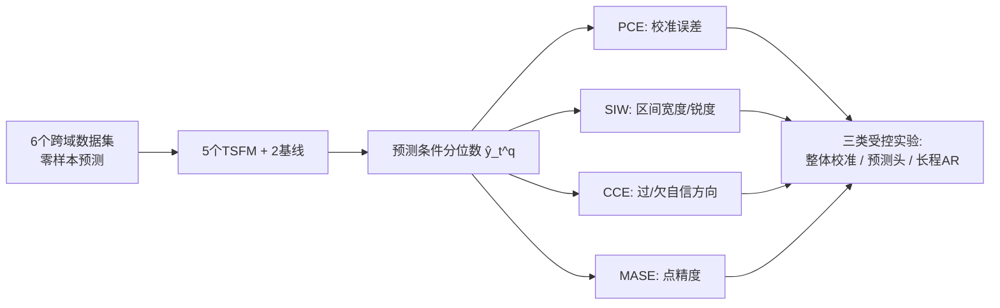

# Beyond Accuracy: Are Time Series Foundation Models Well-Calibrated?

**会议**: ICLR 2026  
**OpenReview**: [https://openreview.net/forum?id=nGBN7UjHcy](https://openreview.net/forum?id=nGBN7UjHcy)  
**代码**: [https://github.com/Coaster41/Beyond-Accuracy-TSFM-Calibration](https://github.com/Coaster41/Beyond-Accuracy-TSFM-Calibration)  
**领域**: 时间序列基础模型 / 不确定性校准  
**关键词**: 时间序列基础模型, 概率校准, PCE, 过自信, 自回归预测, 预测头  

## 一句话总结
作者用一套专门衡量"校准而非锐度"的指标系统评测了 5 个时间序列基础模型（TSFM）与 2 个传统基线，发现 TSFM 不仅点预测更准，概率校准也始终优于基线，且不像图像/文本基础模型那样系统性过自信。

## 研究背景与动机
**领域现状**：时间序列基础模型（TSFM，如 Chronos-Bolt、TimesFM、Moirai 2.0、TiRex、YingLong）正在成为时序预测的主流——它们在海量跨域数据上预训练，对任意序列可直接零样本/少样本预测，无需为每条序列单独建模。这类模型输出的是未来值的条件分布而非单点，分布信息对异常检测、医疗等决策场景至关重要。

**现有痛点**：以往评测几乎只盯着点精度，而对"预测概率是否与真实数据吻合"（即校准）研究极少。更糟的是，社区常用的 CRPS、WQL、MSIS 等指标，被 Chung et al. (2021) 证明同时混合了**校准**与**锐度**（分布的集中程度），会偏向锐利/准确的预测——论文 Figure 1 给出反例：在 Glucose 数据集上 WQL 会错误地把 ARIMA 评为"最佳校准"模型。

**核心矛盾**：人们想知道 TSFM 的不确定性估计是否可信，但手头的指标无法把校准从锐度里剥离出来，导致"TSFM 校准好"这一既有结论并不可靠。

**本文目标**：用真正只衡量校准的指标，系统回答四个问题——TSFM 是否校准良好？是否存在系统性过/欠自信？不同预测头如何影响校准？长程自回归预测下校准如何变化？

**核心 idea**：**[纯校准评测]** 引入 PCE/SIW/CCE 三个分别度量校准误差、锐度、偏向性的指标，跳出 WQL 的混淆陷阱，对 5 个 TSFM + 2 个基线在 6 个跨域数据集上做首次大规模校准研究，并通过替换预测头、对比自回归方法做受控实验。

## 方法详解

### 整体框架
论文不是提出新模型，而是搭建一个**校准评测协议**：固定一组分位数 $q\in\{0.1,\dots,0.9\}$，用三个互补指标分别拆解"校准误差—锐度—偏向"，然后在三个维度上系统比较——基础模型 vs 基线、不同预测头、不同自回归实现。

### 关键设计

**1. PCE：把校准从锐度里剥离出来的核心指标**。论文的立足点是用 Probabilistic Calibration Error 直接衡量"经验 CDF 与预测 CDF 的差距"，对每个分位数 $q$ 统计真值落在预测分位数以下的实际频率，再与名义概率比较：
$$\text{PCE}=\frac{1}{|Q|}\sum_{q\in Q}\left|q-\frac{1}{L}\sum_{t=T+1}^{T+L}\mathbb{1}[y_t\le \hat{y}_t^q]\right|.$$
PCE 取值在 $[0,0.5]$，越低越好——一个 90% 分位数若真覆盖了 90% 的真值，对应项就为 0。与 WQL 不同，它完全不奖励"预测得更尖锐"，因此能避开 Figure 1 那种把 ARIMA 误判为最优的陷阱。这是整篇评测能成立的前提。

**2. SIW + CCE：判定模型是过自信还是欠自信**。光有 PCE 还不够——一个永远预测边缘分布的"懒模型"也能校准良好，所以需要同时看锐度和偏向。Scaled Interval Width 用对称分位区间宽度衡量锐度 $\text{SIW}_s=\frac{1}{L}\sum_t \frac{\hat{y}_t^{q_{high}}-\hat{y}_t^{q_{low}}}{y^{q_{high}}-y^{q_{low}}}$，值越小说明预测越自信；Centered Calibration Error 则比较置信区间内实际落入的数据比例与名义置信度 $s$：
$$\text{CCE}=\frac{1}{|S|}\sum_{s\in S}\left(s-\frac{1}{L}\sum_{t=T+1}^{T+L}\mathbb{1}\!\left[\hat{y}_t^{q_{low}}\le y_t\le \hat{y}_t^{q_{high}}\right]\right).$$
把两者结合就能判方向：CCE 为正且 SIW 小 → 区间太窄、真值频频落外 → **过自信**；CCE 为负且 SIW 大 → 区间太宽 → **欠自信**。这套组合让"系统性偏向"这一问题第一次可量化。

**3. 预测头的可插拔替换实验**。为隔离"backbone 学到的潜在表示"与"预测头形式"对校准的影响，作者用一个与评测集无关的大型混合数据集 TSMixup，为每个冻结的 TSFM backbone 重训四种预测头——分位数头、高斯、Student's t、以及含高斯/t/对数正态/Laplace 的混合分布头。重训的分位数头作为对照，验证它能等价复现原模型预测，从而保证四种头是"同 backbone、仅头不同"的公平对比，干净地回答"头的形式是否影响校准"。

**4. 长程自回归的方法对比**。当目标预测长度 $L$ 远超模型单次前向的预测视野 $H$ 时必须自回归（AR）。论文系统对比三类 AR 实现：朴素点式 AR（只把均值/中位数加回上下文，Chronos-Bolt/TimesFM 用）、分支法（Moirai 2.0 为每个分位数维护独立上下文）、轨迹法（Toto 式，采样 $n\gg|Q|$ 条独立轨迹传播概率信息），并把它们与原生支持长程、无需 AR 的 TiRex/YingLong 对照，从计算成本与校准误差两个角度评估视野长度 $H$ 与 AR 方式的权衡。

## 实验关键数据

设置：5 个 TSFM（Chronos-Bolt、TimesFM、Moirai 2.0、TiRex、YingLong）+ 2 基线（ARIMA、N-BEATS），6 个不同粒度/季节性的真实数据集（Reviews、Shopping(M5)、Glucose、Heart-Rate、Crime、Patents），每个数据集聚合大量上下文-预测组合，总预测数从数千到 36 万不等。

### 主实验：整体校准与偏向

| 维度 | 指标 | TSFM 表现 | 基线表现 |
|------|------|-----------|----------|
| 点精度 | MASE | 普遍优于基线（多数低于 N-BEATS/ARIMA） | 较差 |
| 校准误差 | PCE | 多数接近或低于 5%，64 步外仍稳定 | 始终偏高 |
| 偏向 | CCE | 无系统性过/欠自信 | 一致**欠自信** |

注：Patents 数据集所有方法 PCE 都高（任务本身近乎无线性可预测性，仅 1–2 阶滞后有意义）。

### 消融：预测头 / 长程 AR

| 实验 | 关键对比 | 结论 |
|------|----------|------|
| 预测头 | 分位数 vs t vs 混合 vs 高斯 | 前三者校准几乎无差异；**高斯头一致欠自信、校准最差** |
| 长程 AR | 分支法 vs 轨迹法，$H\in\{16,32,64,128\}$ | 视野越短越过自信；**轨迹法优于分支法**；非 AR（TiRex/YingLong）最优且最高效 |

### 关键发现
- TSFM 在 PCE 上普遍低于 5%，且没有任何单一 TSFM 显著主导，说明这是这类模型的普遍属性而非个例。
- TSFM **不像图像/文本基础模型那样过自信**——作者归因于 TSFM 直接用校准感知损失（最小化 WQL）训练，而图像/文本模型只优化重建/分类误差。
- 高斯头表达力受限导致欠自信与高校准误差，更具表达力的分布反而不会过拟合、校准更好。
- 长程预测中所有 AR 方法都过自信，分支法在短视野（16/32）下 CCE 常超 0.15，随视野增大急剧改善；轨迹法虽更贵但校准更好。

## 亮点与洞察
- **指标层面的纠偏**：用一个具体反例（Figure 1，WQL 误判 ARIMA）戳破"WQL=校准好"的惯性认知，再用 PCE/CCE 重做评测，方法论价值高于单纯刷榜。
- **跨模态的反直觉结论**：图像/文本大模型几乎都过自信，而 TSFM 不过自信，并把根因落到"训练损失是否校准感知"上——这是一个干净且可迁移的解释。
- **可插拔头实验设计漂亮**：冻结 backbone、用独立数据 TSMixup 重训多种头，把"表示"与"头形式"两个变量真正解耦。
- **给实践者的明确建议**：避免高斯头、长程预测优先选原生长视野模型或轨迹式 AR。

## 局限与展望
- 仅评测**零样本单变量**预测，未覆盖微调与多变量场景，而微调可能改变校准结论。
- 校准只针对固定分位数集 $\{0.1,\dots,0.9\}$，更高分辨率分位数与尾部校准未深入。
- 未考察**分布漂移/非平稳**下的校准——而深度分类模型对分布漂移的校准敏感性是已知问题，这对时序尤其关键。
- "TSFM 不过自信源于校准感知损失"是合理推测但未做因果验证，可设计训练损失消融进一步确认。

## 相关工作与启发
本文承接两条线索：一是深度学习校准研究（Guo et al. 图像过自信、LLM 问答过自信），二是时序概率预测评测（CRPS/WQL/MSIS）。其关键依据是 Chung et al. (2021) 证明 CRPS/WQL/MSIS 同时测量校准与锐度。启发在于——**评测指标的选择本身会改变结论**，任何声称"模型 X 校准好"的工作都应先确认指标是否被锐度污染；同时"用校准感知损失训练 → 不过自信"这一观察，可能反过来指导其他模态基础模型的不确定性设计。

## 评分
- 新颖性: ⭐⭐⭐⭐ 不提新模型，但首次用纯校准指标系统重做 TSFM 评测并得出反直觉结论，问题切入与指标纠偏有真正价值
- 实验充分度: ⭐⭐⭐⭐ 5 模型 × 2 基线 × 6 数据集，覆盖整体校准、预测头、长程 AR 三类受控实验，并含合成数据对照
- 写作质量: ⭐⭐⭐⭐ 动机清晰、指标定义严谨、用 Figure 1 反例点题有力，结论组织有条理
- 价值: ⭐⭐⭐⭐ 给 TSFM 不确定性评估提供了可复用的协议与实践指南，对依赖概率预测的下游决策场景意义明确

<!-- RELATED:START -->

## 相关论文

- [\[ICLR 2026\] Understanding the Implicit Biases of Design Choices for Time Series Foundation Models](understanding_the_implicit_biases_of_design_choices_for_time_series_foundation_m.md)
- [\[ICLR 2026\] Adapt Data to Model: Adaptive Transformation Optimization for Domain-shared Time Series Foundation Models](adapt_data_to_model_adaptive_transformation_optimization_for_domain-shared_time_.md)
- [\[ICLR 2026\] FeDaL: Federated Dataset Learning for General Time Series Foundation Models](fedal_federated_dataset_learning_for_general_time_series_foundation_models.md)
- [\[ICLR 2026\] When Foundation Models Are One-Liners: Limitations and Future Directions for Time Series Anomaly Detection](when_foundation_models_are_one-liners_limitations_and_future_directions_for_time.md)
- [\[ICML 2026\] OLIVIA: Harmonizing Time Series Foundation Models with Power Spectral Density](../../ICML2026/time_series/olivia_harmonizing_time_series_foundation_models_with_power_spectral_density.md)

<!-- RELATED:END -->
